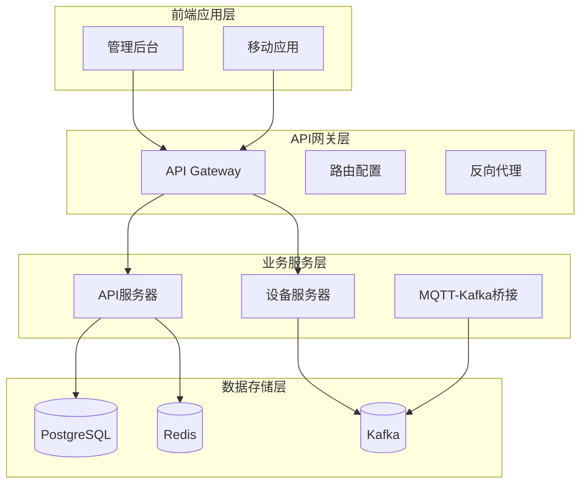
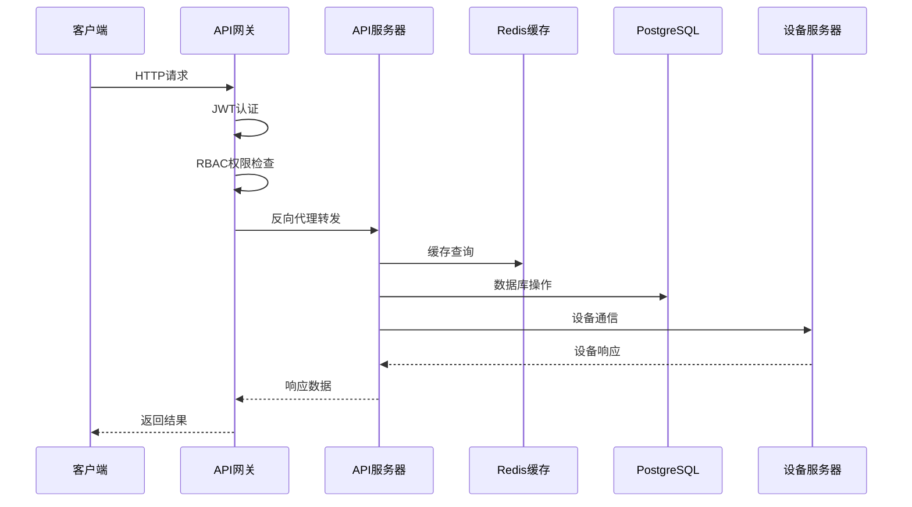
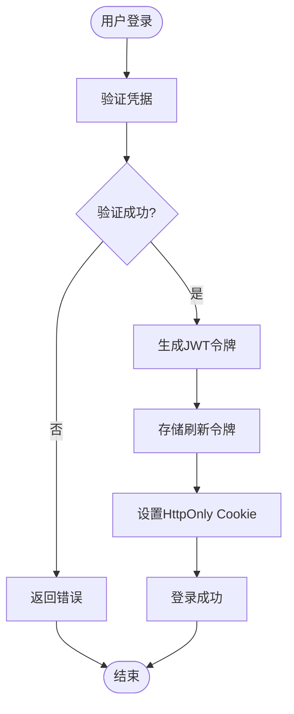
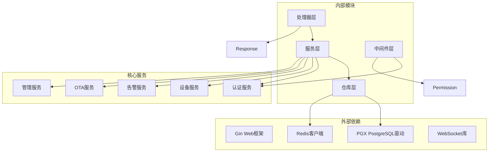

# API参考文档

<cite>
**本文档引用的文件**
- [main.go](file://api-gateway/main.go)
- [routes.go](file://api-gateway/internal/routes/routes.go)
- [main.go](file://inv_api_server/cmd/main.go)
- [device_handler.go](file://inv_api_server/internal/handler/device_handler.go)
- [auth_handler.go](file://inv_api_server/internal/handler/auth_handler.go)
- [alarm_handler.go](file://inv_api_server/internal/handler/alarm_handler.go)
- [ota_handler.go](file://inv_api_server/internal/handler/ota_handler.go)
- [ws_handler.go](file://inv_api_server/internal/handler/ws_handler.go)
- [admin_handler.go](file://inv_api_server/internal/handler/admin_handler.go)
- [auth.go](file://inv_api_server/internal/middleware/auth.go)
- [permission.go](file://inv_api_server/internal/middleware/permission.go)
- [response.go](file://inv_api_server/pkg/response/response.go)
</cite>

## 目录
1. [简介](#简介)
2. [项目结构](#项目结构)
3. [核心组件](#核心组件)
4. [架构概览](#架构概览)
5. [详细组件分析](#详细组件分析)
6. [依赖关系分析](#依赖关系分析)
7. [性能考虑](#性能考虑)
8. [故障排除指南](#故障排除指南)
9. [结论](#结论)
10. [附录](#附录)

## 简介
本项目是一个基于Go语言开发的光伏逆变器监控系统，采用微服务架构设计。系统包含API网关、API服务器、设备服务器等多个组件，提供完整的设备管理、用户管理、告警管理和OTA升级功能。

## 项目结构
项目采用多模块架构，主要包含以下核心模块：



**图表来源**
- [main.go:21-94](file://api-gateway/main.go#L21-L94)
- [routes.go:25-55](file://api-gateway/internal/routes/routes.go#L25-L55)

**章节来源**
- [main.go:1-129](file://api-gateway/main.go#L1-L129)
- [routes.go:1-195](file://api-gateway/internal/routes/routes.go#L1-L195)

## 核心组件

### API网关
API网关作为系统的统一入口，提供路由转发、认证授权、限流熔断等功能。

### API服务器
API服务器提供核心业务接口，包括用户管理、设备管理、告警管理、OTA升级等模块。

### 设备服务器
专门处理设备实时数据和控制指令的服务器。

### 中间件层
提供认证、授权、限流、CORS等通用中间件功能。

**章节来源**
- [main.go:36-86](file://inv_api_server/cmd/main.go#L36-L86)
- [auth.go:15-56](file://inv_api_server/internal/middleware/auth.go#L15-L56)

## 架构概览



**图表来源**
- [routes.go:74-105](file://api-gateway/internal/routes/routes.go#L74-L105)
- [auth.go:15-56](file://inv_api_server/internal/middleware/auth.go#L15-L56)

## 详细组件分析

### 认证与授权机制

#### JWT Token管理
系统采用JWT进行用户身份认证，支持访问令牌和刷新令牌机制：



**图表来源**
- [auth_handler.go:65-153](file://inv_api_server/internal/handler/auth_handler.go#L65-L153)
- [auth.go:15-56](file://inv_api_server/internal/middleware/auth.go#L15-L56)

#### RBAC权限控制
系统实现基于角色的访问控制，支持细粒度的权限管理：

**章节来源**
- [auth_handler.go:1-814](file://inv_api_server/internal/handler/auth_handler.go#L1-L814)
- [auth.go:1-255](file://inv_api_server/internal/middleware/auth.go#L1-L255)
- [permission.go:1-89](file://inv_api_server/internal/middleware/permission.go#L1-L89)

### 设备管理API

#### 设备CRUD操作
提供完整的设备生命周期管理功能：

**设备列表查询**
- 方法: GET
- 路径: `/api/v1/devices`
- 认证: 是
- 权限: 用户视图权限
- 参数: page, pageSize, station_id, status

**设备详情查询**
- 方法: GET
- 路径: `/api/v1/devices/:sn`
- 认证: 是
- 权限: 用户视图权限

**设备绑定操作**
- 方法: POST
- 路径: `/api/v1/devices/bind`
- 认证: 是
- 权限: 用户编辑权限

**设备控制指令**
- 方法: POST
- 路径: `/api/v1/devices/:sn/control`
- 认证: 是
- 权限: 设备控制权限

**章节来源**
- [device_handler.go:32-800](file://inv_api_server/internal/handler/device_handler.go#L32-L800)

#### 设备状态查询
系统支持多种设备状态查询方式：

**实时数据查询**
- 方法: GET
- 路径: `/api/v1/devices/:sn/realtime`
- 认证: 是
- 权限: 用户视图权限

**历史数据查询**
- 方法: GET
- 路径: `/api/v1/devices/:sn/history`
- 认证: 是
- 权限: 用户视图权限

**统计数据查询**
- 方法: GET
- 路径: `/api/v1/devices/:sn/statistics`
- 认证: 是
- 权限: 用户视图权限

### 用户管理API

#### 用户认证接口
提供多种用户登录方式：

**手机号登录**
- 方法: POST
- 路径: `/api/v1/auth/login`
- 认证: 否
- 权限: 无需权限

**邮箱注册**
- 方法: POST
- 路径: `/api/v1/auth/email-register`
- 认证: 否
- 权限: 无需权限

**用户资料管理**
- 方法: GET/PUT
- 路径: `/api/v1/auth/profile`
- 认证: 是
- 权限: 用户自身权限

**章节来源**
- [auth_handler.go:65-800](file://inv_api_server/internal/handler/auth_handler.go#L65-L800)

#### 管理员用户管理
管理员可以对用户进行全量管理：

**用户列表查询**
- 方法: GET
- 路径: `/api/v1/admin/users`
- 认证: 是
- 权限: 系统管理权限

**用户角色管理**
- 方法: PUT
- 路径: `/api/v1/admin/users/:id/role`
- 认证: 是
- 权限: 系统管理权限

### 告警管理API

#### 告警查询接口
提供灵活的告警查询和管理功能：

**告警列表查询**
- 方法: GET
- 路径: `/api/v1/alarms`
- 认证: 是
- 权限: 用户视图权限
- 参数: station_id, status, keyword, alarmLevel, page, page_size

**告警详情查询**
- 方法: GET
- 路径: `/api/v1/alarms/:id`
- 认证: 是
- 权限: 用户视图权限

**告警状态管理**
- 方法: PUT/POST/DELETE
- 路径: `/api/v1/alarms/:id/handle`, `/api/v1/alarms/:id/acknowledge`, `/api/v1/alarms/:id/ignore`, `/api/v1/alarms/:id`
- 认证: 是
- 权限: 用户处理权限

**章节来源**
- [alarm_handler.go:22-256](file://inv_api_server/internal/handler/alarm_handler.go#L22-L256)

### OTA升级API

#### 固件管理
支持固件的上传、管理和版本控制：

**固件上传**
- 方法: POST
- 路径: `/api/v1/ota/firmware`
- 认证: 是
- 权限: OTA创建权限
- 支持: 文件上传和JSON两种方式

**固件列表查询**
- 方法: GET
- 路径: `/api/v1/ota/firmware`
- 认证: 是
- 权限: OTA查看权限

**章节来源**
- [ota_handler.go:40-186](file://inv_api_server/internal/handler/ota_handler.go#L40-L186)

#### 升级任务管理
提供完整的OTA升级任务管理功能：

**推送升级任务**
- 方法: POST
- 路径: `/api/v1/ota/upgrades/push`
- 认证: 是
- 权限: OTA创建权限

**升级任务状态查询**
- 方法: GET
- 路径: `/api/v1/ota/upgrades/firmware/:firmwareId`
- 认证: 是
- 权限: OTA查看权限

**设备升级状态**
- 方法: GET
- 路径: `/api/v1/ota/devices/:sn/status`
- 认证: 是
- 权限: OTA查看权限

### WebSocket API

#### 实时数据推送
系统提供WebSocket连接用于实时数据传输：

**连接建立**
- 方法: GET
- 路径: `/ws/device/:sn`
- 认证: 是
- 参数: token (JWT令牌)
- 权限: 设备访问权限

**连接限制**
- 每个用户最多5个并发连接
- 心跳检测每30秒一次
- Ping/Pong机制保证连接有效性

**章节来源**
- [ws_handler.go:39-122](file://inv_api_server/internal/handler/ws_handler.go#L39-L122)

## 依赖关系分析



**图表来源**
- [main.go:88-162](file://inv_api_server/cmd/main.go#L88-L162)
- [auth.go:1-255](file://inv_api_server/internal/middleware/auth.go#L1-L255)

**章节来源**
- [main.go:88-162](file://inv_api_server/cmd/main.go#L88-L162)
- [auth.go:1-255](file://inv_api_server/internal/middleware/auth.go#L1-L255)

## 性能考虑

### 缓存策略
系统采用多层缓存机制提升性能：

1. **Redis缓存**: 用户会话、权限信息、设备状态
2. **数据库连接池**: 最大连接数优化
3. **静态文件缓存**: 固件文件、图片资源

### 限流机制
- 全局IP限流: 10请求/秒，突发20
- 路由级别限流: 针对敏感接口
- 并发连接限制: WebSocket每用户5连接

### 异步处理
- 设备数据通过MQTT/Kafka异步传输
- OTA升级任务异步执行
- 日志和审计信息异步写入

## 故障排除指南

### 常见错误码

| 错误码 | 描述 | 解决方案 |
|--------|------|----------|
| 4001 | 用户不存在 | 检查用户账号是否正确 |
| 4002 | 账户被禁用 | 联系管理员启用账户 |
| 4003 | 密码错误 | 重新输入正确密码 |
| 4004 | 手机号已注册 | 使用其他手机号注册 |
| 4005 | 验证码错误 | 重新获取验证码 |
| 4007 | 旧密码不正确 | 输入正确的原密码 |
| 4008 | 邮箱格式不正确 | 检查邮箱格式 |
| 4010 | 邮箱已被注册 | 使用其他邮箱地址 |
| 4029 | 请求过于频繁 | 等待冷却时间后重试 |
| 5001 | 设备不存在 | 检查设备序列号 |
| 5002 | 设备已被绑定 | 解绑后重新绑定 |
| 5003 | 发送命令失败 | 检查网络连接 |

### 连接问题诊断

**WebSocket连接失败**
1. 检查JWT令牌是否有效
2. 验证设备序列号格式
3. 确认Redis服务正常运行
4. 查看服务器日志获取详细错误

**API接口超时**
1. 检查数据库连接状态
2. 验证Redis缓存可用性
3. 监控系统负载情况
4. 检查网络延迟

**章节来源**
- [response.go:1-92](file://inv_api_server/pkg/response/response.go#L1-L92)
- [ws_handler.go:39-122](file://inv_api_server/internal/handler/ws_handler.go#L39-L122)

## 结论
本系统提供了完整的API解决方案，具有以下特点：

1. **模块化设计**: 清晰的分层架构，便于维护和扩展
2. **安全性**: 多层次的安全防护，包括JWT认证、RBAC权限控制
3. **高性能**: 多层缓存、异步处理、连接池优化
4. **可扩展性**: 微服务架构，支持水平扩展
5. **易用性**: 完善的API文档和错误处理机制

系统适用于大规模的设备监控场景，能够满足光伏逆变器监控系统的各种需求。

## 附录

### API使用示例

#### 用户登录示例
```javascript
// JavaScript示例
fetch('/api/v1/auth/login', {
  method: 'POST',
  headers: {
    'Content-Type': 'application/json',
  },
  body: JSON.stringify({
    account: '13800001111',
    password: 'your_password'
  })
})
.then(response => response.json())
.then(data => {
  console.log('登录成功:', data.access_token);
});
```

#### 设备控制示例
```javascript
// 设备控制示例
const controlData = {
  command: 'set_power_limit',
  params: {
    limit: 5000,
    unit: 'W'
  }
};

fetch(`/api/v1/devices/${deviceSN}/control`, {
  method: 'POST',
  headers: {
    'Authorization': `Bearer ${accessToken}`,
    'Content-Type': 'application/json'
  },
  body: JSON.stringify(controlData)
});
```

### SDK集成指南

#### 前端SDK集成步骤
1. 安装SDK包
2. 初始化客户端配置
3. 实现认证流程
4. 调用API接口
5. 处理响应数据

#### 移动端集成要点
- 使用HTTPS协议
- 实现自动重连机制
- 处理网络异常情况
- 优化内存使用

### 测试工具

#### Postman集合
系统提供完整的Postman测试集合，包含：
- 认证测试用例
- 设备管理测试用例
- 告警管理测试用例
- OTA升级测试用例

#### 自动化测试
- 单元测试覆盖率要求
- 集成测试自动化
- 性能基准测试
- 安全漏洞扫描