# OTA升级API

<cite>
**本文档引用的文件**
- [inv_api_server/cmd/main.go](file://inv_api_server/cmd/main.go)
- [inv_api_server/internal/handler/ota_handler.go](file://inv_api_server/internal/handler/ota_handler.go)
- [inv_api_server/internal/service/ota_service.go](file://inv_api_server/internal/service/ota_service.go)
- [inv_api_server/internal/model/models.go](file://inv_api_server/internal/model/models.go)
- [inv_api_server/internal/repository/ota_repository.go](file://inv_api_server/internal/repository/ota_repository.go)
- [api-gateway/internal/middleware/rbac.go](file://api-gateway/internal/middleware/rbac.go)
- [inv_device_server/internal/mqtt/client.go](file://inv_device_server/internal/mqtt/client.go)
- [README.md](file://README.md)
- [database/migrations/010_add_dsp_bms_versions.up.sql](file://database/migrations/010_add_dsp_bms_versions.up.sql)
</cite>

## 更新摘要
**变更内容**
- 新增四个管理端设备-固件关系查询API：GET /ota/firmware/devices、GET /ota/firmware/package-devices、GET /ota/devices/:sn/package-upgrade/:packageId、GET /ota/devices/:sn/upgrade-packages
- 增强多芯片固件版本跟踪，支持DSP和BMS芯片版本管理
- 完善设备升级包详情查询功能，提供各芯片升级进度跟踪
- 优化设备所有权验证机制，确保移动端接口安全性

## 目录
1. [简介](#简介)
2. [项目结构](#项目结构)
3. [核心组件](#核心组件)
4. [架构总览](#架构总览)
5. [详细组件分析](#详细组件分析)
6. [依赖关系分析](#依赖关系分析)
7. [性能考虑](#性能考虑)
8. [故障排除指南](#故障排除指南)
9. [结论](#结论)
10. [附录](#附录)

## 简介
本文件为OTA升级API的完整技术文档，覆盖固件管理、升级任务创建与管理、进度查询、回滚与失败处理、统计报表以及设备端集成协议。系统采用后端API服务器与设备侧服务分离的架构，通过MQTT通道实现设备与云端的双向通信。

**更新** 本次更新新增了四个面向管理端的设备-固件关系查询API，增强了多芯片固件版本跟踪能力（支持DSP和BMS），并完善了设备升级包详情查询功能，进一步提升了系统的可观测性和管理能力。

## 项目结构
- API网关：统一入口与中间件（鉴权、CORS、限流等）
- API服务器：提供OTA相关REST接口与内部状态上报接口
- 设备侧服务：负责MQTT订阅与命令下发
- 设备端应用：接收升级命令、执行升级并上报进度

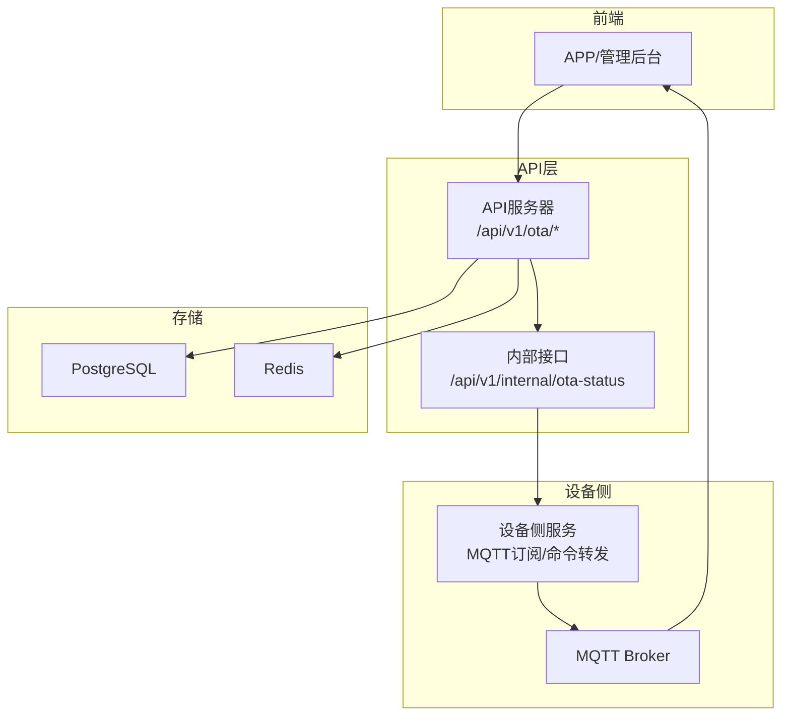

**图示来源**
- [inv_api_server/cmd/main.go:395-578](file://inv_api_server/cmd/main.go#L395-L578)
- [inv_device_server/internal/mqtt/client.go:248-283](file://inv_device_server/internal/mqtt/client.go#L248-L283)

**章节来源**
- [inv_api_server/cmd/main.go:395-578](file://inv_api_server/cmd/main.go#L395-L578)
- [README.md:253-342](file://README.md#L253-L342)

## 核心组件
- OTA处理器（Handler）：封装HTTP路由与请求参数校验，调用服务层执行业务逻辑
- OTA服务（Service）：协调固件信息、设备升级任务、MQTT命令下发与状态更新
- OTA仓库（Repository）：数据库访问层，提供固件、设备升级任务的CRUD与聚合查询
- 设备侧MQTT客户端：根据命令类型选择对应MQTT主题并发送升级命令

**更新** 新增了设备-固件关系查询处理器方法，包括按固件版本查询设备列表、按升级包查询设备列表、获取设备升级包详情等功能，提供了更强大的设备管理能力。

**章节来源**
- [inv_api_server/internal/handler/ota_handler.go:20-26](file://inv_api_server/internal/handler/ota_handler.go#L20-L26)
- [inv_api_server/internal/service/ota_service.go:22-42](file://inv_api_server/internal/service/ota_service.go#L22-L42)
- [inv_api_server/internal/repository/ota_repository.go](file://inv_api_server/internal/repository/ota_repository.go)
- [inv_device_server/internal/mqtt/client.go:259-283](file://inv_device_server/internal/mqtt/client.go#L259-L283)

## 架构总览
OTA升级流程从固件上传开始，管理员创建升级任务并推送到目标设备；设备通过MQTT接收升级命令，下载固件并执行升级；设备周期性上报进度与结果，API服务器更新数据库并向前端展示。

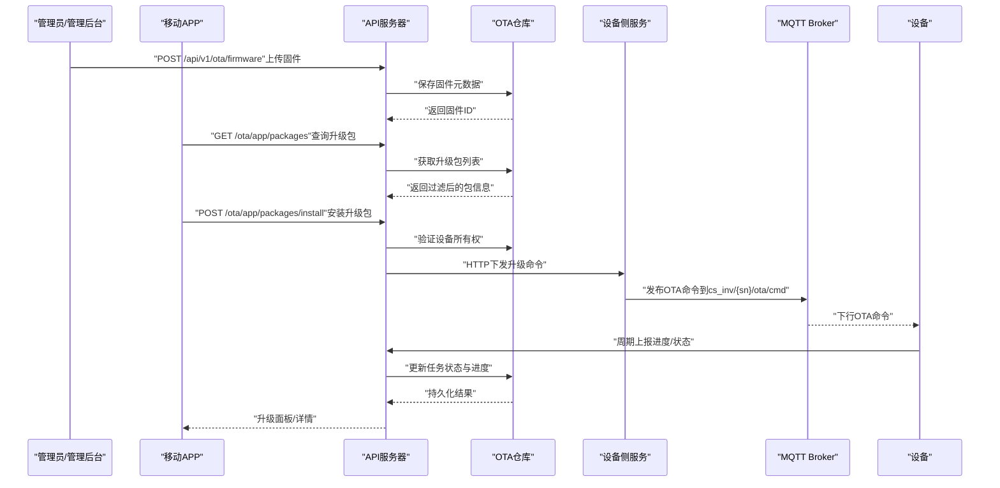

**图示来源**
- [inv_api_server/cmd/main.go:548-558](file://inv_api_server/cmd/main.go#L548-558)
- [inv_api_server/internal/service/ota_service.go:118-181](file://inv_api_server/internal/service/ota_service.go#L118-181)
- [inv_device_server/internal/mqtt/client.go:264-283](file://inv_device_server/internal/mqtt/client.go#L264-283)
- [README.md:257-279](file://README.md#L257-279)

## 详细组件分析

### 固件管理接口
- 接口列表
  - GET /api/v1/ota/firmware：列出固件（带分页）
  - GET /api/v1/ota/firmware/:id：获取固件详情
  - POST /api/v1/ota/firmware：上传固件（支持表单上传）
  - DELETE /api/v1/ota/firmware/:id：删除固件
- 请求参数与响应
  - 上传固件支持表单字段：model、target_chip、version、changelog、is_force、文件
  - 返回成功消息或错误码
- 关键行为
  - 自动生成主版本号（基于目标芯片的最大主版本号+1）
  - 自动计算文件MD5与SHA256
  - 支持强制升级标记

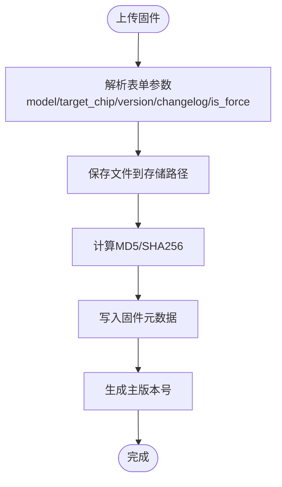

**图示来源**
- [inv_api_server/internal/handler/ota_handler.go:40-186](file://inv_api_server/internal/handler/ota_handler.go#L40-L186)
- [inv_api_server/internal/service/ota_service.go:56-109](file://inv_api_server/internal/service/ota_service.go#L56-L109)

**章节来源**
- [inv_api_server/cmd/main.go:549-552](file://inv_api_server/cmd/main.go#L549-L552)
- [inv_api_server/internal/handler/ota_handler.go:28-38](file://inv_api_server/internal/handler/ota_handler.go#L28-L38)
- [inv_api_server/internal/service/ota_service.go:44-54](file://inv_api_server/internal/service/ota_service.go#L44-L54)

### 升级任务创建与管理
- 接口列表
  - POST /api/v1/ota/upgrades/push：推送升级（支持批量设备）
  - GET /api/v1/ota/upgrades/dashboard：升级管理面板（按固件分组聚合）
  - GET /api/v1/ota/upgrades/firmware/:firmwareId：指定固件的升级详情
  - POST /api/v1/ota/upgrades/retry：重试失败任务
  - POST /api/v1/ota/upgrades/cancel：取消待执行任务
- 请求参数与行为
  - 推送升级：firmware_id、device_sns数组、immediate标志
  - 重试：firmware_id + device_sns数组
  - 取消：device_sn + firmware_id
- 内部机制
  - 批量并发控制（信号量+等待组）
  - 为每个设备UPSERT升级记录并发送MQTT命令
  - immediate=true时直接下发升级命令，否则仅创建任务

**更新** 新增了任务取消功能，支持对进行中的任务进行精确控制。取消任务时会检查任务状态，防止对已完成或已取消的任务进行重复操作。

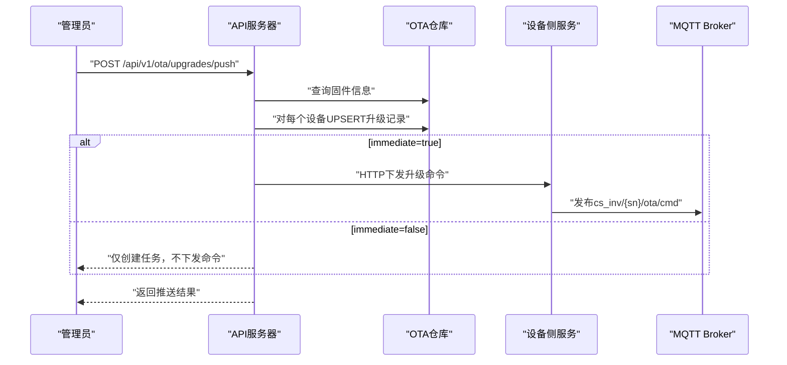

**图示来源**
- [inv_api_server/cmd/main.go:554-558](file://inv_api_server/cmd/main.go#L554-L558)
- [inv_api_server/internal/handler/ota_handler.go:189-214](file://inv_api_server/internal/handler/ota_handler.go#L189-L214)
- [inv_api_server/internal/service/ota_service.go:118-181](file://inv_api_server/internal/service/ota_service.go#L118-L181)
- [inv_device_server/internal/mqtt/client.go:264-283](file://inv_device_server/internal/mqtt/client.go#L264-L283)

**章节来源**
- [inv_api_server/internal/handler/ota_handler.go:189-278](file://inv_api_server/internal/handler/ota_handler.go#L189-L278)
- [inv_api_server/internal/service/ota_service.go:111-181](file://inv_api_server/internal/service/ota_service.go#L111-L181)

### 设备-固件关系查询接口（新增）
- 接口列表
  - GET /ota/firmware/devices：按固件版本查询使用该版本的设备（管理端）
  - GET /ota/firmware/package-devices：按升级包查询已安装/正在安装的设备（管理端）
  - GET /ota/devices/:sn/package-upgrade/:packageId：获取设备在指定升级包下的各芯片升级进度
  - GET /ota/devices/:sn/upgrade-packages：通过设备SN查询可用的升级包列表
- 请求参数与行为
  - 按固件版本查询：需要model、target_chip、version参数，支持arm/esp/dsp/bms四种芯片类型
  - 按升级包查询：需要package_id参数，可选status参数过滤状态
  - 设备升级包详情：需要设备SN和升级包ID，返回各芯片的详细升级状态
  - 设备可用升级包：需要设备SN，返回该设备型号对应的所有可用升级包
- 安全机制
  - 管理端接口：需要ota:view权限
  - 设备端接口：需要JWT认证和设备所有权验证
  - 芯片类型验证：只允许arm、esp、dsp、bms四种有效芯片类型

**更新** 新增了四个强大的设备-固件关系查询接口，支持按固件版本和升级包维度查询设备分布，提供详细的设备升级包信息和各芯片升级进度跟踪。

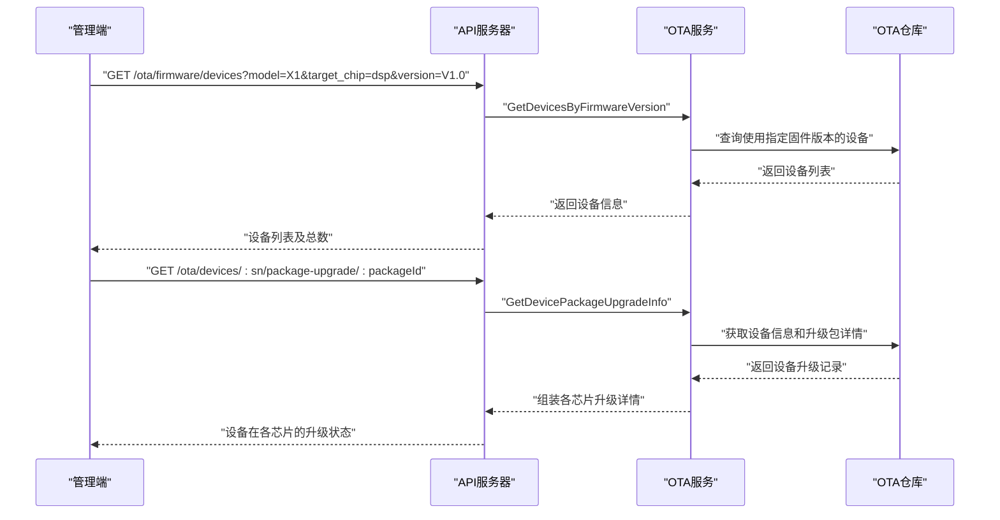

**图示来源**
- [inv_api_server/cmd/main.go:685-698](file://inv_api_server/cmd/main.go#L685-L698)
- [inv_api_server/internal/handler/ota_handler.go:1103-1257](file://inv_api_server/internal/handler/ota_handler.go#L1103-L1257)
- [inv_api_server/internal/service/ota_service.go:407-511](file://inv_api_server/internal/service/ota_service.go#L407-L511)
- [inv_api_server/internal/repository/ota_repository.go:1240-1315](file://inv_api_server/internal/repository/ota_repository.go#L1240-L1315)

**章节来源**
- [inv_api_server/cmd/main.go:685-698](file://inv_api_server/cmd/main.go#L685-L698)
- [inv_api_server/internal/handler/ota_handler.go:1103-1257](file://inv_api_server/internal/handler/ota_handler.go#L1103-L1257)
- [inv_api_server/internal/service/ota_service.go:407-511](file://inv_api_server/internal/service/ota_service.go#L407-L511)

### App端升级包管理接口
- 接口列表
  - GET /ota/app/packages：查询升级包列表（过滤敏感字段）
  - POST /ota/app/packages/install：安装指定升级包（设备所有权验证）
- 请求参数与行为
  - 查询升级包：需要model参数，返回过滤后的包信息
  - 安装升级包：需要sn和package_id参数，验证设备所有权后执行安装
- 安全机制
  - 设备所有权验证：确保用户只能操作自己拥有的设备
  - 敏感字段过滤：只返回App端需要的最小数据集
  - JWT认证保护：所有登录用户可访问，无需额外RBAC权限

**更新** 新增了面向App端的升级包管理功能，提供了安全的升级包查询和安装接口，支持设备所有权验证和敏感数据过滤。

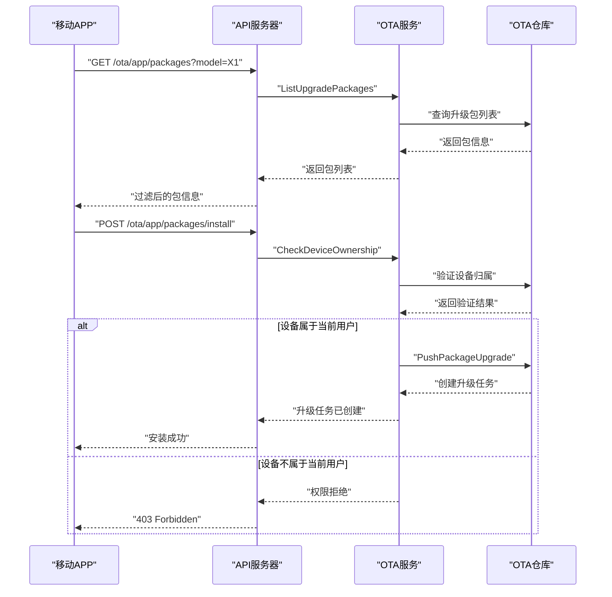

**图示来源**
- [inv_api_server/internal/handler/ota_handler.go:1015-1101](file://inv_api_server/internal/handler/ota_handler.go#L1015-L1101)
- [inv_api_server/internal/service/ota_service.go:621-625](file://inv_api_server/internal/service/ota_service.go#L621-L625)
- [inv_api_server/internal/repository/ota_repository.go:406-424](file://inv_api_server/internal/repository/ota_repository.go#L406-L424)

**章节来源**
- [inv_api_server/cmd/main.go:692-693](file://inv_api_server/cmd/main.go#L692-L693)
- [inv_api_server/internal/handler/ota_handler.go:1015-1101](file://inv_api_server/internal/handler/ota_handler.go#L1015-L1101)
- [api-gateway/internal/middleware/rbac.go:197-199](file://api-gateway/internal/middleware/rbac.go#L197-L199)

### 升级进度查询与状态更新
- 接口列表
  - GET /api/v1/ota/devices/:sn/status：获取设备当前升级状态
  - GET /api/v1/ota/devices/:sn/history：获取设备升级历史
  - POST /api/v1/internal/ota-status：内部接口，接收设备上报的状态
- 设备端上报格式
  - 字段：device_id、current_version、state、progress、status_message、error_message
- 内部接口行为
  - 解析上报内容，更新数据库中的任务状态与进度

**更新** 新增了支持active状态过滤的任务查询功能，允许用户查询正在进行中的任务（排除已完成和已取消的任务）。

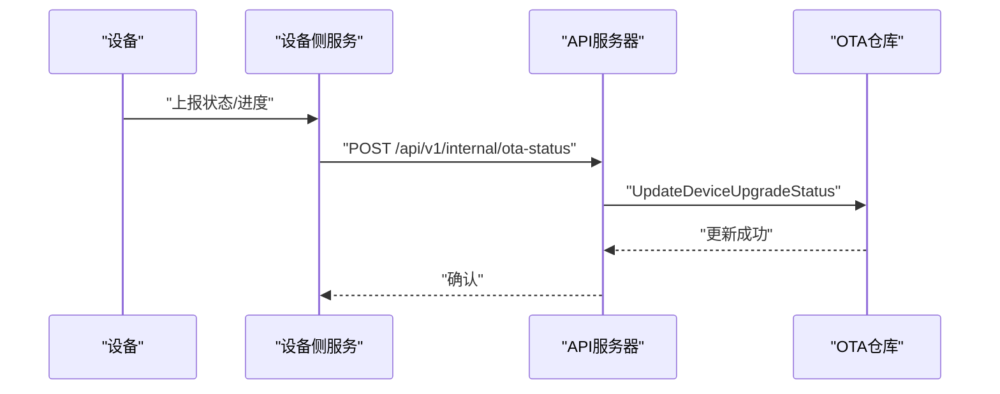

**图示来源**
- [inv_api_server/cmd/main.go:389](file://inv_api_server/cmd/main.go#L389)
- [inv_api_server/internal/service/ota_service.go:242-244](file://inv_api_server/internal/service/ota_service.go#L242-L244)
- [README.md:281-313](file://README.md#L281-L313)

**章节来源**
- [inv_api_server/cmd/main.go:561-564](file://inv_api_server/cmd/main.go#L561-L564)
- [inv_api_server/internal/handler/ota_handler.go:344-367](file://inv_api_server/internal/handler/ota_handler.go#L344-L367)
- [inv_api_server/internal/service/ota_service.go:241-244](file://inv_api_server/internal/service/ota_service.go#L241-L244)

### 升级回滚与失败处理
- 回滚能力
  - 提供回滚相关接口（如POST /api/v1/ota/app/versions/:id/rollback），用于应用版本回滚
- 失败处理
  - 重试失败任务：POST /api/v1/ota/upgrades/retry
  - 取消待执行任务：POST /api/v1/ota/upgrades/cancel
  - 任务状态自动标记为失败并保留错误信息

**更新** 增强了错误处理机制，所有API调用都经过统一的错误处理层，提供更精确的错误信息和状态码。新增的CancelTask方法实现了可靠的取消逻辑，包括状态检查和原子性更新。

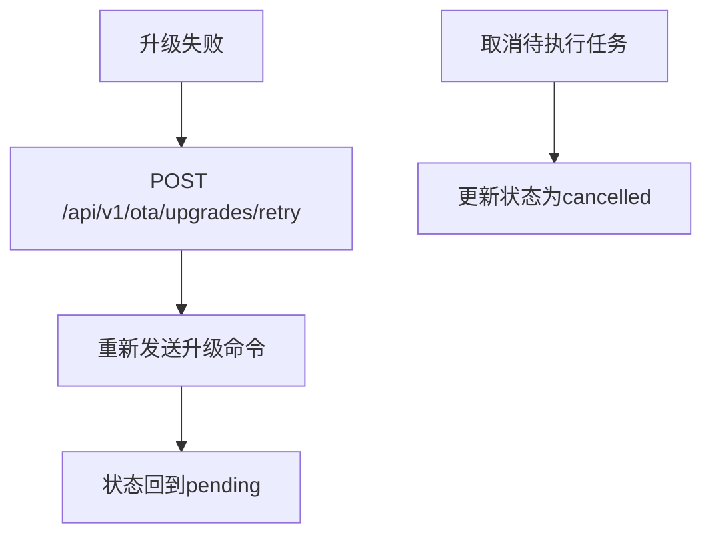

**图示来源**
- [inv_api_server/cmd/main.go:557-558](file://inv_api_server/cmd/main.go#L557-L558)
- [inv_api_server/internal/handler/ota_handler.go:246-278](file://inv_api_server/internal/handler/ota_handler.go#L246-L278)
- [inv_api_server/internal/service/ota_service.go:246-292](file://inv_api_server/internal/service/ota_service.go#L246-L292)

**章节来源**
- [inv_api_server/cmd/main.go:567-573](file://inv_api_server/cmd/main.go#L567-L573)
- [inv_api_server/internal/handler/ota_handler.go:246-278](file://inv_api_server/internal/handler/ota_handler.go#L246-L278)

### 统计与报表
- 升级面板：GET /api/v1/ota/upgrades/dashboard（按固件分组聚合）
- 固件升级详情：GET /api/v1/ota/upgrades/firmware/:firmwareId
- 设备历史：GET /api/v1/ota/devices/:sn/history
- 报表维度建议
  - 成功率：成功/失败/进行中任务数
  - 设备分布：按型号、区域、时间窗口统计
  - 性能分析：平均升级耗时、失败原因分布

**更新** 新增了任务统计功能，支持查询不同状态的任务数量，包括进行中、已完成、失败等状态的统计。

**章节来源**
- [inv_api_server/internal/handler/ota_handler.go:216-244](file://inv_api_server/internal/handler/ota_handler.go#L216-L244)
- [inv_api_server/internal/service/ota_service.go:274-287](file://inv_api_server/internal/service/ota_service.go#L274-L287)

### 多芯片固件版本管理（新增）
- 支持的芯片类型
  - ARM：主控芯片固件版本
  - ESP：WiFi/蓝牙模块固件版本
  - DSP：数字信号处理器固件版本（新增）
  - BMS：电池管理系统固件版本（新增）
- 版本跟踪机制
  - 设备表增加firmware_dsp和firmware_bms字段
  - ChipVersions()方法返回结构化芯片版本映射
  - MainVersion自动生成规则包含所有芯片版本
- 升级包管理
  - 支持多芯片固件组合成升级包
  - 每个芯片独立版本管理和升级
  - 整体升级状态由各芯片状态综合计算

**更新** 增强了多芯片固件版本跟踪能力，新增了对DSP和BMS芯片的支持，提供了完整的四芯片版本管理体系。

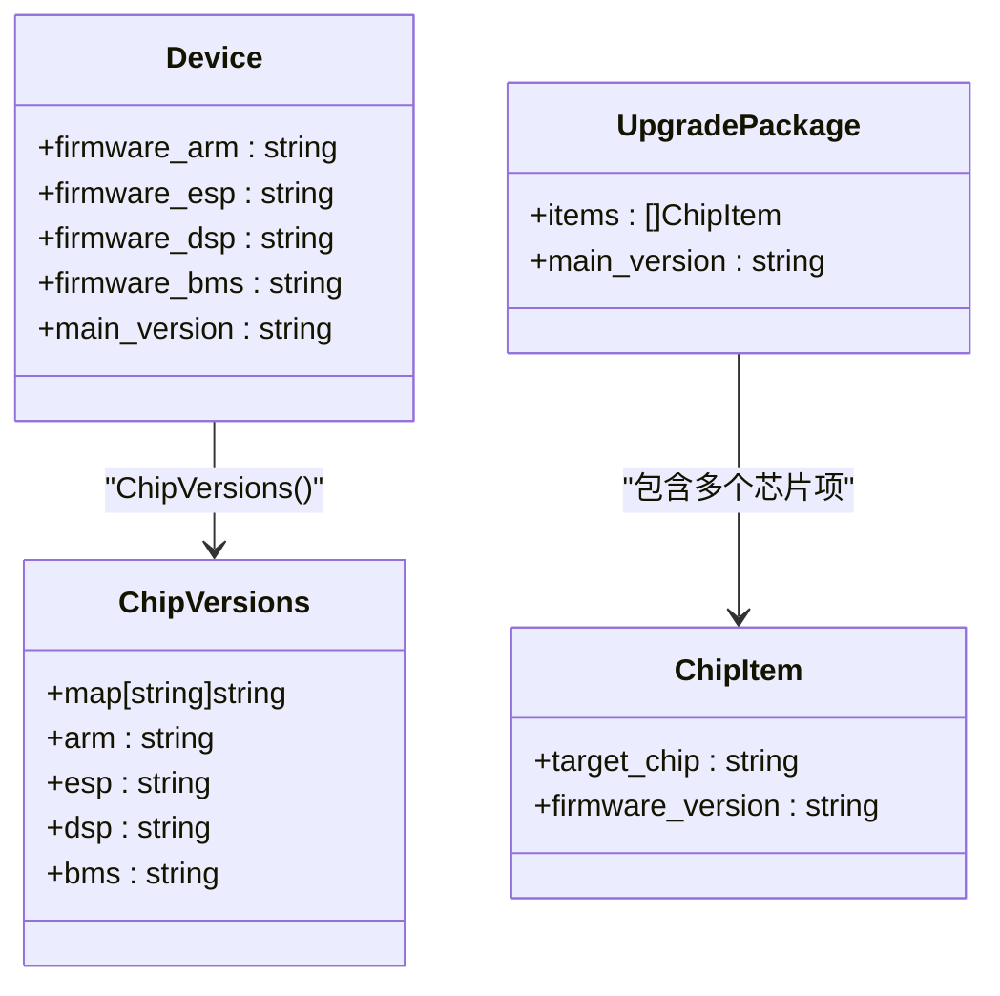

**图示来源**
- [inv_api_server/internal/repository/ota_repository.go:375-391](file://inv_api_server/internal/repository/ota_repository.go#L375-L391)
- [database/migrations/010_add_dsp_bms_versions.up.sql:1-3](file://database/migrations/010_add_dsp_bms_versions.up.sql#L1-L3)
- [inv_api_server/internal/model/models.go:286-302](file://inv_api_server/internal/model/models.go#L286-L302)

**章节来源**
- [inv_api_server/internal/repository/ota_repository.go:375-391](file://inv_api_server/internal/repository/ota_repository.go#L375-L391)
- [database/migrations/010_add_dsp_bms_versions.up.sql:1-3](file://database/migrations/010_add_dsp_bms_versions.up.sql#L1-L3)
- [inv_api_server/internal/model/models.go:286-302](file://inv_api_server/internal/model/models.go#L286-L302)

### 设备端集成与协议
- MQTT主题
  - 下行：cs_inv/{sn}/ota/cmd（升级命令）
  - 上行：cs_inv/{sn}/ota/status（状态上报）
- 命令格式
  - 字段：command（start）、target（芯片类型）、url、version、file_size、file_md5、file_sha256、upgrade_id
- 状态上报格式
  - 字段：device_id、current_version、state（如upgrading）、progress（0-100）、status_message、error_message
- 设备侧行为
  - 接收命令后下载固件并执行升级
  - 定期上报进度与最终结果

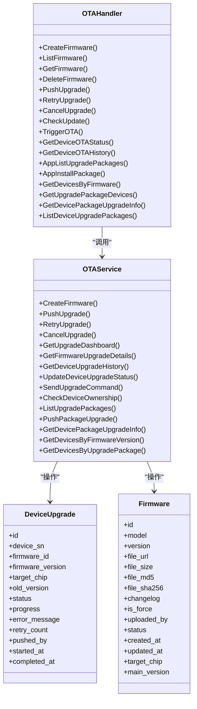

**图示来源**
- [inv_api_server/internal/handler/ota_handler.go:20-26](file://inv_api_server/internal/handler/ota_handler.go#L20-L26)
- [inv_api_server/internal/service/ota_service.go:22-42](file://inv_api_server/internal/service/ota_service.go#L22-L42)
- [inv_api_server/internal/model/models.go:301-318](file://inv_api_server/internal/model/models.go#L301-L318)
- [inv_api_server/internal/model/models.go:283-299](file://inv_api_server/internal/model/models.go#L283-L299)

**章节来源**
- [README.md:281-313](file://README.md#L281-L313)
- [inv_device_server/internal/mqtt/client.go:259-283](file://inv_device_server/internal/mqtt/client.go#L259-L283)

## 依赖关系分析
- 权限控制：路由层使用RequirePermission中间件限制操作范围（查看、创建、控制）
- 中间件链：CORS、JWT、RBAC、限流、日志、追踪
- 存储依赖：PostgreSQL存储固件与升级任务，Redis用于缓存（在服务初始化中注入）
- 外部依赖：设备侧服务通过HTTP接口接收命令，MQTT用于设备与云端通信

**更新** 新增了统一的错误处理机制，所有业务错误都通过AppError类型进行包装，提供标准的HTTP状态码和业务码。

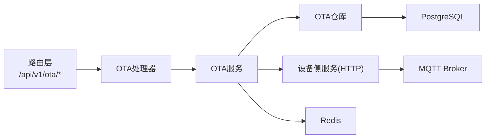

**图示来源**
- [inv_api_server/cmd/main.go:395-578](file://inv_api_server/cmd/main.go#L395-L578)
- [inv_api_server/internal/service/ota_service.go:22-42](file://inv_api_server/internal/service/ota_service.go#L22-L42)

**章节来源**
- [inv_api_server/cmd/main.go:381-390](file://inv_api_server/cmd/main.go#L381-L390)
- [inv_api_server/internal/service/ota_service.go:22-42](file://inv_api_server/internal/service/ota_service.go#L22-L42)

## 性能考虑
- 并发控制：推送升级时使用信号量限制并发度，避免对设备侧与MQTT造成过大压力
- 批量处理：一次推送支持多设备，减少多次请求开销
- 缓存与索引：Redis用于会话与临时状态，数据库建立必要索引以提升查询性能
- 超时与重试：HTTP客户端设置超时，MQTT发送失败时记录错误便于后续重试

**更新** 优化了任务取消的性能，通过原子性的数据库更新操作确保状态一致性，避免竞态条件。

## 故障排除指南
- 常见问题
  - 固件上传失败：检查文件大小、格式与MD5/SHA256计算是否正确
  - 推送升级无响应：确认设备在线、MQTT主题正确、设备侧服务运行正常
  - 进度不更新：检查内部状态上报接口是否被调用、数据库连接是否正常
  - 权限不足：确认JWT令牌有效且具备相应权限（ota:view/create/control）
  - 任务取消失败：检查任务状态是否允许取消（已完成或已取消的任务无法取消）
  - App端升级包安装失败：检查设备所有权验证是否通过、用户是否有设备访问权限
  - 设备-固件关系查询失败：检查芯片类型参数是否有效（arm/esp/dsp/bms）
  - 升级包详情查询失败：确认设备SN和升级包ID是否正确
- 排查步骤
  - 查看API服务器日志与错误码
  - 使用内部健康检查接口确认数据库与Redis连通性
  - 在设备侧服务中检查MQTT订阅与命令转发状态
  - 核对设备上报的主题与格式是否符合规范
  - 验证App端请求的设备SN是否与当前用户关联
  - 检查数据库中设备的芯片版本字段是否正确填充

**更新** 新增了设备-固件关系查询相关的故障排除指南，包括芯片类型验证失败的常见原因和解决方案。

**章节来源**
- [inv_api_server/cmd/main.go:356-377](file://inv_api_server/cmd/main.go#L356-L377)
- [README.md:281-313](file://README.md#L281-L313)

## 结论
本OTA升级API提供了从固件管理到任务执行、进度跟踪与回滚的全链路能力。通过清晰的接口设计与严格的权限控制，结合MQTT的可靠通信，能够满足大规模设备的远程升级需求。最新的可靠性增强包括改进的任务取消机制、增强的错误处理和active状态过滤功能，进一步提升了系统的稳定性和用户体验。

**更新** 本次更新显著增强了系统的设备管理能力，新增的四个设备-固件关系查询API和多芯片固件版本跟踪功能，为管理员提供了更强大的设备监控和管理工具，同时保持了良好的向后兼容性。

## 附录

### API定义总览
- 固件管理
  - GET /api/v1/ota/firmware
  - GET /api/v1/ota/firmware/:id
  - POST /api/v1/ota/firmware
  - DELETE /api/v1/ota/firmware/:id
- 升级任务
  - POST /api/v1/ota/upgrades/push
  - GET /api/v1/ota/upgrades/dashboard?status=active
  - GET /api/v1/ota/upgrades/firmware/:firmwareId
  - POST /api/v1/ota/upgrades/retry
  - POST /api/v1/ota/upgrades/cancel
- 设备-固件关系查询（新增）
  - GET /ota/firmware/devices?model=&target_chip=&version=
  - GET /ota/firmware/package-devices?package_id=&status=
  - GET /ota/devices/:sn/package-upgrade/:packageId
  - GET /ota/devices/:sn/upgrade-packages
- App端接口
  - GET /ota/check/:sn
  - POST /ota/trigger
  - POST /ota/resend/:sn
  - GET /ota/devices/:sn/status
  - GET /ota/devices/:sn/history
  - GET /ota/app/packages
  - POST /ota/app/packages/install
- 内部接口
  - POST /api/v1/internal/ota-status

**更新** 新增了四个设备-固件关系查询API，增强了系统的设备管理能力。

**章节来源**
- [inv_api_server/cmd/main.go:549-564](file://inv_api_server/cmd/main.go#L549-L564)
- [inv_api_server/cmd/main.go:389](file://inv_api_server/cmd/main.go#L389)
- [inv_api_server/cmd/main.go:692-693](file://inv_api_server/cmd/main.go#L692-L693)
- [inv_api_server/cmd/main.go:685-698](file://inv_api_server/cmd/main.go#L685-L698)

### 设备端协议要点
- 命令主题：cs_inv/{sn}/ota/cmd
- 状态主题：cs_inv/{sn}/ota/status
- 必填字段：command、target、url、version、file_size、file_md5、file_sha256、upgrade_id
- 状态字段：state（如upgrading）、progress（0-100）、status_message、error_message
- 多芯片支持：支持ARM、ESP、DSP、BMS四种芯片类型的固件版本管理

**章节来源**
- [README.md:281-313](file://README.md#L281-L313)
- [inv_device_server/internal/mqtt/client.go:264-283](file://inv_device_server/internal/mqtt/client.go#L264-L283)

### 错误处理机制
- 统一错误类型：AppError提供标准的HTTP状态码和业务码
- 自动错误映射：HandleError函数自动识别业务错误类型
- 未知错误处理：默认返回500状态码和系统错误消息
- 业务场景错误：提供详细的错误描述和业务码

**更新** 新增了统一的错误处理机制，确保所有API调用都有标准化的错误响应格式。

**章节来源**
- [inv_api_server/internal/handler/ota_handler.go:1-200](file://inv_api_server/internal/handler/ota_handler.go#L1-L200)
- [inv_api_server/pkg/response/response.go:96-117](file://inv_api_server/pkg/response/response.go#L96-L117)
- [inv_api_server/pkg/apperr/errors.go:1-49](file://inv_api_server/pkg/apperr/errors.go#L1-L49)

### App端升级包接口详细说明
- GET /ota/app/packages
  - 请求参数：model（必需）- 设备型号
  - 响应格式：包含过滤后的升级包列表，不包含敏感字段
  - 安全特性：JWT认证保护，无需RBAC权限
- POST /ota/app/packages/install
  - 请求体：{sn: string, package_id: number}
  - 安全验证：设备所有权检查，确保用户拥有设备操作权限
  - 响应：升级包安装任务创建结果
  - 错误处理：设备不属于当前用户时返回403权限错误

**章节来源**
- [inv_api_server/internal/handler/ota_handler.go:1015-1101](file://inv_api_server/internal/handler/ota_handler.go#L1015-L1101)
- [api-gateway/internal/middleware/rbac.go:197-199](file://api-gateway/internal/middleware/rbac.go#L197-L199)

### 设备-固件关系查询接口详细说明
- GET /ota/firmware/devices
  - 请求参数：model（必需）、target_chip（必需，arm/esp/dsp/bms）、version（必需）
  - 响应格式：设备列表及总数，包含设备SN、型号、主版本和各芯片版本
  - 权限要求：ota:view权限
  - 芯片类型验证：只允许arm、esp、dsp、bms四种有效芯片类型
- GET /ota/firmware/package-devices
  - 请求参数：package_id（必需）、status（可选）
  - 响应格式：使用该升级包的设备及升级状态
  - 权限要求：ota:view权限
  - 状态过滤：支持按升级状态筛选设备
- GET /ota/devices/:sn/package-upgrade/:packageId
  - 路径参数：sn（设备SN）、packageId（升级包ID）
  - 响应格式：设备在指定升级包下各芯片的详细升级状态
  - 安全验证：设备所有权检查
  - 升级状态：idle/pending/upgrading/success/failed/partial
- GET /ota/devices/:sn/upgrade-packages
  - 路径参数：sn（设备SN）
  - 响应格式：设备型号对应的所有可用升级包列表
  - 安全验证：设备所有权检查
  - 版本对比：显示目标版本与当前版本的差异

**章节来源**
- [inv_api_server/cmd/main.go:685-698](file://inv_api_server/cmd/main.go#L685-L698)
- [inv_api_server/internal/handler/ota_handler.go:1103-1257](file://inv_api_server/internal/handler/ota_handler.go#L1103-L1257)
- [inv_api_server/internal/service/ota_service.go:407-511](file://inv_api_server/internal/service/ota_service.go#L407-L511)
- [inv_api_server/internal/repository/ota_repository.go:1240-1315](file://inv_api_server/internal/repository/ota_repository.go#L1240-L1315)