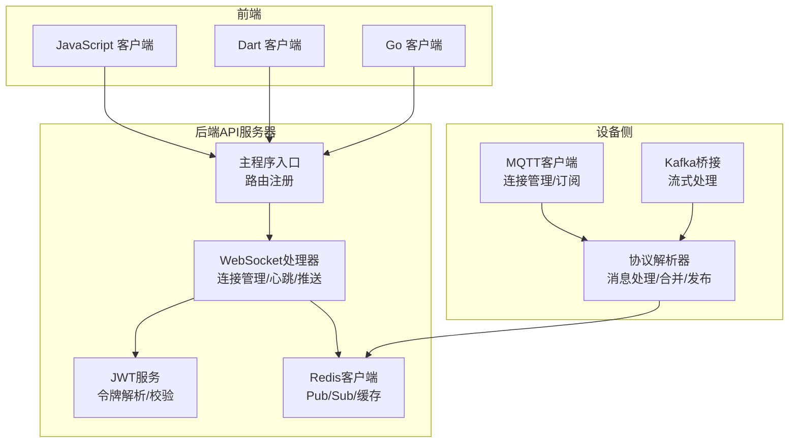
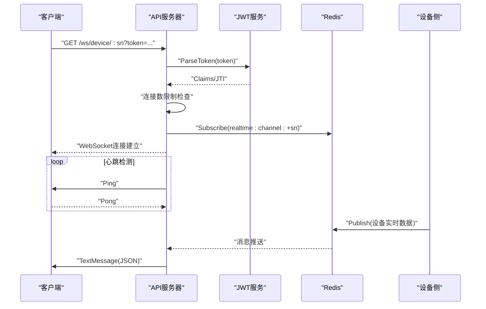
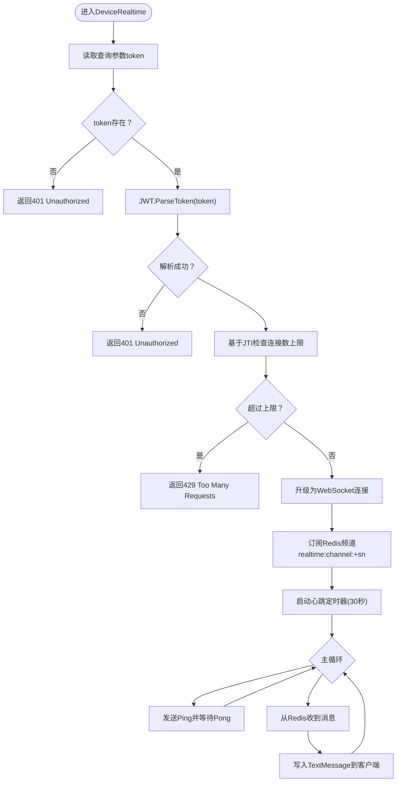
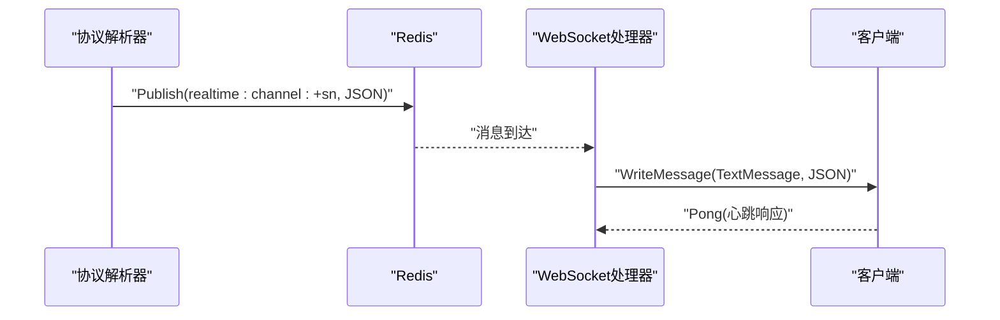
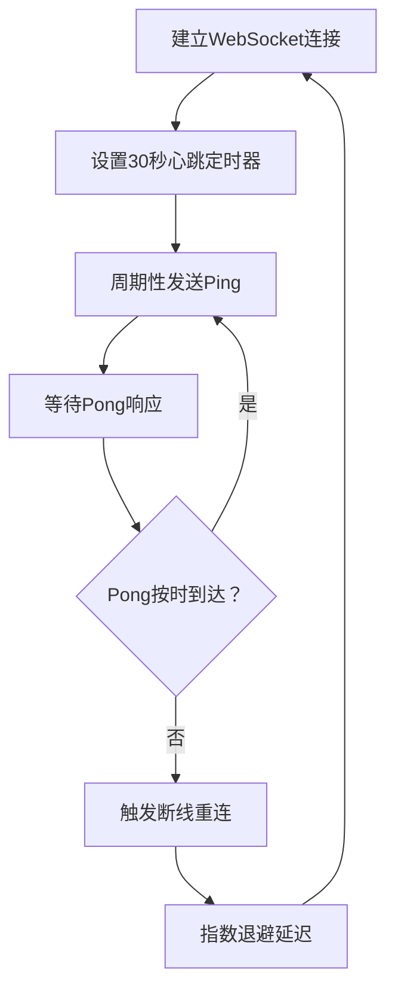
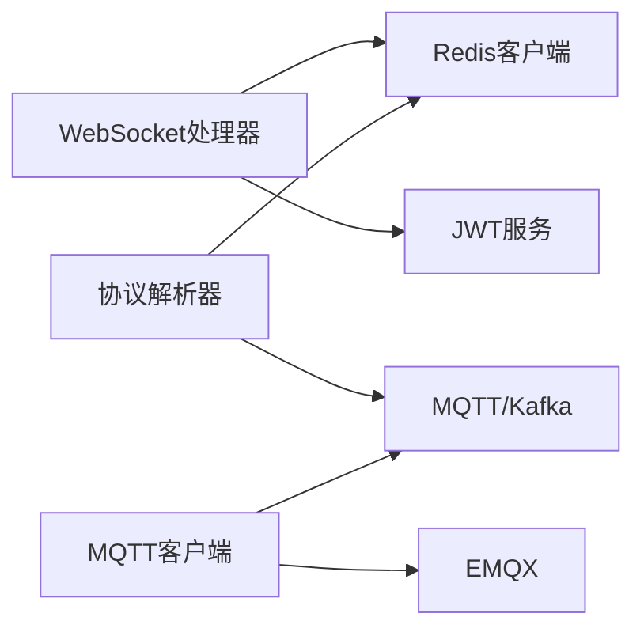

# WebSocket实时通信API

<cite>
**本文档引用的文件**
- [ws_handler.go](file://inv_api_server/internal/handler/ws_handler.go)
- [main.go](file://inv_api_server/cmd/main.go)
- [protocol_parser.go](file://inv_device_server/internal/service/protocol_parser.go)
- [client.go](file://inv_device_server/internal/mqtt/client.go)
- [config.go](file://inv_api_server/internal/config/config.go)
- [config.go](file://inv_device_server/internal/config/config.go)
- [README.md](file://README.md)
</cite>

## 目录
1. [简介](#简介)
2. [项目结构](#项目结构)
3. [核心组件](#核心组件)
4. [架构概览](#架构概览)
5. [详细组件分析](#详细组件分析)
6. [依赖关系分析](#依赖关系分析)
7. [性能考虑](#性能考虑)
8. [故障排除指南](#故障排除指南)
9. [结论](#结论)
10. [附录](#附录)

## 简介
本文件为WebSocket实时通信API的技术文档，基于代码库中的实际实现进行编写。内容涵盖WebSocket连接建立流程（握手、认证、会话管理）、实时数据推送接口（设备状态更新、告警通知、系统消息）、消息格式规范（JSON结构、字段定义、数据编码）、事件类型与消息路由（订阅管理、广播机制、私有通道）、客户端连接管理（连接池、心跳检测、断线重连）、消息确认与回执机制（ACK处理、错误重试），以及完整的客户端集成示例（JavaScript、Dart、Go）。同时提供性能优化建议与故障排除指南。

## 项目结构
该系统采用分层架构，后端API服务器通过WebSocket提供实时数据推送，设备侧通过MQTT接入，使用Redis进行消息发布/订阅与缓存，前端通过REST API与WebSocket进行交互。

**图示来源**
- [main.go:125-162](file://inv_api_server/cmd/main.go#L125-L162)
- [ws_handler.go:18-37](file://inv_api_server/internal/handler/ws_handler.go#L18-L37)
- [protocol_parser.go:829-833](file://inv_device_server/internal/service/protocol_parser.go#L829-L833)
- [client.go:154-191](file://inv_device_server/internal/mqtt/client.go#L154-L191)

**章节来源**
- [main.go:125-162](file://inv_api_server/cmd/main.go#L125-L162)
- [README.md:112-142](file://README.md#L112-L142)

## 核心组件
- WebSocket处理器：负责WebSocket连接升级、JWT认证、连接数限制、心跳检测、从Redis订阅频道并向客户端推送消息。
- JWT服务：解析并校验客户端提供的访问令牌，提取用户标识与JTI（JWT ID）用于连接数控制。
- Redis客户端：提供Pub/Sub能力，用于设备实时数据的发布与订阅；同时存储设备最新遥测数据与字段级缓存。
- 协议解析器：接收MQTT/Kafka消息，解析设备上报数据，按字段合并到最新数据快照，并发布到Redis频道。
- MQTT客户端：维护与EMQX的持久连接，订阅设备状态与遥测主题，处理OTA状态与命令结果。

**章节来源**
- [ws_handler.go:18-37](file://inv_api_server/internal/handler/ws_handler.go#L18-L37)
- [protocol_parser.go:829-833](file://inv_device_server/internal/service/protocol_parser.go#L829-L833)
- [client.go:154-191](file://inv_device_server/internal/mqtt/client.go#L154-L191)

## 架构概览
WebSocket实时通信的整体流程如下：
1. 客户端发起WebSocket请求，携带JWT令牌参数。
2. API服务器验证令牌，建立WebSocket连接。
3. 服务器为每个用户JTI维护连接计数，防止过度连接。
4. 服务器订阅对应设备的Redis频道，接收实时数据。
5. 服务器向客户端周期性发送Ping心跳，客户端响应Pong。
6. 当设备侧有新数据到达，协议解析器将其合并到最新快照并通过Redis发布。
7. WebSocket处理器从Redis读取消息并推送给客户端。

**图示来源**
- [ws_handler.go:39-122](file://inv_api_server/internal/handler/ws_handler.go#L39-L122)
- [protocol_parser.go:829-833](file://inv_device_server/internal/service/protocol_parser.go#L829-L833)

## 详细组件分析

### WebSocket连接建立与认证
- 连接升级：使用gorilla/websocket的Upgrader进行HTTP到WebSocket的协议升级。
- 认证验证：从查询参数获取JWT令牌，调用JWT服务解析并校验令牌有效性。
- 会话管理：基于JWT中的JTI对同一用户的并发连接数进行限制（默认最多5个）。
- 断开清理：连接关闭时减少计数，必要时删除映射项。

**图示来源**
- [ws_handler.go:39-122](file://inv_api_server/internal/handler/ws_handler.go#L39-L122)

**章节来源**
- [ws_handler.go:18-37](file://inv_api_server/internal/handler/ws_handler.go#L18-L37)
- [ws_handler.go:39-122](file://inv_api_server/internal/handler/ws_handler.go#L39-L122)

### 实时数据推送接口
- 推送通道：每个设备拥有独立的Redis频道“realtime:channel:+sn”，WebSocket处理器订阅该频道。
- 推送内容：设备最新遥测数据的JSON字符串，包含设备序列号、消息类型、更新时间等元信息。
- 推送触发：设备侧协议解析器将合并后的最新数据通过Redis发布，WebSocket处理器异步转发给客户端。

**图示来源**
- [protocol_parser.go:829-833](file://inv_device_server/internal/service/protocol_parser.go#L829-L833)
- [ws_handler.go:87-121](file://inv_api_server/internal/handler/ws_handler.go#L87-L121)

**章节来源**
- [protocol_parser.go:829-833](file://inv_device_server/internal/service/protocol_parser.go#L829-L833)
- [ws_handler.go:87-121](file://inv_api_server/internal/handler/ws_handler.go#L87-L121)

### 消息格式规范
- JSON结构：推送的消息为JSON字符串，包含以下关键字段：
  - "_sn"：设备序列号
  - "_msg_type"：消息类型（如遥测类别）
  - "_updated_at"：最后更新时间（RFC3339格式）
  - 按消息类型分类的嵌套字段（如"ac"、"batt"、"pv"、"sys"）
- 字段定义：
  - "_sn"：字符串，设备唯一标识
  - "_msg_type"：字符串，消息类型标识
  - "_updated_at"：字符串，ISO时间戳
  - 其他字段：根据具体消息类型动态扩展
- 数据编码：UTF-8 JSON字符串，WebSocket文本帧传输。

**章节来源**
- [protocol_parser.go:812-827](file://inv_device_server/internal/service/protocol_parser.go#L812-L827)

### 事件类型与消息路由
- 事件类型：设备上报的数据按消息类型进行分类，如交流功率、电池、光伏、系统状态等。
- 消息路由：
  - 订阅管理：WebSocket处理器为每个设备订阅独立频道。
  - 广播机制：当前实现为一对一私有通道，未见全局广播逻辑。
  - 私有通道：频道名称为“realtime:channel:+sn”，确保消息仅投递到对应设备的连接。

**章节来源**
- [protocol_parser.go:835-845](file://inv_device_server/internal/service/protocol_parser.go#L835-L845)
- [ws_handler.go:87-88](file://inv_api_server/internal/handler/ws_handler.go#L87-L88)

### 客户端连接管理
- 连接池：WebSocket处理器内部维护一个以JTI为键的连接计数字典，限制同一用户并发连接数量。
- 心跳检测：服务器每30秒发送一次Ping，客户端需及时响应Pong；若超时则认为连接异常并关闭。
- 断线重连：客户端应实现指数退避策略进行重连，建议首次重连延迟1-2秒，随后指数增长至最大30秒。

**图示来源**
- [ws_handler.go:102-121](file://inv_api_server/internal/handler/ws_handler.go#L102-L121)

**章节来源**
- [ws_handler.go:57-73](file://inv_api_server/internal/handler/ws_handler.go#L57-L73)
- [ws_handler.go:102-121](file://inv_api_server/internal/handler/ws_handler.go#L102-L121)

### 消息确认与回执机制
- ACK处理：当前WebSocket实现未提供显式的ACK确认机制；客户端可通过响应Pong实现隐式确认。
- 错误重试：设备侧消息处理具备Kafka消费重试逻辑（最大重试次数），但WebSocket推送未见客户端侧重试策略。
- 建议：客户端应在收到消息后主动发送确认消息或利用Pong机制反馈，服务端可据此调整推送频率。

**章节来源**
- [protocol_parser.go:103-135](file://inv_device_server/internal/service/protocol_parser.go#L103-L135)
- [ws_handler.go:114-121](file://inv_api_server/internal/handler/ws_handler.go#L114-L121)

### 客户端集成示例

#### JavaScript 客户端
- 连接建立：使用浏览器原生WebSocket API，构造URL为“ws://host/ws/device/:sn?token=...”。
- 认证：将JWT令牌作为查询参数传递。
- 心跳：监听ping事件，立即发送pong响应。
- 数据处理：解析收到的JSON字符串，按字段更新UI。

参考路径：
- [ws_handler.go:39-53](file://inv_api_server/internal/handler/ws_handler.go#L39-L53)
- [ws_handler.go:75-82](file://inv_api_server/internal/handler/ws_handler.go#L75-L82)

#### Dart 客户端（Flutter）
- 连接建立：使用web_socket_channel或标准WebSocket库，构造与上述相同的URL。
- 认证：同上。
- 心跳：监听ping事件并发送pong。
- 数据处理：将JSON字符串转换为Map，更新本地状态。

参考路径：
- [ws_handler.go:39-53](file://inv_api_server/internal/handler/ws_handler.go#L39-L53)
- [ws_handler.go:75-82](file://inv_api_server/internal/handler/ws_handler.go#L75-L82)

#### Go 客户端
- 连接建立：使用github.com/gorilla/websocket库，构造URL并进行握手。
- 认证：查询参数传入token。
- 心跳：定期发送ping，处理pong。
- 数据处理：反序列化JSON并处理不同消息类型。

参考路径：
- [ws_handler.go:39-53](file://inv_api_server/internal/handler/ws_handler.go#L39-L53)
- [ws_handler.go:75-82](file://inv_api_server/internal/handler/ws_handler.go#L75-L82)

## 依赖关系分析
- WebSocket处理器依赖：
  - Redis客户端：用于订阅频道与发布消息。
  - JWT服务：用于令牌解析与JTI提取。
- 协议解析器依赖：
  - Redis客户端：用于存储最新数据快照与字段级缓存。
  - MQTT/Kafka：用于接收设备上报数据。
- MQTT客户端依赖：
  - EMQX：作为MQTT代理，支持共享订阅与JWT认证。

**图示来源**
- [ws_handler.go:24-29](file://inv_api_server/internal/handler/ws_handler.go#L24-L29)
- [protocol_parser.go:829-833](file://inv_device_server/internal/service/protocol_parser.go#L829-L833)
- [client.go:154-191](file://inv_device_server/internal/mqtt/client.go#L154-L191)

**章节来源**
- [ws_handler.go:24-29](file://inv_api_server/internal/handler/ws_handler.go#L24-L29)
- [protocol_parser.go:829-833](file://inv_device_server/internal/service/protocol_parser.go#L829-L833)
- [client.go:154-191](file://inv_device_server/internal/mqtt/client.go#L154-L191)

## 性能考虑
- 连接数限制：基于JTI的连接数限制可有效防止资源滥用，默认上限为5，可根据业务需求调整。
- 心跳间隔：30秒的心跳间隔平衡了保活与网络开销，可根据网络质量调整。
- Redis发布/订阅：使用频道隔离可降低广播风暴影响，提升消息路由效率。
- 消息合并：协议解析器对同一设备的多次上报进行合并，减少冗余推送。
- 缓存策略：Redis中保存字段级与整体快照，既满足按字段查询也保证推送完整性。

[本节为通用性能建议，无需特定文件引用]

## 故障排除指南
- 连接被拒绝（401）：检查token是否正确传递且未过期。
- 连接过多（429）：同一用户并发连接超过上限，需释放部分连接或提升上限。
- 连接升级失败：检查CORS配置与网络连通性。
- 心跳超时：客户端未及时响应Pong，检查网络延迟与客户端实现。
- 无消息推送：确认设备侧是否正常上报数据，Redis频道是否存在订阅。

**章节来源**
- [ws_handler.go:42-64](file://inv_api_server/internal/handler/ws_handler.go#L42-L64)
- [ws_handler.go:75-80](file://inv_api_server/internal/handler/ws_handler.go#L75-L80)
- [ws_handler.go:109-113](file://inv_api_server/internal/handler/ws_handler.go#L109-L113)

## 结论
本WebSocket实时通信API通过JWT认证、Redis Pub/Sub与心跳保活机制，实现了设备数据的低延迟推送。协议解析器负责消息合并与发布，WebSocket处理器负责连接管理与消息转发。建议在生产环境中完善ACK确认与客户端重试策略，并根据实际流量调整连接数限制与心跳间隔，以获得更稳定的性能表现。

[本节为总结性内容，无需特定文件引用]

## 附录

### 配置要点
- 服务器端口与超时：在配置文件中设置HTTP服务器端口与读写超时。
- Redis连接：在配置文件中设置Redis地址、密码与数据库。
- MQTT连接：在设备侧配置EMQX地址、客户端ID与共享订阅。

**章节来源**
- [config.go](file://inv_api_server/internal/config/config.go)
- [config.go](file://inv_device_server/internal/config/config.go)