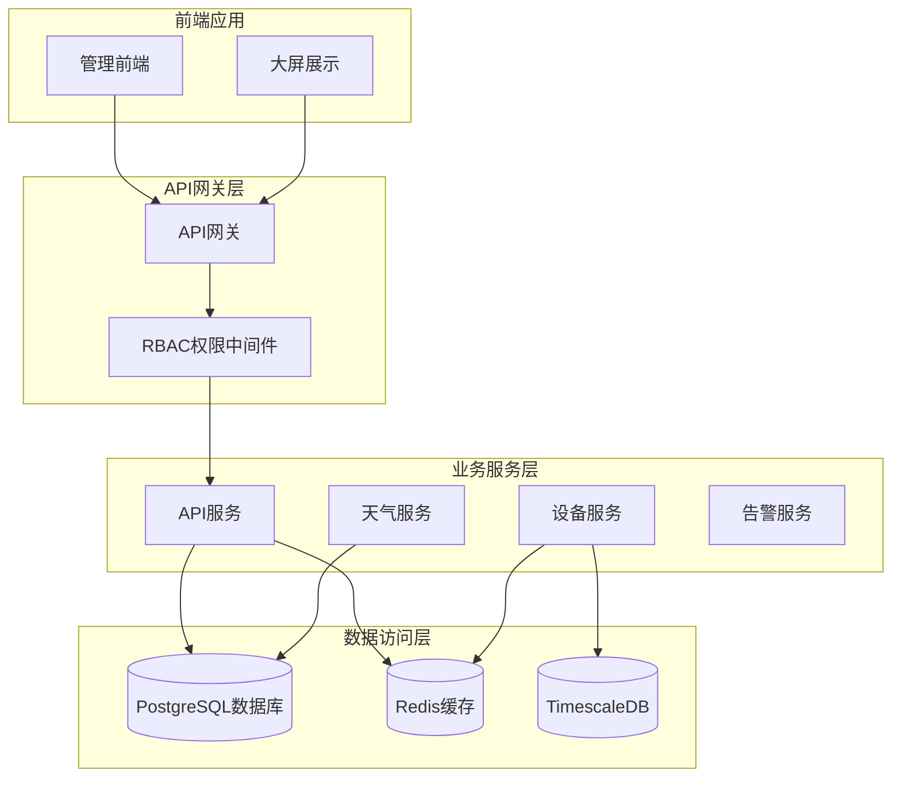
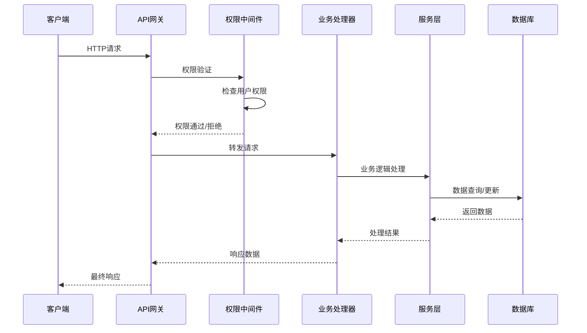
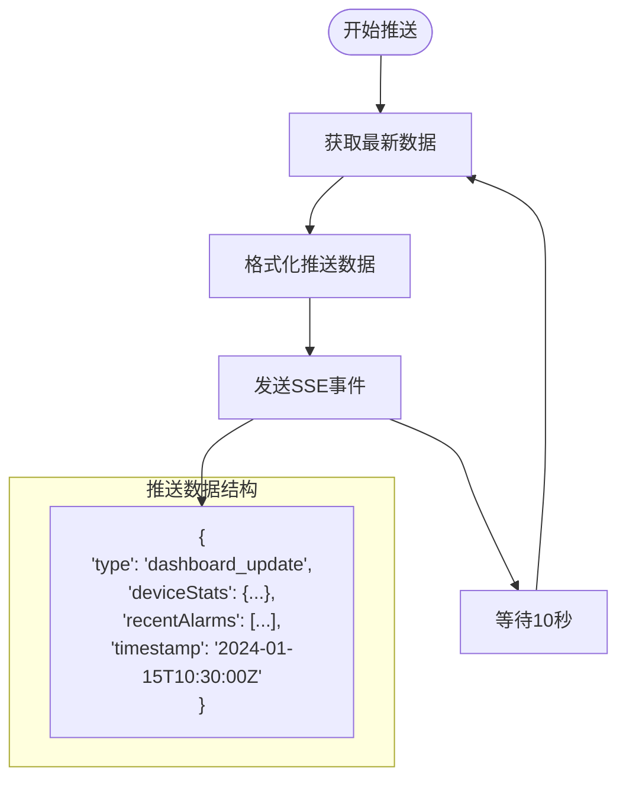
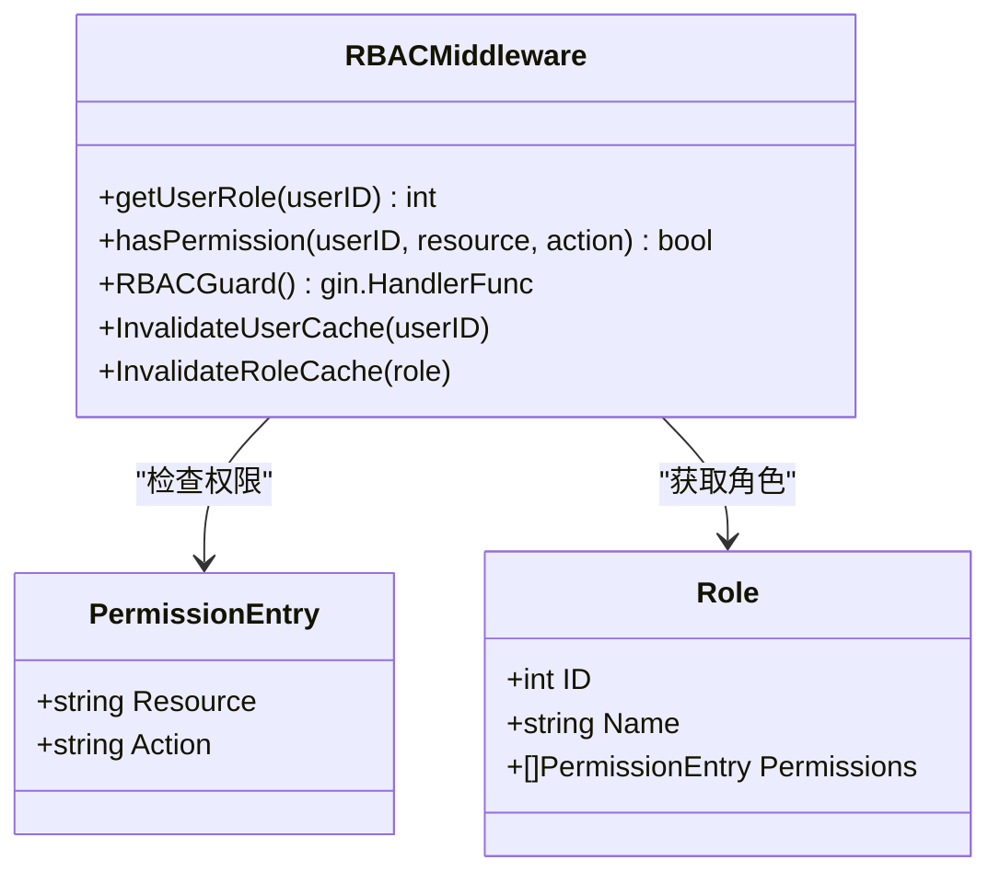
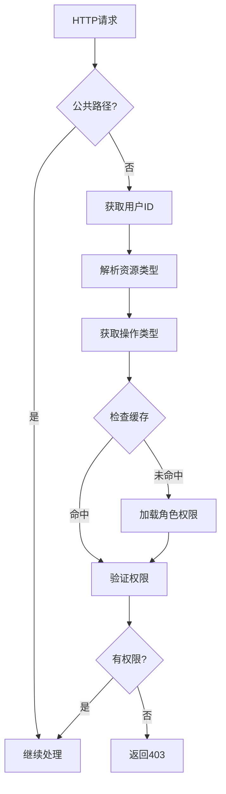
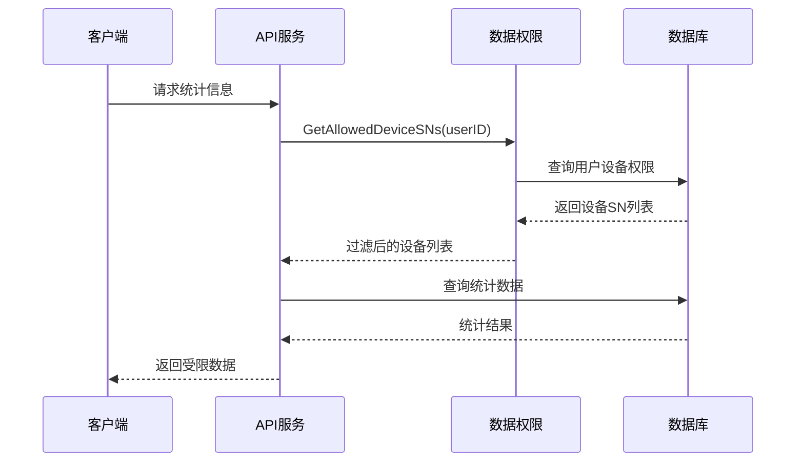
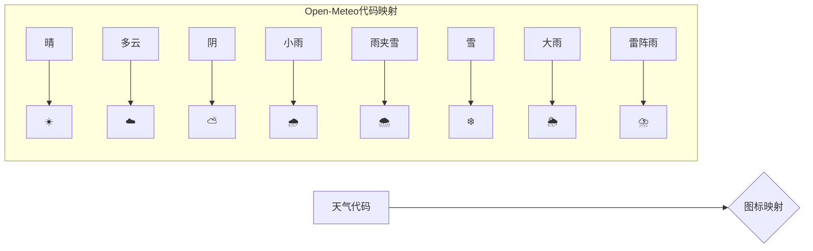
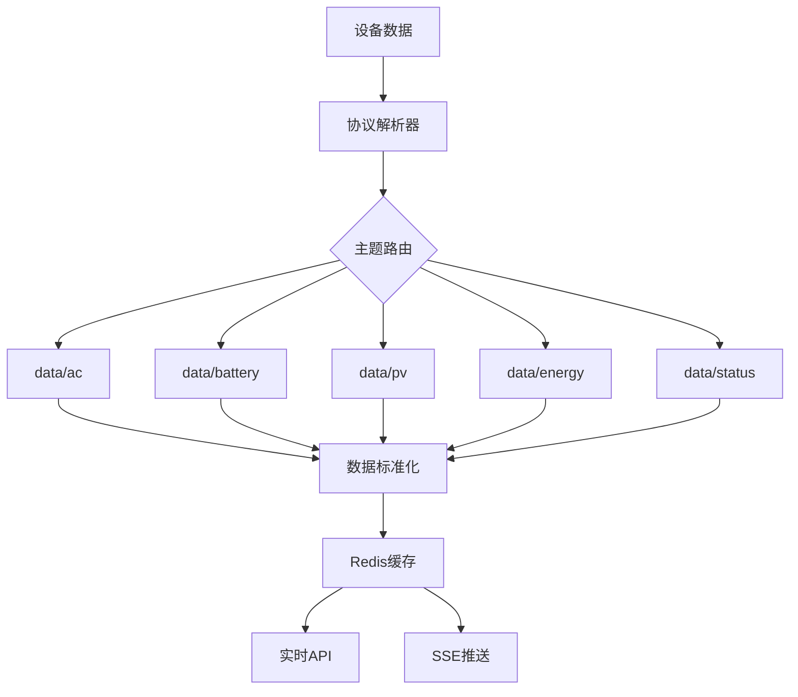
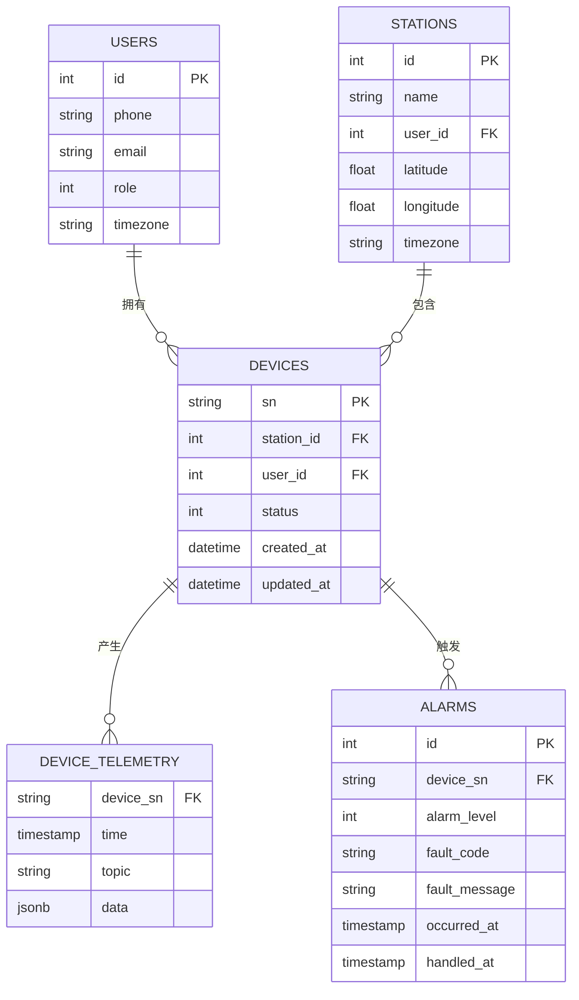
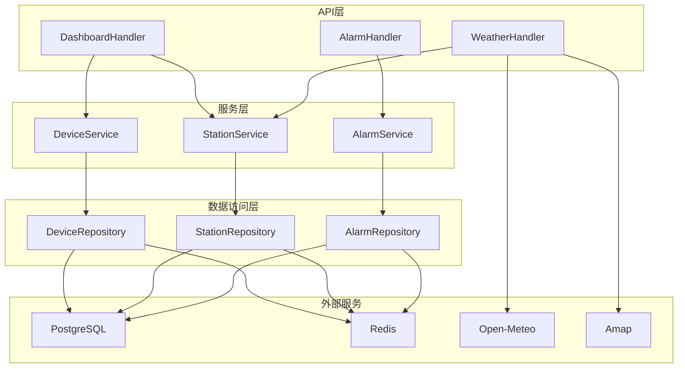

# 仪表板与统计API

<cite>
**本文档引用的文件**
- [inv_api_server/cmd/main.go](file://inv_api_server/cmd/main.go)
- [inv_api_server/internal/handler/dashboard_handler.go](file://inv_api_server/internal/handler/dashboard_handler.go)
- [inv_api_server/internal/handler/weather_handler.go](file://inv_api_server/internal/handler/weather_handler.go)
- [inv_api_server/internal/service/data_permission.go](file://inv_api_server/internal/service/data_permission.go)
- [inv_api_server/internal/service/perm_checker.go](file://inv_api_server/internal/service/perm_checker.go)
- [api-gateway/internal/middleware/rbac.go](file://api-gateway/internal/middleware/rbac.go)
- [inv_api_server/internal/middleware/permission.go](file://inv_api_server/internal/middleware/permission.go)
- [inv_api_server/internal/repository/repositories.go](file://inv_api_server/internal/repository/repositories.go)
- [inv_device_server/internal/service/protocol_parser.go](file://inv_device_server/internal/service/protocol_parser.go)
- [inv_device_server/internal/mqtt/client.go](file://inv_device_server/internal/mqtt/client.go)
- [inv_device_server/internal/model/device.go](file://inv_device_server/internal/model/device.go)
- [inv-admin-frontend/src/pages/portal/DeviceMonitorPage.tsx](file://inv-admin-frontend/src/pages/portal/DeviceMonitorPage.tsx)
- [inv-admin-frontend/src/pages/portal/AlertsPage.tsx](file://inv-admin-frontend/src/pages/portal/AlertsPage.tsx)
- [tools/stress_test/main.go](file://tools/stress_test/main.go)
</cite>

## 目录
1. [简介](#简介)
2. [项目结构](#项目结构)
3. [核心组件](#核心组件)
4. [架构概览](#架构概览)
5. [详细组件分析](#详细组件分析)
6. [依赖关系分析](#依赖关系分析)
7. [性能考虑](#性能考虑)
8. [故障排除指南](#故障排除指南)
9. [结论](#结论)

## 简介

本项目是一个基于Go语言开发的智能逆变器监控系统，专注于提供全面的仪表板与统计API功能。系统采用微服务架构，通过API网关统一管理各个服务模块，实现了设备运行统计、发电量计算、效率分析、实时监控、图表数据展示、权限控制等核心功能。

系统支持多种数据源接入，包括MQTT协议的设备数据、Kafka消息队列、PostgreSQL数据库和Redis缓存系统。通过TimescaleDB进行时间序列数据存储，实现了高效的设备状态监控和历史数据分析。

## 项目结构

项目采用分层架构设计，主要包含以下核心模块：



**图表来源**
- [inv_api_server/cmd/main.go:487-496](file://inv_api_server/cmd/main.go#L487-L496)
- [api-gateway/internal/middleware/rbac.go:190-239](file://api-gateway/internal/middleware/rbac.go#L190-L239)

**章节来源**
- [inv_api_server/cmd/main.go:125-507](file://inv_api_server/cmd/main.go#L125-L507)
- [inv_api_server/cmd/main.go:420-463](file://inv_api_server/cmd/main.go#L420-L463)

## 核心组件

### 仪表板处理器 (DashboardHandler)

仪表板处理器是系统的核心组件，负责提供各种统计数据和图表数据。主要功能包括：

- **设备运行统计**：统计设备总数、在线数量、离线数量和故障数量
- **发电量计算**：计算当日发电量、总发电量和月度发电量
- **趋势分析**：提供日、周、月维度的趋势数据
- **设备对比**：支持多设备数据对比分析
- **能源统计**：提供详细的能源流向数据
- **站点排名**：按发电量对站点进行排名

### 天气数据处理器 (WeatherHandler)

天气处理器集成了多个天气服务提供商，提供准确的气象信息：

- **Open-Meteo集成**：提供全球天气数据
- **高德地图天气**：提供中国地区的天气预报
- **自动切换机制**：根据配置自动选择最优的天气服务

### 权限控制系统

系统实现了多层次的权限控制机制：

- **RBAC中间件**：基于角色的访问控制
- **数据权限验证**：确保用户只能访问其权限范围内的数据
- **API级权限检查**：在每个API调用时进行权限验证

**章节来源**
- [inv_api_server/internal/handler/dashboard_handler.go:54-232](file://inv_api_server/internal/handler/dashboard_handler.go#L54-L232)
- [inv_api_server/internal/handler/weather_handler.go:47-78](file://inv_api_server/internal/handler/weather_handler.go#L47-L78)
- [inv_api_server/internal/service/perm_checker.go:41-74](file://inv_api_server/internal/service/perm_checker.go#L41-L74)

## 架构概览

系统采用分布式微服务架构，通过API网关统一对外提供服务：



**图表来源**
- [api-gateway/internal/middleware/rbac.go:190-239](file://api-gateway/internal/middleware/rbac.go#L190-L239)
- [inv_api_server/internal/middleware/permission.go:40-56](file://inv_api_server/internal/middleware/permission.go#L40-L56)

## 详细组件分析

### 仪表板统计API

#### 设备运行统计接口

系统提供全面的设备运行统计功能：

**接口定义**
- 路径：`GET /api/v1/dashboard/statistics`
- 功能：获取设备总体运行状态统计

**返回数据结构**
```json
{
  "deviceStats": {
    "total": 100,
    "online": 95,
    "offline": 3,
    "fault": 2
  },
  "todayEnergy": 450.5,
  "totalEnergy": 125000.0,
  "recentAlarms": [
    {
      "id": 1001,
      "device_sn": "INV-001",
      "alarm_level": 2,
      "fault_code": "E001",
      "fault_message": "过载保护",
      "occurred_at": "2024-01-15T10:30:00Z"
    }
  ]
}
```

#### 发电量统计接口

**接口定义**
- 路径：`GET /api/v1/dashboard/energy-stats`
- 参数：
  - `type`: 统计类型（day/week/month）
  - `stationId`: 站点ID（可选）

**数据处理逻辑**
系统通过JSONB字段兼容不同格式的数据，支持以下字段：
- `daily_pv`: 当日发电量
- `total_pv`: 总发电量  
- `energy_daily_pv`: 日发电量（备用字段）

#### 趋势分析接口

**接口定义**
- 路径：`GET /api/v1/dashboard/trend`
- 参数：
  - `type`: 趋势类型（day/week/month，默认day）

**数据聚合策略**
- 日趋势：按天聚合，支持7天、4周、12个月的时间范围
- 自动填充：缺失日期自动填充为0值
- 累计值处理：保持累计发电量的连续性

#### 实时监控接口

**接口定义**
- 路径：`GET /api/v1/dashboard/sse`
- 功能：Server-Sent Events实时推送

**推送内容**
- 设备状态更新
- 最近告警信息
- 系统时间戳



**图表来源**
- [inv_api_server/internal/handler/dashboard_handler.go:1228-1240](file://inv_api_server/internal/handler/dashboard_handler.go#L1228-L1240)

**章节来源**
- [inv_api_server/internal/handler/dashboard_handler.go:54-232](file://inv_api_server/internal/handler/dashboard_handler.go#L54-L232)
- [inv_api_server/internal/handler/dashboard_handler.go:277-407](file://inv_api_server/internal/handler/dashboard_handler.go#L277-L407)
- [inv_api_server/internal/handler/dashboard_handler.go:522-670](file://inv_api_server/internal/handler/dashboard_handler.go#L522-L670)

### 图表数据接口

#### 折线图数据接口

**接口定义**
- 路径：`GET /api/v1/dashboard/trend`
- 返回格式：时间序列数组

**数据格式**
```json
[
  {
    "date": "2024-01-01",
    "energy": 150.5,
    "load": 120.3,
    "cumulative": 1500.0
  },
  {
    "date": "2024-01-02", 
    "energy": 180.2,
    "load": 140.1,
    "cumulative": 1680.2
  }
]
```

#### 柱状图数据接口

**接口定义**
- 路径：`GET /api/v1/dashboard/energy-stats`
- 返回格式：多个数组并行

**数据格式**
```json
{
  "dates": ["2024-01-01", "2024-01-02"],
  "pv": [150.5, 180.2],
  "batteryCharge": [0, 0],
  "batteryDischarge": [0, 0],
  "load": [120.3, 140.1],
  "inverterOutput": [0, 0],
  "gridExport": [0, 0],
  "gridImport": [0, 0]
}
```

#### 饼图数据接口

**接口定义**
- 路径：`GET /api/v1/dashboard/device-distribution`
- 返回格式：设备状态分布

**数据格式**
```json
{
  "online": 95,
  "offline": 3,
  "fault": 2
}
```

**章节来源**
- [inv_api_server/internal/handler/dashboard_handler.go:234-275](file://inv_api_server/internal/handler/dashboard_handler.go#L234-L275)
- [inv_api_server/internal/handler/dashboard_handler.go:522-670](file://inv_api_server/internal/handler/dashboard_handler.go#L522-L670)

### 权限控制接口

#### RBAC权限中间件

系统实现了一个完整的RBAC权限控制中间件：

**核心功能**
- 用户角色获取和缓存
- 权限规则检查
- 资源访问控制
- 缓存失效管理

**权限映射**


**图表来源**
- [api-gateway/internal/middleware/rbac.go:19-42](file://api-gateway/internal/middleware/rbac.go#L19-L42)

**权限检查流程**


**图表来源**
- [api-gateway/internal/middleware/rbac.go:190-239](file://api-gateway/internal/middleware/rbac.go#L190-L239)

#### 数据权限验证

**接口定义**
- 路径：`GET /api/v1/dashboard/statistics`
- 功能：根据用户权限过滤数据

**数据权限实现**


**图表来源**
- [inv_api_server/internal/service/data_permission.go:22-46](file://inv_api_server/internal/service/data_permission.go#L22-L46)

**章节来源**
- [api-gateway/internal/middleware/rbac.go:190-239](file://api-gateway/internal/middleware/rbac.go#L190-L239)
- [inv_api_server/internal/service/data_permission.go:22-46](file://inv_api_server/internal/service/data_permission.go#L22-L46)

### 天气数据接口

#### 多源天气服务集成

**接口定义**
- 路径：`GET /api/v1/stations/:id/weather`
- 功能：获取指定站点的天气信息

**支持的天气服务**
- **Open-Meteo**: 全球天气数据，支持150+天气代码
- **高德地图**: 中国地区天气预报，支持中文描述

**天气图标映射**


**图表来源**
- [inv_api_server/internal/handler/weather_handler.go:269-309](file://inv_api_server/internal/handler/weather_handler.go#L269-L309)

**环境影响分析**
系统通过天气数据为发电量预测提供环境因素分析：
- 温度对光伏板效率的影响
- 云量对发电量的衰减系数
- 风速对散热效果的影响

**章节来源**
- [inv_api_server/internal/handler/weather_handler.go:47-78](file://inv_api_server/internal/handler/weather_handler.go#L47-L78)
- [inv_api_server/internal/handler/weather_handler.go:80-133](file://inv_api_server/internal/handler/weather_handler.go#L80-L133)

### 设备状态监控

#### 实时数据处理

**数据流处理**


**图表来源**
- [inv_device_server/internal/service/protocol_parser.go:835-845](file://inv_device_server/internal/service/protocol_parser.go#L835-L845)

**设备状态跟踪**
- 在线状态：基于Redis心跳检测
- 故障状态：通过故障码识别
- 运行状态：设备工作模式

**章节来源**
- [inv_device_server/internal/service/protocol_parser.go:447-476](file://inv_device_server/internal/service/protocol_parser.go#L447-L476)
- [inv_device_server/internal/mqtt/client.go:79-104](file://inv_device_server/internal/mqtt/client.go#L79-L104)

## 依赖关系分析

### 数据模型关系



**图表来源**
- [inv_api_server/internal/repository/repositories.go:638-655](file://inv_api_server/internal/repository/repositories.go#L638-L655)

### 组件依赖关系



**图表来源**
- [inv_api_server/cmd/main.go:125-136](file://inv_api_server/cmd/main.go#L125-L136)

**章节来源**
- [inv_api_server/cmd/main.go:125-136](file://inv_api_server/cmd/main.go#L125-L136)
- [inv_api_server/internal/repository/repositories.go:638-655](file://inv_api_server/internal/repository/repositories.go#L638-L655)

## 性能考虑

### 缓存策略

系统采用了多层次的缓存策略来提升性能：

**Redis缓存层次**
- **用户权限缓存**：5分钟TTL，减少数据库查询
- **设备在线状态**：120秒TTL，实时反映设备状态
- **实时数据缓存**：120秒TTL，支持快速查询
- **查询结果缓存**：针对热点查询结果进行缓存

**数据库优化**
- **索引优化**：为常用查询字段建立复合索引
- **分区策略**：按时间分区存储设备遥测数据
- **连接池管理**：合理配置数据库连接池大小

### 性能监控

**压力测试工具**
系统提供了专门的压力测试工具，模拟大量设备并发上报数据：

```mermaid
flowchart TD
StressTest[压力测试] --> SimulateDevices[模拟设备]
SimulateDevices --> GeneratePayload[生成数据负载]
GeneratePayload --> SendRequests[发送HTTP请求]
SendRequests --> MonitorMetrics[监控指标]
subgraph "监控指标"
Latency[延迟(ms)]
Throughput[吞吐量]
ErrorRate[错误率]
ResourceUsage[资源使用]
end
MonitorMetrics --> Latency
MonitorMetrics --> Throughput
MonitorMetrics --> ErrorRate
MonitorMetrics --> ResourceUsage
```

**图表来源**
- [tools/stress_test/main.go:21-97](file://tools/stress_test/main.go#L21-L97)

**性能优化建议**
1. **数据库查询优化**：使用EXPLAIN分析慢查询，优化索引策略
2. **缓存预热**：在系统启动时预热热点数据
3. **异步处理**：将非关键操作异步化处理
4. **批量操作**：合并多次数据库操作为批量操作

## 故障排除指南

### 常见问题诊断

**权限相关问题**
- 检查用户角色是否正确设置
- 验证权限缓存是否正常工作
- 确认RBAC中间件是否正确配置

**数据权限问题**
- 验证用户设备绑定关系
- 检查数据权限查询结果
- 确认设备SN过滤条件

**实时数据问题**
- 检查Redis连接状态
- 验证MQTT消息订阅
- 确认协议解析器正常工作

### 日志分析

系统提供了详细的日志记录机制：

**关键日志级别**
- **DEBUG**: 详细的操作流程记录
- **INFO**: 正常业务操作记录  
- **WARN**: 异常但可恢复的问题
- **ERROR**: 严重错误和异常情况

**监控脚本**
部署目录提供了系统监控脚本，可以自动检测服务状态和资源使用情况。

**章节来源**
- [api-gateway/internal/middleware/rbac.go:226-234](file://api-gateway/internal/middleware/rbac.go#L226-L234)
- [inv_api_server/internal/service/perm_checker.go:50-54](file://inv_api_server/internal/service/perm_checker.go#L50-L54)

## 结论

本仪表板与统计API系统提供了完整的企业级监控解决方案，具有以下特点：

**技术优势**
- 分布式微服务架构，具备良好的扩展性
- 多层次权限控制，确保数据安全
- 实时数据处理能力，支持大规模设备接入
- 完善的缓存策略，保证高性能响应

**功能特性**
- 全面的设备运行统计和分析
- 灵活的图表数据接口
- 多源天气服务集成
- 完善的权限管理和数据隔离

**应用场景**
- 光伏电站远程监控
- 多站点能源管理
- 实时告警和通知
- 历史数据分析和报表

系统通过合理的架构设计和技术选型，能够满足大规模工业监控场景的需求，为企业数字化转型提供强有力的技术支撑。