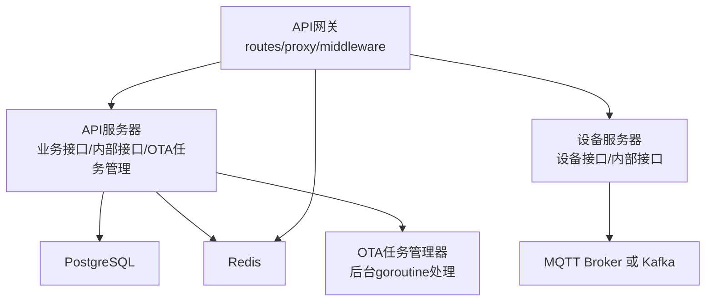
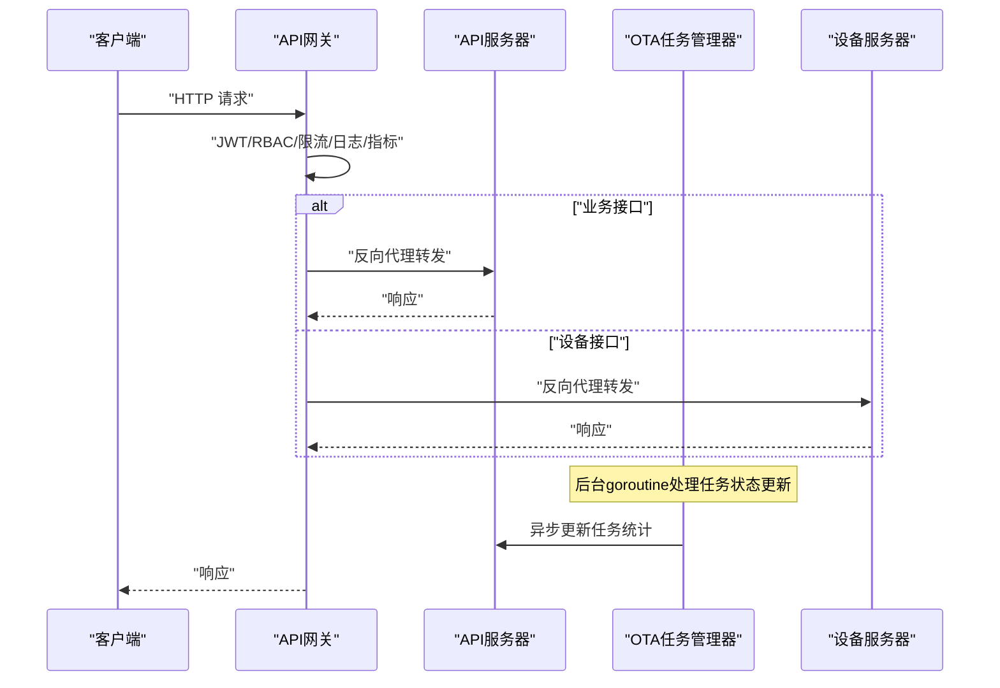
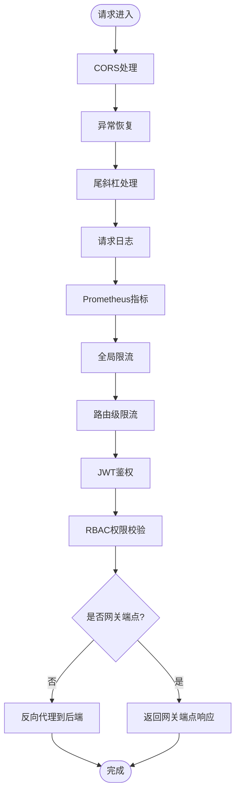
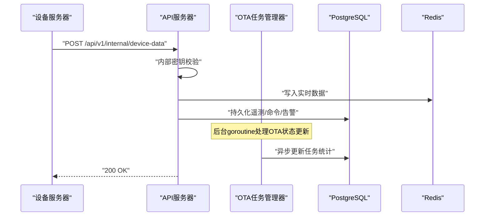
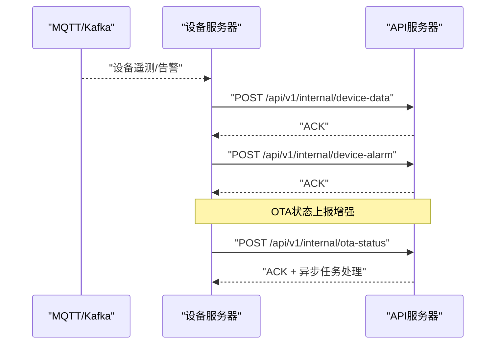
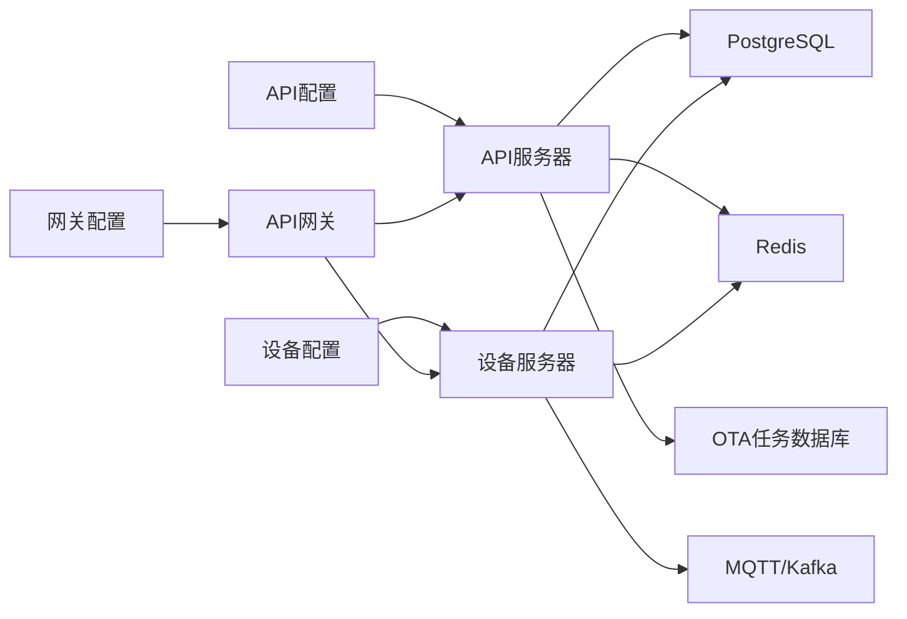

# 内部服务API

<cite>
**本文引用的文件**   
- [api-gateway/main.go](file://api-gateway/main.go)
- [api-gateway/internal/config/config.go](file://api-gateway/internal/config/config.go)
- [api-gateway/internal/routes/routes.go](file://api-gateway/internal/routes/routes.go)
- [api-gateway/internal/proxy/proxy.go](file://api-gateway/internal/proxy/proxy.go)
- [api-gateway/internal/middleware/jwt.go](file://api-gateway/internal/middleware/jwt.go)
- [api-gateway/internal/middleware/ratelimit.go](file://api-gateway/internal/middleware/ratelimit.go)
- [api-gateway/internal/middleware/prometheus.go](file://api-gateway/internal/middleware/prometheus.go)
- [api-gateway/internal/middleware/cors.go](file://api-gateway/internal/middleware/cors.go)
- [api-gateway/internal/middleware/logger.go](file://api-gateway/internal/middleware/logger.go)
- [api-gateway/internal/middleware/rbac.go](file://api-gateway/internal/middleware/rbac.go)
- [api-gateway/config.docker.yaml](file://api-gateway/config.docker.yaml)
- [inv_api_server/cmd/main.go](file://inv_api_server/cmd/main.go)
- [inv_api_server/config.docker.yaml](file://inv_api_server/config.docker.yaml)
- [inv_device_server/cmd/main.go](file://inv_device_server/cmd/main.go)
- [inv_device_server/config.docker.yaml](file://inv_device_server/config.docker.yaml)
- [inv_api_server/internal/handler/ws_handler.go](file://inv_api_server/internal/handler/ws_handler.go)
- [inv_api_server/internal/handler/internal_handler_test.go](file://inv_api_server/internal/handler/internal_handler_test.go)
- [inv_device_server/internal/service/protocol_parser.go](file://inv_device_server/internal/service/protocol_parser.go)
- [inv_api_server/internal/service/ota_service.go](file://inv_api_server/internal/service/ota_service.go)
- [inv_api_server/internal/handler/ota_handler.go](file://inv_api_server/internal/handler/ota_handler.go)
- [inv_api_server/internal/handler/internal_handler.go](file://inv_api_server/internal/handler/internal_handler.go)
- [database/migrations/006_refactor_ota_to_device_upgrades.sql](file://database/migrations/006_refactor_ota_to_device_upgrades.sql)
- [database/migrations/009_upgrade_tasks.up.sql](file://database/migrations/009_upgrade_tasks.up.sql)
</cite>

## 更新摘要
**变更内容**   
- 增强了OTA状态处理机制，新增自动任务管理功能
- 实现了后台goroutine执行非阻塞任务生命周期更新
- 改进了设备升级记录上下文信息，支持任务ID关联
- 新增了升级任务管理系统，支持批量设备升级和灰度发布

## 目录
1. [简介](#简介)
2. [项目结构](#项目结构)
3. [核心组件](#核心组件)
4. [架构总览](#架构总览)
5. [详细组件分析](#详细组件分析)
6. [依赖关系分析](#依赖关系分析)
7. [性能与容量规划](#性能与容量规划)
8. [故障排查指南](#故障排查指南)
9. [结论](#结论)
10. [附录：API清单与调用规范](#附录api清单与调用规范)

## 简介
本文件面向内部服务API，系统性梳理以下能力：
- 服务间通信接口：微服务调用、代理转发、路由规则与错误处理
- 认证与授权：JWT令牌验证、签名算法、RBAC权限控制、内部服务密钥校验
- 健康检查：服务状态监控、可用性检测、自动恢复策略
- 配置管理：动态配置加载、热重载与版本控制建议
- 日志与审计：访问日志、操作审计、安全审计
- 监控与调试：指标采集、链路追踪、可观测性工具
- **新增**：OTA升级任务管理系统，支持自动化任务调度和非阻塞状态更新

## 项目结构
系统由三类服务组成：
- API网关：统一入口、鉴权、限流、代理、指标与日志
- API服务器：业务接口、内部接口、鉴权、权限控制、健康检查、OTA任务管理
- 设备服务器：MQTT/Kafka接入、设备命令下发、内部接口、健康检查

**图表来源**
- [api-gateway/internal/routes/routes.go:25-55](file://api-gateway/internal/routes/routes.go#L25-L55)
- [api-gateway/internal/proxy/proxy.go:21-60](file://api-gateway/internal/proxy/proxy.go#L21-L60)
- [inv_api_server/cmd/main.go:344-579](file://inv_api_server/cmd/main.go#L344-L579)
- [inv_device_server/cmd/main.go:244-366](file://inv_device_server/cmd/main.go#L244-L366)
- [inv_api_server/internal/service/ota_service.go:264-304](file://inv_api_server/internal/service/ota_service.go#L264-L304)

章节来源
- [api-gateway/main.go:21-94](file://api-gateway/main.go#L21-L94)
- [api-gateway/internal/config/config.go:10-87](file://api-gateway/internal/config/config.go#L10-L87)
- [inv_api_server/cmd/main.go:34-86](file://inv_api_server/cmd/main.go#L34-L86)
- [inv_device_server/cmd/main.go:34-81](file://inv_device_server/cmd/main.go#L34-L81)

## 核心组件
- API网关
  - 配置加载与启动、JWT鉴权、CORS、限流、Prometheus指标、RBAC、反向代理
- API服务器
  - 公共接口、鉴权、权限控制、内部接口、健康检查、WebSocket、**OTA任务管理**
- 设备服务器
  - 设备在线/数据查询、命令下发、内部接口、健康检查、MQTT/Kafka接入

章节来源
- [api-gateway/internal/middleware/jwt.go:44-122](file://api-gateway/internal/middleware/jwt.go#L44-122)
- [api-gateway/internal/middleware/rbac.go:190-239](file://api-gateway/internal/middleware/rbac.go#L190-239)
- [api-gateway/internal/proxy/proxy.go:21-60](file://api-gateway/internal/proxy/proxy.go#L21-60)
- [inv_api_server/cmd/main.go:356-377](file://inv_api_server/cmd/main.go#L356-377)
- [inv_device_server/cmd/main.go:252-269](file://inv_device_server/cmd/main.go#L252-269)

## 架构总览
API网关负责统一入口、鉴权与限流，并将请求转发至API服务器或设备服务器；设备服务器通过MQTT或Kafka接收设备数据，同时提供内部接口供设备上报与命令下发。**新增的OTA任务管理系统支持自动化升级流程和非阻塞状态更新**。

**图表来源**
- [api-gateway/internal/routes/routes.go:25-55](file://api-gateway/internal/routes/routes.go#L25-55)
- [api-gateway/internal/proxy/proxy.go:62-68](file://api-gateway/internal/proxy/proxy.go#L62-68)
- [api-gateway/internal/middleware/jwt.go:44-122](file://api-gateway/internal/middleware/jwt.go#L44-122)
- [api-gateway/internal/middleware/rbac.go:190-239](file://api-gateway/internal/middleware/rbac.go#L190-239)
- [inv_api_server/internal/service/ota_service.go:264-304](file://inv_api_server/internal/service/ota_service.go#L264-304)

## 详细组件分析

### API网关
- 配置与启动
  - 从配置文件加载参数，初始化Redis、RBAC、Prometheus指标
  - 启动HTTP服务，设置优雅关闭
- 中间件链
  - CORS、日志、限流、JWT鉴权、RBAC、Prometheus
- 路由与代理
  - 注册网关自身端点（健康检查、指标、API文档）
  - 将业务接口映射到后端API服务器，设备接口映射到设备服务器
  - 提供路径重写（如告警/告警规则等别名映射）

**图表来源**
- [api-gateway/internal/routes/routes.go:25-55](file://api-gateway/internal/routes/routes.go#L25-55)
- [api-gateway/internal/middleware/ratelimit.go:48-94](file://api-gateway/internal/middleware/ratelimit.go#L48-94)
- [api-gateway/internal/middleware/jwt.go:44-122](file://api-gateway/internal/middleware/jwt.go#L44-122)
- [api-gateway/internal/middleware/rbac.go:190-239](file://api-gateway/internal/middleware/rbac.go#L190-239)
- [api-gateway/internal/proxy/proxy.go:62-68](file://api-gateway/internal/proxy/proxy.go#L62-68)

章节来源
- [api-gateway/main.go:21-94](file://api-gateway/main.go#L21-94)
- [api-gateway/internal/config/config.go:57-87](file://api-gateway/internal/config/config.go#L57-87)
- [api-gateway/internal/routes/routes.go:25-125](file://api-gateway/internal/routes/routes.go#L25-125)
- [api-gateway/internal/proxy/proxy.go:21-60](file://api-gateway/internal/proxy/proxy.go#L21-60)
- [api-gateway/internal/middleware/cors.go:9-26](file://api-gateway/internal/middleware/cors.go#L9-26)
- [api-gateway/internal/middleware/logger.go:10-31](file://api-gateway/internal/middleware/logger.go#L10-31)
- [api-gateway/internal/middleware/prometheus.go:17-66](file://api-gateway/internal/middleware/prometheus.go#L17-66)
- [api-gateway/internal/middleware/ratelimit.go:48-94](file://api-gateway/internal/middleware/ratelimit.go#L48-94)
- [api-gateway/internal/middleware/jwt.go:44-122](file://api-gateway/internal/middleware/jwt.go#L44-122)
- [api-gateway/internal/middleware/rbac.go:190-239](file://api-gateway/internal/middleware/rbac.go#L190-239)
- [api-gateway/config.docker.yaml:1-39](file://api-gateway/config.docker.yaml#L1-39)

### API服务器
- 健康检查
  - 返回服务状态，包含数据库与Redis连通性
- 内部接口
  - 设备状态、信息、遥测、命令结果、告警、**OTA状态/命令确认**
  - 使用内部密钥进行服务间认证
- WebSocket
  - 基于JWT鉴权的实时推送通道
- 权限控制
  - RBAC权限校验中间件，支持管理员与多资源细粒度控制
- **新增：OTA任务管理**
  - 支持创建、执行、取消升级任务
  - 后台goroutine异步更新任务状态和统计信息
  - 支持单芯片和升级包两种升级模式

**图表来源**
- [inv_api_server/cmd/main.go:379-391](file://inv_api_server/cmd/main.go#L379-391)
- [inv_api_server/cmd/main.go:356-377](file://inv_api_server/cmd/main.go#L356-377)
- [inv_device_server/internal/service/protocol_parser.go:406-445](file://inv_device_server/internal/service/protocol_parser.go#L406-445)
- [inv_api_server/internal/service/ota_service.go:264-304](file://inv_api_server/internal/service/ota_service.go#L264-304)

章节来源
- [inv_api_server/cmd/main.go:356-391](file://inv_api_server/cmd/main.go#L356-391)
- [inv_api_server/cmd/main.go:396-579](file://inv_api_server/cmd/main.go#L396-579)
- [inv_api_server/internal/handler/ws_handler.go:39-61](file://inv_api_server/internal/handler/ws_handler.go#L39-61)
- [inv_api_server/config.docker.yaml:1-57](file://inv_api_server/config.docker.yaml#L1-57)
- [inv_api_server/internal/service/ota_service.go:256-320](file://inv_api_server/internal/service/ota_service.go#L256-320)

### 设备服务器
- 健康检查
  - 返回服务状态、Redis连通性、MQTT在线设备数
- 设备接口
  - 在线状态查询、实时数据查询、命令下发（需内部密钥）
- 内部接口
  - 与API服务器对接，上报设备状态、遥测、告警、**OTA状态等**
- 数据通道
  - MQTT或Kafka：协议解析、告警消费、命令下发

**图表来源**
- [inv_device_server/cmd/main.go:252-269](file://inv_device_server/cmd/main.go#L252-269)
- [inv_device_server/cmd/main.go:302-321](file://inv_device_server/cmd/main.go#L302-321)
- [inv_device_server/cmd/main.go:323-357](file://inv_device_server/cmd/main.go#L323-357)
- [inv_device_server/internal/service/protocol_parser.go:406-445](file://inv_device_server/internal/service/protocol_parser.go#L406-445)

章节来源
- [inv_device_server/cmd/main.go:252-366](file://inv_device_server/cmd/main.go#L252-366)
- [inv_device_server/config.docker.yaml:1-54](file://inv_device_server/config.docker.yaml#L1-54)

## 依赖关系分析
- 配置依赖
  - 网关：JWT密钥、后端地址、Redis、限流规则、RBAC开关
  - API服务器：数据库、Redis、JWT配置、短信/邮件、日志、后端设备服务器地址
  - 设备服务器：数据库、Redis、MQTT/Kafka、日志、后端API服务器地址
- 运行时依赖
  - 网关依赖Redis用于RBAC缓存与降级
  - API服务器依赖PostgreSQL与Redis
  - 设备服务器依赖PostgreSQL、Redis、MQTT或Kafka
- **新增：OTA任务管理依赖**
  - 升级任务表(upgrade_tasks)和设备升级表(device_upgrades)的task_id关联
  - 后台goroutine异步处理任务状态更新，避免阻塞主流程

**图表来源**
- [api-gateway/internal/config/config.go:10-87](file://api-gateway/internal/config/config.go#L10-87)
- [api-gateway/config.docker.yaml:1-39](file://api-gateway/config.docker.yaml#L1-39)
- [inv_api_server/config.docker.yaml:1-57](file://inv_api_server/config.docker.yaml#L1-57)
- [inv_device_server/config.docker.yaml:1-54](file://inv_device_server/config.docker.yaml#L1-54)
- [database/migrations/009_upgrade_tasks.up.sql:7-37](file://database/migrations/009_upgrade_tasks.up.sql#L7-37)

章节来源
- [api-gateway/internal/config/config.go:57-87](file://api-gateway/internal/config/config.go#L57-87)
- [inv_api_server/cmd/main.go:239-322](file://inv_api_server/cmd/main.go#L239-322)
- [inv_device_server/cmd/main.go:193-242](file://inv_device_server/cmd/main.go#L193-242)

## 性能与容量规划
- 网关
  - 反向代理连接池参数（最大连接、每主机连接、空闲超时）保障高并发稳定性
  - 全局限流与路由级限流结合，针对高频接口（如设备接口、登录接口）设置独立阈值
- API服务器
  - 数据库连接池参数与Redis连接池参数，确保高并发下的连接复用
  - 内部接口采用异步落库与缓存，降低主流程阻塞
  - **OTA任务管理采用后台goroutine处理，避免阻塞OTA状态更新主流程**
- 设备服务器
  - Kafka消费者/生产者批处理与重试策略，避免单点失败导致数据丢失
  - MQTT连接超时与保活参数，保证长连接稳定

章节来源
- [api-gateway/internal/proxy/proxy.go:37-47](file://api-gateway/internal/proxy/proxy.go#L37-47)
- [api-gateway/internal/middleware/ratelimit.go:48-94](file://api-gateway/internal/middleware/ratelimit.go#L48-94)
- [inv_api_server/config.docker.yaml:7-17](file://inv_api_server/config.docker.yaml#L7-17)
- [inv_device_server/config.docker.yaml:7-17](file://inv_device_server/config.docker.yaml#L7-17)
- [inv_device_server/internal/service/protocol_parser.go:406-445](file://inv_device_server/internal/service/protocol_parser.go#L406-445)
- [inv_api_server/internal/service/ota_service.go:264-304](file://inv_api_server/internal/service/ota_service.go#L264-304)

## 故障排查指南
- 网关
  - 502错误：后端服务不可达，检查目标地址与网络连通性
  - 401/403：JWT无效或权限不足，检查令牌格式、签名算法与RBAC资源权限
  - 429：请求过于频繁，调整全局/路由级限流配置
- API服务器
  - 健康检查失败：检查数据库与Redis连通性，查看日志
  - 内部接口401：确认X-Internal-Key正确
  - WebSocket连接失败：检查JWT有效性与并发连接上限
  - **OTA任务相关：检查upgrade_tasks表状态同步，查看后台goroutine执行情况**
- 设备服务器
  - 健康检查失败：检查Redis连通性与MQTT/Kafka状态
  - 命令下发失败：确认设备在线、内部密钥一致、后端API可达
  - **OTA状态上报：检查ota-status接口响应，确认任务ID关联正确**

章节来源
- [api-gateway/internal/proxy/proxy.go:48-54](file://api-gateway/internal/proxy/proxy.go#L48-54)
- [api-gateway/internal/middleware/jwt.go:75-90](file://api-gateway/internal/middleware/jwt.go#L75-90)
- [api-gateway/internal/middleware/rbac.go:226-234](file://api-gateway/internal/middleware/rbac.go#L226-234)
- [api-gateway/internal/middleware/ratelimit.go:52-59](file://api-gateway/internal/middleware/ratelimit.go#L52-59)
- [inv_api_server/cmd/main.go:356-377](file://inv_api_server/cmd/main.go#L356-377)
- [inv_api_server/cmd/main.go:381-391](file://inv_api_server/cmd/main.go#L381-391)
- [inv_api_server/internal/handler/ws_handler.go:48-61](file://inv_api_server/internal/handler/ws_handler.go#L48-61)
- [inv_device_server/cmd/main.go:252-269](file://inv_device_server/cmd/main.go#L252-269)
- [inv_device_server/cmd/main.go:323-357](file://inv_device_server/cmd/main.go#L323-357)
- [inv_api_server/internal/service/ota_service.go:264-304](file://inv_api_server/internal/service/ota_service.go#L264-304)

## 结论
本系统通过API网关实现统一入口与治理能力，配合API服务器与设备服务器形成完整的内部服务生态。JWT与RBAC提供基础认证与权限控制，反向代理与限流保障稳定性，健康检查与指标体系支撑可观测性。**新增的OTA任务管理系统通过后台goroutine实现非阻塞任务处理，提升了系统性能和可靠性**。建议在生产中强化配置热重载与版本控制、完善审计与告警闭环。

## 附录：API清单与调用规范

### 网关端点
- GET /health：健康检查
- GET /metrics：Prometheus指标
- GET /api/docs：API文档

章节来源
- [api-gateway/internal/routes/routes.go:57-71](file://api-gateway/internal/routes/routes.go#L57-71)

### 业务接口（转发至API服务器）
- 认证相关：登录、注册、验证码、重置密码、登出、改密、个人资料
- 站点与设备：增删改查、绑定/解绑、控制、历史与统计
- 告警与通知：列表、详情、处理、统计
- 模型与协议：型号管理、字段与协议CRUD
- 仪表盘与报表：统计、趋势、大屏、对比
- **OTA与并机：固件与升级管理、并机配置、升级任务管理**
- 管理后台：用户、权限、系统配置、租户、审计日志、指标

章节来源
- [api-gateway/internal/routes/routes.go:73-106](file://api-gateway/internal/routes/routes.go#L73-106)
- [inv_api_server/cmd/main.go:396-579](file://inv_api_server/cmd/main.go#L396-579)

### 设备接口（转发至设备服务器）
- GET /api/v1/device/:sn/online：查询设备在线状态
- GET /api/v1/device/:sn/data：查询设备实时缓存数据
- POST /api/v1/device/:sn/command：下发命令（需内部密钥）

章节来源
- [api-gateway/internal/routes/routes.go:108-111](file://api-gateway/internal/routes/routes.go#L108-111)
- [inv_device_server/cmd/main.go:302-357](file://inv_device_server/cmd/main.go#L302-357)

### 内部接口（服务间通信）
- API服务器内部端点（需X-Internal-Key）
  - POST /api/v1/internal/device-status
  - POST /api/v1/internal/device-info
  - POST /api/v1/internal/device-data
  - POST /api/v1/internal/device-cmd-status
  - POST /api/v1/internal/device-cmd-result
  - POST /api/v1/internal/device-alarm
  - **POST /api/v1/internal/ota-status**
  - **POST /api/v1/internal/ota-cmd-ack**

- 设备服务器内部端点（上报遥测/告警/OTA状态）
  - 由设备服务器主动调用API服务器内部接口

章节来源
- [inv_api_server/cmd/main.go:379-391](file://inv_api_server/cmd/main.go#L379-391)
- [inv_device_server/internal/service/protocol_parser.go:406-445](file://inv_device_server/internal/service/protocol_parser.go#L406-445)

### 认证与授权
- JWT
  - 签名算法：HMAC系列（具体算法在解析时校验）
  - 必填头：Authorization: Bearer <token>
  - 网关公开端点：健康检查、指标、API文档、验证码、登录/注册等
- RBAC
  - 资源映射：管理员、用户、OTA、并机、设备、告警、站点等
  - 动作映射：视图、创建、编辑、删除
  - 缓存：Redis缓存角色与权限，支持TTL与失效

章节来源
- [api-gateway/internal/middleware/jwt.go:75-90](file://api-gateway/internal/middleware/jwt.go#L75-90)
- [api-gateway/internal/middleware/rbac.go:178-239](file://api-gateway/internal/middleware/rbac.go#L178-239)
- [api-gateway/config.docker.yaml:36-39](file://api-gateway/config.docker.yaml#L36-39)

### 健康检查
- 网关：/health（固定返回服务名与时间）
- API服务器：/health（含数据库与Redis状态）
- 设备服务器：/health（含Redis与MQTT在线客户端数）

章节来源
- [api-gateway/internal/routes/routes.go:57-64](file://api-gateway/internal/routes/routes.go#L57-64)
- [inv_api_server/cmd/main.go:356-377](file://inv_api_server/cmd/main.go#L356-377)
- [inv_device_server/cmd/main.go:252-269](file://inv_device_server/cmd/main.go#L252-269)

### 限流与熔断
- 全局限流与路由级限流：基于令牌桶算法，支持不同路径独立阈值
- 熔断：后端5xx自动重试，4xx直接失败

章节来源
- [api-gateway/internal/middleware/ratelimit.go:48-94](file://api-gateway/internal/middleware/ratelimit.go#L48-94)
- [api-gateway/internal/proxy/proxy.go:48-54](file://api-gateway/internal/proxy/proxy.go#L48-54)
- [inv_device_server/internal/service/protocol_parser.go:406-445](file://inv_device_server/internal/service/protocol_parser.go#L406-445)

### 配置管理
- 网关配置项：server、jwt、rate_limit、route_rate_limits、backends、redis、rbac
- API服务器配置项：server、database、redis、jwt、sms、email、log、timezone、backends
- 设备服务器配置项：server、database、redis、mqtt/kafka、backends、log、timezone

章节来源
- [api-gateway/config.docker.yaml:1-39](file://api-gateway/config.docker.yaml#L1-39)
- [inv_api_server/config.docker.yaml:1-57](file://inv_api_server/config.docker.yaml#L1-57)
- [inv_device_server/config.docker.yaml:1-54](file://inv_device_server/config.docker.yaml#L1-54)

### 日志与审计
- 网关：请求日志、调试仪器输出（NoRoute、JWT/RBAC/代理行为）
- API服务器：zap结构化日志、审计日志导出、**OTA任务操作日志**
- 设备服务器：zap结构化日志、MQTT/Kafka消费/生产统计

章节来源
- [api-gateway/internal/middleware/logger.go:10-31](file://api-gateway/internal/middleware/logger.go#L10-31)
- [inv_api_server/cmd/main.go:221-237](file://inv_api_server/cmd/main.go#L221-237)
- [inv_device_server/cmd/main.go:76-81](file://inv_device_server/cmd/main.go#L76-81)

### 监控与调试
- 指标：网关Prometheus指标（请求数、耗时、在途请求数）、设备服务器自定义指标
- 链路追踪：API服务器Gin中间件埋点
- WebSocket：基于JWT鉴权的实时通道
- **OTA任务监控：任务状态统计、设备升级进度、后台goroutine执行情况**

章节来源
- [api-gateway/internal/middleware/prometheus.go:17-66](file://api-gateway/internal/middleware/prometheus.go#L17-66)
- [inv_api_server/cmd/main.go:592-600](file://inv_api_server/cmd/main.go#L592-600)
- [inv_api_server/internal/handler/ws_handler.go:39-61](file://inv_api_server/internal/handler/ws_handler.go#L39-61)
- [inv_api_server/internal/service/ota_service.go:1326-1329](file://inv_api_server/internal/service/ota_service.go#L1326-1329)

### OTA任务管理API（新增）
- 任务管理
  - GET /api/v1/ota/tasks：获取升级任务列表
  - POST /api/v1/ota/tasks：创建升级任务
  - GET /api/v1/ota/tasks/stats：获取任务统计
  - GET /api/v1/ota/tasks/:id：获取任务详情
  - POST /api/v1/ota/tasks/:id/execute：手动执行任务
  - POST /api/v1/ota/tasks/:id/cancel：取消任务
  - POST /api/v1/ota/tasks/:id/retry：重试失败设备
  - DELETE /api/v1/ota/tasks/:id：删除任务
  - GET /api/v1/ota/tasks/:id/devices：获取任务下设备详情

- 设备升级管理
  - GET /api/v1/ota/upgrades/dashboard：获取升级面板数据
  - POST /api/v1/ota/upgrades/push：推送升级
  - GET /api/v1/ota/upgrades/firmware/:firmwareId：获取固件升级详情
  - POST /api/v1/ota/upgrades/retry：重试失败升级
  - POST /api/v1/ota/upgrades/cancel：取消升级
  - DELETE /api/v1/ota/upgrades/firmware/:firmwareId：删除固件升级记录

- 升级包管理
  - GET /api/v1/ota/packages：获取升级包列表
  - GET /api/v1/ota/packages/:id：获取升级包详情
  - POST /api/v1/ota/packages：创建升级包
  - DELETE /api/v1/ota/packages/:id：删除升级包
  - POST /api/v1/ota/packages/push：推送升级包
  - POST /api/v1/ota/packages/:id/rollback：回滚升级包
  - GET /api/v1/ota/packages/:id/details：获取升级包设备详情

章节来源
- [inv_api_server/cmd/main.go:687-779](file://inv_api_server/cmd/main.go#L687-779)
- [inv_api_server/internal/handler/ota_handler.go:801-976](file://inv_api_server/internal/handler/ota_handler.go#L801-976)
- [inv_api_server/internal/service/ota_service.go:965-1329](file://inv_api_server/internal/service/ota_service.go#L965-1329)

### OTA状态处理增强（新增）
- 后台goroutine处理
  - 非阻塞任务状态更新，提升系统响应性能
  - 自动任务状态转换：pending/scheduled → running → completed/partial_success
  - 设备升级完成时自动更新任务统计计数
- 设备升级记录上下文
  - 支持task_id关联，便于任务级别的状态追踪
  - 支持upgrade_package_id关联，支持升级包模式
  - 改进的错误消息处理和进度跟踪

章节来源
- [inv_api_server/internal/service/ota_service.go:264-304](file://inv_api_server/internal/service/ota_service.go#L264-304)
- [inv_api_server/internal/handler/internal_handler.go:955-1012](file://inv_api_server/internal/handler/internal_handler.go#L955-1012)
- [database/migrations/009_upgrade_tasks.up.sql:34-37](file://database/migrations/009_upgrade_tasks.up.sql#L34-37)