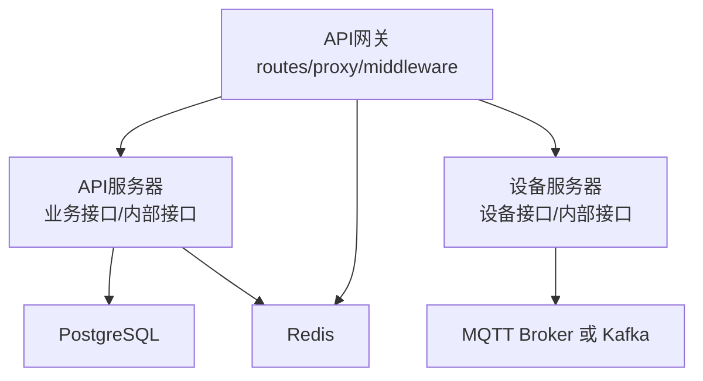
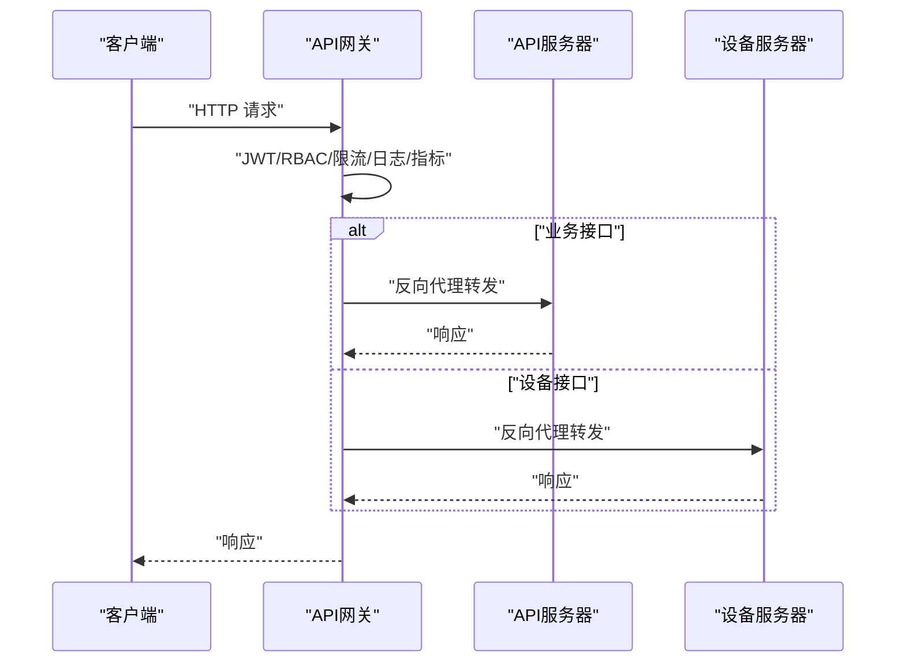
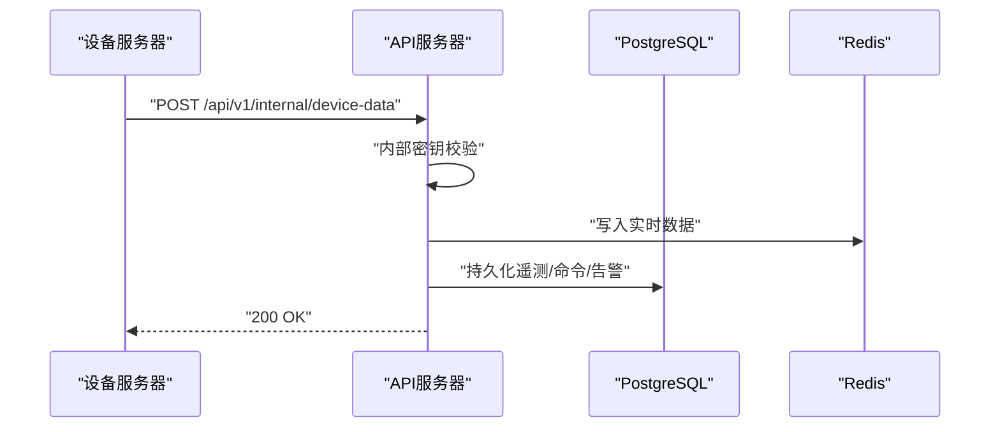
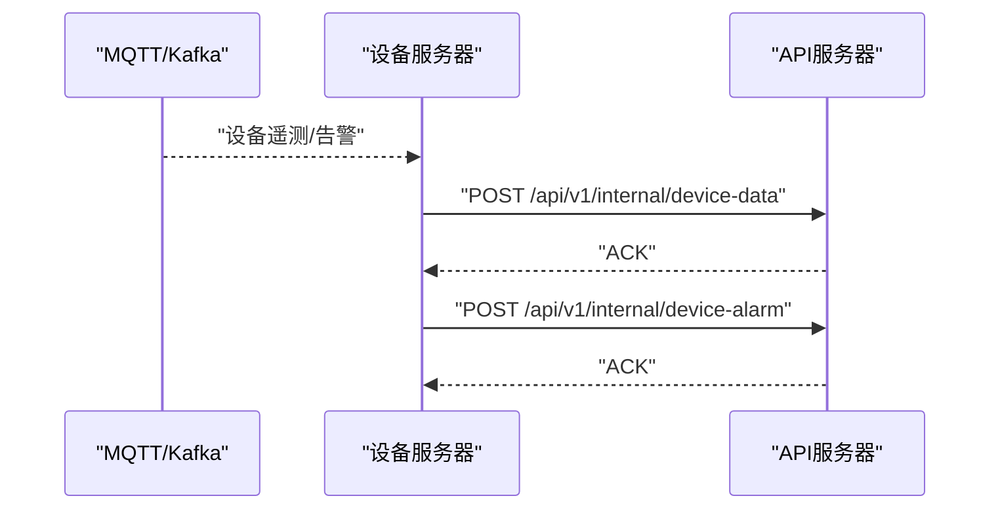
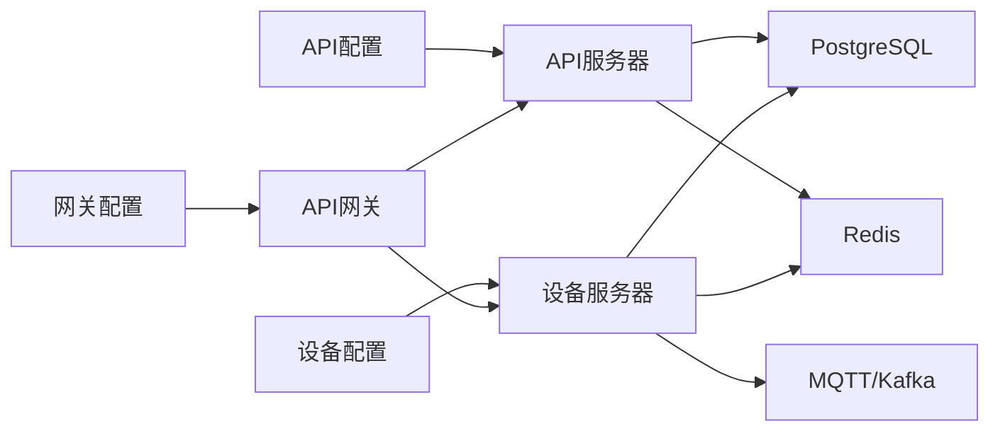

# 内部服务API

<cite>
**本文引用的文件**   
- [api-gateway/main.go](file://api-gateway/main.go)
- [api-gateway/internal/config/config.go](file://api-gateway/internal/config/config.go)
- [api-gateway/internal/routes/routes.go](file://api-gateway/internal/routes/routes.go)
- [api-gateway/internal/proxy/proxy.go](file://api-gateway/internal/proxy/proxy.go)
- [api-gateway/internal/middleware/jwt.go](file://api-gateway/internal/middleware/jwt.go)
- [api-gateway/internal/middleware/ratelimit.go](file://api-gateway/internal/middleware/ratelimit.go)
- [api-gateway/internal/middleware/prometheus.go](file://api-gateway/internal/middleware/prometheus.go)
- [api-gateway/internal/middleware/cors.go](file://api-gateway/internal/middleware/cors.go)
- [api-gateway/internal/middleware/logger.go](file://api-gateway/internal/middleware/logger.go)
- [api-gateway/internal/middleware/rbac.go](file://api-gateway/internal/middleware/rbac.go)
- [api-gateway/config.docker.yaml](file://api-gateway/config.docker.yaml)
- [inv_api_server/cmd/main.go](file://inv_api_server/cmd/main.go)
- [inv_api_server/config.docker.yaml](file://inv_api_server/config.docker.yaml)
- [inv_device_server/cmd/main.go](file://inv_device_server/cmd/main.go)
- [inv_device_server/config.docker.yaml](file://inv_device_server/config.docker.yaml)
- [inv_api_server/internal/handler/ws_handler.go](file://inv_api_server/internal/handler/ws_handler.go)
- [inv_api_server/internal/handler/internal_handler_test.go](file://inv_api_server/internal/handler/internal_handler_test.go)
- [inv_device_server/internal/service/protocol_parser.go](file://inv_device_server/internal/service/protocol_parser.go)
</cite>

## 目录
1. [简介](#简介)
2. [项目结构](#项目结构)
3. [核心组件](#核心组件)
4. [架构总览](#架构总览)
5. [详细组件分析](#详细组件分析)
6. [依赖关系分析](#依赖关系分析)
7. [性能与容量规划](#性能与容量规划)
8. [故障排查指南](#故障排查指南)
9. [结论](#结论)
10. [附录：API清单与调用规范](#附录api清单与调用规范)

## 简介
本文件面向内部服务API，系统性梳理以下能力：
- 服务间通信接口：微服务调用、代理转发、路由规则与错误处理
- 认证与授权：JWT令牌验证、签名算法、RBAC权限控制、内部服务密钥校验
- 健康检查：服务状态监控、可用性检测、自动恢复策略
- 配置管理：动态配置加载、热重载与版本控制建议
- 日志与审计：访问日志、操作审计、安全审计
- 监控与调试：指标采集、链路追踪、可观测性工具

## 项目结构
系统由三类服务组成：
- API网关：统一入口、鉴权、限流、代理、指标与日志
- API服务器：业务接口、内部接口、鉴权、权限控制、健康检查
- 设备服务器：MQTT/Kafka接入、设备命令下发、内部接口、健康检查

图表来源
- [api-gateway/internal/routes/routes.go:25-55](file://api-gateway/internal/routes/routes.go#L25-L55)
- [api-gateway/internal/proxy/proxy.go:21-60](file://api-gateway/internal/proxy/proxy.go#L21-L60)
- [inv_api_server/cmd/main.go:344-579](file://inv_api_server/cmd/main.go#L344-L579)
- [inv_device_server/cmd/main.go:244-366](file://inv_device_server/cmd/main.go#L244-L366)

章节来源
- [api-gateway/main.go:21-94](file://api-gateway/main.go#L21-L94)
- [api-gateway/internal/config/config.go:10-87](file://api-gateway/internal/config/config.go#L10-L87)
- [inv_api_server/cmd/main.go:34-86](file://inv_api_server/cmd/main.go#L34-L86)
- [inv_device_server/cmd/main.go:34-81](file://inv_device_server/cmd/main.go#L34-L81)

## 核心组件
- API网关
  - 配置加载与启动、JWT鉴权、CORS、限流、Prometheus指标、RBAC、反向代理
- API服务器
  - 公共接口、鉴权、权限控制、内部接口、健康检查、WebSocket
- 设备服务器
  - 设备在线/数据查询、命令下发、内部接口、健康检查、MQTT/Kafka接入

章节来源
- [api-gateway/internal/middleware/jwt.go:44-122](file://api-gateway/internal/middleware/jwt.go#L44-L122)
- [api-gateway/internal/middleware/rbac.go:190-239](file://api-gateway/internal/middleware/rbac.go#L190-L239)
- [api-gateway/internal/proxy/proxy.go:21-60](file://api-gateway/internal/proxy/proxy.go#L21-L60)
- [inv_api_server/cmd/main.go:356-377](file://inv_api_server/cmd/main.go#L356-L377)
- [inv_device_server/cmd/main.go:252-269](file://inv_device_server/cmd/main.go#L252-L269)

## 架构总览
API网关负责统一入口、鉴权与限流，并将请求转发至API服务器或设备服务器；设备服务器通过MQTT或Kafka接收设备数据，同时提供内部接口供设备上报与命令下发。

图表来源
- [api-gateway/internal/routes/routes.go:25-55](file://api-gateway/internal/routes/routes.go#L25-L55)
- [api-gateway/internal/proxy/proxy.go:62-68](file://api-gateway/internal/proxy/proxy.go#L62-L68)
- [api-gateway/internal/middleware/jwt.go:44-122](file://api-gateway/internal/middleware/jwt.go#L44-L122)
- [api-gateway/internal/middleware/rbac.go:190-239](file://api-gateway/internal/middleware/rbac.go#L190-L239)

## 详细组件分析

### API网关
- 配置与启动
  - 从配置文件加载参数，初始化Redis、RBAC、Prometheus指标
  - 启动HTTP服务，设置优雅关闭
- 中间件链
  - CORS、日志、限流、JWT鉴权、RBAC、Prometheus
- 路由与代理
  - 注册网关自身端点（健康检查、指标、API文档）
  - 将业务接口映射到后端API服务器，设备接口映射到设备服务器
  - 提供路径重写（如告警/告警规则等别名映射）

图表来源
- [api-gateway/internal/routes/routes.go:25-55](file://api-gateway/internal/routes/routes.go#L25-L55)
- [api-gateway/internal/middleware/ratelimit.go:48-94](file://api-gateway/internal/middleware/ratelimit.go#L48-L94)
- [api-gateway/internal/middleware/jwt.go:44-122](file://api-gateway/internal/middleware/jwt.go#L44-L122)
- [api-gateway/internal/middleware/rbac.go:190-239](file://api-gateway/internal/middleware/rbac.go#L190-L239)
- [api-gateway/internal/proxy/proxy.go:62-68](file://api-gateway/internal/proxy/proxy.go#L62-L68)

章节来源
- [api-gateway/main.go:21-94](file://api-gateway/main.go#L21-L94)
- [api-gateway/internal/config/config.go:57-87](file://api-gateway/internal/config/config.go#L57-L87)
- [api-gateway/internal/routes/routes.go:25-125](file://api-gateway/internal/routes/routes.go#L25-L125)
- [api-gateway/internal/proxy/proxy.go:21-60](file://api-gateway/internal/proxy/proxy.go#L21-L60)
- [api-gateway/internal/middleware/cors.go:9-26](file://api-gateway/internal/middleware/cors.go#L9-L26)
- [api-gateway/internal/middleware/logger.go:10-31](file://api-gateway/internal/middleware/logger.go#L10-L31)
- [api-gateway/internal/middleware/prometheus.go:17-66](file://api-gateway/internal/middleware/prometheus.go#L17-L66)
- [api-gateway/internal/middleware/ratelimit.go:48-94](file://api-gateway/internal/middleware/ratelimit.go#L48-L94)
- [api-gateway/internal/middleware/jwt.go:44-122](file://api-gateway/internal/middleware/jwt.go#L44-L122)
- [api-gateway/internal/middleware/rbac.go:190-239](file://api-gateway/internal/middleware/rbac.go#L190-L239)
- [api-gateway/config.docker.yaml:1-39](file://api-gateway/config.docker.yaml#L1-L39)

### API服务器
- 健康检查
  - 返回服务状态，包含数据库与Redis连通性
- 内部接口
  - 设备状态、信息、遥测、命令结果、告警、OTA状态/命令确认等
  - 使用内部密钥进行服务间认证
- WebSocket
  - 基于JWT鉴权的实时推送通道
- 权限控制
  - RBAC权限校验中间件，支持管理员与多资源细粒度控制

图表来源
- [inv_api_server/cmd/main.go:379-391](file://inv_api_server/cmd/main.go#L379-L391)
- [inv_api_server/cmd/main.go:356-377](file://inv_api_server/cmd/main.go#L356-L377)
- [inv_device_server/internal/service/protocol_parser.go:406-445](file://inv_device_server/internal/service/protocol_parser.go#L406-L445)

章节来源
- [inv_api_server/cmd/main.go:356-391](file://inv_api_server/cmd/main.go#L356-L391)
- [inv_api_server/cmd/main.go:396-579](file://inv_api_server/cmd/main.go#L396-L579)
- [inv_api_server/internal/handler/ws_handler.go:39-61](file://inv_api_server/internal/handler/ws_handler.go#L39-L61)
- [inv_api_server/config.docker.yaml:1-57](file://inv_api_server/config.docker.yaml#L1-L57)

### 设备服务器
- 健康检查
  - 返回服务状态、Redis连通性、MQTT在线设备数
- 设备接口
  - 在线状态查询、实时数据查询、命令下发（需内部密钥）
- 内部接口
  - 与API服务器对接，上报设备状态、遥测、告警、OTA状态等
- 数据通道
  - MQTT或Kafka：协议解析、告警消费、命令下发

图表来源
- [inv_device_server/cmd/main.go:252-269](file://inv_device_server/cmd/main.go#L252-L269)
- [inv_device_server/cmd/main.go:302-321](file://inv_device_server/cmd/main.go#L302-L321)
- [inv_device_server/cmd/main.go:323-357](file://inv_device_server/cmd/main.go#L323-L357)
- [inv_device_server/internal/service/protocol_parser.go:406-445](file://inv_device_server/internal/service/protocol_parser.go#L406-L445)

章节来源
- [inv_device_server/cmd/main.go:252-366](file://inv_device_server/cmd/main.go#L252-L366)
- [inv_device_server/config.docker.yaml:1-54](file://inv_device_server/config.docker.yaml#L1-L54)

## 依赖关系分析
- 配置依赖
  - 网关：JWT密钥、后端地址、Redis、限流规则、RBAC开关
  - API服务器：数据库、Redis、JWT配置、短信/邮件、日志、后端设备服务器地址
  - 设备服务器：数据库、Redis、MQTT/Kafka、日志、后端API服务器地址
- 运行时依赖
  - 网关依赖Redis用于RBAC缓存与降级
  - API服务器依赖PostgreSQL与Redis
  - 设备服务器依赖PostgreSQL、Redis、MQTT或Kafka

图表来源
- [api-gateway/internal/config/config.go:10-87](file://api-gateway/internal/config/config.go#L10-L87)
- [api-gateway/config.docker.yaml:1-39](file://api-gateway/config.docker.yaml#L1-L39)
- [inv_api_server/config.docker.yaml:1-57](file://inv_api_server/config.docker.yaml#L1-L57)
- [inv_device_server/config.docker.yaml:1-54](file://inv_device_server/config.docker.yaml#L1-L54)

章节来源
- [api-gateway/internal/config/config.go:57-87](file://api-gateway/internal/config/config.go#L57-L87)
- [inv_api_server/cmd/main.go:239-322](file://inv_api_server/cmd/main.go#L239-L322)
- [inv_device_server/cmd/main.go:193-242](file://inv_device_server/cmd/main.go#L193-L242)

## 性能与容量规划
- 网关
  - 反向代理连接池参数（最大连接、每主机连接、空闲超时）保障高并发稳定性
  - 全局限流与路由级限流结合，针对高频接口（如设备接口、登录接口）设置独立阈值
- API服务器
  - 数据库连接池参数与Redis连接池参数，确保高并发下的连接复用
  - 内部接口采用异步落库与缓存，降低主流程阻塞
- 设备服务器
  - Kafka消费者/生产者批处理与重试策略，避免单点失败导致数据丢失
  - MQTT连接超时与保活参数，保证长连接稳定

章节来源
- [api-gateway/internal/proxy/proxy.go:37-47](file://api-gateway/internal/proxy/proxy.go#L37-L47)
- [api-gateway/internal/middleware/ratelimit.go:48-94](file://api-gateway/internal/middleware/ratelimit.go#L48-L94)
- [inv_api_server/config.docker.yaml:7-17](file://inv_api_server/config.docker.yaml#L7-L17)
- [inv_device_server/config.docker.yaml:7-17](file://inv_device_server/config.docker.yaml#L7-L17)
- [inv_device_server/internal/service/protocol_parser.go:406-445](file://inv_device_server/internal/service/protocol_parser.go#L406-L445)

## 故障排查指南
- 网关
  - 502错误：后端服务不可达，检查目标地址与网络连通性
  - 401/403：JWT无效或权限不足，检查令牌格式、签名算法与RBAC资源权限
  - 429：请求过于频繁，调整全局/路由级限流配置
- API服务器
  - 健康检查失败：检查数据库与Redis连通性，查看日志
  - 内部接口401：确认X-Internal-Key正确
  - WebSocket连接失败：检查JWT有效性与并发连接上限
- 设备服务器
  - 健康检查失败：检查Redis连通性与MQTT/Kafka状态
  - 命令下发失败：确认设备在线、内部密钥一致、后端API可达

章节来源
- [api-gateway/internal/proxy/proxy.go:48-54](file://api-gateway/internal/proxy/proxy.go#L48-L54)
- [api-gateway/internal/middleware/jwt.go:75-90](file://api-gateway/internal/middleware/jwt.go#L75-L90)
- [api-gateway/internal/middleware/rbac.go:226-234](file://api-gateway/internal/middleware/rbac.go#L226-L234)
- [api-gateway/internal/middleware/ratelimit.go:52-59](file://api-gateway/internal/middleware/ratelimit.go#L52-L59)
- [inv_api_server/cmd/main.go:356-377](file://inv_api_server/cmd/main.go#L356-L377)
- [inv_api_server/cmd/main.go:381-391](file://inv_api_server/cmd/main.go#L381-L391)
- [inv_api_server/internal/handler/ws_handler.go:48-61](file://inv_api_server/internal/handler/ws_handler.go#L48-L61)
- [inv_device_server/cmd/main.go:252-269](file://inv_device_server/cmd/main.go#L252-L269)
- [inv_device_server/cmd/main.go:323-357](file://inv_device_server/cmd/main.go#L323-L357)

## 结论
本系统通过API网关实现统一入口与治理能力，配合API服务器与设备服务器形成完整的内部服务生态。JWT与RBAC提供基础认证与权限控制，反向代理与限流保障稳定性，健康检查与指标体系支撑可观测性。建议在生产中强化配置热重载与版本控制、完善审计与告警闭环。

## 附录：API清单与调用规范

### 网关端点
- GET /health：健康检查
- GET /metrics：Prometheus指标
- GET /api/docs：API文档

章节来源
- [api-gateway/internal/routes/routes.go:57-71](file://api-gateway/internal/routes/routes.go#L57-L71)

### 业务接口（转发至API服务器）
- 认证相关：登录、注册、验证码、重置密码、登出、改密、个人资料
- 站点与设备：增删改查、绑定/解绑、控制、历史与统计
- 告警与通知：列表、详情、处理、统计
- 模型与协议：型号管理、字段与协议CRUD
- 仪表盘与报表：统计、趋势、大屏、对比
- OTA与并机：固件与升级管理、并机配置
- 管理后台：用户、权限、系统配置、租户、审计日志、指标

章节来源
- [api-gateway/internal/routes/routes.go:73-106](file://api-gateway/internal/routes/routes.go#L73-L106)
- [inv_api_server/cmd/main.go:396-579](file://inv_api_server/cmd/main.go#L396-L579)

### 设备接口（转发至设备服务器）
- GET /api/v1/device/:sn/online：查询设备在线状态
- GET /api/v1/device/:sn/data：查询设备实时缓存数据
- POST /api/v1/device/:sn/command：下发命令（需内部密钥）

章节来源
- [api-gateway/internal/routes/routes.go:108-111](file://api-gateway/internal/routes/routes.go#L108-L111)
- [inv_device_server/cmd/main.go:302-357](file://inv_device_server/cmd/main.go#L302-L357)

### 内部接口（服务间通信）
- API服务器内部端点（需X-Internal-Key）
  - POST /api/v1/internal/device-status
  - POST /api/v1/internal/device-info
  - POST /api/v1/internal/device-data
  - POST /api/v1/internal/device-cmd-status
  - POST /api/v1/internal/device-cmd-result
  - POST /api/v1/internal/device-alarm
  - POST /api/v1/internal/ota-status
  - POST /api/v1/internal/ota-cmd-ack

- 设备服务器内部端点（上报遥测/告警/OTA状态）
  - 由设备服务器主动调用API服务器内部接口

章节来源
- [inv_api_server/cmd/main.go:379-391](file://inv_api_server/cmd/main.go#L379-L391)
- [inv_device_server/internal/service/protocol_parser.go:406-445](file://inv_device_server/internal/service/protocol_parser.go#L406-L445)

### 认证与授权
- JWT
  - 签名算法：HMAC系列（具体算法在解析时校验）
  - 必填头：Authorization: Bearer <token>
  - 网关公开端点：健康检查、指标、API文档、验证码、登录/注册等
- RBAC
  - 资源映射：管理员、用户、OTA、并机、设备、告警、站点等
  - 动作映射：视图、创建、编辑、删除
  - 缓存：Redis缓存角色与权限，支持TTL与失效

章节来源
- [api-gateway/internal/middleware/jwt.go:75-90](file://api-gateway/internal/middleware/jwt.go#L75-L90)
- [api-gateway/internal/middleware/rbac.go:178-239](file://api-gateway/internal/middleware/rbac.go#L178-L239)
- [api-gateway/config.docker.yaml:36-39](file://api-gateway/config.docker.yaml#L36-L39)

### 健康检查
- 网关：/health（固定返回服务名与时间）
- API服务器：/health（含数据库与Redis状态）
- 设备服务器：/health（含Redis与MQTT在线客户端数）

章节来源
- [api-gateway/internal/routes/routes.go:57-64](file://api-gateway/internal/routes/routes.go#L57-L64)
- [inv_api_server/cmd/main.go:356-377](file://inv_api_server/cmd/main.go#L356-L377)
- [inv_device_server/cmd/main.go:252-269](file://inv_device_server/cmd/main.go#L252-L269)

### 限流与熔断
- 全局限流与路由级限流：基于令牌桶算法，支持不同路径独立阈值
- 熔断：后端5xx自动重试，4xx直接失败

章节来源
- [api-gateway/internal/middleware/ratelimit.go:48-94](file://api-gateway/internal/middleware/ratelimit.go#L48-L94)
- [api-gateway/internal/proxy/proxy.go:48-54](file://api-gateway/internal/proxy/proxy.go#L48-L54)
- [inv_device_server/internal/service/protocol_parser.go:406-445](file://inv_device_server/internal/service/protocol_parser.go#L406-L445)

### 配置管理
- 网关配置项：server、jwt、rate_limit、route_rate_limits、backends、redis、rbac
- API服务器配置项：server、database、redis、jwt、sms、email、log、timezone、backends
- 设备服务器配置项：server、database、redis、mqtt/kafka、backends、log、timezone

章节来源
- [api-gateway/config.docker.yaml:1-39](file://api-gateway/config.docker.yaml#L1-L39)
- [inv_api_server/config.docker.yaml:1-57](file://inv_api_server/config.docker.yaml#L1-L57)
- [inv_device_server/config.docker.yaml:1-54](file://inv_device_server/config.docker.yaml#L1-L54)

### 日志与审计
- 网关：请求日志、调试仪器输出（NoRoute、JWT/RBAC/代理行为）
- API服务器：zap结构化日志、审计日志导出
- 设备服务器：zap结构化日志、MQTT/Kafka消费/生产统计

章节来源
- [api-gateway/internal/middleware/logger.go:10-31](file://api-gateway/internal/middleware/logger.go#L10-L31)
- [inv_api_server/cmd/main.go:221-237](file://inv_api_server/cmd/main.go#L221-L237)
- [inv_device_server/cmd/main.go:76-81](file://inv_device_server/cmd/main.go#L76-L81)

### 监控与调试
- 指标：网关Prometheus指标（请求数、耗时、在途请求数）、设备服务器自定义指标
- 链路追踪：API服务器Gin中间件埋点
- WebSocket：基于JWT鉴权的实时通道

章节来源
- [api-gateway/internal/middleware/prometheus.go:17-66](file://api-gateway/internal/middleware/prometheus.go#L17-L66)
- [inv_api_server/cmd/main.go:592-600](file://inv_api_server/cmd/main.go#L592-L600)
- [inv_api_server/internal/handler/ws_handler.go:39-61](file://inv_api_server/internal/handler/ws_handler.go#L39-L61)