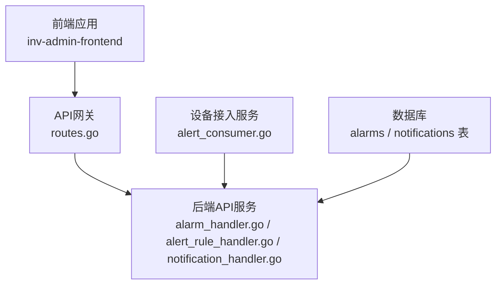
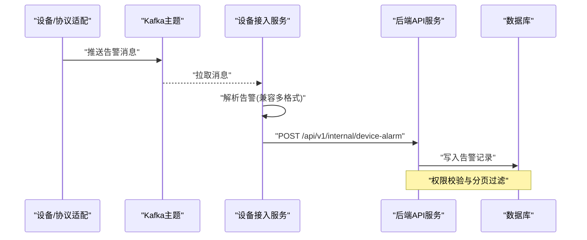
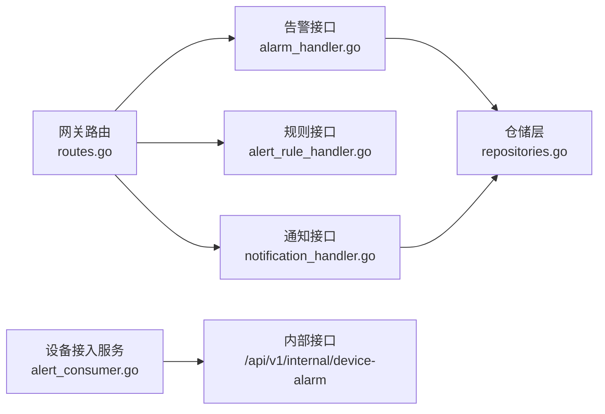

# 告警管理API

<cite>
**本文引用的文件**
- [alarm_handler.go](file://inv_api_server/internal/handler/alarm_handler.go)
- [alert_rule_handler.go](file://inv_api_server/internal/handler/alert_rule_handler.go)
- [notification_handler.go](file://inv_api_server/internal/handler/notification_handler.go)
- [routes.go](file://api-gateway/internal/routes/routes.go)
- [models.go](file://inv_api_server/internal/model/models.go)
- [repositories.go](file://inv_api_server/internal/repository/repositories.go)
- [alert_consumer.go](file://inv_device_server/internal/service/alert_consumer.go)
- [internal_handler_test.go](file://inv_api_server/internal/handler/internal_handler_test.go)
</cite>

## 目录
1. [简介](#简介)
2. [项目结构](#项目结构)
3. [核心组件](#核心组件)
4. [架构总览](#架构总览)
5. [详细组件分析](#详细组件分析)
6. [依赖关系分析](#依赖关系分析)
7. [性能考虑](#性能考虑)
8. [故障排除指南](#故障排除指南)
9. [结论](#结论)
10. [附录](#附录)

## 简介
本文件为告警管理API的完整技术文档，覆盖以下能力域：
- 告警查询：实时告警获取、历史告警查询、告警统计分析
- 告警处理：告警确认、处理状态更新、批量标记已读
- 告警规则管理：规则创建、条件配置、规则启用/禁用（当前为占位实现）
- 通知管理：通知渠道配置、通知模板管理、通知发送记录
- 告警级别与类型：告警分类、严重程度定义、处理优先级
- 告警联动与自动化：告警触发动作与处理流程配置
- 完整API示例、参数说明与集成指南

## 项目结构
告警管理API由网关层、后端服务层、设备接入层协同完成：
- API网关负责统一入口、鉴权、限流与路由转发
- 后端服务层提供告警、规则、通知等业务接口
- 设备接入层负责从MQTT/Kafka消费告警消息并写入内部接口

图表来源
- [routes.go:73-106](file://api-gateway/internal/routes/routes.go#L73-L106)
- [alarm_handler.go:14-20](file://inv_api_server/internal/handler/alarm_handler.go#L14-L20)
- [alert_rule_handler.go:15-19](file://inv_api_server/internal/handler/alert_rule_handler.go#L15-L19)
- [notification_handler.go:16-22](file://inv_api_server/internal/handler/notification_handler.go#L16-L22)
- [alert_consumer.go:46-68](file://inv_device_server/internal/service/alert_consumer.go#L46-L68)

章节来源
- [routes.go:1-195](file://api-gateway/internal/routes/routes.go#L1-L195)
- [alarm_handler.go:1-256](file://inv_api_server/internal/handler/alarm_handler.go#L1-L256)
- [alert_rule_handler.go:1-105](file://inv_api_server/internal/handler/alert_rule_handler.go#L1-L105)
- [notification_handler.go:1-211](file://inv_api_server/internal/handler/notification_handler.go#L1-L211)
- [alert_consumer.go:1-329](file://inv_device_server/internal/service/alert_consumer.go#L1-L329)

## 核心组件
- 告警处理器：提供告警列表、详情、处理、忽略、统计、清空等接口
- 规则处理器：提供规则列表、详情、创建、更新、删除接口（当前为占位实现）
- 通知处理器：提供通知列表、统计、删除、清空接口
- 设备告警消费者：从Kafka消费告警消息，转换为内部告警并调用后端内部接口入库
- 数据模型与仓储：定义告警、通知等实体及查询参数、分页逻辑

章节来源
- [alarm_handler.go:14-256](file://inv_api_server/internal/handler/alarm_handler.go#L14-L256)
- [alert_rule_handler.go:15-105](file://inv_api_server/internal/handler/alert_rule_handler.go#L15-L105)
- [notification_handler.go:16-211](file://inv_api_server/internal/handler/notification_handler.go#L16-L211)
- [models.go:130-145](file://inv_api_server/internal/model/models.go#L130-L145)
- [repositories.go:2497-2604](file://inv_api_server/internal/repository/repositories.go#L2497-L2604)

## 架构总览
告警数据流从设备侧经Kafka进入设备接入服务，解析后通过内部接口写入后端服务；前端通过网关访问后端服务进行查询与管理。

图表来源
- [alert_consumer.go:118-268](file://inv_device_server/internal/service/alert_consumer.go#L118-L268)
- [routes.go:80-83](file://api-gateway/internal/routes/routes.go#L80-L83)
- [internal_handler_test.go:214-224](file://inv_api_server/internal/handler/internal_handler_test.go#L214-L224)

## 详细组件分析

### 告警查询与统计API
- 列表查询
  - 方法与路径：GET /api/v1/alarms
  - 查询参数：page、page_size、station_id、status、keyword、alarmLevel
  - 分页与权限：管理员可查全部，普通用户仅能查看本人告警
  - 返回：分页结果与总数
- 详情查询
  - 方法与路径：GET /api/v1/alarms/:id
  - 权限：管理员可查全部，普通用户仅能查看本人告警
- 统计查询
  - 方法与路径：GET /api/v1/alarms/stats
  - 返回：统计信息（如未处理数量等）

章节来源
- [alarm_handler.go:22-72](file://inv_api_server/internal/handler/alarm_handler.go#L22-L72)
- [alarm_handler.go:74-101](file://inv_api_server/internal/handler/alarm_handler.go#L74-L101)
- [alarm_handler.go:156-167](file://inv_api_server/internal/handler/alarm_handler.go#L156-L167)
- [repositories.go:2508-2604](file://inv_api_server/internal/repository/repositories.go#L2508-L2604)

### 告警处理API
- 确认处理
  - 方法与路径：PUT /api/v1/alarms/:id/handle
  - 权限：管理员可处理任意告警，普通用户仅能处理本人告警
- 批量标记已读
  - 方法与路径：POST /api/v1/alarms/mark-read
  - 请求体：ids数组
- 忽略告警
  - 方法与路径：POST /api/v1/alarms/:id/ignore
  - 权限：同上
- 删除单条告警
  - 方法与路径：DELETE /api/v1/alarms/:id
- 清空所有告警
  - 方法与路径：DELETE /api/v1/alarms/clear-all

章节来源
- [alarm_handler.go:103-154](file://inv_api_server/internal/handler/alarm_handler.go#L103-L154)
- [alarm_handler.go:169-231](file://inv_api_server/internal/handler/alarm_handler.go#L169-L231)
- [alarm_handler.go:233-255](file://inv_api_server/internal/handler/alarm_handler.go#L233-L255)

### 告警规则管理API（占位实现）
- 列表与详情：返回固定示例数据
- 创建/更新/删除：返回成功消息与示例ID
- 注意：当前未接入数据库与仓库层，需后续完善

章节来源
- [alert_rule_handler.go:21-105](file://inv_api_server/internal/handler/alert_rule_handler.go#L21-L105)

### 通知管理API
- 列表查询
  - 方法与路径：GET /api/v1/notifications
  - 查询参数：page、page_size、notify_type、station_id、keyword、startTime、endTime
  - 权限：管理员可查全部，普通用户仅能查看本人通知
- 统计查询
  - 方法与路径：GET /api/v1/notifications/stats
  - 返回：total、unread
- 删除与清空
  - DELETE /api/v1/notifications/:id
  - DELETE /api/v1/notifications/clear-all

章节来源
- [notification_handler.go:24-135](file://inv_api_server/internal/handler/notification_handler.go#L24-L135)
- [notification_handler.go:137-178](file://inv_api_server/internal/handler/notification_handler.go#L137-L178)
- [notification_handler.go:180-210](file://inv_api_server/internal/handler/notification_handler.go#L180-L210)

### 内部告警写入接口
- 设备接入服务通过HTTP调用后端内部接口写入告警
- 接口：POST /api/v1/internal/device-alarm
- 调用方：设备接入服务（Kafka消费者）
- 测试用例验证该接口行为

章节来源
- [alert_consumer.go:270-300](file://inv_device_server/internal/service/alert_consumer.go#L270-L300)
- [internal_handler_test.go:214-224](file://inv_api_server/internal/handler/internal_handler_test.go#L214-L224)

### 数据模型与仓储
- 告警模型字段：设备SN、站点ID、用户ID、告警级别、故障码、故障信息、状态、发生时间、恢复时间、处理时间、处理人、创建时间
- 告警列表参数：用户ID、站点ID、状态、告警级别、关键词、分页、角色
- 列表查询SQL：支持管理员全量与用户限定、多条件过滤、排序与分页

章节来源
- [models.go:130-145](file://inv_api_server/internal/model/models.go#L130-L145)
- [repositories.go:2497-2604](file://inv_api_server/internal/repository/repositories.go#L2497-L2604)

## 依赖关系分析
- 网关路由
  - 告警别名：/api/v1/alerts -> 重写到 /api/v1/alarms
  - 通知与规则：直接转发到后端
- 权限控制
  - 网关层JWT鉴权与可选RBAC中间件
  - 告警与通知接口在业务层按角色进行数据范围限制
- 设备告警写入
  - 设备接入服务通过内部密钥头调用后端内部接口

图表来源
- [routes.go:80-87](file://api-gateway/internal/routes/routes.go#L80-L87)
- [alarm_handler.go:14-20](file://inv_api_server/internal/handler/alarm_handler.go#L14-L20)
- [alert_rule_handler.go:15-19](file://inv_api_server/internal/handler/alert_rule_handler.go#L15-L19)
- [notification_handler.go:16-22](file://inv_api_server/internal/handler/notification_handler.go#L16-L22)
- [alert_consumer.go:280-299](file://inv_device_server/internal/service/alert_consumer.go#L280-L299)

章节来源
- [routes.go:73-106](file://api-gateway/internal/routes/routes.go#L73-L106)
- [alarm_handler.go:14-20](file://inv_api_server/internal/handler/alarm_handler.go#L14-L20)
- [alert_rule_handler.go:15-19](file://inv_api_server/internal/handler/alert_rule_handler.go#L15-L19)
- [notification_handler.go:16-22](file://inv_api_server/internal/handler/notification_handler.go#L16-L22)
- [alert_consumer.go:280-299](file://inv_device_server/internal/service/alert_consumer.go#L280-L299)

## 性能考虑
- 分页与查询优化
  - 默认每页20条，最大100条；非法页参数自动修正
  - 列表查询采用参数化SQL与索引友好的过滤条件
- 超时控制
  - 通知查询设置上下文超时，避免阻塞
- 并发与限流
  - 网关层全局速率限制与路由级限流配置可用
- 存储与压缩
  - 数据库迁移包含TimescaleDB压缩策略，适合历史告警存储

章节来源
- [alarm_handler.go:47-52](file://inv_api_server/internal/handler/alarm_handler.go#L47-L52)
- [notification_handler.go:42-44](file://inv_api_server/internal/handler/notification_handler.go#L42-L44)
- [routes.go:37-41](file://api-gateway/internal/routes/routes.go#L37-L41)

## 故障排除指南
- 常见错误响应
  - 参数无效：返回请求错误
  - 权限不足：返回禁止访问
  - 系统错误：返回内部错误
- 告警写入失败
  - 设备接入服务在告警清除或上报失败时记录错误日志
  - 检查内部接口可达性与鉴权头
- 规则接口异常
  - 当前为占位实现，若出现异常请关注后续仓库层对接

章节来源
- [alarm_handler.go:66-69](file://inv_api_server/internal/handler/alarm_handler.go#L66-L69)
- [alarm_handler.go:84-91](file://inv_api_server/internal/handler/alarm_handler.go#L84-L91)
- [alarm_handler.go:113-116](file://inv_api_server/internal/handler/alarm_handler.go#L113-L116)
- [notification_handler.go:93-96](file://inv_api_server/internal/handler/notification_handler.go#L93-L96)
- [alert_consumer.go:120-126](file://inv_device_server/internal/service/alert_consumer.go#L120-L126)

## 结论
本告警管理API提供了完整的告警生命周期管理能力，涵盖查询、处理、统计与通知管理，并通过网关统一入口与鉴权保障安全。规则管理接口当前为占位实现，建议尽快补齐仓库层以支持真实规则配置。设备侧告警通过Kafka与内部接口实现高可靠写入，配合数据库压缩策略满足长期存储需求。

## 附录

### API一览与集成要点
- 告警查询
  - GET /api/v1/alarms?page=1&page_size=20&station_id=&status=&keyword=&alarmLevel=
  - GET /api/v1/alarms/:id
  - GET /api/v1/alarms/stats
- 告警处理
  - PUT /api/v1/alarms/:id/handle
  - POST /api/v1/alarms/mark-read
  - POST /api/v1/alarms/:id/ignore
  - DELETE /api/v1/alarms/:id
  - DELETE /api/v1/alarms/clear-all
- 通知管理
  - GET /api/v1/notifications?page=1&page_size=20&notify_type=&station_id=&keyword=&startTime=&endTime=
  - GET /api/v1/notifications/stats
  - DELETE /api/v1/notifications/:id
  - DELETE /api/v1/notifications/clear-all
- 规则管理（占位）
  - GET /api/v1/alert-rules
  - GET /api/v1/alert-rules/:id
  - POST /api/v1/alert-rules
  - PUT /api/v1/alert-rules/:id
  - DELETE /api/v1/alert-rules/:id
- 设备告警写入（内部）
  - POST /api/v1/internal/device-alarm（需内部密钥头）

章节来源
- [routes.go:80-87](file://api-gateway/internal/routes/routes.go#L80-L87)
- [alarm_handler.go:22-256](file://inv_api_server/internal/handler/alarm_handler.go#L22-L256)
- [notification_handler.go:24-210](file://inv_api_server/internal/handler/notification_handler.go#L24-L210)
- [alert_rule_handler.go:21-105](file://inv_api_server/internal/handler/alert_rule_handler.go#L21-L105)
- [alert_consumer.go:280-299](file://inv_device_server/internal/service/alert_consumer.go#L280-L299)