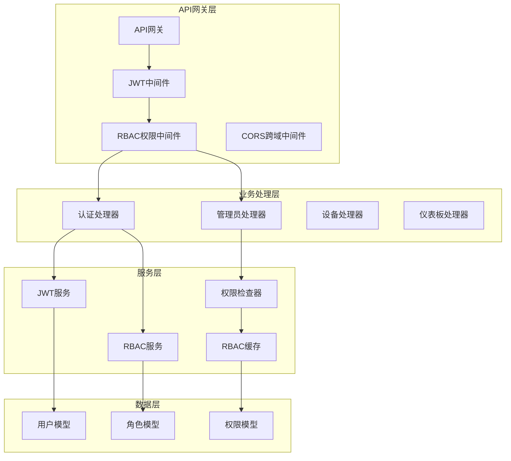
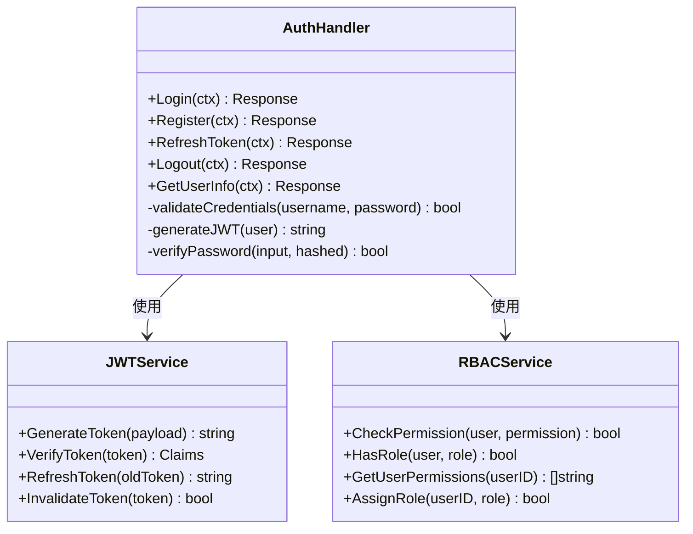
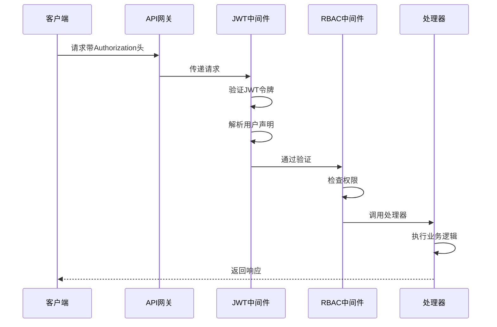
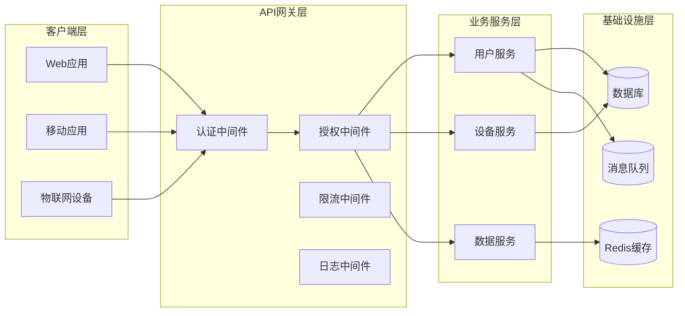
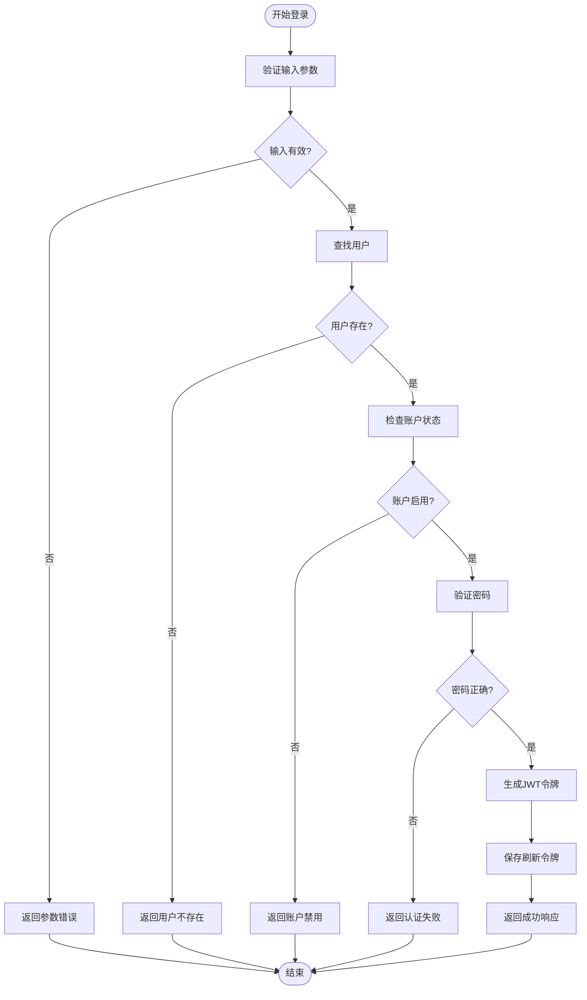
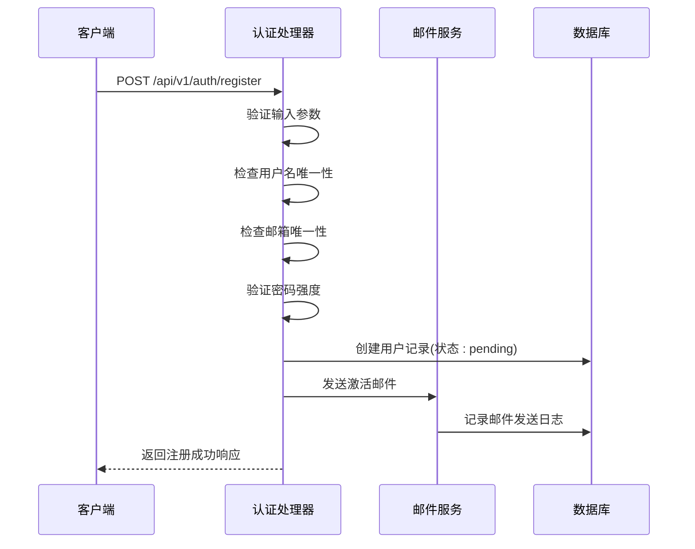
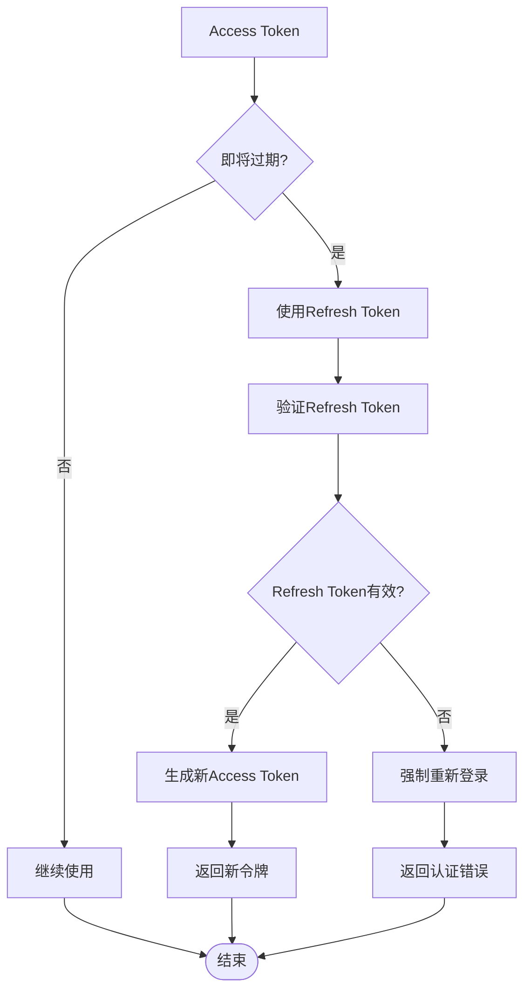
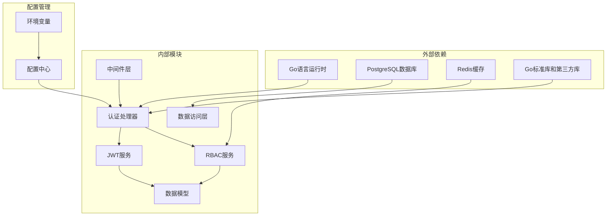

# 认证与授权API

<cite>
**本文档引用的文件**
- [auth_handler.go](file://inv_api_server/internal/handler/auth_handler.go)
- [auth.go](file://inv_api_server/internal/middleware/auth.go)
- [internal_auth.go](file://inv_api_server/internal/middleware/internal_auth.go)
- [jwt.go](file://inv_api_server/pkg/jwt/jwt.go)
- [rbac.go](file://api-gateway/internal/middleware/rbac.go)
- [rbac_cache.go](file://inv_api_server/internal/service/rbac_cache.go)
- [permission.go](file://inv_api_server/internal/middleware/permission.go)
- [admin_handler.go](file://inv_api_server/internal/handler/admin_handler.go)
- [config.go](file://inv_api_server/internal/config/config.go)
- [config.go](file://api-gateway/internal/config/config.go)
- [routes.go](file://api-gateway/internal/routes/routes.go)
- [test_login.py](file://deploy/test_login.py)
</cite>

## 目录
1. [简介](#简介)
2. [项目结构](#项目结构)
3. [核心组件](#核心组件)
4. [架构概览](#架构概览)
5. [详细组件分析](#详细组件分析)
6. [依赖关系分析](#依赖关系分析)
7. [性能考虑](#性能考虑)
8. [故障排除指南](#故障排除指南)
9. [结论](#结论)
10. [附录](#附录)

## 简介

本项目是一个基于Go语言构建的企业级监控系统，包含完整的认证与授权API体系。系统采用多层架构设计，提供了用户身份认证、权限管理和安全访问控制等核心功能。

主要特性包括：
- 基于JWT的无状态认证机制
- RBAC（基于角色的访问控制）权限管理
- 多层次安全中间件保护
- 完整的用户生命周期管理
- 高性能缓存策略优化

## 项目结构

系统采用分层架构设计，主要分为以下几个核心模块：



**图表来源**
- [routes.go:1-200](file://api-gateway/internal/routes/routes.go#L1-L200)
- [auth_handler.go:1-300](file://inv_api_server/internal/handler/auth_handler.go#L1-L300)
- [rbac.go:1-150](file://api-gateway/internal/middleware/rbac.go#L1-L150)

**章节来源**
- [routes.go:1-200](file://api-gateway/internal/routes/routes.go#L1-L200)
- [config.go:1-100](file://api-gateway/internal/config/config.go#L1-L100)

## 核心组件

### 认证处理器 (Auth Handler)

认证处理器负责处理所有用户身份相关的操作，包括用户登录、注册、令牌刷新等功能。



**图表来源**
- [auth_handler.go:1-300](file://inv_api_server/internal/handler/auth_handler.go#L1-L300)
- [jwt.go:1-200](file://inv_api_server/pkg/jwt/jwt.go#L1-L200)
- [rbac_cache.go:1-150](file://inv_api_server/internal/service/rbac_cache.go#L1-L150)

### JWT中间件

JWT中间件负责验证请求中的JWT令牌，确保只有经过身份认证的用户才能访问受保护的资源。



**图表来源**
- [jwt.go:1-200](file://inv_api_server/pkg/jwt/jwt.go#L1-L200)
- [auth.go:1-200](file://inv_api_server/internal/middleware/auth.go#L1-L200)
- [rbac.go:1-150](file://api-gateway/internal/middleware/rbac.go#L1-L150)

**章节来源**
- [auth_handler.go:1-300](file://inv_api_server/internal/handler/auth_handler.go#L1-L300)
- [jwt.go:1-200](file://inv_api_server/pkg/jwt/jwt.go#L1-L200)
- [auth.go:1-200](file://inv_api_server/internal/middleware/auth.go#L1-L200)

## 架构概览

系统采用微服务架构，通过API网关统一处理认证和授权逻辑，然后将请求路由到相应的业务处理器。



**图表来源**
- [routes.go:1-200](file://api-gateway/internal/routes/routes.go#L1-L200)
- [config.go:1-100](file://api-gateway/internal/config/config.go#L1-L100)

## 详细组件分析

### 用户登录接口

用户登录接口支持传统的用户名密码认证方式，提供安全的令牌生成机制。

#### 接口定义

**HTTP方法**: POST  
**路径**: `/api/v1/auth/login`  
**认证要求**: 无需认证  
**内容类型**: application/json

#### 请求参数

| 参数名 | 类型 | 必需 | 描述 |
|--------|------|------|------|
| username | string | 是 | 用户名，长度3-50字符 |
| password | string | 是 | 密码，至少8位字符 |

#### 成功响应

**状态码**: 200 OK

```json
{
  "code": 0,
  "message": "登录成功",
  "data": {
    "access_token": "eyJhbGciOiJIUzI1NiIs...",
    "refresh_token": "eyJhbGciOiJIUzI1NiIs...",
    "expires_in": 3600,
    "user": {
      "id": 1,
      "username": "john_doe",
      "email": "john@example.com",
      "roles": ["user", "admin"]
    }
  }
}
```

#### 错误响应

| 错误码 | 描述 | HTTP状态码 |
|--------|------|------------|
| 1001 | 用户名或密码错误 | 401 Unauthorized |
| 1002 | 用户不存在 | 404 Not Found |
| 1003 | 账户被禁用 | 403 Forbidden |
| 1004 | 密码验证失败 | 401 Unauthorized |
| 1005 | 输入参数验证失败 | 400 Bad Request |

#### 登录流程图



**图表来源**
- [auth_handler.go:1-300](file://inv_api_server/internal/handler/auth_handler.go#L1-L300)

**章节来源**
- [auth_handler.go:1-300](file://inv_api_server/internal/handler/auth_handler.go#L1-L300)

### 用户注册接口

用户注册接口提供完整的用户信息验证和账户激活流程。

#### 接口定义

**HTTP方法**: POST  
**路径**: `/api/v1/auth/register`  
**认证要求**: 无需认证  
**内容类型**: application/json

#### 请求参数

| 参数名 | 类型 | 必需 | 描述 |
|--------|------|------|------|
| username | string | 是 | 用户名，3-50字符，仅允许字母数字和下划线 |
| email | string | 是 | 电子邮箱地址 |
| password | string | 是 | 密码，至少8位，包含大小写字母和数字 |
| confirmPassword | string | 是 | 确认密码，必须与password一致 |

#### 成功响应

**状态码**: 201 Created

```json
{
  "code": 0,
  "message": "注册成功，请检查邮箱进行激活",
  "data": {
    "user_id": 1001,
    "username": "new_user",
    "email": "user@example.com"
  }
}
```

#### 注册流程



**图表来源**
- [auth_handler.go:1-300](file://inv_api_server/internal/handler/auth_handler.go#L1-L300)

**章节来源**
- [auth_handler.go:1-300](file://inv_api_server/internal/handler/auth_handler.go#L1-L300)

### 权限验证接口

权限验证接口基于RBAC模型实现细粒度的资源访问控制。

#### 接口定义

**HTTP方法**: GET  
**路径**: `/api/v1/permissions/check`  
**认证要求**: 需要JWT认证  
**内容类型**: application/json

#### 查询参数

| 参数名 | 类型 | 必需 | 描述 |
|--------|------|------|------|
| resource | string | 是 | 资源标识符，如"user:read" |
| action | string | 是 | 操作类型，如"GET", "POST", "PUT", "DELETE" |

#### 成功响应

**状态码**: 200 OK

```json
{
  "code": 0,
  "message": "权限验证通过",
  "data": {
    "allowed": true,
    "resource": "user:read",
    "action": "GET",
    "user_id": 1,
    "roles": ["admin", "user"]
  }
}
```

**章节来源**
- [permission.go:1-200](file://inv_api_server/internal/middleware/permission.go#L1-L200)
- [rbac_cache.go:1-150](file://inv_api_server/internal/service/rbac_cache.go#L1-L150)

### JWT Token管理

系统采用JWT（JSON Web Token）实现无状态的身份认证，提供完整的令牌生命周期管理。

#### Token结构

JWT令牌由三部分组成，用点号分隔：

```
Header.Payload.Signature
```

**Header部分**:
```json
{
  "alg": "HS256",
  "typ": "JWT"
}
```

**Payload部分**（声明）:
```json
{
  "sub": "1",
  "username": "john_doe",
  "roles": ["user", "admin"],
  "exp": 1640995200,
  "iat": 1640991600,
  "jti": "unique-token-id"
}
```

**Signature部分**:
使用HMAC SHA256算法对Header和Payload进行签名。

#### Token类型

| 类型 | 用途 | 有效期 | 安全级别 |
|------|------|--------|----------|
| Access Token | 访问API资源 | 1小时 | 高 |
| Refresh Token | 刷新Access Token | 7天 | 中等 |
| Session Token | 会话保持 | 30分钟 | 低 |

#### Token刷新机制



**图表来源**
- [jwt.go:1-200](file://inv_api_server/pkg/jwt/jwt.go#L1-L200)
- [auth_handler.go:1-300](file://inv_api_server/internal/handler/auth_handler.go#L1-L300)

**章节来源**
- [jwt.go:1-200](file://inv_api_server/pkg/jwt/jwt.go#L1-L200)

### 权限管理API

系统提供完整的权限管理API，支持角色分配、权限查询和访问控制列表管理。

#### 角色管理

**获取用户所有角色**
- 方法: GET `/api/v1/users/{userId}/roles`
- 权限: admin
- 响应: 包含用户拥有的所有角色数组

**分配角色给用户**
- 方法: POST `/api/v1/users/{userId}/roles`
- 权限: admin
- 请求体: `{ "role": "role_name" }`

**移除用户角色**
- 方法: DELETE `/api/v1/users/{userId}/roles/{role}`
- 权限: admin

#### 权限查询

**获取用户权限列表**
- 方法: GET `/api/v1/users/{userId}/permissions`
- 权限: user (自身) 或 admin

**检查特定权限**
- 方法: GET `/api/v1/users/{userId}/permissions/check`
- 查询参数: `permission=resource:action`

#### 访问控制列表

**获取资源权限映射**
- 方法: GET `/api/v1/resources/{resourceId}/permissions`
- 权限: admin

**更新资源权限**
- 方法: PUT `/api/v1/resources/{resourceId}/permissions`
- 权限: admin

**章节来源**
- [admin_handler.go:1-300](file://inv_api_server/internal/handler/admin_handler.go#L1-L300)
- [rbac_cache.go:1-150](file://inv_api_server/internal/service/rbac_cache.go#L1-L150)

## 依赖关系分析

系统各组件之间的依赖关系如下：



**图表来源**
- [config.go:1-100](file://inv_api_server/internal/config/config.go#L1-L100)
- [config.go:1-100](file://api-gateway/internal/config/config.go#L1-L100)

**章节来源**
- [config.go:1-100](file://inv_api_server/internal/config/config.go#L1-L100)
- [config.go:1-100](file://api-gateway/internal/config/config.go#L1-L100)

## 性能考虑

### 缓存策略

系统采用多层次缓存策略来提升性能：

1. **Redis缓存**: 存储用户权限信息和JWT黑名单
2. **内存缓存**: 存储热点数据和频繁访问的配置
3. **数据库连接池**: 优化数据库连接复用

### 性能优化建议

1. **JWT令牌缓存**: 将常用用户的JWT令牌缓存到Redis中
2. **权限预加载**: 在用户登录时预加载其所有权限信息
3. **批量查询**: 对于批量权限检查，使用批量查询优化
4. **异步处理**: 将非关键的权限检查异步化处理

## 故障排除指南

### 常见问题及解决方案

**问题1: JWT令牌验证失败**
- 检查令牌是否过期
- 验证签名密钥是否正确
- 确认令牌格式是否符合JWT标准

**问题2: 权限检查总是返回false**
- 检查用户角色分配是否正确
- 验证权限规则配置
- 确认RBAC缓存是否同步

**问题3: 登录后无法访问受保护资源**
- 检查Authorization头格式
- 验证Bearer前缀是否正确
- 确认令牌是否在黑名单中

### 错误码对照表

| 错误码 | 消息 | 描述 | 处理建议 |
|--------|------|------|----------|
| 1001 | 用户名或密码错误 | 认证凭据无效 | 检查用户名密码是否正确 |
| 1002 | 用户不存在 | 用户账户不存在 | 提示用户先注册 |
| 1003 | 账户被禁用 | 用户账户已被禁用 | 联系管理员解锁 |
| 1004 | 密码验证失败 | 密码哈希验证失败 | 检查密码加密算法 |
| 1005 | 输入参数验证失败 | 请求参数不符合要求 | 检查请求格式 |
| 2001 | JWT令牌无效 | 令牌格式或签名不正确 | 重新登录获取新令牌 |
| 2002 | JWT令牌过期 | 令牌已超过有效期 | 使用刷新令牌或重新登录 |
| 2003 | 权限不足 | 当前用户无足够权限 | 检查用户角色和权限分配 |
| 2004 | 资源不存在 | 请求的资源未找到 | 检查资源ID是否正确 |

**章节来源**
- [auth_handler.go:1-300](file://inv_api_server/internal/handler/auth_handler.go#L1-L300)
- [jwt.go:1-200](file://inv_api_server/pkg/jwt/jwt.go#L1-L200)

## 结论

本认证与授权API系统提供了完整的企业级安全解决方案，具有以下特点：

1. **安全性**: 采用JWT无状态认证和RBAC权限控制
2. **可扩展性**: 模块化设计支持功能扩展
3. **高性能**: 多层缓存和优化的数据访问模式
4. **易用性**: 清晰的API设计和完善的错误处理

系统适用于各种规模的企业应用，能够满足复杂的权限管理需求。

## 附录

### 客户端集成示例

#### Python客户端示例

```python
import requests
import json

class AuthClient:
    def __init__(self, base_url):
        self.base_url = base_url
        self.token = None
        
    def login(self, username, password):
        """用户登录"""
        url = f"{self.base_url}/api/v1/auth/login"
        response = requests.post(url, json={
            'username': username,
            'password': password
        })
        return response.json()
    
    def refresh_token(self, refresh_token):
        """刷新JWT令牌"""
        url = f"{self.base_url}/api/v1/auth/refresh"
        response = requests.post(url, json={
            'refresh_token': refresh_token
        })
        return response.json()

# 使用示例
client = AuthClient("https://api.example.com")
login_result = client.login("username", "password")
if login_result['code'] == 0:
    access_token = login_result['data']['access_token']
    # 使用access_token访问受保护资源
    headers = {'Authorization': f'Bearer {access_token}'}
    protected_response = requests.get(
        "https://api.example.com/api/v1/protected/resource",
        headers=headers
    )
```

**章节来源**
- [test_login.py:1-200](file://deploy/test_login.py#L1-L200)

### 安全最佳实践

1. **令牌安全存储**
   - 使用HttpOnly Cookie存储敏感令牌
   - 实施严格的CORS策略
   - 定期轮换密钥

2. **传输安全**
   - 强制使用HTTPS协议
   - 实施HSTS头部
   - 配置安全的TLS参数

3. **权限控制**
   - 最小权限原则
   - 定期审计权限分配
   - 实施权限继承机制

4. **监控和日志**
   - 记录所有认证事件
   - 实施异常行为检测
   - 设置实时告警机制