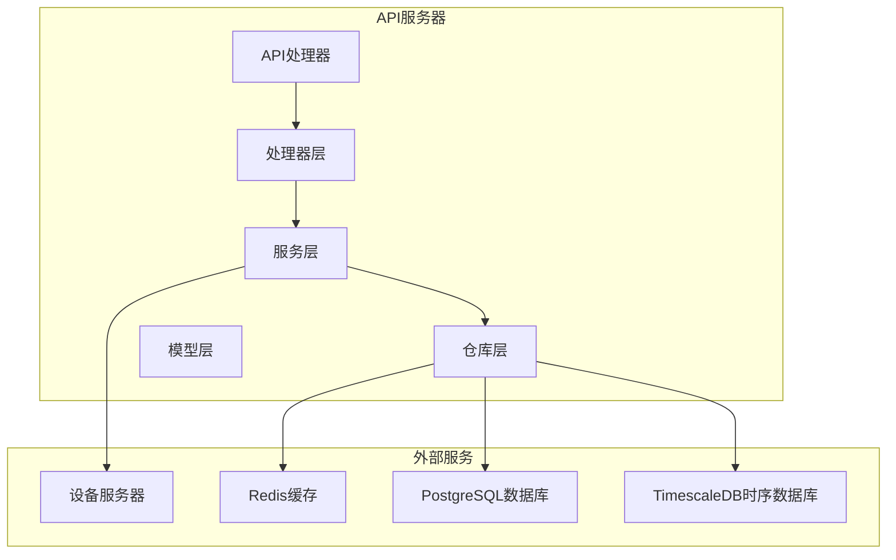
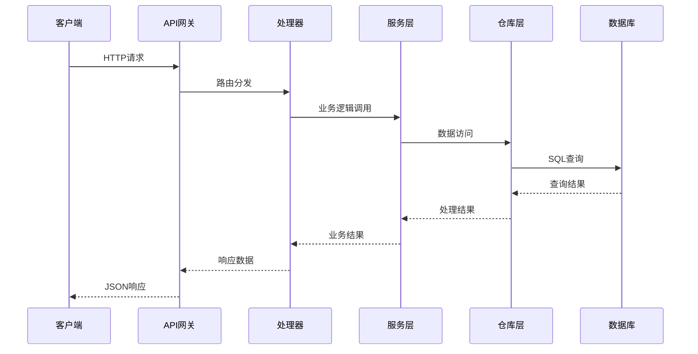
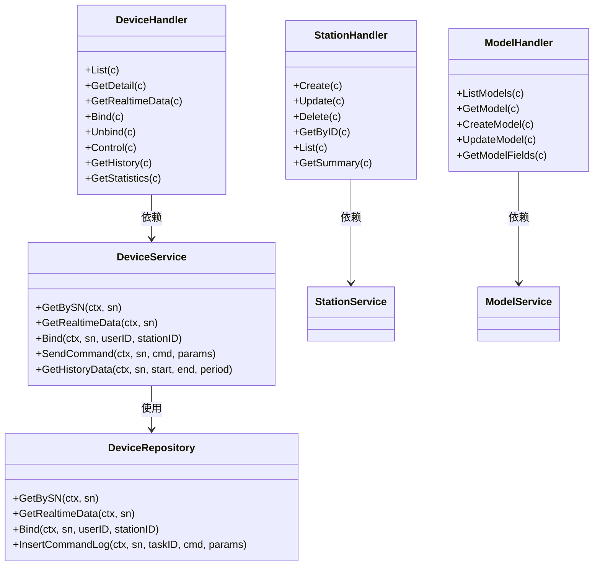
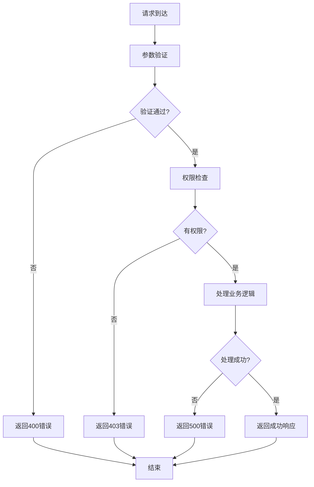

# 设备管理API

<cite>
**本文档引用的文件**
- [device_handler.go](file://inv_api_server/internal/handler/device_handler.go)
- [model_handler.go](file://inv_api_server/internal/handler/model_handler.go)
- [station_handler.go](file://inv_api_server/internal/handler/station_handler.go)
- [models.go](file://inv_api_server/internal/model/models.go)
- [repositories.go](file://inv_api_server/internal/repository/repositories.go)
- [services.go](file://inv_api_server/internal/service/services.go)
- [response.go](file://inv_api_server/pkg/response/response.go)
- [helpers.go](file://inv_api_server/internal/handler/helpers.go)
</cite>

## 目录
1. [简介](#简介)
2. [项目结构](#项目结构)
3. [核心组件](#核心组件)
4. [架构概览](#架构概览)
5. [详细组件分析](#详细组件分析)
6. [依赖关系分析](#依赖关系分析)
7. [性能考虑](#性能考虑)
8. [故障排除指南](#故障排除指南)
9. [结论](#结论)

## 简介

设备管理API是智能光伏监控系统的核心组件，负责管理分布式能源设备的全生命周期。该API提供了完整的设备CRUD操作、状态查询、参数配置、绑定管理等功能，支持多用户权限控制和设备分组管理。

系统采用分层架构设计，包含API网关、业务逻辑层、数据访问层和存储层，确保了高可用性和可扩展性。通过Redis缓存和TimescaleDB时序数据库优化，实现了高效的实时数据处理和历史数据分析能力。

## 项目结构

**图表来源**
- [device_handler.go:1-832](file://inv_api_server/internal/handler/device_handler.go#L1-L832)
- [services.go:1-706](file://inv_api_server/internal/service/services.go#L1-L706)
- [repositories.go:1-800](file://inv_api_server/internal/repository/repositories.go#L1-L800)

**章节来源**
- [device_handler.go:1-832](file://inv_api_server/internal/handler/device_handler.go#L1-L832)
- [model_handler.go:1-360](file://inv_api_server/internal/handler/model_handler.go#L1-L360)
- [station_handler.go:1-672](file://inv_api_server/internal/handler/station_handler.go#L1-L672)

## 核心组件

### 设备管理组件

设备管理API的核心组件包括：

- **设备处理器(DeviceHandler)**: 处理设备相关的HTTP请求，实现CRUD操作、状态查询、参数配置等
- **设备服务(DeviceService)**: 提供业务逻辑封装，包括设备绑定、控制命令、历史数据查询等
- **设备仓库(DeviceRepository)**: 数据访问层，负责与数据库交互
- **设备模型(Device)**: 设备实体的数据结构定义

### 站点管理组件

- **站点处理器(StationHandler)**: 管理光伏电站的创建、更新、删除和查询
- **站点服务(StationService)**: 提供站点相关的业务逻辑
- **站点仓库(StationRepository)**: 站点数据访问层

### 模型管理组件

- **模型处理器(ModelHandler)**: 管理设备型号定义、参数规格和协议配置
- **模型服务(ModelService)**: 提供型号相关的业务逻辑

**章节来源**
- [device_handler.go:20-31](file://inv_api_server/internal/handler/device_handler.go#L20-L31)
- [station_handler.go:17-27](file://inv_api_server/internal/handler/station_handler.go#L17-L27)
- [model_handler.go:13-19](file://inv_api_server/internal/handler/model_handler.go#L13-L19)

## 架构概览

**图表来源**
- [services.go:308-333](file://inv_api_server/internal/service/services.go#L308-L333)
- [repositories.go:796-800](file://inv_api_server/internal/repository/repositories.go#L796-L800)

系统采用RESTful API设计，统一的响应格式和错误处理机制，确保了API的一致性和可靠性。

## 详细组件分析

### 设备CRUD操作

#### 设备列表查询
支持分页查询、条件过滤和权限控制：

**请求参数:**
- page: 页码，默认1
- page_size: 每页数量，默认20，最大200
- station_id: 电站ID
- status: 设备状态

**响应数据:**
- devices: 设备列表
- total: 总记录数
- page: 当前页码
- page_size: 每页大小

#### 设备详情查询
获取单个设备的完整信息，包括实时数据和在线状态：

**响应结构:**
- device: 设备基本信息
- realtime_data: 实时遥测数据
- online_status: 在线状态
- model_fields: 型号字段定义

#### 设备创建/更新
支持批量设备导入和自动创建机制：

**请求参数:**
- sn: 设备序列号（必填）
- station_id: 电站ID
- 其他设备属性

**章节来源**
- [device_handler.go:32-173](file://inv_api_server/internal/handler/device_handler.go#L32-L173)
- [device_handler.go:193-243](file://inv_api_server/internal/handler/device_handler.go#L193-L243)

### 设备状态查询

#### 实时状态获取
通过Redis缓存获取设备实时状态，支持多种数据格式兼容：

**支持的数据格式:**
- 嵌套格式: {"info": {...}, "energy": {...}, "ac": {...}}
- 扁平格式: 直接键值对
- 兼容模式: 自动识别不同协议的数据结构

#### 历史数据查询
支持小时级和日级历史数据查询：

**查询参数:**
- start_date: 开始日期
- end_date: 结束日期  
- period: 时间粒度（hour/day）

#### 统计数据汇总
提供设备发电量、功率等统计数据：

**统计维度:**
- 日发电量(daily_pv)
- 月发电量(monthly)
- 年发电量(yearly)
- 总发电量(total)
- 最大功率(max_power)

**章节来源**
- [device_handler.go:245-281](file://inv_api_server/internal/handler/device_handler.go#L245-L281)
- [device_handler.go:428-450](file://inv_api_server/internal/handler/device_handler.go#L428-L450)
- [device_handler.go:538-576](file://inv_api_server/internal/handler/device_handler.go#L538-L576)

### 设备参数配置

#### 控制命令下发
支持设备远程控制命令，具备严格的权限验证：

**支持的命令类型:**
- get_params: 读取设备参数
- set_params: 设置设备参数  
- batch_config: 批量配置
- reset: 设备复位
- restart: 重启设备
- ota: OTA升级

#### 参数字段管理
基于设备型号的参数字段定义，支持动态配置：

**字段属性:**
- field_key: 字段标识符
- field_name: 字段名称
- field_type: 数据类型
- unit: 单位
- is_show: 是否显示
- is_control: 是否可控制
- control_params: 控制参数

**章节来源**
- [device_handler.go:372-402](file://inv_api_server/internal/handler/device_handler.go#L372-L402)
- [device_handler.go:404-422](file://inv_api_server/internal/handler/device_handler.go#L404-L422)

### 设备绑定和解绑

#### 设备绑定
用户可以将设备绑定到自己的账户或指定电站：

**绑定流程:**
1. 验证设备序列号格式
2. 检查设备是否存在，不存在则自动创建
3. 验证设备是否已被绑定
4. 执行绑定操作

#### 设备解绑
支持用户主动解绑和管理员审核解绑：

**解绑类型:**
- 用户申请解绑
- 管理员强制解绑
- 解绑请求审批流程

#### 权限转移
支持设备所有权的转移和权限继承：

**权限规则:**
- 设备绑定用户拥有完全控制权
- 管理员拥有最高权限
- 电站分配后的权限继承

**章节来源**
- [device_handler.go:288-365](file://inv_api_server/internal/handler/device_handler.go#L288-L365)
- [device_handler.go:722-773](file://inv_api_server/internal/handler/device_handler.go#L722-L773)

### 设备模型管理

#### 型号定义
管理设备的标准化型号信息：

**型号属性:**
- model_code: 型号编码
- model_name: 型号名称
- manufacturer: 制造商
- category: 设备类别
- rated_power_kw: 额定功率(kW)
- description: 型号描述

#### 参数规格管理
为不同型号设备定义标准参数规格：

**规格字段:**
- field_key: 参数键
- field_name: 参数名称
- field_type: 参数类型
- unit: 单位
- sort: 排序
- group_name: 分组名称

#### 协议适配
支持多种通信协议的配置和适配：

**协议配置:**
- topic_pattern: MQTT主题模式
- parse_type: 解析类型
- parse_config: 解析配置
- is_active: 启用状态

**章节来源**
- [model_handler.go:21-121](file://inv_api_server/internal/handler/model_handler.go#L21-L121)
- [model_handler.go:247-261](file://inv_api_server/internal/handler/model_handler.go#L247-L261)
- [model_handler.go:265-359](file://inv_api_server/internal/handler/model_handler.go#L265-L359)

### 站点管理

#### 站点CRUD操作
提供完整的电站生命周期管理：

**站点属性:**
- name: 站点名称
- address: 地址信息
- capacity: 装机容量
- panel_count: 组件数量
- location: 位置坐标
- pricing: 电价信息

#### 站点统计
提供实时的发电统计和运行状态：

**统计指标:**
- today_energy: 今日发电量
- total_energy: 累计发电量
- monthly_energy: 月发电量
- total_power: 总功率
- device_count: 设备数量
- online_count: 在线设备数

#### 权限管理
支持站点级别的权限控制和分配：

**权限级别:**
- 站点所有者
- 站点管理员
- 普通用户
- 系统管理员

**章节来源**
- [station_handler.go:44-86](file://inv_api_server/internal/handler/station_handler.go#L44-L86)
- [station_handler.go:261-432](file://inv_api_server/internal/handler/station_handler.go#L261-L432)
- [station_handler.go:530-637](file://inv_api_server/internal/handler/station_handler.go#L530-L637)

## 依赖关系分析

**图表来源**
- [device_handler.go:20-31](file://inv_api_server/internal/handler/device_handler.go#L20-L31)
- [services.go:308-333](file://inv_api_server/internal/service/services.go#L308-L333)
- [repositories.go:796-800](file://inv_api_server/internal/repository/repositories.go#L796-L800)

系统采用依赖注入和接口分离的设计原则，提高了代码的可测试性和可维护性。

**章节来源**
- [models.go:43-66](file://inv_api_server/internal/model/models.go#L43-L66)
- [models.go:223-260](file://inv_api_server/internal/model/models.go#L223-L260)

## 性能考虑

### 缓存策略
- Redis缓存用于实时数据和会话管理
- 命令日志和通知采用异步处理
- 配置信息缓存减少数据库查询

### 数据库优化
- TimescaleDB时序数据库优化历史数据查询
- 合理的索引设计支持高频查询
- 连接池管理提高数据库连接效率

### 异步处理
- 设备控制命令采用异步队列处理
- 离线设备命令排队机制
- 通知系统异步发送

## 故障排除指南

### 常见错误码
- 4000: 请求参数错误
- 4001: 设备不存在
- 4002: 权限不足
- 4003: 设备已绑定
- 5001: 设备未找到
- 5002: 设备已绑定
- 5003: 命令发送失败

### 错误处理流程

**图表来源**
- [response.go:38-78](file://inv_api_server/pkg/response/response.go#L38-L78)

### 调试建议
- 检查Redis连接状态和缓存命中率
- 监控数据库查询性能和连接池使用情况
- 查看设备服务器连接状态
- 分析日志文件定位问题根因

**章节来源**
- [response.go:1-92](file://inv_api_server/pkg/response/response.go#L1-L92)

## 结论

设备管理API提供了完整的分布式能源设备管理解决方案，具有以下特点：

1. **功能完整性**: 覆盖设备全生命周期管理的所有核心功能
2. **架构合理性**: 分层设计确保了良好的可维护性和扩展性
3. **性能优化**: 通过缓存和时序数据库优化提升了系统性能
4. **安全性保障**: 严格的权限控制和数据验证机制
5. **易用性**: 统一的API设计和错误处理机制

该API为智能光伏监控系统奠定了坚实的技术基础，支持大规模设备的高效管理和服务。