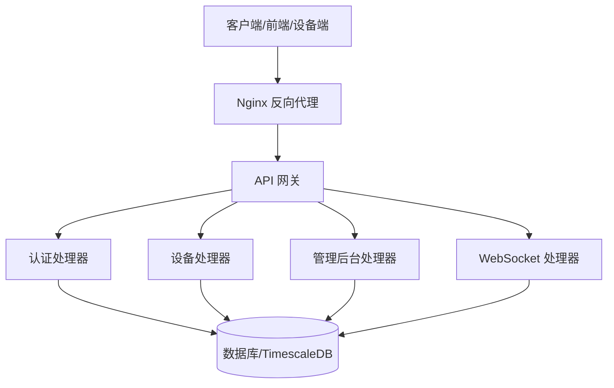
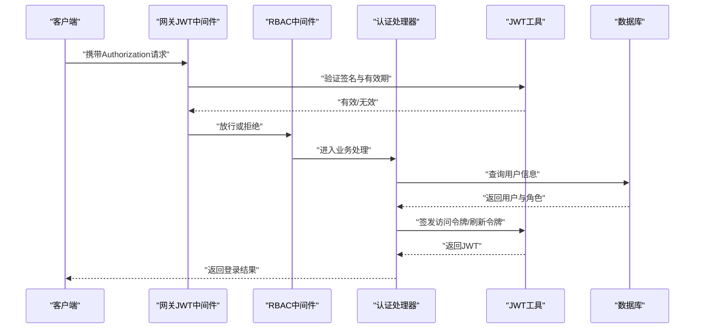
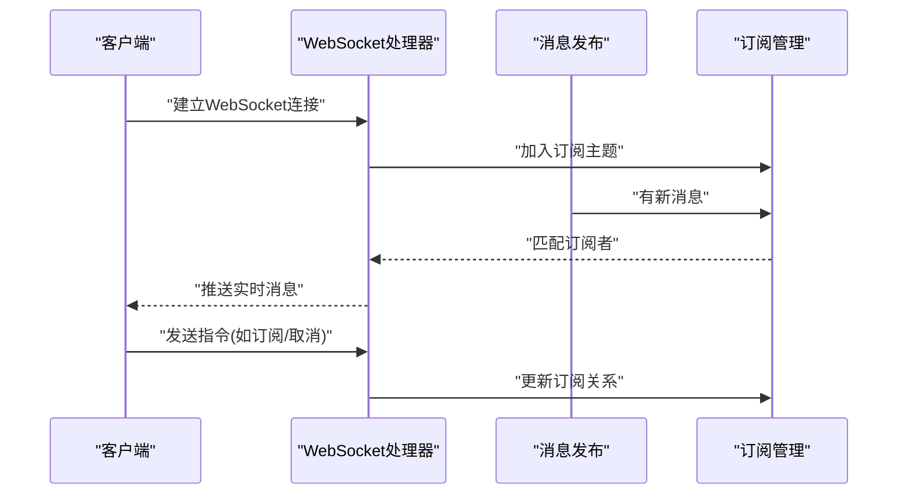
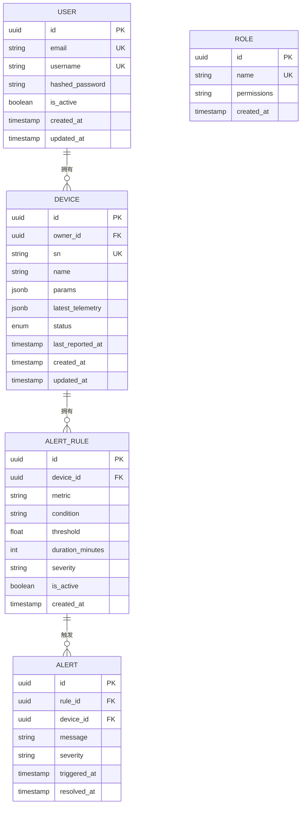
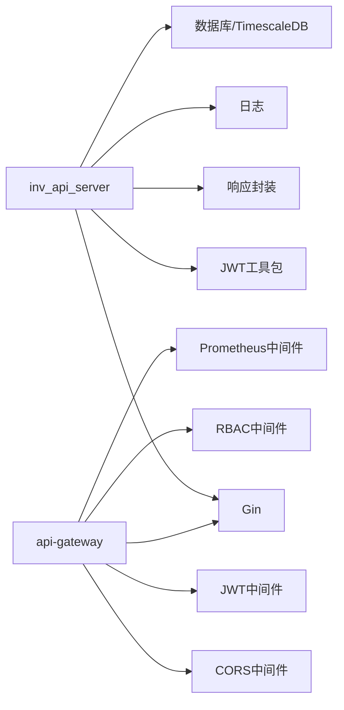

# API服务器

<cite>
**本文引用的文件**
- [main.go](file://inv_api_server/cmd/main.go)
- [config.go](file://inv_api_server/internal/config/config.go)
- [routes.go](file://api-gateway/internal/routes/routes.go)
- [jwt.go](file://api-gateway/internal/middleware/jwt.go)
- [cors.go](file://api-gateway/internal/middleware/cors.go)
- [rbac.go](file://api-gateway/internal/middleware/rbac.go)
- [auth_handler.go](file://inv_api_server/internal/handler/auth_handler.go)
- [admin_handler.go](file://inv_api_server/internal/handler/admin_handler.go)
- [device_handler.go](file://inv_api_server/internal/handler/device_handler.go)
- [ws_handler.go](file://inv_api_server/internal/handler/ws_handler.go)
- [models.go](file://inv_api_server/internal/model/models.go)
- [repositories.go](file://inv_api_server/repository/repositories.go)
- [services.go](file://inv_api_server/service/services.go)
- [jwt.go](file://inv_api_server/pkg/jwt/jwt.go)
- [response.go](file://inv_api_server/pkg/response/response.go)
- [logger.go](file://inv_api_server/pkg/logger/logger.go)
- [schema.sql](file://database/schema.sql)
- [001_init_schema.up.sql](file://database/migrations/001_init_schema.up.sql)
- [002_add_performance_indexes.up.sql](file://database/migrations/002_add_performance_indexes.up.sql)
- [003_timescaledb_compression.up.sql](file://database/migrations/003_timescaledb_compression.up.sql)
- [004_add_energy_columns.up.sql](file://database/migrations/004_add_energy_columns.up.sql)
- [005_device_day_data_jsonb.up.sql](file://database/migrations/005_device_day_data_jsonb.up.sql)
- [config.docker.yaml](file://inv_api_server/config.docker.yaml)
- [config.docker.yaml](file://api-gateway/config.docker.yaml)
- [Dockerfile](file://inv_api_server/Dockerfile)
- [Dockerfile](file://api-gateway/Dockerfile)
- [deploy.sh](file://deploy/deploy.sh)
- [docker-compose.yml](file://deploy/docker-compose.yml)
- [nginx.conf](file://deploy/nginx.conf)
- [test_login.py](file://deploy/test_login.py)
- [webhook_server.py](file://deploy/webhook_server.py)
- [MQTT接口文档.md](file://docs/MQTT接口文档.md)
- [架构升级任务清单.md](file://docs/架构升级任务清单.md)
- [设备端OTA程序开发指南.md](file://docs/设备端OTA程序开发指南.md)
- [emqx_rule_engine_sql.md](file://docs/emqx_rule_engine_sql.md)
- [device-model-modularization-plan.md](file://docs/device-model-modularization-plan.md)
</cite>

## 目录
1. [简介](#简介)
2. [项目结构](#项目结构)
3. [核心组件](#核心组件)
4. [架构总览](#架构总览)
5. [详细组件分析](#详细组件分析)
6. [依赖关系分析](#依赖关系分析)
7. [性能考虑](#性能考虑)
8. [故障排查指南](#故障排查指南)
9. [结论](#结论)
10. [附录](#附录)

## 简介
本项目是一个基于 Go 语言与 Gin 框架构建的企业级监控平台后端 API 服务器，提供用户认证与授权、设备全生命周期管理、实时告警推送、管理后台接口以及 WebSocket 实时通信能力。系统采用模块化分层架构：网关层负责路由与安全中间件，应用层提供业务处理器，仓储层封装数据库访问，服务层承载业务逻辑与权限控制，并通过 Docker 化部署与 Nginx 反向代理对外提供统一入口。

## 项目结构
后端由两个主要服务组成：
- API 网关（api-gateway）：集中式路由、CORS、JWT 鉴权、RBAC 权限、限流与 Prometheus 监控等中间件。
- API 应用服务（inv_api_server）：具体业务处理器（认证、设备、告警、仪表盘、OTA、通知等）、JWT 工具、响应封装、日志与配置管理。

```mermaid
graph TB
subgraph "网关层"
GW_MAIN["api-gateway/main.go"]
GW_ROUTES["api-gateway/internal/routes/routes.go"]
GW_MW_JWT["api-gateway/internal/middleware/jwt.go"]
GW_MW_CORS["api-gateway/internal/middleware/cors.go"]
GW_MW_RBAC["api-gateway/internal/middleware/rbac.go"]
end
subgraph "应用层"
APP_MAIN["inv_api_server/cmd/main.go"]
APP_CONF["inv_api_server/internal/config/config.go"]
APP_HANDLER_AUTH["inv_api_server/internal/handler/auth_handler.go"]
APP_HANDLER_DEV["inv_api_server/internal/handler/device_handler.go"]
APP_HANDLER_ADMIN["inv_api_server/internal/handler/admin_handler.go"]
APP_HANDLER_WS["inv_api_server/internal/handler/ws_handler.go"]
APP_PKG_JWT["inv_api_server/pkg/jwt/jwt.go"]
APP_PKG_RESP["inv_api_server/pkg/response/response.go"]
APP_PKG_LOG["inv_api_server/pkg/logger/logger.go"]
end
subgraph "数据层"
DB_SCHEMA["database/schema.sql"]
DB_MIG_001["database/migrations/001_init_schema.up.sql"]
DB_MIG_002["database/migrations/002_add_performance_indexes.up.sql"]
DB_MIG_003["database/migrations/003_timescaledb_compression.up.sql"]
DB_MIG_004["database/migrations/004_add_energy_columns.up.sql"]
DB_MIG_005["database/migrations/005_device_day_data_jsonb.up.sql"]
end
GW_MAIN --> GW_ROUTES
GW_ROUTES --> GW_MW_JWT
GW_ROUTES --> GW_MW_CORS
GW_ROUTES --> GW_MW_RBAC
APP_MAIN --> APP_CONF
APP_MAIN --> APP_HANDLER_AUTH
APP_MAIN --> APP_HANDLER_DEV
APP_MAIN --> APP_HANDLER_ADMIN
APP_MAIN --> APP_HANDLER_WS
APP_HANDLER_AUTH --> APP_PKG_JWT
APP_HANDLER_AUTH --> APP_PKG_RESP
APP_HANDLER_DEV --> APP_PKG_RESP
APP_HANDLER_ADMIN --> APP_PKG_RESP
APP_HANDLER_WS --> APP_PKG_RESP
APP_HANDLER_AUTH --> DB_SCHEMA
APP_HANDLER_DEV --> DB_SCHEMA
APP_HANDLER_ADMIN --> DB_SCHEMA
APP_HANDLER_WS --> DB_SCHEMA
DB_SCHEMA --> DB_MIG_001
DB_SCHEMA --> DB_MIG_002
DB_SCHEMA --> DB_MIG_003
DB_SCHEMA --> DB_MIG_004
DB_SCHEMA --> DB_MIG_005
```

**图表来源**
- [main.go](file://inv_api_server/cmd/main.go)
- [routes.go](file://api-gateway/internal/routes/routes.go)
- [jwt.go](file://api-gateway/internal/middleware/jwt.go)
- [cors.go](file://api-gateway/internal/middleware/cors.go)
- [rbac.go](file://api-gateway/internal/middleware/rbac.go)
- [auth_handler.go](file://inv_api_server/internal/handler/auth_handler.go)
- [device_handler.go](file://inv_api_server/internal/handler/device_handler.go)
- [admin_handler.go](file://inv_api_server/internal/handler/admin_handler.go)
- [ws_handler.go](file://inv_api_server/internal/handler/ws_handler.go)
- [jwt.go](file://inv_api_server/pkg/jwt/jwt.go)
- [response.go](file://inv_api_server/pkg/response/response.go)
- [logger.go](file://inv_api_server/pkg/logger/logger.go)
- [schema.sql](file://database/schema.sql)
- [001_init_schema.up.sql](file://database/migrations/001_init_schema.up.sql)
- [002_add_performance_indexes.up.sql](file://database/migrations/002_add_performance_indexes.up.sql)
- [003_timescaledb_compression.up.sql](file://database/migrations/003_timescaledb_compression.up.sql)
- [004_add_energy_columns.up.sql](file://database/migrations/004_add_energy_columns.up.sql)
- [005_device_day_data_jsonb.up.sql](file://database/migrations/005_device_day_data_jsonb.up.sql)

**章节来源**
- [main.go](file://inv_api_server/cmd/main.go)
- [config.go](file://inv_api_server/internal/config/config.go)
- [routes.go](file://api-gateway/internal/routes/routes.go)

## 核心组件
- 网关中间件体系：提供 CORS、JWT 鉴权、RBAC 授权、速率限制、请求日志与 Prometheus 指标统计。
- 认证与授权：基于 JWT 的登录、令牌刷新与权限校验；RBAC 控制不同角色对资源的访问。
- 设备管理：支持设备 CRUD、状态查询、参数配置下发、批量操作与告警规则管理。
- 实时推送：WebSocket 连接管理、消息广播与客户端状态同步。
- 响应与日志：统一响应格式与结构化日志输出。
- 配置与部署：Docker 化与 docker-compose 编排，Nginx 反向代理，自动化部署脚本。

**章节来源**
- [jwt.go](file://api-gateway/internal/middleware/jwt.go)
- [rbac.go](file://api-gateway/internal/middleware/rbac.go)
- [cors.go](file://api-gateway/internal/middleware/cors.go)
- [auth_handler.go](file://inv_api_server/internal/handler/auth_handler.go)
- [device_handler.go](file://inv_api_server/internal/handler/device_handler.go)
- [ws_handler.go](file://inv_api_server/internal/handler/ws_handler.go)
- [response.go](file://inv_api_server/pkg/response/response.go)
- [logger.go](file://inv_api_server/pkg/logger/logger.go)

## 架构总览
系统采用“网关 + 应用服务”的双层架构。网关负责统一入口与安全控制，应用服务承载具体业务。数据库采用 TimescaleDB 以支持时间序列数据压缩与高性能查询。

**图表来源**
- [main.go](file://inv_api_server/cmd/main.go)
- [routes.go](file://api-gateway/internal/routes/routes.go)
- [auth_handler.go](file://inv_api_server/internal/handler/auth_handler.go)
- [device_handler.go](file://inv_api_server/internal/handler/device_handler.go)
- [admin_handler.go](file://inv_api_server/internal/handler/admin_handler.go)
- [ws_handler.go](file://inv_api_server/internal/handler/ws_handler.go)
- [schema.sql](file://database/schema.sql)

## 详细组件分析

### 认证与授权组件
- JWT 签发与验证：登录成功后签发访问令牌与刷新令牌，支持过期续签与黑名单管理。
- RBAC 权限：基于角色的权限控制，校验用户对资源与动作的访问权限。
- 中间件链路：CORS -> JWT 鉴权 -> RBAC 授权 -> 业务处理器。

**图表来源**
- [jwt.go](file://api-gateway/internal/middleware/jwt.go)
- [rbac.go](file://api-gateway/internal/middleware/rbac.go)
- [auth_handler.go](file://inv_api_server/internal/handler/auth_handler.go)
- [jwt.go](file://inv_api_server/pkg/jwt/jwt.go)

**章节来源**
- [jwt.go](file://api-gateway/internal/middleware/jwt.go)
- [rbac.go](file://api-gateway/internal/middleware/rbac.go)
- [auth_handler.go](file://inv_api_server/internal/handler/auth_handler.go)
- [jwt.go](file://inv_api_server/pkg/jwt/jwt.go)

### 设备管理组件
- 功能范围：设备注册、编辑、删除、查询、状态监控、参数配置下发、批量导入导出、告警规则设置。
- 数据模型：设备基础信息、运行参数、历史遥测、日粒度聚合数据、告警记录。
- 批量操作：支持批量启用/停用、参数下发、分组管理。
- 与设备侧交互：通过 MQTT/Kafka 消息通道下发命令，接收设备上报数据。

**图表来源**
- [device_handler.go](file://inv_api_server/internal/handler/device_handler.go)
- [models.go](file://inv_api_server/internal/model/models.go)
- [schema.sql](file://database/schema.sql)

**章节来源**
- [device_handler.go](file://inv_api_server/internal/handler/device_handler.go)
- [models.go](file://inv_api_server/internal/model/models.go)
- [schema.sql](file://database/schema.sql)

### WebSocket 实时推送组件
- 连接管理：建立/维护长连接，心跳检测与断线重连。
- 消息广播：向订阅主题的客户端推送设备状态变更、告警事件、系统通知。
- 客户端状态同步：根据用户权限与设备归属关系推送差异化数据。

**图表来源**
- [ws_handler.go](file://inv_api_server/internal/handler/ws_handler.go)

**章节来源**
- [ws_handler.go](file://inv_api_server/internal/handler/ws_handler.go)

### 管理后台组件
- 用户管理：用户增删改查、角色分配、权限回收。
- 设备管理：设备列表、分组、状态总览、批量运维。
- 告警管理：告警规则配置、阈值设定、历史告警查询与处置。
- 系统配置：系统参数、邮件/SMS 通知配置、OTA 升级策略。

**章节来源**
- [admin_handler.go](file://inv_api_server/internal/handler/admin_handler.go)

### 数据模型与数据库操作
- 核心表：用户、角色、设备、设备参数、遥测数据、日粒度聚合、告警规则、告警记录、系统配置、OTA 版本等。
- 时间序列优化：TimescaleDB 分钟级压缩、索引优化、JSONB 存储日粒度聚合数据。
- 迁移管理：版本化迁移脚本，确保数据库演进可控。

**图表来源**
- [schema.sql](file://database/schema.sql)
- [001_init_schema.up.sql](file://database/migrations/001_init_schema.up.sql)
- [002_add_performance_indexes.up.sql](file://database/migrations/002_add_performance_indexes.up.sql)
- [003_timescaledb_compression.up.sql](file://database/migrations/003_timescaledb_compression.up.sql)
- [004_add_energy_columns.up.sql](file://database/migrations/004_add_energy_columns.up.sql)
- [005_device_day_data_jsonb.up.sql](file://database/migrations/005_device_day_data_jsonb.up.sql)

**章节来源**
- [schema.sql](file://database/schema.sql)
- [001_init_schema.up.sql](file://database/migrations/001_init_schema.up.sql)
- [002_add_performance_indexes.up.sql](file://database/migrations/002_add_performance_indexes.up.sql)
- [003_timescaledb_compression.up.sql](file://database/migrations/003_timescaledb_compression.up.sql)
- [004_add_energy_columns.up.sql](file://database/migrations/004_add_energy_columns.up.sql)
- [005_device_day_data_jsonb.up.sql](file://database/migrations/005_device_day_data_jsonb.up.sql)

### API 版本管理与错误处理
- 版本策略：通过路径前缀或请求头进行版本区分，当前仓库未见显式多版本实现，建议在路由层增加版本号前缀。
- 统一错误码与响应体：所有接口返回一致的响应结构，包含状态码、消息与数据载体，便于前端统一处理。
- 错误分类：鉴权失败、权限不足、业务异常、系统内部错误，分别映射到不同 HTTP 状态码与业务码。

**章节来源**
- [response.go](file://inv_api_server/pkg/response/response.go)

### 性能优化策略
- 数据库层面：索引优化、TimescaleDB 压缩、分区表、只读副本、慢查询分析。
- 应用层面：Redis 缓存热点数据、连接池复用、异步任务队列、限流与熔断。
- 网络层面：Nginx 负载均衡、Gzip 压缩、CDN 加速、WebSocket 长连接复用。
- 监控指标：Prometheus 指标采集、日志结构化、告警规则完善。

**章节来源**
- [logger.go](file://inv_api_server/pkg/logger/logger.go)

## 依赖关系分析
- 模块内聚：各处理器职责单一，通过中间件与工具包解耦。
- 外部依赖：Gin Web 框架、JWT 库、数据库驱动、TimescaleDB、NATS/Kafka（桥接）。
- 部署依赖：Docker、docker-compose、Nginx、Prometheus/Grafana。

**图表来源**
- [main.go](file://inv_api_server/cmd/main.go)
- [jwt.go](file://api-gateway/internal/middleware/jwt.go)
- [cors.go](file://api-gateway/internal/middleware/cors.go)
- [rbac.go](file://api-gateway/internal/middleware/rbac.go)
- [response.go](file://inv_api_server/pkg/response/response.go)
- [logger.go](file://inv_api_server/pkg/logger/logger.go)

**章节来源**
- [main.go](file://inv_api_server/cmd/main.go)
- [routes.go](file://api-gateway/internal/routes/routes.go)

## 性能考虑
- 查询优化：为高频查询字段建立复合索引，使用物化视图缓存统计结果。
- 写入优化：批量写入遥测数据，合理设置 TimescaleDB 压缩周期。
- 缓存策略：热点设备状态与用户会话信息缓存，降低数据库压力。
- 并发控制：限流中间件防止突发流量击穿，连接池大小按 CPU 与内存调优。
- 监控告警：完善 P95/P99 延迟、错误率、连接数等指标监控。

## 故障排查指南
- 登录失败：检查 JWT 密钥配置、用户状态与密码哈希；查看网关日志与应用日志。
- 权限问题：确认用户角色与资源权限映射，RBAC 规则是否正确加载。
- 设备无数据：检查 MQTT/Kafka 桥接是否正常，设备上报格式与解析规则。
- WebSocket 不推送：确认订阅关系、连接状态与广播通道。
- 数据库异常：查看迁移脚本执行情况、索引缺失与慢查询日志。

**章节来源**
- [logger.go](file://inv_api_server/pkg/logger/logger.go)
- [test_login.py](file://deploy/test_login.py)

## 结论
该 API 服务器以清晰的分层架构与完善的中间件体系为基础，覆盖了从认证授权到设备管理、实时推送与管理后台的完整业务闭环。结合 TimescaleDB 的时间序列优化与容器化部署方案，具备良好的可扩展性与运维友好性。建议后续引入 API 版本化路由、更细粒度的缓存与异步任务队列，持续完善监控与告警体系。

## 附录

### 部署与配置
- Docker 化：应用与网关均提供 Dockerfile 与 docker-compose 编排。
- 反向代理：Nginx 提供静态资源与 HTTPS 终端。
- 自动化部署：提供一键部署脚本与 Kubernetes 配置样例。

**章节来源**
- [Dockerfile](file://inv_api_server/Dockerfile)
- [Dockerfile](file://api-gateway/Dockerfile)
- [config.docker.yaml](file://inv_api_server/config.docker.yaml)
- [config.docker.yaml](file://api-gateway/config.docker.yaml)
- [docker-compose.yml](file://deploy/docker-compose.yml)
- [nginx.conf](file://deploy/nginx.conf)
- [deploy.sh](file://deploy/deploy.sh)

### 开发与测试
- 单元测试：应用层提供测试样例，建议补充接口测试与集成测试。
- 压力测试：提供独立的压力测试工具，便于评估系统上限。
- 文档：设备端 MQTT 接口文档与 OTA 开发指南可供参考。

**章节来源**
- [internal_handler_test.go](file://inv_api_server/internal/handler/internal_handler_test.go)
- [stress_test/main.go](file://tools/stress_test/main.go)
- [MQTT接口文档.md](file://docs/MQTT接口文档.md)
- [设备端OTA程序开发指南.md](file://docs/设备端OTA程序开发指南.md)