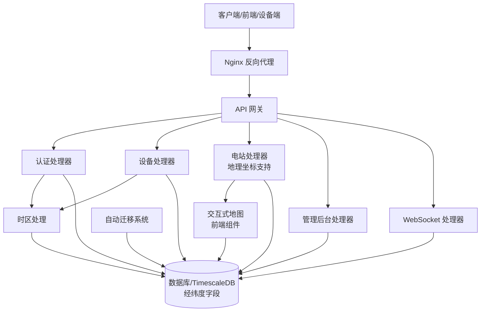
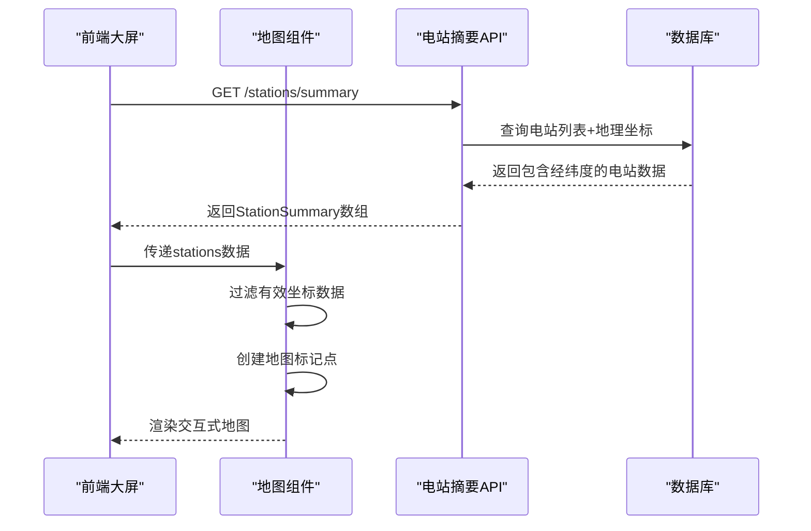
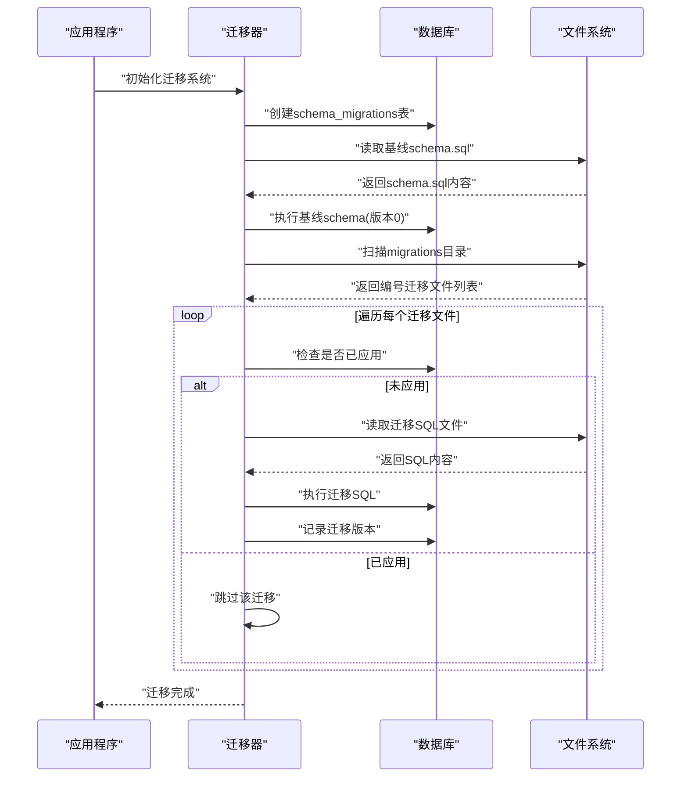
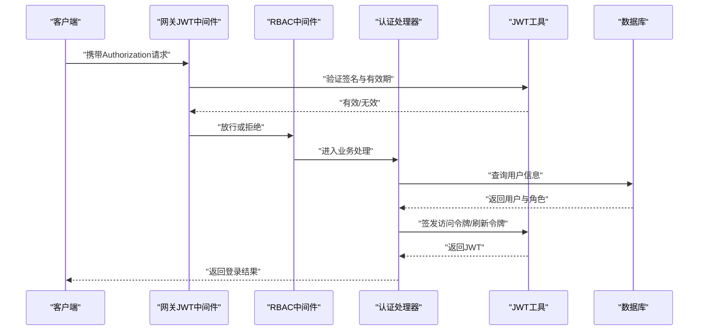
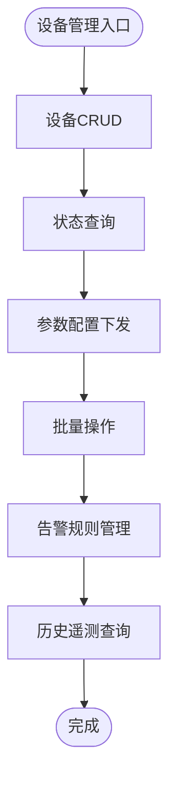
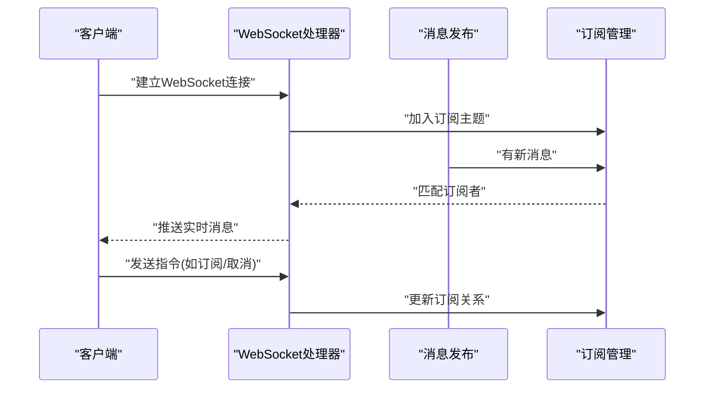
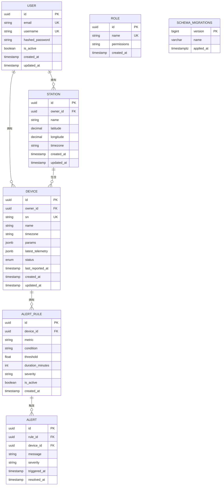
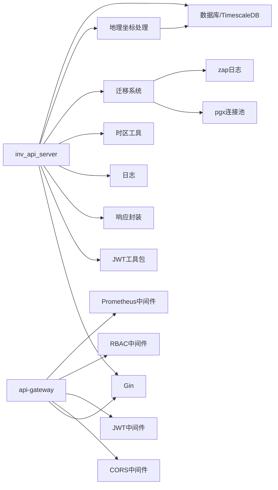

# API服务器

<cite>
**本文引用的文件**
- [main.go](file://inv_api_server/cmd/main.go)
- [config.go](file://inv_api_server/internal/config/config.go)
- [migrator.go](file://inv_api_server/internal/migration/migrator.go)
- [routes.go](file://api-gateway/internal/routes/routes.go)
- [jwt.go](file://api-gateway/internal/middleware/jwt.go)
- [cors.go](file://api-gateway/internal/middleware/cors.go)
- [rbac.go](file://api-gateway/internal/middleware/rbac.go)
- [auth_handler.go](file://inv_api_server/internal/handler/auth_handler.go)
- [admin_handler.go](file://inv_api_server/internal/handler/admin_handler.go)
- [device_handler.go](file://inv_api_server/internal/handler/device_handler.go)
- [station_handler.go](file://inv_api_server/internal/handler/station_handler.go)
- [ws_handler.go](file://inv_api_server/internal/handler/ws_handler.go)
- [models.go](file://inv_api_server/internal/model/models.go)
- [repositories.go](file://inv_api_server/internal/repository/repositories.go)
- [services.go](file://inv_api_server/internal/service/services.go)
- [jwt.go](file://inv_api_server/pkg/jwt/jwt.go)
- [response.go](file://inv_api_server/pkg/response/response.go)
- [logger.go](file://inv_api_server/pkg/logger/logger.go)
- [timezone.go](file://inv_api_server/pkg/timezone/timezone.go)
- [schema.sql](file://database/schema.sql)
- [001_init_schema.up.sql](file://database/migrations/001_init_schema.up.sql)
- [002_add_performance_indexes.up.sql](file://database/migrations/002_add_performance_indexes.up.sql)
- [003_timescaledb_compression.up.sql](file://database/migrations/003_timescaledb_compression.up.sql)
- [004_add_energy_columns.up.sql](file://database/migrations/004_add_energy_columns.up.sql)
- [005_device_day_data_jsonb.up.sql](file://database/migrations/005_device_day_data_jsonb.up.sql)
- [config.docker.yaml](file://inv_api_server/config.docker.yaml)
- [config.docker.yaml](file://api-gateway/config.docker.yaml)
- [Dockerfile](file://inv_api_server/Dockerfile)
- [Dockerfile](file://api-gateway/Dockerfile)
- [docker-compose.yml](file://deploy/docker-compose.yml)
- [nginx.conf](file://deploy/nginx.conf)
- [test_login.py](file://deploy/test_login.py)
- [webhook_server.py](file://deploy/webhook_server.py)
- [MapPanel.tsx](file://inv-admin-frontend/src/pages/big-screen/components/MapPanel.tsx)
- [index.tsx](file://inv-admin-frontend/src/pages/big-screen/index.tsx)
</cite>

## 更新摘要
**变更内容**   
- 增强了电站摘要API的地理坐标支持，StationSummary结构体现在包含纬度和经度字段
- 数据库已支持DECIMAL(10,7)精度的经纬度存储
- 前端大屏页面集成了交互式地图功能，基于返回的地理坐标显示电站位置
- 完善了地理位置数据的完整处理链路，从数据库到API再到前端可视化

## 目录
1. [简介](#简介)
2. [项目结构](#项目结构)
3. [核心组件](#核心组件)
4. [架构总览](#架构总览)
5. [详细组件分析](#详细组件分析)
6. [依赖关系分析](#依赖关系分析)
7. [性能考虑](#性能考虑)
8. [故障排查指南](#故障排查指南)
9. [结论](#结论)
10. [附录](#附录)

## 简介
本项目是一个基于 Go 语言与 Gin 框架构建的企业级监控平台后端 API 服务器，提供用户认证与授权、设备全生命周期管理、实时告警推送、管理后台接口以及 WebSocket 实时通信能力。系统采用模块化分层架构：网关层负责路由与安全中间件，应用层提供业务处理器，仓储层封装数据库访问，服务层承载业务逻辑与权限控制，并通过 Docker 化部署与 Nginx 反向代理对外提供统一入口。

**最新更新**：系统现已集成完整的自动数据库迁移系统，支持幂等版本控制的模式管理，包括MigrationConfig配置结构、migrator.go包集成，以及增强的Docker部署配置以支持只读数据库目录挂载。**同时增强了电站摘要API的地理坐标支持，使前端能够在交互式地图上显示准确的电站位置**。

## 项目结构
后端由两个主要服务组成：
- API 网关（api-gateway）：集中式路由、CORS、JWT 鉴权、RBAC 权限、限流与 Prometheus 监控等中间件。
- API 应用服务（inv_api_server）：具体业务处理器（认证、设备、告警、仪表盘、OTA、通知等）、JWT 工具、响应封装、日志与配置管理，以及**新增的自动数据库迁移系统**。

```mermaid
graph TB
subgraph "网关层"
GW_MAIN["api-gateway/main.go"]
GW_ROUTES["api-gateway/internal/routes/routes.go"]
GW_MW_JWT["api-gateway/internal/middleware/jwt.go"]
GW_MW_CORS["api-gateway/internal/middleware/cors.go"]
GW_MW_RBAC["api-gateway/internal/middleware/rbac.go"]
end
subgraph "应用层"
APP_MAIN["inv_api_server/cmd/main.go"]
APP_CONF["inv_api_server/internal/config/config.go"]
APP_HANDLER_AUTH["inv_api_server/internal/handler/auth_handler.go"]
APP_HANDLER_DEV["inv_api_server/internal/handler/device_handler.go"]
APP_HANDLER_ADMIN["inv_api_server/internal/handler/admin_handler.go"]
APP_HANDLER_STATION["inv_api_server/internal/handler/station_handler.go"]
APP_HANDLER_WS["inv_api_server/internal/handler/ws_handler.go"]
APP_PKG_JWT["inv_api_server/pkg/jwt/jwt.go"]
APP_PKG_RESP["inv_api_server/pkg/response/response.go"]
APP_PKG_LOG["inv_api_server/pkg/logger/logger.go"]
APP_PKG_TZ["inv_api_server/pkg/timezone/timezone.go"]
APP_MIGRATION["inv_api_server/internal/migration/migrator.go"]
end
subgraph "数据层"
DB_SCHEMA["database/schema.sql"]
DB_MIG_001["database/migrations/001_init_schema.up.sql"]
DB_MIG_002["database/migrations/002_add_performance_indexes.up.sql"]
DB_MIG_003["database/migrations/003_timescaledb_compression.up.sql"]
DB_MIG_004["database/migrations/004_add_energy_columns.up.sql"]
DB_MIG_005["database/migrations/005_device_day_data_jsonb.up.sql"]
DB_MIG_006["database/migrations/006_refactor_ota_to_device_upgrades.sql"]
DB_MIG_007["database/migrations/007_enhance_cmd_logs.up.sql"]
DB_MIG_008["database/migrations/008_upgrade_packages.up.sql"]
DB_MIG_009["database/migrations/009_upgrade_tasks.up.sql"]
DB_MIG_010["database/migrations/010_add_dsp_bms_versions.up.sql"]
DB_MIG_011["database/migrations/011_add_group_name_and_control_params.up.sql"]
end
GW_MAIN --> GW_ROUTES
GW_ROUTES --> GW_MW_JWT
GW_ROUTES --> GW_MW_CORS
GW_ROUTES --> GW_MW_RBAC
APP_MAIN --> APP_CONF
APP_MAIN --> APP_MIGRATION
APP_MAIN --> APP_HANDLER_AUTH
APP_MAIN --> APP_HANDLER_DEV
APP_MAIN --> APP_HANDLER_ADMIN
APP_MAIN --> APP_HANDLER_STATION
APP_MAIN --> APP_HANDLER_WS
APP_HANDLER_AUTH --> APP_PKG_JWT
APP_HANDLER_AUTH --> APP_PKG_RESP
APP_HANDLER_DEV --> APP_PKG_RESP
APP_HANDLER_ADMIN --> APP_PKG_RESP
APP_HANDLER_STATION --> APP_PKG_RESP
APP_HANDLER_WS --> APP_PKG_RESP
APP_HANDLER_DEV --> APP_PKG_TZ
APP_MIGRATION --> DB_SCHEMA
APP_MIGRATION --> DB_MIG_001
APP_MIGRATION --> DB_MIG_002
APP_MIGRATION --> DB_MIG_003
APP_MIGRATION --> DB_MIG_004
APP_MIGRATION --> DB_MIG_005
APP_MIGRATION --> DB_MIG_006
APP_MIGRATION --> DB_MIG_007
APP_MIGRATION --> DB_MIG_008
APP_MIGRATION --> DB_MIG_009
APP_MIGRATION --> DB_MIG_010
APP_MIGRATION --> DB_MIG_011
```



**图表来源**
- [main.go](file://inv_api_server/cmd/main.go)
- [migrator.go](file://inv_api_server/internal/migration/migrator.go)
- [config.go](file://inv_api_server/internal/config/config.go)
- [routes.go](file://api-gateway/internal/routes/routes.go)
- [jwt.go](file://api-gateway/internal/middleware/jwt.go)
- [cors.go](file://api-gateway/internal/middleware/cors.go)
- [rbac.go](file://api-gateway/internal/middleware/rbac.go)
- [auth_handler.go](file://inv_api_server/internal/handler/auth_handler.go)
- [device_handler.go](file://inv_api_server/internal/handler/device_handler.go)
- [admin_handler.go](file://inv_api_server/internal/handler/admin_handler.go)
- [station_handler.go](file://inv_api_server/internal/handler/station_handler.go)
- [ws_handler.go](file://inv_api_server/internal/handler/ws_handler.go)
- [jwt.go](file://inv_api_server/pkg/jwt/jwt.go)
- [response.go](file://inv_api_server/pkg/response/response.go)
- [logger.go](file://inv_api_server/pkg/logger/logger.go)
- [timezone.go](file://inv_api_server/pkg/timezone/timezone.go)
- [schema.sql](file://database/schema.sql)
- [001_init_schema.up.sql](file://database/migrations/001_init_schema.up.sql)
- [002_add_performance_indexes.up.sql](file://database/migrations/002_add_performance_indexes.up.sql)
- [003_timescaledb_compression.up.sql](file://database/migrations/003_timescaledb_compression.up.sql)
- [004_add_energy_columns.up.sql](file://database/migrations/004_add_energy_columns.up.sql)
- [005_device_day_data_jsonb.up.sql](file://database/migrations/005_device_day_data_jsonb.up.sql)

**章节来源**
- [main.go](file://inv_api_server/cmd/main.go)
- [config.go](file://inv_api_server/internal/config/config.go)
- [migrator.go](file://inv_api_server/internal/migration/migrator.go)
- [routes.go](file://api-gateway/internal/routes/routes.go)

## 核心组件
- 网关中间件体系：提供 CORS、JWT 鉴权、RBAC 授权、速率限制、请求日志与 Prometheus 指标统计。
- 认证与授权：基于 JWT 的登录、令牌刷新与权限校验；RBAC 控制不同角色对资源的访问。
- 设备管理：支持设备 CRUD、状态查询、参数配置下发、批量操作与告警规则管理。
- **地理坐标支持**：电站摘要API现支持返回完整的纬度和经度信息，用于前端交互式地图展示。
- **自动数据库迁移系统**：支持幂等版本控制的模式管理，包括基线schema执行、编号迁移文件处理、迁移状态跟踪。
- 实时推送：WebSocket 连接管理、消息广播与客户端状态同步。
- 响应与日志：统一响应格式与结构化日志输出。
- 配置与部署：Docker 化与 docker-compose 编排，Nginx 反向代理，自动化部署脚本，**支持只读数据库目录挂载**。

**最新更新**：系统现已集成完整的自动数据库迁移功能和增强的地理坐标支持，支持版本控制的数据库模式演进和交互式地图展示，确保数据库结构的一致性和可追溯性。

**章节来源**
- [jwt.go](file://api-gateway/internal/middleware/jwt.go)
- [rbac.go](file://api-gateway/internal/middleware/rbac.go)
- [cors.go](file://api-gateway/internal/middleware/cors.go)
- [auth_handler.go](file://inv_api_server/internal/handler/auth_handler.go)
- [device_handler.go](file://inv_api_server/internal/handler/device_handler.go)
- [station_handler.go](file://inv_api_server/internal/handler/station_handler.go)
- [ws_handler.go](file://inv_api_server/internal/handler/ws_handler.go)
- [migrator.go](file://inv_api_server/internal/migration/migrator.go)
- [config.go](file://inv_api_server/internal/config/config.go)
- [response.go](file://inv_api_server/pkg/response/response.go)
- [logger.go](file://inv_api_server/pkg/logger/logger.go)

## 架构总览
系统采用"网关 + 应用服务"的双层架构。网关负责统一入口与安全控制，应用服务承载具体业务。**新增的自动迁移系统在应用启动时自动执行数据库模式更新，同时增强了地理坐标数据处理能力**。数据库采用 TimescaleDB 以支持时间序列数据压缩与高性能查询。



**图表来源**
- [main.go](file://inv_api_server/cmd/main.go)
- [migrator.go](file://inv_api_server/internal/migration/migrator.go)
- [routes.go](file://api-gateway/internal/routes/routes.go)
- [auth_handler.go](file://inv_api_server/internal/handler/auth_handler.go)
- [device_handler.go](file://inv_api_server/internal/handler/device_handler.go)
- [station_handler.go](file://inv_api_server/internal/handler/station_handler.go)
- [admin_handler.go](file://inv_api_server/internal/handler/admin_handler.go)
- [ws_handler.go](file://inv_api_server/internal/handler/ws_handler.go)
- [timezone.go](file://inv_api_server/pkg/timezone/timezone.go)
- [schema.sql](file://database/schema.sql)
- [MapPanel.tsx](file://inv-admin-frontend/src/pages/big-screen/components/MapPanel.tsx)

## 详细组件分析

### 地理坐标支持与交互式地图
**新增功能** 系统现已增强地理坐标支持，电站摘要API现返回完整的纬度和经度信息，配合前端交互式地图实现电站位置的可视化展示。

#### StationSummary结构体增强
StationSummary结构体现在包含了完整的地理坐标字段：

```go
type StationSummary struct {
    StationID   int64   `json:"station_id"`
    StationName string  `json:"station_name"`
    Province    string  `json:"province"`
    City        string  `json:"city"`
    District    string  `json:"district"`
    Latitude    float64 `json:"latitude"`      // 新增：纬度
    Longitude   float64 `json:"longitude"`     // 新增：经度
    Capacity    float64 `json:"capacity"`
    DeviceCount int     `json:"device_count"`
    OnlineCount int     `json:"online_count"`
    FaultCount  int     `json:"fault_count"`
    TotalPower  float64 `json:"total_power"`
    TodayEnergy float64 `json:"today_energy"`
    TotalEnergy float64 `json:"total_energy"`
    MonthEnergy float64 `json:"month_energy"`
    TodayIncome float64 `json:"today_income"`
    Status      int     `json:"status"`
}
```

**地理坐标特性**：
- **精度支持**：使用float64类型，支持高精度的经纬度数据
- **JSON序列化**：通过`json:"latitude"`和`json:"longitude"`标签进行序列化
- **数据来源**：直接从Station模型的Latitude和Longitude字段映射

#### 数据库地理坐标存储
数据库表结构中已定义经纬度字段，使用DECIMAL(10,7)类型确保精度：

```sql
CREATE TABLE stations (
    id BIGSERIAL PRIMARY KEY,
    user_id BIGINT NOT NULL,
    name VARCHAR(100) NOT NULL,
    province VARCHAR(50),
    city VARCHAR(50),
    district VARCHAR(50),
    address TEXT,
    capacity DECIMAL(10,2) NOT NULL,
    panel_count INTEGER,
    peak_price DECIMAL(10,4),
    valley_price DECIMAL(10,4),
    latitude DECIMAL(10,7),      -- 纬度，精度7位小数
    longitude DECIMAL(10,7),     -- 经度，精度7位小数
    timezone VARCHAR(50) NOT NULL DEFAULT 'Asia/Shanghai',
    status SMALLINT NOT NULL DEFAULT 1,
    created_at TIMESTAMP NOT NULL DEFAULT CURRENT_TIMESTAMP,
    updated_at TIMESTAMP NOT NULL DEFAULT CURRENT_TIMESTAMP,
    deleted_at TIMESTAMP
);
```

**数据存储特性**：
- **高精度存储**：DECIMAL(10,7)类型支持7位小数精度，满足GPS定位需求
- **索引优化**：创建了地理位置相关的复合索引提升查询性能
- **时区支持**：结合timezone字段支持多时区电站管理

#### 前端交互式地图集成
前端大屏页面集成了基于Leaflet的交互式地图组件：



**图表来源**
- [station_handler.go:599-617](file://inv_api_server/internal/handler/station_handler.go#L599-L617)
- [MapPanel.tsx:90-100](file://inv-admin-frontend/src/pages/big-screen/components/MapPanel.tsx#L90-L100)
- [index.tsx:140-147](file://inv-admin-frontend/src/pages/big-screen/index.tsx#L140-L147)

#### 地图组件功能特性
交互式地图组件提供了丰富的功能：

**标记点显示**：
- 根据电站状态显示不同颜色的标记点（在线/离线/故障）
- 支持自定义图标样式和大小
- 鼠标悬停显示电站详细信息

**自动轮播**：
- 定时自动切换焦点到不同的电站位置
- 平滑的飞行动画效果
- 可配置的轮播间隔

**数据过滤**：
- 自动过滤无效坐标数据（经纬度为0的记录）
- 支持动态添加和移除标记点
- 响应式布局适配不同屏幕尺寸

**章节来源**
- [station_handler.go:523-541](file://inv_api_server/internal/handler/station_handler.go#L523-L541)
- [station_handler.go:599-617](file://inv_api_server/internal/handler/station_handler.go#L599-L617)
- [models.go:33-35](file://inv_api_server/internal/model/models.go#L33-L35)
- [schema.sql:102-104](file://database/schema.sql#L102-L104)
- [MapPanel.tsx:1-109](file://inv-admin-frontend/src/pages/big-screen/components/MapPanel.tsx#L1-L109)
- [index.tsx:140-147](file://inv-admin-frontend/src/pages/big-screen/index.tsx#L140-L147)

### 自动数据库迁移系统
**新增功能** 系统现已集成完整的自动数据库迁移系统，支持幂等版本控制的模式管理。

#### 迁移系统架构
迁移系统采用版本控制策略，确保数据库模式的演进是可追踪和可重复执行的：



**图表来源**
- [migrator.go:41-136](file://inv_api_server/internal/migration/migrator.go#L41-L136)
- [main.go:84-93](file://inv_api_server/cmd/main.go#L84-L93)

#### MigrationConfig配置结构
系统提供了灵活的迁移配置选项：

```go
type MigrationConfig struct {
    Dir        string `mapstructure:"dir"`         // 迁移文件目录，空则跳过
    SchemaFile string `mapstructure:"schema_file"` // 基线 schema.sql 路径，空则跳过
    AutoRun    bool   `mapstructure:"auto_run"`    // 默认 true
}
```

**配置特性**：
- **Dir**: 存放编号迁移文件 (001_*.sql, 002_*.sql, ...) 的目录
- **SchemaFile**: 基线 schema.sql 路径，仅在首次运行时执行 (version 0)
- **AutoRun**: 是否启用自动迁移 (默认 true，设为 false 可跳过)

#### 迁移执行流程
迁移系统按以下顺序执行：

1. **创建跟踪表**：自动创建 `schema_migrations` 表用于记录已应用的迁移
2. **执行基线模式**：运行 `schema.sql` 作为版本 0（仅首次运行）
3. **扫描迁移文件**：收集所有编号的 `.sql` 文件（排除 `.down.sql`）
4. **按版本执行**：按版本号升序执行未应用的迁移
5. **记录状态**：每次迁移成功后记录版本信息

#### Docker部署增强
系统支持只读数据库目录挂载，确保迁移文件的完整性：

```yaml
volumes:
  - ../database:/app/database:ro  # 挂载数据库迁移文件，启动时自动执行
```

**安全特性**：
- 使用只读挂载 (`:ro`) 防止容器内修改迁移文件
- 幂等执行确保多次启动的安全性
- 错误容忍机制避免迁移失败导致服务无法启动

**章节来源**
- [migrator.go:1-214](file://inv_api_server/internal/migration/migrator.go#L1-L214)
- [config.go:39-47](file://inv_api_server/internal/config/config.go#L39-L47)
- [main.go:84-93](file://inv_api_server/cmd/main.go#L84-L93)
- [config.docker.yaml:58-64](file://inv_api_server/config.docker.yaml#L58-L64)
- [docker-compose.yml:67-69](file://deploy/docker-compose.yml#L67-L69)

### 认证与授权组件
- JWT 签发与验证：登录成功后签发访问令牌与刷新令牌，支持过期续签与黑名单管理。
- RBAC 权限：基于角色的权限控制，校验用户对资源与动作的访问权限。
- 中间件链路：CORS -> JWT 鉴权 -> RBAC 授权 -> 业务处理器。



**图表来源**
- [jwt.go](file://api-gateway/internal/middleware/jwt.go)
- [rbac.go](file://api-gateway/internal/middleware/rbac.go)
- [auth_handler.go](file://inv_api_server/internal/handler/auth_handler.go)
- [jwt.go](file://inv_api_server/pkg/jwt/jwt.go)

**章节来源**
- [jwt.go](file://api-gateway/internal/middleware/jwt.go)
- [rbac.go](file://api-gateway/internal/middleware/rbac.go)
- [auth_handler.go](file://inv_api_server/internal/handler/auth_handler.go)
- [jwt.go](file://inv_api_server/pkg/jwt/jwt.go)

### 设备管理组件
- 功能范围：设备注册、编辑、删除、查询、状态监控、参数配置下发、批量导入导出、告警规则设置。
- 数据模型：设备基础信息、运行参数、历史遥测、日粒度聚合数据、告警记录。
- 批量操作：支持批量启用/停用、参数下发、分组管理。
- 与设备侧交互：通过 MQTT/Kafka 消息通道下发命令，接收设备上报数据。



**图表来源**
- [device_handler.go](file://inv_api_server/internal/handler/device_handler.go)
- [models.go](file://inv_api_server/internal/model/models.go)
- [schema.sql](file://database/schema.sql)

**章节来源**
- [device_handler.go](file://inv_api_server/internal/handler/device_handler.go)
- [models.go](file://inv_api_server/internal/model/models.go)
- [schema.sql](file://database/schema.sql)

### WebSocket 实时推送组件
- 连接管理：建立/维护长连接，心跳检测与断线重连。
- 消息广播：向订阅主题的客户端推送设备状态变更、告警事件、系统通知。
- 客户端状态同步：根据用户权限与设备归属关系推送差异化数据。



**图表来源**
- [ws_handler.go](file://inv_api_server/internal/handler/ws_handler.go)

**章节来源**
- [ws_handler.go](file://inv_api_server/internal/handler/ws_handler.go)

### 管理后台组件
- 用户管理：用户增删改查、角色分配、权限回收。
- 设备管理：设备列表、分组、状态总览、批量运维。
- 告警管理：告警规则配置、阈值设定、历史告警查询与处置。
- 系统配置：系统参数、邮件/SMS 通知配置、OTA 升级策略。

**章节来源**
- [admin_handler.go](file://inv_api_server/internal/handler/admin_handler.go)

### 数据模型与数据库操作
- 核心表：用户、角色、设备、设备参数、遥测数据、日粒度聚合、告警规则、告警记录、系统配置、OTA 版本等。
- 时间序列优化：TimescaleDB 分钟级压缩、索引优化、JSONB 存储日粒度聚合数据。
- **地理坐标支持**：电站表支持DECIMAL(10,7)精度的经纬度存储，用于精确位置定位。
- **迁移管理**：版本化迁移脚本，确保数据库演进可控，支持幂等执行和状态跟踪。
- **迁移跟踪表**：`schema_migrations` 表记录所有已应用的迁移版本和时间戳。



**图表来源**
- [schema.sql](file://database/schema.sql)
- [001_init_schema.up.sql](file://database/migrations/001_init_schema.up.sql)
- [002_add_performance_indexes.up.sql](file://database/migrations/002_add_performance_indexes.up.sql)
- [003_timescaledb_compression.up.sql](file://database/migrations/003_timescaledb_compression.up.sql)
- [004_add_energy_columns.up.sql](file://database/migrations/004_add_energy_columns.up.sql)
- [005_device_day_data_jsonb.up.sql](file://database/migrations/005_device_day_data_jsonb.up.sql)
- [migrator.go:43-49](file://inv_api_server/internal/migration/migrator.go#L43-L49)

**章节来源**
- [schema.sql](file://database/schema.sql)
- [001_init_schema.up.sql](file://database/migrations/001_init_schema.up.sql)
- [002_add_performance_indexes.up.sql](file://database/migrations/002_add_performance_indexes.up.sql)
- [003_timescaledb_compression.up.sql](file://database/migrations/003_timescaledb_compression.up.sql)
- [004_add_energy_columns.up.sql](file://database/migrations/004_add_energy_columns.up.sql)
- [005_device_day_data_jsonb.up.sql](file://database/migrations/005_device_day_data_jsonb.up.sql)
- [migrator.go:43-49](file://inv_api_server/internal/migration/migrator.go#L43-L49)

### API 版本管理与错误处理
- 版本策略：通过路径前缀或请求头进行版本区分，当前仓库未见显式多版本实现，建议在路由层增加版本号前缀。
- 统一错误码与响应体：所有接口返回一致的响应结构，包含状态码、消息与数据载体，便于前端统一处理。
- 错误分类：鉴权失败、权限不足、业务异常、系统内部错误，分别映射到不同 HTTP 状态码与业务码。

**章节来源**
- [response.go](file://inv_api_server/pkg/response/response.go)

### 性能优化策略
- 数据库层面：索引优化、TimescaleDB 压缩、分区表、只读副本、慢查询分析。
- 应用层面：Redis 缓存热点数据、连接池复用、异步任务队列、限流与熔断。
- 网络层面：Nginx 负载均衡、Gzip 压缩、CDN 加速、WebSocket 长连接复用。
- 监控指标：Prometheus 指标采集、日志结构化、告警规则完善。
- **地理坐标优化**：为地理位置查询创建复合索引，支持空间检索优化。
- **迁移性能**：迁移系统采用幂等设计，避免重复执行，支持增量更新。

**章节来源**
- [logger.go](file://inv_api_server/pkg/logger/logger.go)

## 依赖关系分析
- 模块内聚：各处理器职责单一，通过中间件与工具包解耦。
- 外部依赖：Gin Web 框架、JWT 库、数据库驱动、TimescaleDB、NATS/Kafka（桥接）。
- 部署依赖：Docker、docker-compose、Nginx、Prometheus/Grafana。



**图表来源**
- [main.go](file://inv_api_server/cmd/main.go)
- [migrator.go](file://inv_api_server/internal/migration/migrator.go)
- [station_handler.go](file://inv_api_server/internal/handler/station_handler.go)
- [jwt.go](file://api-gateway/internal/middleware/jwt.go)
- [cors.go](file://api-gateway/internal/middleware/cors.go)
- [rbac.go](file://api-gateway/internal/middleware/rbac.go)
- [response.go](file://inv_api_server/pkg/response/response.go)
- [logger.go](file://inv_api_server/pkg/logger/logger.go)
- [timezone.go](file://inv_api_server/pkg/timezone/timezone.go)

**章节来源**
- [main.go](file://inv_api_server/cmd/main.go)
- [migrator.go](file://inv_api_server/internal/migration/migrator.go)
- [routes.go](file://api-gateway/internal/routes/routes.go)

## 性能考虑
- 查询优化：为高频查询字段建立复合索引，使用物化视图缓存统计结果。
- 写入优化：批量写入遥测数据，合理设置 TimescaleDB 压缩周期。
- 缓存策略：热点设备状态与用户会话信息缓存，降低数据库压力。
- 并发控制：限流中间件防止突发流量击穿，连接池大小按 CPU 与内存调优。
- 监控告警：完善 P95/P99 延迟、错误率、连接数等指标监控。
- **地理坐标查询优化**：为经纬度字段创建空间索引，支持高效的地理位置检索。
- **地图渲染优化**：前端地图组件支持大数据量标记点的虚拟化和懒加载。
- **迁移性能**：迁移系统采用幂等设计，避免重复执行，支持增量更新。

## 故障排查指南
- 登录失败：检查 JWT 密钥配置、用户状态与密码哈希；查看网关日志与应用日志。
- 权限问题：确认用户角色与资源权限映射，RBAC 规则是否正确加载。
- 设备无数据：检查 MQTT/Kafka 桥接是否正常，设备上报格式与解析规则。
- WebSocket 不推送：确认订阅关系、连接状态与广播通道。
- 数据库异常：查看迁移脚本执行情况、索引缺失与慢查询日志。
- **地理坐标问题**：检查经纬度数据精度、坐标系转换、地图组件配置。
- **地图显示异常**：确认坐标数据有效性、地图库版本兼容性、CSS样式冲突。
- **迁移问题**：检查迁移配置文件、数据库目录挂载权限、schema_migrations表状态。
- **Docker部署问题**：确认只读挂载配置正确、数据库连接参数、迁移文件路径。

**更新** 新增了地理坐标和地图相关的故障排查指导。

**章节来源**
- [logger.go](file://inv_api_server/pkg/logger/logger.go)
- [migrator.go:111-128](file://inv_api_server/internal/migration/migrator.go#L111-L128)
- [station_handler.go:599-617](file://inv_api_server/internal/handler/station_handler.go#L599-L617)
- [MapPanel.tsx:90-100](file://inv-admin-frontend/src/pages/big-screen/components/MapPanel.tsx#L90-L100)
- [test_login.py](file://deploy/test_login.py)

## 结论
该 API 服务器以清晰的分层架构与完善的中间件体系为基础，覆盖了从认证授权到设备管理、实时推送与管理后台的完整业务闭环。结合 TimescaleDB 的时间序列优化与容器化部署方案，具备良好的可扩展性与运维友好性。**最新增强**的自动数据库迁移系统和地理坐标支持进一步提升了系统的可维护性和部署可靠性，确保数据库模式的一致性和可追溯性，同时为前端交互式地图展示提供了完整的数据支撑。建议后续引入 API 版本化路由、更细粒度的缓存与异步任务队列，持续完善监控与告警体系。

## 附录

### 部署与配置
- Docker 化：应用与网关均提供 Dockerfile 与 docker-compose 编排。
- 反向代理：Nginx 提供静态资源与 HTTPS 终端。
- 自动化部署：提供一键部署脚本与 Kubernetes 配置样例。
- **迁移配置**：支持通过配置文件和环境变量自定义迁移行为。
- **地理坐标配置**：支持多种坐标系格式，兼容GPS、GCJ-02等标准。

**章节来源**
- [Dockerfile](file://inv_api_server/Dockerfile)
- [Dockerfile](file://api-gateway/Dockerfile)
- [config.docker.yaml](file://inv_api_server/config.docker.yaml)
- [config.docker.yaml](file://api-gateway/config.docker.yaml)
- [docker-compose.yml](file://deploy/docker-compose.yml)
- [nginx.conf](file://deploy/nginx.conf)

### 开发与测试
- 单元测试：应用层提供测试样例，建议补充接口测试与集成测试。
- 压力测试：提供独立的压力测试工具，便于评估系统上限。
- 文档：设备端 MQTT 接口文档与 OTA 开发指南可供参考。
- **迁移测试**：提供完整的迁移脚本集合，支持回滚脚本(.down.sql)。
- **地理坐标测试**：提供坐标数据验证工具和地图渲染测试用例。

**章节来源**
- [internal_handler_test.go](file://inv_api_server/internal/handler/internal_handler_test.go)
- [stress_test/main.go](file://tools/stress_test/main.go)
- [MQTT接口文档.md](file://docs/MQTT接口文档.md)
- [设备端OTA程序开发指南.md](file://docs/设备端OTA程序开发指南.md)

### 数据库迁移使用示例
**新增** 以下是数据库迁移功能的典型使用场景：

#### 迁移配置示例
```yaml
migration:
  dir: /app/database/migrations      # 迁移文件目录
  schema_file: /app/database/schema.sql  # 基线schema文件
  auto_run: true                     # 启用自动迁移
```

#### Docker环境部署
在docker-compose.yml中配置只读挂载：
```yaml
volumes:
  - ../database:/app/database:ro  # 只读挂载数据库目录
```

#### 迁移文件命名规范
- 基线文件：`schema.sql` (版本0)
- 编号文件：`001_init_schema.up.sql`, `002_add_performance_indexes.up.sql`
- 回滚文件：`001_init_schema.down.sql` (可选)

#### 迁移执行日志
```
[Migration] Running baseline schema.sql ...
[Migration] Baseline schema.sql applied
[Migration] Running migration version=1 file=001_init_schema.up.sql
[Migration] Migration applied version=1 file=001_init_schema.up.sql
[Migration] Complete applied=1 skipped=0 total=1
```

### 地理坐标API使用示例
**新增** 以下是地理坐标功能的典型使用场景：

#### 电站摘要API响应格式
```json
{
  "code": 0,
  "data": {
    "stations": [
      {
        "station_id": 1,
        "station_name": "北京光伏电站",
        "province": "北京市",
        "city": "北京市",
        "district": "朝阳区",
        "latitude": 39.9042,
        "longitude": 116.4074,
        "capacity": 100.5,
        "device_count": 10,
        "online_count": 8,
        "fault_count": 2,
        "total_power": 85.2,
        "today_energy": 120.5,
        "total_energy": 15000.8,
        "month_energy": 3500.2,
        "today_income": 96.4,
        "status": 1
      }
    ],
    "summary": {
      "totalStations": 1,
      "totalDevices": 10,
      "onlineDevices": 8,
      "todayGeneration": 120.5,
      "totalGeneration": 15000.8,
      "monthGeneration": 3500.2,
      "faultDevices": 2,
      "totalIncome": 96.4
    }
  }
}
```

#### 前端地图集成示例
```typescript
// 地图组件使用
const MapPanel = ({ stations }) => {
  return (
    <MapContainer center={[35.5, 105]} zoom={4}>
      <TileLayer url="https://{s}.basemaps.cartocdn.com/dark_all/{z}/{x}/{y}{r}.png" />
      {stations.filter(s => s.latitude !== 0 && s.longitude !== 0).map((station) => (
        <Marker 
          key={station.station_id}
          position={[station.latitude, station.longitude]}
          icon={createMarkerIcon(station.status)}
        >
          <Tooltip>
            <span>{station.station_name} ({station.capacity} kW)</span>
          </Tooltip>
        </Marker>
      ))}
    </MapContainer>
  );
};
```

#### 数据库坐标字段说明
- **精度要求**：DECIMAL(10,7)支持7位小数精度，约等于1米定位精度
- **坐标系标准**：支持WGS84、GCJ-02等多种坐标系
- **索引优化**：为地理位置查询创建复合索引提升性能
- **数据验证**：前端和后端的坐标数据验证机制

**章节来源**
- [config.docker.yaml:58-64](file://inv_api_server/config.docker.yaml#L58-L64)
- [docker-compose.yml:67-69](file://deploy/docker-compose.yml#L67-L69)
- [station_handler.go:599-617](file://inv_api_server/internal/handler/station_handler.go#L599-L617)
- [MapPanel.tsx:90-100](file://inv-admin-frontend/src/pages/big-screen/components/MapPanel.tsx#L90-L100)
- [migrator.go:130-136](file://inv_api_server/internal/migration/migrator.go#L130-L136)
- [001_init_schema.up.sql:43-45](file://database/migrations/001_init_schema.up.sql#L43-L45)
- [schema.sql:102-104](file://database/schema.sql#L102-L104)