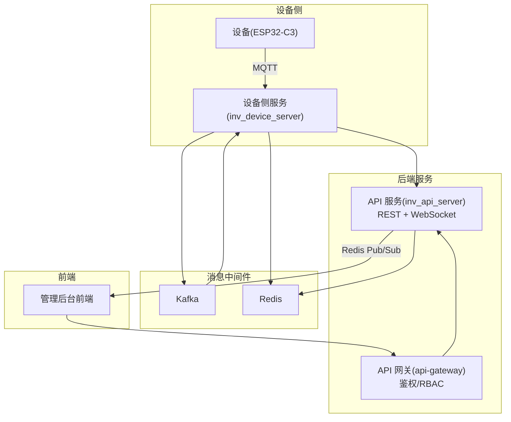
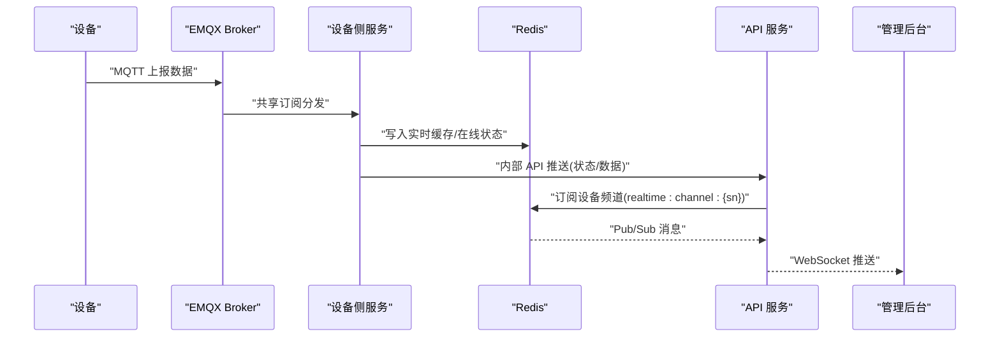
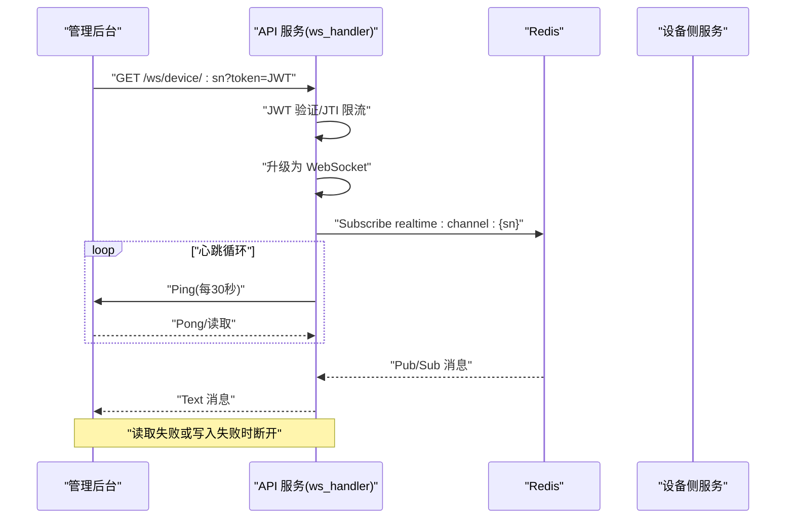
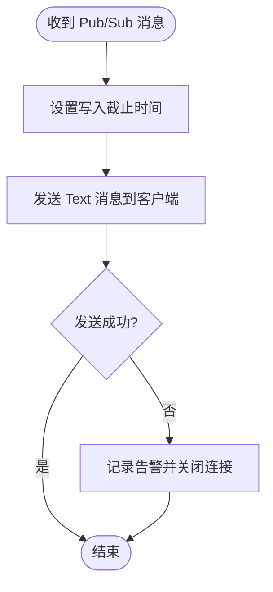
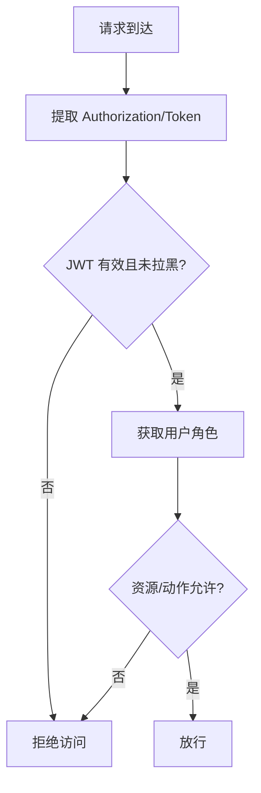
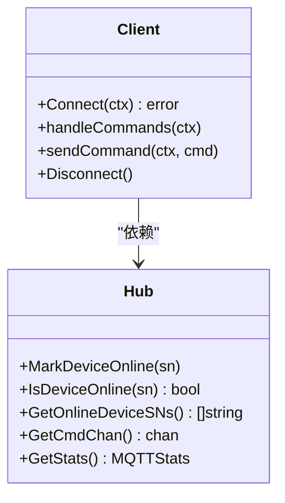
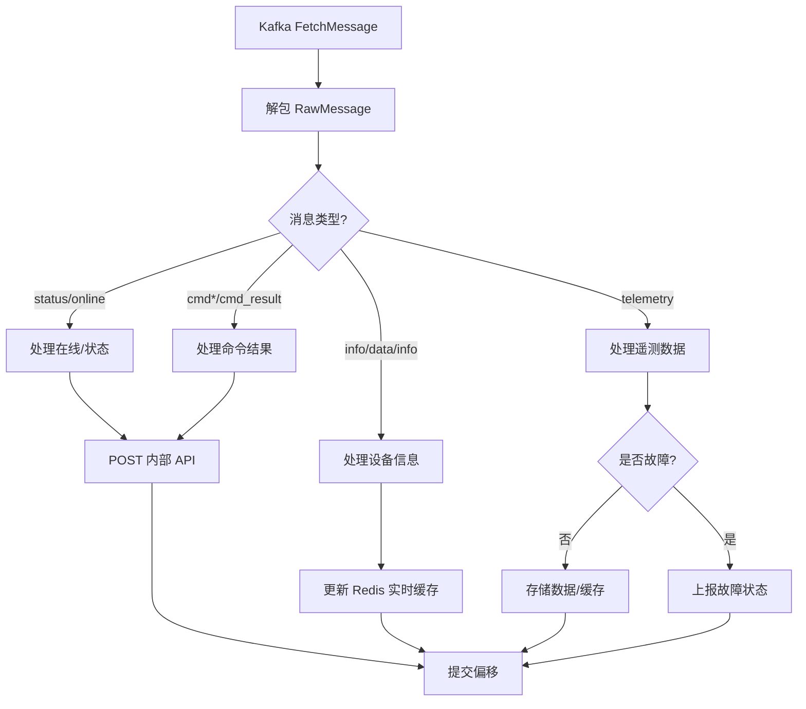
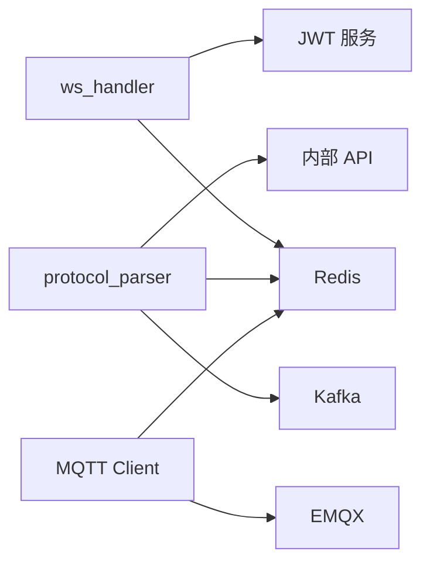

# 实时通信服务

<cite>
**本文引用的文件**
- [ws_handler.go](file://inv_api_server/internal/handler/ws_handler.go)
- [README.md](file://README.md)
- [protocol_parser.go](file://inv_device_server/internal/service/protocol_parser.go)
- [client.go](file://inv_device_server/internal/mqtt/client.go)
- [auth.go](file://inv_api_server/internal/middleware/auth.go)
- [rbac.go](file://api-gateway/internal/middleware/rbac.go)
- [monitor.sh](file://deploy/monitor.sh)
- [main.go](file://tools/stress_test/main.go)
</cite>

## 目录
1. [简介](#简介)
2. [项目结构](#项目结构)
3. [核心组件](#核心组件)
4. [架构总览](#架构总览)
5. [详细组件分析](#详细组件分析)
6. [依赖分析](#依赖分析)
7. [性能考虑](#性能考虑)
8. [故障排查指南](#故障排查指南)
9. [结论](#结论)
10. [附录](#附录)

## 简介
本技术文档面向实时通信服务，聚焦以下目标：
- WebSocket 连接管理：连接建立、心跳检测、断线重连机制
- 实时数据推送：消息广播、订阅管理、客户端状态同步
- 权限验证：确保客户端仅接收其有权限的数据
- 消息队列集成、数据缓存与性能优化策略
- 实时告警推送、设备状态变更通知与系统事件广播
- WebSocket API 的连接协议、消息格式与错误处理
- 监控指标、性能测试与故障排查
- 前端 WebSocket 集成示例与最佳实践

## 项目结构
该系统采用“设备直连 MQTT + 后端服务 + WebSocket 推送”的混合架构：
- 设备通过 MQTT 直连 EMQX，上报遥测、状态、告警等数据
- 设备侧服务（inv_device_server）消费 Kafka 消息，解析协议、写入缓存与内部 API
- API 服务（inv_api_server）提供 REST API 与 WebSocket 推送通道
- 管理后台通过 WebSocket 接收实时事件（如设备状态、告警）

**图示来源**
- [README.md:1-367](file://README.md#L1-L367)
- [ws_handler.go:1-122](file://inv_api_server/internal/handler/ws_handler.go#L1-L122)
- [protocol_parser.go:1-800](file://inv_device_server/internal/service/protocol_parser.go#L1-L800)
- [client.go:1-403](file://inv_device_server/internal/mqtt/client.go#L1-L403)

**章节来源**
- [README.md:1-367](file://README.md#L1-L367)

## 核心组件
- WebSocket 管道：负责设备侧服务与管理后台之间的实时推送
- MQTT Hub：维护设备在线状态、订阅主题、处理命令下发
- 协议解析器：从 Kafka 消息中解析设备数据，写入缓存并调用内部 API
- 鉴权与权限中间件：JWT 验证、黑名单校验、RBAC 权限控制
- 缓存与发布订阅：Redis 用于在线状态、实时缓存与 Pub/Sub 广播

**章节来源**
- [ws_handler.go:1-122](file://inv_api_server/internal/handler/ws_handler.go#L1-L122)
- [protocol_parser.go:1-800](file://inv_device_server/internal/service/protocol_parser.go#L1-L800)
- [client.go:1-403](file://inv_device_server/internal/mqtt/client.go#L1-L403)
- [auth.go:1-255](file://inv_api_server/internal/middleware/auth.go#L1-L255)
- [rbac.go:1-179](file://api-gateway/internal/middleware/rbac.go#L1-L179)

## 架构总览
系统实时链路如下：
- 设备通过 MQTT 上报数据，EMQX 共享订阅分发至多个设备侧服务实例
- 设备侧服务解析消息、写入 Redis 缓存与内部 API，并向 Redis Pub/Sub 推送
- API 服务通过 WebSocket 订阅指定设备频道，将消息推送给管理后台
- 鉴权中间件保障访问安全，RBAC 控制资源访问范围

**图示来源**
- [README.md:1-367](file://README.md#L1-L367)
- [protocol_parser.go:1-800](file://inv_device_server/internal/service/protocol_parser.go#L1-L800)
- [ws_handler.go:1-122](file://inv_api_server/internal/handler/ws_handler.go#L1-L122)

## 详细组件分析

### WebSocket 连接管理与心跳检测
- 连接建立：通过升级 HTTP 请求为 WebSocket，携带 token 参数进行鉴权
- 速率限制：按 JWT JTI 维度限制单用户最大并发连接数
- 心跳检测：定时发送 Ping，设置写入截止时间，异常即关闭连接
- 断线处理：读取消息失败触发取消上下文，退出循环并清理资源

**图示来源**
- [ws_handler.go:1-122](file://inv_api_server/internal/handler/ws_handler.go#L1-L122)

**章节来源**
- [ws_handler.go:1-122](file://inv_api_server/internal/handler/ws_handler.go#L1-L122)

### 实时数据推送与订阅管理
- 订阅频道：以设备 SN 为标识构建频道名，API 服务订阅该频道
- 推送策略：收到 Pub/Sub 消息后，设置写入截止时间并发送文本消息
- 客户端状态同步：设备侧服务通过内部 API 更新设备状态，API 服务再通过 WebSocket 推送

**图示来源**
- [ws_handler.go:1-122](file://inv_api_server/internal/handler/ws_handler.go#L1-L122)

**章节来源**
- [ws_handler.go:1-122](file://inv_api_server/internal/handler/ws_handler.go#L1-L122)

### 权限验证与访问控制
- JWT 鉴权：从查询参数提取 token，解析并校验黑名单
- RBAC 控制：根据用户角色与资源动作判断是否允许访问
- 网关层拦截：在 API 网关统一进行权限判定与缓存

**图示来源**
- [auth.go:1-255](file://inv_api_server/internal/middleware/auth.go#L1-L255)
- [rbac.go:1-179](file://api-gateway/internal/middleware/rbac.go#L1-L179)

**章节来源**
- [auth.go:1-255](file://inv_api_server/internal/middleware/auth.go#L1-L255)
- [rbac.go:1-179](file://api-gateway/internal/middleware/rbac.go#L1-L179)

### MQTT 连接管理与设备状态
- 连接参数：KeepAlive、CleanStart、SessionExpiry 等
- 主题订阅：设备数据、状态、OTA 状态、命令结果
- 在线状态：通过 Redis Hash 维护设备在线时间戳，超时判定离线
- 命令下发：区分 OTA 与普通命令，构造主题并发布

**图示来源**
- [client.go:1-403](file://inv_device_server/internal/mqtt/client.go#L1-L403)

**章节来源**
- [client.go:1-403](file://inv_device_server/internal/mqtt/client.go#L1-L403)

### 协议解析与数据缓存
- Kafka 消费：批量拉取、解包、分流处理
- 消息类型：状态、信息、遥测、命令响应等
- 防抖策略：状态与故障上报去抖，避免抖动风暴
- 缓存策略：Redis 实时缓存合并最新数据，保持与数据库一致
- 内部 API：将解析后的数据与状态同步到 API 服务

**图示来源**
- [protocol_parser.go:1-800](file://inv_device_server/internal/service/protocol_parser.go#L1-L800)

**章节来源**
- [protocol_parser.go:1-800](file://inv_device_server/internal/service/protocol_parser.go#L1-L800)

### 实时告警推送与系统事件广播
- 告警检测：从状态主题中解析故障状态，结合 payload 字段判断
- 防抖控制：故障与状态上报均设置短 TTL，避免重复推送
- 事件广播：通过 Redis Pub/Sub 将事件推送到 WebSocket 客户端

**章节来源**
- [protocol_parser.go:1-800](file://inv_device_server/internal/service/protocol_parser.go#L1-L800)
- [ws_handler.go:1-122](file://inv_api_server/internal/handler/ws_handler.go#L1-L122)

## 依赖分析
- 组件耦合
  - ws_handler 依赖 Redis Pub/Sub 与 JWT 服务
  - protocol_parser 依赖 Kafka、Redis、内部 API
  - client 依赖 MQTT 客户端库与 Redis
- 外部依赖
  - EMQX：MQTT Broker，共享订阅与 JWT 鉴权
  - Redis：在线状态、实时缓存、Pub/Sub
  - Kafka：设备数据缓冲与解耦

**图示来源**
- [ws_handler.go:1-122](file://inv_api_server/internal/handler/ws_handler.go#L1-L122)
- [protocol_parser.go:1-800](file://inv_device_server/internal/service/protocol_parser.go#L1-L800)
- [client.go:1-403](file://inv_device_server/internal/mqtt/client.go#L1-L403)

**章节来源**
- [ws_handler.go:1-122](file://inv_api_server/internal/handler/ws_handler.go#L1-L122)
- [protocol_parser.go:1-800](file://inv_device_server/internal/service/protocol_parser.go#L1-L800)
- [client.go:1-403](file://inv_device_server/internal/mqtt/client.go#L1-L403)

## 性能考虑
- 连接与心跳
  - 心跳周期与写入截止时间可调，平衡延迟与稳定性
  - 读取线程与心跳线程分离，避免阻塞
- 缓存与去抖
  - Redis 实时缓存减少数据库压力，合并最新数据
  - 状态与故障上报防抖，降低无效推送
- 消息处理
  - Kafka 消费批量化、工作池并发处理，提升吞吐
  - 内部 API 调用指数退避，提高可靠性
- 监控与限流
  - IP 令牌桶限流，防止突发流量
  - RBAC 缓存与角色缓存，降低鉴权开销

**章节来源**
- [ws_handler.go:1-122](file://inv_api_server/internal/handler/ws_handler.go#L1-L122)
- [protocol_parser.go:1-800](file://inv_device_server/internal/service/protocol_parser.go#L1-L800)
- [auth.go:1-255](file://inv_api_server/internal/middleware/auth.go#L1-L255)

## 故障排查指南
- 连接问题
  - 检查 token 是否有效、是否在黑名单；确认 JTI 限流阈值
  - 查看升级失败日志与上下文取消原因
- 心跳与断开
  - 心跳发送失败通常意味着客户端离线或网络异常
  - 检查 Redis Pub/Sub 订阅是否正确
- 数据不更新
  - 确认设备是否在线（Redis 在线哈希）
  - 检查 Kafka 消费是否正常，内部 API 是否返回错误
- 权限问题
  - 核对用户角色与资源动作映射
  - 清理 RBAC 缓存或等待 TTL 过期

**章节来源**
- [ws_handler.go:1-122](file://inv_api_server/internal/handler/ws_handler.go#L1-L122)
- [protocol_parser.go:1-800](file://inv_device_server/internal/service/protocol_parser.go#L1-L800)
- [rbac.go:1-179](file://api-gateway/internal/middleware/rbac.go#L1-L179)

## 结论
本系统通过 MQTT 与 WebSocket 的组合，实现了低延迟、高可靠的实时通信能力。设备侧服务负责协议解析与数据缓存，API 服务负责鉴权与推送，Redis 与 Kafka 提供高可用的缓存与缓冲。通过心跳、防抖与限流等策略，系统在复杂场景下仍能保持稳定与高效。

## 附录

### WebSocket API 规范
- 连接地址
  - GET /ws/device/{sn}?token={JWT}
- 心跳机制
  - 服务端每 30 秒发送 Ping，客户端需及时响应
- 消息格式
  - 文本消息，内容为服务端推送的 JSON 数据
- 错误处理
  - 未授权：返回错误并断开
  - 连接过多：返回限流错误
  - 写入失败：记录告警并断开

**章节来源**
- [ws_handler.go:1-122](file://inv_api_server/internal/handler/ws_handler.go#L1-L122)

### 前端集成最佳实践
- 连接建立
  - 从后端获取 token，拼接到查询参数
  - 建立连接后注册心跳与断线重连逻辑
- 消息处理
  - 对收到的消息进行结构化解析
  - 根据设备 SN 进行本地状态更新
- 重连策略
  - 指数退避重连，避免雪崩
  - 重连时检查设备是否仍在权限范围内

**章节来源**
- [ws_handler.go:1-122](file://inv_api_server/internal/handler/ws_handler.go#L1-L122)

### 性能测试与监控
- 压力测试
  - 使用工具对设备遥测接口进行压测，观察延迟与吞吐
- 监控脚本
  - 检查服务端口、资源使用情况，必要时触发告警

**章节来源**
- [main.go:45-97](file://tools/stress_test/main.go#L45-L97)
- [monitor.sh:52-118](file://deploy/monitor.sh#L52-L118)