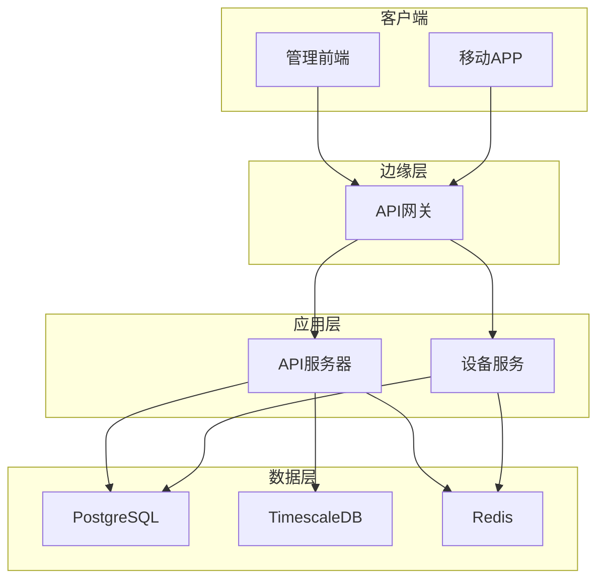
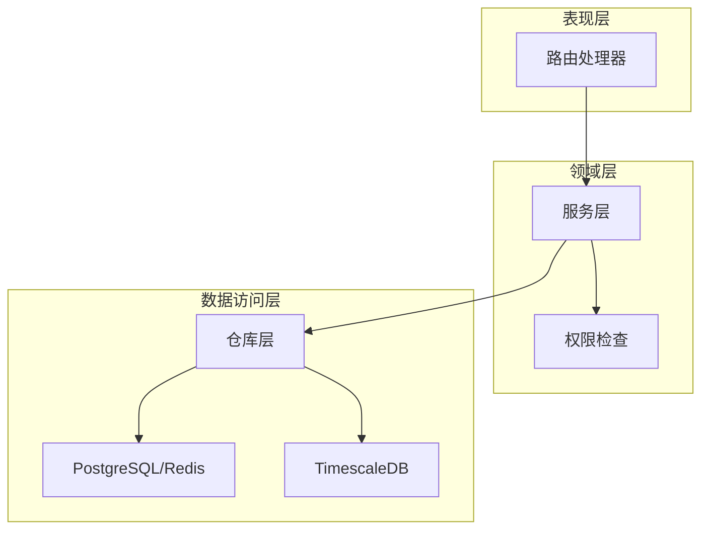
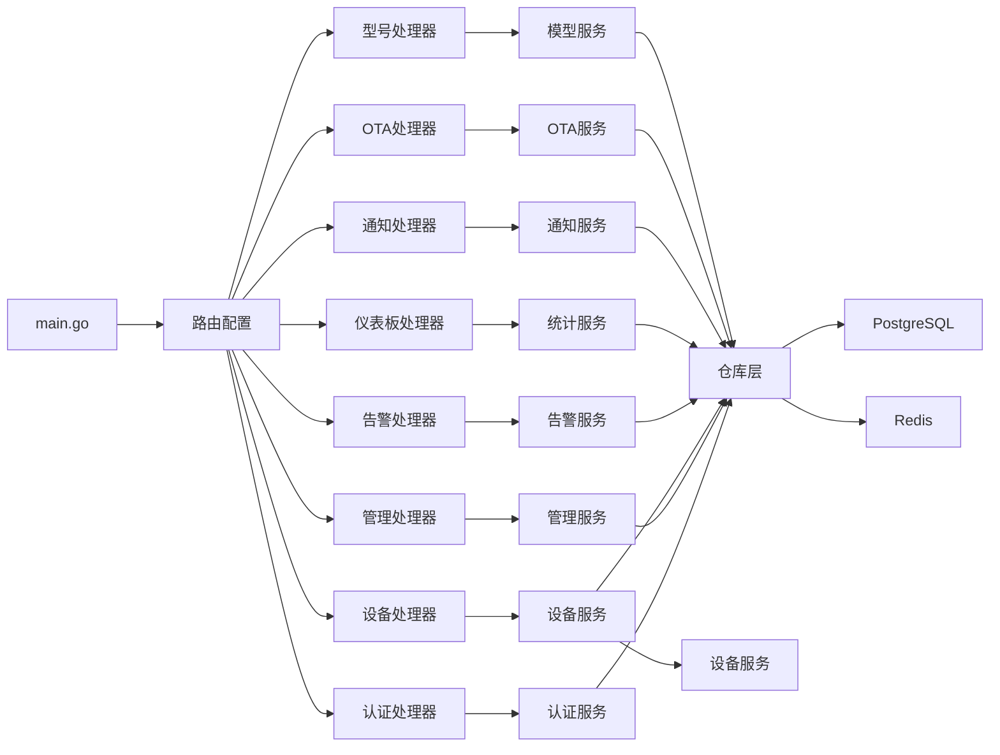

# 管理后台API

<cite>
**本文档引用的文件**
- [inv_api_server/cmd/main.go](file://inv_api_server/cmd/main.go)
- [inv_api_server/internal/handler/admin_handler.go](file://inv_api_server/internal/handler/admin_handler.go)
- [inv_api_server/internal/handler/device_handler.go](file://inv_api_server/internal/handler/device_handler.go)
- [inv_api_server/internal/handler/alarm_handler.go](file://inv_api_server/internal/handler/alarm_handler.go)
- [inv_api_server/internal/handler/work_order_handler.go](file://inv_api_server/internal/handler/work_order_handler.go)
- [inv_api_server/internal/handler/dashboard_handler.go](file://inv_api_server/internal/handler/dashboard_handler.go)
- [inv_api_server/internal/handler/notification_handler.go](file://inv_api_server/internal/handler/notification_handler.go)
- [inv_api_server/internal/handler/auth_handler.go](file://inv_api_server/internal/handler/auth_handler.go)
- [inv_api_server/internal/handler/model_handler.go](file://inv_api_server/internal/handler/model_handler.go)
- [inv_api_server/internal/handler/ota_handler.go](file://inv_api_server/internal/handler/ota_handler.go)
- [inv_api_server/internal/middleware/auth.go](file://inv_api_server/internal/middleware/auth.go)
- [inv_api_server/internal/middleware/permission.go](file://inv_api_server/internal/middleware/permission.go)
- [inv_api_server/internal/service/services.go](file://inv_api_server/internal/service/services.go)
- [inv_api_server/internal/repository/repositories.go](file://inv_api_server/internal/repository/repositories.go)
- [api-gateway/main.go](file://api-gateway/main.go)
- [api-gateway/internal/routes/routes.go](file://api-gateway/internal/routes/routes.go)
</cite>

## 目录
1. [简介](#简介)
2. [项目结构](#项目结构)
3. [核心组件](#核心组件)
4. [架构总览](#架构总览)
5. [详细组件分析](#详细组件分析)
6. [依赖关系分析](#依赖关系分析)
7. [性能考虑](#性能考虑)
8. [故障排除指南](#故障排除指南)
9. [结论](#结论)
10. [附录](#附录)

## 简介
本项目为光伏逆变器监控系统的管理后台API，提供完整的设备管理、告警管理、仪表板统计、通知系统、系统配置与权限控制等能力。系统采用Go语言构建，基于Gin框架，结合PostgreSQL、Redis、TimescaleDB等技术栈，支持高并发与可观测性。

## 项目结构
系统主要由以下模块组成：
- API网关：统一入口、路由转发、鉴权与限流
- API服务器：业务逻辑处理、数据持久化、缓存与外部服务交互
- 设备服务：设备数据采集与命令下发
- 数据库：PostgreSQL存储用户、设备、告警、配置等数据；TimescaleDB存储时序遥测数据
- 缓存：Redis用于JWT黑名单、刷新令牌、速率限制、权限缓存等

**图表来源**
- [api-gateway/main.go:1-129](file://api-gateway/main.go#L1-L129)
- [inv_api_server/cmd/main.go:1-620](file://inv_api_server/cmd/main.go#L1-L620)

**章节来源**
- [inv_api_server/cmd/main.go:1-620](file://inv_api_server/cmd/main.go#L1-L620)
- [api-gateway/main.go:1-129](file://api-gateway/main.go#L1-L129)

## 核心组件
- 身份认证与授权：JWT鉴权、RBAC权限控制、自动权限校验中间件
- 用户管理：用户增删改查、角色与状态管理、审计日志
- 设备管理：设备绑定/解绑、控制命令下发、遥测数据查询、历史统计
- 告警管理：告警列表、详情、处理与忽略、统计分析
- 仪表板：设备分布、趋势分析、能量统计、站点排名、大屏展示
- 通知系统：站内通知、统计与清理
- OTA升级：固件管理、推送升级、设备状态跟踪
- 系统配置：系统配置读写、租户管理、指标监控

**章节来源**
- [inv_api_server/internal/handler/admin_handler.go:1-784](file://inv_api_server/internal/handler/admin_handler.go#L1-L784)
- [inv_api_server/internal/handler/device_handler.go:1-880](file://inv_api_server/internal/handler/device_handler.go#L1-L880)
- [inv_api_server/internal/handler/alarm_handler.go:1-256](file://inv_api_server/internal/handler/alarm_handler.go#L1-L256)
- [inv_api_server/internal/handler/dashboard_handler.go:1-1241](file://inv_api_server/internal/handler/dashboard_handler.go#L1-L1241)
- [inv_api_server/internal/handler/notification_handler.go:1-211](file://inv_api_server/internal/handler/notification_handler.go#L1-L211)
- [inv_api_server/internal/handler/ota_handler.go:1-536](file://inv_api_server/internal/handler/ota_handler.go#L1-L536)

## 架构总览
系统采用分层架构：
- 表现层：Gin路由与处理器
- 领域层：服务层封装业务逻辑
- 数据访问层：仓库模式访问数据库与缓存
- 外部集成：设备服务HTTP调用、短信/邮件服务

**图表来源**
- [inv_api_server/internal/middleware/permission.go:1-89](file://inv_api_server/internal/middleware/permission.go#L1-L89)
- [inv_api_server/internal/service/services.go:1-706](file://inv_api_server/internal/service/services.go#L1-L706)
- [inv_api_server/internal/repository/repositories.go:1-800](file://inv_api_server/internal/repository/repositories.go#L1-L800)

**章节来源**
- [inv_api_server/internal/middleware/permission.go:1-89](file://inv_api_server/internal/middleware/permission.go#L1-L89)
- [inv_api_server/internal/service/services.go:1-706](file://inv_api_server/internal/service/services.go#L1-L706)
- [inv_api_server/internal/repository/repositories.go:1-800](file://inv_api_server/internal/repository/repositories.go#L1-L800)

## 详细组件分析

### 用户管理API
- 端点规范
  - GET /api/v1/admin/users?page=&pageSize=&keyword=&role=&status=
  - GET /api/v1/admin/users/:id
  - PUT /api/v1/admin/users/:id/role
  - PUT /api/v1/admin/users/:id/toggle
  - GET /api/v1/users
  - GET /api/v1/users/:id
  - PUT /api/v1/users/:id/role
  - PUT /api/v1/users/:id/toggle
- 功能特性
  - 分页查询、关键词过滤、角色与状态筛选
  - 角色变更与状态切换
  - 审计日志记录与导出
- 权限控制
  - 管理员专用路由组，require admin:manage
  - 用户相关路由按users:view/edit权限控制

**章节来源**
- [inv_api_server/cmd/main.go:538-544](file://inv_api_server/cmd/main.go#L538-L544)
- [inv_api_server/internal/handler/admin_handler.go:42-107](file://inv_api_server/internal/handler/admin_handler.go#L42-L107)

### 设备管理API
- 端点规范
  - GET /api/v1/devices?page=&pageSize=&station_id=&status=
  - GET /api/v1/devices/:sn
  - GET /api/v1/devices/:sn/realtime
  - POST /api/v1/devices/bind
  - POST /api/v1/devices/:sn/unbind
  - DELETE /api/v1/devices/:sn/unbind
  - POST /api/v1/devices/:sn/control
  - POST /api/v1/devices/batch/control
  - GET /api/v1/devices/:sn/telemetry
  - GET /api/v1/devices/:sn/history
  - GET /api/v1/devices/:sn/alarms
  - GET /api/v1/devices/:sn/statistics
  - GET /api/v1/devices/:sn/lifecycle
  - GET /api/v1/devices/:sn/commands
  - GET /api/v1/devices/scan/local
- 功能特性
  - 设备绑定/解绑、控制命令下发（含批量）
  - 实时数据、遥测数据、历史统计、生命周期记录
  - 命令白名单与字段校验
- 权限控制
  - 设备数据权限校验，非管理员仅能访问自有设备
  - 控制命令需要相应权限

**章节来源**
- [inv_api_server/cmd/main.go:429-451](file://inv_api_server/cmd/main.go#L429-L451)
- [inv_api_server/internal/handler/device_handler.go:32-173](file://inv_api_server/internal/handler/device_handler.go#L32-L173)

### 告警管理API
- 端点规范
  - GET /api/v1/alarms?page=&pageSize=&station_id=&status=&keyword=&alarmLevel=
  - GET /api/v1/alarms/:id
  - PUT /api/v1/alarms/:id/handle
  - POST /api/v1/alarms/:id/acknowledge
  - POST /api/v1/alarms/:id/ignore
  - DELETE /api/v1/alarms/clear
  - DELETE /api/v1/alarms/:id
  - PUT /api/v1/alarms/read
  - GET /api/v1/alarms/stats
- 功能特性
  - 告警列表、详情、处理、忽略、清空
  - 统计分析与批量标记已读
- 权限控制
  - 管理员可查看/处理任意告警，普通用户仅限自有设备

**章节来源**
- [inv_api_server/cmd/main.go:452-461](file://inv_api_server/cmd/main.go#L452-L461)
- [inv_api_server/internal/handler/alarm_handler.go:22-167](file://inv_api_server/internal/handler/alarm_handler.go#L22-L167)

### 工单管理API
- 端点规范
  - GET /api/v1/work-orders?page=&pageSize=
  - GET /api/v1/work-orders/:id
  - GET /api/v1/work-orders/stats
  - POST /api/v1/work-orders
  - PUT /api/v1/work-orders/:id
  - DELETE /api/v1/work-orders/:id
- 功能特性
  - 工单CRUD与统计，当前为占位实现（日志提示）
- 注意事项
  - 需要在后续版本完善仓库层与数据库操作

**章节来源**
- [inv_api_server/cmd/main.go:502-508](file://inv_api_server/cmd/main.go#L502-L508)
- [inv_api_server/internal/handler/work_order_handler.go:1-116](file://inv_api_server/internal/handler/work_order_handler.go#L1-L116)

### 仪表板与统计API
- 端点规范
  - GET /api/v1/dashboard/statistics
  - GET /api/v1/dashboard/device-distribution
  - GET /api/v1/dashboard/trend?type=
  - GET /api/v1/dashboard/big-screen
  - GET /api/v1/dashboard/compare?devices=&metric=&startTime=&endTime=
  - GET /api/v1/dashboard/energy-stats?type=&stationId=
  - GET /api/v1/dashboard/station-ranking?period=&limit=
  - GET /api/v1/dashboard/energy-flow?date=
  - GET /api/v1/dashboard/sse
- 功能特性
  - 设备状态与能量统计、趋势分析、设备对比、站点排名、能量流向
  - SSE实时推送（部分实现）
- 数据来源
  - PostgreSQL设备表与TimescaleDB遥测表

**章节来源**
- [inv_api_server/cmd/main.go:486-495](file://inv_api_server/cmd/main.go#L486-L495)
- [inv_api_server/internal/handler/dashboard_handler.go:54-232](file://inv_api_server/internal/handler/dashboard_handler.go#L54-L232)

### 通知系统API
- 端点规范
  - GET /api/v1/notifications?page=&pageSize=&notify_type=&station_id=&keyword=&startTime=&endTime=
  - GET /api/v1/notifications/stats
  - DELETE /api/v1/notifications/clear
  - DELETE /api/v1/notifications/:id
- 功能特性
  - 通知列表、统计、清理与删除
  - 支持按类型、站点、关键字与时间范围过滤
- 权限控制
  - 管理员可查看全部，普通用户仅限个人通知

**章节来源**
- [inv_api_server/cmd/main.go:462-467](file://inv_api_server/cmd/main.go#L462-L467)
- [inv_api_server/internal/handler/notification_handler.go:24-135](file://inv_api_server/internal/handler/notification_handler.go#L24-L135)

### OTA升级管理API
- 端点规范
  - 管理端（需ota:view/create/delete/control）
    - GET /api/v1/ota/firmware
    - GET /api/v1/ota/firmware/:id
    - POST /api/v1/ota/firmware
    - DELETE /api/v1/ota/firmware/:id
    - GET /api/v1/ota/upgrades/dashboard
    - POST /api/v1/ota/upgrades/push
    - GET /api/v1/ota/upgrades/firmware/:firmwareId
    - POST /api/v1/ota/upgrades/retry
    - POST /api/v1/ota/upgrades/cancel
  - APP端（登录用户）
    - GET /api/v1/ota/check/:sn
    - POST /api/v1/ota/trigger
    - GET /api/v1/ota/devices/:sn/status
    - GET /api/v1/ota/devices/:sn/history
    - GET /api/v1/ota/app/check
    - GET /api/v1/ota/app/versions
    - POST /api/v1/ota/app/versions
    - DELETE /api/v1/ota/app/versions/:id
    - PUT /api/v1/ota/app/versions/:id/rollout
    - POST /api/v1/ota/app/versions/:id/rollback
    - POST /api/v1/ota/app/versions/:id/restore
- 功能特性
  - 固件上传与管理、推送升级、重试与取消
  - 设备升级状态查询与历史记录
  - APP版本管理与灰度发布

**章节来源**
- [inv_api_server/cmd/main.go:546-574](file://inv_api_server/cmd/main.go#L546-L574)
- [inv_api_server/internal/handler/ota_handler.go:151-377](file://inv_api_server/internal/handler/ota_handler.go#L151-L377)

### 系统配置与权限管理API
- 端点规范
  - 管理员路由组（需admin:manage）
    - GET /api/v1/admin/permissions
    - PUT /api/v1/admin/permissions
    - GET /api/v1/admin/permissions/:role
    - PUT /api/v1/admin/permissions/:role
    - POST /api/v1/admin/permissions/:role/toggle
    - GET /api/v1/admin/models
    - GET /api/v1/admin/logs?page=&pageSize=&userId=&action=&startDate=&endDate=
    - GET /api/v1/admin/logs/export?startDate=&endDate=
    - GET /api/v1/admin/system-health
    - GET /api/v1/admin/system-config
    - PATCH /api/v1/admin/system-config
    - GET /api/v1/admin/tenants
    - POST /api/v1/admin/tenants
    - PATCH /api/v1/admin/tenants/:id
    - POST /api/v1/admin/tenants/:id/toggle
    - GET /api/v1/admin/metrics
- 功能特性
  - 权限矩阵管理、审计日志查询与导出
  - 系统健康检查、配置读写、租户管理、指标统计

**章节来源**
- [inv_api_server/cmd/main.go:510-536](file://inv_api_server/cmd/main.go#L510-L536)
- [inv_api_server/internal/handler/admin_handler.go:132-783](file://inv_api_server/internal/handler/admin_handler.go#L132-L783)

### 认证与会话API
- 端点规范
  - POST /api/v1/auth/login
  - POST /api/v1/auth/register
  - POST /api/v1/auth/send-code
  - POST /api/v1/auth/reset-password
  - POST /api/v1/auth/email-reset-password
  - POST /api/v1/auth/email-register
  - POST /api/v1/auth/email-login
  - POST /api/v1/auth/send-email-code
  - POST /api/v1/auth/logout
  - POST /api/v1/auth/change-password
  - POST /api/v1/auth/refresh
  - GET /api/v1/auth/profile
  - PUT /api/v1/auth/profile
- 功能特性
  - 手机/邮箱双通道登录注册、验证码发送与校验
  - JWT签发与刷新、黑名单与撤销、登录信息更新与审计日志

**章节来源**
- [inv_api_server/cmd/main.go:397-405](file://inv_api_server/cmd/main.go#L397-L405)
- [inv_api_server/internal/handler/auth_handler.go:65-573](file://inv_api_server/internal/handler/auth_handler.go#L65-L573)

### 型号与协议管理API
- 端点规范
  - GET /api/v1/models
  - POST /api/v1/models
  - GET /api/v1/models/:id
  - PUT /api/v1/models/:id
  - DELETE /api/v1/models/:id
  - GET /api/v1/models/:id/fields
  - GET /api/v1/models/by-code/:code/fields
  - POST /api/v1/models/:id/fields
  - PUT /api/v1/models/:id/fields/:fieldId
  - DELETE /api/v1/models/:id/fields/:fieldId
  - PUT /api/v1/models/:id/fields/batch
  - GET /api/v1/models/:id/protocols
  - POST /api/v1/models/:id/protocols
  - PUT /api/v1/models/:id/protocols/:protocolId
  - DELETE /api/v1/models/:id/protocols/:protocolId
- 功能特性
  - 设备型号CRUD、字段与协议配置管理
  - 管理员权限控制

**章节来源**
- [inv_api_server/cmd/main.go:468-485](file://inv_api_server/cmd/main.go#L468-L485)
- [inv_api_server/internal/handler/model_handler.go:21-360](file://inv_api_server/internal/handler/model_handler.go#L21-L360)

## 依赖关系分析
系统依赖关系如下：

**图表来源**
- [inv_api_server/cmd/main.go:88-163](file://inv_api_server/cmd/main.go#L88-L163)
- [inv_api_server/internal/service/services.go:29-706](file://inv_api_server/internal/service/services.go#L29-L706)
- [inv_api_server/internal/repository/repositories.go:1-800](file://inv_api_server/internal/repository/repositories.go#L1-L800)

**章节来源**
- [inv_api_server/cmd/main.go:88-163](file://inv_api_server/cmd/main.go#L88-L163)
- [inv_api_server/internal/service/services.go:1-706](file://inv_api_server/internal/service/services.go#L1-L706)
- [inv_api_server/internal/repository/repositories.go:1-800](file://inv_api_server/internal/repository/repositories.go#L1-L800)

## 性能考虑
- 连接池与超时
  - PostgreSQL连接池最大连接数、空闲超时、生命周期配置
  - Redis连接Ping重试与超时控制
- 速率限制
  - 全局与路由级限流，基于令牌桶算法
- 缓存策略
  - JWT黑名单、刷新令牌、权限缓存、设备命令队列
- 数据库优化
  - TimescaleDB压缩与索引、设备日数据JSONB存储
- 并发与优雅停机
  - HTTP服务优雅关闭、心跳检测与设备离线标记

**章节来源**
- [inv_api_server/cmd/main.go:239-322](file://inv_api_server/cmd/main.go#L239-L322)
- [inv_api_server/internal/middleware/auth.go:158-255](file://inv_api_server/internal/middleware/auth.go#L158-L255)
- [inv_api_server/internal/service/services.go:308-567](file://inv_api_server/internal/service/services.go#L308-L567)

## 故障排除指南
- 常见问题
  - 数据库连接失败：检查DSN配置、网络连通性与重试逻辑
  - Redis连接失败：确认地址、密码与Ping测试
  - JWT密钥未设置：启动前必须设置安全密钥
  - 设备离线命令队列：设备离线时命令进入Redis队列，上线后自动重试
- 日志与监控
  - Zap结构化日志输出
  - Prometheus指标暴露与Grafana仪表板
  - API网关健康检查与路由文档

**章节来源**
- [inv_api_server/cmd/main.go:396-405](file://inv_api_server/cmd/main.go#L396-L405)
- [api-gateway/main.go:30-51](file://api-gateway/main.go#L30-L51)
- [api-gateway/internal/routes/routes.go:57-71](file://api-gateway/internal/routes/routes.go#L57-L71)

## 结论
本管理后台API提供了完善的用户、设备、告警、仪表板与系统管理能力，具备良好的权限控制、可观测性与扩展性。建议后续完善工单管理、增强数据导入导出与系统维护功能，并持续优化数据库与缓存策略以提升性能。

## 附录

### API端点一览（摘要）
- 认证与用户
  - POST /api/v1/auth/login
  - POST /api/v1/auth/register
  - POST /api/v1/auth/logout
  - GET /api/v1/auth/profile
  - PUT /api/v1/auth/profile
- 管理后台
  - GET /api/v1/admin/users
  - PUT /api/v1/admin/users/:id/role
  - GET /api/v1/admin/logs
  - GET /api/v1/admin/system-health
  - GET /api/v1/admin/system-config
  - PATCH /api/v1/admin/system-config
- 设备管理
  - GET /api/v1/devices
  - GET /api/v1/devices/:sn
  - POST /api/v1/devices/:sn/control
  - GET /api/v1/devices/:sn/telemetry
  - GET /api/v1/devices/:sn/history
- 告警管理
  - GET /api/v1/alarms
  - PUT /api/v1/alarms/:id/handle
  - POST /api/v1/alarms/:id/acknowledge
  - POST /api/v1/alarms/:id/ignore
- 仪表板
  - GET /api/v1/dashboard/statistics
  - GET /api/v1/dashboard/trend
  - GET /api/v1/dashboard/energy-stats
  - GET /api/v1/dashboard/station-ranking
- 通知系统
  - GET /api/v1/notifications
  - GET /api/v1/notifications/stats
  - DELETE /api/v1/notifications/:id
- OTA升级
  - GET /api/v1/ota/firmware
  - POST /api/v1/ota/upgrades/push
  - GET /api/v1/ota/devices/:sn/status
  - GET /api/v1/ota/app/versions

**章节来源**
- [inv_api_server/cmd/main.go:397-574](file://inv_api_server/cmd/main.go#L397-L574)
- [api-gateway/internal/routes/routes.go:143-194](file://api-gateway/internal/routes/routes.go#L143-L194)