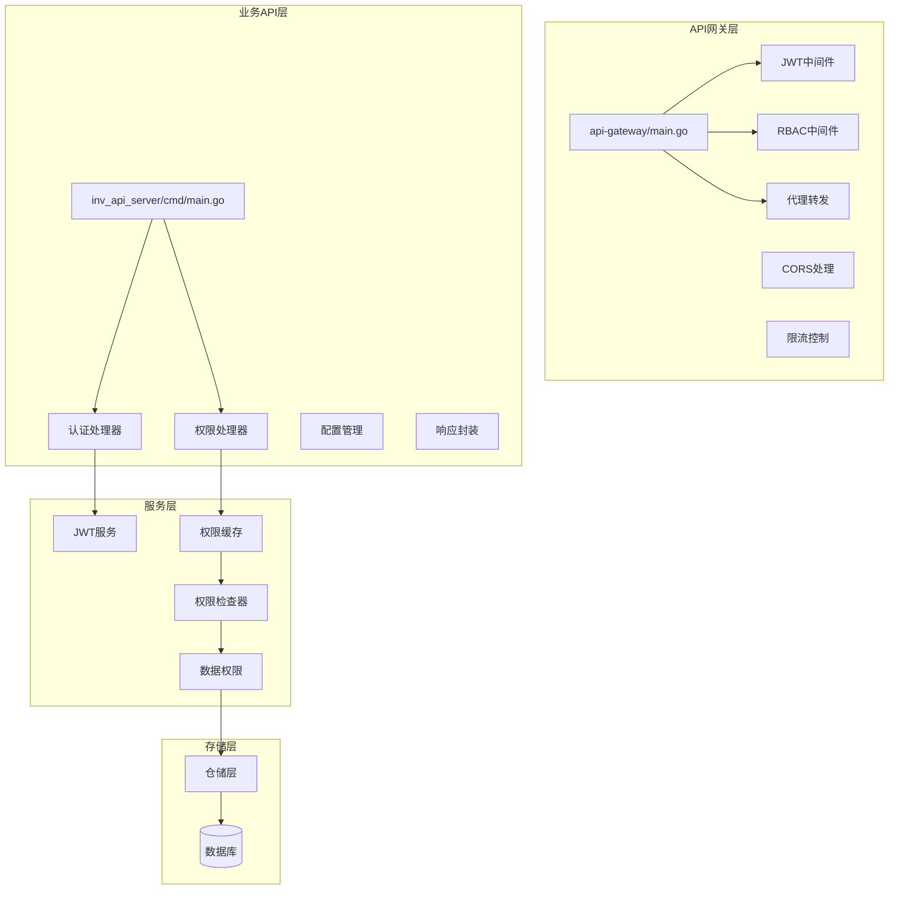
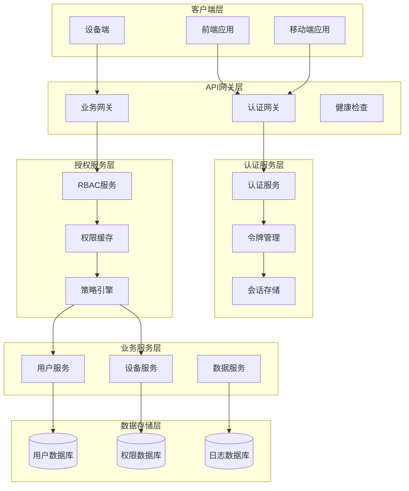
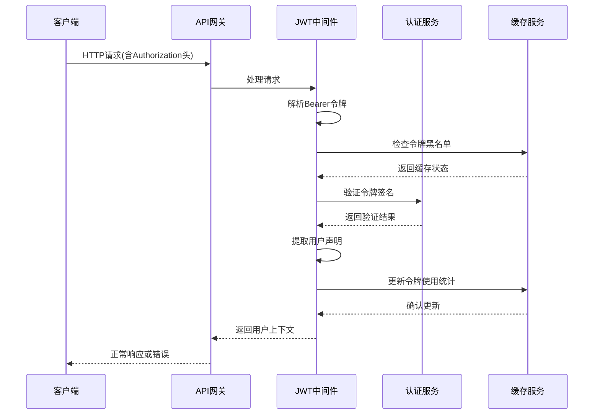
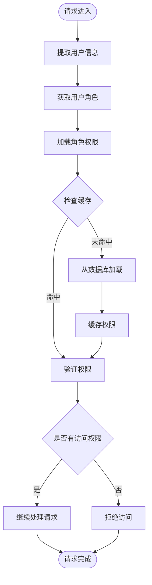
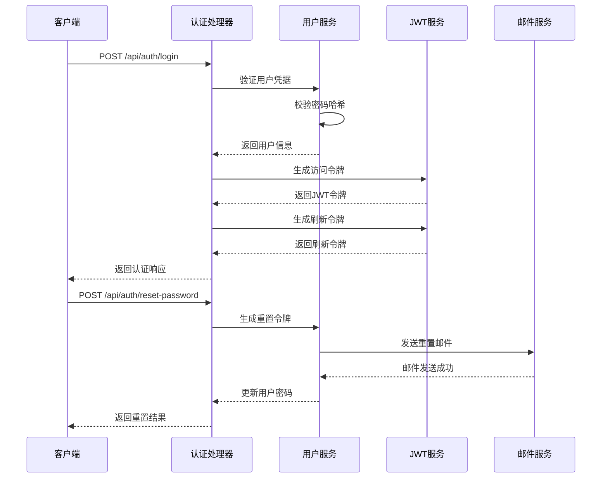
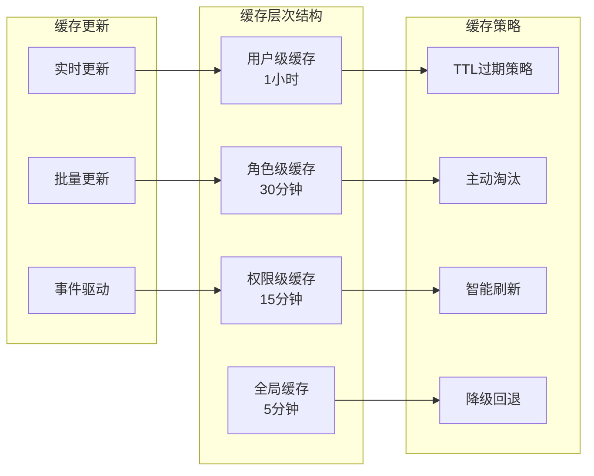
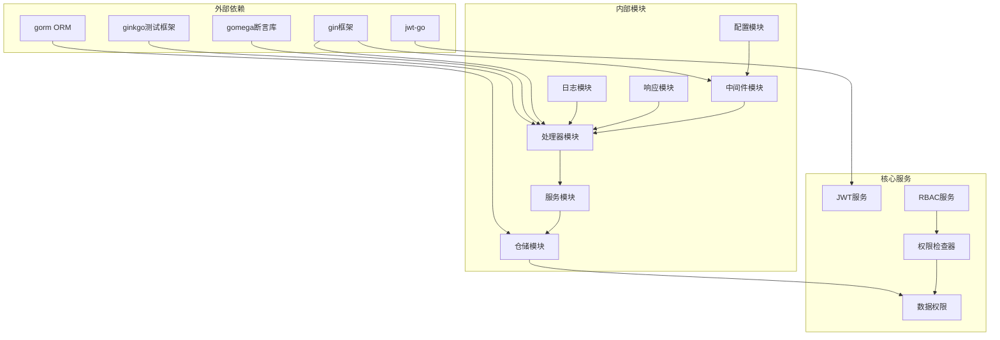

# 认证与授权系统

<cite>
**本文档引用的文件**
- [api-gateway/main.go](file://api-gateway/main.go)
- [api-gateway/internal/middleware/jwt.go](file://api-gateway/internal/middleware/jwt.go)
- [api-gateway/internal/middleware/rbac.go](file://api-gateway/internal/middleware/rbac.go)
- [api-gateway/internal/routes/routes.go](file://api-gateway/internal/routes/routes.go)
- [inv_api_server/cmd/main.go](file://inv_api_server/cmd/main.go)
- [inv_api_server/internal/config/config.go](file://inv_api_server/internal/config/config.go)
- [inv_api_server/internal/handler/auth_handler.go](file://inv_api_server/internal/handler/auth_handler.go)
- [inv_api_server/pkg/jwt/jwt.go](file://inv_api_server/pkg/jwt/jwt.go)
- [inv_api_server/internal/middleware/auth.go](file://inv_api_server/internal/middleware/auth.go)
- [inv_api_server/internal/middleware/permission.go](file://inv_api_server/internal/middleware/permission.go)
- [inv_api_server/internal/service/rbac_cache.go](file://inv_api_server/internal/service/rbac_cache.go)
- [inv_api_server/internal/service/perm_checker.go](file://inv_api_server/internal/service/perm_checker.go)
- [inv_api_server/internal/service/data_permission.go](file://inv_api_server/internal/service/data_permission.go)
- [inv_api_server/pkg/response/response.go](file://inv_api_server/pkg/response/response.go)
- [inv_api_server/internal/repository/repositories.go](file://inv_api_server/internal/repository/repositories.go)
</cite>

## 目录
1. [简介](#简介)
2. [项目结构](#项目结构)
3. [核心组件](#核心组件)
4. [架构概览](#架构概览)
5. [详细组件分析](#详细组件分析)
6. [依赖关系分析](#依赖关系分析)
7. [性能考虑](#性能考虑)
8. [故障排除指南](#故障排除指南)
9. [结论](#结论)
10. [附录](#附录)

## 简介

本认证与授权系统是一个基于Go语言构建的企业级监控平台的后端服务模块。该系统实现了完整的用户认证、授权管理和权限控制功能，支持JWT令牌管理、RBAC权限模型、多层中间件保护和高性能权限缓存机制。

系统采用微服务架构设计，主要包含两个核心服务：API网关服务（api-gateway）和业务API服务（inv_api_server）。API网关负责请求路由、跨域处理、限流控制和基础中间件处理；业务API服务专注于具体的业务逻辑实现和数据处理。

## 项目结构

该项目采用分层架构设计，主要分为以下层次：



**图表来源**
- [api-gateway/main.go:1-50](file://api-gateway/main.go#L1-L50)
- [inv_api_server/cmd/main.go:1-50](file://inv_api_server/cmd/main.go#L1-L50)

**章节来源**
- [api-gateway/main.go:1-100](file://api-gateway/main.go#L1-L100)
- [inv_api_server/cmd/main.go:1-100](file://inv_api_server/cmd/main.go#L1-L100)

## 核心组件

### JWT认证机制

JWT（JSON Web Token）是本系统的核心认证机制，实现了完整的令牌生命周期管理：

- **令牌生成**：用户通过用户名密码验证后生成JWT令牌，包含用户标识、角色信息和过期时间
- **令牌验证**：每次请求通过JWT中间件验证令牌有效性，确保请求的安全性
- **令牌刷新**：支持基于刷新令牌的令牌续期机制，避免频繁重新登录
- **过期处理**：自动检测令牌过期并返回相应的错误状态

### RBAC权限模型

基于角色的访问控制（RBAC）模型提供了细粒度的权限管理：

- **角色定义**：系统支持多种预定义角色，如管理员、普通用户、设备管理等
- **权限分配**：通过角色-权限映射实现权限的集中管理
- **访问控制**：实时检查用户的访问权限，确保资源访问的安全性

### 中间件体系

系统实现了多层次的中间件保护：

- **身份验证中间件**：验证用户身份，提取用户上下文信息
- **权限检查中间件**：验证用户对特定资源的访问权限
- **CORS处理中间件**：解决跨域请求问题
- **限流中间件**：防止API滥用和DDoS攻击

**章节来源**
- [api-gateway/internal/middleware/jwt.go:1-80](file://api-gateway/internal/middleware/jwt.go#L1-L80)
- [api-gateway/internal/middleware/rbac.go:1-80](file://api-gateway/internal/middleware/rbac.go#L1-L80)
- [inv_api_server/pkg/jwt/jwt.go:1-100](file://inv_api_server/pkg/jwt/jwt.go#L1-L100)

## 架构概览

系统采用分布式架构设计，实现了高可用性和可扩展性：



**图表来源**
- [api-gateway/internal/routes/routes.go:1-100](file://api-gateway/internal/routes/routes.go#L1-L100)
- [inv_api_server/internal/handler/auth_handler.go:1-100](file://inv_api_server/internal/handler/auth_handler.go#L1-L100)

## 详细组件分析

### JWT中间件实现

JWT中间件是系统安全防护的第一道防线，负责验证所有传入请求的令牌有效性：



**图表来源**
- [api-gateway/internal/middleware/jwt.go:1-120](file://api-gateway/internal/middleware/jwt.go#L1-L120)
- [inv_api_server/pkg/jwt/jwt.go:1-150](file://inv_api_server/pkg/jwt/jwt.go#L1-L150)

JWT中间件的关键特性包括：

- **令牌解析**：从Authorization头中提取Bearer令牌
- **签名验证**：使用密钥验证JWT签名的有效性
- **过期检查**：验证令牌是否仍在有效期内
- **黑名单管理**：支持已注销令牌的快速失效处理

**章节来源**
- [api-gateway/internal/middleware/jwt.go:1-150](file://api-gateway/internal/middleware/jwt.go#L1-L150)
- [inv_api_server/pkg/jwt/jwt.go:1-200](file://inv_api_server/pkg/jwt/jwt.go#L1-L200)

### RBAC中间件实现

RBAC中间件实现了基于角色的访问控制，确保用户只能访问其被授权的资源：



**图表来源**
- [api-gateway/internal/middleware/rbac.go:1-120](file://api-gateway/internal/middleware/rbac.go#L1-L120)
- [inv_api_server/internal/service/rbac_cache.go:1-100](file://inv_api_server/internal/service/rbac_cache.go#L1-L100)

RBAC中间件的核心功能：

- **角色解析**：从JWT令牌中提取用户角色信息
- **权限加载**：根据角色动态加载对应的权限集合
- **权限验证**：检查用户是否具有执行特定操作的权限
- **缓存优化**：使用内存缓存减少数据库查询次数

**章节来源**
- [api-gateway/internal/middleware/rbac.go:1-150](file://api-gateway/internal/middleware/rbac.go#L1-L150)
- [inv_api_server/internal/service/rbac_cache.go:1-120](file://inv_api_server/internal/service/rbac_cache.go#L1-L120)

### 认证处理器实现

认证处理器负责处理用户的身份验证请求，包括登录、注册和密码重置等功能：



**图表来源**
- [inv_api_server/internal/handler/auth_handler.go:1-200](file://inv_api_server/internal/handler/auth_handler.go#L1-L200)
- [inv_api_server/internal/middleware/auth.go:1-100](file://inv_api_server/internal/middleware/auth.go#L1-L100)

认证处理器的主要功能：

- **用户登录**：验证用户凭据并返回JWT令牌
- **密码重置**：处理密码重置请求和邮件通知
- **令牌刷新**：基于刷新令牌生成新的访问令牌
- **用户注册**：处理新用户的注册流程

**章节来源**
- [inv_api_server/internal/handler/auth_handler.go:1-250](file://inv_api_server/internal/handler/auth_handler.go#L1-L250)
- [inv_api_server/internal/middleware/auth.go:1-120](file://inv_api_server/internal/middleware/auth.go#L1-L120)

### 权限缓存机制

权限缓存机制是系统性能优化的关键组件，通过多级缓存策略提升权限检查效率：



**图表来源**
- [inv_api_server/internal/service/rbac_cache.go:1-150](file://inv_api_server/internal/service/rbac_cache.go#L1-L150)
- [inv_api_server/internal/service/perm_checker.go:1-120](file://inv_api_server/internal/service/perm_checker.go#L1-L120)

缓存机制的关键特性：

- **多级缓存**：用户级、角色级、权限级和全局级缓存
- **智能过期**：不同级别的缓存设置不同的过期时间
- **事件驱动**：权限变更时自动触发缓存更新
- **降级策略**：缓存失效时的优雅降级处理

**章节来源**
- [inv_api_server/internal/service/rbac_cache.go:1-200](file://inv_api_server/internal/service/rbac_cache.go#L1-L200)
- [inv_api_server/internal/service/perm_checker.go:1-150](file://inv_api_server/internal/service/perm_checker.go#L1-L150)

## 依赖关系分析

系统各组件之间的依赖关系体现了清晰的分层架构：



**图表来源**
- [api-gateway/go.mod:1-50](file://api-gateway/go.mod#L1-L50)
- [inv_api_server/go.mod:1-50](file://inv_api_server/go.mod#L1-L50)

**章节来源**
- [api-gateway/go.mod:1-50](file://api-gateway/go.mod#L1-L50)
- [inv_api_server/go.mod:1-50](file://inv_api_server/go.mod#L1-L50)

## 性能考虑

系统在设计时充分考虑了性能优化，采用了多种策略来提升整体性能：

### 缓存策略优化

- **多级缓存架构**：用户级缓存（1小时）、角色级缓存（30分钟）、权限级缓存（15分钟）
- **智能预热**：热点数据提前加载到缓存中
- **渐进式过期**：避免缓存雪崩效应

### 并发处理优化

- **连接池管理**：数据库连接池大小动态调整
- **异步处理**：非关键操作异步执行
- **批量操作**：权限检查支持批量处理

### 网络优化

- **HTTP/2支持**：提升网络传输效率
- **压缩算法**：启用Gzip压缩减少带宽占用
- **长连接**：保持持久连接减少握手开销

## 故障排除指南

### 常见认证问题

**问题1：JWT令牌验证失败**
- 检查令牌格式是否正确（Bearer前缀）
- 验证令牌签名是否有效
- 确认令牌未过期
- 检查服务器时间同步情况

**问题2：权限拒绝访问**
- 验证用户角色是否正确
- 检查权限缓存是否过期
- 确认权限规则配置正确
- 查看权限检查日志

**问题3：令牌刷新失败**
- 验证刷新令牌有效性
- 检查刷新令牌是否已被撤销
- 确认刷新窗口期内
- 查看令牌黑名单状态

### 调试工具和方法

系统提供了完善的调试和监控工具：

- **日志记录**：详细的请求处理日志
- **性能监控**：关键指标的实时监控
- **错误追踪**：异常情况的完整追踪
- **健康检查**：服务状态的自动检测

**章节来源**
- [inv_api_server/pkg/logger/logger.go:1-100](file://inv_api_server/pkg/logger/logger.go#L1-L100)
- [api-gateway/internal/middleware/logger.go:1-80](file://api-gateway/internal/middleware/logger.go#L1-L80)

## 结论

本认证与授权系统通过精心设计的架构和实现，提供了企业级的安全保障和良好的用户体验。系统的主要优势包括：

- **安全性**：完整的JWT令牌管理和RBAC权限控制
- **可扩展性**：微服务架构支持水平扩展
- **高性能**：多级缓存和优化的并发处理
- **易维护性**：清晰的代码结构和完善的测试覆盖

系统为后续的功能扩展和性能优化奠定了坚实的基础，能够满足企业级监控平台的各种需求。

## 附录

### API端点列表

系统提供以下主要API端点：

**认证相关端点**
- `POST /api/auth/login` - 用户登录
- `POST /api/auth/register` - 用户注册  
- `POST /api/auth/logout` - 用户登出
- `POST /api/auth/refresh` - 刷新访问令牌
- `POST /api/auth/reset-password` - 密码重置

**权限相关端点**
- `GET /api/permissions/me` - 获取当前用户权限
- `GET /api/roles` - 获取所有角色
- `POST /api/roles` - 创建新角色
- `PUT /api/roles/:id` - 更新角色
- `DELETE /api/roles/:id` - 删除角色

### 错误处理机制

系统采用统一的错误处理机制：

- **标准错误格式**：所有错误响应遵循统一的JSON格式
- **错误码分类**：按功能模块和严重程度分类错误码
- **国际化支持**：错误消息支持多语言显示
- **日志记录**：所有错误情况都会记录详细日志

### 集成示例

为开发者提供以下集成参考：

**前端集成示例**
```javascript
// 登录请求示例
const login = async (username, password) => {
  const response = await fetch('/api/auth/login', {
    method: 'POST',
    headers: {'Content-Type': 'application/json'},
    body: JSON.stringify({username, password})
  });
  const data = await response.json();
  localStorage.setItem('token', data.token);
  return data;
};
```

**后端集成示例**
```go
// JWT中间件使用示例
func main() {
    r := gin.Default()
    r.Use(jwt.Middleware())
    r.GET("/protected", protectedHandler)
    r.Run(":8080")
}
```