# 设备管理API

<cite>
**本文档引用的文件**
- [device_handler.go](file://inv_api_server/internal/handler/device_handler.go)
- [model_handler.go](file://inv_api_server/internal/handler/model_handler.go)
- [services.go](file://inv_api_server/internal/service/services.go)
- [repositories.go](file://inv_api_server/internal/repository/repositories.go)
- [model_service.go](file://inv_api_server/internal/service/model_service.go)
- [model_repository.go](file://inv_api_server/internal/repository/model_repository.go)
- [device.go](file://inv_device_server/internal/model/device.go)
- [models.go](file://inv_api_server/internal/model/models.go)
- [ws_handler.go](file://inv_api_server/internal/handler/ws_handler.go)
- [auth.go](file://inv_api_server/internal/middleware/auth.go)
- [helpers.go](file://inv_api_server/internal/handler/helpers.go)
- [config.go](file://inv_api_server/internal/config/config.go)
- [main.go](file://inv_api_server/cmd/main.go)
- [schema.sql](file://database/schema.sql)
</cite>

## 目录
1. [项目概述](#项目概述)
2. [系统架构](#系统架构)
3. [核心组件](#核心组件)
4. [设备管理API详解](#设备管理api详解)
5. [设备模型管理](#设备模型管理)
6. [实时监控与数据流](#实时监控与数据流)
7. [权限控制与安全](#权限控制与安全)
8. [错误处理与验证](#错误处理与验证)
9. [性能优化与最佳实践](#性能优化与最佳实践)
10. [前端集成指南](#前端集成指南)
11. [总结](#总结)

## 项目概述

本项目是一个基于Go语言构建的设备管理系统API，主要服务于光伏逆变器设备的远程监控、管理和控制。系统采用微服务架构，通过MQTT协议实现设备与服务器之间的实时通信，结合WebSocket提供实时数据推送功能。

### 核心特性
- **设备全生命周期管理**：从设备注册、绑定到解绑、删除的完整流程
- **实时监控**：通过WebSocket实现实时数据推送
- **历史数据分析**：支持多种时间粒度的历史数据查询
- **设备模型管理**：灵活的设备类型定义和字段配置
- **权限控制**：基于角色的访问控制和数据隔离
- **告警管理**：完整的告警检测、通知和处理机制

## 系统架构

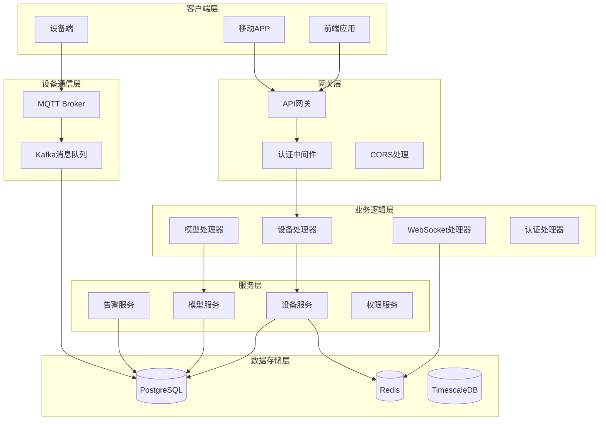

**图表来源**
- [main.go:344-576](file://inv_api_server/cmd/main.go#L344-L576)
- [device_handler.go:1-832](file://inv_api_server/internal/handler/device_handler.go#L1-L832)

## 核心组件

### 设备管理核心组件

```mermaid
classDiagram
class DeviceHandler {
+List(c *gin.Context)
+GetDetail(c *gin.Context)
+GetRealtimeData(c *gin.Context)
+Bind(c *gin.Context)
+Unbind(c *gin.Context)
+Control(c *gin.Context)
+GetHistory(c *gin.Context)
+GetStatistics(c *gin.Context)
}
class DeviceService {
+GetBySN(ctx, sn) Device
+GetRealtimeData(ctx, sn) map[string]interface{}
+EnsureDevice(ctx, sn) error
+Bind(ctx, sn, userID, stationID) error
+Unbind(ctx, sn) error
+ValidateControlCommand(ctx, sn, command) error
+SendCommand(ctx, sn, cmdType, params) error
}
class DeviceRepository {
+GetBySN(ctx, sn) Device
+GetRealtimeData(ctx, sn) map[string]interface{}
+EnsureDevice(ctx, sn) error
+Bind(ctx, sn, userID, stationID) error
+Unbind(ctx, sn) error
}
class Device {
+int64 id
+string sn
+string model
+float64 rated_power
+int status
+time.Time last_online_at
}
DeviceHandler --> DeviceService : "依赖"
DeviceService --> DeviceRepository : "使用"
DeviceRepository --> Device : "操作"
```

**图表来源**
- [device_handler.go:20-31](file://inv_api_server/internal/handler/device_handler.go#L20-L31)
- [services.go:302-327](file://inv_api_server/internal/service/services.go#L302-L327)
- [repositories.go:796-800](file://inv_api_server/internal/repository/repositories.go#L796-L800)
- [models.go:43-66](file://inv_api_server/internal/model/models.go#L43-L66)

### 权限控制架构

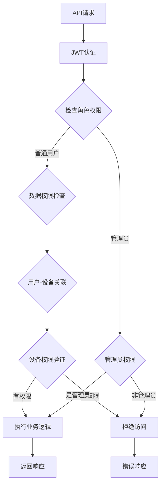

**图表来源**
- [auth.go:15-56](file://inv_api_server/internal/middleware/auth.go#L15-L56)
- [services.go:385-391](file://inv_api_server/internal/service/services.go#L385-L391)

**章节来源**
- [device_handler.go:20-31](file://inv_api_server/internal/handler/device_handler.go#L20-L31)
- [services.go:302-327](file://inv_api_server/internal/service/services.go#L302-L327)
- [auth.go:15-56](file://inv_api_server/internal/middleware/auth.go#L15-L56)

## 设备管理API详解

### 设备注册与发现

设备注册流程通过自动发现机制实现，当设备首次连接时系统会自动创建设备记录：

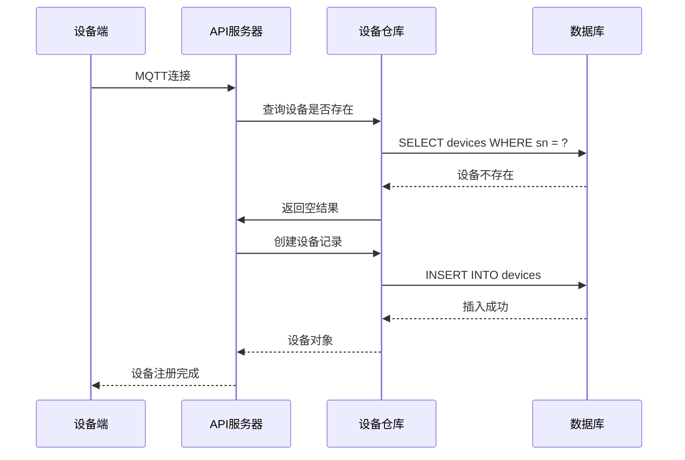

**图表来源**
- [device_handler.go:297-318](file://inv_api_server/internal/handler/device_handler.go#L297-L318)
- [services.go:369-371](file://inv_api_server/internal/service/services.go#L369-L371)

### 设备绑定与解绑流程

设备绑定流程确保设备与用户之间的正确关联：

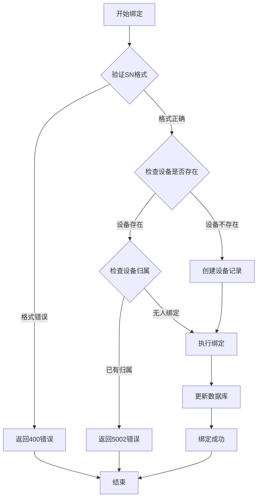

**图表来源**
- [device_handler.go:288-335](file://inv_api_server/internal/handler/device_handler.go#L288-L335)
- [services.go:373-375](file://inv_api_server/internal/service/services.go#L373-L375)

### 设备控制命令系统

系统支持基于设备模型的动态控制命令验证：

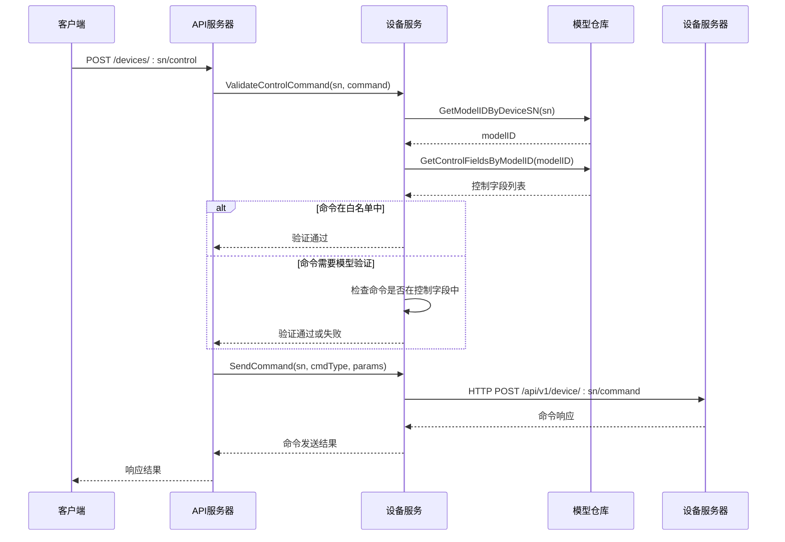

**图表来源**
- [device_handler.go:372-402](file://inv_api_server/internal/handler/device_handler.go#L372-L402)
- [services.go:403-438](file://inv_api_server/internal/service/services.go#L403-L438)
- [services.go:480-526](file://inv_api_server/internal/service/services.go#L480-L526)

**章节来源**
- [device_handler.go:288-335](file://inv_api_server/internal/handler/device_handler.go#L288-L335)
- [device_handler.go:372-402](file://inv_api_server/internal/handler/device_handler.go#L372-L402)
- [services.go:369-375](file://inv_api_server/internal/service/services.go#L369-L375)

## 设备模型管理

### 设备模型架构

设备模型系统提供了灵活的设备类型定义和字段配置能力：

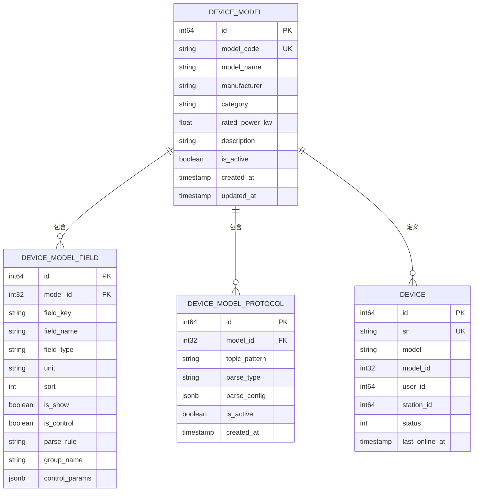

**图表来源**
- [models.go:223-261](file://inv_api_server/internal/model/models.go#L223-L261)
- [model_repository.go:20-45](file://inv_api_server/internal/repository/model_repository.go#L20-L45)

### 动态字段配置

系统支持基于模型的动态字段配置，实现设备参数的灵活管理：

| 字段类型 | 描述 | 示例 |
|---------|------|------|
| string | 文本字段 | "设备名称" |
| number | 数字字段 | 100.5 |
| boolean | 布尔字段 | true/false |
| select | 下拉选择 | ["选项1","选项2"] |
| array | 数组字段 | [1,2,3] |

**章节来源**
- [model_handler.go:13-28](file://inv_api_server/internal/handler/model_handler.go#L13-L28)
- [model_service.go:19-34](file://inv_api_server/internal/service/model_service.go#L19-L34)
- [model_repository.go:117-143](file://inv_api_server/internal/repository/model_repository.go#L117-L143)

## 实时监控与数据流

### WebSocket实时数据推送

系统通过WebSocket提供实时数据推送功能：

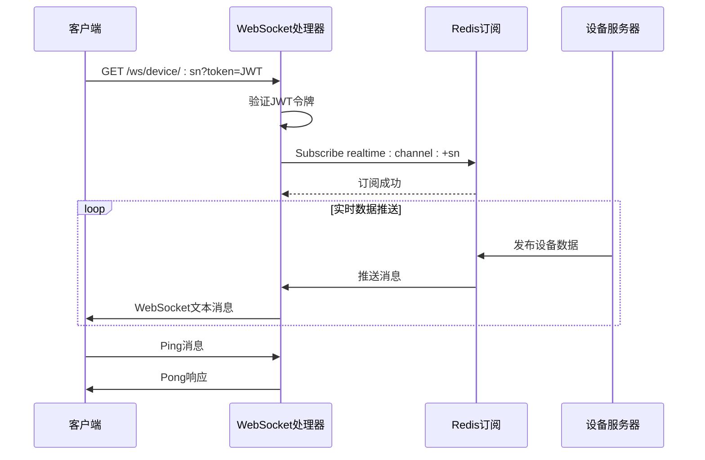

**图表来源**
- [ws_handler.go:39-122](file://inv_api_server/internal/handler/ws_handler.go#L39-L122)

### 设备状态管理

系统维护设备的实时状态并通过多种渠道同步：

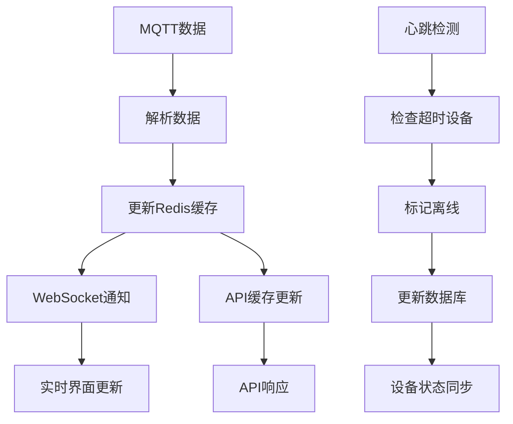

**图表来源**
- [main.go:165-183](file://inv_api_server/cmd/main.go#L165-L183)
- [repositories.go:796-800](file://inv_api_server/internal/repository/repositories.go#L796-L800)

**章节来源**
- [ws_handler.go:39-122](file://inv_api_server/internal/handler/ws_handler.go#L39-L122)
- [main.go:165-183](file://inv_api_server/cmd/main.go#L165-L183)

## 权限控制与安全

### 认证与授权机制

系统采用JWT令牌进行身份认证，并结合RBAC实现细粒度的权限控制：

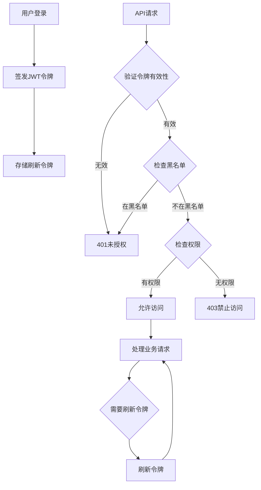

**图表来源**
- [auth.go:15-56](file://inv_api_server/internal/middleware/auth.go#L15-L56)
- [services.go:85-107](file://inv_api_server/internal/service/services.go#L85-L107)

### 数据隔离策略

系统通过用户-设备关联实现数据隔离：

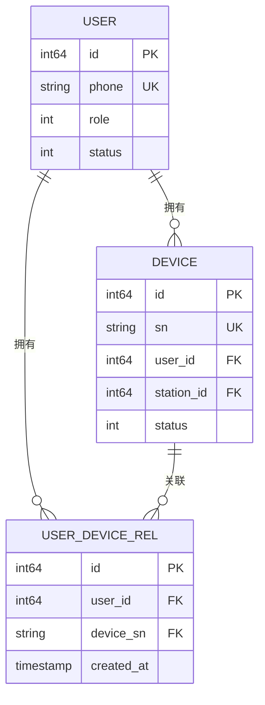

**图表来源**
- [model_repository.go:325-342](file://inv_api_server/internal/repository/model_repository.go#L325-L342)

**章节来源**
- [auth.go:15-56](file://inv_api_server/internal/middleware/auth.go#L15-L56)
- [services.go:85-107](file://inv_api_server/internal/service/services.go#L85-L107)
- [model_repository.go:325-342](file://inv_api_server/internal/repository/model_repository.go#L325-L342)

## 错误处理与验证

### 请求参数验证

系统采用结构化的请求体验证机制：

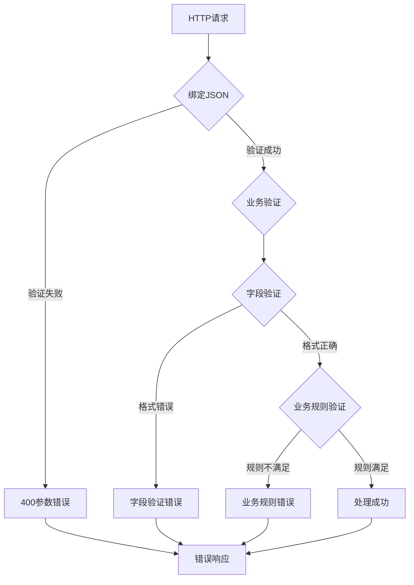

**图表来源**
- [device_handler.go:291-295](file://inv_api_server/internal/handler/device_handler.go#L291-L295)
- [helpers.go:25-47](file://inv_api_server/internal/handler/helpers.go#L25-L47)

### 错误响应标准化

系统提供统一的错误响应格式：

| 错误码 | 含义 | 响应内容 |
|--------|------|----------|
| 200 | 成功 | {"code":0,"message":"success","data":{}} |
| 400 | 参数错误 | {"code":-1,"message":"参数错误","data":null} |
| 401 | 未授权 | {"code":401,"message":"未授权","data":null} |
| 403 | 权限不足 | {"code":403,"message":"权限不足","data":null} |
| 429 | 请求过于频繁 | {"code":429,"message":"请求过于频繁","data":null} |
| 500 | 系统错误 | {"code":500,"message":"系统错误","data":null} |

**章节来源**
- [device_handler.go:291-295](file://inv_api_server/internal/handler/device_handler.go#L291-L295)
- [helpers.go:25-47](file://inv_api_server/internal/handler/helpers.go#L25-L47)

## 性能优化与最佳实践

### 缓存策略

系统采用多层缓存机制提升性能：

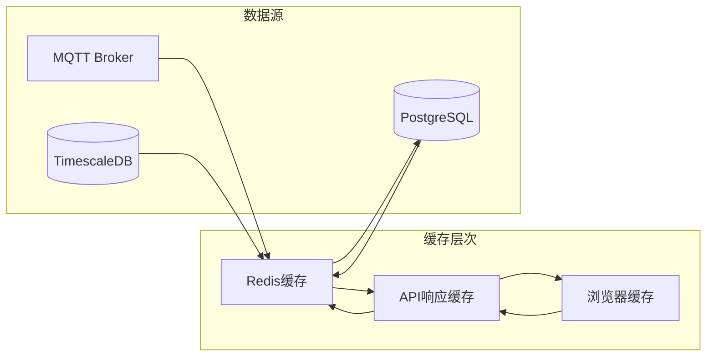

### 性能监控指标

系统监控的关键性能指标包括：

- **响应时间**：API请求平均响应时间 < 100ms
- **并发处理**：支持1000+并发连接
- **内存使用**：Redis内存使用率 < 80%
- **数据库连接**：PG连接池利用率 < 70%

**章节来源**
- [config.go:58-63](file://inv_api_server/internal/config/config.go#L58-L63)
- [main.go:299-322](file://inv_api_server/cmd/main.go#L299-L322)

## 前端集成指南

### API调用示例

#### 设备列表查询
```javascript
// GET /api/v1/devices?page=1&pageSize=20&station_id=123&status=1
const response = await fetch('/api/v1/devices', {
  method: 'GET',
  headers: {
    'Authorization': 'Bearer ' + accessToken,
    'Content-Type': 'application/json'
  },
  query: {
    page: 1,
    pageSize: 20,
    station_id: 123,
    status: 1
  }
})
```

#### 设备绑定
```javascript
// POST /api/v1/devices/bind
const response = await fetch('/api/v1/devices/bind', {
  method: 'POST',
  headers: {
    'Authorization': 'Bearer ' + accessToken,
    'Content-Type': 'application/json'
  },
  body: JSON.stringify({
    sn: 'ABC123DEF456',
    station_id: 123
  })
})
```

#### 实时数据订阅
```javascript
// WebSocket连接
const ws = new WebSocket(
  `ws://localhost:8080/ws/device/${deviceSN}?token=${accessToken}`
)

ws.onmessage = function(event) {
  const data = JSON.parse(event.data)
  updateRealtimeDisplay(data)
}

ws.onclose = function() {
  // 重新连接逻辑
  setTimeout(connectWebSocket, 3000)
}
```

### 最佳实践建议

1. **错误处理**：始终检查API响应状态，实现重试机制
2. **缓存策略**：合理使用本地缓存减少重复请求
3. **连接管理**：WebSocket连接断开后实现自动重连
4. **权限验证**：在每次请求前验证JWT令牌有效性
5. **性能优化**：批量请求减少网络开销

**章节来源**
- [main.go:428-449](file://inv_api_server/cmd/main.go#L428-L449)
- [ws_handler.go:39-122](file://inv_api_server/internal/handler/ws_handler.go#L39-L122)

## 总结

本设备管理API系统提供了完整的设备生命周期管理功能，具有以下特点：

### 核心优势
- **完整的设备管理**：从注册到删除的全流程支持
- **实时监控能力**：通过WebSocket提供实时数据推送
- **灵活的模型系统**：支持动态设备类型和字段配置
- **强大的权限控制**：基于JWT和RBAC的多层次安全机制
- **高性能架构**：多层缓存和优化的数据处理流程

### 技术亮点
- **微服务架构**：清晰的职责分离和模块化设计
- **异步处理**：基于消息队列的异步数据处理
- **实时通信**：WebSocket + Redis的实时推送机制
- **数据一致性**：事务处理和数据同步保证
- **可观测性**：完善的日志记录和监控指标

### 适用场景
该系统适用于分布式能源管理、智能设备监控、工业物联网等场景，能够有效支撑大规模设备的远程管理和控制需求。