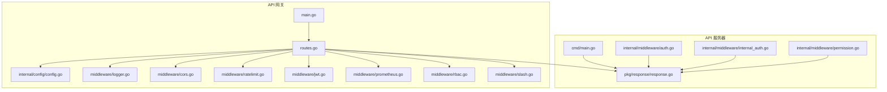
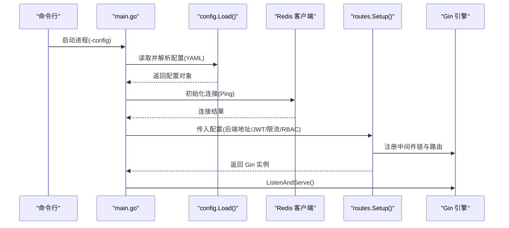
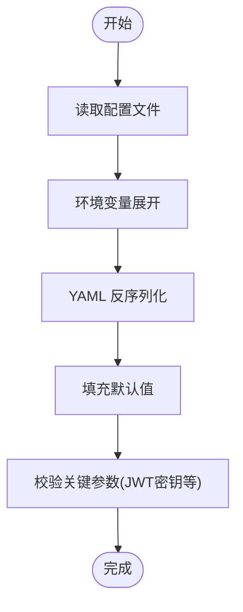
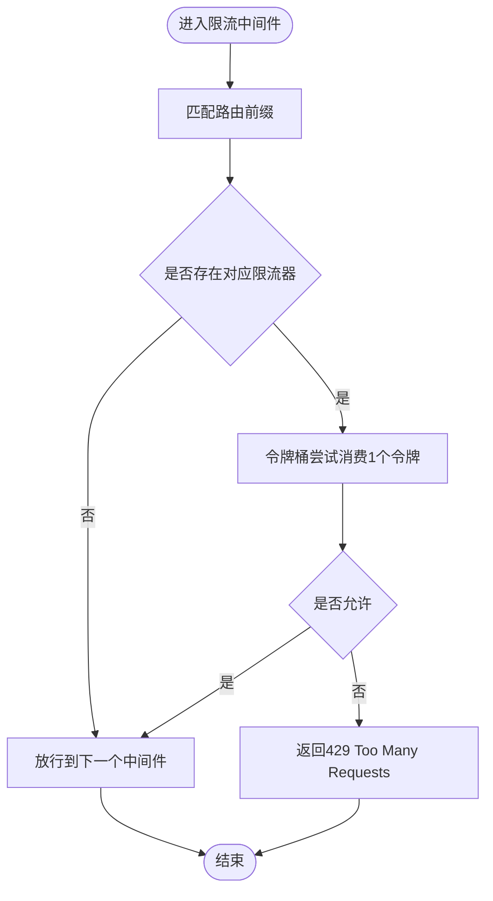
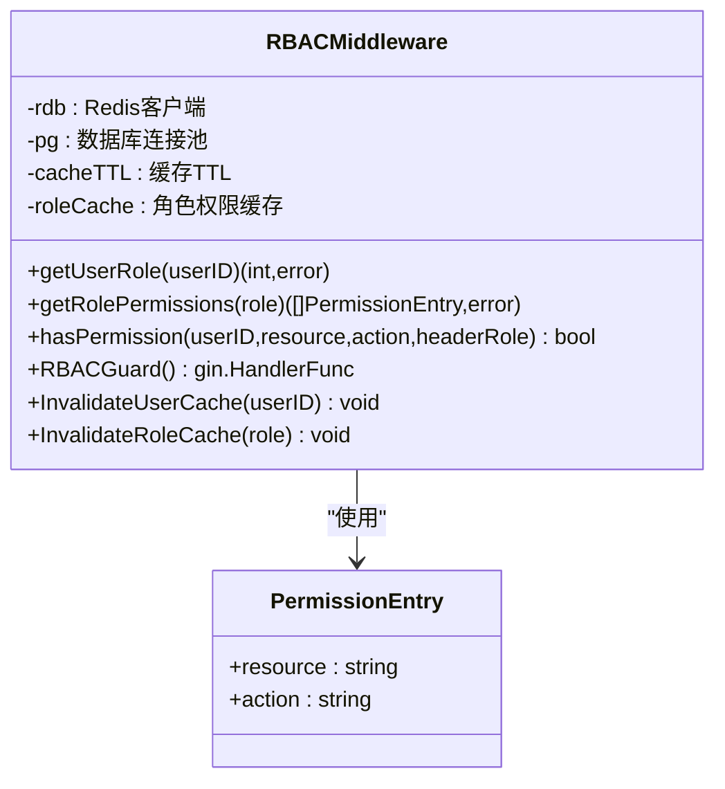
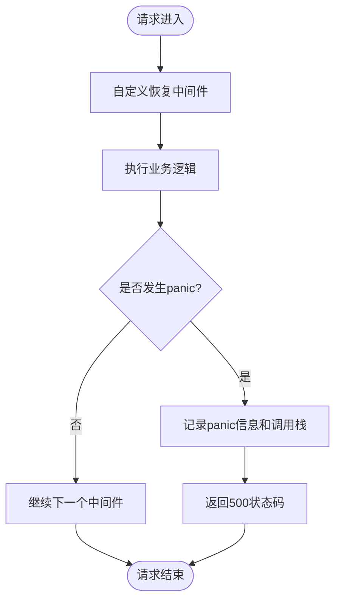
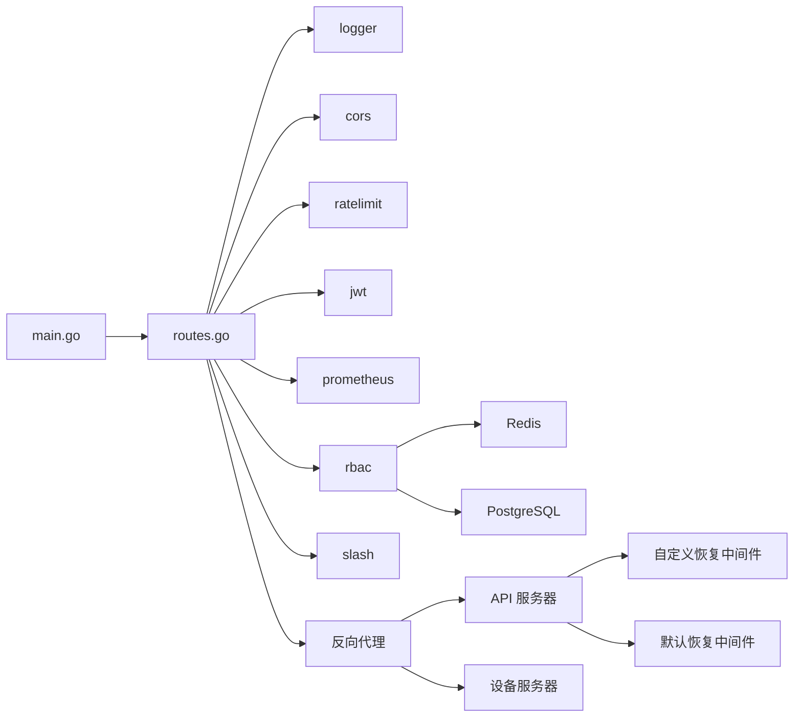

# 配置与中间件

<cite>
**本文引用的文件**
- [api-gateway 内部配置 config.go](file://api-gateway/internal/config/config.go)
- [api-gateway 配置示例 config.docker.yaml](file://api-gateway/config.docker.yaml)
- [api-gateway 中间件：日志 logger.go](file://api-gateway/internal/middleware/logger.go)
- [api-gateway 中间件：CORS cors.go](file://api-gateway/internal/middleware/cors.go)
- [api-gateway 中间件：限流 ratelimit.go](file://api-gateway/internal/middleware/ratelimit.go)
- [api-gateway 中间件：JWT 认证 jwt.go](file://api-gateway/internal/middleware/jwt.go)
- [api-gateway 中间件：Prometheus 指标 prometheus.go](file://api-gateway/internal/middleware/prometheus.go)
- [api-gateway 中间件：RBAC 权限 rbac.go](file://api-gateway/internal/middleware/rbac.go)
- [api-gateway 中间件：尾斜杠处理 slash.go](file://api-gateway/internal/middleware/slash.go)
- [api-gateway 入口 main.go](file://api-gateway/main.go)
- [api-gateway 路由 routes.go](file://api-gateway/internal/routes/routes.go)
- [api-gateway 配置单元测试 config_test.go](file://api-gateway/internal/config/config_test.go)
- [api-server 统一响应 response.go](file://inv_api_server/pkg/response/response.go)
- [api-server 中间件：鉴权 auth.go](file://inv_api_server/internal/middleware/auth.go)
- [api-server 中间件：内部认证 internal_auth.go](file://inv_api_server/internal/middleware/internal_auth.go)
- [api-server 自定义恢复中间件 customRecovery.go](file://inv_api_server/cmd/main.go)
</cite>

## 目录
1. [简介](#简介)
2. [项目结构](#项目结构)
3. [核心组件](#核心组件)
4. [架构总览](#架构总览)
5. [详细组件分析](#详细组件分析)
6. [依赖分析](#依赖分析)
7. [性能考量](#性能考量)
8. [故障排查指南](#故障排查指南)
9. [结论](#结论)
10. [附录](#附录)

## 简介
本文件聚焦于配置与中间件系统，覆盖以下主题：
- 应用配置管理：环境变量加载、配置文件解析、默认值回退、运行时配置更新建议
- 中间件体系：日志记录、错误处理、请求限流、CORS、JWT 认证、RBAC 权限控制、Prometheus 指标采集
- 内部服务认证：基于密钥的微服务间安全通信
- 统一响应格式：成功/错误/分页响应的标准化设计
- 日志系统：日志级别、输出格式与性能影响
- **自定义恢复中间件**：增强的panic处理和调试信息输出
- 最佳实践、安全注意事项与故障排查
- 扩展与自定义中间件的实现指南

## 项目结构
本仓库包含多个子系统，其中与"配置与中间件"直接相关的核心模块如下：
- API 网关（Go）：负责路由、代理、中间件编排与指标导出
- API 服务器（Go）：后端业务服务，提供统一响应与内部认证
- 设备服务器（Go）：设备侧数据接入与协议适配
- 前端（React/Vite）：用户界面
- 部署与脚本：Kubernetes、Docker Compose、备份与维护脚本

**图表来源**
- [api-gateway/main.go:1-129](file://api-gateway/main.go#L1-L129)
- [api-gateway/internal/routes/routes.go:1-195](file://api-gateway/internal/routes/routes.go#L1-L195)
- [api-gateway/internal/config/config.go:1-87](file://api-gateway/internal/config/config.go#L1-L87)
- [api-gateway/internal/middleware/logger.go:1-31](file://api-gateway/internal/middleware/logger.go#L1-L31)
- [api-gateway/internal/middleware/cors.go:1-26](file://api-gateway/internal/middleware/cors.go#L1-L26)
- [api-gateway/internal/middleware/ratelimit.go:1-94](file://api-gateway/internal/middleware/ratelimit.go#L1-L94)
- [api-gateway/internal/middleware/jwt.go:1-122](file://api-gateway/internal/middleware/jwt.go#L1-L122)
- [api-gateway/internal/middleware/prometheus.go:1-66](file://api-gateway/internal/middleware/prometheus.go#L1-L66)
- [api-gateway/internal/middleware/rbac.go:1-285](file://api-gateway/internal/middleware/rbac.go#L1-L285)
- [api-gateway/internal/middleware/slash.go:1-18](file://api-gateway/internal/middleware/slash.go#L1-L18)
- [inv_api_server/cmd/main.go:717-728](file://inv_api_server/cmd/main.go#L717-L728)
- [inv_api_server/pkg/response/response.go:1-92](file://inv_api_server/pkg/response/response.go#L1-L92)
- [inv_api_server/internal/middleware/auth.go:1-255](file://inv_api_server/internal/middleware/auth.go#L1-L255)
- [inv_api_server/internal/middleware/internal_auth.go:1-36](file://inv_api_server/internal/middleware/internal_auth.go#L1-L36)
- [inv_api_server/internal/middleware/permission.go:1-89](file://inv_api_server/internal/middleware/permission.go#L1-L89)

**章节来源**
- [api-gateway/main.go:1-129](file://api-gateway/main.go#L1-L129)
- [api-gateway/internal/routes/routes.go:1-195](file://api-gateway/internal/routes/routes.go#L1-L195)

## 核心组件
- 配置加载与默认值：支持 YAML 文件与环境变量展开，提供默认值回退，便于容器化部署
- 中间件链：按序组合日志、CORS、限流、JWT、RBAC、Prometheus 等
- 统一响应：标准 JSON 结构，包含 code、message、data/page
- 内部认证：基于环境变量生成或配置的密钥，保障微服务间调用安全
- RBAC：结合 Redis 缓存与数据库查询，支持角色与权限映射
- **自定义恢复中间件**：增强的panic捕获和调试栈输出，替代默认 gin.Recovery()

**章节来源**
- [api-gateway/internal/config/config.go:57-87](file://api-gateway/internal/config/config.go#L57-L87)
- [api-gateway/internal/config/config_test.go:1-98](file://api-gateway/internal/config/config_test.go#L1-L98)
- [api-gateway/internal/middleware/logger.go:10-30](file://api-gateway/internal/middleware/logger.go#L10-L30)
- [api-gateway/internal/middleware/cors.go:9-25](file://api-gateway/internal/middleware/cors.go#L9-L25)
- [api-gateway/internal/middleware/ratelimit.go:48-93](file://api-gateway/internal/middleware/ratelimit.go#L48-L93)
- [api-gateway/internal/middleware/jwt.go:44-121](file://api-gateway/internal/middleware/jwt.go#L44-L121)
- [api-gateway/internal/middleware/prometheus.go:42-65](file://api-gateway/internal/middleware/prometheus.go#L42-L65)
- [api-gateway/internal/middleware/rbac.go:32-176](file://api-gateway/internal/middleware/rbac.go#L32-L176)
- [inv_api_server/pkg/response/response.go:9-92](file://inv_api_server/pkg/response/response.go#L9-L92)
- [inv_api_server/internal/middleware/internal_auth.go:14-36](file://inv_api_server/internal/middleware/internal_auth.go#L14-L36)
- [inv_api_server/cmd/main.go:717-728](file://inv_api_server/cmd/main.go#L717-L728)

## 架构总览
下图展示 API 网关启动流程、中间件装配与路由注册的整体视图。

**图表来源**
- [api-gateway/main.go:21-94](file://api-gateway/main.go#L21-L94)
- [api-gateway/internal/config/config.go:57-87](file://api-gateway/internal/config/config.go#L57-L87)
- [api-gateway/internal/routes/routes.go:25-55](file://api-gateway/internal/routes/routes.go#L25-L55)

## 详细组件分析

### 配置管理
- 文件加载与环境变量展开：读取 YAML，对占位符进行环境变量替换，再反序列化为结构体
- 默认值回退：未在配置中指定的字段采用硬编码默认值，保证最小可用配置
- 运行时更新建议：当前实现为一次性加载；如需热更新，可引入配置中心或文件变更监听，结合原子交换或重启策略

**图表来源**
- [api-gateway/internal/config/config.go:57-87](file://api-gateway/internal/config/config.go#L57-L87)
- [api-gateway/internal/config/config_test.go:9-98](file://api-gateway/internal/config/config_test.go#L9-L98)

**章节来源**
- [api-gateway/internal/config/config.go:57-87](file://api-gateway/internal/config/config.go#L57-L87)
- [api-gateway/internal/config/config_test.go:1-98](file://api-gateway/internal/config/config_test.go#L1-L98)
- [api-gateway/config.docker.yaml:1-39](file://api-gateway/config.docker.yaml#L1-L39)

### 中间件：日志记录
- 功能：记录请求路径、方法、耗时、状态码、客户端 IP
- 输出：标准日志格式，便于集中收集与检索
- 性能：仅在请求完成后打印，开销极低

**章节来源**
- [api-gateway/internal/middleware/logger.go:10-30](file://api-gateway/internal/middleware/logger.go#L10-L30)

### 中间件：CORS
- 功能：允许跨域请求，支持常见方法与头部，预检请求快速返回
- 配置：可通过网关配置或独立中间件参数化（API 服务器内置更严格的白名单）

**章节来源**
- [api-gateway/internal/middleware/cors.go:9-25](file://api-gateway/internal/middleware/cors.go#L9-L25)
- [inv_api_server/internal/middleware/auth.go:132-156](file://inv_api_server/internal/middleware/auth.go#L132-L156)

### 中间件：请求限流
- 全局限流：令牌桶算法，全局速率与突发
- 路由级限流：按路径前缀匹配，分别配置不同速率
- 错误响应：统一返回状态码与消息

**图表来源**
- [api-gateway/internal/middleware/ratelimit.go:70-93](file://api-gateway/internal/middleware/ratelimit.go#L70-L93)

**章节来源**
- [api-gateway/internal/middleware/ratelimit.go:48-93](file://api-gateway/internal/middleware/ratelimit.go#L48-L93)

### 中间件：JWT 认证
- 白名单：健康检查、公开接口、静态资源等无需认证
- 格式校验：Authorization 头必须为 Bearer Token
- 解析与验证：HS256 签名，提取用户信息并注入到请求头
- 日志：调试仪器输出，便于追踪认证过程

**章节来源**
- [api-gateway/internal/middleware/jwt.go:44-121](file://api-gateway/internal/middleware/jwt.go#L44-L121)

### 中间件：RBAC 权限控制
- 角色与权限：支持从 Redis 缓存或数据库查询
- 缓存策略：角色与权限分别缓存，带 TTL；并发读写锁保护
- 资源映射：根据路径前缀映射到资源类型，方法映射到动作
- 降级策略：Redis 不可用时可仅做角色判定

**图表来源**
- [api-gateway/internal/middleware/rbac.go:24-176](file://api-gateway/internal/middleware/rbac.go#L24-L176)

**章节来源**
- [api-gateway/internal/middleware/rbac.go:32-176](file://api-gateway/internal/middleware/rbac.go#L32-L176)

### 中间件：Prometheus 指标
- 指标类型：总请求数、请求耗时直方图、飞行中请求数
- 标签维度：HTTP 方法、路径、状态码
- 特殊处理：/metrics 路径不计入指标

**章节来源**
- [api-gateway/internal/middleware/prometheus.go:17-65](file://api-gateway/internal/middleware/prometheus.go#L17-L65)

### 自定义恢复中间件
- **功能**：替代默认 gin.Recovery()，提供增强的panic捕获和调试信息
- **增强特性**：输出完整的调用栈信息到标准错误，便于问题诊断
- **处理机制**：捕获panic后，打印请求方法、URL和调用栈，然后返回500状态码
- **使用位置**：API服务器在完整模式下使用自定义恢复中间件，在简化模式下仍使用默认 gin.Recovery()

**图表来源**
- [inv_api_server/cmd/main.go:717-728](file://inv_api_server/cmd/main.go#L717-L728)

**章节来源**
- [inv_api_server/cmd/main.go:717-728](file://inv_api_server/cmd/main.go#L717-L728)

### 统一响应格式
- 成功响应：code=0，message="success"，可携带 data
- 错误响应：按 HTTP 状态或业务 code 返回
- 分页响应：封装 items/total/page/page_size
- API 服务器与网关均采用一致结构，便于前端统一处理

**章节来源**
- [inv_api_server/pkg/response/response.go:9-92](file://inv_api_server/pkg/response/response.go#L9-L92)

### 内部服务认证
- 密钥来源：优先使用环境变量；若未配置则随机生成并警告
- 校验方式：请求头 X-Internal-Key 必须匹配
- 适用场景：网关与后端服务之间的内部调用

**章节来源**
- [inv_api_server/internal/middleware/internal_auth.go:14-36](file://inv_api_server/internal/middleware/internal_auth.go#L14-L36)

### 路由与代理
- 网关路由：健康检查、指标、API 文档、代理转发
- 代理策略：将 /api/v1/* 请求转发至后端 API 服务器，部分路径重写
- 尾斜杠处理：自动去除尾部斜杠，避免重复路由

**章节来源**
- [api-gateway/internal/routes/routes.go:25-125](file://api-gateway/internal/routes/routes.go#L25-L125)
- [api-gateway/internal/middleware/slash.go:9-17](file://api-gateway/internal/middleware/slash.go#L9-L17)

## 依赖分析
- 组件耦合
  - 网关主程序依赖配置与路由模块，路由模块依赖各中间件
  - RBAC 中间件依赖 Redis 与数据库，具备降级能力
  - API 服务器中间件依赖 JWT 服务与响应模块
  - **API服务器在完整模式下使用自定义恢复中间件，简化模式下使用默认恢复机制**
- 外部依赖
  - Gin：Web 框架与路由
  - Prometheus：指标导出
  - Redis：缓存与会话存储
  - JWT：令牌解析与校验

**图表来源**
- [api-gateway/main.go:1-129](file://api-gateway/main.go#L1-L129)
- [api-gateway/internal/routes/routes.go:1-195](file://api-gateway/internal/routes/routes.go#L1-L195)
- [api-gateway/internal/middleware/rbac.go:1-176](file://api-gateway/internal/middleware/rbac.go#L1-L176)
- [inv_api_server/cmd/main.go:717-728](file://inv_api_server/cmd/main.go#L717-L728)

**章节来源**
- [api-gateway/main.go:1-129](file://api-gateway/main.go#L1-L129)
- [api-gateway/internal/routes/routes.go:1-195](file://api-gateway/internal/routes/routes.go#L1-L195)

## 性能考量
- 中间件顺序：日志、CORS、限流、JWT、RBAC、Prometheus 的顺序影响整体延迟
- 限流策略：全局与路由级限流叠加，注意突发流量峰值
- RBAC 缓存：合理设置 TTL，平衡一致性与性能
- 日志：生产环境建议调整日志级别，避免高频写入影响 I/O
- 指标：直方图桶分布可根据实际延迟特征优化
- **自定义恢复中间件**：仅在panic发生时产生额外开销，正常情况下无性能影响

[本节为通用指导，无需具体文件引用]

## 故障排查指南
- 配置问题
  - 确认配置文件路径与权限；检查环境变量是否正确展开
  - 关键参数缺失（如 JWT Secret）会导致启动失败
- 认证失败
  - 检查 Authorization 头格式与签名算法
  - 核对 JWT Claims 是否包含必要字段
- 权限不足
  - 确认用户角色与资源动作映射
  - 清理 Redis 缓存或等待 TTL 过期
- 限流触发
  - 检查全局与路由级限流配置
  - 区分来源 IP 与路径前缀
- 内部认证
  - 确认 X-Internal-Key 与环境变量一致
  - 若未配置，系统会生成随机密钥并发出警告
- **panic与恢复**
  - **检查标准错误输出中的panic信息和调用栈**
  - **确认自定义恢复中间件已正确注册**
  - **在简化模式下，确认使用默认恢复机制**

**章节来源**
- [api-gateway/internal/config/config.go:57-87](file://api-gateway/internal/config/config.go#L57-L87)
- [api-gateway/internal/middleware/jwt.go:44-121](file://api-gateway/internal/middleware/jwt.go#L44-L121)
- [api-gateway/internal/middleware/rbac.go:190-239](file://api-gateway/internal/middleware/rbac.go#L190-L239)
- [inv_api_server/internal/middleware/internal_auth.go:14-36](file://inv_api_server/internal/middleware/internal_auth.go#L14-L36)
- [inv_api_server/cmd/main.go:717-728](file://inv_api_server/cmd/main.go#L717-L728)

## 结论
本配置与中间件体系以"可配置、可扩展、可观测"为目标，提供了完善的认证、授权、限流与可观测性能力。通过合理的中间件顺序与缓存策略，可在保证安全性的同时兼顾性能。**新增的自定义恢复中间件显著提升了panic处理能力，为生产环境的稳定运行提供了更好的保障。**建议在生产环境中强化密钥管理、完善监控告警，并持续评估限流与缓存策略的合理性。

[本节为总结性内容，无需具体文件引用]

## 附录

### 配置最佳实践
- 使用环境变量覆盖敏感配置（如 JWT Secret、数据库凭据）
- 在容器编排中通过 ConfigMap/Secret 注入配置
- 对关键参数增加启动时校验与日志提示
- 为不同环境准备独立配置文件，避免硬编码

**章节来源**
- [api-gateway/config.docker.yaml:1-39](file://api-gateway/config.docker.yaml#L1-L39)
- [api-gateway/internal/config/config.go:57-87](file://api-gateway/internal/config/config.go#L57-L87)

### 安全注意事项
- JWT 密钥必须足够随机且保密，禁止明文或默认值上线
- RBAC 缓存仅用于加速，权限判定应以数据库为准
- CORS 白名单应尽量收窄，避免通配符暴露风险
- 内部认证密钥需妥善保管，定期轮换
- **自定义恢复中间件输出的调试信息不应泄露敏感数据**

**章节来源**
- [api-gateway/internal/middleware/jwt.go:30-31](file://api-gateway/internal/middleware/jwt.go#L30-L31)
- [inv_api_server/internal/middleware/internal_auth.go:14-36](file://inv_api_server/internal/middleware/internal_auth.go#L14-L36)

### 中间件扩展与自定义指南
- 新增中间件：遵循 Gin 中间件函数签名，使用 c.Next() 控制流转
- 自定义限流：可参考令牌桶实现，支持按用户 ID/IP/路由前缀差异化
- 自定义认证：可复用 JWT 解析逻辑或集成其他鉴权方案
- 指标扩展：新增 Prometheus 指标时，注意标签维度与命名规范
- **自定义恢复中间件**：可参考现有实现，增强panic处理和调试信息输出

**章节来源**
- [api-gateway/internal/middleware/logger.go:10-30](file://api-gateway/internal/middleware/logger.go#L10-L30)
- [api-gateway/internal/middleware/ratelimit.go:12-46](file://api-gateway/internal/middleware/ratelimit.go#L12-L46)
- [api-gateway/internal/middleware/jwt.go:75-114](file://api-gateway/internal/middleware/jwt.go#L75-L114)
- [api-gateway/internal/middleware/prometheus.go:42-65](file://api-gateway/internal/middleware/prometheus.go#L42-L65)
- [inv_api_server/cmd/main.go:717-728](file://inv_api_server/cmd/main.go#L717-L728)