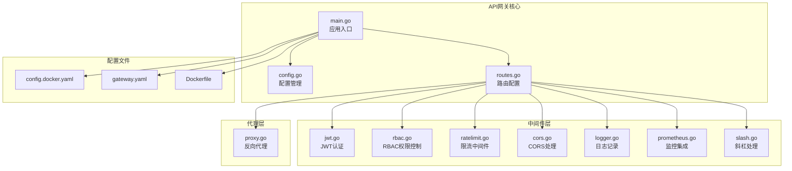
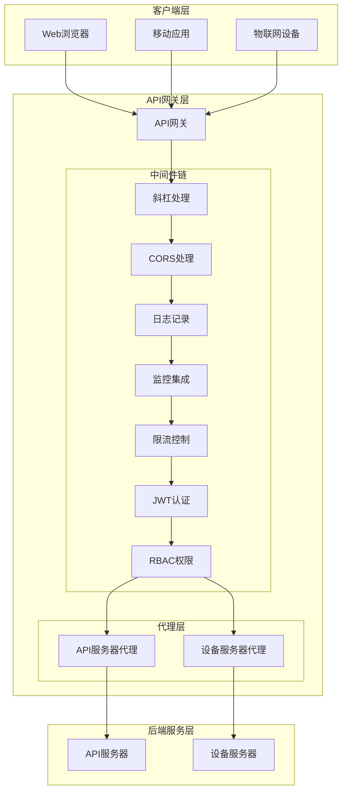
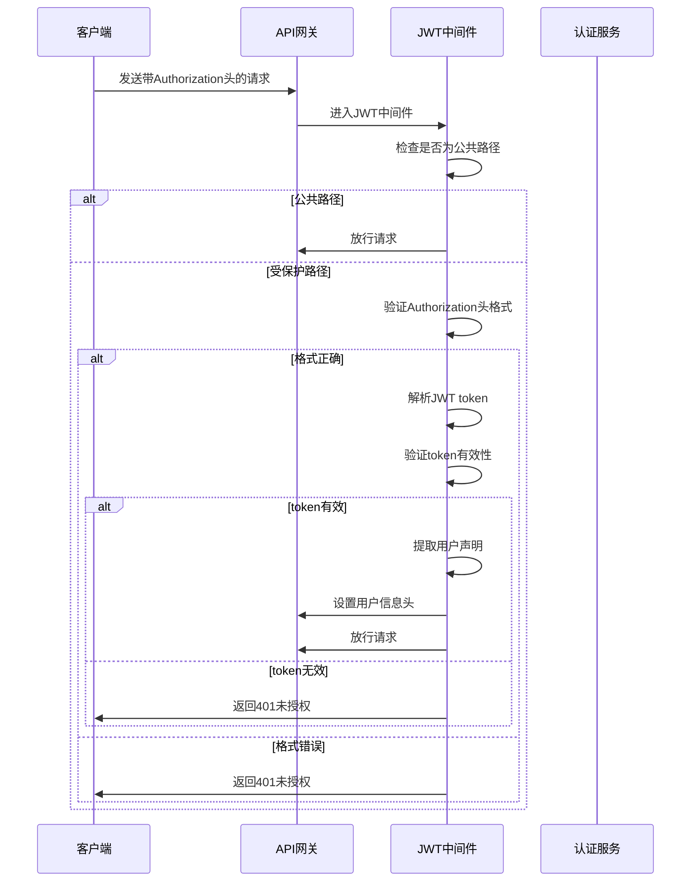
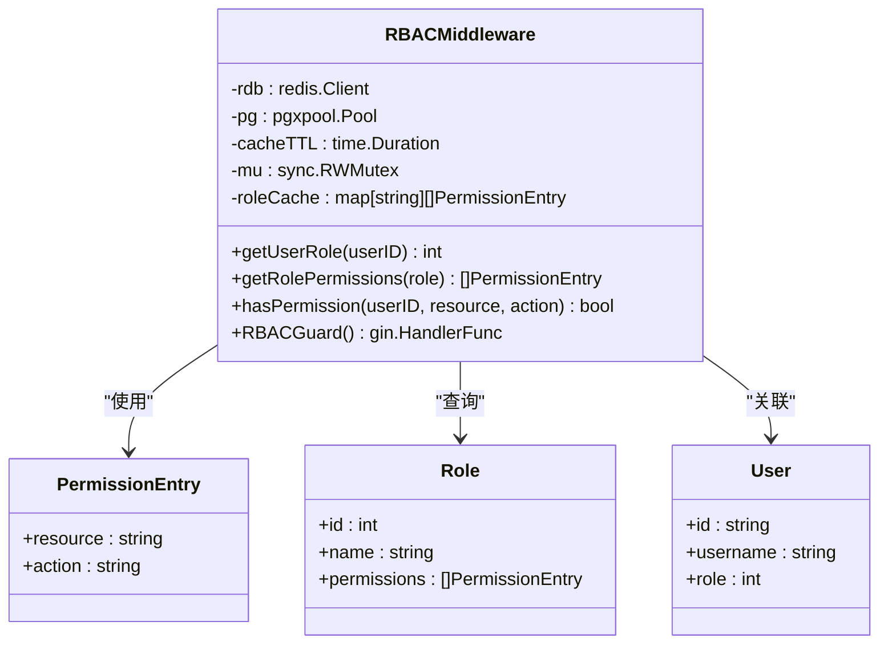
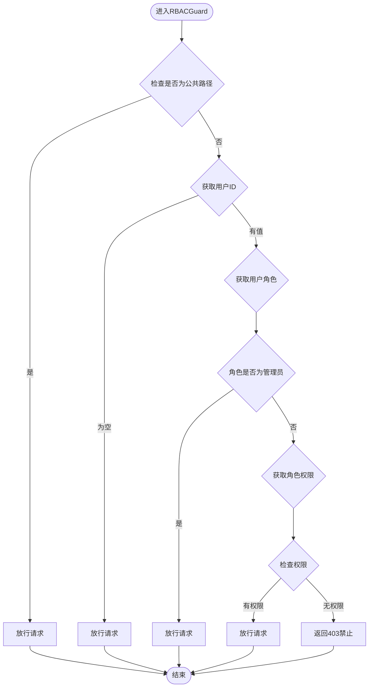
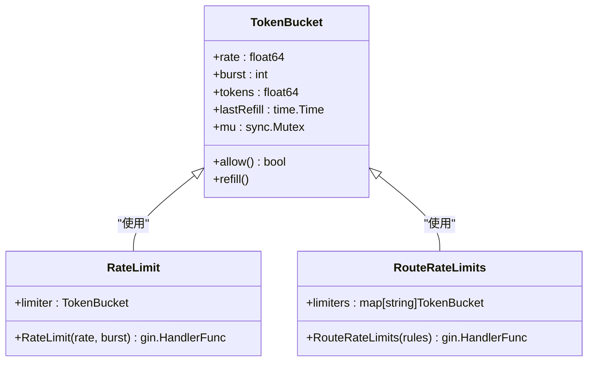
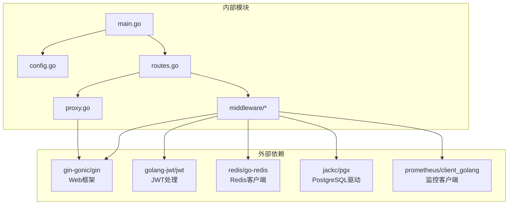

# API网关服务

<cite>
**本文档引用的文件**
- [main.go](file://api-gateway/main.go)
- [config.go](file://api-gateway/internal/config/config.go)
- [routes.go](file://api-gateway/internal/routes/routes.go)
- [jwt.go](file://api-gateway/internal/middleware/jwt.go)
- [rbac.go](file://api-gateway/internal/middleware/rbac.go)
- [ratelimit.go](file://api-gateway/internal/middleware/ratelimit.go)
- [cors.go](file://api-gateway/internal/middleware/cors.go)
- [logger.go](file://api-gateway/internal/middleware/logger.go)
- [prometheus.go](file://api-gateway/internal/middleware/prometheus.go)
- [slash.go](file://api-gateway/internal/middleware/slash.go)
- [proxy.go](file://api-gateway/internal/proxy/proxy.go)
- [config.docker.yaml](file://api-gateway/config.docker.yaml)
- [Dockerfile](file://api-gateway/Dockerfile)
- [gateway.yaml](file://deploy/configs/gateway.yaml)
</cite>

## 目录
1. [简介](#简介)
2. [项目结构](#项目结构)
3. [核心组件](#核心组件)
4. [架构概览](#架构概览)
5. [详细组件分析](#详细组件分析)
6. [依赖关系分析](#依赖关系分析)
7. [性能考虑](#性能考虑)
8. [故障排除指南](#故障排除指南)
9. [结论](#结论)
10. [附录](#附录)

## 简介

API网关服务是光伏逆变器监控系统的核心统一入口，负责处理所有外部请求、身份认证、权限控制、流量限制、跨域处理和监控统计。该系统采用微服务架构设计，通过反向代理将请求转发到相应的后端服务。

本系统的主要设计理念包括：
- **统一入口**：所有API请求通过单一入口点进行集中管理
- **中间件架构**：基于Gin框架的中间件链实现横切关注点
- **可扩展性**：支持动态配置和插件化中间件
- **可观测性**：内置Prometheus监控和详细日志记录
- **安全性**：JWT认证和RBAC权限控制双重保障

## 项目结构

API网关服务采用清晰的分层架构，主要包含以下模块：



**图表来源**
- [main.go:1-129](file://api-gateway/main.go#L1-L129)
- [config.go:1-87](file://api-gateway/internal/config/config.go#L1-L87)
- [routes.go:1-195](file://api-gateway/internal/routes/routes.go#L1-L195)

**章节来源**
- [main.go:1-129](file://api-gateway/main.go#L1-L129)
- [config.go:1-87](file://api-gateway/internal/config/config.go#L1-L87)
- [routes.go:1-195](file://api-gateway/internal/routes/routes.go#L1-L195)

## 核心组件

### 配置管理系统

配置系统采用YAML格式，支持环境变量替换和运行时配置加载。主要配置项包括：

- **服务器配置**：端口、运行模式
- **JWT配置**：密钥设置
- **限流配置**：全局速率和突发限制
- **后端服务配置**：API服务器和设备服务器地址
- **Redis配置**：缓存连接参数
- **RBAC配置**：权限控制开关和缓存策略

### 路由管理系统

路由系统采用Gin框架的路由注册机制，支持通配符路由和路径重写。主要路由类别：

- **网关内部接口**：健康检查、指标收集、API文档
- **API服务器路由**：用户认证、设备管理、告警处理等
- **设备服务器路由**：设备状态查询、实时数据获取
- **静态资源路由**：文件上传目录

### 中间件执行链

中间件按照特定顺序执行，形成完整的请求处理流水线：

1. **斜杠处理**：移除路径末尾斜杠
2. **恢复处理**：异常恢复和错误处理
3. **CORS处理**：跨域资源共享支持
4. **请求日志**：详细请求日志记录
5. **Prometheus监控**：指标收集和统计
6. **全局限流**：整体流量控制
7. **路由级限流**：细粒度流量控制
8. **JWT认证**：身份验证
9. **RBAC权限控制**：权限验证

**章节来源**
- [config.go:10-87](file://api-gateway/internal/config/config.go#L10-L87)
- [routes.go:15-55](file://api-gateway/internal/routes/routes.go#L15-L55)
- [main.go:21-94](file://api-gateway/main.go#L21-L94)

## 架构概览

API网关采用分布式架构设计，通过反向代理实现请求转发和负载均衡：



**图表来源**
- [routes.go:25-55](file://api-gateway/internal/routes/routes.go#L25-L55)
- [proxy.go:16-60](file://api-gateway/internal/proxy/proxy.go#L16-L60)

## 详细组件分析

### JWT认证中间件

JWT认证中间件实现了基于JSON Web Token的身份验证机制，确保只有经过授权的用户才能访问受保护的资源。

#### 认证流程



**图表来源**
- [jwt.go:44-122](file://api-gateway/internal/middleware/jwt.go#L44-L122)

#### 安全策略

- **公共路径白名单**：包含健康检查、登录、注册等无需认证的接口
- **Bearer Token格式**：要求Authorization头必须为"Bearer {token}"格式
- **HMAC签名验证**：使用配置的安全密钥验证token签名
- **声明提取**：从token中提取用户ID、手机号、角色等信息
- **头部注入**：将用户信息注入到X-User-ID、X-User-Role等头部

#### 过期处理机制

- **即时验证**：每次请求都进行token有效性验证
- **无状态设计**：不维护token黑名单，依赖JWT自身的过期机制
- **错误处理**：对无效token返回明确的错误信息

**章节来源**
- [jwt.go:13-42](file://api-gateway/internal/middleware/jwt.go#L13-L42)
- [jwt.go:75-121](file://api-gateway/internal/middleware/jwt.go#L75-L121)

### RBAC权限控制机制

RBAC（基于角色的访问控制）中间件提供了细粒度的权限管理能力，支持多级权限控制和缓存优化。

#### 权限模型



**图表来源**
- [rbac.go:19-42](file://api-gateway/internal/middleware/rbac.go#L19-L42)

#### 角色定义与权限映射

系统支持以下角色和权限映射：

| 资源类型 | 路径前缀 | 角色权限 | 动作映射 |
|---------|----------|----------|----------|
| 管理后台 | `/api/v1/admin/` | 管理员 | admin |
| 用户管理 | `/api/v1/users/` | 管理员 | users |
| OTA升级 | `/api/v1/ota/` | 管理员 | ota |
| 固件管理 | `/api/v1/ota/firmwares` | 管理员 | firmware |
| 并机配置 | `/api/v1/parallel/` | 管理员 | parallel |
| 设备管理 | `/api/v1/devices/` | 管理员 | devices |
| 告警管理 | `/api/v1/alarms/` | 管理员 | alerts |
| 电站管理 | `/api/v1/stations/` | 管理员 | stations |

#### 权限检查流程



**图表来源**
- [rbac.go:190-239](file://api-gateway/internal/middleware/rbac.go#L190-L239)

#### 缓存策略

- **用户角色缓存**：缓存用户角色信息，减少数据库查询
- **权限列表缓存**：缓存角色对应的权限列表，提高权限检查效率
- **内存缓存**：使用RWMutex保证并发安全
- **Redis缓存**：支持分布式缓存，提高系统扩展性

**章节来源**
- [rbac.go:44-75](file://api-gateway/internal/middleware/rbac.go#L44-L75)
- [rbac.go:77-133](file://api-gateway/internal/middleware/rbac.go#L77-L133)
- [rbac.go:178-188](file://api-gateway/internal/middleware/rbac.go#L178-L188)

### 限流中间件

限流中间件实现了令牌桶算法，提供全局和路由级别的流量控制能力。

#### 令牌桶算法实现



**图表来源**
- [ratelimit.go:12-46](file://api-gateway/internal/middleware/ratelimit.go#L12-L46)

#### 流量控制策略

| 路径前缀 | 速率限制 | 突发容量 | 用途 |
|---------|----------|----------|------|
| `/api/v1/devices` | 50次/秒 | 100个令牌 | 设备数据访问 |
| `/api/v1/auth/login` | 10次/秒 | 20个令牌 | 用户登录 |
| `/api/v1/auth/register` | 5次/秒 | 10个令牌 | 用户注册 |
| `/api/v1/auth/send-code` | 2次/秒 | 5个令牌 | 验证码发送 |

#### 实现细节

- **令牌补充**：根据时间间隔动态补充令牌
- **并发安全**：使用互斥锁保证线程安全
- **精确控制**：支持小数速率和突发流量
- **灵活配置**：支持全局和路由级独立配置

**章节来源**
- [ratelimit.go:20-46](file://api-gateway/internal/middleware/ratelimit.go#L20-L46)
- [ratelimit.go:70-93](file://api-gateway/internal/middleware/ratelimit.go#L70-L93)

### CORS跨域处理

CORS中间件提供了完整的跨域资源共享支持，确保前端应用能够正常访问API网关。

#### 跨域配置

- **允许来源**：`*`（生产环境建议指定具体域名）
- **允许方法**：GET、POST、PUT、DELETE、PATCH、OPTIONS
- **允许头**：Content-Type、Authorization、X-Requested-With等
- **暴露头**：Content-Length、Content-Type
- **凭证支持**：允许携带Cookie和认证头
- **预检缓存**：OPTIONS请求缓存24小时

### 日志记录

请求日志中间件提供了详细的请求追踪能力，包括性能指标和错误诊断信息。

#### 日志格式

```
[GATEWAY] STATUS | LATENCY | CLIENT_IP | METHOD PATH
```

示例输出：
```
[GATEWAY] 200 | 15.234ms | 192.168.1.100 | GET /api/v1/stations
[GATEWAY] 404 | 2.123ms | 192.168.1.101 | GET /api/v1/nonexistent
```

#### 日志内容

- **状态码**：HTTP响应状态
- **处理时间**：请求处理耗时
- **客户端IP**：请求来源IP地址
- **请求方法**：HTTP方法类型
- **请求路径**：完整请求路径

### Prometheus监控集成

监控中间件集成了Prometheus指标收集，提供完整的系统监控能力。

#### 指标定义

| 指标名称 | 类型 | 描述 | 标签 |
|---------|------|------|------|
| `api_gateway_requests_total` | CounterVec | 总请求数 | method, path, status |
| `api_gateway_request_duration_seconds` | HistogramVec | 请求处理时延 | method, path, status |
| `api_gateway_requests_in_flight` | Gauge | 正在处理的请求数 | 无 |

#### 监控端点

- **指标收集**：`/metrics` - Prometheus抓取端点
- **健康检查**：`/health` - 服务健康状态
- **API文档**：`/api/docs` - 接口文档

**章节来源**
- [prometheus.go:11-40](file://api-gateway/internal/middleware/prometheus.go#L11-L40)
- [prometheus.go:42-65](file://api-gateway/internal/middleware/prometheus.go#L42-L65)

### 反向代理

反向代理组件实现了请求转发和负载均衡功能，支持多种后端服务的统一管理。

#### 代理配置

- **连接池**：最大空闲连接200，每主机50
- **连接超时**：10秒
- **空闲超时**：90秒
- **TLS握手超时**：10秒
- **路径重写**：支持动态路径转换

#### 错误处理

- **后端不可达**：返回502状态码
- **连接超时**：返回504状态码
- **服务异常**：返回500状态码

**章节来源**
- [proxy.go:21-60](file://api-gateway/internal/proxy/proxy.go#L21-L60)
- [proxy.go:62-101](file://api-gateway/internal/proxy/proxy.go#L62-L101)

## 依赖关系分析

API网关服务的依赖关系相对简洁，主要依赖于Gin框架和相关工具库：



**图表来源**
- [main.go:14-18](file://api-gateway/main.go#L14-L18)
- [routes.go:3-13](file://api-gateway/internal/routes/routes.go#L3-L13)

### 主要依赖说明

- **Gin框架**：提供Web服务器和路由功能
- **JWT库**：处理JSON Web Token的解析和验证
- **Redis客户端**：提供缓存和会话存储
- **PostgreSQL驱动**：访问用户和权限数据
- **Prometheus客户端**：指标收集和导出

**章节来源**
- [main.go:18](file://api-gateway/main.go#L18)
- [routes.go:11](file://api-gateway/internal/routes/routes.go#L11)

## 性能考虑

### 缓存策略

1. **Redis缓存**：用户角色和权限列表缓存
2. **内存缓存**：本地权限检查结果缓存
3. **连接池**：后端服务连接复用
4. **静态资源**：CDN加速静态文件传输

### 并发优化

1. **读写锁**：权限缓存使用RWMutex提高并发性能
2. **异步处理**：日志和监控采用异步方式
3. **连接复用**：HTTP连接池减少建立开销
4. **批量操作**：权限查询支持批量处理

### 资源管理

1. **内存限制**：缓存大小和过期时间合理配置
2. **连接限制**：后端连接数量限制
3. **超时设置**：合理的超时配置避免资源泄露
4. **垃圾回收**：定期清理过期缓存和连接

## 故障排除指南

### 常见问题及解决方案

#### JWT认证失败

**症状**：返回401未授权错误
**可能原因**：
- Authorization头格式错误
- JWT密钥配置不正确
- Token已过期
- 用户ID提取失败

**解决步骤**：
1. 检查Authorization头格式：`Bearer {token}`
2. 验证JWT_SECRET环境变量设置
3. 确认token签名算法和密钥匹配
4. 检查用户声明中的必要字段

#### RBAC权限拒绝

**症状**：返回403权限不足
**可能原因**：
- 用户角色查询失败
- 权限列表缓存过期
- 资源路径映射错误
- Redis连接异常

**解决步骤**：
1. 检查用户角色表数据
2. 清理权限缓存
3. 验证资源路径映射配置
4. 确认Redis连接状态

#### 限流触发

**症状**：返回429请求过于频繁
**可能原因**：
- 速率配置过低
- 路由级限流规则冲突
- 令牌桶初始化问题
- 并发请求过多

**解决步骤**：
1. 调整全局或路由级限流配置
2. 检查限流规则优先级
3. 监控令牌桶状态
4. 优化客户端请求频率

#### CORS跨域问题

**症状**：浏览器报跨域错误
**可能原因**：
- 允许来源配置不当
- 预检请求处理异常
- 凭证传递问题
- 安全策略限制

**解决步骤**：
1. 检查Access-Control-Allow-Origin配置
2. 验证预检请求响应
3. 确认凭据传递设置
4. 浏览器开发者工具调试

**章节来源**
- [jwt.go:52-100](file://api-gateway/internal/middleware/jwt.go#L52-L100)
- [rbac.go:197-237](file://api-gateway/internal/middleware/rbac.go#L197-L237)
- [ratelimit.go:52-59](file://api-gateway/internal/middleware/ratelimit.go#L52-L59)

## 结论

API网关服务通过精心设计的架构和完善的中间件体系，为光伏逆变器监控系统提供了强大而灵活的统一入口。系统具备以下优势：

1. **安全性**：JWT认证和RBAC权限控制双重保障
2. **可扩展性**：模块化设计支持功能扩展
3. **可观测性**：完整的监控和日志体系
4. **性能**：高效的缓存策略和连接管理
5. **可靠性**：完善的错误处理和故障恢复

通过合理的配置和部署，API网关能够满足大规模生产环境的需求，为整个系统的稳定运行提供坚实基础。

## 附录

### 配置参考

#### 环境变量

| 变量名 | 默认值 | 说明 |
|--------|--------|------|
| `JWT_SECRET` | `CHANGE_ME` | JWT加密密钥 |
| `API_SERVER_URL` | `http://inv-api-server:8080` | API服务器地址 |
| `DEVICE_SERVER_URL` | `http://inv-device-server:8081` | 设备服务器地址 |
| `REDIS_HOST` | `localhost` | Redis服务器地址 |
| `REDIS_PORT` | `6379` | Redis服务器端口 |
| `REDIS_PASSWORD` | 空 | Redis访问密码 |

#### Docker部署

```bash
# 构建镜像
docker build -t api-gateway .

# 运行容器
docker run -d \
  --name api-gateway \
  -p 8080:8080 \
  -e JWT_SECRET=your-super-secret-key \
  -e API_SERVER_URL=http://api-server:8080 \
  -e DEVICE_SERVER_URL=http://device-server:8081 \
  -e REDIS_HOST=redis \
  api-gateway
```

### 最佳实践

1. **安全配置**
   - 使用强密码作为JWT密钥
   - 定期轮换JWT密钥
   - 限制Redis访问权限
   - 启用HTTPS传输

2. **性能优化**
   - 合理配置限流参数
   - 优化缓存策略
   - 监控系统指标
   - 定期清理过期数据

3. **运维管理**
   - 建立监控告警
   - 定期备份配置
   - 监控日志分析
   - 容量规划和扩容