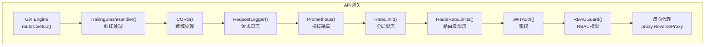
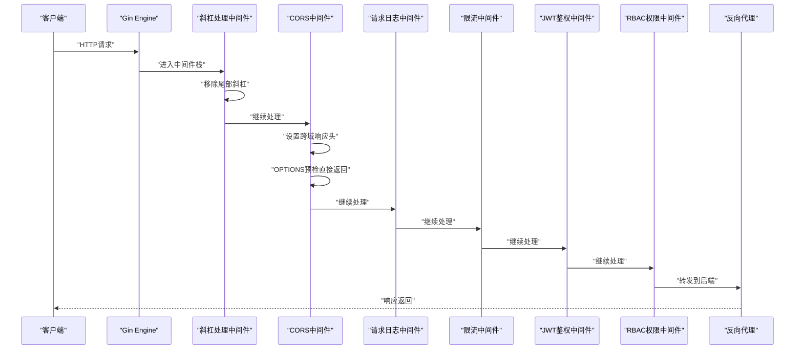
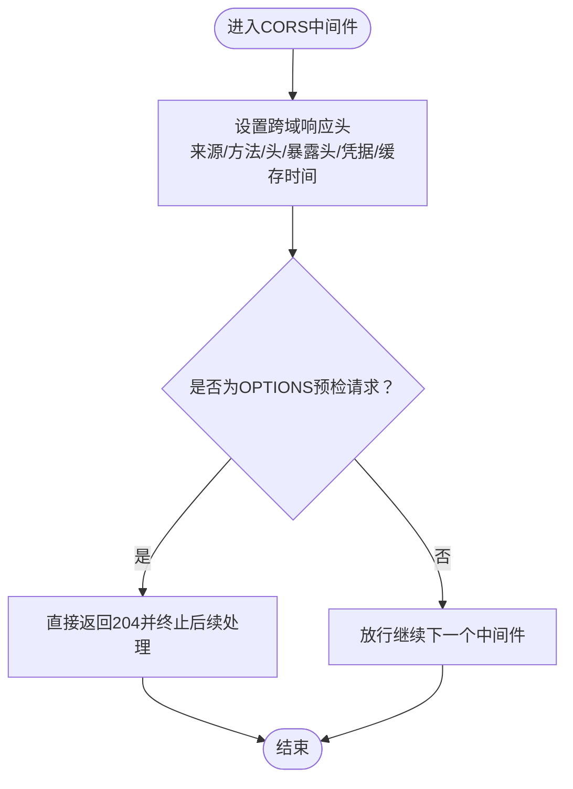
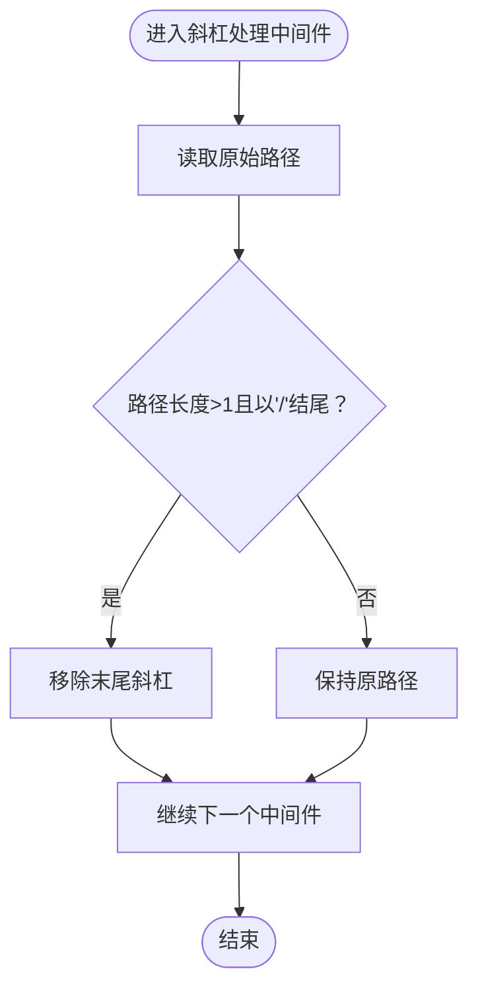
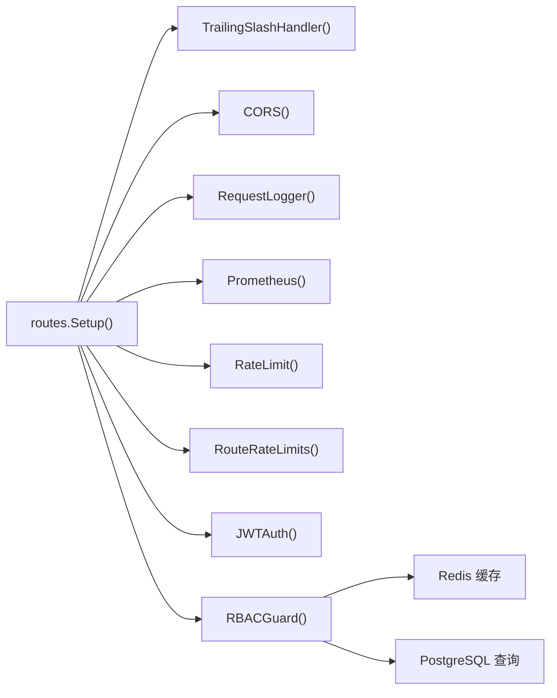

# CORS跨域与缓存

<cite>
**本文引用的文件**
- [api-gateway/internal/middleware/cors.go](file://api-gateway/internal/middleware/cors.go)
- [api-gateway/internal/middleware/slash.go](file://api-gateway/internal/middleware/slash.go)
- [api-gateway/internal/route/routes.go](file://api-gateway/internal/routes/routes.go)
- [api-gateway/main.go](file://api-gateway/main.go)
- [api-gateway/internal/config/config.go](file://api-gateway/internal/config/config.go)
- [api-gateway/config.docker.yaml](file://api-gateway/config.docker.yaml)
- [deploy/configs/gateway.yaml](file://deploy/configs/gateway.yaml)
- [api-gateway/internal/middleware/logger.go](file://api-gateway/internal/middleware/logger.go)
- [api-gateway/internal/middleware/ratelimit.go](file://api-gateway/internal/middleware/ratelimit.go)
- [api-gateway/internal/middleware/rbac.go](file://api-gateway/internal/middleware/rbac.go)
</cite>

## 目录
1. [引言](#引言)
2. [项目结构](#项目结构)
3. [核心组件](#核心组件)
4. [架构总览](#架构总览)
5. [详细组件分析](#详细组件分析)
6. [依赖分析](#依赖分析)
7. [性能考量](#性能考量)
8. [故障排查指南](#故障排查指南)
9. [结论](#结论)
10. [附录](#附录)

## 引言
本技术文档聚焦于API网关中的CORS跨域处理与缓存中间件实现，涵盖以下要点：
- CORS协议工作原理与安全考虑：预检请求处理、允许源配置、允许方法与头字段、敏感头暴露、凭据处理与缓存时间。
- 缓存中间件实现：URL规范化、尾部斜杠处理与缓存策略影响。
- CORS配置选项：允许方法、头字段、凭据与缓存时间。
- 请求路径影响：尾部斜杠标准化与重复路径处理。
- 配置示例：开发与生产环境差异。
- 常见跨域问题诊断与解决方案。
- 浏览器兼容性与安全最佳实践。

## 项目结构
API网关采用Gin框架，中间件按职责分层组织，CORS与斜杠处理中间件在路由初始化时集中注册，形成清晰的请求处理流水线。

图表来源
- [api-gateway/internal/routes/routes.go:25-55](file://api-gateway/internal/routes/routes.go#L25-L55)
- [api-gateway/internal/middleware/slash.go:9-17](file://api-gateway/internal/middleware/slash.go#L9-L17)
- [api-gateway/internal/middleware/cors.go:9-25](file://api-gateway/internal/middleware/cors.go#L9-L25)

章节来源
- [api-gateway/internal/routes/routes.go:25-55](file://api-gateway/internal/routes/routes.go#L25-L55)

## 核心组件
- CORS中间件：统一注入跨域响应头，处理预检OPTIONS请求，支持凭据与缓存时间。
- 斜杠处理中间件：自动移除尾部斜杠，避免路径重复导致的缓存与路由不一致。
- 路由注册：在路由初始化中按顺序注册中间件与端点，确保CORS与斜杠处理在鉴权之前执行。

章节来源
- [api-gateway/internal/middleware/cors.go:9-25](file://api-gateway/internal/middleware/cors.go#L9-L25)
- [api-gateway/internal/middleware/slash.go:9-17](file://api-gateway/internal/middleware/slash.go#L9-L17)
- [api-gateway/internal/routes/routes.go:25-55](file://api-gateway/internal/routes/routes.go#L25-L55)

## 架构总览
下图展示从客户端到后端服务的完整调用链，重点标注CORS与斜杠处理的位置及对后续中间件的影响。

图表来源
- [api-gateway/internal/routes/routes.go:25-55](file://api-gateway/internal/routes/routes.go#L25-L55)
- [api-gateway/internal/middleware/slash.go:9-17](file://api-gateway/internal/middleware/slash.go#L9-L17)
- [api-gateway/internal/middleware/cors.go:9-25](file://api-gateway/internal/middleware/cors.go#L9-L25)

## 详细组件分析

### CORS中间件
- 功能概述
  - 设置允许的来源、方法、头字段与暴露头。
  - 支持凭据传递与预检请求缓存时间。
  - 对OPTIONS预检请求直接返回，避免后续中间件执行。
- 安全考虑
  - 明确列出允许的头字段，避免通配符暴露敏感信息。
  - 暴露必要头以供前端读取，减少跨域场景下的二次请求。
  - 凭据开启需谨慎，建议在生产环境限定具体来源而非通配。
- 预检缓存
  - 通过缓存时间减少重复预检请求，提升性能。
- 可扩展性
  - 当前实现为通用配置；如需多环境差异化，可引入配置项动态设置来源与头字段。

图表来源
- [api-gateway/internal/middleware/cors.go:9-25](file://api-gateway/internal/middleware/cors.go#L9-L25)

章节来源
- [api-gateway/internal/middleware/cors.go:9-25](file://api-gateway/internal/middleware/cors.go#L9-L25)

### 斜杠处理中间件
- 功能概述
  - 自动去除URL尾部多余斜杠，保证路径一致性。
  - 与路由注册中的尾斜杠重定向关闭配合，避免重复路径导致的缓存失效与鉴权绕过风险。
- 影响范围
  - 影响所有上游中间件（如鉴权、限流、日志）对路径的判断。
  - 有助于统一缓存键，减少因路径差异导致的缓存碎片化。

图表来源
- [api-gateway/internal/middleware/slash.go:9-17](file://api-gateway/internal/middleware/slash.go#L9-L17)

章节来源
- [api-gateway/internal/middleware/slash.go:9-17](file://api-gateway/internal/middleware/slash.go#L9-L17)
- [api-gateway/internal/routes/routes.go:27](file://api-gateway/internal/routes/routes.go#L27)

### 路由与中间件注册
- 中间件顺序
  - 斜杠处理 → CORS → 日志 → 指标 → 全局限流 → 路由级限流 → 鉴权 → RBAC → 反向代理。
  - 该顺序确保跨域与路径规范化在鉴权之前完成，避免不必要的鉴权失败与缓存问题。
- 路由注册
  - 使用通配符与重写处理器，覆盖认证、设备、告警、通知、模型、仪表盘、OTA、并机、内部接口等。
  - 未命中路由返回统一404响应。

章节来源
- [api-gateway/internal/routes/routes.go:25-55](file://api-gateway/internal/routes/routes.go#L25-L55)
- [api-gateway/internal/routes/routes.go:73-111](file://api-gateway/internal/routes/routes.go#L73-L111)

### 配置与部署
- 开发环境
  - 通过Docker配置文件加载环境变量，如JWT密钥、后端地址、Redis连接参数等。
  - 默认端口与限流参数便于本地调试。
- 生产环境
  - 使用Kubernetes配置文件，集中管理密钥与后端服务地址。
  - 启用RBAC与Redis缓存，提升权限校验效率。

章节来源
- [api-gateway/config.docker.yaml:1-39](file://api-gateway/config.docker.yaml#L1-L39)
- [deploy/configs/gateway.yaml:1-41](file://deploy/configs/gateway.yaml#L1-L41)
- [api-gateway/internal/config/config.go:57-82](file://api-gateway/internal/config/config.go#L57-L82)

## 依赖分析
- 组件耦合
  - CORS与斜杠处理均为纯中间件，低耦合、高内聚。
  - 路由模块负责编排中间件顺序，避免逻辑分散。
- 外部依赖
  - Gin框架提供中间件机制与路由能力。
  - Prometheus用于指标采集，Redis用于RBAC缓存，PG用于权限数据查询。

图表来源
- [api-gateway/internal/routes/routes.go:25-55](file://api-gateway/internal/routes/routes.go#L25-L55)
- [api-gateway/internal/middleware/rbac.go:32-42](file://api-gateway/internal/middleware/rbac.go#L32-L42)

章节来源
- [api-gateway/internal/routes/routes.go:25-55](file://api-gateway/internal/routes/routes.go#L25-L55)
- [api-gateway/internal/middleware/rbac.go:32-42](file://api-gateway/internal/middleware/rbac.go#L32-L42)

## 性能考量
- CORS预检缓存
  - 通过设置缓存时间减少重复预检，降低网络开销。
- 斜杠处理
  - 规范化路径有助于缓存命中率，减少重复计算。
- 限流策略
  - 全局与路由级限流结合，避免热点接口被刷爆。
- 指标监控
  - Prometheus中间件便于观测请求量、错误率与延迟。

章节来源
- [api-gateway/internal/middleware/cors.go:16](file://api-gateway/internal/middleware/cors.go#L16)
- [api-gateway/internal/middleware/slash.go:12-14](file://api-gateway/internal/middleware/slash.go#L12-L14)
- [api-gateway/internal/middleware/ratelimit.go:48-94](file://api-gateway/internal/middleware/ratelimit.go#L48-L94)
- [api-gateway/internal/middleware/logger.go:10-30](file://api-gateway/internal/middleware/logger.go#L10-L30)

## 故障排查指南
- CORS相关问题
  - 现象：浏览器报跨域错误或预检失败。
  - 排查：确认CORS响应头是否正确设置；核对允许方法与头字段是否包含前端请求所需；检查是否允许凭据以及来源是否为通配。
  - 解决：根据环境调整允许来源与头字段；避免在生产使用通配来源。
- 预检请求异常
  - 现象：复杂请求触发预检但返回失败。
  - 排查：确认中间件顺序中CORS位于鉴权之前；检查OPTIONS处理是否提前终止。
  - 解决：确保CORS中间件正确处理OPTIONS并返回。
- 路径导致的缓存与鉴权问题
  - 现象：相同功能因尾斜杠不同导致缓存不命中或鉴权失败。
  - 排查：确认斜杠处理中间件生效；检查路由注册是否关闭尾斜杠重定向。
  - 解决：启用斜杠处理并保持路由配置一致。
- 鉴权与权限
  - 现象：携带凭据时鉴权失败或权限不足。
  - 排查：确认JWT头是否存在；RBAC是否启用；用户角色与权限映射是否正确。
  - 解决：完善用户角色与权限配置；确保前端正确传递凭据。

章节来源
- [api-gateway/internal/middleware/cors.go:18-21](file://api-gateway/internal/middleware/cors.go#L18-L21)
- [api-gateway/internal/middleware/slash.go:9-17](file://api-gateway/internal/middleware/slash.go#L9-L17)
- [api-gateway/internal/routes/routes.go:27](file://api-gateway/internal/routes/routes.go#L27)
- [api-gateway/internal/middleware/rbac.go:190-239](file://api-gateway/internal/middleware/rbac.go#L190-L239)

## 结论
本项目通过明确的中间件顺序与简洁的CORS实现，有效解决了跨域与路径规范化问题。结合限流、日志与RBAC，形成了稳定、可观测且具备权限控制的API网关。建议在生产环境中严格限制CORS来源与头字段，并结合监控持续优化缓存与限流策略。

## 附录

### CORS配置选项与建议
- 允许来源
  - 开发环境：可使用通配或具体本地地址。
  - 生产环境：限定为受信域名，避免通配来源。
- 允许方法
  - 当前实现包含常用REST方法与OPTIONS，可根据业务调整。
- 允许头字段
  - 当前实现包含典型头字段，如需自定义需同步调整。
- 敏感头暴露
  - 仅暴露前端需要读取的头，避免泄露内部信息。
- 凭据处理
  - 开启凭据时必须指定具体来源，不可使用通配。
- 预检缓存时间
  - 根据前端请求频率与变更频率设定，平衡性能与灵活性。

章节来源
- [api-gateway/internal/middleware/cors.go:11-16](file://api-gateway/internal/middleware/cors.go#L11-L16)

### 缓存中间件与请求路径影响
- URL规范化
  - 斜杠处理统一路径格式，减少缓存键差异。
- 尾斜杠标准化
  - 避免同一接口因尾斜杠不同导致的缓存碎片化。
- 重复路径处理
  - 与路由级限流配合，防止恶意或误用导致的流量放大。

章节来源
- [api-gateway/internal/middleware/slash.go:9-17](file://api-gateway/internal/middleware/slash.go#L9-L17)
- [api-gateway/internal/routes/routes.go:27](file://api-gateway/internal/routes/routes.go#L27)

### 配置示例（开发与生产）
- 开发环境
  - 使用Docker配置文件加载环境变量，设置JWT密钥与后端地址。
- 生产环境
  - 使用Kubernetes配置文件集中管理密钥与后端服务地址，启用RBAC与Redis缓存。

章节来源
- [api-gateway/config.docker.yaml:1-39](file://api-gateway/config.docker.yaml#L1-L39)
- [deploy/configs/gateway.yaml:1-41](file://deploy/configs/gateway.yaml#L1-L41)

### 浏览器兼容性与安全最佳实践
- 兼容性
  - 现代浏览器普遍支持CORS；预检缓存时间在部分旧版本存在差异，建议进行兼容性测试。
- 最佳实践
  - 严格限制CORS来源与头字段；开启凭据时禁止使用通配来源；定期审计跨域策略；结合监控与日志及时发现异常。

章节来源
- [api-gateway/internal/middleware/cors.go:11-16](file://api-gateway/internal/middleware/cors.go#L11-L16)