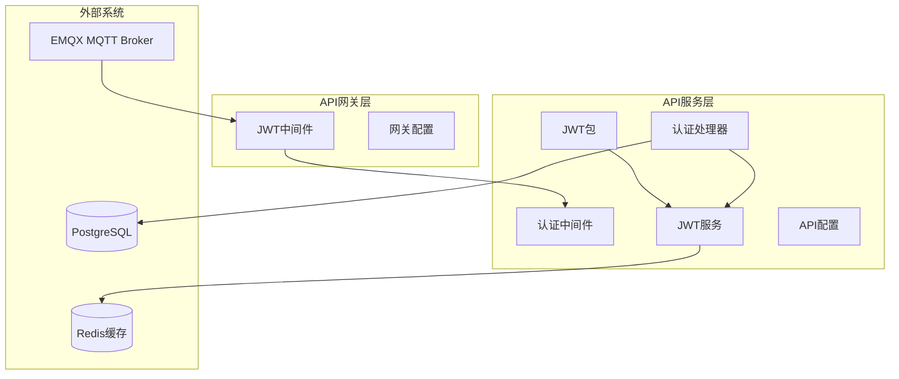
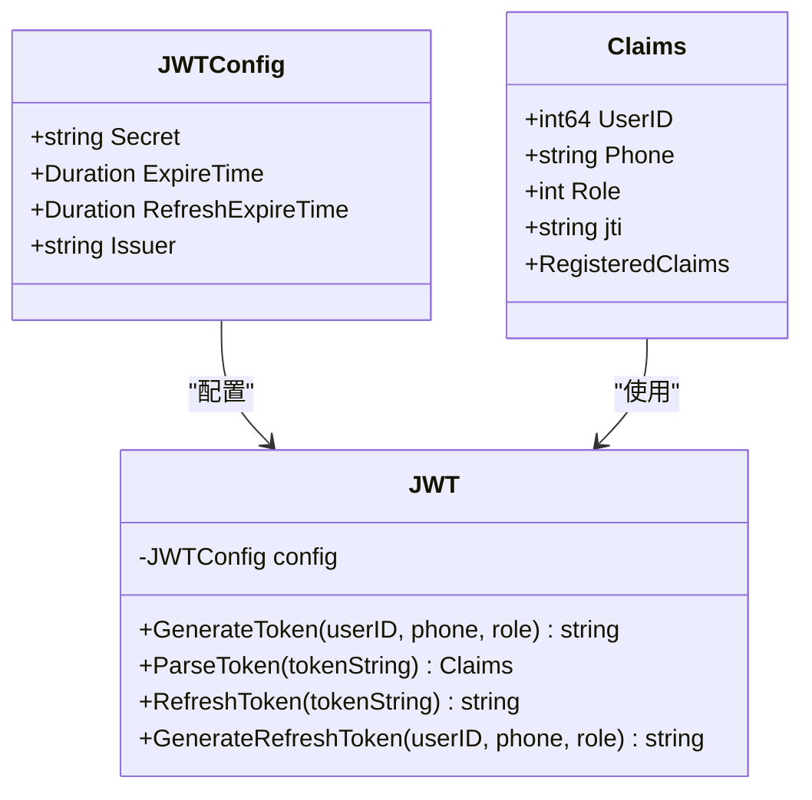
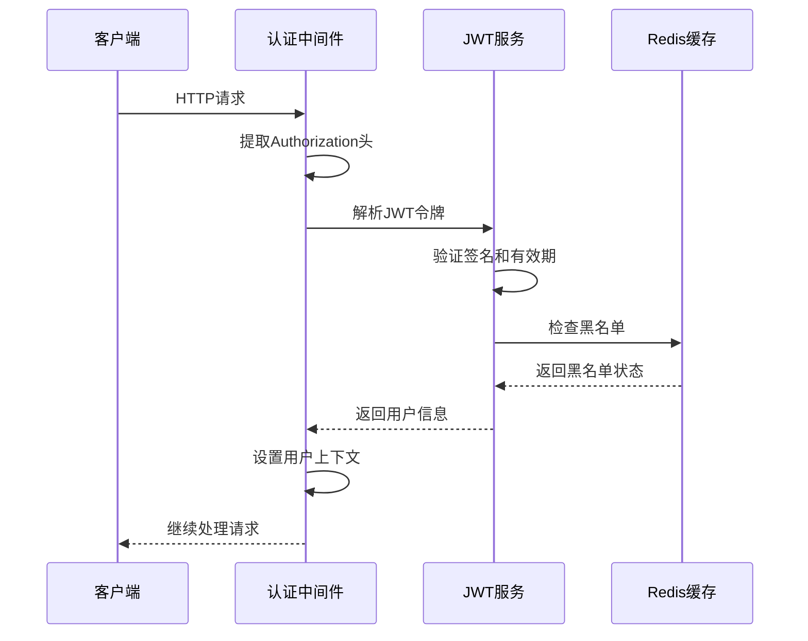
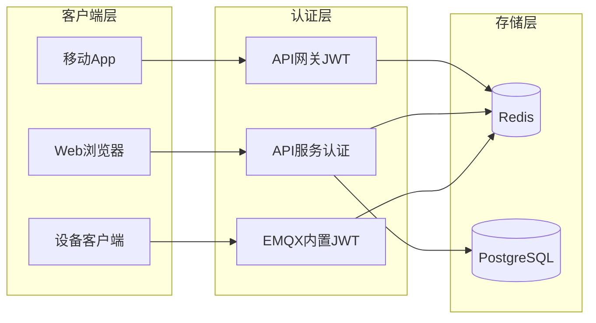
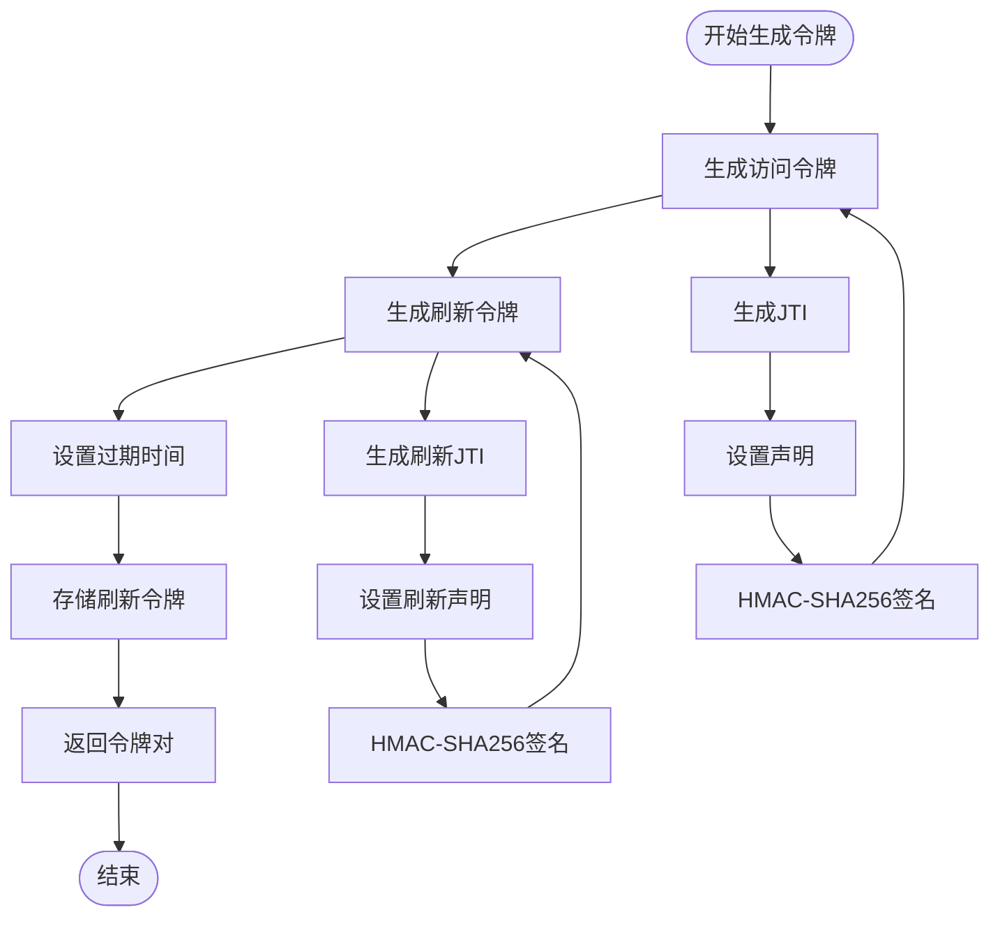
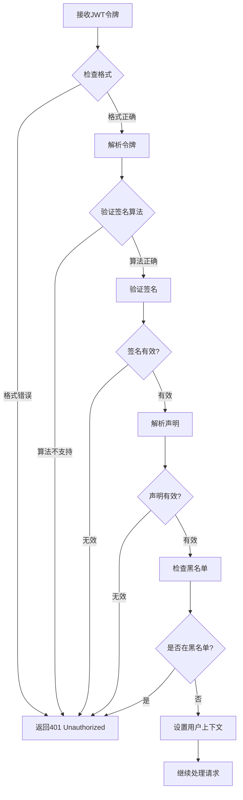
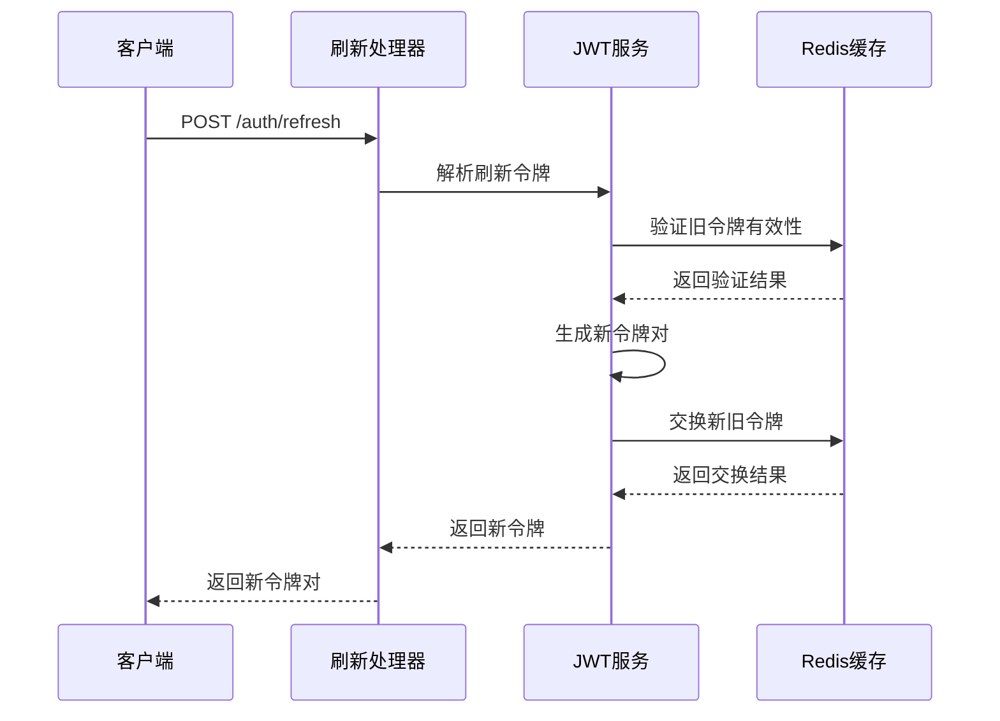
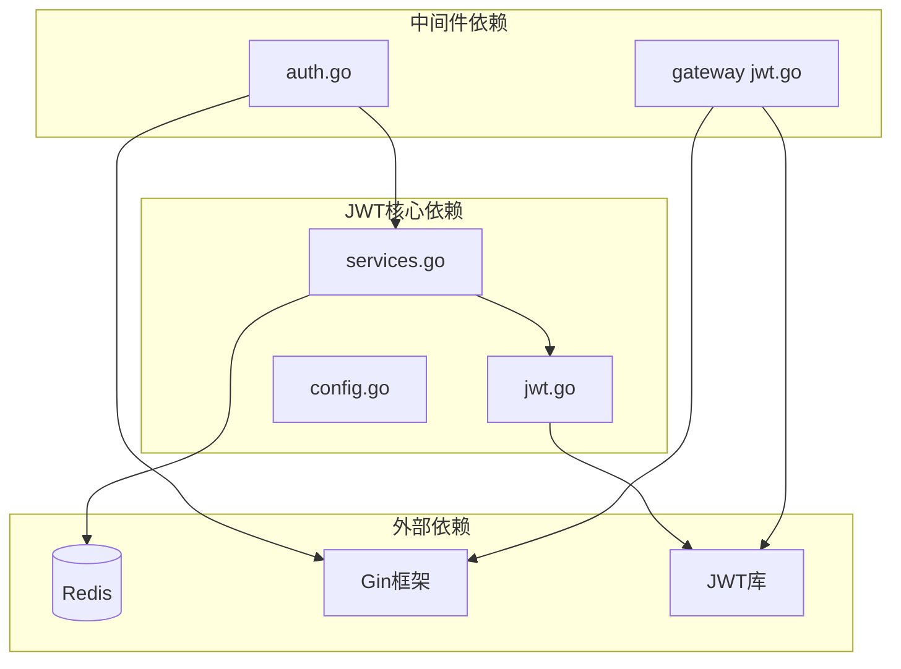

# JWT认证中间件

<cite>
**本文档引用的文件**
- [jwt.go](file://inv_api_server/pkg/jwt/jwt.go)
- [auth.go](file://inv_api_server/internal/middleware/auth.go)
- [config.go](file://inv_api_server/internal/config/config.go)
- [services.go](file://inv_api_server/internal/service/services.go)
- [auth_handler.go](file://inv_api_server/internal/handler/auth_handler.go)
- [jwt.go](file://api-gateway/internal/middleware/jwt.go)
- [config.go](file://api-gateway/internal/config/config.go)
- [README.md](file://README.md)
</cite>

## 目录
1. [简介](#简介)
2. [项目结构](#项目结构)
3. [核心组件](#核心组件)
4. [架构概览](#架构概览)
5. [详细组件分析](#详细组件分析)
6. [依赖关系分析](#依赖关系分析)
7. [性能考虑](#性能考虑)
8. [故障排除指南](#故障排除指南)
9. [结论](#结论)

## 简介

JWT（JSON Web Token）认证中间件是本系统的核心安全组件，负责处理用户身份验证和授权。该中间件实现了完整的JWT生命周期管理，包括token生成、验证、刷新和撤销功能。

系统采用HS256签名算法，使用统一的密钥进行JWT签发和验证。JWT令牌包含用户标识、角色信息和标准声明，支持短期访问令牌和长期刷新令牌的组合模式。

## 项目结构

系统采用分层架构设计，JWT认证相关代码分布在多个模块中：

**图表来源**
- [jwt.go:1-137](file://inv_api_server/pkg/jwt/jwt.go#L1-L137)
- [auth.go:1-255](file://inv_api_server/internal/middleware/auth.go#L1-L255)
- [config.go:1-200](file://inv_api_server/internal/config/config.go#L1-L200)

**章节来源**
- [jwt.go:1-137](file://inv_api_server/pkg/jwt/jwt.go#L1-L137)
- [auth.go:1-255](file://inv_api_server/internal/middleware/auth.go#L1-L255)
- [config.go:1-200](file://inv_api_server/internal/config/config.go#L1-L200)

## 核心组件

### JWT包实现

JWT包提供了完整的JWT操作功能，包括令牌生成、解析和刷新：

**图表来源**
- [jwt.go:12-55](file://inv_api_server/pkg/jwt/jwt.go#L12-L55)

### 认证中间件

认证中间件处理HTTP请求的身份验证：

**图表来源**
- [auth.go:15-56](file://inv_api_server/internal/middleware/auth.go#L15-L56)

**章节来源**
- [jwt.go:1-137](file://inv_api_server/pkg/jwt/jwt.go#L1-L137)
- [auth.go:1-255](file://inv_api_server/internal/middleware/auth.go#L1-L255)

## 架构概览

系统采用多层认证架构，确保不同场景下的安全性：

**图表来源**
- [README.md:7-30](file://README.md#L7-L30)
- [jwt.go:44-122](file://api-gateway/internal/middleware/jwt.go#L44-L122)

## 详细组件分析

### JWT配置选项

JWT配置通过结构化配置文件管理，支持多种安全参数：

| 配置项 | 类型 | 默认值 | 说明 |
|--------|------|--------|------|
| jwt.secret | string | "" | JWT签名密钥 |
| jwt.expire_time | duration | 2h | 访问令牌有效期 |
| jwt.refresh_expire_time | duration | 168h | 刷新令牌有效期 |
| jwt.issuer | string | "inv-api-server" | 令牌发行者标识 |

**章节来源**
- [config.go:65-70](file://inv_api_server/internal/config/config.go#L65-L70)
- [config.go:124-127](file://inv_api_server/internal/config/config.go#L124-L127)

### Token生成流程

访问令牌和刷新令牌的生成采用不同的策略：

**图表来源**
- [jwt.go:35-90](file://inv_api_server/pkg/jwt/jwt.go#L35-L90)

**章节来源**
- [jwt.go:35-90](file://inv_api_server/pkg/jwt/jwt.go#L35-L90)

### Token验证机制

JWT验证过程包含多个安全检查步骤：

**图表来源**
- [auth.go:15-56](file://inv_api_server/internal/middleware/auth.go#L15-L56)

**章节来源**
- [auth.go:15-56](file://inv_api_server/internal/middleware/auth.go#L15-L56)

### 刷新令牌流程

刷新令牌机制提供了安全的令牌续期功能：

**图表来源**
- [auth_handler.go:527-573](file://inv_api_server/internal/handler/auth_handler.go#L527-L573)

**章节来源**
- [auth_handler.go:527-573](file://inv_api_server/internal/handler/auth_handler.go#L527-L573)

### 网关JWT中间件

API网关实现了轻量级的JWT验证功能：

| 功能特性 | 描述 | 配置 |
|----------|------|------|
| 公共路径 | /health, /metrics, /api/docs等 | 预定义映射表 |
| 授权头验证 | Bearer Token格式检查 | 字符串分割验证 |
| HMAC-SHA256 | 仅支持HS256算法 | 算法白名单 |
| 用户信息注入 | 将用户ID、角色等注入请求头 | X-User-ID, X-User-Role |

**章节来源**
- [jwt.go:13-42](file://api-gateway/internal/middleware/jwt.go#L13-L42)
- [jwt.go:44-122](file://api-gateway/internal/middleware/jwt.go#L44-L122)

## 依赖关系分析

JWT认证系统的依赖关系如下：

**图表来源**
- [jwt.go:1-137](file://inv_api_server/pkg/jwt/jwt.go#L1-L137)
- [auth.go:1-255](file://inv_api_server/internal/middleware/auth.go#L1-L255)

**章节来源**
- [jwt.go:1-137](file://inv_api_server/pkg/jwt/jwt.go#L1-L137)
- [auth.go:1-255](file://inv_api_server/internal/middleware/auth.go#L1-L255)

## 性能考虑

### 缓存策略

系统采用多层缓存机制优化JWT性能：

1. **Redis缓存**：存储刷新令牌和黑名单
2. **内存缓存**：用户权限缓存
3. **连接池**：数据库和Redis连接复用

### 性能优化建议

- 合理设置令牌过期时间，平衡安全性和性能
- 使用Redis集群提高缓存性能
- 实施令牌预刷新机制减少请求延迟
- 监控JWT验证延迟，及时发现性能瓶颈

## 故障排除指南

### 常见问题及解决方案

| 问题类型 | 症状 | 可能原因 | 解决方案 |
|----------|------|----------|----------|
| 认证失败 | 401 Unauthorized | 令牌格式错误 | 检查Authorization头格式 |
| 令牌过期 | 401 Token expired | 过期时间到达 | 使用刷新令牌获取新令牌 |
| 黑名单拦截 | 401 Token revoked | 令牌被撤销 | 检查用户登出或密码修改 |
| 算法不支持 | 401 Unsupported algorithm | 非HS256算法 | 确保使用正确的签名算法 |
| 密钥不匹配 | 401 Signature verification failed | 密钥不正确 | 检查JWT密钥配置 |

### 调试技巧

1. **启用详细日志**：查看JWT验证过程中的详细信息
2. **检查Redis连接**：确认令牌存储正常工作
3. **验证配置加载**：确保JWT配置正确加载
4. **监控令牌使用**：跟踪令牌的生成和验证频率

**章节来源**
- [auth.go:15-56](file://inv_api_server/internal/middleware/auth.go#L15-L56)
- [jwt.go:52-90](file://api-gateway/internal/middleware/jwt.go#L52-L90)

## 结论

JWT认证中间件为系统提供了完整、安全的身份验证解决方案。通过合理的配置管理和严格的验证流程，确保了系统的安全性。系统支持多种认证场景，包括Web应用、移动应用和设备客户端，满足了不同用户群体的需求。

关键优势包括：
- 统一的JWT密钥管理
- 完整的令牌生命周期管理
- 多层次的安全防护
- 良好的性能表现
- 易于集成和扩展

建议在生产环境中定期审查JWT配置，监控令牌使用情况，并根据实际需求调整安全参数。