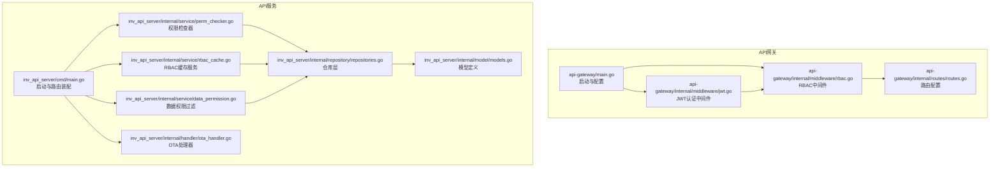
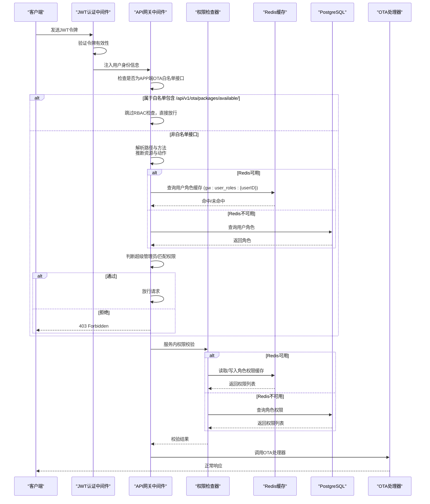
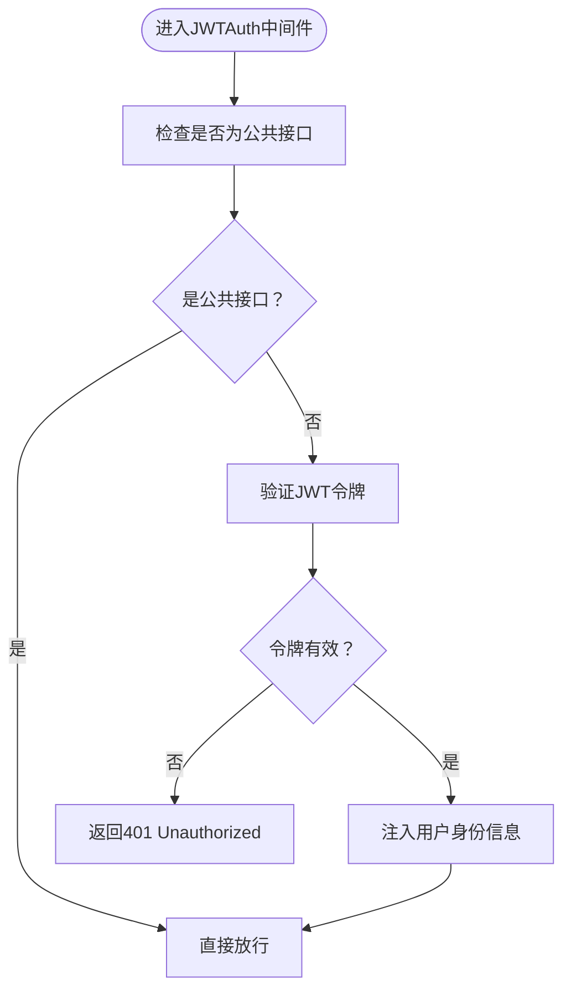
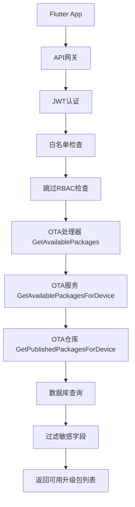
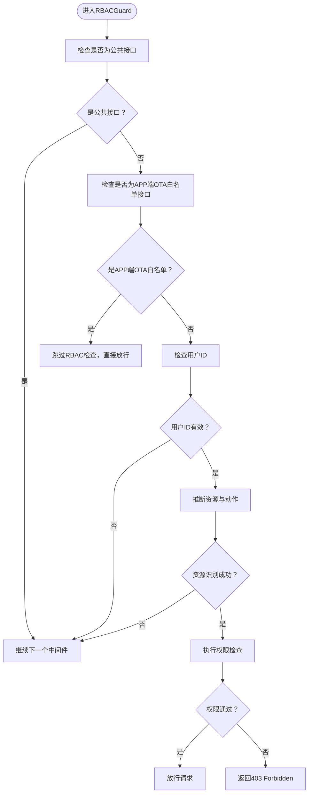
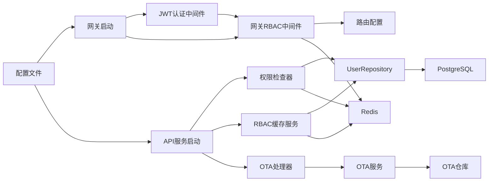
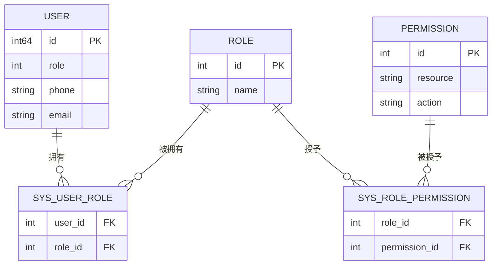
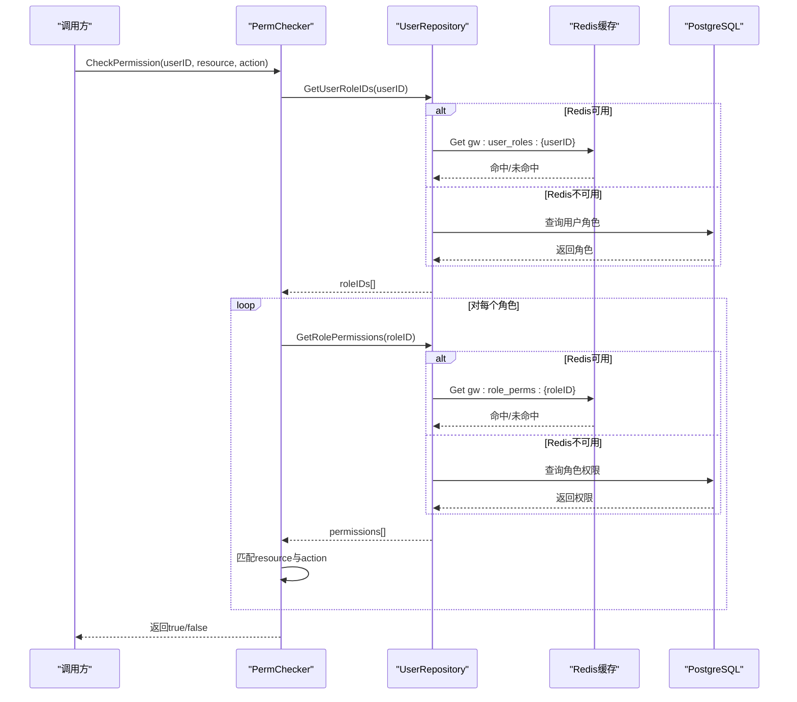
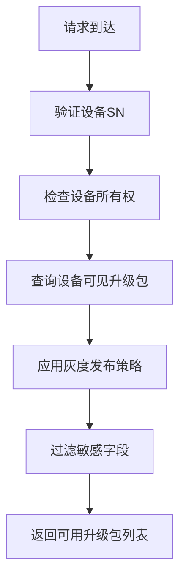

# RBAC权限控制

<cite>
**本文引用的文件**
- [api-gateway/internal/middleware/rbac.go](file://api-gateway/internal/middleware/rbac.go)
- [api-gateway/internal/middleware/jwt.go](file://api-gateway/internal/middleware/jwt.go)
- [api-gateway/internal/routes/routes.go](file://api-gateway/internal/routes/routes.go)
- [api-gateway/main.go](file://api-gateway/main.go)
- [inv_api_server/internal/middleware/permission.go](file://inv_api_server/internal/middleware/permission.go)
- [inv_api_server/internal/service/rbac_cache.go](file://inv_api_server/internal/service/rbac_cache.go)
- [inv_api_server/internal/service/perm_checker.go](file://inv_api_server/internal/service/perm_checker.go)
- [inv_api_server/internal/service/data_permission.go](file://inv_api_server/internal/service/data_permission.go)
- [inv_api_server/internal/repository/repositories.go](file://inv_api_server/internal/repository/repositories.go)
- [inv_api_server/internal/model/models.go](file://inv_api_server/internal/model/models.go)
- [inv_api_server/internal/handler/ota_handler.go](file://inv_api_server/internal/handler/ota_handler.go)
- [inv_api_server/cmd/main.go](file://inv_api_server/cmd/main.go)
</cite>

## 更新摘要
**所做更改**
- **安全修复**：在网关RBAC白名单中添加 `/api/v1/ota/packages/available/` 路径，解决Flutter应用程序访问可用升级包列表端点的403权限不足问题
- 更新APP端OTA接口白名单机制章节，详细说明新增的可用升级包列表接口
- 更新故障排查指南，包含新的OTA接口访问问题的解决方案
- 完善OTA接口配置示例，展示完整的可用升级包列表接口支持

## 目录
1. [简介](#简介)
2. [项目结构](#项目结构)
3. [核心组件](#核心组件)
4. [架构总览](#架构总览)
5. [详细组件分析](#详细组件分析)
6. [APP端OTA接口白名单机制](#app端ota接口白名单机制)
7. [JWT认证与RBAC协作](#jwt认证与rbac协作)
8. [依赖关系分析](#依赖关系分析)
9. [性能考虑](#性能考虑)
10. [故障排查指南](#故障排查指南)
11. [结论](#结论)
12. [附录](#附录)

## 简介
本文件系统性阐述本项目的RBAC（基于角色的权限控制）中间件与服务实现，涵盖以下要点：
- RBAC模型核心概念：用户、角色、权限与资源的关系映射
- 权限检查机制：静态权限匹配、动态权限计算与缓存策略
- Redis缓存集成：权限数据存储、缓存更新与失效处理，采用统一的 `gw:user_roles:` 键命名约定
- 权限降级机制：在Redis不可用时的网关角色检查模式
- **安全修复** APP端OTA接口白名单机制：支持OTA相关接口的JWT认证但跳过RBAC检查，包括新增的可用升级包列表接口
- 权限配置示例：角色定义、权限分配与访问规则设置
- 与用户认证的集成方式与权限验证流程
- 权限调试工具与常见问题解决方案

## 项目结构
本项目在两个服务中实现了RBAC能力：
- API网关层（api-gateway）：提供轻量级RBAC中间件，支持Redis缓存与降级模式，包含APP端OTA接口白名单
- API服务层（inv_api_server）：提供更完整的权限检查器、缓存服务与数据权限过滤

**图表来源**
- [api-gateway/main.go:34-116](file://api-gateway/main.go#L34-L116)
- [api-gateway/internal/middleware/jwt.go:45-122](file://api-gateway/internal/middleware/jwt.go#L45-L122)
- [api-gateway/internal/middleware/rbac.go:209-264](file://api-gateway/internal/middleware/rbac.go#L209-L264)
- [api-gateway/internal/routes/routes.go:25-55](file://api-gateway/internal/routes/routes.go#L25-L55)
- [inv_api_server/internal/service/perm_checker.go:17-173](file://inv_api_server/internal/service/perm_checker.go#L17-L173)
- [inv_api_server/internal/handler/ota_handler.go:1265-1304](file://inv_api_server/internal/handler/ota_handler.go#L1265-L1304)

## 核心组件
- JWT认证中间件：负责验证JWT令牌，提取用户身份信息并注入到请求头中
- 网关RBAC中间件：负责根据请求路径与HTTP方法推断资源与动作，结合用户角色与权限进行快速判定，并支持Redis缓存与降级
- **安全修复** APP端OTA接口白名单：专门针对APP端OTA相关接口的路径前缀列表，这些接口已通过JWT认证保护，对所有登录用户开放，跳过RBAC权限检查，包括新增的可用升级包列表接口
- API服务权限检查器：提供细粒度的权限检查逻辑，支持内存缓存与Redis持久化缓存
- RBAC缓存服务：批量写入用户角色与角色权限到Redis，便于后续快速读取，采用统一的 `gw:user_roles:` 键命名约定
- 数据权限过滤：基于用户角色与设备访问视图生成SQL过滤条件，限制用户可见设备范围
- OTA处理器：提供OTA相关的业务逻辑处理，包括固件管理、升级包管理和设备升级控制
- 仓库层与模型：提供用户角色、角色权限等数据结构与查询接口

**章节来源**
- [api-gateway/internal/middleware/jwt.go:45-122](file://api-gateway/internal/middleware/jwt.go#L45-L122)
- [api-gateway/internal/middleware/rbac.go:190-207](file://api-gateway/internal/middleware/rbac.go#L190-L207)
- [api-gateway/internal/middleware/rbac.go:209-264](file://api-gateway/internal/middleware/rbac.go#L209-L264)
- [inv_api_server/internal/service/perm_checker.go:17-173](file://inv_api_server/internal/service/perm_checker.go#L17-L173)
- [inv_api_server/internal/handler/ota_handler.go:1265-1304](file://inv_api_server/internal/handler/ota_handler.go#L1265-L1304)

## 架构总览
RBAC在两个层面协同工作，包含安全修复后的APP端OTA接口白名单机制：
- 网关层：对公共API入口进行快速权限拦截，减少无效请求进入后端
- **安全修复** APP端OTA接口：通过JWT认证保护，对所有登录用户开放，跳过RBAC权限检查，包括新增的可用升级包列表接口
- 服务层：对具体业务接口进行细粒度权限校验，并提供数据级权限过滤

**图表来源**
- [api-gateway/internal/middleware/jwt.go:45-122](file://api-gateway/internal/middleware/jwt.go#L45-L122)
- [api-gateway/internal/middleware/rbac.go:209-264](file://api-gateway/internal/middleware/rbac.go#L209-L264)
- [inv_api_server/internal/service/perm_checker.go:41-74](file://inv_api_server/internal/service/perm_checker.go#L41-L74)
- [inv_api_server/internal/handler/ota_handler.go:1265-1304](file://inv_api_server/internal/handler/ota_handler.go#L1265-L1304)

## 详细组件分析

### JWT认证中间件（api-gateway）
- 令牌验证：解析Authorization头，验证JWT令牌的有效性和签名
- 用户信息注入：从JWT令牌中提取user_id、phone、role等信息，注入到请求头中
- 公共接口放行：对健康检查、登录注册等公共接口跳过认证
- **安全修复** OTA接口保护：APP端OTA接口通过JWT认证保护，确保只有登录用户才能访问，包括新增的可用升级包列表接口

**图表来源**
- [api-gateway/internal/middleware/jwt.go:45-122](file://api-gateway/internal/middleware/jwt.go#L45-L122)

**章节来源**
- [api-gateway/internal/middleware/jwt.go:13-43](file://api-gateway/internal/middleware/jwt.go#L13-L43)
- [api-gateway/internal/middleware/jwt.go:45-122](file://api-gateway/internal/middleware/jwt.go#L45-L122)

### 网关RBAC中间件（api-gateway）
- 资源映射：通过前缀映射将路径转换为资源标识，如/admin/映射为admin资源
- 动作映射：GET/POST/PUT/PATCH/DELETE分别映射为view/create/edit/delete
- **安全修复** 白名单检查：在权限检查前先检查是否为APP端OTA接口白名单，包括新增的 `/api/v1/ota/packages/available/` 路径
- 用户角色获取：优先从Redis读取用户角色缓存（键格式：`gw:user_roles:{userID}`）；若不可用则回退至数据库查询并写入Redis
- 角色权限获取：优先从Redis读取角色权限缓存；若不可用则查询数据库并写入Redis
- 权限判定：超级管理员（role==0）直接放行；否则遍历角色权限匹配资源与动作
- 缓存失效：提供按用户与按角色的缓存失效接口

**图表来源**
- [api-gateway/internal/middleware/rbac.go:135-176](file://api-gateway/internal/middleware/rbac.go#L135-L176)

**章节来源**
- [api-gateway/internal/middleware/rbac.go:19-176](file://api-gateway/internal/middleware/rbac.go#L19-L176)
- [api-gateway/internal/middleware/rbac.go:178-254](file://api-gateway/internal/middleware/rbac.go#L178-L254)
- [api-gateway/internal/middleware/rbac.go:256-285](file://api-gateway/internal/middleware/rbac.go#L256-L285)

## APP端OTA接口白名单机制

### 白名单设计原理
APP端OTA接口白名单机制是为了支持APP应用的OTA升级功能而设计的特殊权限策略：
- **JWT认证保护**：所有白名单接口都已通过JWT认证保护，确保只有合法登录用户才能访问
- **跳过RBAC检查**：由于这些接口面向所有登录用户，无需进行细粒度的RBAC权限检查
- **简化访问流程**：减少不必要的权限验证开销，提升APP端OTA功能的响应速度
- **安全修复** 新增可用升级包列表接口：解决Flutter应用程序访问 `/api/v1/ota/packages/available/:sn` 端点时的403权限不足问题

### 白名单接口列表
APP端OTA接口白名单包含以下路径前缀（**已更新**）：
- `/api/v1/ota/check/` - OTA版本检查接口
- `/api/v1/ota/trigger` - OTA升级触发接口  
- `/api/v1/ota/resend/` - OTA重新发送接口
- `/api/v1/ota/devices/` - OTA设备相关接口
- `/api/v1/ota/app/check` - APP端OTA版本检查接口
- `/api/v1/ota/app/packages` - APP端OTA包管理接口
- **`/api/v1/ota/packages/available/`** - **新增** 设备可用升级包列表接口

### 新增可用升级包列表接口详解
**安全修复** 新增的 `/api/v1/ota/packages/available/:sn` 接口专门为Flutter应用程序提供设备可用的升级包列表：

#### 接口特性
- **路径模式**：`/api/v1/ota/packages/available/{device_sn}`
- **认证要求**：需要有效的JWT令牌
- **权限检查**：跳过RBAC权限检查，所有登录用户可访问
- **功能描述**：根据设备SN查询该设备可见的已发布升级包列表

#### 后端实现

**图表来源**
- [inv_api_server/internal/handler/ota_handler.go:1265-1304](file://inv_api_server/internal/handler/ota_handler.go#L1265-L1304)
- [inv_api_server/internal/repository/ota_repository.go:715-745](file://inv_api_server/internal/repository/ota_repository.go#L715-L745)

#### 安全考虑
- **设备所有权验证**：后端会验证设备是否属于当前用户
- **灰度发布支持**：支持按型号、用户、设备的灰度发布策略
- **敏感信息过滤**：只返回App端需要的信息，过滤内部敏感字段
- **权限隔离**：每个用户只能看到自己设备相关的升级包

### 白名单检查流程

**图表来源**
- [api-gateway/internal/middleware/rbac.go:209-264](file://api-gateway/internal/middleware/rbac.go#L209-L264)
- [api-gateway/internal/middleware/rbac.go:190-207](file://api-gateway/internal/middleware/rbac.go#L190-L207)

**章节来源**
- [api-gateway/internal/middleware/rbac.go:190-207](file://api-gateway/internal/middleware/rbac.go#L190-L207)
- [api-gateway/internal/middleware/rbac.go:209-264](file://api-gateway/internal/middleware/rbac.go#L209-L264)
- [inv_api_server/internal/handler/ota_handler.go:1265-1304](file://inv_api_server/internal/handler/ota_handler.go#L1265-L1304)

## JWT认证与RBAC协作

### 中间件执行顺序
API网关中的中间件按照以下顺序执行：
1. **TrailingSlashHandler** - 处理路径斜杠
2. **Recovery** - 错误恢复
3. **CORS** - 跨域处理
4. **RequestLogger** - 请求日志
5. **Prometheus** - 指标收集
6. **RateLimit** - 全局限流
7. **JWTAuth** - JWT认证
8. **RBACGuard** - RBAC权限检查

### 协作机制
- **JWT认证前置**：所有请求必须先通过JWT认证，提取用户身份信息
- **白名单优先**：在RBAC检查前先检查APP端OTA白名单，包括新增的可用升级包列表接口
- **用户信息传递**：JWT中间件将user_id、role等信息注入到请求头中
- **RBAC利用信息**：RBAC中间件从请求头中读取用户身份信息进行权限检查

### 用户身份信息注入
JWT中间件会将以下信息注入到请求头中：
- `X-User-ID`：用户ID
- `X-User-Phone`：用户手机号
- `X-User-Role`：用户角色
- `X-User-Sub`：用户子标识

**章节来源**
- [api-gateway/internal/routes/routes.go:25-55](file://api-gateway/internal/routes/routes.go#L25-L55)
- [api-gateway/internal/middleware/jwt.go:104-115](file://api-gateway/internal/middleware/jwt.go#L104-L115)
- [api-gateway/internal/middleware/rbac.go:246](file://api-gateway/internal/middleware/rbac.go#L246)

## 依赖关系分析
- 网关启动与配置：根据配置决定是否启用RBAC以及Redis可用性，选择不同降级策略
- **安全修复** 中间件装配：JWT认证中间件在RBAC中间件之前执行，确保用户身份信息可用，白名单检查包含新增的可用升级包列表接口
- API服务启动与装配：同时初始化权限检查器与缓存服务，确保服务内权限校验与缓存同步
- OTA处理器依赖：OTA处理器依赖OTA服务和仓库层，提供设备升级包管理功能
- 仓库层提供统一的数据访问接口，权限检查器与缓存服务均依赖其查询用户角色与权限

**图表来源**
- [api-gateway/main.go:34-116](file://api-gateway/main.go#L34-L116)
- [api-gateway/internal/routes/routes.go:25-55](file://api-gateway/internal/routes/routes.go#L25-L55)
- [inv_api_server/internal/service/perm_checker.go:17-173](file://inv_api_server/internal/service/perm_checker.go#L17-L173)
- [inv_api_server/internal/handler/ota_handler.go:1265-1304](file://inv_api_server/internal/handler/ota_handler.go#L1265-L1304)

**章节来源**
- [api-gateway/main.go:34-116](file://api-gateway/main.go#L34-L116)
- [api-gateway/internal/routes/routes.go:25-55](file://api-gateway/internal/routes/routes.go#L25-L55)

## 性能考虑
- 缓存策略
  - 网关层：用户角色缓存键采用统一格式 `gw:user_roles:{userID}`，角色权限缓存键为 `gw:role_perms:{roleID}`，TTL可配置
  - 服务层：角色权限内存缓存带过期时间，Redis持久化缓存提升热路径性能
- **安全修复** 白名单优化：APP端OTA接口白名单跳过RBAC检查，包括新增的可用升级包列表接口，减少不必要的权限验证开销
- 并发与一致性
  - 网关层使用互斥锁保护内存缓存，避免并发写入竞争
  - 服务层使用互斥锁保护内存缓存，Redis作为最终一致性的外部存储
- 降级策略
  - Redis不可用时，网关与服务层均回退到数据库查询，保证功能可用性
- 查询优化
  - 数据权限过滤通过预计算的可见设备集合，避免复杂联表查询
- **新增** OTA接口优化：可用升级包列表接口经过专门的敏感字段过滤，减少数据传输量

**章节来源**
- [api-gateway/internal/middleware/rbac.go:281-300](file://api-gateway/internal/middleware/rbac.go#L281-L300)
- [inv_api_server/internal/service/perm_checker.go:154-173](file://inv_api_server/internal/service/perm_checker.go#L154-L173)
- [inv_api_server/internal/handler/ota_handler.go:1280-1304](file://inv_api_server/internal/handler/ota_handler.go#L1280-L1304)

## 故障排查指南
- 常见问题
  - 403权限不足：检查请求路径是否正确映射到资源与动作；确认用户角色与权限是否正确配置
  - **安全修复** OTA接口访问失败：检查是否为APP端OTA白名单接口，确认JWT令牌是否有效，特别是 `/api/v1/ota/packages/available/:sn` 接口
  - Flutter应用升级包列表无法访问：确认白名单配置包含 `/api/v1/ota/packages/available/` 路径前缀
  - JWT认证失败：检查Authorization头格式是否正确，确认JWT密钥配置是否正确
  - Redis连接失败：查看网关与API服务启动日志中的Redis连接提示；确认Redis服务状态
  - 权限未生效：确认缓存是否已失效或过期；必要时手动触发缓存失效
- 调试建议
  - 网关：开启DEBUG日志，观察RBAC中间件的资源推断与权限判定过程，特别是白名单检查
  - 服务：启用Zap日志，关注权限检查器的缓存命中与数据库回退情况
  - **安全修复** OTA接口：检查JWT认证日志，确认用户身份信息是否正确注入，特别关注可用升级包列表接口的访问日志
- 缓存失效
  - 网关：调用用户缓存失效接口清除用户角色缓存（键格式：`gw:user_roles:{userID}`），或调用角色缓存失效接口清除角色权限缓存
  - 服务：调用权限检查器或缓存服务提供的失效接口

**章节来源**
- [api-gateway/internal/middleware/rbac.go:256-285](file://api-gateway/internal/middleware/rbac.go#L256-L285)
- [api-gateway/internal/middleware/jwt.go:52-101](file://api-gateway/internal/middleware/jwt.go#L52-L101)
- [inv_api_server/internal/service/perm_checker.go:154-173](file://inv_api_server/internal/service/perm_checker.go#L154-L173)
- [inv_api_server/internal/handler/ota_handler.go:1265-1304](file://inv_api_server/internal/handler/ota_handler.go#L1265-L1304)

## 结论
本项目在网关与服务两层实现了完善的RBAC能力，包含安全修复后的APP端OTA接口白名单机制：
- 通过清晰的资源/动作映射与缓存策略，兼顾性能与一致性
- **安全修复** APP端OTA接口白名单机制：支持OTA相关接口的JWT认证但跳过RBAC检查，包括新增的可用升级包列表接口，提升APP端用户体验
- **安全修复** 解决Flutter应用程序访问可用升级包列表端点的403权限不足问题
- **新增** JWT认证与RBAC协作：中间件有序执行，确保用户身份信息正确传递
- **新增** 统一缓存键命名约定：采用 `gw:user_roles:` 格式，提升缓存系统的可维护性
- 在Redis不可用时提供可靠的降级方案，保障系统稳定性
- 提供数据级权限过滤，进一步细化访问边界
- 完整的缓存失效与调试手段，便于运维与排障
- **安全增强** OTA接口安全考虑：设备所有权验证、灰度发布支持和敏感信息过滤

## 附录

### RBAC模型与数据结构
- 用户：包含角色字段，用于快速判定超级管理员
- 角色：多对多关联用户，支持多角色场景
- 权限：以资源与动作的二元组表示，支持允许/拒绝标记
- 角色权限：角色与权限的关联表，支持批量授予与撤销

**图表来源**
- [inv_api_server/internal/model/models.go:5-20](file://inv_api_server/internal/model/models.go#L5-L20)
- [inv_api_server/internal/repository/repositories.go:433-459](file://inv_api_server/internal/repository/repositories.go#L433-L459)

### 权限检查流程（服务层）

**图表来源**
- [inv_api_server/internal/service/perm_checker.go:41-74](file://inv_api_server/internal/service/perm_checker.go#L41-L74)
- [inv_api_server/internal/repository/repositories.go:410-459](file://inv_api_server/internal/repository/repositories.go#L410-L459)

### 缓存键命名约定
系统采用统一的Redis缓存键命名约定，确保缓存键的一致性和可维护性：

- **用户角色缓存键**：`gw:user_roles:{userID}`
  - 用途：存储用户的完整角色ID列表
  - 数据格式：JSON数组或整数
  - TTL：可配置，默认5分钟

- **角色权限缓存键**：`gw:role_perms:{roleID}`
  - 用途：存储指定角色的所有权限条目
  - 数据格式：JSON数组
  - TTL：可配置，默认5分钟

这些缓存键格式在以下组件中使用：
- 网关RBAC中间件：用户角色缓存读取、写入和失效
- 服务端权限检查器：用户角色缓存读取、写入和失效
- RBAC缓存服务：批量写入用户角色和角色权限缓存

**章节来源**
- [api-gateway/internal/middleware/rbac.go:44-75](file://api-gateway/internal/middleware/rbac.go#L44-L75)
- [api-gateway/internal/middleware/rbac.go:282-301](file://api-gateway/internal/middleware/rbac.go#L282-L301)
- [inv_api_server/internal/service/perm_checker.go:76-112](file://inv_api_server/internal/service/perm_checker.go#L76-L112)
- [inv_api_server/internal/service/perm_checker.go:154-172](file://inv_api_server/internal/service/perm_checker.go#L154-L172)
- [inv_api_server/internal/service/rbac_cache.go:30-53](file://inv_api_server/internal/service/rbac_cache.go#L30-L53)

### APP端OTA接口白名单配置
APP端OTA接口白名单配置位于RBAC中间件中，包含以下接口前缀（**已更新**）：
- `/api/v1/ota/check/` - OTA版本检查
- `/api/v1/ota/trigger` - OTA升级触发
- `/api/v1/ota/resend/` - OTA重新发送
- `/api/v1/ota/devices/` - OTA设备相关
- `/api/v1/ota/app/check` - APP端OTA版本检查
- `/api/v1/ota/app/packages` - APP端OTA包管理
- **`/api/v1/ota/packages/available/`** - **新增** 设备可用升级包列表

这些接口的特点：
- **JWT认证保护**：所有接口都已通过JWT认证
- **跳过RBAC**：无需进行RBAC权限检查
- **面向所有登录用户**：任何登录用户都可以访问
- **安全增强** 可用升级包列表接口：支持设备所有权验证和灰度发布策略

**章节来源**
- [api-gateway/internal/middleware/rbac.go:190-207](file://api-gateway/internal/middleware/rbac.go#L190-L207)
- [api-gateway/internal/middleware/rbac.go:209-264](file://api-gateway/internal/middleware/rbac.go#L209-L264)
- [inv_api_server/internal/handler/ota_handler.go:1265-1304](file://inv_api_server/internal/handler/ota_handler.go#L1265-L1304)

### 新增可用升级包列表接口技术细节

#### 接口定义
- **路径**：`GET /api/v1/ota/packages/available/:sn`
- **参数**：`sn` - 设备序列号
- **认证**：需要有效的JWT令牌
- **权限**：跳过RBAC检查，所有登录用户可访问

#### 后端处理流程

**图表来源**
- [inv_api_server/internal/handler/ota_handler.go:1265-1304](file://inv_api_server/internal/handler/ota_handler.go#L1265-L1304)
- [inv_api_server/internal/repository/ota_repository.go:715-745](file://inv_api_server/internal/repository/ota_repository.go#L715-L745)

#### 安全考虑
- **设备所有权验证**：确保用户只能访问自己的设备
- **灰度发布支持**：支持按型号、用户、设备的精细化发布控制
- **敏感信息过滤**：只返回App端必要的信息，保护内部数据
- **权限隔离**：每个用户的数据完全隔离

**章节来源**
- [inv_api_server/internal/handler/ota_handler.go:1265-1304](file://inv_api_server/internal/handler/ota_handler.go#L1265-L1304)
- [inv_api_server/internal/repository/ota_repository.go:715-745](file://inv_api_server/internal/repository/ota_repository.go#L715-L745)