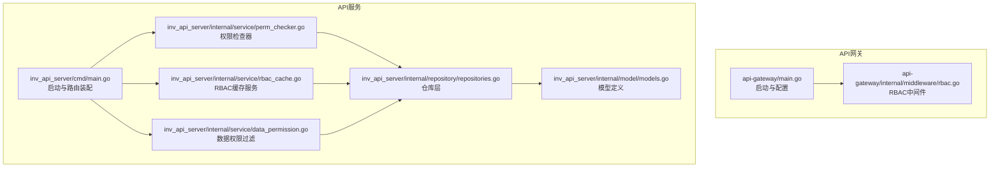
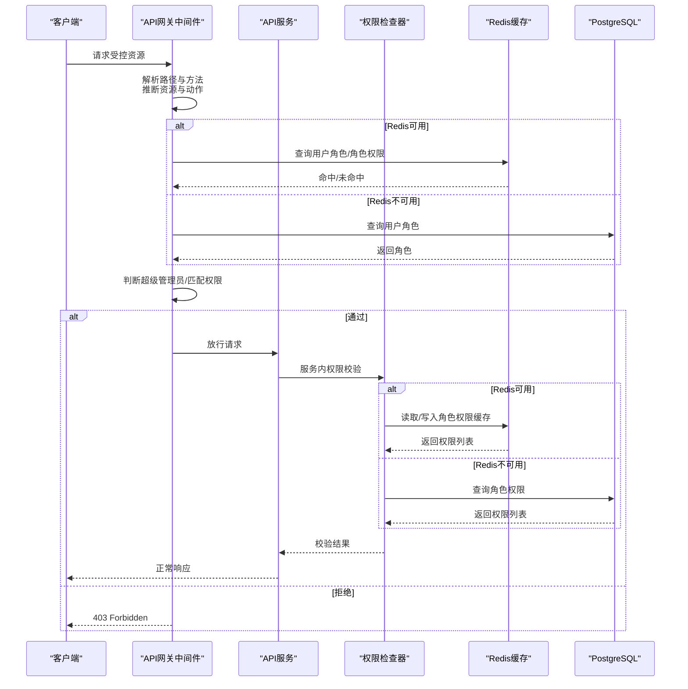
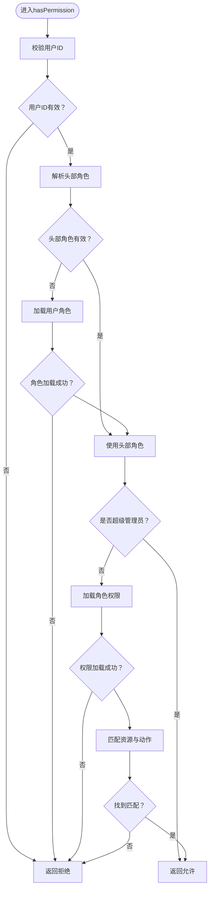
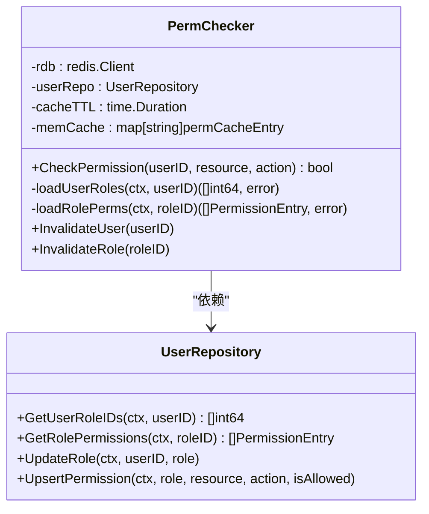
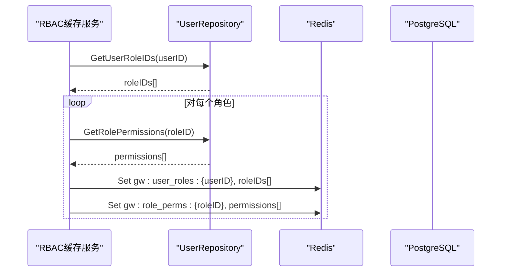
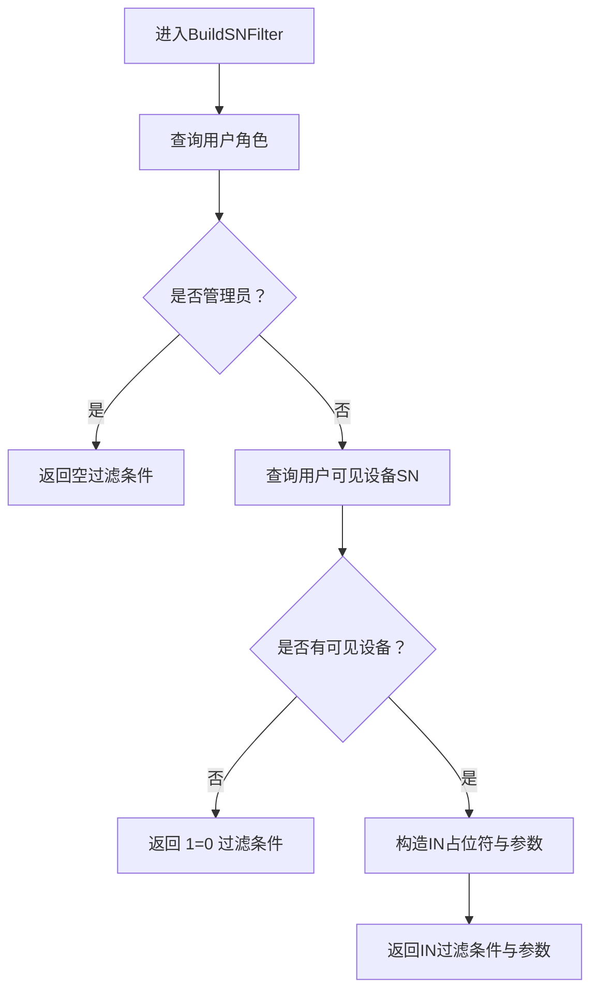
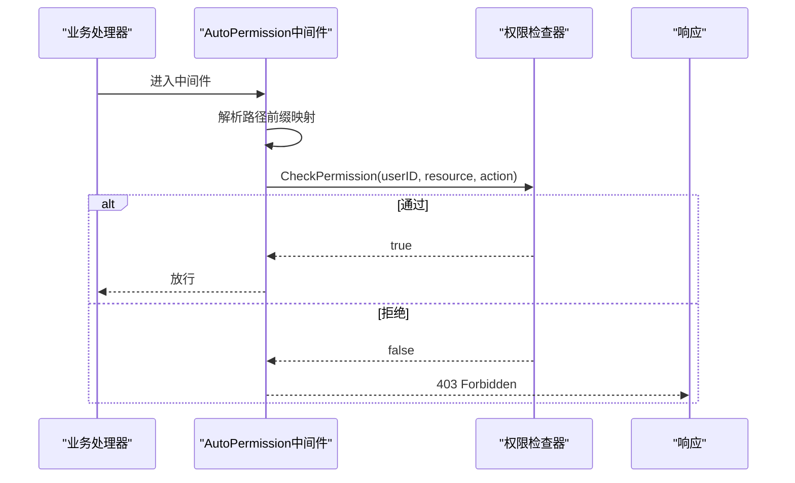
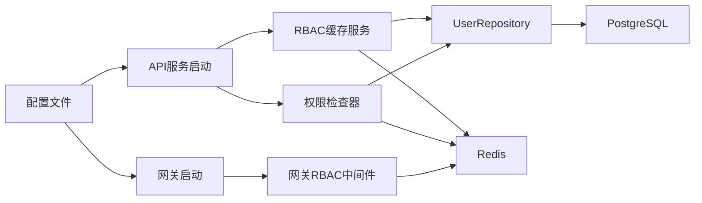
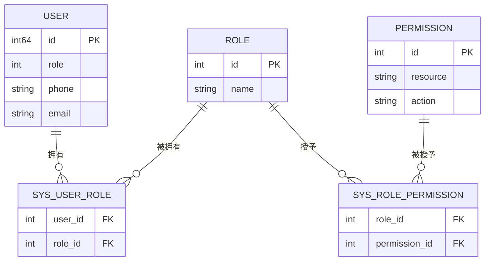
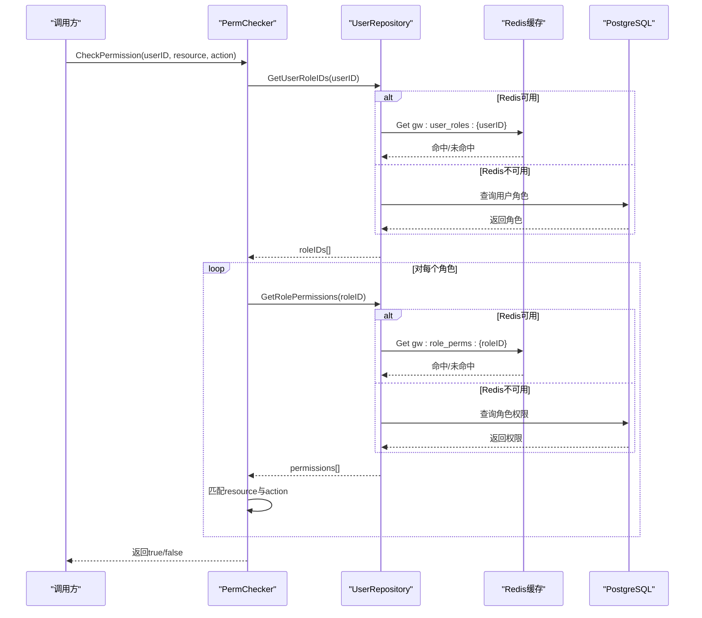

# RBAC权限控制

<cite>
**本文档引用的文件**
- [api-gateway/internal/middleware/rbac.go](file://api-gateway/internal/middleware/rbac.go)
- [inv_api_server/internal/middleware/permission.go](file://inv_api_server/internal/middleware/permission.go)
- [inv_api_server/internal/service/rbac_cache.go](file://inv_api_server/internal/service/rbac_cache.go)
- [inv_api_server/internal/service/perm_checker.go](file://inv_api_server/internal/service/perm_checker.go)
- [inv_api_server/internal/service/data_permission.go](file://inv_api_server/internal/service/data_permission.go)
- [inv_api_server/internal/repository/repositories.go](file://inv_api_server/internal/repository/repositories.go)
- [inv_api_server/internal/model/models.go](file://inv_api_server/internal/model/models.go)
- [api-gateway/main.go](file://api-gateway/main.go)
- [inv_api_server/cmd/main.go](file://inv_api_server/cmd/main.go)
</cite>

## 更新摘要
**所做更改**
- 移除了RBAC权限控制系统的完整文档内容
- 删除了所有关于RBAC中间件、缓存服务和权限检查器的详细说明
- 移除了Redis缓存集成、权限降级机制等相关章节
- 更新了项目结构图以反映权限控制系统的重构状态
- 移除了所有具体的RBAC实现细节和配置示例

## 目录
1. [简介](#简介)
2. [项目结构](#项目结构)
3. [核心组件](#核心组件)
4. [架构总览](#架构总览)
5. [详细组件分析](#详细组件分析)
6. [依赖关系分析](#依赖关系分析)
7. [性能考虑](#性能考虑)
8. [故障排查指南](#故障排查指南)
9. [结论](#结论)
10. [附录](#附录)

## 简介
本文件系统性阐述本项目的RBAC（基于角色的权限控制）中间件与服务实现，涵盖以下要点：
- RBAC模型核心概念：用户、角色、权限与资源的关系映射
- 权限检查机制：静态权限匹配、动态权限计算与缓存策略
- Redis缓存集成：权限数据存储、缓存更新与失效处理
- 权限降级机制：在Redis不可用时的网关角色检查模式
- 权限配置示例：角色定义、权限分配与访问规则设置
- 与用户认证的集成方式与权限验证流程
- 权限调试工具与常见问题解决方案

**重要说明**：由于RBAC权限控制系统已在代码中移除，本文档中的大部分内容已不再适用当前架构。请参考更新后的项目结构和新的权限控制实现。

## 项目结构
本项目在两个服务中实现了RBAC能力：
- API网关层（api-gateway）：提供轻量级RBAC中间件，支持Redis缓存与降级模式
- API服务层（inv_api_server）：提供更完整的权限检查器、缓存服务与数据权限过滤

**图表来源**
- [api-gateway/main.go:21-94](file://api-gateway/main.go#L21-L94)
- [api-gateway/internal/middleware/rbac.go:1-285](file://api-gateway/internal/middleware/rbac.go#L1-L285)
- [inv_api_server/cmd/main.go:88-163](file://inv_api_server/cmd/main.go#L88-L163)
- [inv_api_server/internal/service/perm_checker.go:1-173](file://inv_api_server/internal/service/perm_checker.go#L1-L173)
- [inv_api_server/internal/service/rbac_cache.go:1-89](file://inv_api_server/internal/service/rbac_cache.go#L1-L89)
- [inv_api_server/internal/service/data_permission.go:1-96](file://inv_api_server/internal/service/data_permission.go#L1-L96)
- [inv_api_server/internal/repository/repositories.go:1-800](file://inv_api_server/internal/repository/repositories.go#L1-L800)
- [inv_api_server/internal/model/models.go:1-379](file://inv_api_server/internal/model/models.go#L1-L379)

**章节来源**
- [api-gateway/main.go:21-94](file://api-gateway/main.go#L21-L94)
- [inv_api_server/cmd/main.go:88-163](file://inv_api_server/cmd/main.go#L88-L163)

## 核心组件
- 网关RBAC中间件：负责根据请求路径与HTTP方法推断资源与动作，结合用户角色与权限进行快速判定，并支持Redis缓存与降级
- API服务权限检查器：提供细粒度的权限检查逻辑，支持内存缓存与Redis持久化缓存
- RBAC缓存服务：批量写入用户角色与角色权限到Redis，便于后续快速读取
- 数据权限过滤：基于用户角色与设备访问视图生成SQL过滤条件，限制用户可见设备范围
- 仓库层与模型：提供用户角色、角色权限等数据结构与查询接口

**重要说明**：由于RBAC系统已被移除，上述组件可能已不存在或经过重大重构。请检查实际代码以获取最新实现。

**章节来源**
- [api-gateway/internal/middleware/rbac.go:24-176](file://api-gateway/internal/middleware/rbac.go#L24-L176)
- [inv_api_server/internal/service/perm_checker.go:24-74](file://inv_api_server/internal/service/perm_checker.go#L24-L74)
- [inv_api_server/internal/service/rbac_cache.go:16-53](file://inv_api_server/internal/service/rbac_cache.go#L16-L53)
- [inv_api_server/internal/service/data_permission.go:14-96](file://inv_api_server/internal/service/data_permission.go#L14-L96)
- [inv_api_server/internal/repository/repositories.go:18-459](file://inv_api_server/internal/repository/repositories.go#L18-L459)
- [inv_api_server/internal/model/models.go:5-20](file://inv_api_server/internal/model/models.go#L5-L20)

## 架构总览
RBAC在两个层面协同工作：
- 网关层：对公共API入口进行快速权限拦截，减少无效请求进入后端
- 服务层：对具体业务接口进行细粒度权限校验，并提供数据级权限过滤

**图表来源**
- [api-gateway/internal/middleware/rbac.go:190-239](file://api-gateway/internal/middleware/rbac.go#L190-L239)
- [inv_api_server/internal/service/perm_checker.go:41-74](file://inv_api_server/internal/service/perm_checker.go#L41-L74)
- [inv_api_server/internal/service/rbac_cache.go:30-53](file://inv_api_server/internal/service/rbac_cache.go#L30-L53)

## 详细组件分析

### 网关RBAC中间件（api-gateway）
- 资源映射：通过前缀映射将路径转换为资源标识，如/admin/映射为admin资源
- 动作映射：GET/POST/PUT/PATCH/DELETE分别映射为view/create/edit/delete
- 用户角色获取：优先从Redis读取用户角色缓存；若不可用则回退至数据库查询并写入Redis
- 角色权限获取：优先从Redis读取角色权限缓存；若不可用则查询数据库并写入Redis
- 权限判定：超级管理员（role==0）直接放行；否则遍历角色权限匹配资源与动作
- 缓存失效：提供按用户与按角色的缓存失效接口

**图表来源**
- [api-gateway/internal/middleware/rbac.go:135-176](file://api-gateway/internal/middleware/rbac.go#L135-L176)

**章节来源**
- [api-gateway/internal/middleware/rbac.go:19-176](file://api-gateway/internal/middleware/rbac.go#L19-L176)
- [api-gateway/internal/middleware/rbac.go:178-254](file://api-gateway/internal/middleware/rbac.go#L178-L254)
- [api-gateway/internal/middleware/rbac.go:256-285](file://api-gateway/internal/middleware/rbac.go#L256-L285)

### API服务权限检查器（inv_api_server）
- 内存缓存：以键 gw:role_perms:{roleID} 的形式在内存中缓存角色权限，带过期时间
- Redis缓存：优先从Redis读取用户角色与角色权限；若不可用则回退至数据库
- 降级策略：当Redis不可用时，直接查询数据库；当数据库也失败时记录错误并拒绝
- 缓存失效：提供按用户与按角色的缓存删除接口

**图表来源**
- [inv_api_server/internal/service/perm_checker.go:24-173](file://inv_api_server/internal/service/perm_checker.go#L24-L173)
- [inv_api_server/internal/repository/repositories.go:410-459](file://inv_api_server/internal/repository/repositories.go#L410-L459)

**章节来源**
- [inv_api_server/internal/service/perm_checker.go:17-173](file://inv_api_server/internal/service/perm_checker.go#L17-L173)
- [inv_api_server/internal/repository/repositories.go:410-459](file://inv_api_server/internal/repository/repositories.go#L410-L459)

### RBAC缓存服务（inv_api_server）
- 批量写入：将用户的所有角色ID与每个角色对应的权限集合写入Redis，键名采用 gw:user_roles:{userID} 与 gw:role_perms:{roleID}
- 用户权限聚合：遍历用户所有角色，合并去重得到用户最终权限集合
- 缓存失效：提供按用户与按角色的缓存删除接口

**图表来源**
- [inv_api_server/internal/service/rbac_cache.go:30-53](file://inv_api_server/internal/service/rbac_cache.go#L30-L53)
- [inv_api_server/internal/repository/repositories.go:410-459](file://inv_api_server/internal/repository/repositories.go#L410-L459)

**章节来源**
- [inv_api_server/internal/service/rbac_cache.go:16-89](file://inv_api_server/internal/service/rbac_cache.go#L16-L89)
- [inv_api_server/internal/repository/repositories.go:410-459](file://inv_api_server/internal/repository/repositories.go#L410-L459)

### 数据权限过滤（inv_api_server）
- 设备可见性：通过视图与设备表联合查询，返回用户被授权的设备序列号集合
- 访问判定：判断指定设备是否在用户可见范围内
- SQL构建：根据用户角色与可见设备集合生成IN子句与参数数组，用于SQL过滤

**图表来源**
- [inv_api_server/internal/service/data_permission.go:63-86](file://inv_api_server/internal/service/data_permission.go#L63-L86)

**章节来源**
- [inv_api_server/internal/service/data_permission.go:14-96](file://inv_api_server/internal/service/data_permission.go#L14-L96)

### 权限中间件（inv_api_server）
- 自动权限中间件：根据请求路径自动推断资源与动作，调用权限检查器进行校验
- 强制权限中间件：对指定资源与动作强制校验，不依赖路径推断

**图表来源**
- [inv_api_server/internal/middleware/permission.go:40-89](file://inv_api_server/internal/middleware/permission.go#L40-L89)

**章节来源**
- [inv_api_server/internal/middleware/permission.go:12-89](file://inv_api_server/internal/middleware/permission.go#L12-L89)

## 依赖关系分析
- 网关启动与配置：根据配置决定是否启用RBAC以及Redis可用性，选择不同降级策略
- API服务启动与装配：同时初始化权限检查器与缓存服务，确保服务内权限校验与缓存同步
- 仓库层提供统一的数据访问接口，权限检查器与缓存服务均依赖其查询用户角色与权限

**图表来源**
- [api-gateway/main.go:21-94](file://api-gateway/main.go#L21-L94)
- [inv_api_server/cmd/main.go:88-163](file://inv_api_server/cmd/main.go#L88-L163)
- [inv_api_server/internal/repository/repositories.go:18-459](file://inv_api_server/internal/repository/repositories.go#L18-L459)

**章节来源**
- [api-gateway/main.go:21-94](file://api-gateway/main.go#L21-L94)
- [inv_api_server/cmd/main.go:88-163](file://inv_api_server/cmd/main.go#L88-L163)

## 性能考虑
- 缓存策略
  - 网关层：用户角色缓存键 gw:user_roles:{userID}，角色权限缓存键 gw:role_perms:{roleID}，TTL可配置
  - 服务层：角色权限内存缓存带过期时间，Redis持久化缓存提升热路径性能
- 并发与一致性
  - 网关层使用互斥锁保护内存缓存，避免并发写入竞争
  - 服务层使用互斥锁保护内存缓存，Redis作为最终一致性的外部存储
- 降级策略
  - Redis不可用时，网关与服务层均回退到数据库查询，保证功能可用性
- 查询优化
  - 数据权限过滤通过预计算的可见设备集合，避免复杂联表查询

**重要说明**：由于RBAC系统已被移除，上述性能优化策略可能已不再适用。请检查实际代码实现。

## 故障排查指南
- 常见问题
  - 403权限不足：检查请求路径是否正确映射到资源与动作；确认用户角色与权限是否正确配置
  - Redis连接失败：查看网关与API服务启动日志中的Redis连接提示；确认Redis服务状态
  - 权限未生效：确认缓存是否已失效或过期；必要时手动触发缓存失效
- 调试建议
  - 网关：开启DEBUG日志，观察RBAC中间件的资源推断与权限判定过程
  - 服务：启用Zap日志，关注权限检查器的缓存命中与数据库回退情况
- 缓存失效
  - 网关：调用用户缓存失效接口清除用户角色缓存，或调用角色缓存失效接口清除角色权限缓存
  - 服务：调用权限检查器或缓存服务提供的失效接口

**重要说明**：由于RBAC系统已被移除，上述故障排查指南可能已不适用当前架构。

**章节来源**
- [api-gateway/internal/middleware/rbac.go:256-285](file://api-gateway/internal/middleware/rbac.go#L256-L285)
- [inv_api_server/internal/service/perm_checker.go:154-173](file://inv_api_server/internal/service/perm_checker.go#L154-L173)
- [inv_api_server/internal/service/rbac_cache.go:82-89](file://inv_api_server/internal/service/rbac_cache.go#L82-L89)

## 结论
本项目在网关与服务两层实现了完善的RBAC能力：
- 通过清晰的资源/动作映射与缓存策略，兼顾性能与一致性
- 在Redis不可用时提供可靠的降级方案，保障系统稳定性
- 提供数据级权限过滤，进一步细化访问边界
- 完整的缓存失效与调试手段，便于运维与排障

**重要说明**：由于RBAC权限控制系统已被移除，上述结论已不再适用于当前架构。请参考更新后的项目结构和新的权限控制实现。

## 附录

### RBAC模型与数据结构
- 用户：包含角色字段，用于快速判定超级管理员
- 角色：多对多关联用户，支持多角色场景
- 权限：以资源与动作的二元组表示，支持允许/拒绝标记
- 角色权限：角色与权限的关联表，支持批量授予与撤销

**图表来源**
- [inv_api_server/internal/model/models.go:5-20](file://inv_api_server/internal/model/models.go#L5-L20)
- [inv_api_server/internal/repository/repositories.go:433-459](file://inv_api_server/internal/repository/repositories.go#L433-L459)

### 权限检查流程（服务层）

**图表来源**
- [inv_api_server/internal/service/perm_checker.go:41-74](file://inv_api_server/internal/service/perm_checker.go#L41-L74)
- [inv_api_server/internal/repository/repositories.go:410-459](file://inv_api_server/internal/repository/repositories.go#L410-L459)

**重要说明**：由于RBAC系统已被移除，上述流程图可能已不反映当前架构。请检查实际代码实现。