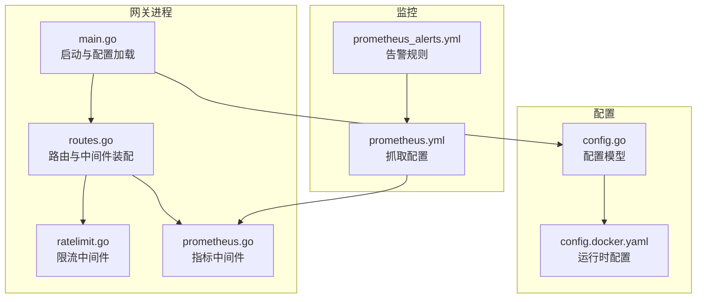
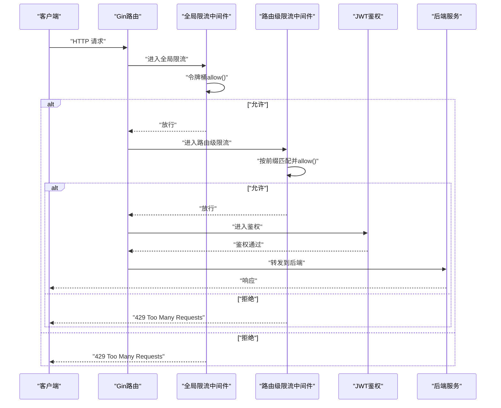
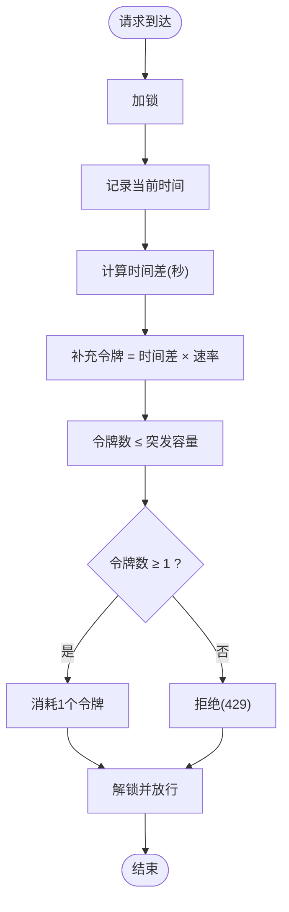
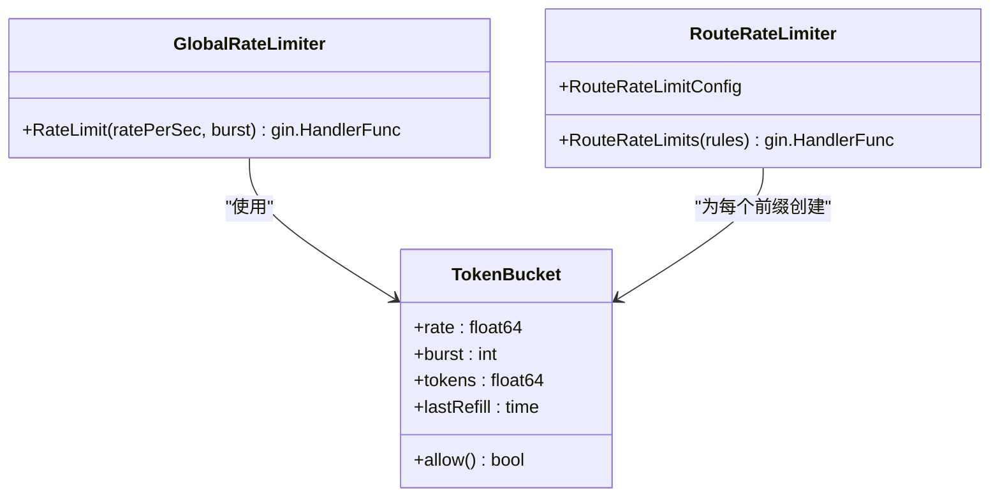
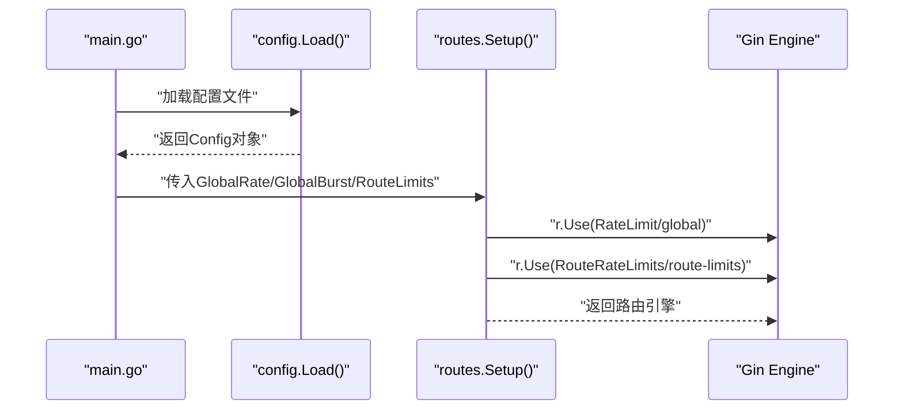
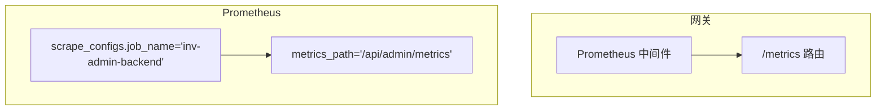
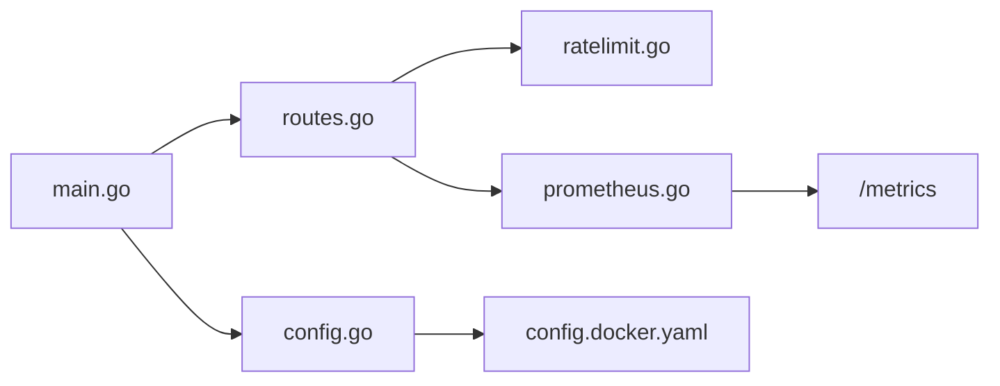

# 流量限制中间件

<cite>
**本文引用的文件**
- [ratelimit.go](file://api-gateway/internal/middleware/ratelimit.go)
- [config.go](file://api-gateway/internal/config/config.go)
- [routes.go](file://api-gateway/internal/routes/routes.go)
- [main.go](file://api-gateway/main.go)
- [config.docker.yaml](file://api-gateway/config.docker.yaml)
- [prometheus.go](file://api-gateway/internal/middleware/prometheus.go)
- [prometheus.yml](file://deploy/prometheus.yml)
- [prometheus_alerts.yml](file://deploy/prometheus_alerts.yml)
</cite>

## 目录
1. [简介](#简介)
2. [项目结构](#项目结构)
3. [核心组件](#核心组件)
4. [架构总览](#架构总览)
5. [详细组件分析](#详细组件分析)
6. [依赖关系分析](#依赖关系分析)
7. [性能考量](#性能考量)
8. [故障排查指南](#故障排查指南)
9. [结论](#结论)
10. [附录](#附录)

## 简介
本技术文档围绕 API 网关中的流量限制中间件展开，重点解释基于令牌桶算法的实现原理与参数配置，涵盖全局限流与路由级限流的差异、优先级与冲突处理；同时给出限流策略在 API 保护、DDoS 防护与资源保护等场景下的应用建议，并提供统计监控、配置示例、效果评估与性能优化建议，以及与 Prometheus 监控系统的集成与告警配置。

## 项目结构
API 网关采用 Gin 框架，限流中间件位于中间件层，配置来源于 YAML 文件并通过主程序加载注入路由链路。路由层负责挂载限流中间件并组织各业务路由。

图表来源
- [main.go:21-94](file://api-gateway/main.go#L21-L94)
- [routes.go:25-55](file://api-gateway/internal/routes/routes.go#L25-L55)
- [ratelimit.go:12-93](file://api-gateway/internal/middleware/ratelimit.go#L12-L93)
- [prometheus.go:17-65](file://api-gateway/internal/middleware/prometheus.go#L17-L65)
- [config.go:10-86](file://api-gateway/internal/config/config.go#L10-L86)
- [config.docker.yaml:1-39](file://api-gateway/config.docker.yaml#L1-L39)
- [prometheus.yml:13-33](file://deploy/prometheus.yml#L13-L33)
- [prometheus_alerts.yml:6-78](file://deploy/prometheus_alerts.yml#L6-L78)

章节来源
- [main.go:21-94](file://api-gateway/main.go#L21-L94)
- [routes.go:25-55](file://api-gateway/internal/routes/routes.go#L25-L55)
- [config.go:10-86](file://api-gateway/internal/config/config.go#L10-L86)
- [config.docker.yaml:1-39](file://api-gateway/config.docker.yaml#L1-L39)

## 核心组件
- 令牌桶结构体：封装速率、突发容量、当前令牌数与上次填充时间，并以互斥锁保证并发安全。
- 全局限流中间件：对所有请求生效，基于单个令牌桶进行判断。
- 路由级限流中间件：按路径前缀匹配，为每个前缀维护独立令牌桶，命中即执行限流。
- 配置模型：支持全局限流与多条路由级限流规则的 YAML 定义。
- 指标中间件：提供请求总量、处理耗时与并发请求数等 Prometheus 指标。

章节来源
- [ratelimit.go:12-93](file://api-gateway/internal/middleware/ratelimit.go#L12-L93)
- [config.go:29-38](file://api-gateway/internal/config/config.go#L29-L38)
- [prometheus.go:17-65](file://api-gateway/internal/middleware/prometheus.go#L17-L65)

## 架构总览
限流中间件在路由链中处于鉴权之前，确保在进入业务逻辑前完成请求频率控制。全局限流与路由级限流可同时启用，路由级规则按前缀匹配优先于全局限流。

图表来源
- [routes.go:37-47](file://api-gateway/internal/routes/routes.go#L37-L47)
- [ratelimit.go:48-62](file://api-gateway/internal/middleware/ratelimit.go#L48-L62)
- [ratelimit.go:70-93](file://api-gateway/internal/middleware/ratelimit.go#L70-L93)

## 详细组件分析

### 令牌桶算法实现与参数
- 参数含义
  - 速率（rate）：每秒补充的令牌数量，决定稳定吞吐能力。
  - 突发容量（burst）：令牌桶最大容量，允许短时突发。
  - 当前令牌数（tokens）：当前可用令牌，初始等于突发容量。
  - 上次填充时间（lastRefill）：用于计算自上次以来应补充的令牌数。
- 填充机制
  - 每次请求到来时，根据时间差计算应补充的令牌数并累加，不超过突发上限。
  - 若令牌足够（≥1），消耗一个令牌并放行；否则拒绝。
- 并发安全
  - 使用互斥锁保护令牌桶状态，避免并发竞争导致的状态不一致。

图表来源
- [ratelimit.go:29-46](file://api-gateway/internal/middleware/ratelimit.go#L29-L46)

章节来源
- [ratelimit.go:12-46](file://api-gateway/internal/middleware/ratelimit.go#L12-L46)

### 全局限流与路由级限流
- 全局限流
  - 在路由装配阶段添加全局限流中间件，作用于所有请求。
  - 适合对整体流量进行兜底保护。
- 路由级限流
  - 为特定路径前缀配置独立令牌桶，命中即执行限流。
  - 适合对敏感接口（如登录、注册、验证码）进行更细粒度的保护。
- 优先级与冲突
  - 路由级限流在全局限流之后执行，若路由级规则命中则优先应用其策略。
  - 若多个路由规则匹配同一路径，按遍历顺序命中第一个规则并中断后续匹配。

图表来源
- [ratelimit.go:12-18](file://api-gateway/internal/middleware/ratelimit.go#L12-L18)
- [ratelimit.go:48-62](file://api-gateway/internal/middleware/ratelimit.go#L48-L62)
- [ratelimit.go:70-93](file://api-gateway/internal/middleware/ratelimit.go#L70-L93)

章节来源
- [routes.go:37-41](file://api-gateway/internal/routes/routes.go#L37-L41)
- [ratelimit.go:48-62](file://api-gateway/internal/middleware/ratelimit.go#L48-L62)
- [ratelimit.go:70-93](file://api-gateway/internal/middleware/ratelimit.go#L70-L93)

### 配置模型与加载流程
- 配置项
  - 全局限流：rate、burst
  - 路由级限流：path_prefix、rate、burst 列表
- 加载与注入
  - 主程序从 YAML 加载配置，构造路由级限流配置数组并传入路由装配函数。
  - 路由装配函数将全局与路由级限流中间件按顺序挂载到 Gin 引擎。

图表来源
- [main.go:25-70](file://api-gateway/main.go#L25-L70)
- [config.go:57-82](file://api-gateway/internal/config/config.go#L57-L82)
- [routes.go:25-55](file://api-gateway/internal/routes/routes.go#L25-L55)

章节来源
- [config.go:10-38](file://api-gateway/internal/config/config.go#L10-L38)
- [main.go:53-70](file://api-gateway/main.go#L53-L70)
- [routes.go:25-55](file://api-gateway/internal/routes/routes.go#L25-L55)

### 限流策略应用场景
- API 保护
  - 对公开接口设置合理的全局速率，防止滥用与爬虫。
  - 对认证类接口设置更低的速率与较小的突发，降低暴力破解风险。
- DDoS 防护
  - 结合路由级限流针对热点接口（如登录、验证码）进行强约束。
  - 配合上游负载均衡与防火墙策略形成多层防护。
- 资源保护
  - 控制数据库/缓存/外部服务的访问频率，避免过载。
  - 通过突发容量应对短时峰值，平衡用户体验与系统稳定性。

### 限流状态统计与监控
- 指标维度
  - 请求总量：按方法、路径、状态码统计。
  - 处理耗时：按方法、路径、状态码分位统计。
  - 并发请求数：当前正在处理的请求数。
- Prometheus 集成
  - 指标中间件在非 /metrics 路径上进行埋点，自动暴露指标。
  - Prometheus 通过静态配置抓取网关指标端点。

图表来源
- [routes.go:66](file://api-gateway/internal/routes/routes.go#L66)
- [prometheus.go:42-65](file://api-gateway/internal/middleware/prometheus.go#L42-L65)
- [prometheus.yml:14-18](file://deploy/prometheus.yml#L14-L18)

章节来源
- [prometheus.go:17-65](file://api-gateway/internal/middleware/prometheus.go#L17-L65)
- [prometheus.yml:13-33](file://deploy/prometheus.yml#L13-L33)

### 配置示例与动态调整
- 示例配置
  - 全局限流：rate=100/s，burst=200
  - 路由级限流：
    - /api/v1/devices：rate=50/s，burst=100
    - /api/v1/auth/login：rate=10/s，burst=20
    - /api/v1/auth/register：rate=5/s，burst=10
    - /api/v1/auth/send-code：rate=2/s，burst=5
- 动态调整
  - 通过修改配置文件并重启网关生效。
  - 生产环境建议配合配置热更新或滚动发布策略，减少停机时间。

章节来源
- [config.docker.yaml:8-25](file://api-gateway/config.docker.yaml#L8-L25)
- [main.go:84-87](file://api-gateway/main.go#L84-L87)

### 效果评估与性能优化建议
- 评估指标
  - 429 拒绝率：衡量限流策略是否过严或不足。
  - 响应延迟分布：观察限流是否造成显著排队。
  - 并发峰值：确认令牌桶突发能覆盖短时高峰。
- 优化建议
  - 合理设置 rate 与 burst：以 95/99 分位延迟为目标调参。
  - 分层限流：全局限流兜底，路由级限流精细化。
  - 缓存与异步：对高并发写操作引入本地缓存与异步队列，降低瞬时压力。
  - 监控告警：结合 Prometheus 与告警规则，及时发现异常波动。

## 依赖关系分析
- 组件耦合
  - 路由层依赖中间件层，中间件层依赖配置层。
  - 限流中间件与指标中间件相互独立，均可按需启用。
- 外部依赖
  - Gin：路由与中间件框架。
  - Prometheus：指标采集与暴露。
  - Redis：用于 RBAC 缓存（与限流无直接耦合）。

图表来源
- [routes.go:25-55](file://api-gateway/internal/routes/routes.go#L25-L55)
- [ratelimit.go:48-93](file://api-gateway/internal/middleware/ratelimit.go#L48-L93)
- [prometheus.go:42-65](file://api-gateway/internal/middleware/prometheus.go#L42-L65)
- [main.go:25-70](file://api-gateway/main.go#L25-L70)
- [config.go:57-82](file://api-gateway/internal/config/config.go#L57-L82)
- [config.docker.yaml:1-39](file://api-gateway/config.docker.yaml#L1-L39)

章节来源
- [routes.go:25-55](file://api-gateway/internal/routes/routes.go#L25-L55)
- [main.go:25-70](file://api-gateway/main.go#L25-L70)
- [config.go:57-82](file://api-gateway/internal/config/config.go#L57-L82)

## 性能考量
- 令牌桶实现为 O(1) 操作，开销极低，适合高并发场景。
- 并发安全通过互斥锁保障，建议避免在同一令牌桶上过度细分，以免增加锁竞争。
- 路由级限流按前缀匹配，建议合理设计路径前缀，避免过多规则导致匹配成本上升。
- 指标中间件对 /metrics 路径有特殊处理，避免对自身指标产生干扰。

## 故障排查指南
- 常见问题
  - 429 频繁出现：检查全局与路由级限流配置是否过严，适当提高 rate 或 burst。
  - 指标缺失：确认 /metrics 路由已注册且 Prometheus 抓取配置正确。
  - 配置未生效：核对配置文件路径与环境变量替换，确保主程序正确加载。
- 排查步骤
  - 查看网关启动日志中的限流配置打印，确认加载结果。
  - 通过 /metrics 端点验证指标是否正常暴露。
  - 使用 Prometheus 查询表达式验证指标数据。

章节来源
- [main.go:84-87](file://api-gateway/main.go#L84-L87)
- [routes.go:66](file://api-gateway/internal/routes/routes.go#L66)
- [prometheus.yml:14-18](file://deploy/prometheus.yml#L14-L18)

## 结论
本限流中间件以轻量高效的令牌桶为核心，支持全局与路由级双层限流策略，满足 API 保护、DDoS 防护与资源保护等多场景需求。结合 Prometheus 指标与告警体系，可实现对限流效果的持续观测与优化。建议在生产环境中采用分层限流与渐进式调参策略，确保在保障系统稳定的同时维持良好的用户体验。

## 附录
- Prometheus 监控与告警
  - 抓取配置：通过静态配置 job 指向网关指标端点。
  - 告警规则：可参考现有告警模板，结合限流相关指标进行扩展。

章节来源
- [prometheus.yml:13-33](file://deploy/prometheus.yml#L13-L33)
- [prometheus_alerts.yml:6-78](file://deploy/prometheus_alerts.yml#L6-L78)