# 网关概述与架构

<cite>
**本文引用的文件**   
- [main.go](file://api-gateway/main.go)
- [config.go](file://api-gateway/internal/config/config.go)
- [routes.go](file://api-gateway/internal/routes/routes.go)
- [proxy.go](file://api-gateway/internal/proxy/proxy.go)
- [jwt.go](file://api-gateway/internal/middleware/jwt.go)
- [rbac.go](file://api-gateway/internal/middleware/rbac.go)
- [ratelimit.go](file://api-gateway/internal/middleware/ratelimit.go)
- [cors.go](file://api-gateway/internal/middleware/cors.go)
- [logger.go](file://api-gateway/internal/middleware/logger.go)
- [prometheus.go](file://api-gateway/internal/middleware/prometheus.go)
- [slash.go](file://api-gateway/internal/middleware/slash.go)
- [Dockerfile](file://api-gateway/Dockerfile)
- [docker-compose.yml](file://deploy/docker-compose.yml)
- [gateway.yaml](file://deploy/configs/gateway.yaml)
- [go.mod](file://api-gateway/go.mod)
- [README.md](file://README.md)
</cite>

## 目录
1. [引言](#引言)
2. [项目结构](#项目结构)
3. [核心组件](#核心组件)
4. [架构总览](#架构总览)
5. [详细组件分析](#详细组件分析)
6. [依赖分析](#依赖分析)
7. [性能考虑](#性能考虑)
8. [故障排查指南](#故障排查指南)
9. [结论](#结论)
10. [附录](#附录)

## 引言
本文件面向API网关的整体系统架构，阐述其作为统一入口的设计理念与职责边界。API网关负责对外暴露统一的HTTP接口，实现请求路由、鉴权与授权（JWT/RBAC）、速率限制、跨域、日志与监控指标采集，并将请求透明转发至API服务器与设备服务器。同时，网关通过配置文件与环境变量实现灵活的运行时配置，支持优雅关闭与健康检查，保障系统在生产环境中的稳定性与可观测性。

## 项目结构
API网关采用模块化组织，主要分为以下层次：
- 入口层：main.go 负责初始化配置、中间件、路由与HTTP服务生命周期管理
- 配置层：internal/config 提供配置加载与默认值设定
- 路由层：internal/routes 定义路由与端点，注册网关自身端点与后端代理
- 代理层：internal/proxy 封装反向代理与错误处理
- 中间件层：internal/middleware 提供JWT鉴权、RBAC授权、限流、CORS、日志、Prometheus指标、斜杠处理等能力
- 部署与配置：Dockerfile、docker-compose.yml、deploy/configs/gateway.yaml 提供容器化与编排配置

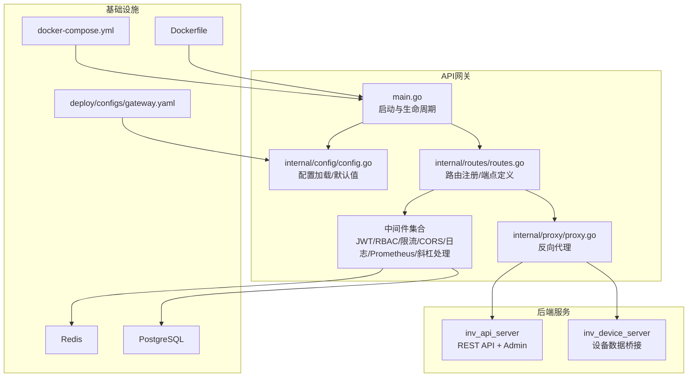

**图表来源**
- [main.go:21-94](file://api-gateway/main.go#L21-L94)
- [config.go:57-86](file://api-gateway/internal/config/config.go#L57-L86)
- [routes.go:25-55](file://api-gateway/internal/routes/routes.go#L25-L55)
- [proxy.go:21-60](file://api-gateway/internal/proxy/proxy.go#L21-L60)
- [docker-compose.yml:193-212](file://deploy/docker-compose.yml#L193-L212)
- [Dockerfile:39-42](file://api-gateway/Dockerfile#L39-L42)
- [gateway.yaml:1-41](file://deploy/configs/gateway.yaml#L1-L41)

**章节来源**
- [main.go:21-94](file://api-gateway/main.go#L21-L94)
- [config.go:57-86](file://api-gateway/internal/config/config.go#L57-L86)
- [routes.go:25-55](file://api-gateway/internal/routes/routes.go#L25-L55)
- [proxy.go:21-60](file://api-gateway/internal/proxy/proxy.go#L21-L60)
- [docker-compose.yml:193-212](file://deploy/docker-compose.yml#L193-L212)
- [Dockerfile:39-42](file://api-gateway/Dockerfile#L39-L42)
- [gateway.yaml:1-41](file://deploy/configs/gateway.yaml#L1-L41)

## 核心组件
- 配置管理：支持YAML配置文件与环境变量扩展，提供默认值与运行时覆盖
- 路由与端点：集中注册网关自身端点（健康检查、指标、API文档）与后端代理端点
- 反向代理：统一处理目标后端地址、头部转发、斜杠规范化与错误处理
- 中间件体系：提供JWT鉴权、RBAC授权、全局/路由级限流、CORS、日志与Prometheus指标
- 生命周期：支持优雅关闭与健康检查，便于容器编排与运维

**章节来源**
- [config.go:10-86](file://api-gateway/internal/config/config.go#L10-L86)
- [routes.go:25-125](file://api-gateway/internal/routes/routes.go#L25-L125)
- [proxy.go:16-60](file://api-gateway/internal/proxy/proxy.go#L16-L60)
- [jwt.go:44-121](file://api-gateway/internal/middleware/jwt.go#L44-L121)
- [rbac.go:24-133](file://api-gateway/internal/middleware/rbac.go#L24-L133)
- [ratelimit.go:48-93](file://api-gateway/internal/middleware/ratelimit.go#L48-L93)
- [cors.go:9-25](file://api-gateway/internal/middleware/cors.go#L9-L25)
- [logger.go:10-30](file://api-gateway/internal/middleware/logger.go#L10-L30)
- [prometheus.go:17-65](file://api-gateway/internal/middleware/prometheus.go#L17-L65)

## 架构总览
API网关位于前端应用与后端服务之间，承担统一入口、安全与治理职责。其核心交互关系如下：
- 前端应用通过HTTP访问网关，网关进行鉴权与授权校验
- 网关根据路径将请求转发至API服务器或设备服务器
- 网关通过Redis与PostgreSQL支撑RBAC与会话/权限缓存
- 网关暴露健康检查与Prometheus指标端点，便于监控与编排

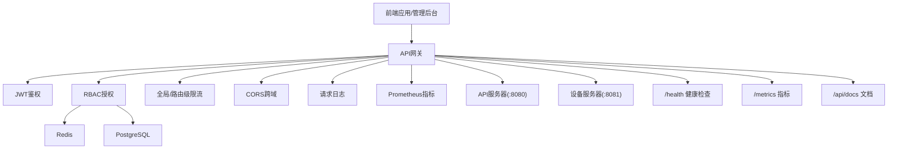

**图表来源**
- [routes.go:57-125](file://api-gateway/internal/routes/routes.go#L57-L125)
- [jwt.go:44-121](file://api-gateway/internal/middleware/jwt.go#L44-L121)
- [rbac.go:24-133](file://api-gateway/internal/middleware/rbac.go#L24-L133)
- [ratelimit.go:48-93](file://api-gateway/internal/middleware/ratelimit.go#L48-L93)
- [cors.go:9-25](file://api-gateway/internal/middleware/cors.go#L9-L25)
- [logger.go:10-30](file://api-gateway/internal/middleware/logger.go#L10-L30)
- [prometheus.go:17-65](file://api-gateway/internal/middleware/prometheus.go#L17-L65)
- [docker-compose.yml:121-191](file://deploy/docker-compose.yml#L121-L191)

**章节来源**
- [routes.go:57-125](file://api-gateway/internal/routes/routes.go#L57-L125)
- [docker-compose.yml:121-191](file://deploy/docker-compose.yml#L121-L191)

## 详细组件分析

### 配置管理系统
- 配置文件加载：支持YAML格式，使用环境变量扩展语法进行占位符替换
- 默认值策略：若配置文件缺失关键字段，使用硬编码默认值保证最小可用
- 运行时覆盖：通过环境变量对配置进行覆盖，满足容器化部署需求
- Redis地址拼装：提供统一的Redis地址格式化方法

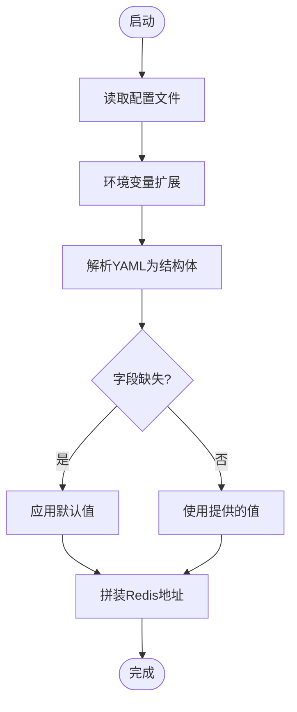

**图表来源**
- [config.go:57-86](file://api-gateway/internal/config/config.go#L57-L86)

**章节来源**
- [config.go:57-86](file://api-gateway/internal/config/config.go#L57-L86)
- [gateway.yaml:2-41](file://deploy/configs/gateway.yaml#L2-L41)

### 服务启动流程与优雅关闭
- 启动阶段：解析命令行参数、加载配置、初始化指标、建立Redis连接、构建RBAC中间件、注册路由、启动HTTP服务
- 优雅关闭：监听系统信号，等待最多10秒完成现有请求，然后关闭服务
- 健康检查：容器健康检查通过HTTP GET /health端点实现

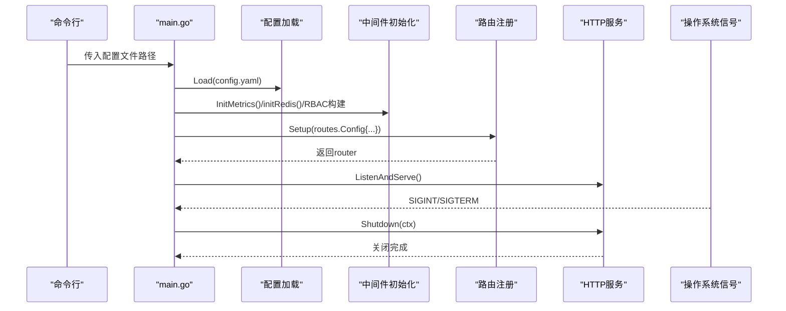

**图表来源**
- [main.go:21-94](file://api-gateway/main.go#L21-L94)
- [routes.go:25-55](file://api-gateway/internal/routes/routes.go#L25-L55)
- [Dockerfile:39-42](file://api-gateway/Dockerfile#L39-L42)

**章节来源**
- [main.go:21-94](file://api-gateway/main.go#L21-L94)
- [Dockerfile:39-42](file://api-gateway/Dockerfile#L39-L42)

### 路由与端点设计
- 网关端点：/health（健康检查）、/metrics（Prometheus指标）、/api/docs（API文档）
- API服务器端点：认证、站点、设备、告警、通知、告警规则、型号、用户、仪表盘、OTA、并机、内部接口、WebSocket、上传等
- 设备服务器端点：设备状态与统计相关接口
- 路由重写：对特定前缀进行路径重写，统一后端接口语义

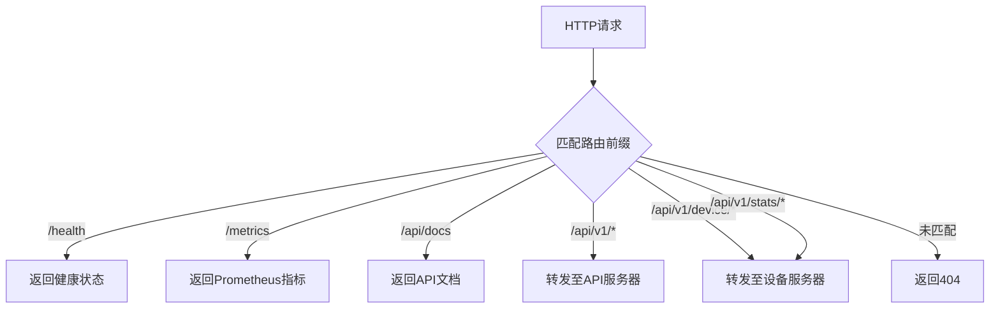

**图表来源**
- [routes.go:57-125](file://api-gateway/internal/routes/routes.go#L57-L125)

**章节来源**
- [routes.go:57-125](file://api-gateway/internal/routes/routes.go#L57-L125)

### 反向代理与错误处理
- 目标地址解析与Director：统一设置目标scheme/host/Host，保留原始Host到X-Forwarded-Host
- 连接池与超时：配置最大空闲连接、每主机最大连接、空闲超时、TLS握手超时与拨号超时
- 错误处理：后端不可达时返回标准JSON错误，状态码502
- 路径重写：对特定路径进行重写，保持后端一致性

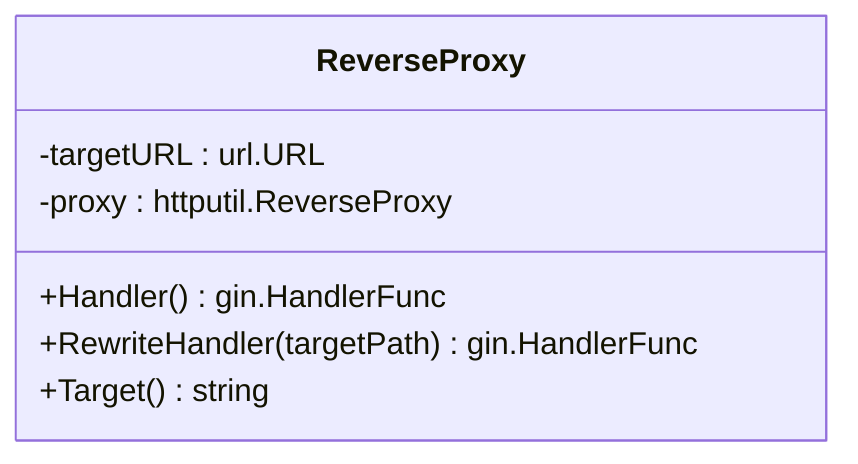

**图表来源**
- [proxy.go:16-106](file://api-gateway/internal/proxy/proxy.go#L16-L106)

**章节来源**
- [proxy.go:16-106](file://api-gateway/internal/proxy/proxy.go#L16-L106)

### 安全控制：JWT与RBAC
- JWT鉴权：对非公开路径进行校验，支持多种公开路径与前缀；解析token并注入用户标识到请求头
- RBAC授权：优先从Redis缓存读取用户角色与角色权限，降级到PostgreSQL查询；支持缓存失效与并发保护

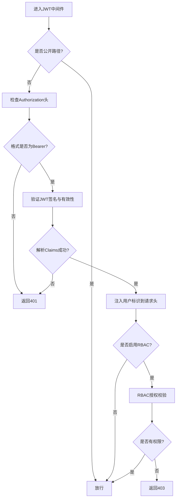

**图表来源**
- [jwt.go:44-121](file://api-gateway/internal/middleware/jwt.go#L44-L121)
- [rbac.go:190-239](file://api-gateway/internal/middleware/rbac.go#L190-L239)

**章节来源**
- [jwt.go:44-121](file://api-gateway/internal/middleware/jwt.go#L44-L121)
- [rbac.go:24-133](file://api-gateway/internal/middleware/rbac.go#L24-L133)
- [rbac.go:190-239](file://api-gateway/internal/middleware/rbac.go#L190-L239)

### 速率限制与监控统计
- 全局令牌桶：基于时间的令牌桶实现，超过突发阈值直接拒绝
- 路由级限流：针对特定路径前缀配置独立的速率与突发
- Prometheus指标：计数器（总请求数）、直方图（延迟分布）、飞行中请求数

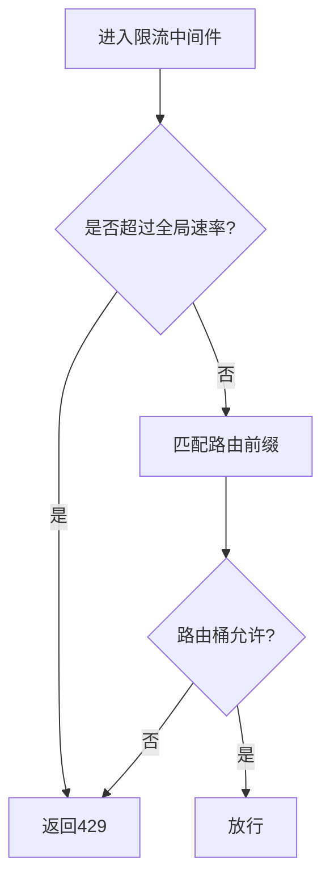

**图表来源**
- [ratelimit.go:48-93](file://api-gateway/internal/middleware/ratelimit.go#L48-L93)
- [prometheus.go:42-65](file://api-gateway/internal/middleware/prometheus.go#L42-L65)

**章节来源**
- [ratelimit.go:48-93](file://api-gateway/internal/middleware/ratelimit.go#L48-L93)
- [prometheus.go:42-65](file://api-gateway/internal/middleware/prometheus.go#L42-L65)

### 中间件与辅助能力
- CORS：允许任意源、常用方法与头部，预检请求短路返回
- 日志：记录状态码、耗时、客户端IP、方法与路径
- 斜杠处理：去除尾部多余斜杠，避免路径歧义

**章节来源**
- [cors.go:9-25](file://api-gateway/internal/middleware/cors.go#L9-L25)
- [logger.go:10-30](file://api-gateway/internal/middleware/logger.go#L10-L30)
- [slash.go:9-17](file://api-gateway/internal/middleware/slash.go#L9-L17)

## 依赖分析
API网关依赖的关键外部组件与内部模块如下：
- Gin：Web框架与路由
- golang-jwt：JWT解析与验证
- Redis：RBAC角色与权限缓存
- Prometheus：指标采集
- YAML：配置解析

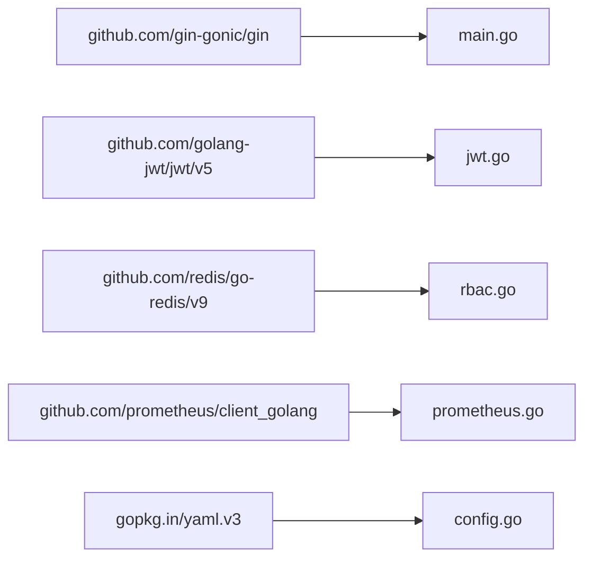

**图表来源**
- [go.mod:5-12](file://api-gateway/go.mod#L5-L12)
- [main.go:14-18](file://api-gateway/main.go#L14-L18)
- [jwt.go:9-11](file://api-gateway/internal/middleware/jwt.go#L9-L11)
- [rbac.go:14-17](file://api-gateway/internal/middleware/rbac.go#L14-L17)
- [prometheus.go:7-9](file://api-gateway/internal/middleware/prometheus.go#L7-L9)
- [config.go:7](file://api-gateway/internal/config/config.go#L7)

**章节来源**
- [go.mod:5-12](file://api-gateway/go.mod#L5-L12)

## 性能考虑
- 连接池与超时：合理设置最大连接数、空闲超时与拨号超时，降低后端连接压力
- 令牌桶限流：结合全局与路由级限流，避免热点接口被压垮
- 缓存策略：RBAC中间件在Redis与内存中双重缓存，减少数据库查询
- 指标观测：通过Prometheus收集延迟与请求数，辅助容量规划与问题定位

[本节为通用指导，无需具体文件引用]

## 故障排查指南
- 配置加载失败：检查配置文件路径与YAML格式，确认环境变量扩展语法正确
- Redis连接失败：确认Redis地址、端口与密码，查看Ping结果日志
- JWT密钥问题：确保JWT_SECRET已设置且非默认值
- RBAC不可用：当Redis不可用时，RBAC降级为仅角色检查
- 后端不可达：查看代理错误处理日志，确认目标服务可达性
- 健康检查失败：通过容器健康检查端点与/或本地curl验证

**章节来源**
- [main.go:25-51](file://api-gateway/main.go#L25-L51)
- [proxy.go:48-53](file://api-gateway/internal/proxy/proxy.go#L48-L53)
- [Dockerfile:39-42](file://api-gateway/Dockerfile#L39-L42)

## 结论
API网关以“统一入口、安全治理、可观测性”为核心设计理念，通过清晰的模块划分与中间件体系，实现了对内统一转发、对外统一鉴权与限流。配合容器化与编排配置，网关具备良好的可维护性与可扩展性，能够稳定支撑系统整体运行。

[本节为总结性内容，无需具体文件引用]

## 附录

### 系统部署拓扑图
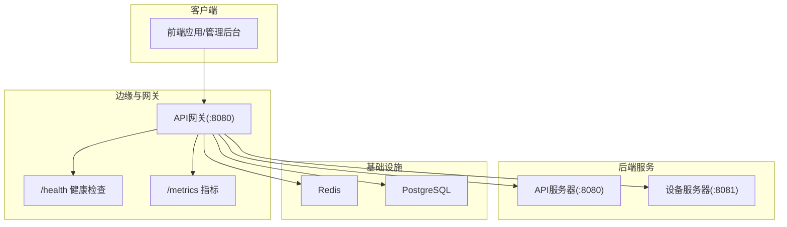

**图表来源**
- [docker-compose.yml:193-212](file://deploy/docker-compose.yml#L193-L212)
- [routes.go:57-71](file://api-gateway/internal/routes/routes.go#L57-L71)

### 组件依赖关系图
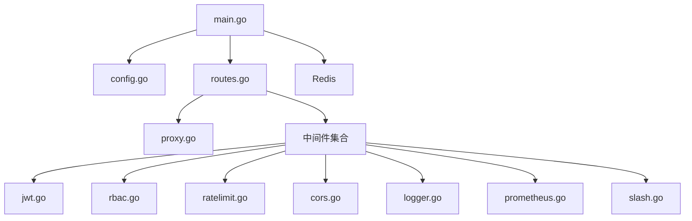

**图表来源**
- [main.go:14-18](file://api-gateway/main.go#L14-L18)
- [routes.go:3-13](file://api-gateway/internal/routes/routes.go#L3-L13)
- [proxy.go:3-14](file://api-gateway/internal/proxy/proxy.go#L3-L14)
- [jwt.go:3-11](file://api-gateway/internal/middleware/jwt.go#L3-L11)
- [rbac.go:3-17](file://api-gateway/internal/middleware/rbac.go#L3-L17)
- [ratelimit.go:3-10](file://api-gateway/internal/middleware/ratelimit.go#L3-L10)
- [cors.go:3-7](file://api-gateway/internal/middleware/cors.go#L3-L7)
- [logger.go:3-8](file://api-gateway/internal/middleware/logger.go#L3-L8)
- [prometheus.go:3-9](file://api-gateway/internal/middleware/prometheus.go#L3-L9)
- [slash.go:3-7](file://api-gateway/internal/middleware/slash.go#L3-L7)