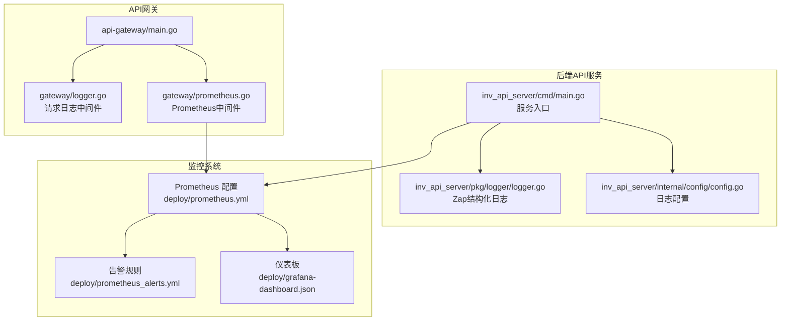
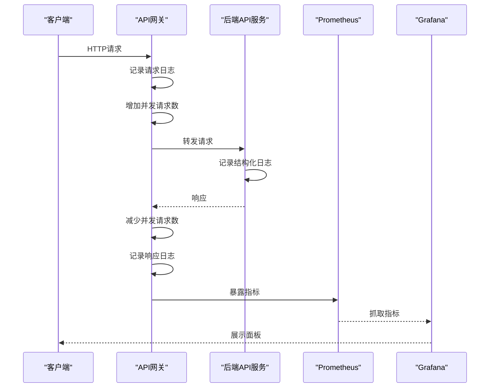
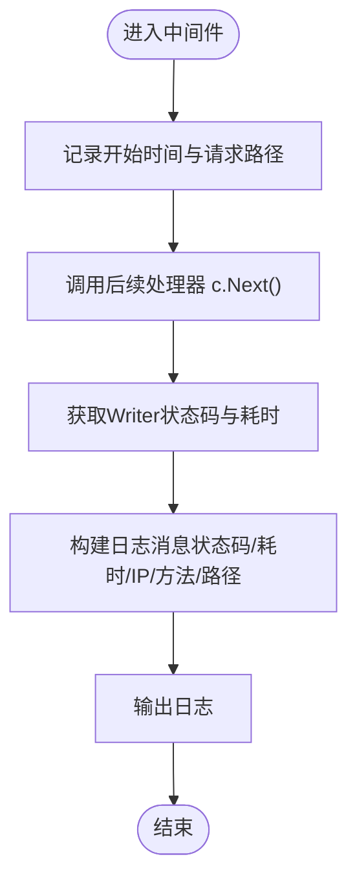
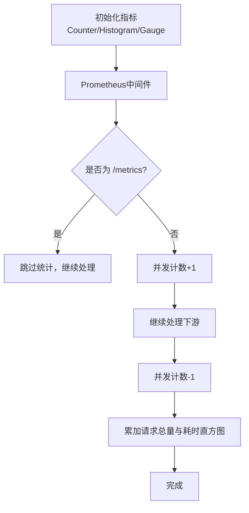
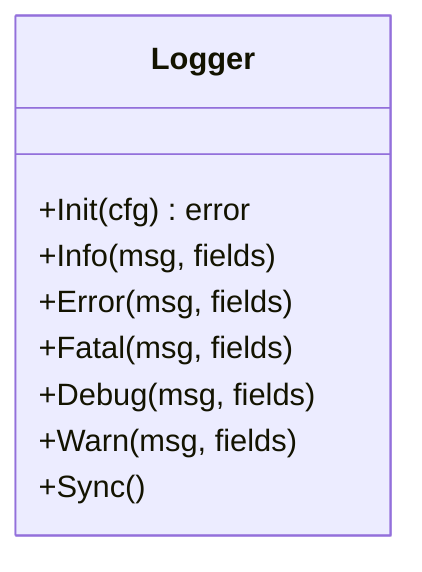
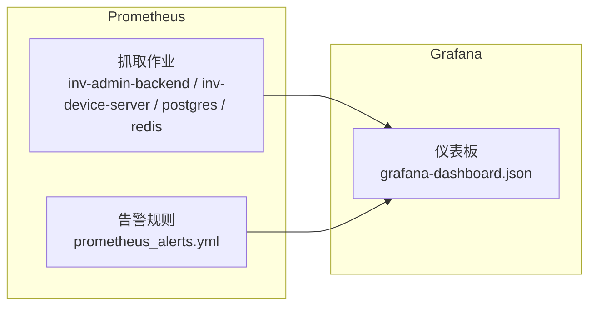
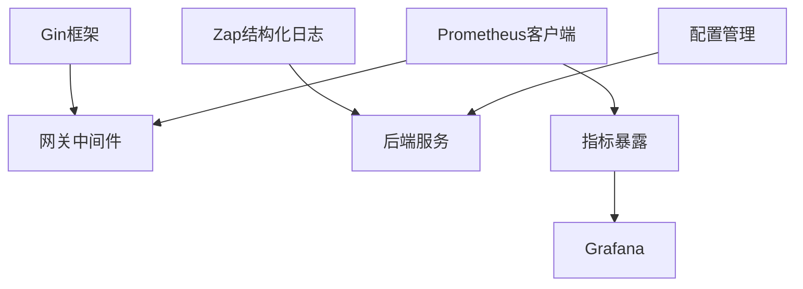

# 请求日志与监控

<cite>
**本文引用的文件**
- [api-gateway/internal/middleware/logger.go](file://api-gateway/internal/middleware/logger.go)
- [api-gateway/internal/middleware/prometheus.go](file://api-gateway/internal/middleware/prometheus.go)
- [api-gateway/main.go](file://api-gateway/main.go)
- [inv_api_server/pkg/logger/logger.go](file://inv_api_server/pkg/logger/logger.go)
- [inv_api_server/cmd/main.go](file://inv_api_server/cmd/main.go)
- [inv_api_server/internal/config/config.go](file://inv_api_server/internal/config/config.go)
- [deploy/prometheus.yml](file://deploy/prometheus.yml)
- [deploy/prometheus_alerts.yml](file://deploy/prometheus_alerts.yml)
- [deploy/grafana-dashboard.json](file://deploy/grafana-dashboard.json)
- [api-gateway/internal/config/config.go](file://api-gateway/internal/config/config.go)
</cite>

## 目录
1. [简介](#简介)
2. [项目结构](#项目结构)
3. [核心组件](#核心组件)
4. [架构总览](#架构总览)
5. [详细组件分析](#详细组件分析)
6. [依赖关系分析](#依赖关系分析)
7. [性能考量](#性能考量)
8. [故障排查指南](#故障排查指南)
9. [结论](#结论)
10. [附录](#附录)

## 简介
本文件面向请求日志记录与Prometheus监控中间件，系统性阐述以下内容：
- 请求/响应日志记录：网关层与后端服务的日志中间件实现、日志格式化与日志级别控制。
- Prometheus监控指标：请求计数、响应时间、错误率与并发连接数的采集与暴露。
- 指标命名规范与标签设计：服务端点、HTTP状态码、响应时间分组等。
- 结构化日志输出：JSON格式、时间戳与上下文信息的组织方式。
- 监控配置示例：指标暴露端点、告警规则与仪表板配置。
- 日志轮转策略、存储优化与隐私保护措施。
- 与ELK Stack或类似日志系统的集成方案。

## 项目结构
本项目采用多服务架构，其中API网关与后端API服务分别实现了请求日志与监控中间件，并通过Prometheus进行统一采集与Grafana可视化。

**图表来源**
- [api-gateway/main.go:34](file://api-gateway/main.go#L34)
- [api-gateway/internal/middleware/logger.go:10-30](file://api-gateway/internal/middleware/logger.go#L10-L30)
- [api-gateway/internal/middleware/prometheus.go:17-40](file://api-gateway/internal/middleware/prometheus.go#L17-L40)
- [inv_api_server/cmd/main.go:221-237](file://inv_api_server/cmd/main.go#L221-L237)
- [inv_api_server/pkg/logger/logger.go:11-18](file://inv_api_server/pkg/logger/logger.go#L11-L18)
- [deploy/prometheus.yml:13-33](file://deploy/prometheus.yml#L13-L33)
- [deploy/prometheus_alerts.yml:6-78](file://deploy/prometheus_alerts.yml#L6-L78)
- [deploy/grafana-dashboard.json:19-96](file://deploy/grafana-dashboard.json#L19-L96)

**章节来源**
- [api-gateway/main.go:34](file://api-gateway/main.go#L34)
- [api-gateway/internal/middleware/logger.go:10-30](file://api-gateway/internal/middleware/logger.go#L10-L30)
- [api-gateway/internal/middleware/prometheus.go:17-40](file://api-gateway/internal/middleware/prometheus.go#L17-L40)
- [inv_api_server/cmd/main.go:221-237](file://inv_api_server/cmd/main.go#L221-L237)
- [inv_api_server/pkg/logger/logger.go:11-18](file://inv_api_server/pkg/logger/logger.go#L11-L18)
- [deploy/prometheus.yml:13-33](file://deploy/prometheus.yml#L13-L33)
- [deploy/prometheus_alerts.yml:6-78](file://deploy/prometheus_alerts.yml#L6-L78)
- [deploy/grafana-dashboard.json:19-96](file://deploy/grafana-dashboard.json#L19-L96)

## 核心组件
- 网关请求日志中间件：在请求进入与返回之间打印基础日志，包含状态码、耗时、客户端IP、方法与路径。
- 网关Prometheus中间件：初始化指标、统计请求总量、响应时间直方图与并发请求数，并在请求处理链路中正确增减并发计数。
- 后端API服务日志：使用Zap结构化日志，支持生产环境配置、级别控制与同步写入。
- 监控配置：Prometheus抓取配置、告警规则与Grafana仪表板，覆盖HTTP QPS、延迟、错误率与基础设施指标。

**章节来源**
- [api-gateway/internal/middleware/logger.go:10-30](file://api-gateway/internal/middleware/logger.go#L10-L30)
- [api-gateway/internal/middleware/prometheus.go:17-40](file://api-gateway/internal/middleware/prometheus.go#L17-L40)
- [inv_api_server/pkg/logger/logger.go:11-18](file://inv_api_server/pkg/logger/logger.go#L11-L18)
- [deploy/prometheus.yml:13-33](file://deploy/prometheus.yml#L13-L33)
- [deploy/prometheus_alerts.yml:6-78](file://deploy/prometheus_alerts.yml#L6-L78)
- [deploy/grafana-dashboard.json:19-96](file://deploy/grafana-dashboard.json#L19-L96)

## 架构总览
下图展示了请求在网关与后端服务中的日志与监控处理流程，以及Prometheus采集与Grafana可视化的整体架构。

**图表来源**
- [api-gateway/internal/middleware/logger.go:10-30](file://api-gateway/internal/middleware/logger.go#L10-L30)
- [api-gateway/internal/middleware/prometheus.go:42-65](file://api-gateway/internal/middleware/prometheus.go#L42-L65)
- [inv_api_server/cmd/main.go:221-237](file://inv_api_server/cmd/main.go#L221-L237)
- [deploy/prometheus.yml:13-33](file://deploy/prometheus.yml#L13-L33)
- [deploy/grafana-dashboard.json:19-96](file://deploy/grafana-dashboard.json#L19-L96)

## 详细组件分析

### 网关请求日志中间件
- 功能概述：在请求进入与返回之间计算耗时，记录状态码、客户端IP、方法与完整路径（含查询参数），并以简洁格式输出。
- 关键点：
  - 使用标准库日志输出，便于与系统日志集成。
  - 在中间件中先调用Next，再读取Writer状态码，保证日志反映最终结果。
  - 对路径拼接查询参数，避免遗漏关键信息。

**图表来源**
- [api-gateway/internal/middleware/logger.go:10-30](file://api-gateway/internal/middleware/logger.go#L10-L30)

**章节来源**
- [api-gateway/internal/middleware/logger.go:10-30](file://api-gateway/internal/middleware/logger.go#L10-L30)

### 网关Prometheus中间件
- 指标初始化：在进程启动时注册三类指标：
  - 请求总量（CounterVec）：按方法、路径、状态码分组。
  - 请求耗时直方图（HistogramVec）：按方法、路径、状态码分组，桶值覆盖常见延迟范围。
  - 并发请求数（Gauge）：当前正在处理的请求数。
- 中间件逻辑：
  - 忽略“/metrics”端点，避免自监控干扰。
  - 每个请求进入时并发计数+1，退出时-1。
  - 请求完成后累加请求总量并记录耗时直方图。
  - 路径优先使用FullPath，若为空则回退到原始路径。

**图表来源**
- [api-gateway/internal/middleware/prometheus.go:17-40](file://api-gateway/internal/middleware/prometheus.go#L17-L40)
- [api-gateway/internal/middleware/prometheus.go:42-65](file://api-gateway/internal/middleware/prometheus.go#L42-L65)

**章节来源**
- [api-gateway/internal/middleware/prometheus.go:17-40](file://api-gateway/internal/middleware/prometheus.go#L17-L40)
- [api-gateway/internal/middleware/prometheus.go:42-65](file://api-gateway/internal/middleware/prometheus.go#L42-L65)

### 后端API服务日志（Zap）
- 初始化与配置：通过配置文件设置日志级别、输出路径、压缩与轮转参数；支持生产环境配置。
- 日志级别：Info、Error、Fatal、Debug、Warn等，满足不同场景需求。
- 同步写入：提供Sync方法，确保关键日志及时落盘。

**图表来源**
- [inv_api_server/pkg/logger/logger.go:11-42](file://inv_api_server/pkg/logger/logger.go#L11-L42)

**章节来源**
- [inv_api_server/pkg/logger/logger.go:11-42](file://inv_api_server/pkg/logger/logger.go#L11-L42)
- [inv_api_server/internal/config/config.go:90-97](file://inv_api_server/internal/config/config.go#L90-L97)

### 监控配置与仪表板
- Prometheus抓取配置：定义多个job，分别抓取后端API服务、设备服务、数据库与缓存等指标。
- 告警规则：涵盖MQTT消息丢弃、实例宕机、数据库连接数、Redis内存、连接数变化、Stream积压等。
- Grafana仪表板：包含HTTP QPS、延迟（p95/p99）、错误率、设备在线/离线、消息速率与数据库连接池等面板。

**图表来源**
- [deploy/prometheus.yml:13-33](file://deploy/prometheus.yml#L13-L33)
- [deploy/prometheus_alerts.yml:6-78](file://deploy/prometheus_alerts.yml#L6-L78)
- [deploy/grafana-dashboard.json:19-96](file://deploy/grafana-dashboard.json#L19-L96)

**章节来源**
- [deploy/prometheus.yml:13-33](file://deploy/prometheus.yml#L13-L33)
- [deploy/prometheus_alerts.yml:6-78](file://deploy/prometheus_alerts.yml#L6-L78)
- [deploy/grafana-dashboard.json:19-96](file://deploy/grafana-dashboard.json#L19-L96)

## 依赖关系分析
- 网关中间件依赖：
  - Gin框架中间件机制，通过Next实现链式处理。
  - Prometheus客户端库，注册与观测指标。
- 后端服务依赖：
  - Gin框架与中间件链。
  - Uber Zap结构化日志库。
  - 配置管理（Viper）加载日志与服务器配置。
- 监控系统依赖：
  - Prometheus服务端抓取目标。
  - Alertmanager与Grafana前端展示。

**图表来源**
- [api-gateway/internal/middleware/prometheus.go:3-9](file://api-gateway/internal/middleware/prometheus.go#L3-L9)
- [inv_api_server/pkg/logger/logger.go:3](file://inv_api_server/pkg/logger/logger.go#L3)
- [inv_api_server/internal/config/config.go:90-97](file://inv_api_server/internal/config/config.go#L90-L97)
- [deploy/prometheus.yml:13-33](file://deploy/prometheus.yml#L13-L33)

**章节来源**
- [api-gateway/internal/middleware/prometheus.go:3-9](file://api-gateway/internal/middleware/prometheus.go#L3-L9)
- [inv_api_server/pkg/logger/logger.go:3](file://inv_api_server/pkg/logger/logger.go#L3)
- [inv_api_server/internal/config/config.go:90-97](file://inv_api_server/internal/config/config.go#L90-L97)
- [deploy/prometheus.yml:13-33](file://deploy/prometheus.yml#L13-L33)

## 性能考量
- 指标开销：直方图与计数器均为轻量级原子操作，对吞吐影响极小。
- 并发控制：通过Gauge精确跟踪并发请求数，避免过度并发导致资源争用。
- 日志成本：网关日志采用简单格式，后端使用结构化日志并支持异步写入，建议结合日志轮转与压缩降低磁盘压力。
- 抓取频率：Prometheus默认15秒抓取一次，可根据业务负载调整。

[本节为通用指导，无需特定文件来源]

## 故障排查指南
- 网关日志缺失：
  - 检查中间件是否正确挂载于路由链。
  - 确认请求路径是否命中“/metrics”，该路径会被Prometheus中间件跳过统计。
- 指标异常：
  - 确认Prometheus配置中的job名称与目标端口一致。
  - 检查后端服务是否暴露“/metrics”端点且无鉴权拦截。
- Grafana面板空白：
  - 确认数据源指向正确的Prometheus实例。
  - 检查表达式是否匹配实际指标名称与标签。
- 日志轮转问题：
  - 检查后端服务日志配置项（级别、文件名、最大大小、备份数量、保留天数、压缩）。
  - 确保容器或主机侧的日志驱动支持轮转。

**章节来源**
- [api-gateway/internal/middleware/prometheus.go:42-65](file://api-gateway/internal/middleware/prometheus.go#L42-L65)
- [deploy/prometheus.yml:13-33](file://deploy/prometheus.yml#L13-L33)
- [deploy/grafana-dashboard.json:19-96](file://deploy/grafana-dashboard.json#L19-L96)
- [inv_api_server/internal/config/config.go:90-97](file://inv_api_server/internal/config/config.go#L90-L97)

## 结论
本项目在网关与后端服务层面分别实现了轻量高效的请求日志与Prometheus监控中间件，并通过完善的配置与仪表板实现了可观测性闭环。建议在生产环境中结合日志轮转、压缩与隐私保护策略，持续优化指标命名与标签设计，以提升可维护性与可扩展性。

[本节为总结性内容，无需特定文件来源]

## 附录

### 指标命名规范与标签设计
- 命名规范：
  - 网关：api_gateway_requests_total、api_gateway_request_duration_seconds、api_gateway_requests_in_flight。
- 标签设计：
  - 方法（method）、路径（path）、状态码（status）。
  - 建议在后端服务中保持一致的命名风格，如http_requests_total、http_request_duration_ms等，以便统一采集与查询。

**章节来源**
- [api-gateway/internal/middleware/prometheus.go:17-40](file://api-gateway/internal/middleware/prometheus.go#L17-L40)

### 日志结构化输出与隐私保护
- 结构化日志：
  - 后端服务使用Zap，支持字段化输出，便于检索与过滤。
- 隐私保护：
  - 避免在日志中记录敏感字段（如密码、令牌）。
  - 对用户标识（如用户名、手机号）进行脱敏处理。
- 存储优化：
  - 后端服务日志配置支持最大文件大小、备份数量与保留天数，建议结合容器日志驱动（如json-file）与外部日志系统（如ELK）进行集中管理。

**章节来源**
- [inv_api_server/pkg/logger/logger.go:11-42](file://inv_api_server/pkg/logger/logger.go#L11-L42)
- [inv_api_server/internal/config/config.go:90-97](file://inv_api_server/internal/config/config.go#L90-L97)

### 与ELK Stack集成方案
- 方案概述：通过容器日志驱动输出到标准输出/错误，由ELK收集器（如Filebeat/Fluent Bit）采集并发送至Logstash/Elasticsearch，实现日志的统一索引与检索。
- 关键步骤：
  - 在容器编排中设置日志驱动为json-file。
  - 部署Filebeat/Fluent Bit，配置Kubernetes/容器日志路径与索引模板。
  - 在Kibana中创建索引模式与仪表板，结合Prometheus/Grafana进行联合分析。

[本节为概念性内容，无需特定文件来源]