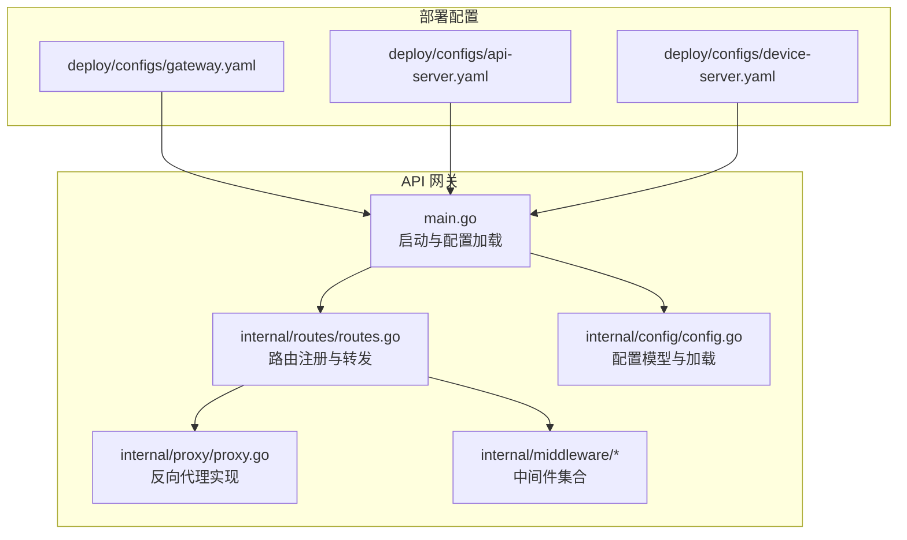
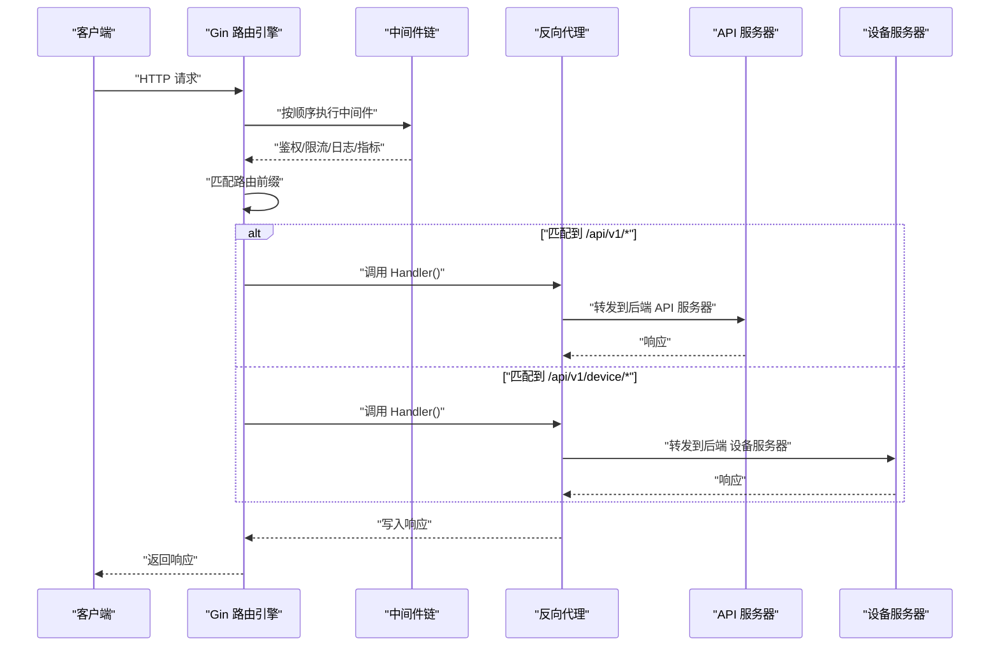
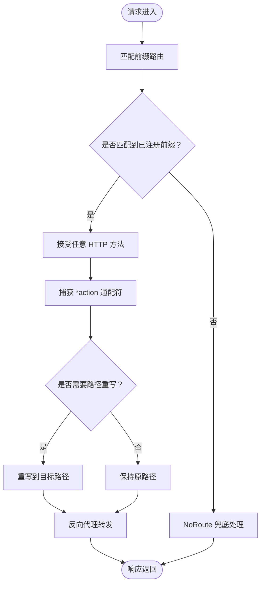
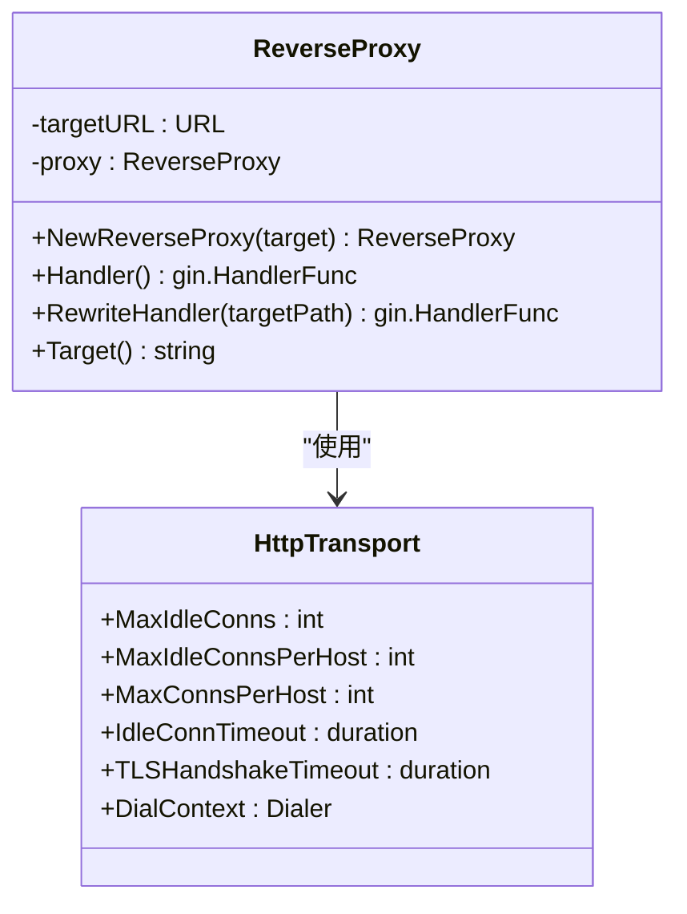
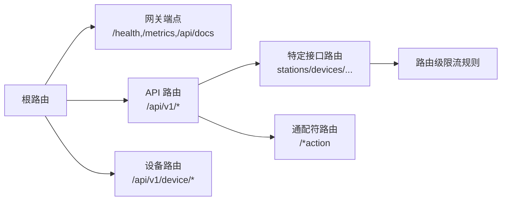
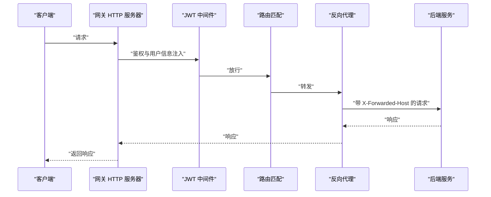
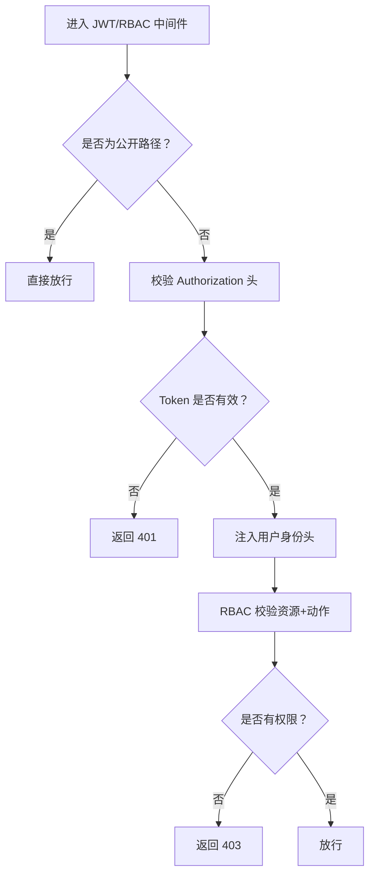
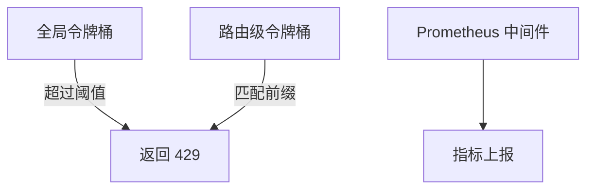
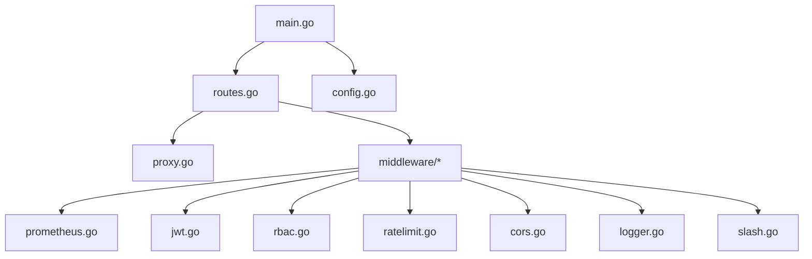

# 路由配置与代理

<cite>
**本文引用的文件**
- [main.go](file://api-gateway/main.go)
- [routes.go](file://api-gateway/internal/routes/routes.go)
- [proxy.go](file://api-gateway/internal/proxy/proxy.go)
- [config.go](file://api-gateway/internal/config/config.go)
- [gateway.yaml](file://deploy/configs/gateway.yaml)
- [api-server.yaml](file://deploy/configs/api-server.yaml)
- [device-server.yaml](file://deploy/configs/device-server.yaml)
- [ratelimit.go](file://api-gateway/internal/middleware/ratelimit.go)
- [jwt.go](file://api-gateway/internal/middleware/jwt.go)
- [cors.go](file://api-gateway/internal/middleware/cors.go)
- [logger.go](file://api-gateway/internal/middleware/logger.go)
- [prometheus.go](file://api-gateway/internal/middleware/prometheus.go)
- [rbac.go](file://api-gateway/internal/middleware/rbac.go)
- [slash.go](file://api-gateway/internal/middleware/slash.go)
- [config_test.go](file://api-gateway/internal/config/config_test.go)
</cite>

## 目录
1. [引言](#引言)
2. [项目结构](#项目结构)
3. [核心组件](#核心组件)
4. [架构总览](#架构总览)
5. [详细组件分析](#详细组件分析)
6. [依赖分析](#依赖分析)
7. [性能考虑](#性能考虑)
8. [故障排查指南](#故障排查指南)
9. [结论](#结论)
10. [附录](#附录)

## 引言
本文件面向“路由配置与请求代理”子系统，系统性阐述以下内容：
- 路由规则定义与匹配机制：路径前缀匹配、HTTP 方法过滤、动态参数提取
- 反向代理实现：上游服务器选择、连接池与传输层配置、错误处理
- 路由配置层次：全局路由、特定接口路由、通配符路由
- 请求转发流程：头部处理、超时设置、错误重试策略
- 配置示例：API 服务器与设备服务器的路由规则
- 调试方法与性能优化建议
- 与服务发现和动态配置中心的集成思路

## 项目结构
本项目采用多模块分层组织，路由与代理位于独立的网关模块中，配合中间件完成鉴权、限流、日志、指标等横切能力。

图表来源
- [main.go:21-94](file://api-gateway/main.go#L21-L94)
- [routes.go:25-55](file://api-gateway/internal/routes/routes.go#L25-L55)
- [proxy.go:21-60](file://api-gateway/internal/proxy/proxy.go#L21-L60)
- [config.go:57-82](file://api-gateway/internal/config/config.go#L57-L82)
- [gateway.yaml:1-41](file://deploy/configs/gateway.yaml#L1-L41)
- [api-server.yaml:1-60](file://deploy/configs/api-server.yaml#L1-L60)
- [device-server.yaml:1-57](file://deploy/configs/device-server.yaml#L1-L57)

章节来源
- [main.go:21-94](file://api-gateway/main.go#L21-L94)
- [routes.go:25-55](file://api-gateway/internal/routes/routes.go#L25-L55)
- [config.go:57-82](file://api-gateway/internal/config/config.go#L57-L82)
- [gateway.yaml:1-41](file://deploy/configs/gateway.yaml#L1-L41)
- [api-server.yaml:1-60](file://deploy/configs/api-server.yaml#L1-L60)
- [device-server.yaml:1-57](file://deploy/configs/device-server.yaml#L1-L57)

## 核心组件
- 配置加载与初始化：从 YAML 文件加载配置，支持环境变量替换；初始化 Redis、中间件与 HTTP 服务。
- 路由注册：基于 Gin 路由引擎，注册网关端点、API 路由、设备路由与兜底处理。
- 反向代理：封装 httputil.ReverseProxy，统一设置目标主机、头部与传输层参数，内置错误处理。
- 中间件链：CORS、日志、Prometheus 指标、全局/路由级限流、JWT 鉴权、RBAC 权限控制、斜杠规范化。

章节来源
- [main.go:25-70](file://api-gateway/main.go#L25-L70)
- [routes.go:25-55](file://api-gateway/internal/routes/routes.go#L25-L55)
- [proxy.go:16-60](file://api-gateway/internal/proxy/proxy.go#L16-L60)
- [ratelimit.go:48-93](file://api-gateway/internal/middleware/ratelimit.go#L48-L93)
- [jwt.go:44-121](file://api-gateway/internal/middleware/jwt.go#L44-121)
- [rbac.go:32-42](file://api-gateway/internal/middleware/rbac.go#L32-L42)

## 架构总览
下图展示请求在网关中的处理路径：从路由匹配到反向代理转发，再到后端服务响应返回客户端。

图表来源
- [routes.go:73-111](file://api-gateway/internal/routes/routes.go#L73-L111)
- [proxy.go:62-68](file://api-gateway/internal/proxy/proxy.go#L62-L68)
- [main.go:62-70](file://api-gateway/main.go#L62-L70)

## 详细组件分析

### 路由规则与匹配机制
- 路由注册位置：在路由模块中集中注册所有 API 与设备相关路由。
- 匹配策略：
  - 前缀匹配：如 “/api/v1/devices/*action”，支持任意后缀路径。
  - 通配符路由：使用 “*action” 捕获剩余路径段，便于统一转发。
  - 动态参数：当前实现以通配符方式捕获路径片段，未使用显式的参数占位符语法；如需更细粒度参数提取，可在 Gin 层扩展。
  - HTTP 方法：使用 Any() 注册，覆盖 GET/POST/PUT/DELETE 等方法。
- 特殊重写：
  - 使用重写处理器将不同业务路径映射到同一后端路径，例如将 “/api/v1/alerts” 重写到 “/api/v1/alarms”。

图表来源
- [routes.go:73-111](file://api-gateway/internal/routes/routes.go#L73-L111)
- [routes.go:70-101](file://api-gateway/internal/routes/routes.go#L70-L101)

章节来源
- [routes.go:73-111](file://api-gateway/internal/routes/routes.go#L73-L111)
- [routes.go:70-101](file://api-gateway/internal/routes/routes.go#L70-L101)

### 反向代理实现
- 目标服务器选择：根据路由归属，分别指向 API 服务器或设备服务器。
- Director 设置：
  - 设置目标 Scheme/Host，保留原始 Host 到 X-Forwarded-Host。
  - 规范化路径：去除尾部斜杠，避免后端路径歧义。
- 传输层配置：
  - 连接池上限：每主机最大空闲连接数、总最大连接数。
  - 连接生命周期：空闲超时、TLS 握手超时、拨号超时。
- 错误处理：当后端不可达时，返回标准 JSON 错误体与 502 状态码。

图表来源
- [proxy.go:16-60](file://api-gateway/internal/proxy/proxy.go#L16-L60)
- [proxy.go:37-54](file://api-gateway/internal/proxy/proxy.go#L37-L54)

章节来源
- [proxy.go:16-60](file://api-gateway/internal/proxy/proxy.go#L16-L60)
- [proxy.go:62-68](file://api-gateway/internal/proxy/proxy.go#L62-L68)
- [proxy.go:70-101](file://api-gateway/internal/proxy/proxy.go#L70-L101)

### 路由配置层次
- 全局路由：网关自身端点（健康检查、指标、API 文档），以及通用的公开接口（如认证相关）。
- 特定接口路由：针对业务域划分的路由，如 stations、devices、alarms、models、users、dashboard、ota、parallel 等。
- 通配符路由：统一捕获后端路径，便于集中转发。
- 路由级限流：对特定前缀（如 /api/v1/devices、/api/v1/auth/login）设置独立令牌桶。

图表来源
- [routes.go:57-71](file://api-gateway/internal/routes/routes.go#L57-L71)
- [routes.go:73-106](file://api-gateway/internal/routes/routes.go#L73-L106)
- [routes.go:108-111](file://api-gateway/internal/routes/routes.go#L108-L111)
- [gateway.yaml:14-27](file://deploy/configs/gateway.yaml#L14-L27)

章节来源
- [routes.go:57-71](file://api-gateway/internal/routes/routes.go#L57-L71)
- [routes.go:73-106](file://api-gateway/internal/routes/routes.go#L73-L106)
- [routes.go:108-111](file://api-gateway/internal/routes/routes.go#L108-L111)
- [gateway.yaml:14-27](file://deploy/configs/gateway.yaml#L14-L27)

### 请求转发流程与头部处理
- 头部处理：
  - 保留原始 Host 至 X-Forwarded-Host，便于后端识别来源。
  - 在 JWT 中间件中，将用户身份信息注入到 X-User-ID、X-User-Phone、X-User-Role、X-User-Sub 等自定义头部，供后端使用。
- 超时设置：
  - 网关侧 HTTP 服务器读/写超时与空闲超时在启动时配置。
  - 代理侧传输层设置了 TLS 握手超时、拨号超时与空闲连接超时。
- 错误重试：
  - 当前实现未内置自动重试逻辑；若需增强可用性，可在代理层或上游服务层面引入指数退避重试策略。

图表来源
- [main.go:72-78](file://api-gateway/main.go#L72-L78)
- [proxy.go:27-36](file://api-gateway/internal/proxy/proxy.go#L27-L36)
- [jwt.go:103-114](file://api-gateway/internal/middleware/jwt.go#L103-L114)

章节来源
- [main.go:72-78](file://api-gateway/main.go#L72-L78)
- [proxy.go:27-36](file://api-gateway/internal/proxy/proxy.go#L27-L36)
- [jwt.go:103-114](file://api-gateway/internal/middleware/jwt.go#L103-L114)

### 鉴权与权限控制
- JWT 鉴权：对非公开路径进行 Bearer Token 校验，并将用户身份信息注入请求头。
- RBAC 权限：基于角色与资源动作映射，结合 Redis 缓存与数据库查询，实现细粒度权限控制。
- 公开路径：对健康检查、公开接口与静态资源目录免鉴权。

图表来源
- [jwt.go:44-121](file://api-gateway/internal/middleware/jwt.go#L44-121)
- [rbac.go:190-239](file://api-gateway/internal/middleware/rbac.go#L190-239)

章节来源
- [jwt.go:44-121](file://api-gateway/internal/middleware/jwt.go#L44-121)
- [rbac.go:190-239](file://api-gateway/internal/middleware/rbac.go#L190-239)

### 限流与指标
- 全局限流：基于令牌桶算法，全局速率与突发值可配置。
- 路由级限流：对指定前缀设置独立令牌桶，优先匹配最长前缀。
- 指标采集：统计请求数、延迟直方图与并发请求数，暴露 Prometheus 接口。

图表来源
- [ratelimit.go:48-93](file://api-gateway/internal/middleware/ratelimit.go#L48-L93)
- [prometheus.go:42-65](file://api-gateway/internal/middleware/prometheus.go#L42-65)

章节来源
- [ratelimit.go:48-93](file://api-gateway/internal/middleware/ratelimit.go#L48-L93)
- [prometheus.go:42-65](file://api-gateway/internal/middleware/prometheus.go#L42-65)

### 配置示例与说明
- 网关配置（生产）：包含服务端口、JWT 密钥、全局与路由级限流、后端地址、Redis、RBAC 开关与缓存 TTL。
- API 服务器配置：数据库、Redis、JWT、短信/邮件、日志与时区等。
- 设备服务器配置：数据库、Redis、MQTT、Kafka、后端关联与日志等。

章节来源
- [gateway.yaml:1-41](file://deploy/configs/gateway.yaml#L1-L41)
- [api-server.yaml:1-60](file://deploy/configs/api-server.yaml#L1-L60)
- [device-server.yaml:1-57](file://deploy/configs/device-server.yaml#L1-L57)

## 依赖分析
- 组件耦合：
  - main 负责装配配置与中间件，routes 作为路由与代理的协调者，proxy 封装底层转发细节。
  - 中间件彼此解耦，通过 Gin 的中间件链串联。
- 外部依赖：
  - Gin：路由与中间件框架。
  - Prometheus：指标采集与导出。
  - Redis：RBAC 缓存与会话存储。
  - Postgres：RBAC 权限数据源（通过连接池）。

图表来源
- [main.go:14-16](file://api-gateway/main.go#L14-L16)
- [routes.go:8-12](file://api-gateway/internal/routes/routes.go#L8-L12)
- [proxy.go:3-14](file://api-gateway/internal/proxy/proxy.go#L3-L14)
- [prometheus.go:8-9](file://api-gateway/internal/middleware/prometheus.go#L8-L9)
- [jwt.go:9-11](file://api-gateway/internal/middleware/jwt.go#L9-L11)
- [rbac.go:14-17](file://api-gateway/internal/middleware/rbac.go#L14-L17)
- [ratelimit.go:9-10](file://api-gateway/internal/middleware/ratelimit.go#L9-L10)
- [cors.go:6-7](file://api-gateway/internal/middleware/cors.go#L6-L7)
- [logger.go:7-8](file://api-gateway/internal/middleware/logger.go#L7-L8)
- [slash.go:6-7](file://api-gateway/internal/middleware/slash.go#L6-L7)

章节来源
- [main.go:14-16](file://api-gateway/main.go#L14-L16)
- [routes.go:8-12](file://api-gateway/internal/routes/routes.go#L8-L12)
- [proxy.go:3-14](file://api-gateway/internal/proxy/proxy.go#L3-L14)

## 性能考虑
- 连接复用与池化：合理设置 MaxIdleConns/MaxIdleConnsPerHost/MaxConnsPerHost 与 IdleConnTimeout，降低连接建立开销。
- 超时策略：根据业务特性调整网关与代理的超时参数，避免长时间占用连接。
- 限流策略：结合全局与路由级限流，保护后端服务免受突发流量冲击。
- 指标监控：利用 Prometheus 指标定位慢请求与高延迟路径，持续优化。
- 缓存命中：RBAC 缓存 TTL 合理设置，平衡一致性与性能。

## 故障排查指南
- 健康检查：访问 /health 确认网关运行状态。
- 日志定位：中间件记录请求耗时、状态码与客户端 IP；JWT/RBAC/NoRoute 调试输出可用于快速定位问题。
- 代理错误：当后端不可达时，代理返回 502 并包含目标地址信息，检查后端服务连通性与健康状态。
- 配置验证：通过配置测试用例验证环境变量替换与默认值行为。

章节来源
- [routes.go:57-71](file://api-gateway/internal/routes/routes.go#L57-L71)
- [proxy.go:48-53](file://api-gateway/internal/proxy/proxy.go#L48-L53)
- [config_test.go:9-98](file://api-gateway/internal/config/config_test.go#L9-L98)

## 结论
本系统以清晰的路由分层与可插拔中间件为核心，实现了灵活的请求转发与强大的横切能力。通过合理的限流、鉴权与指标体系，能够稳定支撑业务发展。后续可在代理层引入重试与熔断、结合服务发现与动态配置中心进一步提升弹性与可观测性。

## 附录

### 路由配置层次与示例
- 全局路由：/health、/metrics、/api/docs、公开认证接口与 /timezones。
- API 路由：/api/v1/stations、/api/v1/devices、/api/v1/alarms、/api/v1/alerts、/api/v1/notifications、/api/v1/alert-rules、/api/v1/models、/api/v1/users、/api/v1/dashboard、/api/v1/ota、/api/v1/firmwares、/api/v1/work-orders、/api/v1/parallel-groups、/api/v1/admin、/api/v1/internal、/ws、/uploads。
- 设备路由：/api/v1/device、/api/v1/stats。
- 路由级限流示例：对 /api/v1/devices、/api/v1/auth/login、/api/v1/auth/register、/api/v1/auth/send-code 设置独立速率限制。

章节来源
- [routes.go:73-111](file://api-gateway/internal/routes/routes.go#L73-L111)
- [gateway.yaml:14-27](file://deploy/configs/gateway.yaml#L14-L27)

### 与服务发现和动态配置中心的集成方案
- 服务发现：在反向代理初始化阶段，从服务发现组件拉取后端实例列表，动态构建目标 URL 或使用支持多目标的传输层实现。
- 动态配置：将路由规则与限流策略迁移到配置中心，网关周期性拉取变更并热更新路由表与令牌桶配置，确保零停机演进。
- 熔断与重试：在代理层增加熔断器与指数退避重试，提升系统韧性；结合指标与告警，及时发现并隔离异常节点。