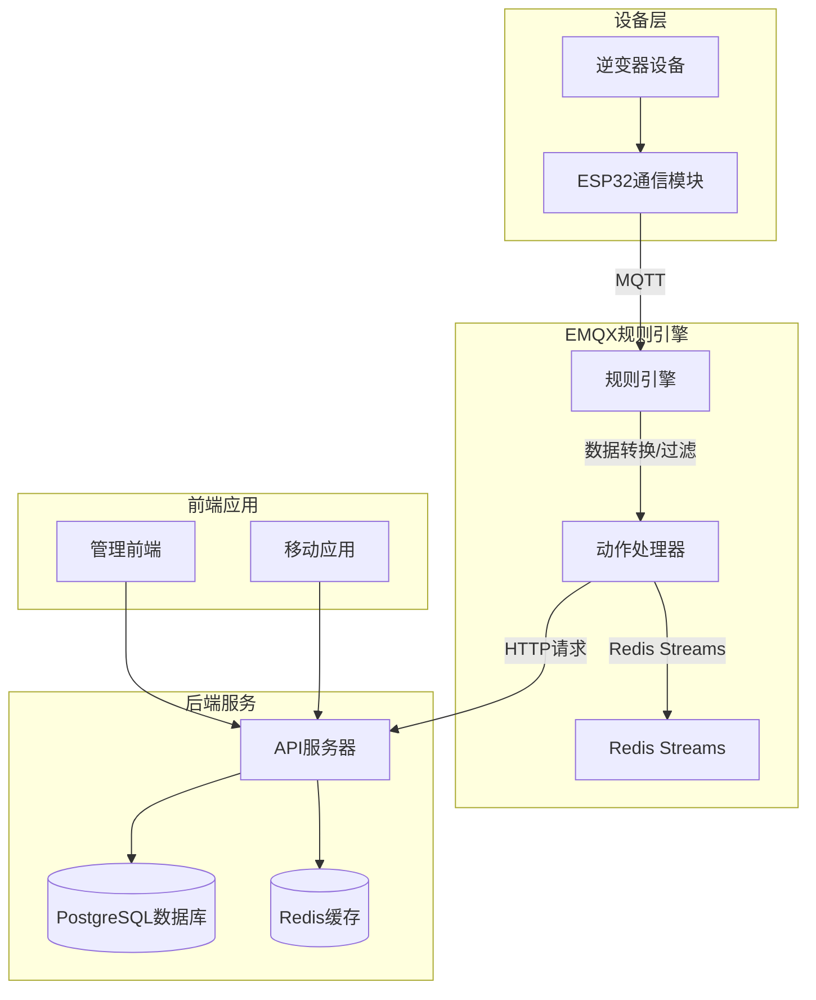
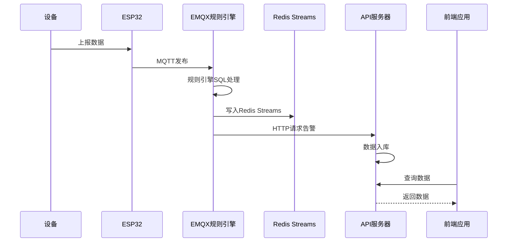
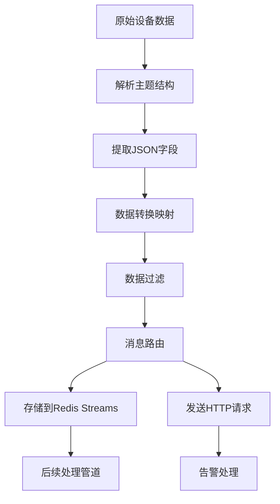
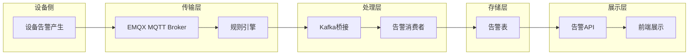
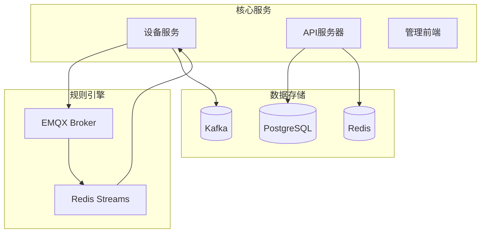
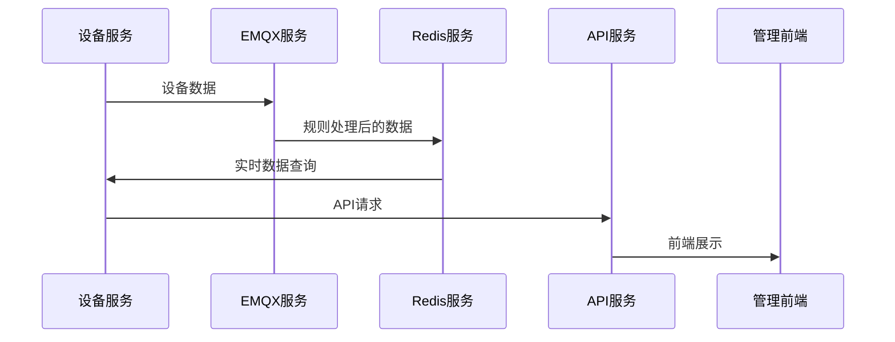
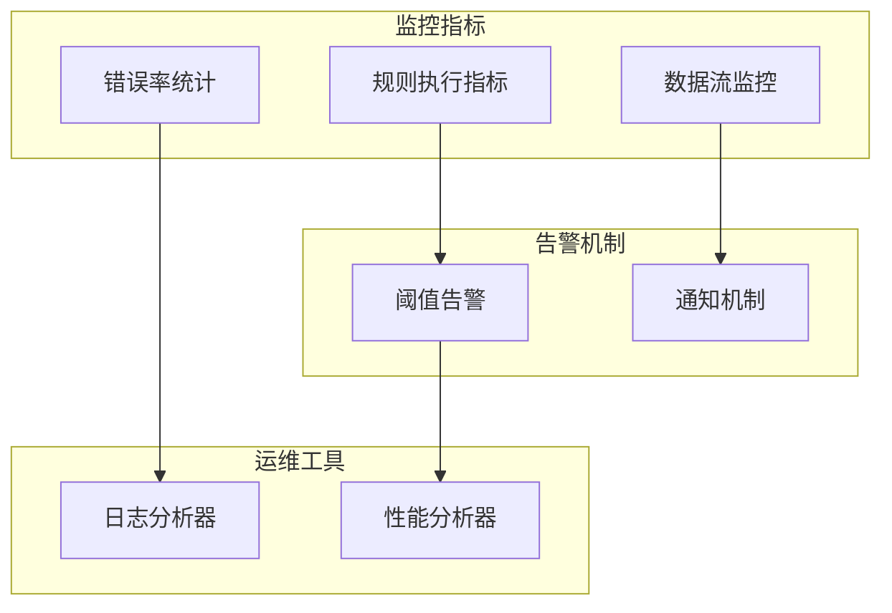

# EMQX规则引擎配置

<cite>
**本文档引用的文件**
- [emqx_rule_engine_sql.md](file://docs/emqx_rule_engine_sql.md)
- [MQTT接口文档.md](file://docs/MQTT接口文档.md)
- [device-model-modularization-plan.md](file://docs/device-model-modularization-plan.md)
- [debug-alarm-not-displayed.md](file://docs/debug-alarm-not-displayed.md)
- [debug-user-list-failure.md](file://docs/debug-user-list-failure.md)
- [repositories.go](file://inv_api_server/internal/repository/repositories.go)
- [main.go](file://inv_api_server/cmd/main.go)
- [AlertsPage.tsx](file://inv-admin-frontend/src/pages/portal/AlertsPage.tsx)
</cite>

## 目录
1. [简介](#简介)
2. [项目结构](#项目结构)
3. [核心组件](#核心组件)
4. [架构概览](#架构概览)
5. [详细组件分析](#详细组件分析)
6. [依赖关系分析](#依赖关系分析)
7. [性能考虑](#性能考虑)
8. [故障排除指南](#故障排除指南)
9. [结论](#结论)

## 简介

本文件为EMQX规则引擎配置的详细技术文档，基于实际项目中的EMQX规则引擎SQL配置进行深入分析。文档涵盖了基于EMQX规则引擎的SQL配置，包括数据转换、过滤和路由规则的设计与实现，详细说明了如何将原始设备数据转换为标准格式，如何根据设备类型和数据类型进行消息路由，以及如何实现数据聚合和告警触发。

## 项目结构

该项目采用微服务架构，EMQX规则引擎主要负责设备数据的接收、转换和路由。关键组件包括：



**图表来源**
- [emqx_rule_engine_sql.md:1-75](file://docs/emqx_rule_engine_sql.md#L1-L75)
- [MQTT接口文档.md:1-647](file://docs/MQTT接口文档.md#L1-L647)

**章节来源**
- [emqx_rule_engine_sql.md:1-75](file://docs/emqx_rule_engine_sql.md#L1-L75)
- [MQTT接口文档.md:1-647](file://docs/MQTT接口文档.md#L1-L647)

## 核心组件

### EMQX规则引擎SQL配置

项目中实现了四个关键的EMQX规则引擎SQL配置：

#### 规则1：数据消息桥接到Redis Streams
- **目的**：将设备上报的数据桥接到Redis Streams，便于后续处理
- **主题匹配**：`cs_inv/+/data/#`
- **输出字段**：payload、topic、clientid、timestamp
- **动作**：Redis Streams → device:stream

#### 规则2：remapLegacyPV字段映射
- **目的**：替代Go代码进行字段映射
- **主题匹配**：`cs_inv/+/dc`
- **字段映射**：pv1_v→pv_voltage、pv1_i→pv_current、pv1_p→pv_power等
- **动作**：消息重发布或桥接到Redis Streams

#### 规则3：remapLegacyEnergy字段映射
- **目的**：替代Go代码进行能量字段映射
- **主题匹配**：`cs_inv/+/energy`
- **字段映射**：daily→daily_pv、total→total_pv、hours→runtime_hours
- **动作**：消息重发布到标准topic

#### 规则4：告警阈值前置判断
- **目的**：提前过滤告警数据，减少后端压力
- **主题匹配**：`cs_inv/+/data/status`
- **过滤条件**：payload.fault_code != 0
- **动作**：HTTP请求到告警处理服务

**章节来源**
- [emqx_rule_engine_sql.md:7-75](file://docs/emqx_rule_engine_sql.md#L7-L75)

### MQTT主题规范

系统遵循统一的MQTT主题格式：`cs_inv/{设备SN}/{子主题}`

#### 主题分类
- **状态类**：`cs_inv/{sn}/status`（每60秒自动发布）
- **数据类**：`cs_inv/{sn}/data/ac`、`cs_inv/{sn}/data/battery`等
- **控制类**：`cs_inv/{sn}/cmd`（命令下发）
- **告警类**：`cs_inv/{sn}/data/alarm`（告警事件）

#### 数据频率
- 状态心跳：60秒
- 一般数据：5秒
- 能量统计：60秒
- 电芯数据：30秒

**章节来源**
- [MQTT接口文档.md:40-90](file://docs/MQTT接口文档.md#L40-L90)
- [MQTT接口文档.md:72-88](file://docs/MQTT接口文档.md#L72-L88)

## 架构概览



**图表来源**
- [emqx_rule_engine_sql.md:10-75](file://docs/emqx_rule_engine_sql.md#L10-L75)
- [debug-alarm-not-displayed.md:34-45](file://docs/debug-alarm-not-displayed.md#L34-L45)

## 详细组件分析

### 规则引擎SQL语法分析

#### SELECT子句设计
规则引擎使用标准SQL语法进行数据提取和转换：

```sql
SELECT
  payload as data,
  topic as mqtt_topic,
  clientid,
  timestamp
FROM "cs_inv/+/data/#"
```

#### WHERE子句过滤
用于实现数据过滤和阈值判断：

```sql
WHERE payload.fault_code != 0
```

#### 字段映射规则
- 使用点号访问嵌套JSON字段
- 支持别名定义（如`pv1_v as pv_voltage`）
- 支持正则表达式提取（如`regex_replace(topic, 'cs_inv/([^/]+)/.*', '$1')`）

### 数据转换流程



**图表来源**
- [emqx_rule_engine_sql.md:28-75](file://docs/emqx_rule_engine_sql.md#L28-L75)

### 告警处理机制

系统实现了多层次的告警处理机制：



**图表来源**
- [debug-alarm-not-displayed.md:34-45](file://docs/debug-alarm-not-displayed.md#L34-L45)

**章节来源**
- [debug-alarm-not-displayed.md:1-46](file://docs/debug-alarm-not-displayed.md#L1-L46)

### 设备模型模块化方案

项目实施了设备型号模块化方案，支持不同型号设备的差异化处理：

#### 动态字段配置
- `device_models`、`device_model_field`、`device_model_protocol`三张表
- 支持根据设备型号动态配置字段映射
- 实现完全的配置化，无需代码修改

#### 协议管理API
- 提供协议配置的CRUD操作
- 支持不同设备类型的解析规则
- 实现设备接入的标准化流程

**章节来源**
- [device-model-modularization-plan.md:1-240](file://docs/device-model-modularization-plan.md#L1-L240)

## 依赖关系分析

### 后端服务依赖



**图表来源**
- [main.go:125-154](file://inv_api_server/cmd/main.go#L125-L154)
- [repositories.go:796-803](file://inv_api_server/internal/repository/repositories.go#L796-L803)

### 数据流依赖

系统中的关键数据流依赖关系：



**图表来源**
- [repositories.go:1466-1464](file://inv_api_server/internal/repository/repositories.go#L1466-L1464)

**章节来源**
- [main.go:241-277](file://inv_api_server/cmd/main.go#L241-L277)
- [repositories.go:796-803](file://inv_api_server/internal/repository/repositories.go#L796-L803)

## 性能考虑

### 规则引擎性能优化

1. **前置过滤**：在规则引擎层面进行数据过滤，减少后端处理压力
2. **批量处理**：利用Redis Streams的批量特性提高处理效率
3. **异步处理**：告警数据通过Kafka异步处理，避免阻塞主数据流

### 数据库性能优化

1. **索引优化**：针对常用查询字段建立适当索引
2. **连接池管理**：合理配置数据库连接池参数
3. **查询优化**：使用预编译语句和参数化查询

### 缓存策略

1. **Redis缓存**：设备实时数据缓存，减少数据库查询
2. **前端缓存**：管理前端的告警数据缓存
3. **CDN加速**：静态资源通过CDN分发

## 故障排除指南

### 常见问题诊断

#### 告警不显示问题

**问题症状**：设备端持续发布alarm数据，但前端监控界面无告警信息

**诊断步骤**：
1. 检查设备_alarms表是否被迁移脚本删除
2. 验证后端写入device_alarms与前端查询alarms表的独立性
3. 确认Flutter alarmStream是否有人监听
4. 检查WebSocket是否推送告警

**解决方案**：
- 修正设备模型中的SN字段JSON标签
- 修改后端将数据写入alarms表
- 在Flutter端增加MQTTService依赖

#### 用户列表获取失败

**问题症状**：管理后台获取用户列表失败

**诊断步骤**：
1. 检查API Gateway路由配置
2. 验证权限检查机制
3. 分析数据库查询错误

**解决方案**：
- 修正路由注册配置
- 实现路径重写映射
- 处理NULL值扫描问题

### 调试工具和方法

#### 规则引擎调试

1. **日志监控**：通过EMQX日志查看规则执行情况
2. **数据验证**：使用测试设备验证规则配置
3. **性能监控**：监控规则执行时间和内存使用

#### 系统监控



**图表来源**
- [debug-user-list-failure.md:76-130](file://docs/debug-user-list-failure.md#L76-L130)

**章节来源**
- [debug-alarm-not-displayed.md:1-46](file://docs/debug-alarm-not-displayed.md#L1-L46)
- [debug-user-list-failure.md:1-130](file://docs/debug-user-list-failure.md#L1-L130)

## 结论

EMQX规则引擎在本项目中发挥了关键作用，通过SQL配置实现了设备数据的高效处理和路由。主要成果包括：

1. **标准化数据处理**：通过规则引擎统一处理不同设备类型的上报数据
2. **高性能架构**：结合Redis Streams和异步处理实现高吞吐量
3. **灵活配置**：支持设备型号模块化，无需代码修改即可适应新设备
4. **完善的监控**：建立了完整的告警处理和监控体系

未来可以进一步优化的方向包括：
- 增加规则引擎的可视化配置界面
- 实现规则的版本管理和回滚机制
- 扩展更多数据处理和分析功能
- 完善告警规则的配置管理