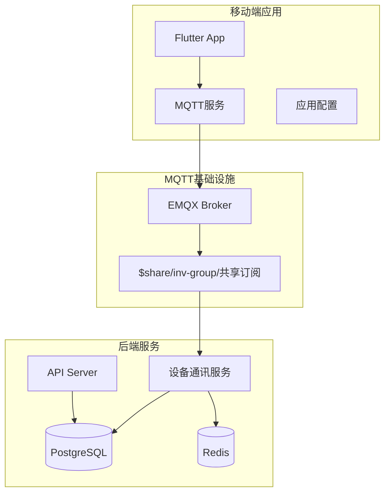
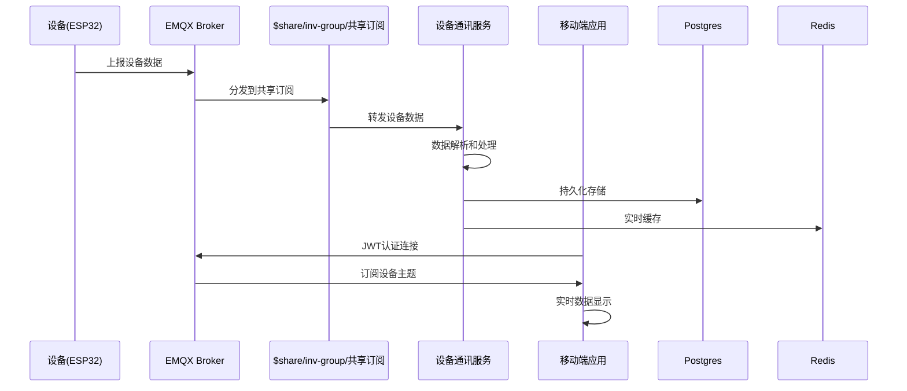
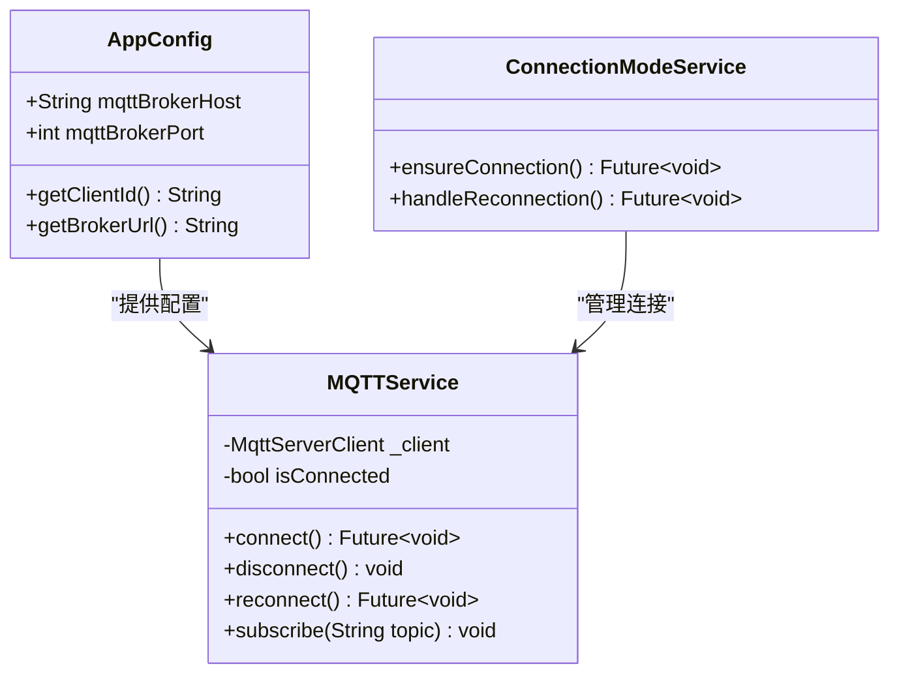
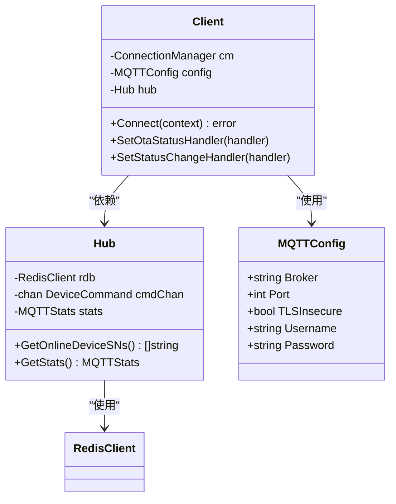
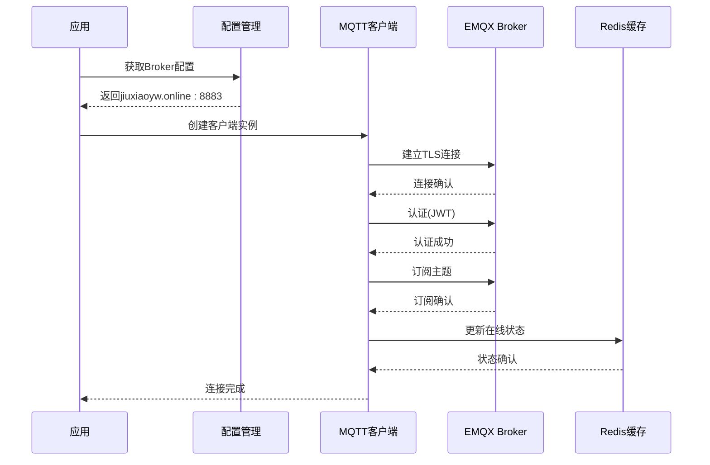
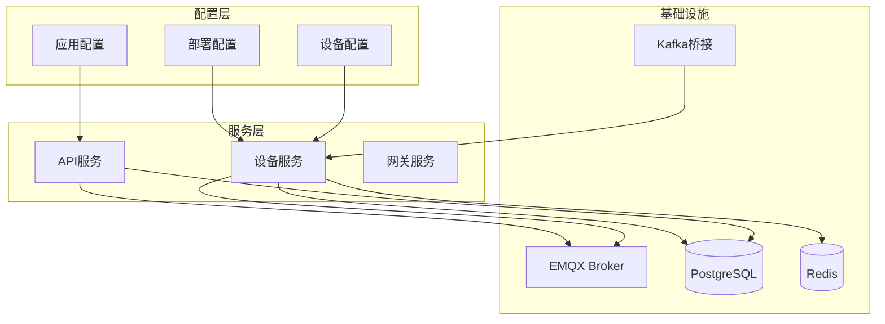
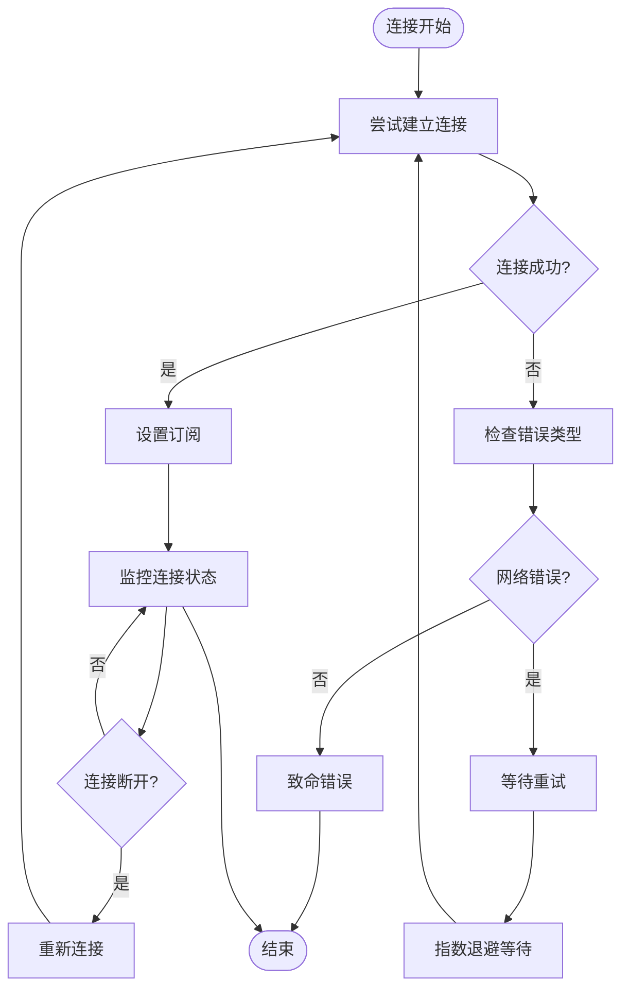

# MQTT连接配置

<cite>
**本文档引用的文件**
- [inv_device_server/internal/mqtt/client.go](file://inv_device_server/internal/mqtt/client.go)
- [inv_device_server/cmd/main.go](file://inv_device_server/cmd/main.go)
- [inv_app/lib/core/config/app_config.dart](file://inv_app/lib/core/config/app_config.dart)
- [inv_app/lib/core/services/mqtt_service.dart](file://inv_app/lib/core/services/mqtt_service.dart)
- [README.md](file://README.md)
- [deploy/k8s-device-server.yaml](file://deploy/k8s-device-server.yaml)
- [deploy/configs/device-server.yaml](file://deploy/configs/device-server.yaml)
- [inv_device_server/internal/config/config.go](file://inv_device_server/internal/config/config.go)
</cite>

## 目录
1. [简介](#简介)
2. [项目结构](#项目结构)
3. [核心组件](#核心组件)
4. [架构概览](#架构概览)
5. [详细组件分析](#详细组件分析)
6. [依赖关系分析](#依赖关系分析)
7. [性能考虑](#性能考虑)
8. [故障排除指南](#故障排除指南)
9. [结论](#结论)

## 简介

本文档为EMQX MQTT Broker的连接配置提供全面的技术指导。该系统采用EMQX作为生产级MQTT Broker，支持TLS加密连接（mqtts://协议，端口8883），实现了基于JWT的认证机制和会话保持策略。

系统架构采用实时数据直连EMQX的设计原则，移动端应用通过JWT认证直接连接EMQX Broker进行设备数据订阅，后端服务通过共享订阅模式实现高可用扩展。

## 项目结构

系统采用多层架构设计，包含移动端应用、后端API服务、设备通讯服务和EMQX Broker：

**图表来源**
- [README.md:5-30](file://README.md#L5-L30)
- [README.md:195-205](file://README.md#L195-L205)

**章节来源**
- [README.md:33-133](file://README.md#L33-L133)

## 核心组件

### MQTT客户端配置

系统中的MQTT客户端配置包含以下关键参数：

- **Broker地址**: jiuxiaoyw.online:8883
- **TLS加密**: 端口8883自动启用TLS连接
- **Keepalive间隔**: 120秒（可在客户端代码中调整）
- **Clean Session**: false（会话保持）
- **会话过期时间**: 86400秒（24小时）

### 认证机制

系统采用EMQX内置JWT认证机制：
- JWT算法：HS256
- Secret密钥：CSKJ_INV_APP_SERVER_APP_MQTT_KEY
- 密钥不使用Base64编码
- 连接后过期自动断连

**章节来源**
- [inv_device_server/internal/mqtt/client.go:136-155](file://inv_device_server/internal/mqtt/client.go#L136-L155)
- [README.md:155-167](file://README.md#L155-L167)

## 架构概览

系统采用EMQX作为核心MQTT Broker，实现设备数据的实时传输和分发：

**图表来源**
- [README.md:208-214](file://README.md#L208-L214)

## 详细组件分析

### 移动端MQTT配置

移动端应用通过统一的配置文件管理MQTT连接参数：

**图表来源**
- [inv_app/lib/core/config/app_config.dart:1-10](file://inv_app/lib/core/config/app_config.dart#L1-L10)
- [inv_app/lib/core/services/mqtt_service.dart:70-80](file://inv_app/lib/core/services/mqtt_service.dart#L70-L80)

移动端配置特点：
- Broker地址：jiuxiaoyw.online
- 端口：8883（TLS）
- 客户端ID：动态生成
- 认证：基于JWT Token

### 设备端MQTT客户端

设备通讯服务的MQTT客户端实现：

**图表来源**
- [inv_device_server/internal/mqtt/client.go:20-58](file://inv_device_server/internal/mqtt/client.go#L20-L58)
- [inv_device_server/internal/config/config.go:1-50](file://inv_device_server/internal/config/config.go#L1-L50)

设备端配置特点：
- 自动TLS检测：端口8883自动启用TLS
- 会话保持：CleanStartOnInitialConnection=false
- 会话过期：SessionExpiryInterval=86400秒
- Keepalive：120秒

### 连接建立流程

**图表来源**
- [inv_app/lib/core/services/mqtt_service.dart:70-80](file://inv_app/lib/core/services/mqtt_service.dart#L70-L80)
- [inv_device_server/internal/mqtt/client.go:136-155](file://inv_device_server/internal/mqtt/client.go#L136-L155)

**章节来源**
- [inv_app/lib/core/config/app_config.dart:6-7](file://inv_app/lib/core/config/app_config.dart#L6-L7)
- [inv_app/lib/core/services/mqtt_service.dart:74](file://inv_app/lib/core/services/mqtt_service.dart#L74)

## 依赖关系分析

系统各组件之间的依赖关系如下：

**图表来源**
- [deploy/k8s-device-server.yaml:30-66](file://deploy/k8s-device-server.yaml#L30-L66)
- [deploy/configs/device-server.yaml:26-38](file://deploy/configs/device-server.yaml#L26-L38)

**章节来源**
- [deploy/k8s-device-server.yaml:4-104](file://deploy/k8s-device-server.yaml#L4-L104)
- [deploy/configs/device-server.yaml:13-38](file://deploy/configs/device-server.yaml#L13-L38)

## 性能考虑

### Keepalive机制

系统采用120秒的Keepalive间隔，这是经过优化的平衡点：

- **网络优化**: 减少不必要的心跳包，降低带宽消耗
- **连接稳定性**: 确保网络中断能够及时检测
- **资源占用**: 合理的CPU和内存使用

### 会话保持策略

Clean Session=false的会话保持提供了以下优势：

- **连接恢复**: 网络中断后快速恢复订阅状态
- **消息完整性**: 确保离线期间的重要消息不会丢失
- **性能提升**: 避免重复建立连接的开销

### TLS加密配置

- **端口8883**: 自动启用TLS加密
- **证书验证**: 生产环境建议配置完整的SSL证书链
- **性能影响**: TLS加密对性能有轻微影响，但安全性至关重要

## 故障排除指南

### 常见连接问题

1. **认证失败**
   - 检查JWT Token是否有效
   - 验证Secret密钥配置
   - 确认Token未过期

2. **TLS连接问题**
   - 验证SSL证书有效性
   - 检查防火墙设置
   - 确认端口8883可达

3. **会话恢复问题**
   - 检查Clean Session配置
   - 验证会话过期时间设置
   - 确认Broker会话存储正常

### 连接重试策略

系统实现了智能的连接重试机制：

**图表来源**
- [inv_app/lib/core/services/connection_mode_service.dart:37-39](file://inv_app/lib/core/services/connection_mode_service.dart#L37-L39)

### 调优建议

1. **网络环境优化**
   - 将Keepalive设置调整为60-180秒之间
   - 根据网络质量调整重试间隔
   - 考虑使用WebSocket替代TCP

2. **设备端优化**
   - 实现连接状态监听
   - 添加本地缓存机制
   - 优化消息处理队列

3. **Broker端优化**
   - 配置适当的会话超时时间
   - 设置合理的连接数限制
   - 监控连接池使用情况

**章节来源**
- [README.md:246-251](file://README.md#L246-L251)

## 结论

该MQTT连接配置方案提供了稳定、安全且高性能的设备数据传输能力。通过EMQX的共享订阅机制和JWT认证，系统实现了高可用性和安全性。建议设备制造商根据实际网络环境对连接参数进行微调，并建立完善的监控和故障排除机制。

关键配置要点：
- 使用TLS加密连接（端口8883）
- 配置正确的Broker地址和认证信息
- 启用会话保持策略
- 合理设置Keepalive间隔
- 建立连接重试和监控机制