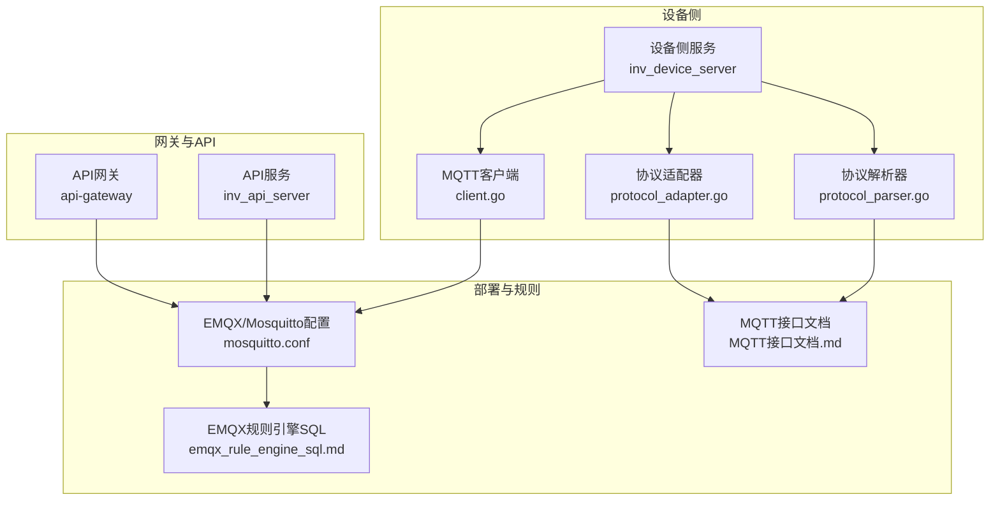
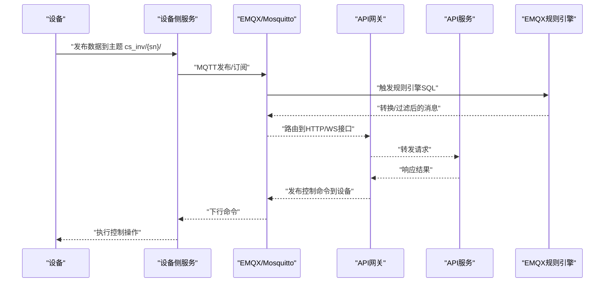
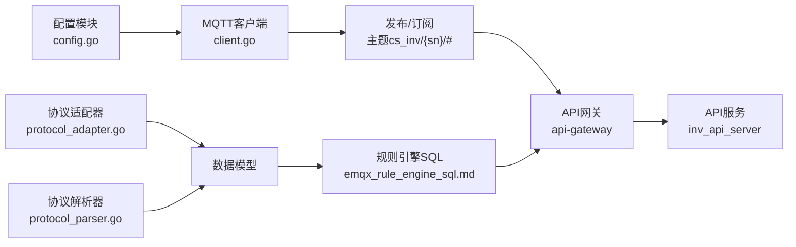

# MQTT通信协议

<cite>
**本文引用的文件**
- [MQTT接口文档.md](file://docs/MQTT接口文档.md)
- [emqx_rule_engine_sql.md](file://docs/emqx_rule_engine_sql.md)
- [设备端OTA程序开发指南.md](file://docs/设备端OTA程序开发指南.md)
- [client.go](file://inv_device_server/internal/mqtt/client.go)
- [protocol_adapter.go](file://inv_device_server/internal/service/protocol_adapter.go)
- [protocol_parser.go](file://inv_device_server/internal/service/protocol_parser.go)
- [config.go](file://inv_device_server/internal/config/config.go)
- [config.go](file://api-gateway/internal/config/config.go)
- [mosquitto.conf](file://deploy/mosquitto/mosquitto.conf)
- [config.docker.yaml](file://inv_device_server/config.docker.yaml)
- [config.docker.yaml](file://api-gateway/config.docker.yaml)
- [config.docker.yaml](file://inv_api_server/config.docker.yaml)
</cite>

## 目录
1. [引言](#引言)
2. [项目结构](#项目结构)
3. [核心组件](#核心组件)
4. [架构总览](#架构总览)
5. [详细组件分析](#详细组件分析)
6. [依赖关系分析](#依赖关系分析)
7. [性能考虑](#性能考虑)
8. [故障排除指南](#故障排除指南)
9. [结论](#结论)
10. [附录](#附录)

## 引言
本技术文档围绕基于EMQX的MQTT消息传输协议进行系统化梳理，面向设备制造商与集成方提供从主题结构、消息格式到规则引擎配置、共享订阅与客户端连接配置的完整指南。文档重点覆盖以下方面：
- 设备数据上报的主题结构与数据包规范（cs_inv/{sn}/#）
- OTA升级命令的消息格式（升级指令、固件URL、版本信息、校验码）
- 设备状态上报的数据结构（实时数据、告警信息、运行状态）
- EMQX规则引擎SQL配置（数据转换、过滤与路由）
- 共享订阅机制$share/inv-group/的使用（负载均衡与故障转移）
- MQTT客户端连接配置（用户名/密码、SSL证书、心跳设置）
- 消息可靠性保证、重连机制与错误处理策略
- 协议适配指南与调试工具使用说明

## 项目结构
该仓库采用多模块分层架构，涉及设备侧服务、网关服务、API服务以及部署配置等部分。与MQTT协议直接相关的核心模块如下：
- 设备侧服务：负责MQTT客户端初始化、消息收发、协议解析与适配
- 网关服务：提供HTTP代理与路由能力，便于与EMQX网关对接
- 规则引擎文档：定义EMQX SQL规则，用于数据转换、过滤与路由
- 部署配置：包含Mosquitto/EMQX配置示例与容器化配置

**图表来源**
- [client.go](file://inv_device_server/internal/mqtt/client.go)
- [protocol_adapter.go](file://inv_device_server/internal/service/protocol_adapter.go)
- [protocol_parser.go](file://inv_device_server/internal/service/protocol_parser.go)
- [mosquitto.conf](file://deploy/mosquitto/mosquitto.conf)
- [emqx_rule_engine_sql.md](file://docs/emqx_rule_engine_sql.md)
- [MQTT接口文档.md](file://docs/MQTT接口文档.md)

**章节来源**
- [client.go](file://inv_device_server/internal/mqtt/client.go)
- [protocol_adapter.go](file://inv_device_server/internal/service/protocol_adapter.go)
- [protocol_parser.go](file://inv_device_server/internal/service/protocol_parser.go)
- [mosquitto.conf](file://deploy/mosquitto/mosquitto.conf)
- [emqx_rule_engine_sql.md](file://docs/emqx_rule_engine_sql.md)
- [MQTT接口文档.md](file://docs/MQTT接口文档.md)

## 核心组件
- MQTT客户端：负责建立与EMQX的连接、发布/订阅主题、处理回调与错误
- 协议适配器：将设备原始数据映射为统一的数据模型，支持字段转换与扩展
- 协议解析器：解析设备上报的二进制或文本数据包，提取实时量测、告警与运行状态
- 规则引擎：通过SQL对入站消息进行过滤、转换与路由，输出到Kafka或其他下游
- 客户端配置：统一管理用户名/密码、SSL/TLS、心跳间隔、重连策略等参数

**章节来源**
- [client.go](file://inv_device_server/internal/mqtt/client.go)
- [protocol_adapter.go](file://inv_device_server/internal/service/protocol_adapter.go)
- [protocol_parser.go](file://inv_device_server/internal/service/protocol_parser.go)
- [config.go](file://inv_device_server/internal/config/config.go)

## 架构总览
下图展示了设备侧服务、API网关与EMQX之间的交互关系，以及规则引擎在消息流转中的作用。

**图表来源**
- [client.go](file://inv_device_server/internal/mqtt/client.go)
- [emqx_rule_engine_sql.md](file://docs/emqx_rule_engine_sql.md)
- [config.docker.yaml](file://inv_device_server/config.docker.yaml)

## 详细组件分析

### 主题结构与数据包规范
- 主题前缀：cs_inv/{sn}/#
- 说明：
  - {sn}为设备序列号，用于唯一标识设备
  - #为通配符，允许设备上报多个子主题路径
- 建议的数据包规范：
  - JSON格式：包含时间戳、设备SN、字段集合与可选校验信息
  - 字段命名：遵循统一命名规范，避免保留字与特殊字符
  - 分包策略：大字段拆分、压缩传输、批量上报优化
- 上报方向：设备→MQTT Broker→规则引擎→API网关→后端服务
- 下发方向：后端→API网关→MQTT Broker→设备

**章节来源**
- [MQTT接口文档.md](file://docs/MQTT接口文档.md)

### OTA升级命令消息格式
- 命令类型：ota_command
- 关键字段：
  - firmware_url：固件下载地址
  - version：目标版本号
  - checksum：固件校验值（如MD5/SHA256）
  - force_update：是否强制更新
  - timeout_sec：超时秒数
- 建议流程：
  - 设备上报当前版本与设备信息
  - 后端下发OTA命令，携带上述字段
  - 设备校验URL与校验码，确认后开始下载
  - 下载完成后重启并上报新版本

**章节来源**
- [设备端OTA程序开发指南.md](file://docs/设备端OTA程序开发指南.md)

### 设备状态上报数据结构
- 实时数据：电压、电流、功率、频率、电能等
- 告警信息：告警类型、严重级别、发生/恢复时间
- 运行状态：工作模式、保护状态、故障代码、运行时长
- 建议字段映射：
  - 使用协议适配器进行字段归一化
  - 对异常值进行阈值过滤与滑动窗口统计
  - 支持增量上报与全量快照

**章节来源**
- [protocol_adapter.go](file://inv_device_server/internal/service/protocol_adapter.go)
- [protocol_parser.go](file://inv_device_server/internal/service/protocol_parser.go)

### EMQX规则引擎SQL配置
- 目标：数据转换、过滤与路由
- 常见用法：
  - 过滤无效主题或空载荷
  - 解析JSON字段，生成派生指标
  - 路由到Kafka或其他MQTT主题
  - 计算聚合指标并写入数据库
- 配置位置：参考规则引擎SQL文档，结合部署环境调整

**章节来源**
- [emqx_rule_engine_sql.md](file://docs/emqx_rule_engine_sql.md)

### 共享订阅机制$share/inv-group/
- 作用：实现多实例负载均衡与故障转移
- 使用方式：订阅$share/inv-group/cs_inv/+/+
- 特性：
  - 负载均衡：同一组内消息仅被一个消费者接收
  - 故障转移：节点故障时自动切换到其他节点
  - 组名自定义：inv-group可根据部署规模调整
- 注意事项：
  - 确保消费者数量与负载匹配
  - 处理重复消费与顺序性要求

**章节来源**
- [emqx_rule_engine_sql.md](file://docs/emqx_rule_engine_sql.md)

### MQTT客户端连接配置
- 认证：
  - 用户名/密码：在客户端初始化时配置
  - SSL/TLS：启用证书校验，指定CA/Cert/Key
- 心跳与会话：
  - keepalive：建议30-60秒
  - clean_session：首次连接可设为true，断线重连保持会话
- 重连策略：
  - 初始退避：1秒
  - 最大退避：60秒
  - 退避算法：指数回退+抖动
- QoS与持久化：
  - 上行数据：最多一次（QoS0）以降低开销
  - 下行命令：至少一次（QoS1），确保可靠送达
  - 未确认消息持久化，重启后继续发送

**章节来源**
- [client.go](file://inv_device_server/internal/mqtt/client.go)
- [config.go](file://inv_device_server/internal/config/config.go)
- [config.docker.yaml](file://inv_device_server/config.docker.yaml)

### 消息可靠性、重连与错误处理
- 可靠性：
  - QoS1用于关键命令；QoS0用于高频遥测
  - 未确认消息队列与超时重发
- 重连：
  - 断线检测与指数回退
  - 优先恢复订阅，再补发待确认消息
- 错误处理：
  - 网络异常：记录日志、触发重连
  - 认证失败：检查凭据与证书链
  - 主题权限不足：检查ACL与订阅权限
  - 解析失败：丢弃无效载荷并上报统计

**章节来源**
- [client.go](file://inv_device_server/internal/mqtt/client.go)

### 协议适配指南与调试工具
- 适配步骤：
  - 确认设备上报主题与数据格式
  - 在协议适配器中完成字段映射与单位换算
  - 在规则引擎中验证转换与路由
- 调试工具：
  - MQTT客户端测试：发布/订阅验证
  - 日志监控：查看连接、重连、解析与路由日志
  - 性能压测：使用脚本模拟高并发场景
  - 抓包分析：对比期望与实际载荷

**章节来源**
- [protocol_adapter.go](file://inv_device_server/internal/service/protocol_adapter.go)
- [protocol_parser.go](file://inv_device_server/internal/service/protocol_parser.go)
- [deploy/mqtt_benchmark.sh](file://deploy/scripts/mqtt_benchmark.sh)

## 依赖关系分析
- 设备侧服务依赖MQTT客户端库与配置模块
- 协议适配器与解析器依赖设备元数据与字段定义
- 规则引擎依赖EMQX配置与SQL脚本
- 网关服务依赖API路由与中间件（CORS/JWT/Prometheus等）

**图表来源**
- [client.go](file://inv_device_server/internal/mqtt/client.go)
- [protocol_adapter.go](file://inv_device_server/internal/service/protocol_adapter.go)
- [protocol_parser.go](file://inv_device_server/internal/service/protocol_parser.go)
- [config.go](file://inv_device_server/internal/config/config.go)
- [emqx_rule_engine_sql.md](file://docs/emqx_rule_engine_sql.md)

**章节来源**
- [client.go](file://inv_device_server/internal/mqtt/client.go)
- [protocol_adapter.go](file://inv_device_server/internal/service/protocol_adapter.go)
- [protocol_parser.go](file://inv_device_server/internal/service/protocol_parser.go)
- [config.go](file://inv_device_server/internal/config/config.go)

## 性能考虑
- 发布频率与批量上报：减少QoS0消息频次，合并小包
- 字段裁剪与压缩：剔除冗余字段，必要时启用压缩
- 订阅粒度：按需订阅，避免过度通配导致内存与CPU压力
- 规则引擎优化：尽量在SQL中完成过滤与转换，减少下游压力
- 连接池与重连：合理设置keepalive与退避，避免频繁重建连接

## 故障排除指南
- 无法连接Broker：
  - 检查网络连通性与防火墙
  - 核对认证信息与证书链
  - 查看Broker日志与ACL配置
- 订阅无消息：
  - 确认主题格式与通配符使用
  - 检查共享订阅组名与消费者数量
- 消息丢失：
  - 上行使用QoS0，下行使用QoS1
  - 检查未确认消息队列与超时重发
- 规则引擎不生效：
  - 校验SQL语法与事件源
  - 查看规则执行日志与输出

**章节来源**
- [client.go](file://inv_device_server/internal/mqtt/client.go)
- [emqx_rule_engine_sql.md](file://docs/emqx_rule_engine_sql.md)

## 结论
本协议文档基于现有代码与配置，给出了从主题设计、消息格式、规则引擎到客户端配置与运维保障的完整方案。建议在生产环境中持续完善字段规范、增强异常处理与监控告警，并根据业务增长调整共享订阅与规则引擎策略。

## 附录
- 配置文件位置参考：
  - 设备侧服务：[config.docker.yaml](file://inv_device_server/config.docker.yaml)
  - API网关：[config.docker.yaml](file://api-gateway/config.docker.yaml)
  - API服务：[config.docker.yaml](file://inv_api_server/config.docker.yaml)
  - Mosquitto/EMQX：[mosquitto.conf](file://deploy/mosquitto/mosquitto.conf)
- 文档参考：
  - [MQTT接口文档.md](file://docs/MQTT接口文档.md)
  - [emqx_rule_engine_sql.md](file://docs/emqx_rule_engine_sql.md)
  - [设备端OTA程序开发指南.md](file://docs/设备端OTA程序开发指南.md)