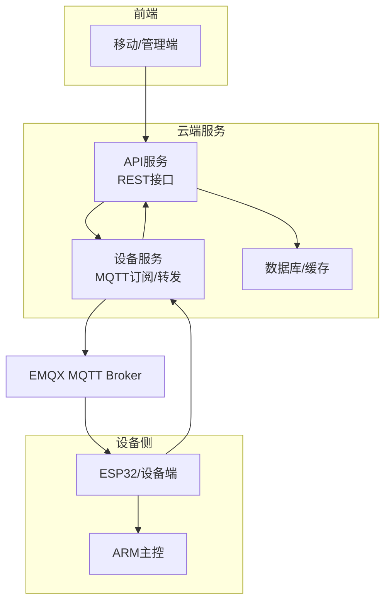
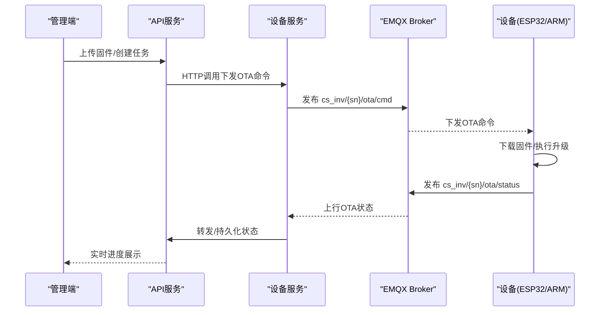
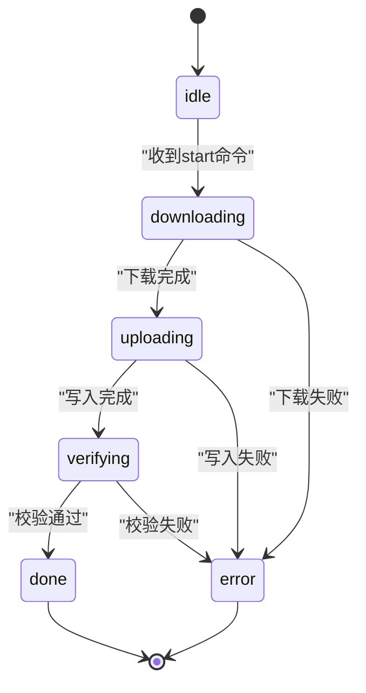
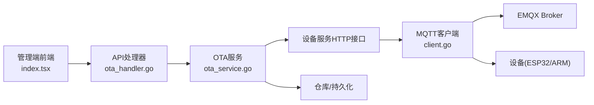

# OTA升级协议

<cite>
**本文档引用的文件**
- [README.md](file://README.md)
- [MQTT接口文档.md](file://docs/MQTT接口文档.md)
- [ota_handler.go](file://inv_api_server/internal/handler/ota_handler.go)
- [ota_service.go](file://inv_api_server/internal/service/ota_service.go)
- [client.go](file://inv_device_server/internal/mqtt/client.go)
- [index.tsx](file://inv-admin-frontend/src/pages/ota/index.tsx)
</cite>

## 目录
1. [简介](#简介)
2. [项目结构](#项目结构)
3. [核心组件](#核心组件)
4. [架构总览](#架构总览)
5. [详细组件分析](#详细组件分析)
6. [依赖关系分析](#依赖关系分析)
7. [性能考虑](#性能考虑)
8. [故障排查指南](#故障排查指南)
9. [结论](#结论)
10. [附录](#附录)

## 简介
本文件面向设备制造商与平台开发者，系统性阐述基于MQTT的OTA远程升级协议与实现。文档覆盖云端下发升级命令、设备下载固件、状态上报与结果确认的完整流程；明确OTA命令格式与升级状态主题的数据结构；给出升级状态机（idle→downloading→uploading→verifying→done/error）的转换过程；并提供进度跟踪、断点续传、回滚策略、固件校验与安全加固等关键技术要点。

## 项目结构
该系统采用“移动端/管理端 → API服务 → 设备服务 → MQTT Broker → 设备”的分层架构。OTA能力贯穿API服务与设备服务两端：API服务负责固件管理、任务编排与状态持久化；设备服务负责MQTT订阅、命令转发与状态上报。

**图表来源**
- [README.md: 1-367:1-367](file://README.md#L1-L367)
- [MQTT接口文档.md: 1-647:1-647](file://docs/MQTT接口文档.md#L1-L647)

**章节来源**
- [README.md: 1-367:1-367](file://README.md#L1-L367)
- [MQTT接口文档.md: 1-647:1-647](file://docs/MQTT接口文档.md#L1-L647)

## 核心组件
- API服务（inv_api_server）
  - 提供固件上传、版本管理、OTA任务推送、状态查询与历史查询等REST接口
  - 负责生成OTA命令并调用设备服务的命令通道
- 设备服务（inv_device_server）
  - 通过MQTT订阅设备上报的主题，识别OTA状态与命令确认
  - 将OTA命令转发到设备侧专用主题，实现云端到设备的可靠传递
- MQTT协议与主题
  - 命令主题：cs_inv/{sn}/ota/cmd
  - 状态主题：cs_inv/{sn}/ota/status
  - 命令确认主题：cs_inv/{sn}/ota/cmd_ack
  - 设备通用状态主题：cs_inv/{sn}/status
- 前端管理端（inv-admin-frontend）
  - 提供固件上传、OTA任务管理、进度可视化与重试/取消操作

**章节来源**
- [ota_handler.go: 1-547:1-547](file://inv_api_server/internal/handler/ota_handler.go#L1-L547)
- [ota_service.go: 1-355:1-355](file://inv_api_server/internal/service/ota_service.go#L1-L355)
- [client.go: 1-428:1-428](file://inv_device_server/internal/mqtt/client.go#L1-L428)
- [MQTT接口文档.md: 487-606:487-606](file://docs/MQTT接口文档.md#L487-L606)

## 架构总览
OTA升级的端到端流程如下：

**图表来源**
- [README.md: 253-279:253-279](file://README.md#L253-L279)
- [ota_service.go: 183-234:183-234](file://inv_api_server/internal/service/ota_service.go#L183-L234)
- [client.go: 164-224:164-224](file://inv_device_server/internal/mqtt/client.go#L164-L224)

## 详细组件分析

### OTA命令格式与下发
- 命令主题：cs_inv/{sn}/ota/cmd
- 命令字段
  - command: start
  - target: esp/arm/dsp/bms
  - url: 固件下载地址（HTTP）
  - version: 固件版本
  - file_md5: 固件MD5
  - file_sha256: 固件SHA256
  - file_size: 固件大小（字节）
  - upgrade_id: 升级任务ID
- 下发流程
  - API服务根据固件信息组装命令体
  - 通过HTTP调用设备服务的命令接口，设备服务再以MQTT发布到设备主题
  - 设备侧ESP32接收后透传到ARM执行

**章节来源**
- [README.md: 288-300:288-300](file://README.md#L288-L300)
- [ota_service.go: 183-234:183-234](file://inv_api_server/internal/service/ota_service.go#L183-L234)
- [client.go: 270-339:270-339](file://inv_device_server/internal/mqtt/client.go#L270-L339)

### 升级状态上报与数据结构
- 状态主题：cs_inv/{sn}/ota/status
- 状态字段
  - target: 升级目标（esp/arm/dsp/bms）
  - state: 状态（idle/downloading/uploading/verifying/done/error）
  - progress: 进度百分比（0-100）
  - message: 状态消息
- 状态机转换
  - idle → downloading（开始下载）
  - downloading → uploading（下载完成，准备写入）
  - uploading → verifying（写入完成，准备校验）
  - verifying → done（校验通过，升级完成）
  - error（任意阶段失败）

**图表来源**
- [MQTT接口文档.md: 487-506:487-506](file://docs/MQTT接口文档.md#L487-L506)

**章节来源**
- [MQTT接口文档.md: 487-506:487-506](file://docs/MQTT接口文档.md#L487-L506)

### 命令确认与结果确认
- 命令确认主题：cs_inv/{sn}/ota/cmd_ack
- 设备在收到OTA命令后，应向上游发布确认消息，确保云端知悉命令已送达
- 设备服务订阅该主题并进行处理，保证命令投递的可靠性

**章节来源**
- [client.go: 374-386:374-386](file://inv_device_server/internal/mqtt/client.go#L374-L386)

### 进度跟踪与历史查询
- API服务提供设备OTA状态查询与历史查询接口，管理端可实时查看升级进度与结果
- 前端管理端提供OTA任务面板，支持重试失败任务、取消待执行任务等操作

**章节来源**
- [ota_handler.go: 355-378:355-378](file://inv_api_server/internal/handler/ota_handler.go#L355-L378)
- [index.tsx: 515-913:515-913](file://inv-admin-frontend/src/pages/ota/index.tsx#L515-L913)

### 断点续传与回滚策略
- 断点续传
  - 建议设备侧在下载阶段记录已下载偏移，失败重连后继续下载
  - 云端可在重试时下发相同URL，设备侧依据文件完整性校验决定是否继续
- 回滚策略
  - 设备侧应在升级前备份当前固件版本，升级失败时自动回滚
  - API服务提供重试接口，便于快速恢复升级

**章节来源**
- [README.md: 315-321:315-321](file://README.md#L315-L321)

### 固件校验与安全
- 校验机制
  - 云端在创建固件时计算并存储MD5与SHA256
  - 设备侧在升级完成后进行二次校验，确保固件完整性
- 安全保障
  - MQTT使用TLS加密（端口8883）
  - 设备通过固定用户名/密码连接，建议结合JWT鉴权
  - 命令与状态均采用MQTT QoS 1，提升可靠性

**章节来源**
- [README.md: 288-300:288-300](file://README.md#L288-L300)
- [MQTT接口文档.md: 25-37:25-37](file://docs/MQTT接口文档.md#L25-L37)

## 依赖关系分析

**图表来源**
- [ota_handler.go: 1-26:1-26](file://inv_api_server/internal/handler/ota_handler.go#L1-L26)
- [ota_service.go: 22-42:22-42](file://inv_api_server/internal/service/ota_service.go#L22-L42)
- [client.go: 20-45:20-45](file://inv_device_server/internal/mqtt/client.go#L20-L45)
- [index.tsx: 166-504:166-504](file://inv-admin-frontend/src/pages/ota/index.tsx#L166-L504)

**章节来源**
- [ota_handler.go: 1-26:1-26](file://inv_api_server/internal/handler/ota_handler.go#L1-L26)
- [ota_service.go: 22-42:22-42](file://inv_api_server/internal/service/ota_service.go#L22-L42)
- [client.go: 20-45:20-45](file://inv_device_server/internal/mqtt/client.go#L20-L45)
- [index.tsx: 166-504:166-504](file://inv-admin-frontend/src/pages/ota/index.tsx#L166-L504)

## 性能考虑
- 并发控制：API服务对批量设备推送采用并发限制，避免瞬时压力过大
- 缓存与队列：设备服务通过Redis维护设备在线状态，MQTT QoS 1保障消息可达
- 传输优化：固件下载使用HTTP直链，建议配合CDN加速与断点续传

**章节来源**
- [ota_service.go: 134-181:134-181](file://inv_api_server/internal/service/ota_service.go#L134-L181)
- [client.go: 79-128:79-128](file://inv_device_server/internal/mqtt/client.go#L79-L128)

## 故障排查指南
- 常见问题
  - 命令未到达设备：检查设备服务是否订阅cs_inv/+/ota/cmd_ack与cs_inv/+/ota/status
  - 状态未回传：确认设备是否正确发布cs_inv/{sn}/ota/status
  - 校验失败：核对file_md5与file_sha256是否与上传固件一致
- 日志定位
  - API服务与设备服务均记录MQTT连接、订阅、发布与错误日志
  - 前端管理端提供重试与取消操作，便于快速恢复

**章节来源**
- [client.go: 164-236:164-236](file://inv_device_server/internal/mqtt/client.go#L164-L236)
- [ota_service.go: 196-234:196-234](file://inv_api_server/internal/service/ota_service.go#L196-L234)

## 结论
本OTA协议以MQTT为核心载体，结合API服务的任务编排与设备服务的可靠转发，实现了从云端到设备的完整升级闭环。通过标准化命令格式、状态上报与校验机制，并辅以断点续传与回滚策略，能够有效提升升级成功率与用户体验。建议设备厂商严格遵循本文档的协议规范与最佳实践，确保升级流程稳定可控。

## 附录

### 协议适配指南（设备侧）
- 主题订阅
  - 订阅cs_inv/+/ota/cmd与cs_inv/+/ota/cmd_ack，确保命令可达与确认
  - 订阅cs_inv/+/ota/status，定期上报升级状态
- 命令处理
  - 接收start命令后，解析target与url，执行下载与写入
  - 下载完成后发布状态至cs_inv/{sn}/ota/status
- 校验与回滚
  - 升级完成后进行MD5/SHA256校验
  - 失败时执行回滚并上报error状态

**章节来源**
- [client.go: 164-224:164-224](file://inv_device_server/internal/mqtt/client.go#L164-L224)
- [MQTT接口文档.md: 587-606:587-606](file://docs/MQTT接口文档.md#L587-L606)

### 升级测试方法
- 单设备测试
  - 上传固件 → 推送任务 → 观察设备状态上报 → 校验升级结果
- 批量测试
  - 选择多台设备进行并行升级，关注并发限制与失败重试
- 异常场景
  - 网络中断、断点续传、校验失败、回滚验证

**章节来源**
- [README.md: 253-279:253-279](file://README.md#L253-L279)
- [index.tsx: 515-913:515-913](file://inv-admin-frontend/src/pages/ota/index.tsx#L515-L913)