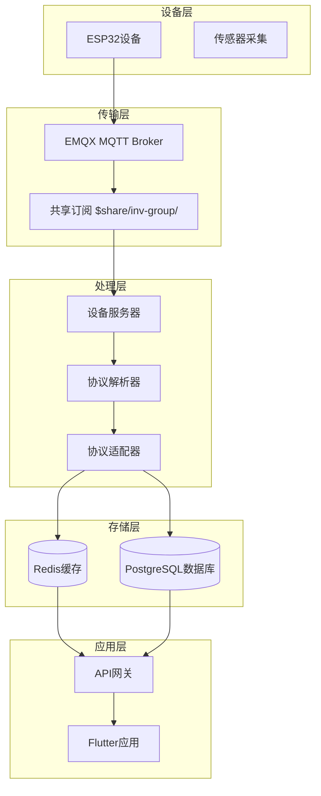
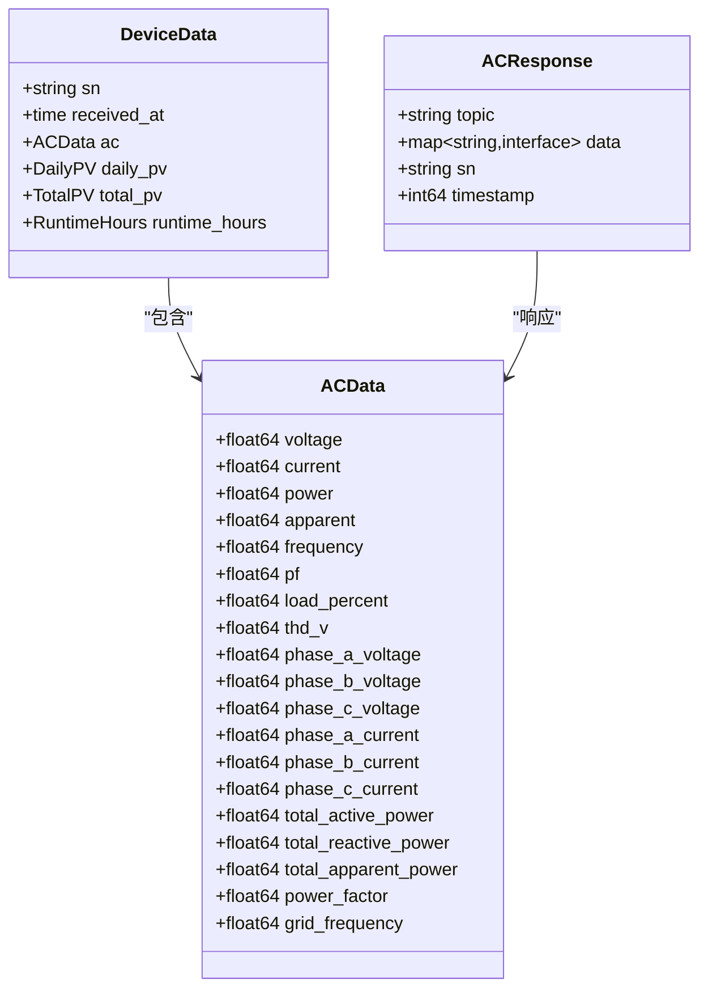
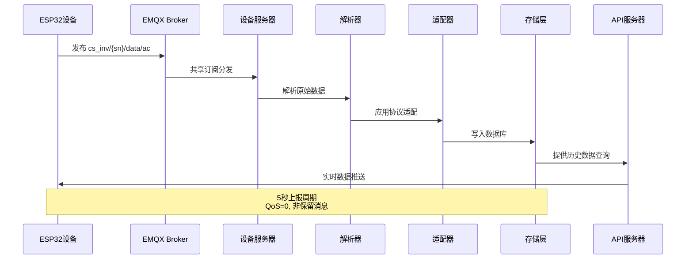
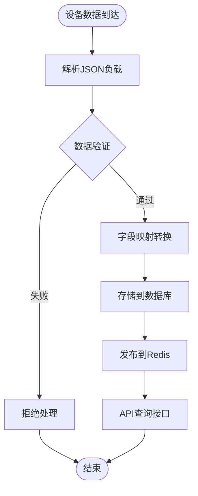
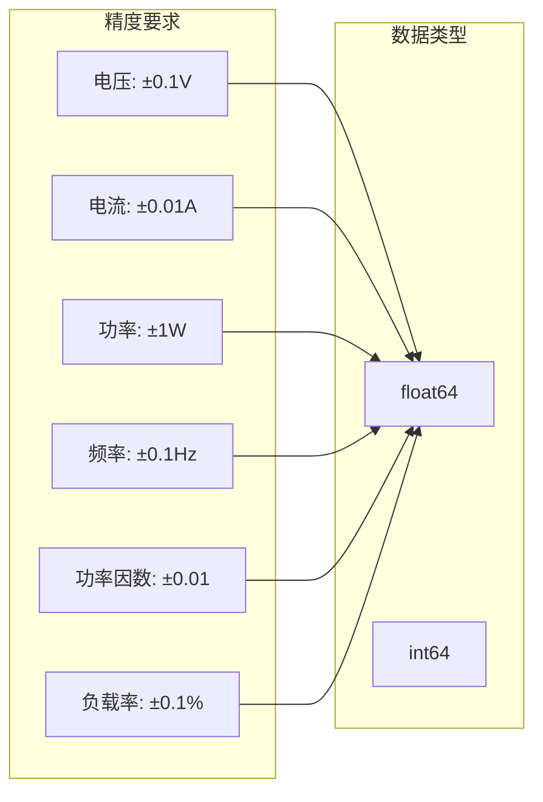
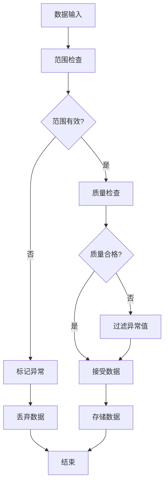
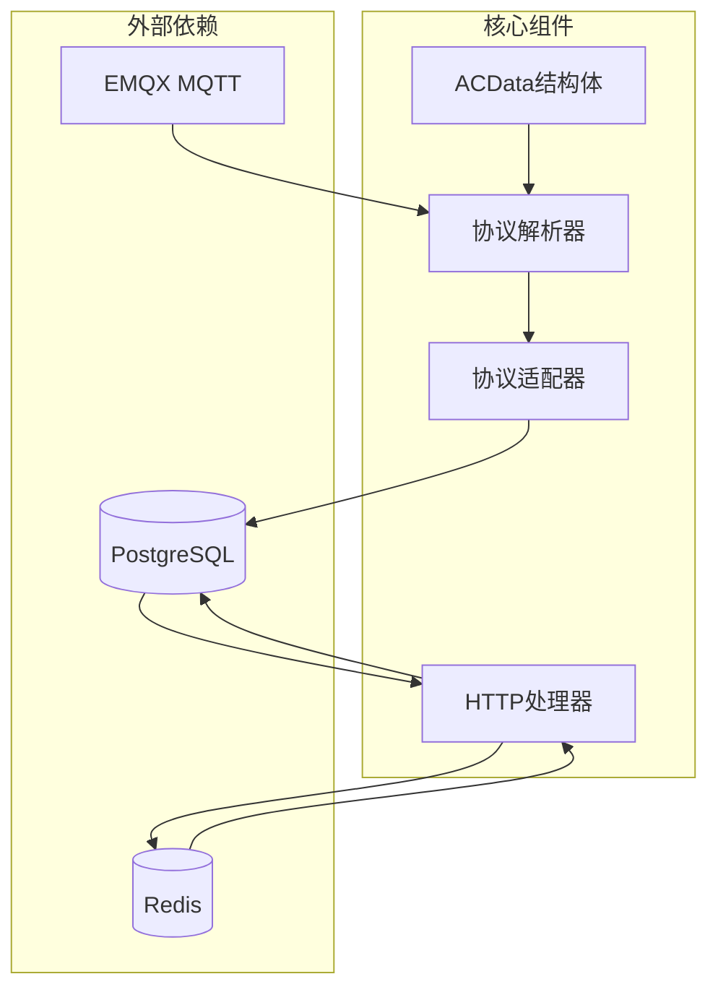
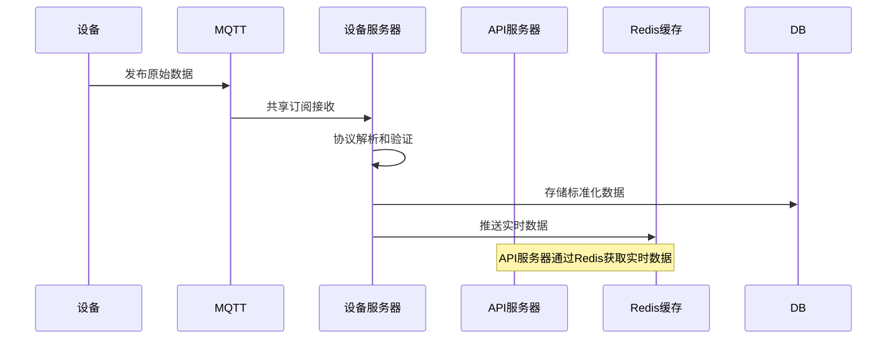

# data/ac交流输出主题

<cite>
**本文档引用的文件**
- [device.go](file://inv_device_server/internal/model/device.go)
- [protocol_parser.go](file://inv_device_server/internal/service/protocol_parser.go)
- [protocol_adapter.go](file://inv_device_server/internal/service/protocol_adapter.go)
- [models.go](file://inv_api_server/internal/model/models.go)
- [station_handler.go](file://inv_api_server/internal/handler/station_handler.go)
- [repositories.go](file://inv_api_server/internal/repository/repositories.go)
- [README.md](file://README.md)
</cite>

## 目录
1. [简介](#简介)
2. [项目结构](#项目结构)
3. [核心组件](#核心组件)
4. [架构概览](#架构概览)
5. [详细组件分析](#详细组件分析)
6. [依赖关系分析](#依赖关系分析)
7. [性能考虑](#性能考虑)
8. [故障排除指南](#故障排除指南)
9. [结论](#结论)

## 简介

本文档详细介绍了data/ac交流输出主题的技术规范和实现细节。该主题用于监控逆变器的交流输出电气参数，包括电压、电流、功率等关键指标。系统采用MQTT协议进行实时数据传输，支持5秒上报频率、QoS级别0、非保留消息的配置。

## 项目结构

系统采用分布式架构，主要由以下组件构成：

**图表来源**
- [README.md:206-250](file://README.md#L206-L250)

**章节来源**
- [README.md:206-250](file://README.md#L206-L250)

## 核心组件

### 交流输出数据模型

系统定义了完整的交流输出数据结构，支持多种数据格式和兼容性处理：

**图表来源**
- [device.go:30-93](file://inv_device_server/internal/model/device.go#L30-L93)
- [models.go:87-124](file://inv_api_server/internal/model/models.go#L87-L124)

### 数据上报机制

系统实现了标准化的数据上报流程，支持灵活的配置选项：

| 配置项 | 默认值 | 描述 | 用途 |
|--------|--------|------|------|
| 上报频率 | 5秒 | 设备数据上报间隔 | 实时监控需求 |
| QoS级别 | 0 | MQTT服务质量等级 | 确保数据传输可靠性 |
| 消息类型 | 非保留 | MQTT消息持久化设置 | 减少存储压力 |
| 共享订阅 | $share/inv-group/ | EMQX共享订阅前缀 | 负载均衡和高可用 |

**章节来源**
- [README.md:206-250](file://README.md#L206-L250)

## 架构概览

### 数据流架构

**图表来源**
- [README.md:206-250](file://README.md#L206-L250)

### 数据处理流水线

**图表来源**
- [protocol_parser.go:481-529](file://inv_device_server/internal/service/protocol_parser.go#L481-L529)

## 详细组件分析

### 交流输出参数定义

#### 电压相关参数

| 参数名称 | 字段名 | 单位 | 类型 | 正常范围 | 物理意义 |
|----------|--------|------|------|----------|----------|
| 电压 | voltage | V | float64 | 0-500V | 相电压有效值 |
| 相电压A | phase_a_voltage | V | float64 | 0-500V | A相电压 |
| 相电压B | phase_b_voltage | V | float64 | 0-500V | B相电压 |
| 相电压C | phase_c_voltage | V | float64 | 0-500V | C相电压 |
| 总谐波失真 | thd_v | % | float64 | 0-100% | 电压总谐波失真率 |

#### 电流相关参数

| 参数名称 | 字段名 | 单位 | 类型 | 正常范围 | 物理意义 |
|----------|--------|------|------|----------|----------|
| 电流 | current | A | float64 | 0-100A | 输出电流有效值 |
| 相电流A | phase_a_current | A | float64 | 0-100A | A相电流 |
| 相电流B | phase_b_current | A | float64 | 0-100A | B相电流 |
| 相电流C | phase_c_current | A | float64 | 0-100A | C相电流 |

#### 功率相关参数

| 参数名称 | 字段名 | 单位 | 类型 | 正常范围 | 物理意义 |
|----------|--------|------|------|----------|----------|
| 有功功率 | power | W | float64 | 0-5000W | 实际消耗功率 |
| 视在功率 | apparent | VA | float64 | 0-5000VA | 表观功率 |
| 总有功功率 | total_active_power | W | float64 | 0-15000W | 三相总有功功率 |
| 总无功功率 | total_reactive_power | var | float64 | -5000W到+5000W | 三相总无功功率 |
| 总视在功率 | total_apparent_power | VA | float64 | 0-15000VA | 三相总视在功率 |

#### 频率和功率因数

| 参数名称 | 字段名 | 单位 | 类型 | 正常范围 | 物理意义 |
|----------|--------|------|------|----------|----------|
| 频率 | frequency | Hz | float64 | 45-55Hz | 电网频率 |
| 功率因数 | pf | 无量纲 | float64 | 0-1.0 | 有功功率与视在功率比值 |
| 功率因数设置 | power_factor_setting | 无量纲 | float64 | 0-1.0 | 设定的功率因数值 |
| 负载率 | load_percent | % | float64 | 0-100% | 当前负载占额定容量百分比 |

### 数据精度要求

系统对不同参数设置了相应的精度标准：

**图表来源**
- [models.go:87-124](file://inv_api_server/internal/model/models.go#L87-L124)

### 异常值处理机制

系统实现了多层次的异常值检测和处理：

**图表来源**
- [protocol_parser.go:481-529](file://inv_device_server/internal/service/protocol_parser.go#L481-L529)

### 数据有效性检查规则

系统实施了严格的参数有效性验证：

| 参数类别 | 检查规则 | 异常处理 |
|----------|----------|----------|
| 电压参数 | 0V ≤ V ≤ 500V | 超出范围标记异常 |
| 电流参数 | 0A ≤ I ≤ 100A | 超限报警并记录 |
| 功率参数 | P ≥ 0W | 负值视为异常 |
| 频率参数 | 45Hz ≤ f ≤ 55Hz | 超出范围触发保护 |
| 功率因数 | 0.0 ≤ PF ≤ 1.0 | 超出范围修正为边界值 |
| 负载率 | 0% ≤ Load ≤ 100% | 边界值修正 |

**章节来源**
- [repositories.go:2137-2145](file://inv_api_server/internal/repository/repositories.go#L2137-L2145)

## 依赖关系分析

### 组件耦合度分析

**图表来源**
- [protocol_adapter.go:15-145](file://inv_device_server/internal/service/protocol_adapter.go#L15-L145)

### 数据流转依赖

系统的关键依赖关系体现在数据的多路径处理：

**图表来源**
- [README.md:206-250](file://README.md#L206-L250)

**章节来源**
- [protocol_adapter.go:15-145](file://inv_device_server/internal/service/protocol_adapter.go#L15-L145)

## 性能考虑

### 实时性优化

系统通过以下机制确保数据的实时性：

1. **5秒上报周期**：平衡数据实时性和网络负载
2. **QoS级别0**：减少消息确认开销，提高传输效率
3. **共享订阅**：实现负载均衡和高可用
4. **Redis缓存**：提供快速的数据访问

### 存储优化策略

- **时序数据库**：使用PostgreSQL进行高效的时间序列数据存储
- **索引优化**：针对常用查询条件建立索引
- **数据压缩**：对历史数据进行压缩存储

## 故障排除指南

### 常见问题诊断

| 问题现象 | 可能原因 | 解决方案 |
|----------|----------|----------|
| 数据延迟 | 网络拥塞或设备离线 | 检查MQTT连接状态 |
| 参数异常 | 传感器故障或接线错误 | 核实硬件连接 |
| 频繁掉线 | 电源不稳定或信号弱 | 检查供电和信号强度 |
| 数据缺失 | 设备未正确上报 | 验证设备配置 |

### 日志分析要点

系统提供了详细的日志记录机制，便于问题排查：

- **设备连接日志**：记录设备上线/下线事件
- **数据解析日志**：跟踪数据处理过程
- **异常告警日志**：记录数据异常和错误信息

**章节来源**
- [station_handler.go:340-371](file://inv_api_server/internal/handler/station_handler.go#L340-L371)

## 结论

data/ac交流输出主题为逆变器监控系统提供了完整的电气参数监测能力。通过标准化的数据格式、严格的质量控制和高效的处理机制，系统能够满足工业级的监控需求。建议在实际部署中重点关注数据准确性验证和异常处理机制，确保系统的稳定运行。