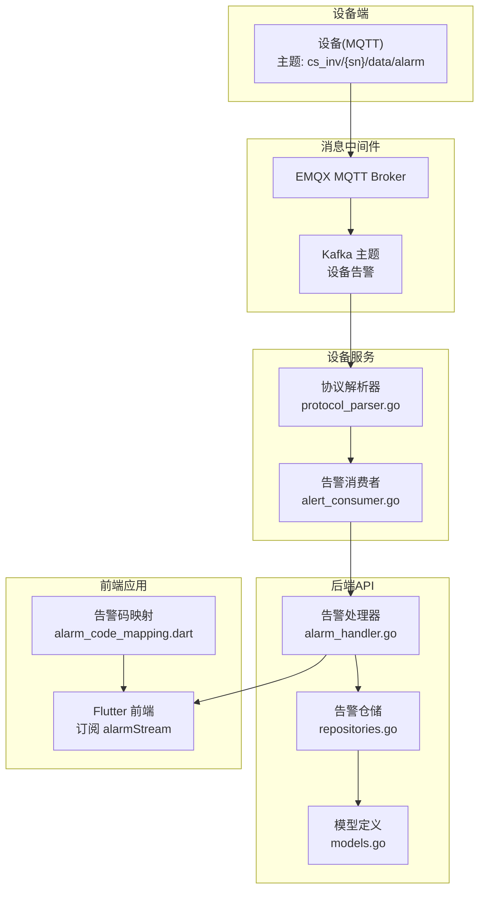
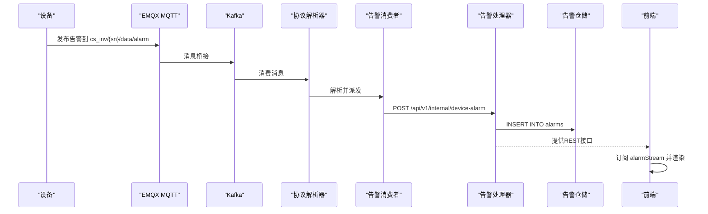
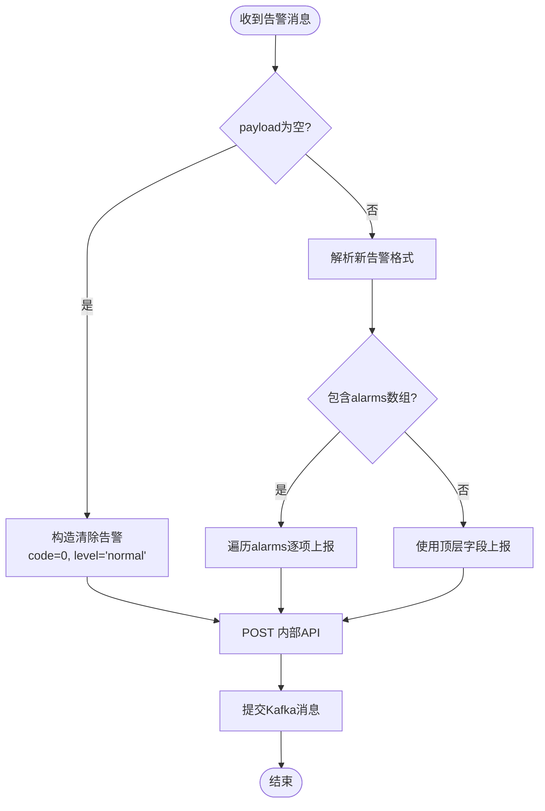
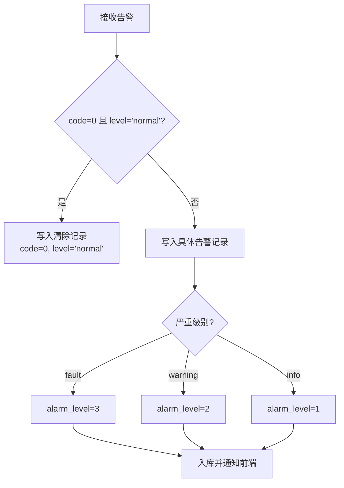
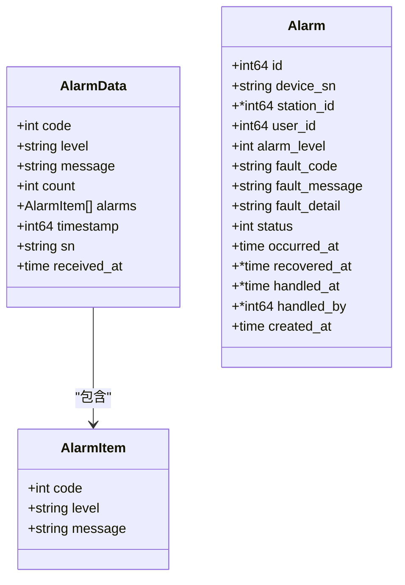

# data/alarm告警事件主题

<cite>
**本文档引用的文件**
- [device.go](file://inv_device_server/internal/model/device.go)
- [alert_consumer.go](file://inv_device_server/internal/service/alert_consumer.go)
- [protocol_parser.go](file://inv_device_server/internal/service/protocol_parser.go)
- [alarm_handler.go](file://inv_api_server/internal/handler/alarm_handler.go)
- [repositories.go](file://inv_api_server/internal/repository/repositories.go)
- [models.go](file://inv_api_server/internal/model/models.go)
- [alarm_codes.json](file://inv_app/assets/data/alarm_codes.json)
- [alarm_code_mapping.dart](file://inv_app/lib/core/data/alarm_code_mapping.dart)
- [debug-alarm-not-displayed.md](file://debug-alarm-not-displayed.md)
- [fix-alarm-level-query.md](file://fix-alarm-level-query.md)
</cite>

## 目录
1. [简介](#简介)
2. [项目结构](#项目结构)
3. [核心组件](#核心组件)
4. [架构概览](#架构概览)
5. [详细组件分析](#详细组件分析)
6. [依赖关系分析](#依赖关系分析)
7. [性能考量](#性能考量)
8. [故障排查指南](#故障排查指南)
9. [结论](#结论)
10. [附录](#附录)

## 简介
本文件针对data/alarm告警事件主题进行全面技术说明，覆盖事件上报机制、QoS级别与消息保留策略、告警payload结构定义、告警码分类与恢复条件、分级处理流程、去重机制、历史记录管理、状态机与故障诊断最佳实践，并提供完整JSON示例与告警码对照表。

## 项目结构
围绕告警事件主题，系统由以下关键模块构成：
- 设备端通过MQTT发布告警至EMQX
- Kafka桥接接收并转发至设备服务
- 设备服务解析告警并调用内部API写入后端数据库
- API服务提供REST接口供前端查询与管理
- 前端Flutter应用订阅MQTT流并展示告警

**图表来源**
- [device.go:107-126](file://inv_device_server/internal/model/device.go#L107-L126)
- [alert_consumer.go:118-268](file://inv_device_server/internal/service/alert_consumer.go#L118-L268)
- [protocol_parser.go:1-200](file://inv_device_server/internal/service/protocol_parser.go#L1-L200)
- [alarm_handler.go:1-256](file://inv_api_server/internal/handler/alarm_handler.go#L1-L256)
- [repositories.go:2496-2726](file://inv_api_server/internal/repository/repositories.go#L2496-L2726)
- [models.go:130-145](file://inv_api_server/internal/model/models.go#L130-L145)
- [alarm_code_mapping.dart:53-185](file://inv_app/lib/core/data/alarm_code_mapping.dart#L53-L185)

**章节来源**
- [device.go:107-126](file://inv_device_server/internal/model/device.go#L107-L126)
- [alert_consumer.go:118-268](file://inv_device_server/internal/service/alert_consumer.go#L118-L268)
- [protocol_parser.go:1-200](file://inv_device_server/internal/service/protocol_parser.go#L1-L200)
- [alarm_handler.go:1-256](file://inv_api_server/internal/handler/alarm_handler.go#L1-L256)
- [repositories.go:2496-2726](file://inv_api_server/internal/repository/repositories.go#L2496-L2726)
- [models.go:130-145](file://inv_api_server/internal/model/models.go#L130-L145)
- [alarm_code_mapping.dart:53-185](file://inv_app/lib/core/data/alarm_code_mapping.dart#L53-L185)

## 核心组件
- 告警数据模型：定义单个告警条目与批量告警容器，包含code、level、message、count、alarms数组、timestamp等字段。
- 告警消费者：从Kafka消费告警消息，解析payload，识别告警清除信号，构造AlarmData并POST至内部API。
- 协议解析器：负责消息消费、解析与设备模型缓存，支撑告警处理链路。
- 告警处理器：提供REST接口，支持分页查询、标记已处理/已读、统计等。
- 告警仓储：实现告警列表查询、按ID查询、标记处理/已读等数据库操作。
- 前端告警码映射：提供告警码本地化名称、描述、建议与严重级别映射。

**章节来源**
- [device.go:107-126](file://inv_device_server/internal/model/device.go#L107-L126)
- [alert_consumer.go:118-268](file://inv_device_server/internal/service/alert_consumer.go#L118-L268)
- [protocol_parser.go:1-200](file://inv_device_server/internal/service/protocol_parser.go#L1-L200)
- [alarm_handler.go:22-72](file://inv_api_server/internal/handler/alarm_handler.go#L22-L72)
- [repositories.go:2504-2668](file://inv_api_server/internal/repository/repositories.go#L2504-L2668)
- [models.go:130-145](file://inv_api_server/internal/model/models.go#L130-L145)
- [alarm_code_mapping.dart:53-185](file://inv_app/lib/core/data/alarm_code_mapping.dart#L53-L185)

## 架构概览
告警事件从设备端产生，经MQTT/EMQX/Kafka进入设备服务，解析后写入后端数据库并通过API暴露给前端。前端订阅MQTT流并渲染告警列表。

**图表来源**
- [alert_consumer.go:118-268](file://inv_device_server/internal/service/alert_consumer.go#L118-L268)
- [alarm_handler.go:1-256](file://inv_api_server/internal/handler/alarm_handler.go#L1-L256)
- [repositories.go:2504-2668](file://inv_api_server/internal/repository/repositories.go#L2504-L2668)

## 详细组件分析

### 告警事件上报机制与QoS
- 设备端通过MQTT发布告警至主题cs_inv/{sn}/data/alarm，采用QoS级别1，确保消息至少送达一次。
- Kafka桥接将MQTT消息转换为Kafka消息，设备服务的协议解析器与告警消费者分别消费并处理。
- 告警清除场景：payload为空或code=0且level="normal"时，视为告警清除，写入code=0、level="normal"的记录。

**图表来源**
- [alert_consumer.go:165-268](file://inv_device_server/internal/service/alert_consumer.go#L165-L268)

**章节来源**
- [alert_consumer.go:165-268](file://inv_device_server/internal/service/alert_consumer.go#L165-L268)

### 告警payload结构定义
- 单个告警条目字段：
  - code：告警/故障码（整数）
  - level：告警级别（字符串，如info、warning、fault、normal）
  - message：告警/故障描述（字符串）
- 批量告警容器字段：
  - code：顶层告警码（整数）
  - level：顶层告警级别（字符串）
  - message：顶层告警描述（字符串）
  - count：告警计数（整数）
  - alarms：告警条目数组（数组）
  - timestamp：事件发生时间（Unix时间戳，秒）
  - sn：设备序列号（字符串）
  - received_at：接收时间（服务器侧时间戳，不对外暴露）

**章节来源**
- [device.go:107-126](file://inv_device_server/internal/model/device.go#L107-L126)
- [alert_consumer.go:36-44](file://inv_device_server/internal/service/alert_consumer.go#L36-L44)

### 告警码定义与分类
告警码分为三类，对应不同严重级别与恢复条件：
- 故障类（1-12）：严重（fault），需立即处理；恢复条件为设备恢复正常且上报code=0。
- 警告类（100-999）：警告（warning），需关注；恢复条件为设备恢复正常且上报code=0。
- 信息类（1000+）：信息（info），提示性信息；恢复条件为设备恢复正常且上报code=0。

告警码对照表（节选）：
- 1：电网过压（故障类）
- 2：电网欠压（故障类）
- 4：电网过频（故障类）
- 8：电网欠频（故障类）
- 16：PV过压（故障类）
- 32：PV欠压（警告类）
- 64：电池过压（故障类）
- 128：电池欠压（警告类）
- 256：电池过温（故障类）
- 512：电池低温（警告类）
- 1024：逆变器过温（故障类）
- 2048：逆变器过载（故障类）
- 4096：短路保护（故障类）
- 8192：漏流保护（故障类）
- 16384：接地故障（故障类）
- 32768：通信故障（警告类）
- 65537：电池SOC过低（警告类）
- 65538：电池充放过流（故障类）
- 65540：电芯压差过大（警告类）
- 65544：BMS通信断开（故障类）
- 65552：电池绝缘故障（故障类）
- 131073：DC母线过压（故障类）
- 131074：DC母线欠压（警告类）
- 131076：散热器过温（警告类）
- 131080：风扇故障（警告类）
- 131088：EEPROM错误（警告类）
- 131104：SPI通信错误（警告类）
- 131136：ADC采样异常（故障类）
- 131200：继电器故障（故障类）
- 131328：固件校验失败（故障类）

**章节来源**
- [alarm_codes.json:1-303](file://inv_app/assets/data/alarm_codes.json#L1-L303)
- [alarm_code_mapping.dart:53-185](file://inv_app/lib/core/data/alarm_code_mapping.dart#L53-L185)

### 告警分级处理流程
- 级别映射：前端与后端均基于告警码severity字段映射为fault/warning/info级别。
- 状态管理：告警状态包括未处理（0）、已确认（1）、已恢复（2）。后端查询与设备状态判断依赖alarm_level字段。
- 处理接口：提供标记已处理、标记已读、查询统计等REST接口。

**图表来源**
- [alert_consumer.go:165-268](file://inv_device_server/internal/service/alert_consumer.go#L165-L268)
- [alarm_handler.go:22-72](file://inv_api_server/internal/handler/alarm_handler.go#L22-L72)
- [repositories.go:2504-2668](file://inv_api_server/internal/repository/repositories.go#L2504-L2668)

**章节来源**
- [fix-alarm-level-query.md:1-50](file://fix-alarm-level-query.md#L1-L50)
- [alarm_handler.go:22-72](file://inv_api_server/internal/handler/alarm_handler.go#L22-L72)
- [repositories.go:2504-2668](file://inv_api_server/internal/repository/repositories.go#L2504-L2668)

### 告警去重机制
- 设备端在故障上报时使用Redis键值对进行防抖：key为"fault_report:{sn}"，值为"2"，TTL为15秒。同一设备在10秒内重复上报相同故障状态将被抑制，确保告警上报的稳定性与可读性。
- 恢复时清除该键，保证下次故障能及时上报。

**章节来源**
- [protocol_parser.go:577-605](file://inv_device_server/internal/service/protocol_parser.go#L577-L605)

### 告警历史记录管理
- 存储模型：alarms表包含设备SN、用户ID、站点ID、告警级别、故障码、故障描述、状态、发生时间、恢复时间、处理时间、处理人等字段。
- 查询接口：支持按用户、站点、状态、级别、关键词、分页等条件查询，返回分页结果。
- 管理接口：支持标记已处理、标记已读、按ID查询、删除、清空等操作。

**章节来源**
- [models.go:130-145](file://inv_api_server/internal/model/models.go#L130-L145)
- [repositories.go:2504-2668](file://inv_api_server/internal/repository/repositories.go#L2504-L2668)
- [alarm_handler.go:22-154](file://inv_api_server/internal/handler/alarm_handler.go#L22-L154)

### 告警状态机与故障诊断最佳实践
- 状态机：未处理(0) → 已确认(1) → 已恢复(2)。设备离线/在线状态与告警状态相互独立，但设备状态恢复逻辑需检查是否存在未处理的严重告警（alarm_level=3）。
- 最佳实践：
  - 前端应区分严重告警（红色）与一般告警（橙色/蓝色），并提供快速处理入口。
  - 后端查询与设备状态判断必须使用正确的alarm_level值（1=info, 2=warning, 3=fault）。
  - 告警清除必须明确标识code=0且level="normal"，避免误判。
  - 对于高频告警，建议结合去重与告警抑制策略，避免信息过载。

**章节来源**
- [fix-alarm-level-query.md:1-50](file://fix-alarm-level-query.md#L1-L50)
- [debug-alarm-not-displayed.md:1-46](file://debug-alarm-not-displayed.md#L1-L46)

## 依赖关系分析

**图表来源**
- [device.go:107-126](file://inv_device_server/internal/model/device.go#L107-L126)
- [models.go:130-145](file://inv_api_server/internal/model/models.go#L130-L145)

**章节来源**
- [device.go:107-126](file://inv_device_server/internal/model/device.go#L107-L126)
- [models.go:130-145](file://inv_api_server/internal/model/models.go#L130-L145)

## 性能考量
- Kafka消费者并发：设备服务的告警消费者与协议解析器均采用多worker并发处理，提升吞吐能力。
- Redis防抖：通过TTL与键值对实现轻量级去重，降低重复告警对后端的压力。
- 分页查询：后端提供分页查询接口，避免一次性加载大量历史告警。
- QoS级别1：确保告警消息至少送达一次，兼顾可靠性与性能。

[本节为通用指导，无需特定文件引用]

## 故障排查指南
常见问题与修复要点：
- 告警未显示：检查设备端SN字段序列化是否正确（曾出现SN被忽略导致内部API收到空SN），确认已修复为json:"sn"。
- 告警级别错误：检查后端查询逻辑中alarm_level是否使用正确值（1=info, 2=warning, 3=fault）。
- 告警清除无效：确认payload为空或code=0且level="normal"时的清除逻辑是否生效。
- 前端未订阅：确认Flutter端已订阅alarmStream并注入MQTTService依赖。

**章节来源**
- [debug-alarm-not-displayed.md:1-46](file://debug-alarm-not-displayed.md#L1-L46)
- [fix-alarm-level-query.md:1-50](file://fix-alarm-level-query.md#L1-L50)

## 结论
data/alarm告警事件主题通过MQTT/QoS1、Kafka与设备服务的协同，实现了可靠的告警上报与处理闭环。清晰的payload结构、严格的级别映射与状态机、以及去重与历史管理机制，共同保障了告警系统的可用性与可维护性。建议在生产环境中持续优化告警抑制策略与前端交互体验，确保告警信息的准确性与时效性。

[本节为总结性内容，无需特定文件引用]

## 附录

### JSON示例
- 单条告警
  - code: 1
  - level: "fault"
  - message: "电网过压"
  - timestamp: 1700000000
  - sn: "H1CNA00135000014"
- 批量告警
  - code: 1
  - level: "fault"
  - message: "电网过压"
  - count: 3
  - alarms:
    - { code: 1, level: "fault", message: "电网过压" }
    - { code: 2, level: "fault", message: "电网欠压" }
  - timestamp: 1700000000
  - sn: "H1CNA00135000014"

**章节来源**
- [device.go:107-126](file://inv_device_server/internal/model/device.go#L107-L126)
- [alert_consumer.go:165-268](file://inv_device_server/internal/service/alert_consumer.go#L165-L268)

### 告警码对照表（节选）
- 故障类（1-12）：1、2、4、8、16、64、128、256、512、1024、2048、4096、8192、16384、65538、65544、65552、131073、131074、131076、131080、131088、131104、131136、131200、131328
- 警告类（100-999）：32、128、512、32768、65537、65540、131076、131080、131088、131104、131136
- 信息类（1000+）：10、11、12

**章节来源**
- [alarm_codes.json:1-303](file://inv_app/assets/data/alarm_codes.json#L1-L303)
- [alarm_code_mapping.dart:53-185](file://inv_app/lib/core/data/alarm_code_mapping.dart#L53-L185)