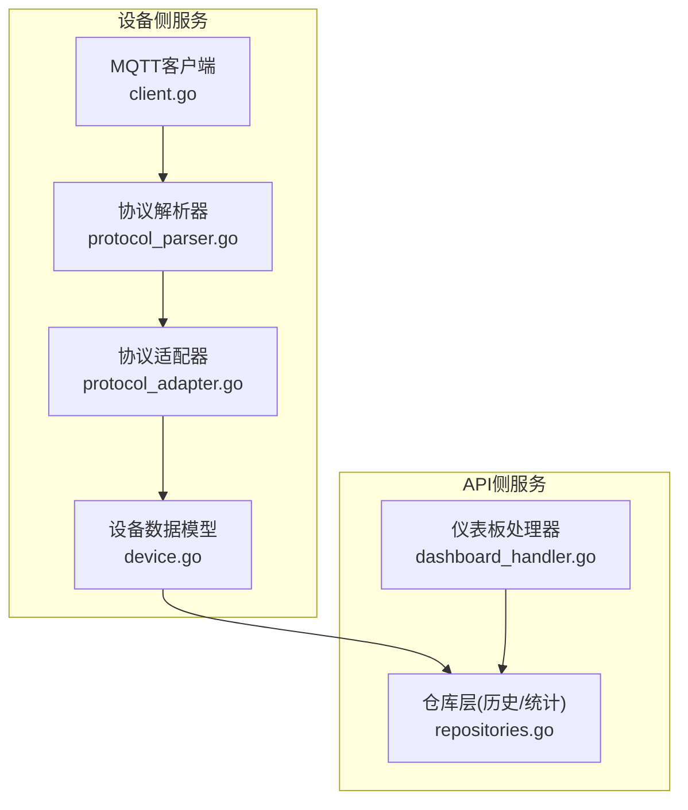
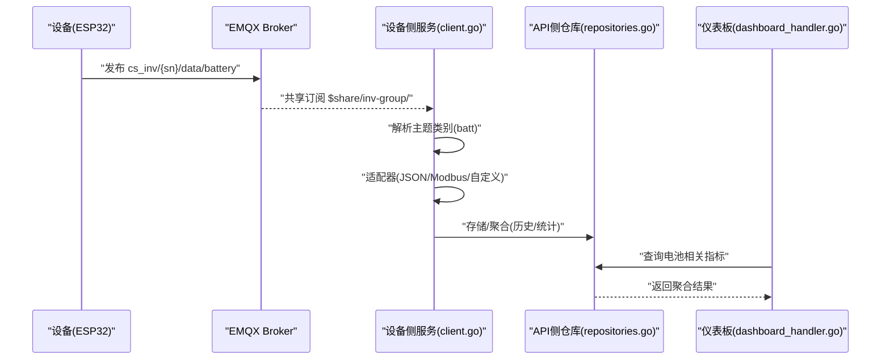
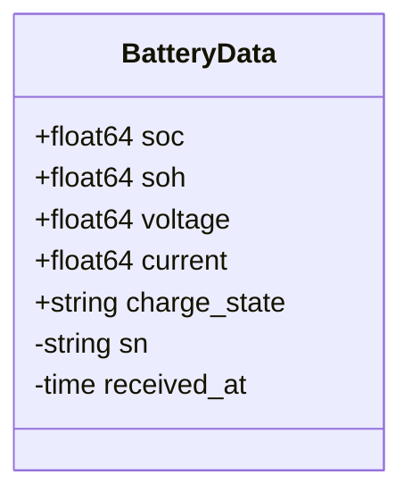
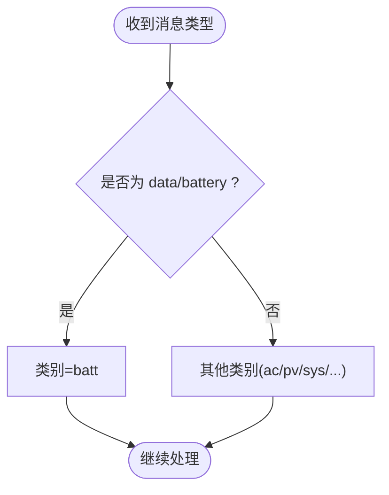
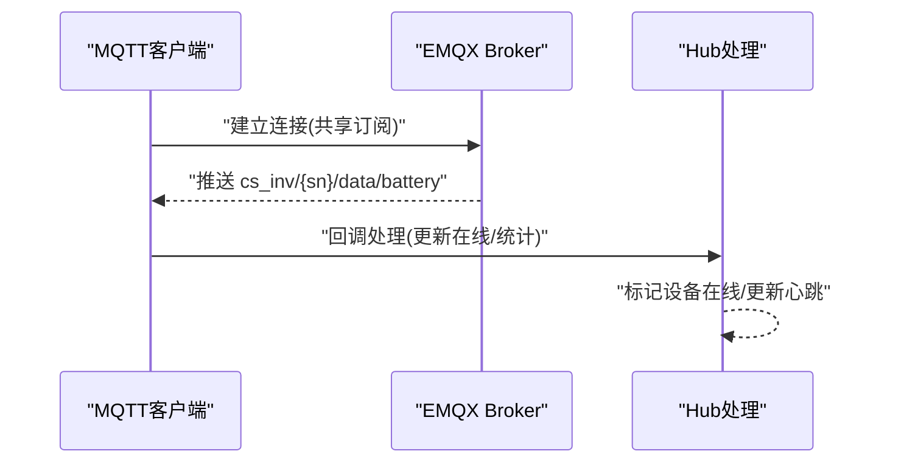
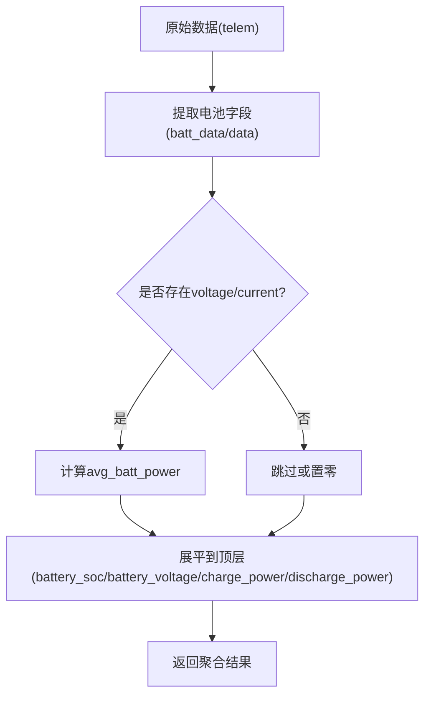
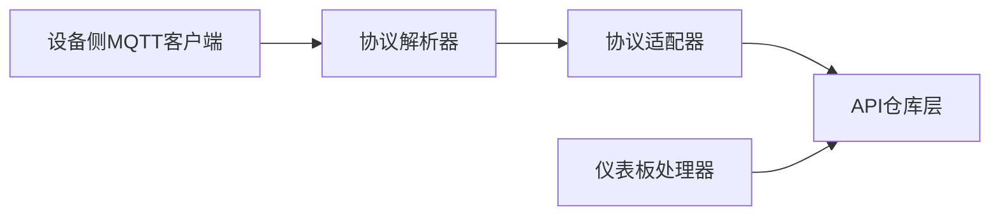

# data/battery电池数据主题

<cite>
**本文档引用的文件**
- [device.go](file://inv_device_server/internal/model/device.go)
- [protocol_parser.go](file://inv_device_server/internal/service/protocol_parser.go)
- [protocol_adapter.go](file://inv_device_server/internal/service/protocol_adapter.go)
- [client.go](file://inv_device_server/internal/mqtt/client.go)
- [repositories.go](file://inv_api_server/internal/repository/repositories.go)
- [dashboard_handler.go](file://inv_api_server/internal/handler/dashboard_handler.go)
- [README.md](file://README.md)
</cite>

## 目录
1. [简介](#简介)
2. [项目结构](#项目结构)
3. [核心组件](#核心组件)
4. [架构总览](#架构总览)
5. [详细组件分析](#详细组件分析)
6. [依赖关系分析](#依赖关系分析)
7. [性能考虑](#性能考虑)
8. [故障排查指南](#故障排查指南)
9. [结论](#结论)
10. [附录](#附录)

## 简介
本文件针对 data/battery 电池数据主题进行深入技术说明，覆盖以下内容：
- 电池BMS数据上报机制：5秒上报周期、QoS级别0、非保留消息的配置要点
- 电池数据payload结构定义：包含SOC、SOH、电压、电流、功率、容量、循环次数、温度、电芯电压、充电状态、保护状态、故障码、允许电流、目标电压、截止电压、电池平均温度等关键参数
- 参数业务含义、安全阈值与故障诊断逻辑
- 电池状态评估算法与预警机制
- 完整JSON示例与参数范围验证规则
- 系统架构与数据流路径

## 项目结构
围绕 data/battery 的相关代码分布在设备侧服务与API侧服务中：
- 设备侧服务负责接收设备上报、解析与转发
- API侧服务负责历史/统计查询与前端展示



**图表来源**
- [client.go:1-330](file://inv_device_server/internal/mqtt/client.go#L1-L330)
- [protocol_parser.go:835-865](file://inv_device_server/internal/service/protocol_parser.go#L835-L865)
- [protocol_adapter.go:1-190](file://inv_device_server/internal/service/protocol_adapter.go#L1-L190)
- [device.go:43-53](file://inv_device_server/internal/model/device.go#L43-L53)
- [repositories.go:689-744](file://inv_api_server/internal/repository/repositories.go#L689-L744)
- [dashboard_handler.go:828-842](file://inv_api_server/internal/handler/dashboard_handler.go#L828-L842)

**章节来源**
- [README.md:31-31](file://README.md#L31-L31)
- [client.go:146-236](file://inv_device_server/internal/mqtt/client.go#L146-L236)
- [protocol_parser.go:835-865](file://inv_device_server/internal/service/protocol_parser.go#L835-L865)
- [protocol_adapter.go:110-145](file://inv_device_server/internal/service/protocol_adapter.go#L110-L145)
- [device.go:43-53](file://inv_device_server/internal/model/device.go#L43-L53)
- [repositories.go:689-744](file://inv_api_server/internal/repository/repositories.go#L689-L744)
- [dashboard_handler.go:828-842](file://inv_api_server/internal/handler/dashboard_handler.go#L828-L842)

## 核心组件
- 电池数据模型：定义了电池BMS上报的核心字段集合，用于序列化/反序列化与后续处理
- 协议解析器：根据消息类型识别电池主题类别，支撑后续字段映射与兼容
- 协议适配器：提供JSON/Modbus/自定义解析策略，确保不同来源的数据能统一为标准键值
- MQTT客户端：负责连接Broker、订阅共享主题、处理设备在线状态与数据到达事件
- 仓库层与仪表板处理器：提供历史/统计查询能力，并对电池相关字段进行展平与聚合

**章节来源**
- [device.go:43-53](file://inv_device_server/internal/model/device.go#L43-L53)
- [protocol_parser.go:835-865](file://inv_device_server/internal/service/protocol_parser.go#L835-L865)
- [protocol_adapter.go:110-145](file://inv_device_server/internal/service/protocol_adapter.go#L110-L145)
- [client.go:146-236](file://inv_device_server/internal/mqtt/client.go#L146-L236)
- [repositories.go:689-744](file://inv_api_server/internal/repository/repositories.go#L689-L744)
- [dashboard_handler.go:828-842](file://inv_api_server/internal/handler/dashboard_handler.go#L828-L842)

## 架构总览
data/battery 的数据流从设备侧上报到EMQX，再由设备侧服务消费并转发至API侧服务，最终供前端与统计查询使用。



**图表来源**
- [client.go:186-224](file://inv_device_server/internal/mqtt/client.go#L186-L224)
- [protocol_parser.go:835-865](file://inv_device_server/internal/service/protocol_parser.go#L835-L865)
- [protocol_adapter.go:110-145](file://inv_device_server/internal/service/protocol_adapter.go#L110-L145)
- [repositories.go:689-744](file://inv_api_server/internal/repository/repositories.go#L689-L744)
- [dashboard_handler.go:828-842](file://inv_api_server/internal/handler/dashboard_handler.go#L828-L842)

## 详细组件分析

### 电池数据模型与字段定义
电池BMS数据模型定义了上报所需的关键字段，用于序列化与后续处理。



**图表来源**
- [device.go:43-53](file://inv_device_server/internal/model/device.go#L43-L53)

字段业务含义与典型范围（建议值域，具体以设备实际为准）：
- soc：电池电量百分比(%)，范围0-100
- soh：电池健康度(%)，范围0-100
- voltage：电池电压(V)，单位伏特
- current：电池电流(A)，正值为充电，负值为放电
- charge_state：充电状态，枚举字符串（如"charging"/"discharging"/"resting"）
- 其他字段：capacity_remain、capacity_total、cycle_count、temp_max、temp_min、cell_volt_max、cell_volt_min、cell_volt_diff、protect_status、bms_fault_code、max_chg_current、max_dischg_current、charge_volt_ref、dischg_cut_volt、temp_battery等

注意：当前模型仅包含上述字段定义，其他字段如capacity_remain、capacity_total、cycle_count、temp_max、temp_min、cell_volt_max、cell_volt_min、cell_volt_diff、protect_status、bms_fault_code、max_chg_current、max_dischg_current、charge_volt_ref、dischg_cut_volt、temp_battery等在该模型中未出现，建议在设备侧完善上报payload后再进行API侧映射与展示。

**章节来源**
- [device.go:43-53](file://inv_device_server/internal/model/device.go#L43-L53)

### 协议解析与主题分类
协议解析器根据消息类型识别电池主题类别，便于后续字段映射与兼容处理。



**图表来源**
- [protocol_parser.go:835-865](file://inv_device_server/internal/service/protocol_parser.go#L835-L865)

**章节来源**
- [protocol_parser.go:835-865](file://inv_device_server/internal/service/protocol_parser.go#L835-L865)

### 协议适配器与字段映射
协议适配器支持多种解析策略，确保不同来源的数据能统一为标准键值，便于后续处理。

```mermaid
classDiagram
class ProtocolAdapter {
<<interface>>
+ParseTopic(topic, payload) map[string]interface{}
}
class JSONAdapter {
+ParseTopic(topic, payload) map[string]interface{}
}
class ModbusAdapter {
-fields map[string]*DeviceModelField
+ParseTopic(topic, payload) map[string]interface{}
}
class CustomAdapter {
-parseConfig map[string]interface{}
+ParseTopic(topic, payload) map[string]interface{}
}
ProtocolAdapter <|.. JSONAdapter
ProtocolAdapter <|.. ModbusAdapter
ProtocolAdapter <|.. CustomAdapter
```

**图表来源**
- [protocol_adapter.go:15-145](file://inv_device_server/internal/service/protocol_adapter.go#L15-L145)

**章节来源**
- [protocol_adapter.go:15-145](file://inv_device_server/internal/service/protocol_adapter.go#L15-L145)

### MQTT客户端与数据接收
MQTT客户端负责连接Broker、订阅共享主题、处理设备在线状态与数据到达事件，确保数据可靠接收。



**图表来源**
- [client.go:146-236](file://inv_device_server/internal/mqtt/client.go#L146-L236)

**章节来源**
- [client.go:146-236](file://inv_device_server/internal/mqtt/client.go#L146-L236)

### API侧历史/统计与字段展平
API侧仓库层与仪表板处理器对电池相关字段进行聚合与展平，便于前端展示与查询。



**图表来源**
- [repositories.go:689-744](file://inv_api_server/internal/repository/repositories.go#L689-L744)
- [repositories.go:1375-1403](file://inv_api_server/internal/repository/repositories.go#L1375-L1403)

**章节来源**
- [repositories.go:689-744](file://inv_api_server/internal/repository/repositories.go#L689-L744)
- [repositories.go:1375-1403](file://inv_api_server/internal/repository/repositories.go#L1375-L1403)
- [dashboard_handler.go:828-842](file://inv_api_server/internal/handler/dashboard_handler.go#L828-L842)

## 依赖关系分析
- 设备侧服务依赖MQTT客户端与协议解析器，将设备上报统一为标准结构
- API侧服务依赖仓库层与仪表板处理器，提供历史/统计查询与前端展示
- 电池主题在API侧被专门识别与聚合，支持按天/分钟粒度的时间序列分析



**图表来源**
- [client.go:146-236](file://inv_device_server/internal/mqtt/client.go#L146-L236)
- [protocol_parser.go:835-865](file://inv_device_server/internal/service/protocol_parser.go#L835-L865)
- [protocol_adapter.go:110-145](file://inv_device_server/internal/service/protocol_adapter.go#L110-L145)
- [repositories.go:689-744](file://inv_api_server/internal/repository/repositories.go#L689-L744)
- [dashboard_handler.go:828-842](file://inv_api_server/internal/handler/dashboard_handler.go#L828-L842)

**章节来源**
- [client.go:146-236](file://inv_device_server/internal/mqtt/client.go#L146-L236)
- [protocol_parser.go:835-865](file://inv_device_server/internal/service/protocol_parser.go#L835-L865)
- [protocol_adapter.go:110-145](file://inv_device_server/internal/service/protocol_adapter.go#L110-L145)
- [repositories.go:689-744](file://inv_api_server/internal/repository/repositories.go#L689-L744)
- [dashboard_handler.go:828-842](file://inv_api_server/internal/handler/dashboard_handler.go#L828-L842)

## 性能考虑
- 上报频率：建议设备侧按5秒周期上报，避免过于频繁导致网络拥塞
- QoS级别：默认使用QoS 0，保证低延迟；若对可靠性有更高要求可调整为QoS 1
- 非保留消息：确保Broker不会持久化非保留消息，降低存储压力
- 字段选择：仅上报必要字段，减少payload体积，提升传输效率
- 聚合策略：API侧按分钟/天粒度聚合，避免高频查询造成数据库压力

## 故障排查指南
- 设备离线/在线状态异常
  - 检查MQTT连接状态与共享订阅配置
  - 确认设备状态主题(LWT)与数据主题是否正常发布
- 电池字段缺失或为空
  - 确认设备侧payload是否包含电池相关字段
  - 检查API侧字段映射逻辑是否正确
- 查询结果异常
  - 检查时间范围与聚合粒度设置
  - 确认数据库索引与查询条件

**章节来源**
- [client.go:186-224](file://inv_device_server/internal/mqtt/client.go#L186-L224)
- [repositories.go:689-744](file://inv_api_server/internal/repository/repositories.go#L689-L744)

## 结论
data/battery 电池数据主题在系统中承担着关键角色，设备侧负责稳定上报，API侧负责高效聚合与展示。通过明确的字段定义、合理的上报策略与完善的错误处理，能够有效支撑电池状态监控与预警需求。

## 附录

### 电池数据payload结构与参数范围验证规则
- 基础字段
  - soc：范围0-100，百分比
  - soh：范围0-100，百分比
  - voltage：正数，单位V
  - current：正负值，正值为充电，负值为放电
  - charge_state：枚举字符串，如"charging"/"discharging"/"resting"
- 建议补充字段（当前模型未包含）
  - capacity_remain：当前剩余容量，单位Ah
  - capacity_total：标称额定容量，单位Ah
  - cycle_count：累计充放电循环次数
  - temp_max：电芯最高温度，单位℃
  - temp_min：电芯最低温度，单位℃
  - cell_volt_max：单体最高电压，单位V
  - cell_volt_min：单体最低电压，单位V
  - cell_volt_diff：电芯压差，单位V
  - protect_status：保护状态位掩码
  - bms_fault_code：BMS故障码
  - max_chg_current：最大允许充电电流，单位A
  - max_dischg_current：最大允许放电电流，单位A
  - charge_volt_ref：充电目标电压，单位V
  - dischg_cut_volt：放电截止电压，单位V
  - temp_battery：电池平均温度，单位℃

参数范围验证建议：
- soc/soh：0-100
- voltage/current：依据设备规格设定合理上下限
- cycle_count：非负整数
- 温度类：依据设备工作温度范围设定上下限
- 电压类：依据电池系统额定电压设定上下限
- 电流类：依据设备最大充放电电流设定上下限

### 电池状态评估算法与预警机制
- 电池健康度评估
  - 基于SOH与cycle_count综合评估，设定阈值触发维护提醒
- 电量状态评估
  - 基于soc与运行工况评估，设定低电量预警阈值
- 温度与电压异常
  - 基于temp_max/temp_min与cell_volt_diff设定阈值，触发过温/过压/欠压/压差过大等告警
- 充放电功率监测
  - 基于current与voltage计算功率，结合max_chg_current/max_dischg_current判断是否过载
- 故障诊断
  - 结合protect_status与bms_fault_code进行故障定位与分级

### JSON示例（字段示意）
- 基础字段示例
  - soc、soh、voltage、current、charge_state
- 建议补充字段示例
  - capacity_remain、capacity_total、cycle_count、temp_max、temp_min、cell_volt_max、cell_volt_min、cell_volt_diff、protect_status、bms_fault_code、max_chg_current、max_dischg_current、charge_volt_ref、dischg_cut_volt、temp_battery

说明：请根据设备实际上报内容与业务需求，完善payload结构并在API侧完成字段映射与展示。