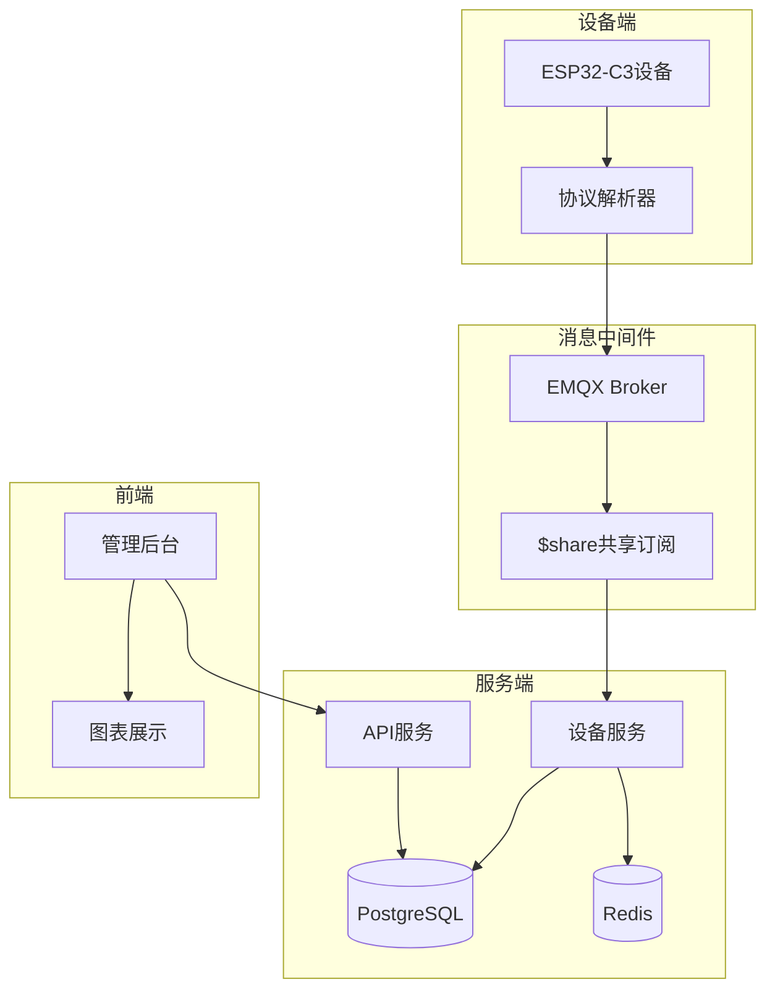
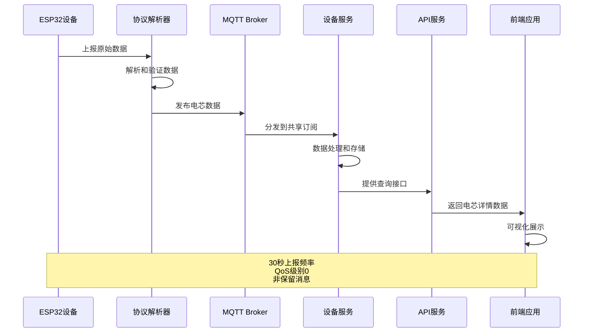
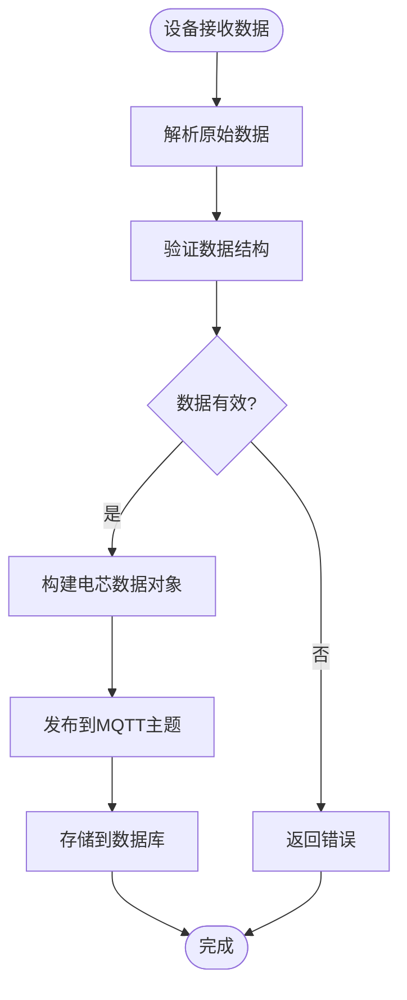
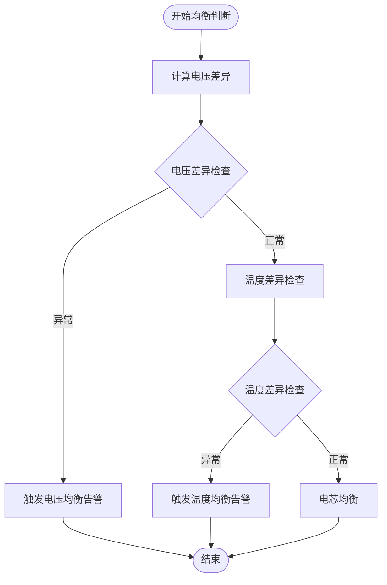
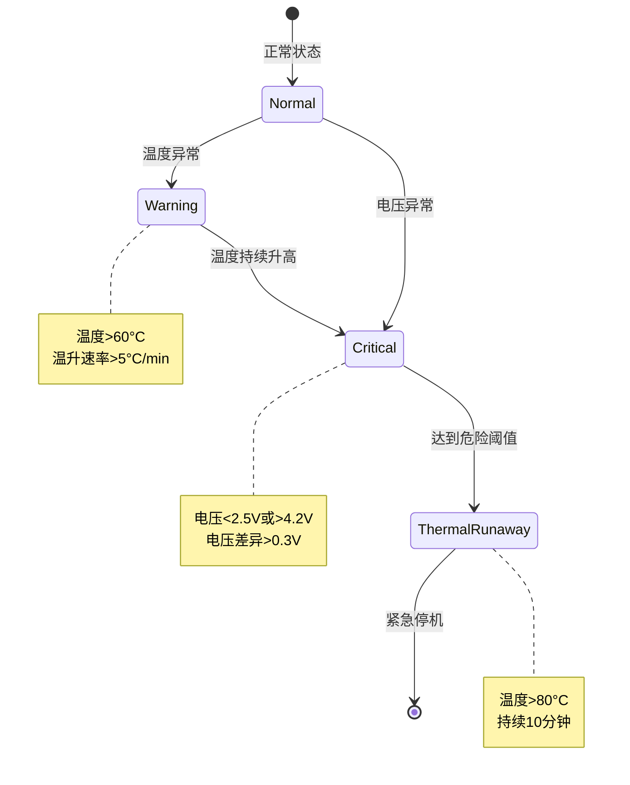
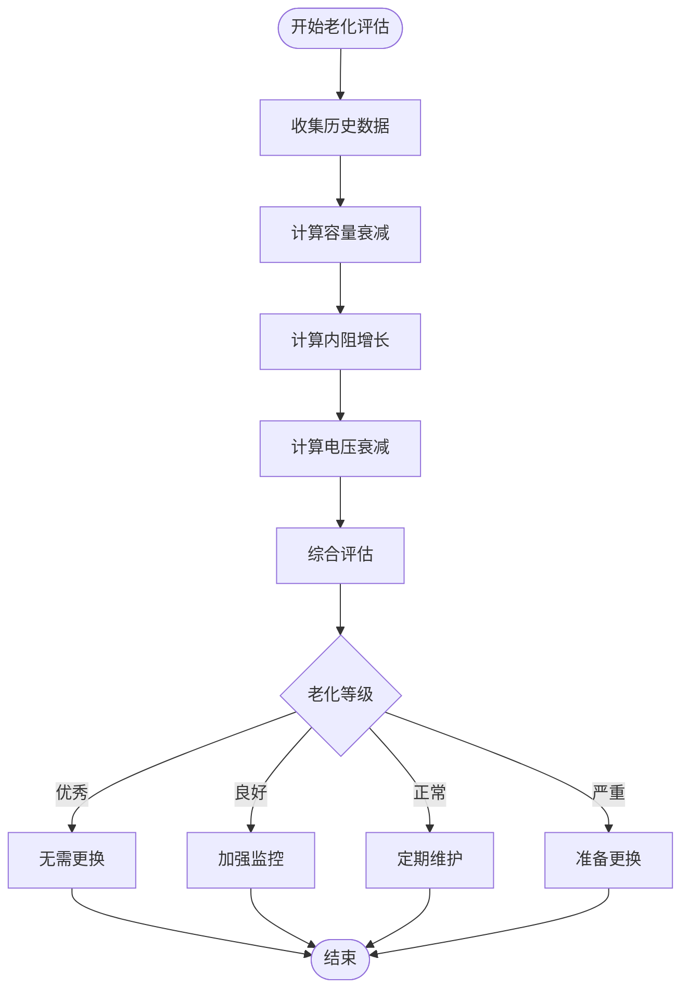
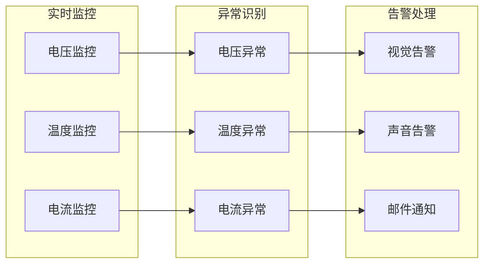
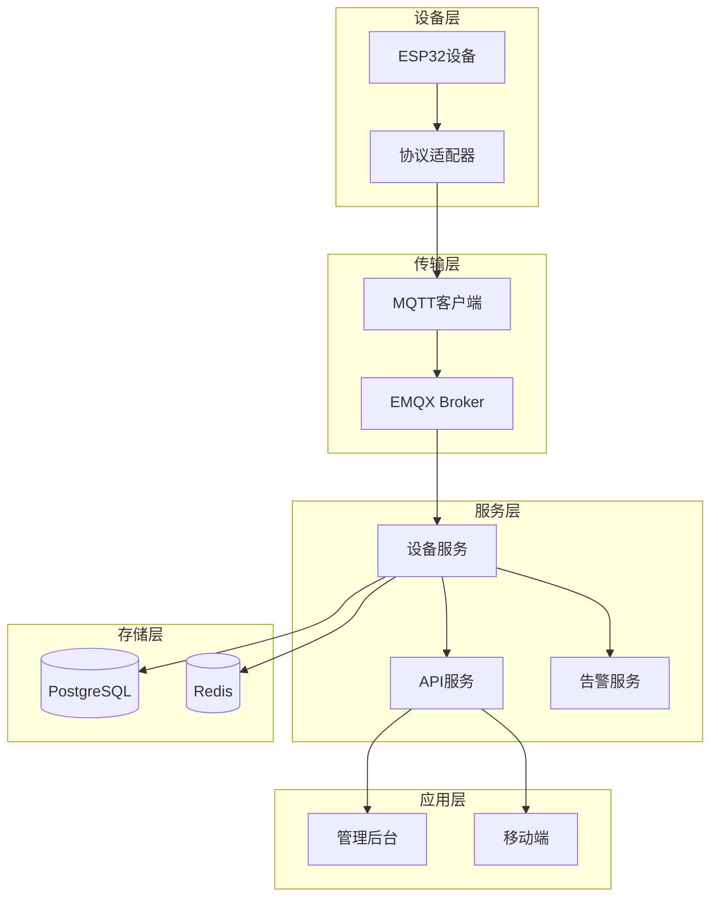

# data/cells电芯详情主题

<cite>
**本文档引用的文件**
- [device.go](file://inv_device_server/internal/model/device.go)
- [protocol_parser.go](file://inv_device_server/internal/service/protocol_parser.go)
- [client.go](file://inv_device_server/internal/mqtt/client.go)
- [repositories.go](file://inv_api_server/internal/repository/repositories.go)
- [README.md](file://README.md)
</cite>

## 目录
1. [简介](#简介)
2. [项目结构](#项目结构)
3. [核心组件](#核心组件)
4. [架构概览](#架构概览)
5. [详细组件分析](#详细组件分析)
6. [依赖关系分析](#依赖关系分析)
7. [性能考虑](#性能考虑)
8. [故障排除指南](#故障排除指南)
9. [结论](#结论)

## 简介

本文档详细介绍了data/cells电芯详情主题的技术规范和实现机制。该主题用于实时传输电池电芯的详细监测数据，包括电芯串数、单体电压和温度等关键参数。

系统采用MQTT协议进行实时数据传输，设备以30秒频率上报数据，使用QoS级别0的非保留消息配置。电芯数据采用JSON格式，包含cell_count、voltages和temps等核心字段。

## 项目结构

系统采用微服务架构，主要组件包括：



**图表来源**
- [README.md:1-142](file://README.md#L1-L142)

**章节来源**
- [README.md:1-142](file://README.md#L1-L142)

## 核心组件

### 电芯数据模型

电芯数据采用统一的数据模型定义，包含以下关键字段：

| 字段名称 | 类型 | 描述 | 必填 |
|---------|------|------|------|
| cell_count | int | 电芯串数 | 是 |
| voltages | float[] | 电芯电压数组(V) | 是 |
| temps | float[] | 电芯温度数组(°C) | 是 |
| charge_ah_total | float | 累计充电安时(kWh) | 否 |
| discharge_ah_total | float | 累计放电安时(kWh) | 否 |

### 数据结构验证规则

电芯数据必须满足以下验证规则：

1. **数组长度一致性**: voltages.length = temps.length = cell_count
2. **数值范围验证**: 
   - 电压值通常在0-10V范围内
   - 温度值通常在-40到+125°C范围内
3. **数据完整性**: 所有必填字段必须存在且有效

**章节来源**
- [device.go:95-105](file://inv_device_server/internal/model/device.go#L95-L105)

## 架构概览

系统采用实时数据流架构，电芯数据从设备端到前端展示的完整流程如下：



**图表来源**
- [README.md:1-142](file://README.md#L1-L142)
- [client.go:146-257](file://inv_device_server/internal/mqtt/client.go#L146-L257)

## 详细组件分析

### 电芯数据上报机制

#### MQTT主题配置
- 主题格式: `cs_inv/{sn}/data/cells`
- QoS级别: 0 (最多一次传递)
- 消息类型: 非保留消息
- 上报频率: 30秒一次

#### 数据发布流程



**图表来源**
- [protocol_parser.go:846](file://inv_device_server/internal/service/protocol_parser.go#L846)

#### 数据处理管道

电芯数据经过以下处理阶段：

1. **原始数据接收**: 设备通过MQTT协议上报
2. **数据解析**: 将原始字节流转换为结构化数据
3. **格式验证**: 检查cell_count、voltages、temps的一致性
4. **存储处理**: 将数据持久化到数据库
5. **实时分发**: 通过WebSocket向前端推送

**章节来源**
- [client.go:146-257](file://inv_device_server/internal/mqtt/client.go#L146-L257)
- [protocol_parser.go:846](file://inv_device_server/internal/service/protocol_parser.go#L846)

### 电芯数据payload结构

#### JSON数据格式

```json
{
  "cell_count": 15,
  "voltages": [3.72, 3.71, 3.73, 3.70, 3.72, 3.71, 3.73, 3.70, 3.72, 3.71, 3.73, 3.70, 3.72, 3.71, 3.73],
  "temps": [25.2, 25.1, 25.3, 24.9, 25.2, 25.1, 25.3, 24.9, 25.2, 25.1, 25.3, 24.9, 25.2, 25.1, 25.3],
  "charge_ah_total": 1250.5,
  "discharge_ah_total": 1180.2,
  "sn": "DEVICE-001",
  "received_at": "2024-01-15T10:30:00Z"
}
```

#### 字段详细说明

| 字段 | 类型 | 单位 | 说明 |
|------|------|------|------|
| cell_count | int | 个 | 电芯总数量 |
| voltages | array[float] | V | 每个电芯的电压值 |
| temps | array[float] | °C | 每个电芯的温度值 |
| charge_ah_total | float | Ah | 累计充电安时数 |
| discharge_ah_total | float | Ah | 累计放电安时数 |

**章节来源**
- [device.go:95-105](file://inv_device_server/internal/model/device.go#L95-L105)

### 电芯均衡判断算法

#### 均衡判定标准

电芯均衡状态通过以下指标综合评估：



**图表来源**
- [repositories.go:2158-2160](file://inv_api_server/internal/repository/repositories.go#L2158-L2160)

#### 均衡算法实现

1. **电压均衡判断**:
   - 计算最大电压差: `max(voltages) - min(voltages)`
   - 阈值: 0.02V (20mV)
   - 异常条件: 差值 > 0.02V

2. **温度均衡判断**:
   - 计算温度标准差
   - 阈值: 2°C
   - 异常条件: 标准差 > 2°C

**章节来源**
- [repositories.go:2158-2160](file://inv_api_server/internal/repository/repositories.go#L2158-L2160)

### 热失控预警机制

#### 预警触发条件

热失控风险通过多维度指标监控：



#### 预警算法

1. **温度预警**:
   - 单体温度阈值: 60°C
   - 温升速率: (T(n) - T(n-1)) / Δt > 5°C/min

2. **电压预警**:
   - 低压: 电压 < 2.5V
   - 高压: 电压 > 4.2V
   - 电压漂移: 电压变化率 > 0.1%/min

**章节来源**
- [repositories.go:2158-2160](file://inv_api_server/internal/repository/repositories.go#L2158-L2160)

### 电芯老化评估方法

#### 老化指标计算

电芯老化程度通过以下指标综合评估：

| 指标 | 计算公式 | 正常范围 | 评估等级 |
|------|----------|----------|----------|
| 容量衰减率 | (1 - C_now/C_initial) × 100% | <20% | 良好 |
| 内阻增长率 | (R_now - R_initial) / R_initial | <50% | 正常 |
| 电压衰减率 | (U_nominal - U_avg) / U_nominal | <10% | 优秀 |

#### 老化评估流程



**图表来源**
- [repositories.go:2158-2160](file://inv_api_server/internal/repository/repositories.go#L2158-L2160)

**章节来源**
- [repositories.go:2158-2160](file://inv_api_server/internal/repository/repositories.go#L2158-L2160)

### 数据可视化最佳实践

#### 电芯状态图表

1. **电压分布图**:
   - X轴: 电芯编号
   - Y轴: 电压值(V)
   - 颜色编码: 红色(异常)、黄色(警告)、绿色(正常)

2. **温度趋势图**:
   - X轴: 时间序列
   - Y轴: 温度(°C)
   - 区域标注: 温度报警阈值

3. **均衡状态图**:
   - 仪表盘显示: 均衡度百分比
   - 趋势线: 均衡变化趋势

#### 异常检测可视化



**图表来源**
- [README.md:1-142](file://README.md#L1-L142)

## 依赖关系分析

### 组件间依赖关系



**图表来源**
- [README.md:1-142](file://README.md#L1-L142)

### 数据流向分析

电芯数据在系统中的流转过程：

1. **设备端**: ESP32设备采集电芯数据
2. **协议解析**: 将原始数据转换为标准格式
3. **MQTT传输**: 通过EMQX Broker进行消息分发
4. **服务端处理**: 设备服务接收并处理数据
5. **存储**: 数据持久化到PostgreSQL和Redis
6. **API服务**: 提供RESTful接口查询数据
7. **前端展示**: 管理后台和移动端展示数据

**章节来源**
- [README.md:1-142](file://README.md#L1-L142)

## 性能考虑

### 实时性优化

1. **消息队列优化**:
   - 使用共享订阅实现负载均衡
   - QoS级别0确保最低延迟
   - 非保留消息减少内存占用

2. **数据压缩**:
   - 数值精度控制到小数点后2位
   - 数组数据采用二进制格式传输

3. **缓存策略**:
   - Redis缓存最新数据
   - 前端本地缓存近期数据

### 存储优化

1. **数据库设计**:
   - JSONB字段存储结构化数据
   - 适当的索引策略
   - 分区表按时间分片

2. **查询优化**:
   - 预计算常用统计指标
   - 缓存热点查询结果

## 故障排除指南

### 常见问题诊断

#### 电芯数据异常

| 问题现象 | 可能原因 | 解决方案 |
|----------|----------|----------|
| 数据丢失 | 网络中断或设备离线 | 检查MQTT连接状态 |
| 数据格式错误 | 协议解析失败 | 验证数据结构完整性 |
| 数值异常 | 传感器故障 | 检查硬件连接 |
| 上报延迟 | 网络拥塞 | 优化网络配置 |

#### 系统性能问题

1. **高延迟排查**:
   - 检查EMQX集群状态
   - 监控Redis连接数
   - 分析数据库查询性能

2. **内存使用过高**:
   - 检查消息积压情况
   - 优化数据缓存策略
   - 调整批量处理大小

**章节来源**
- [client.go:226-236](file://inv_device_server/internal/mqtt/client.go#L226-L236)

### 监控指标

建议监控以下关键指标：

1. **系统健康指标**:
   - MQTT连接数
   - 消息吞吐量
   - 数据库响应时间

2. **业务指标**:
   - 电芯数据上报成功率
   - 数据处理延迟
   - 前端页面加载时间

## 结论

data/cells电芯详情主题为电池管理系统提供了完整的实时监测解决方案。通过标准化的数据格式、可靠的MQTT传输机制和完善的异常检测算法，系统能够有效监控电芯状态，及时发现潜在问题。

关键优势包括：
- 实时性强：30秒上报频率确保及时性
- 成本低：QoS级别0减少资源消耗
- 扩展性好：微服务架构支持水平扩展
- 可靠性高：多重验证和告警机制

未来可以进一步优化的方向包括：
- 增强机器学习算法进行预测性维护
- 改进数据压缩算法提高传输效率
- 扩展更多电芯健康状态指标
- 优化前端交互体验