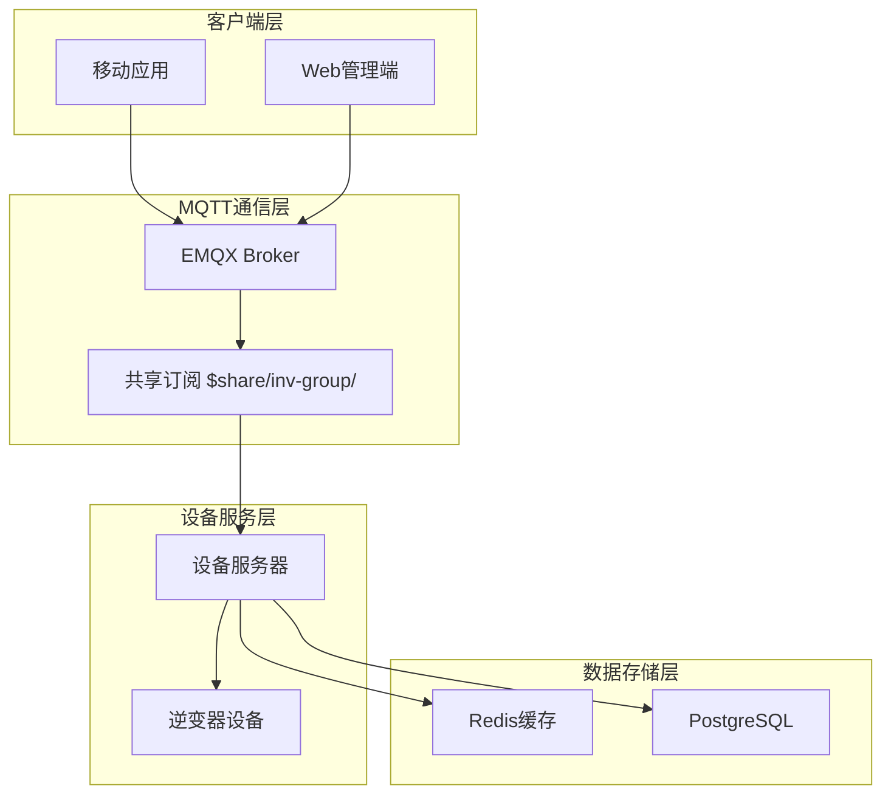
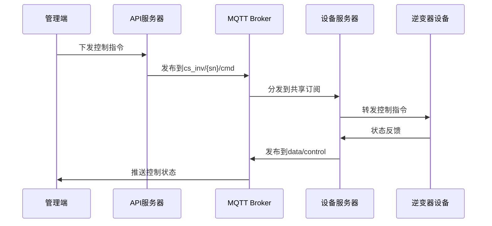
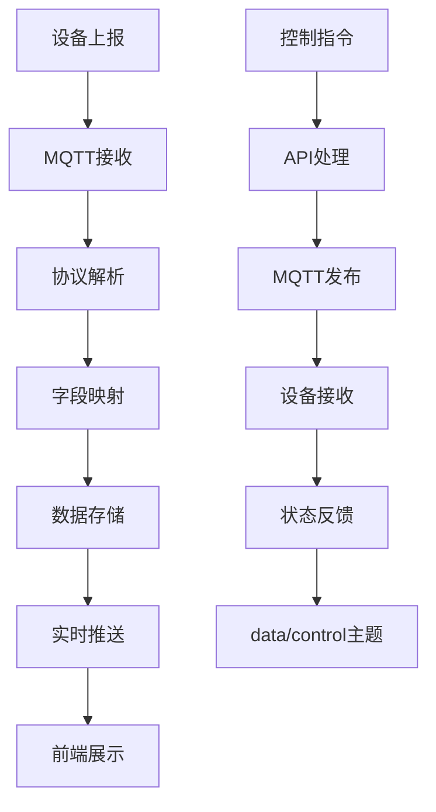
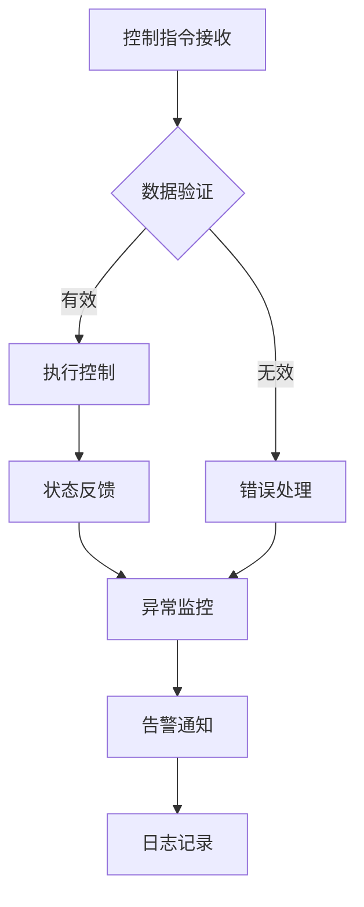
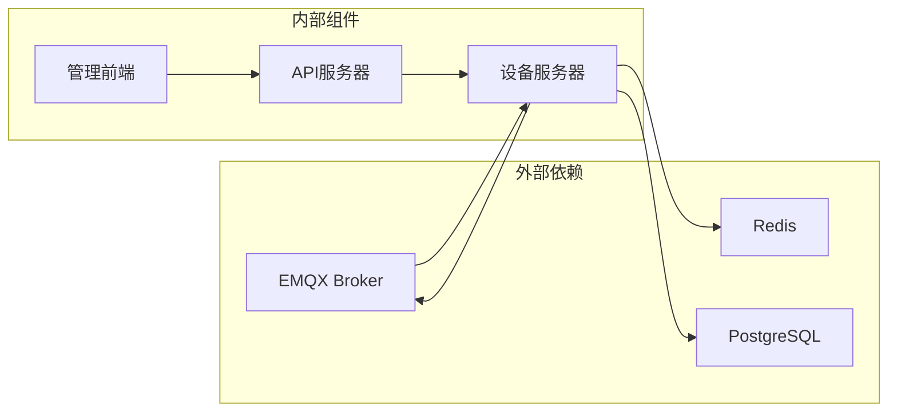

# data/control远程控制状态主题

<cite>
**本文档引用的文件**
- [repositories.go](file://inv_api_server/internal/repository/repositories.go)
- [protocol_parser.go](file://inv_device_server/internal/service/protocol_parser.go)
- [client.go](file://inv_device_server/internal/mqtt/client.go)
- [README.md](file://README.md)
- [index.tsx](file://inv-admin-frontend/src/pages/remote-settings/index.tsx)
- [main.go](file://tools/stress_test/main.go)
</cite>

## 目录
1. [简介](#简介)
2. [项目结构](#项目结构)
3. [核心组件](#核心组件)
4. [架构概览](#架构概览)
5. [详细组件分析](#详细组件分析)
6. [依赖分析](#依赖分析)
7. [性能考虑](#性能考虑)
8. [故障排除指南](#故障排除指南)
9. [结论](#结论)

## 简介

本文档详细介绍了data/control远程控制状态主题的技术实现，这是一个基于MQTT协议的实时控制指令下发和状态反馈机制。该系统采用EMQX MQTT Broker作为消息中间件，实现了设备与云端之间的双向通信。

### 系统特点

- **实时性**: 基于MQTT协议的低延迟通信
- **可靠性**: QoS级别1确保消息可靠传输
- **可扩展性**: 支持多实例设备服务器集群
- **安全性**: 内置JWT认证机制
- **监控性**: 完整的状态追踪和异常处理

## 项目结构

系统采用微服务架构，主要组件包括：



**图表来源**
- [README.md: 1-367:1-367](file://README.md#L1-L367)

**章节来源**
- [README.md: 1-367:1-367](file://README.md#L1-L367)

## 核心组件

### MQTT Broker配置

系统使用EMQX作为MQTT Broker，支持以下关键特性：

- **共享订阅**: `$share/inv-group/` 前缀实现负载均衡
- **JWT认证**: HS256算法确保通信安全
- **TLS支持**: 端口8883提供加密通信
- **会话管理**: Clean Session确保连接稳定性

### 设备服务器架构

设备服务器负责MQTT消息的接收、解析和转发：

- **连接管理**: 自动重连和错误处理
- **消息解析**: 多种协议适配器支持
- **数据映射**: 字段名称标准化
- **状态维护**: 在线状态和统计数据

**章节来源**
- [README.md: 112-142:112-142](file://README.md#L112-L142)
- [README.md: 206-251:206-251](file://README.md#L206-L251)

## 架构概览

### 控制指令流程



**图表来源**
- [client.go: 277-330:277-330](file://inv_device_server/internal/mqtt/client.go#L277-L330)
- [README.md: 206-214:206-214](file://README.md#L206-L214)

### 数据处理管道



**图表来源**
- [protocol_parser.go: 247-529:247-529](file://inv_device_server/internal/service/protocol_parser.go#L247-L529)
- [repositories.go: 2220-2235:2220-2235](file://inv_api_server/internal/repository/repositories.go#L2220-L2235)

## 详细组件分析

### data/control主题数据结构

根据代码分析，data/control主题的payload包含以下核心字段：

| 字段名 | 类型 | 描述 | 单位 |
|--------|------|------|------|
| power_limit | number | 有功功率上限 | W |
| charge_enable | boolean | 充电使能 | - |
| discharge_enable | boolean | 放电使能 | - |
| grid_charge_enable | boolean | 电网充电使能 | - |
| max_charge_current | number | 最大充电电流 | A |
| max_discharge_current | number | 最大放电电流 | A |

### 字段映射实现

设备服务器通过统一的字段映射机制处理不同设备的数据格式：

```mermaid
classDiagram
class ControlData {
+float power_limit
+boolean charge_enable
+boolean discharge_enable
+boolean grid_charge_enable
+float max_charge_current
+float max_discharge_current
}
class FieldMapper {
+mapControlFields(rawData) ControlData
+parseFloat(key) float
+parseBool(key) boolean
}
class ProtocolParser {
+handleControlData(raw) ControlData
+applyFieldMapping(modelID, payload) map[string]interface{}
}
FieldMapper --> ControlData : creates
ProtocolParser --> FieldMapper : uses
ProtocolParser --> ControlData : produces
```

**图表来源**
- [repositories.go: 2220-2235:2220-2235](file://inv_api_server/internal/repository/repositories.go#L2220-L2235)

### 控制参数作用机制

#### 有功功率限制 (power_limit)
- **作用**: 限制逆变器的最大输出有功功率
- **安全机制**: 超限保护，防止设备过载
- **控制逻辑**: 优先级高于其他功率控制策略

#### 充放电使能控制
- **charge_enable**: 控制电池充电功能
- **discharge_enable**: 控制电池放电功能  
- **grid_charge_enable**: 控制电网对电池充电
- **安全限制**: 互锁机制，避免充放电同时进行

#### 电流限制参数
- **max_charge_current**: 充电最大电流限制
- **max_discharge_current**: 放电最大电流限制
- **保护机制**: 过流保护，温度保护

**章节来源**
- [repositories.go: 2220-2235:2220-2235](file://inv_api_server/internal/repository/repositories.go#L2220-L2235)

### 异常处理机制

系统实现了多层次的异常处理：



**图表来源**
- [protocol_parser.go: 247-265:247-265](file://inv_device_server/internal/service/protocol_parser.go#L247-L265)

### 性能监控指标

系统监控以下关键性能指标：

- **消息延迟**: 从设备上报到前端展示的时间
- **吞吐量**: 每秒处理的消息数量
- **连接数**: 当前活跃的MQTT连接数
- **错误率**: 处理失败的比例

**章节来源**
- [protocol_parser.go: 481-488:481-488](file://inv_device_server/internal/service/protocol_parser.go#L481-L488)

## 依赖分析

### 组件间依赖关系



**图表来源**
- [README.md: 112-142:112-142](file://README.md#L112-L142)

### 数据流依赖

系统采用事件驱动的数据流架构：

1. **设备数据流**: 设备 → MQTT → 设备服务器 → 存储
2. **控制指令流**: 管理端 → API → MQTT → 设备
3. **状态反馈流**: 设备 → MQTT → 设备服务器 → 管理端

**章节来源**
- [README.md: 206-225:206-225](file://README.md#L206-L225)

## 性能考虑

### 5秒上报频率优化

系统针对5秒上报频率进行了专门优化：

- **防抖机制**: 10秒内相同状态不重复上报
- **批量处理**: 多设备数据合并处理
- **内存管理**: 及时清理临时数据结构
- **连接池**: 复用MQTT连接减少开销

### QoS级别配置

- **发布QoS**: 1级确保消息可靠到达
- **订阅QoS**: 1级保证控制指令及时送达
- **重传机制**: 网络异常时自动重试
- **确认机制**: 接收方确认消息处理结果

### 资源使用优化

- **内存使用**: 限制单设备内存占用
- **CPU使用**: 异步处理提高并发性能
- **网络带宽**: 压缩数据减少传输开销
- **存储空间**: 及时清理历史数据

## 故障排除指南

### 常见问题诊断

#### 连接问题
- **症状**: 设备无法连接MQTT Broker
- **排查**: 检查JWT Token有效性、网络连通性
- **解决方案**: 更新认证信息、检查防火墙设置

#### 消息丢失
- **症状**: 控制指令未生效或状态反馈延迟
- **排查**: 检查QoS配置、Broker负载情况
- **解决方案**: 调整QoS级别、增加Broker实例

#### 数据解析错误
- **症状**: 控制参数无法识别或数值异常
- **排查**: 检查设备固件版本、字段映射配置
- **解决方案**: 更新固件、修正字段映射

### 监控指标解读

| 指标名称 | 正常范围 | 异常阈值 | 处理建议 |
|----------|----------|----------|----------|
| 连接数 | 0-设备总数 | >设备总数×1.5 | 检查连接泄漏 |
| 消息延迟 | 0-100ms | >500ms | 优化网络或增加实例 |
| 错误率 | 0%-0.1% | >1% | 检查配置和网络 |
| 吞吐量 | >100msg/s | <10msg/s | 检查负载和资源 |

### 调试工具使用

系统提供了多种调试工具：

- **压力测试**: `tools/stress_test/main.go` - 模拟大量设备并发
- **日志分析**: 结构化日志便于问题定位
- **性能监控**: Prometheus指标收集和可视化

**章节来源**
- [main.go: 21-97:21-97](file://tools/stress_test/main.go#L21-L97)

## 结论

data/control远程控制状态主题是一个高度可靠的实时控制系统，具有以下优势：

1. **技术成熟**: 基于成熟的MQTT协议和EMQX Broker
2. **架构合理**: 微服务架构支持水平扩展
3. **安全可靠**: 多层安全机制和异常处理
4. **性能优异**: 针对5秒上报频率的专门优化
5. **易于维护**: 完善的监控和故障排除机制

该系统为逆变器设备提供了稳定、高效的远程控制能力，支持有功功率限制、充放电控制等多种控制模式，满足了现代智能电网对分布式能源管理的需求。