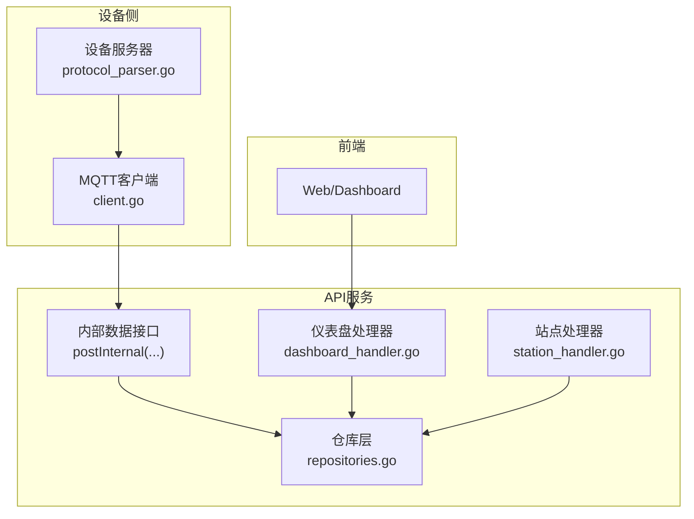
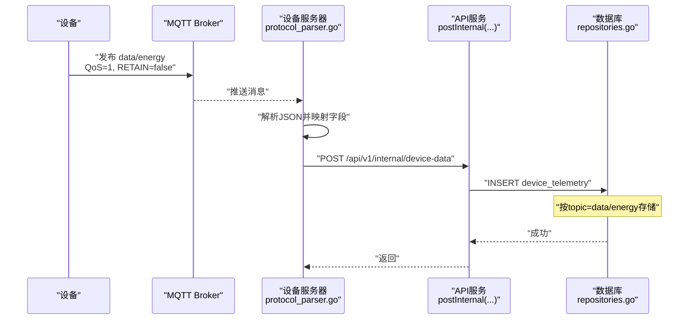
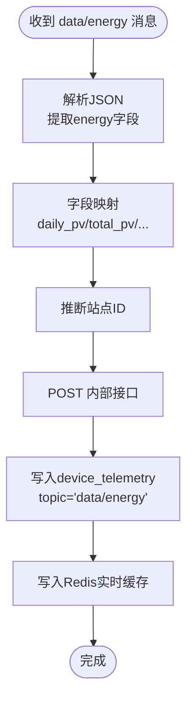
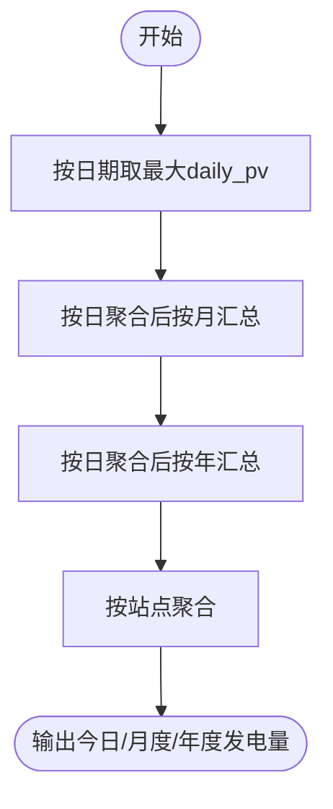
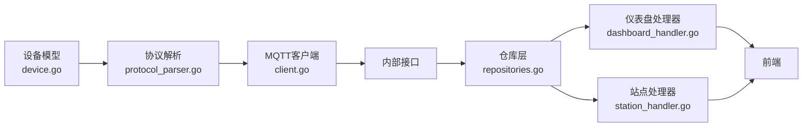

# data/energy能量统计主题

<cite>
**本文档引用的文件**
- [device.go](file://inv_device_server/internal/model/device.go)
- [protocol_parser.go](file://inv_device_server/internal/service/protocol_parser.go)
- [repositories.go](file://inv_api_server/internal/repository/repositories.go)
- [dashboard_handler.go](file://inv_api_server/internal/handler/dashboard_handler.go)
- [station_handler.go](file://inv_api_server/internal/handler/station_handler.go)
- [client.go](file://inv_device_server/internal/mqtt/client.go)
- [main.go](file://inv_api_server/cmd/main.go)
</cite>

## 目录
1. [简介](#简介)
2. [项目结构](#项目结构)
3. [核心组件](#核心组件)
4. [架构总览](#架构总览)
5. [详细组件分析](#详细组件分析)
6. [依赖关系分析](#依赖关系分析)
7. [性能考虑](#性能考虑)
8. [故障排查指南](#故障排查指南)
9. [结论](#结论)
10. [附录](#附录)

## 简介
本文件围绕data/energy能量统计主题，系统性阐述设备上报的能量统计数据结构、上报机制、数据解析与存储流程、统计口径与周期规则，并提供能耗分析方法与优化建议。重点覆盖以下方面：
- 上报频率与QoS级别：设备以60秒间隔上报，采用MQTT QoS 1（可靠到达）。
- 非保留消息策略：消息不设置RETAIN标志，确保仅传递最新状态。
- 能量统计payload字段定义与含义：当日光伏发电量、累计光伏电量、当日充入/放电量、累计充放电量、当日负载消耗、累计负载消耗、累计运行时长等。
- 统计逻辑与周期规则：按日聚合、按站点汇总、跨版本字段兼容。
- 实际JSON示例与数据校验规则：字段类型、取值范围与必填约束。

## 项目结构
围绕data/energy主题，涉及设备侧协议解析、API服务入库与查询、前端展示与统计接口等模块：

图表来源
- [protocol_parser.go:656-681](file://inv_device_server/internal/service/protocol_parser.go#L656-L681)
- [client.go:146-235](file://inv_device_server/internal/mqtt/client.go#L146-L235)
- [repositories.go:1304-1368](file://inv_api_server/internal/repository/repositories.go#L1304-L1368)
- [dashboard_handler.go:130-178](file://inv_api_server/internal/handler/dashboard_handler.go#L130-L178)
- [station_handler.go:384-387](file://inv_api_server/internal/handler/station_handler.go#L384-L387)

章节来源
- [protocol_parser.go:656-681](file://inv_device_server/internal/service/protocol_parser.go#L656-L681)
- [client.go:146-235](file://inv_device_server/internal/mqtt/client.go#L146-L235)
- [repositories.go:1304-1368](file://inv_api_server/internal/repository/repositories.go#L1304-L1368)
- [dashboard_handler.go:130-178](file://inv_api_server/internal/handler/dashboard_handler.go#L130-L178)
- [station_handler.go:384-387](file://inv_api_server/internal/handler/station_handler.go#L384-L387)

## 核心组件
- 设备侧数据模型与解析
  - 能量统计数据结构：包含当日/累计光伏发电量、当日/累计充放电量、当日/累计负载消耗、累计运行时长等字段。
  - 解析逻辑：对data/energy主题进行JSON反序列化，提取字段并写入统一请求体，同时推断站点ID。
- API服务入库与查询
  - 仓库层提供按日、月、年维度的站点级能量统计查询，支持多字段聚合与跨版本字段兼容。
  - 仪表盘与站点处理器调用仓库方法获取今日/累计/月度/年度发电量等指标。
- MQTT传输
  - 客户端连接EMQX，发布QoS 1消息；非保留消息，确保最新状态。

章节来源
- [device.go:79-93](file://inv_device_server/internal/model/device.go#L79-L93)
- [protocol_parser.go:656-681](file://inv_device_server/internal/service/protocol_parser.go#L656-L681)
- [repositories.go:1304-1368](file://inv_api_server/internal/repository/repositories.go#L1304-L1368)
- [dashboard_handler.go:130-178](file://inv_api_server/internal/handler/dashboard_handler.go#L130-L178)
- [station_handler.go:384-387](file://inv_api_server/internal/handler/station_handler.go#L384-L387)
- [client.go:146-235](file://inv_device_server/internal/mqtt/client.go#L146-L235)

## 架构总览
下图展示从设备上报到API服务入库与前端展示的完整链路：

图表来源
- [protocol_parser.go:656-681](file://inv_device_server/internal/service/protocol_parser.go#L656-L681)
- [client.go:146-235](file://inv_device_server/internal/mqtt/client.go#L146-L235)
- [repositories.go:1304-1368](file://inv_api_server/internal/repository/repositories.go#L1304-L1368)

## 详细组件分析

### 能量统计payload结构与字段定义
- 字段清单与单位
  - daily_pv：当日光伏发电量（kWh）
  - total_pv：累计光伏发电量（kWh）
  - daily_charge：当日充入电池电量（kWh）
  - total_charge：累计充电量（kWh）
  - daily_discharge：当日电池放电量（kWh）
  - total_discharge：累计放电量（kWh）
  - daily_load：当日负载消耗（kWh）
  - total_load：累计负载消耗（kWh）
  - runtime_hours：累计运行时长（小时）

- 字段来源与映射
  - 设备侧模型定义包含上述字段，解析器将嵌套或扁平格式的energy数据映射为统一键名，写入请求体并提交至API服务。

章节来源
- [device.go:79-93](file://inv_device_server/internal/model/device.go#L79-L93)
- [protocol_parser.go:656-681](file://inv_device_server/internal/service/protocol_parser.go#L656-L681)

### 上报机制与传输特性
- 上报频率：设备以60秒为周期上报一次。
- QoS级别：MQTT QoS 1，保证消息至少送达一次。
- 保留策略：非保留消息（RETAIN=false），仅传递最新值。
- 主题命名：data/energy。

章节来源
- [client.go:146-235](file://inv_device_server/internal/mqtt/client.go#L146-L235)

### 数据解析与入库流程
- 设备侧解析
  - 判断topic为data/energy时，解析payload中的energy数据，提取各字段并写入统一请求体，同时根据SN推断站点ID。
- API服务入库
  - 通过内部接口接收设备数据，写入device_telemetry表，topic固定为data/energy。
- 实时缓存
  - 将最新实时数据写入Redis，便于前端订阅与快速查询。

图表来源
- [protocol_parser.go:656-681](file://inv_device_server/internal/service/protocol_parser.go#L656-L681)
- [repositories.go:1304-1368](file://inv_api_server/internal/repository/repositories.go#L1304-L1368)

章节来源
- [protocol_parser.go:656-681](file://inv_device_server/internal/service/protocol_parser.go#L656-L681)
- [repositories.go:1304-1368](file://inv_api_server/internal/repository/repositories.go#L1304-L1368)

### 统计逻辑与周期规则
- 今日发电量（今日能量）
  - 取当前日期内各设备在data/energy主题下的daily_pv的最大值，兼容多种字段路径（含历史字段别名）。
- 累计发电量（累计能量）
  - 取最新一条记录的total_pv，兼容多种字段路径。
- 月度/年度发电量
  - 对每日daily_pv按设备与日期分组求最大值，再按月/年汇总，过滤无效值。
- 站点级统计
  - 通过设备SN集合限定站点，分别计算今日、当月、当年的累计发电量。

图表来源
- [dashboard_handler.go:130-178](file://inv_api_server/internal/handler/dashboard_handler.go#L130-L178)
- [repositories.go:1304-1368](file://inv_api_server/internal/repository/repositories.go#L1304-L1368)

章节来源
- [dashboard_handler.go:130-178](file://inv_api_server/internal/handler/dashboard_handler.go#L130-L178)
- [repositories.go:1304-1368](file://inv_api_server/internal/repository/repositories.go#L1304-L1368)

### 查询接口与前端集成
- 仪表盘接口
  - 提供今日发电量、累计发电量等指标查询，支持管理员与普通用户权限差异。
- 站点接口
  - 聚合站点级实时功率与今日/累计/月度/年度发电量，用于站点概览。

章节来源
- [dashboard_handler.go:130-178](file://inv_api_server/internal/handler/dashboard_handler.go#L130-L178)
- [station_handler.go:384-387](file://inv_api_server/internal/handler/station_handler.go#L384-L387)
- [main.go](file://inv_api_server/cmd/main.go#L493)

## 依赖关系分析
- 设备侧依赖
  - 协议解析依赖设备模型定义，将JSON映射为统一字段。
  - MQTT客户端负责连接Broker并发布QoS 1消息。
- API服务依赖
  - 仓库层提供按日/月/年聚合查询，支持跨版本字段兼容。
  - 处理器依赖仓库方法获取指标并返回给前端。
- 前端依赖
  - 通过仪表盘与站点接口获取指标，渲染图表与卡片。

图表来源
- [device.go:79-93](file://inv_device_server/internal/model/device.go#L79-L93)
- [protocol_parser.go:656-681](file://inv_device_server/internal/service/protocol_parser.go#L656-L681)
- [client.go:146-235](file://inv_device_server/internal/mqtt/client.go#L146-L235)
- [repositories.go:1304-1368](file://inv_api_server/internal/repository/repositories.go#L1304-L1368)
- [dashboard_handler.go:130-178](file://inv_api_server/internal/handler/dashboard_handler.go#L130-L178)
- [station_handler.go:384-387](file://inv_api_server/internal/handler/station_handler.go#L384-L387)

## 性能考虑
- 数据压缩与索引
  - TimescaleDB压缩与索引可显著提升按日/月/年聚合查询性能。
- 缓存策略
  - Redis缓存最新实时数据，减少数据库压力，提高前端响应速度。
- 查询优化
  - 使用COALESCE与条件过滤避免NULL值影响聚合结果，按日期与设备分组减少扫描范围。
- 上报频率权衡
  - 60秒上报频率在实时性与网络开销之间取得平衡；可根据场景调整。

## 故障排查指南
- 设备未上线或离线
  - 检查MQTT连接状态与LWT消息；确认Redis在线标记是否更新。
- 无数据或数据异常
  - 确认payload字段路径与类型一致；检查仓库查询是否正确匹配topic与字段。
- 权限问题
  - 管理员与普通用户的查询条件不同，需核对用户ID与设备归属。

章节来源
- [client.go:146-235](file://inv_device_server/internal/mqtt/client.go#L146-L235)
- [repositories.go:1304-1368](file://inv_api_server/internal/repository/repositories.go#L1304-L1368)
- [dashboard_handler.go:130-178](file://inv_api_server/internal/handler/dashboard_handler.go#L130-L178)

## 结论
data/energy主题通过明确的字段定义、稳定的60秒上报频率与QoS 1传输保障，实现了对光伏系统能量平衡的可靠采集与统计。API服务提供多粒度聚合查询与跨版本字段兼容，满足站点级与平台级的能效分析需求。结合本文提供的统计逻辑、校验规则与优化建议，可进一步提升系统的稳定性与可维护性。

## 附录

### 字段定义与取值范围
- daily_pv：当日光伏发电量（kWh），数值≥0
- total_pv：累计光伏发电量（kWh），数值≥0
- daily_charge：当日充入电池电量（kWh），数值≥0
- total_charge：累计充电量（kWh），数值≥0
- daily_discharge：当日电池放电量（kWh），数值≥0
- total_discharge：累计放电量（kWh），数值≥0
- daily_load：当日负载消耗（kWh），数值≥0
- total_load：累计负载消耗（kWh），数值≥0
- runtime_hours：累计运行时长（小时），数值≥0

章节来源
- [device.go:79-93](file://inv_device_server/internal/model/device.go#L79-L93)

### 数据校验规则
- 必填字段：至少应包含daily_pv或energy_daily_pv之一，total_pv可选但建议存在。
- 类型约束：所有字段应为数值类型；若为字符串需可转换为浮点数。
- 范围约束：数值不应为负数；若出现异常值，应进行过滤或报警。
- 兼容性：支持嵌套与扁平两种payload结构；仓库查询兼容历史字段别名。

章节来源
- [dashboard_handler.go:130-178](file://inv_api_server/internal/handler/dashboard_handler.go#L130-L178)
- [repositories.go:1304-1368](file://inv_api_server/internal/repository/repositories.go#L1304-L1368)

### 实际JSON示例（字段路径示意）
- 嵌套格式（推荐）
  - topic: data/energy
  - payload: 包含energy字段，energy.data包含上述字段
- 扁平格式
  - topic: data/energy
  - payload: 直接包含上述字段

章节来源
- [protocol_parser.go:656-681](file://inv_device_server/internal/service/protocol_parser.go#L656-L681)