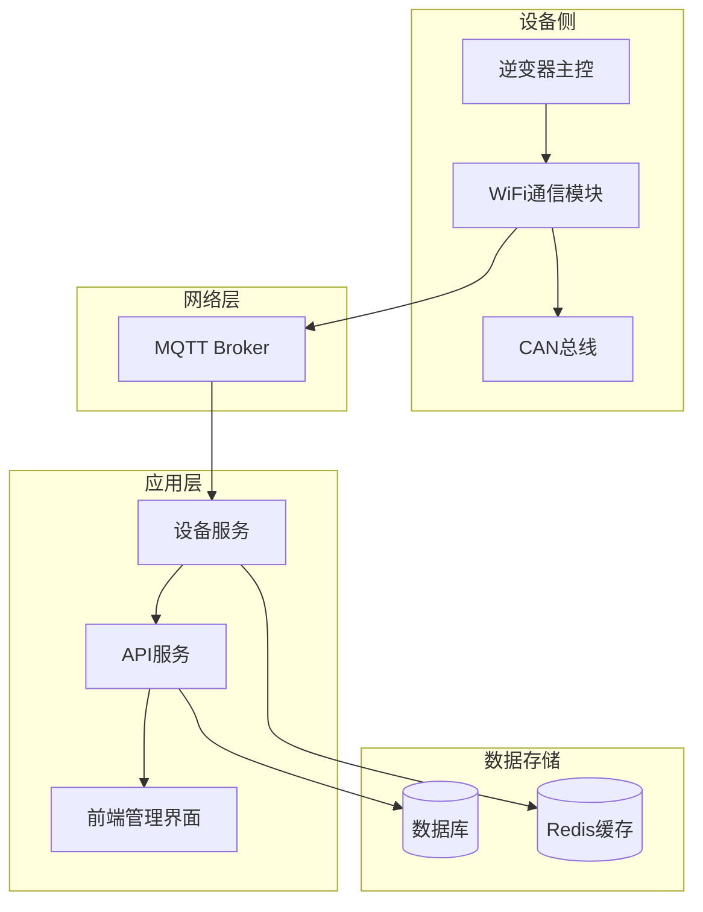
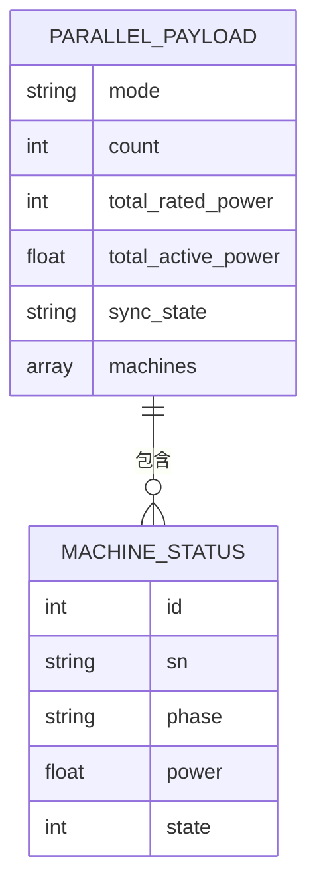
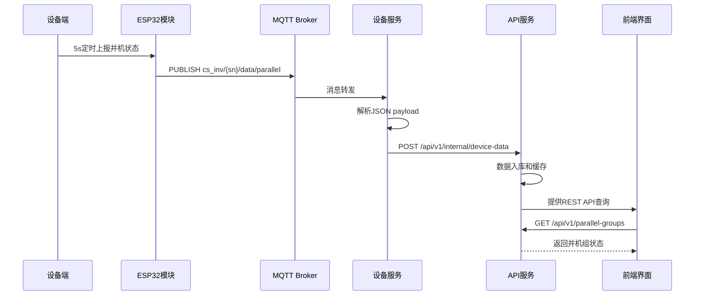
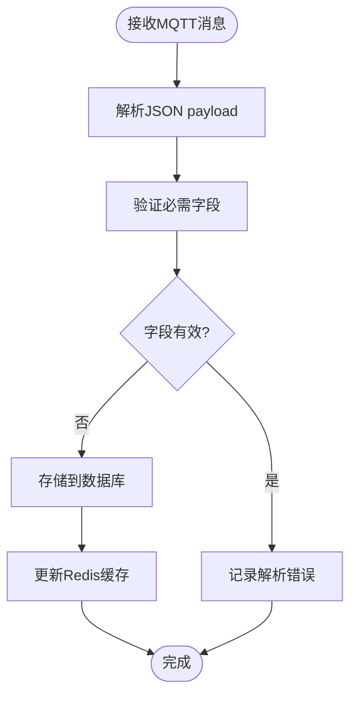
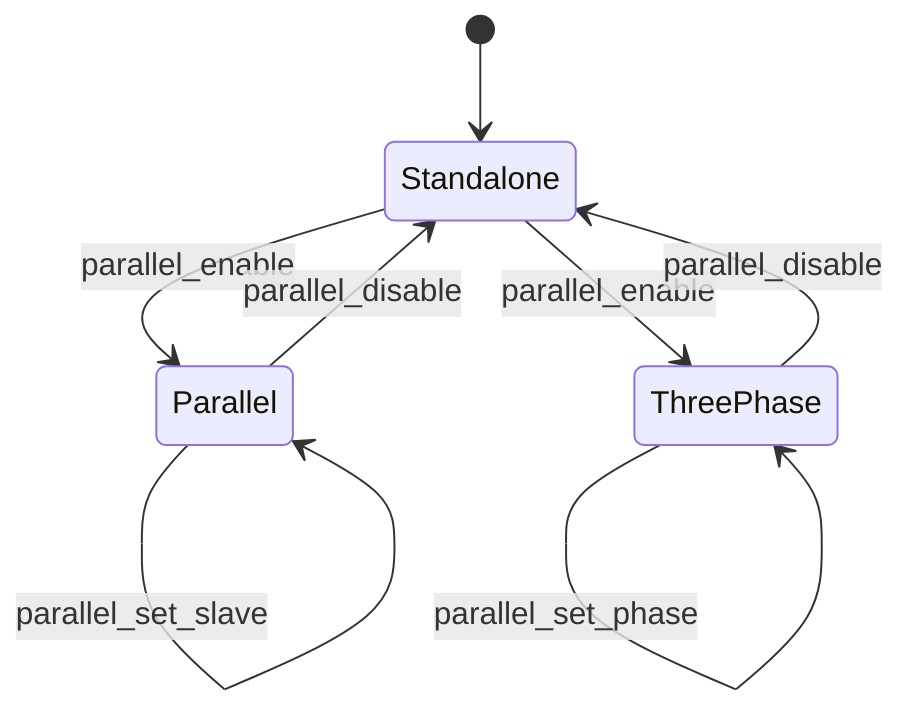
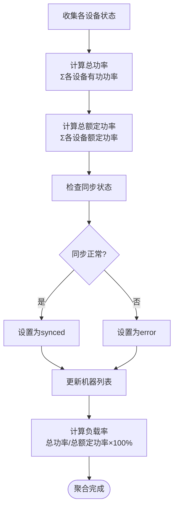
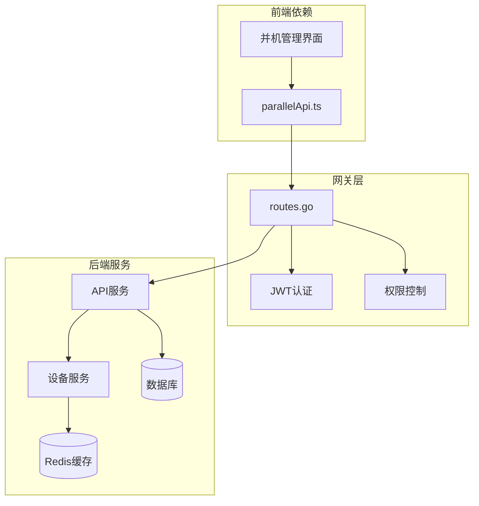
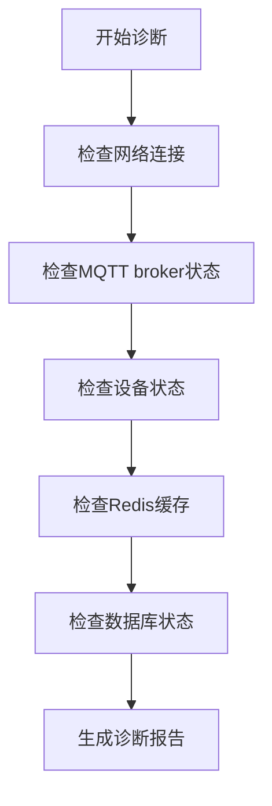

# data/parallel并机信息主题

<cite>
**本文档引用的文件**
- [MQTT接口文档.md](file://docs/MQTT接口文档.md)
- [系统参数规范_48V离网逆变器.md](file://docs/系统参数规范_48V离网逆变器.md)
- [protocol_parser.go](file://inv_device_server/internal/service/protocol_parser.go)
- [protocol_adapter.go](file://inv_device_server/internal/service/protocol_adapter.go)
- [routes.go](file://api-gateway/internal/routes/routes.go)
- [parallelApi.ts](file://inv-admin-frontend/src/services/parallelApi.ts)
- [index.tsx](file://inv-admin-frontend/src/pages/parallel/index.tsx)
- [main.go](file://tools/stress_test/main.go)
</cite>

## 目录
1. [简介](#简介)
2. [项目结构](#项目结构)
3. [核心组件](#核心组件)
4. [架构概览](#架构概览)
5. [详细组件分析](#详细组件分析)
6. [依赖关系分析](#依赖关系分析)
7. [性能考虑](#性能考虑)
8. [故障诊断指南](#故障诊断指南)
9. [结论](#结论)
10. [附录](#附录)

## 简介

data/parallel并机信息主题是CS-I10-6k2离网逆变器监控系统中的关键数据通道，负责上报并联运行设备的实时状态信息。该主题采用5秒上报频率，QoS级别0，非保留消息配置，确保了实时性和资源效率的平衡。

并机系统通过CAN总线互联，仅主机设备负责同步和云端通信。该主题承载着并机模式、设备数量、功率统计、同步状态等核心运行参数，为运维管理和故障诊断提供了重要依据。

## 项目结构

并机信息主题在整个系统架构中位于数据采集层，通过MQTT协议实现设备与云端的实时通信：



**图表来源**
- [protocol_parser.go:322-697](file://inv_device_server/internal/service/protocol_parser.go#L322-L697)
- [routes.go:25-55](file://api-gateway/internal/routes/routes.go#L25-L55)

**章节来源**
- [protocol_parser.go:322-697](file://inv_device_server/internal/service/protocol_parser.go#L322-L697)
- [routes.go:25-55](file://api-gateway/internal/routes/routes.go#L25-L55)

## 核心组件

### 数据上报机制

并机信息采用定时上报策略，每5秒自动推送一次最新状态：

- **上报频率**: 5秒固定间隔
- **QoS级别**: 0（最多一次传递）
- **保留标志**: false（非持久化消息）
- **主题格式**: `cs_inv/{sn}/data/parallel`

### Payload数据结构

并机信息主题的JSON结构包含以下关键字段：



**图表来源**
- [MQTT接口文档.md:362-384](file://docs/MQTT接口文档.md#L362-L384)
- [系统参数规范_48V离网逆变器.md:556-596](file://docs/系统参数规范_48V离网逆变器.md#L556-L596)

### 关键字段定义

| 字段名 | 类型 | 说明 | 取值范围 |
|--------|------|------|----------|
| mode | string | 并机模式 | standalone/parallel/three_phase |
| count | int | 并机台数 | 1-8台 |
| total_rated_power | int | 总额定功率(W) | 6200W × 台数 |
| total_active_power | float | 总有功功率(W) | 实际输出功率 |
| sync_state | string | 同步状态 | synced/syncing/error |
| machines | array | 机器状态列表 | 每台设备状态 |

**章节来源**
- [MQTT接口文档.md:362-384](file://docs/MQTT接口文档.md#L362-L384)
- [系统参数规范_48V离网逆变器.md:556-596](file://docs/系统参数规范_48V离网逆变器.md#L556-L596)

## 架构概览

并机信息从设备侧采集到云端处理的完整流程：



**图表来源**
- [protocol_parser.go:322-697](file://inv_device_server/internal/service/protocol_parser.go#L322-L697)
- [routes.go:99-102](file://api-gateway/internal/routes/routes.go#L99-L102)

## 详细组件分析

### 设备数据解析组件

设备服务负责接收并解析来自逆变器的并机信息：



**图表来源**
- [protocol_parser.go:322-697](file://inv_device_server/internal/service/protocol_parser.go#L322-L697)

### 并机模式切换逻辑

并机模式的切换通过控制命令实现，支持三种模式：



**图表来源**
- [系统参数规范_48V离网逆变器.md:638-685](file://docs/系统参数规范_48V离网逆变器.md#L638-L685)

### 同步状态监控

同步状态通过三个维度监控：

| 状态类型 | 描述 | 触发条件 |
|----------|------|----------|
| synced | 同步完成 | 主从设备频率相位完全匹配 |
| syncing | 正在同步 | 启动同步过程，参数调整中 |
| error | 同步错误 | 相位差超过阈值或通信异常 |

**章节来源**
- [protocol_parser.go:322-697](file://inv_device_server/internal/service/protocol_parser.go#L322-L697)
- [系统参数规范_48V离网逆变器.md:556-596](file://docs/系统参数规范_48V离网逆变器.md#L556-L596)

### 机器状态聚合算法

并机系统的状态聚合遵循以下规则：



**图表来源**
- [系统参数规范_48V离网逆变器.md:556-596](file://docs/系统参数规范_48V离网逆变器.md#L556-L596)

**章节来源**
- [系统参数规范_48V离网逆变器.md:556-596](file://docs/系统参数规范_48V离网逆变器.md#L556-L596)

## 依赖关系分析

并机信息主题涉及多个组件间的复杂依赖关系：



**图表来源**
- [routes.go:99-102](file://api-gateway/internal/routes/routes.go#L99-L102)
- [parallelApi.ts:3-12](file://inv-admin-frontend/src/services/parallelApi.ts#L3-L12)

**章节来源**
- [routes.go:99-102](file://api-gateway/internal/routes/routes.go#L99-L102)
- [parallelApi.ts:3-12](file://inv-admin-frontend/src/services/parallelApi.ts#L3-L12)

## 性能考虑

### 数据传输优化

并机信息采用QoS 0配置的原因：
- **实时性要求**: 5秒间隔的监控数据不需要可靠传递保证
- **网络带宽**: 减少ACK确认开销，提高吞吐量
- **系统负载**: 降低MQTT broker的处理压力

### 缓存策略

设备服务实现了多层次缓存机制：
- **Redis缓存**: 实时数据快速访问
- **数据库存储**: 持久化历史数据
- **批量处理**: 减少数据库写入频率

## 故障诊断指南

### 常见问题诊断

| 问题现象 | 可能原因 | 处理建议 |
|----------|----------|----------|
| 数据延迟 | 网络拥塞或设备离线 | 检查MQTT连接状态和网络质量 |
| 同步失败 | 相位差过大或通信异常 | 检查CAN总线连接和设备配置 |
| 功率异常 | 传感器故障或计算错误 | 校准传感器并检查算法实现 |
| 状态不一致 | 缓存不同步 | 清理Redis缓存并重新加载 |

### 状态码对照表

| 状态码 | 含义 | 说明 |
|--------|------|------|
| 0 | 待机 | 设备处于待机状态 |
| 1 | 运行 | 设备正常运行中 |
| 2 | 故障 | 设备出现故障 |
| 3 | 离线 | 设备失去连接 |

### 诊断工具

系统提供了多种诊断工具支持：



**章节来源**
- [index.tsx:81-86](file://inv-admin-frontend/src/pages/parallel/index.tsx#L81-L86)

## 结论

data/parallel并机信息主题作为逆变器监控系统的核心组件，通过标准化的数据格式和可靠的传输机制，为并机系统的运行监控提供了完整的技术支撑。其设计充分考虑了实时性、可靠性、可扩展性等多方面需求，为后续的功能扩展和性能优化奠定了坚实基础。

系统通过前后端分离的架构设计，配合完善的缓存和存储策略，确保了大规模并机场景下的稳定运行。同时，丰富的诊断工具和监控指标为运维管理提供了强有力的支持。

## 附录

### 完整JSON示例

标准并机信息JSON格式：

```json
{
  "mode": "three_phase",
  "count": 3,
  "total_rated_power": 18600,
  "total_active_power": 15200,
  "sync_state": "synced",
  "machines": [
    {
      "id": 0,
      "sn": "H1CNA001350014",
      "phase": "L1",
      "power": 5100,
      "state": 2
    },
    {
      "id": 1,
      "sn": "H1CNA001350015",
      "phase": "L2",
      "power": 5050,
      "state": 2
    },
    {
      "id": 2,
      "sn": "H1CNA001350016",
      "phase": "L3",
      "power": 5050,
      "state": 2
    }
  ]
}
```

### 最佳实践建议

1. **配置管理**
   - 建立标准化的并机配置模板
   - 实施变更审批流程
   - 定期验证配置有效性

2. **监控告警**
   - 设置合理的阈值和告警级别
   - 建立多级告警机制
   - 定期测试告警功能

3. **维护策略**
   - 制定定期巡检计划
   - 建立故障处理流程
   - 持续优化系统性能

4. **安全考虑**
   - 实施严格的访问控制
   - 定期更新安全补丁
   - 建立数据备份机制