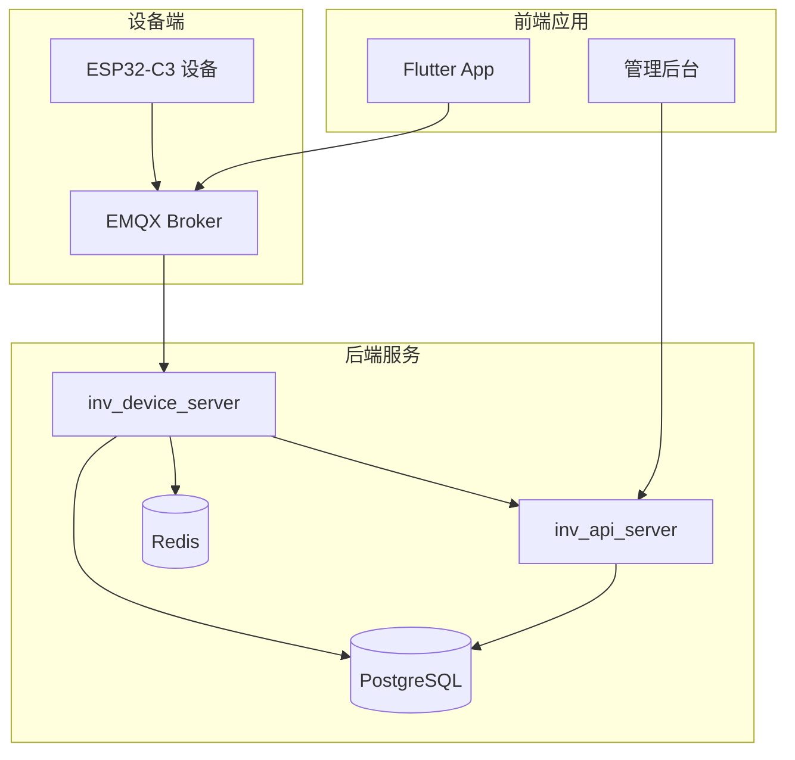
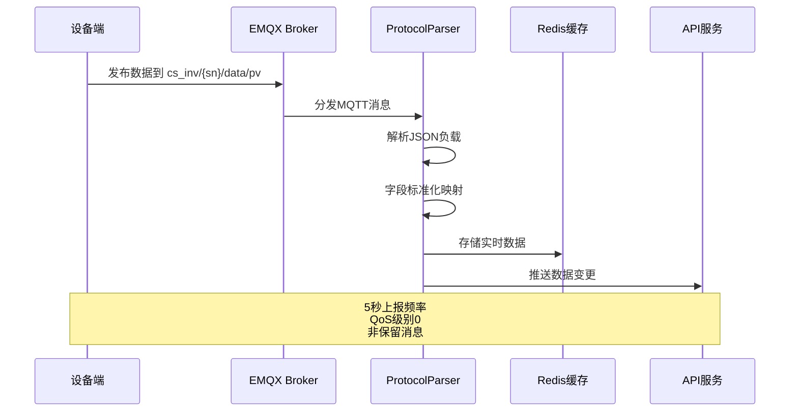
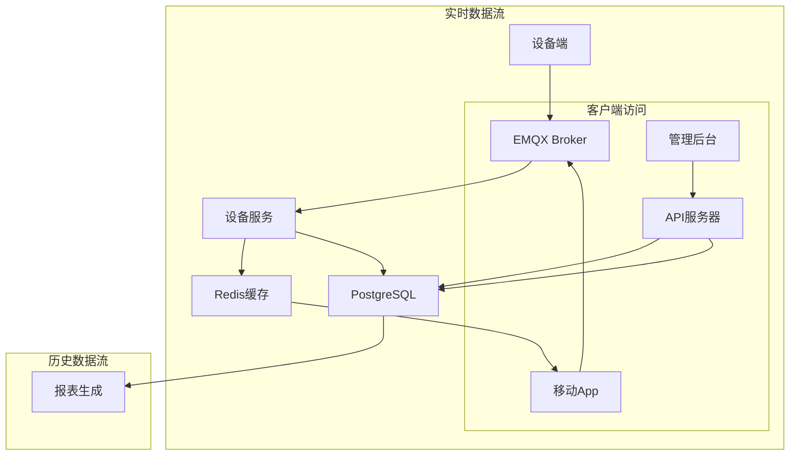
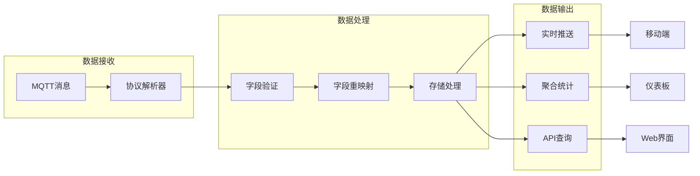
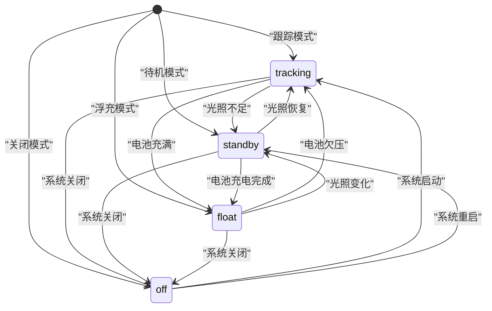
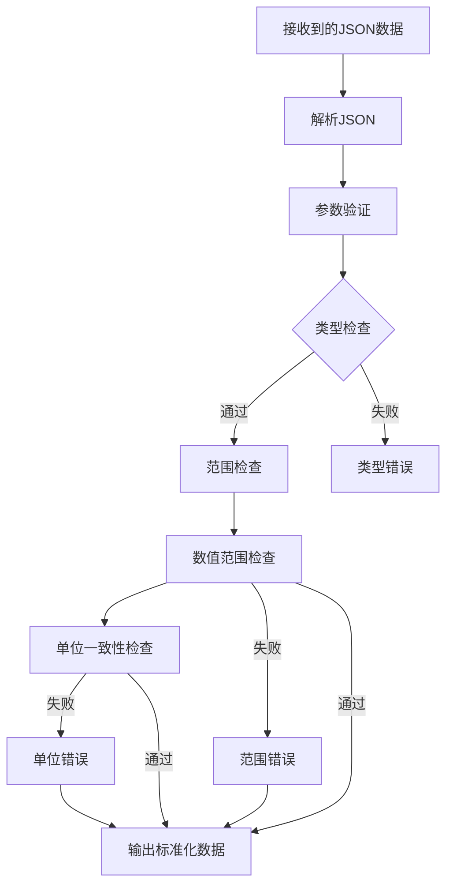
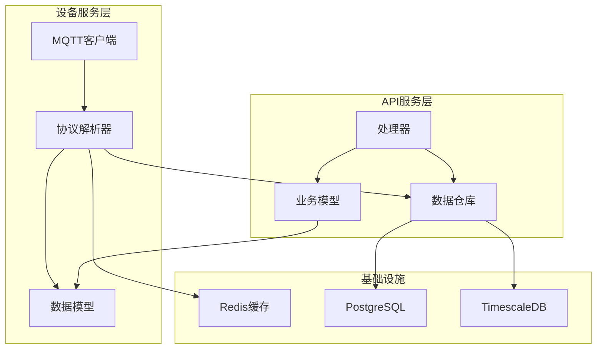
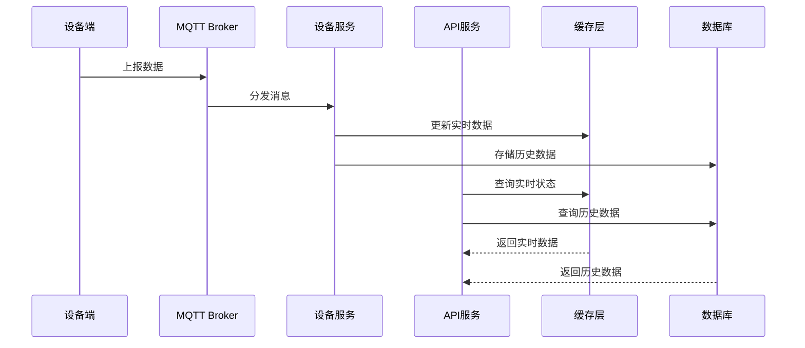
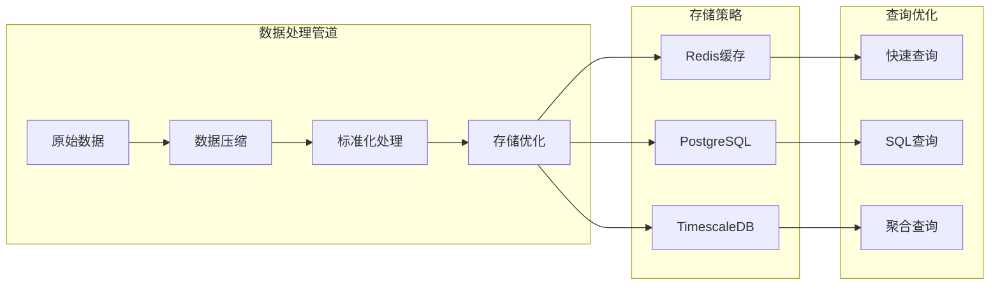

# data/pv光伏数据主题

<cite>
**本文档引用的文件**
- [README.md](file://README.md)
- [device.go](file://inv_device_server/internal/model/device.go)
- [protocol_parser.go](file://inv_device_server/internal/service/protocol_parser.go)
- [client.go](file://inv_device_server/internal/mqtt/client.go)
- [repositories.go](file://inv_api_server/internal/repository/repositories.go)
- [station_handler.go](file://inv_api_server/internal/handler/station_handler.go)
- [dashboard_handler.go](file://inv_api_server/internal/handler/dashboard_handler.go)
- [models.go](file://inv_api_server/internal/model/models.go)
</cite>

## 目录
1. [简介](#简介)
2. [项目结构](#项目结构)
3. [核心组件](#核心组件)
4. [架构概览](#架构概览)
5. [详细组件分析](#详细组件分析)
6. [依赖关系分析](#依赖关系分析)
7. [性能考虑](#性能考虑)
8. [故障排除指南](#故障排除指南)
9. [结论](#结论)
10. [附录](#附录)

## 简介

本文档详细介绍了data/pv光伏数据主题的技术规范和实现机制。该系统基于MQTT协议的光伏逆变器物联网监控平台，支持实时监控、告警管理和用户管理等功能。重点涵盖光伏MPPT数据上报机制，包括5秒上报频率、QoS级别0、非保留消息的配置。

系统采用EMQX作为生产级MQTT Broker，内置JWT认证机制，设备通过密码认证方式直连EMQX进行数据上报。实时数据链路完全走MQTT推送，历史/统计数据通过HTTP API按需查询。

## 项目结构

系统采用微服务架构，主要包含以下核心组件：



**图表来源**
- [README.md:206-251](file://README.md#L206-L251)

**章节来源**
- [README.md:1-367](file://README.md#L1-L367)

## 核心组件

### 光伏数据模型定义

系统中的光伏数据采用统一的数据模型结构，支持多种数据格式的兼容处理：

```mermaid
classDiagram
class PVData {
+float64 pv_voltage
+float64 pv_current
+float64 pv_power
+string mppt_state
+string SN
+time.Time ReceivedAt
}
class LegacyPVData {
+float64 pv1_voltage
+float64 pv1_current
+float64 pv1_power
+float64 pv1_voltage_max
+float64 pv1_power_max
+float64 pv2_voltage
+float64 pv2_current
+float64 pv2_power
+float64 pv2_voltage_max
+float64 pv2_power_max
+float64 pv_power_total
+string mppt_state
}
class PVDataProcessor {
+processPVData(payload) map[string]interface{}
+remapLegacyPV(data) map[string]interface{}
+validatePVFields(data) bool
}
PVDataProcessor --> PVData : "标准化"
PVDataProcessor --> LegacyPVData : "兼容处理"
```

**图表来源**
- [device.go:55-64](file://inv_device_server/internal/model/device.go#L55-L64)
- [repositories.go:2171-2183](file://inv_api_server/internal/repository/repositories.go#L2171-L2183)

### 数据上报机制

系统实现了完整的数据上报和处理流程：



**图表来源**
- [client.go:164-176](file://inv_device_server/internal/mqtt/client.go#L164-L176)
- [protocol_parser.go:784-833](file://inv_device_server/internal/service/protocol_parser.go#L784-L833)

**章节来源**
- [device.go:55-64](file://inv_device_server/internal/model/device.go#L55-L64)
- [repositories.go:2171-2183](file://inv_api_server/internal/repository/repositories.go#L2171-L2183)

## 架构概览

### 实时数据链路

系统采用"实时走MQTT直连，历史/统计走HTTP API"的设计原则：



**图表来源**
- [README.md:208-224](file://README.md#L208-L224)

### 光伏数据处理流程



**图表来源**
- [protocol_parser.go:784-833](file://inv_device_server/internal/service/protocol_parser.go#L784-L833)
- [repositories.go:2136-2183](file://inv_api_server/internal/repository/repositories.go#L2136-L2183)

**章节来源**
- [README.md:206-251](file://README.md#L206-L251)

## 详细组件分析

### 光伏数据payload结构定义

系统支持两种主要的光伏数据payload格式：

#### 标准化格式 (推荐)

| 字段名称 | 数据类型 | 单位 | 描述 | 必填 |
|---------|---------|------|------|------|
| pv_voltage | float64 | V | 光伏输入电压 | 是 |
| pv_current | float64 | A | 光伏输入电流 | 是 |
| pv_power | float64 | W | 光伏输入功率 | 是 |
| mppt_state | string | - | MPPT状态 | 是 |

#### 兼容格式 (历史支持)

| 字段名称 | 数据类型 | 单位 | 描述 | 必填 |
|---------|---------|------|------|------|
| pv1_voltage | float64 | V | 第一路光伏输入电压 | 否 |
| pv1_current | float64 | A | 第一路光伏输入电流 | 否 |
| pv1_power | float64 | W | 第一路光伏输入功率 | 否 |
| pv1_voltage_max | float64 | V | 第一路历史最高电压 | 否 |
| pv1_power_max | float64 | W | 第一路历史最高功率 | 否 |
| pv2_voltage | float64 | V | 第二路光伏输入电压 | 否 |
| pv2_current | float64 | A | 第二路光伏输入电流 | 否 |
| pv2_power | float64 | W | 第二路光伏输入功率 | 否 |
| pv2_voltage_max | float64 | V | 第二路历史最高电压 | 否 |
| pv2_power_max | float64 | W | 第二路历史最高功率 | 否 |
| pv_power_total | float64 | W | 光伏输入总功率 | 否 |
| mppt_state | string | - | MPPT状态 | 是 |

### MPPT状态枚举值定义

MPPT（最大功率点跟踪）状态枚举值及其含义：



**图表来源**
- [device.go:55-64](file://inv_device_server/internal/model/device.go#L55-L64)

#### 状态切换条件

| 状态 | 切换条件 | 触发场景 |
|------|----------|----------|
| tracking | 光照充足且电池未满 | 正常发电状态 |
| standby | 光照不足或MPPT异常 | 环境条件不佳 |
| float | 电池充满且MPPT正常 | 电池充电完成 |
| off | 系统关闭或严重故障 | 设备停机或故障 |

### 参数验证规则

系统实施严格的参数验证机制：



**图表来源**
- [repositories.go:2106-2134](file://inv_api_server/internal/repository/repositories.go#L2106-L2134)

**章节来源**
- [device.go:55-64](file://inv_device_server/internal/model/device.go#L55-L64)
- [repositories.go:2171-2183](file://inv_api_server/internal/repository/repositories.go#L2171-L2183)

## 依赖关系分析

### 组件耦合度分析



**图表来源**
- [client.go:154-191](file://inv_device_server/internal/mqtt/client.go#L154-L191)
- [protocol_parser.go:835-845](file://inv_device_server/internal/service/protocol_parser.go#L835-L845)

### 数据流依赖关系

系统中的数据流遵循严格的依赖关系：



**图表来源**
- [README.md:208-224](file://README.md#L208-L224)

**章节来源**
- [README.md:206-251](file://README.md#L206-L251)

## 性能考虑

### 实时性优化策略

系统采用多项技术优化以确保数据的实时性和可靠性：

1. **MQTT QoS配置**: 使用QoS级别0确保低延迟传输
2. **共享订阅机制**: EMQX $share/inv-group/前缀实现负载均衡
3. **Redis缓存层**: 减少数据库访问压力，提高响应速度
4. **批量处理**: 120秒窗口内的数据合并处理

### 数据压缩和存储优化



**图表来源**
- [protocol_parser.go:812-833](file://inv_device_server/internal/service/protocol_parser.go#L812-L833)

## 故障排除指南

### 常见问题诊断

#### 数据上报异常

1. **检查MQTT连接状态**
   - 验证设备是否成功连接到EMQX
   - 确认共享订阅配置正确

2. **验证数据格式**
   - 检查JSON payload结构
   - 确认必需字段完整性

3. **监控Redis缓存**
   - 查看实时数据缓存状态
   - 验证数据更新频率

#### 性能问题排查

1. **监控系统资源**
   - 检查CPU和内存使用率
   - 监控数据库连接池状态

2. **分析查询性能**
   - 查看慢查询日志
   - 优化索引和查询计划

**章节来源**
- [README.md:246-251](file://README.md#L246-L251)

## 结论

data/pv光伏数据主题实现了完整的光伏系统监控解决方案。通过标准化的数据模型、严格的参数验证和高效的实时处理机制，系统能够可靠地监控光伏逆变器的运行状态。

关键特性包括：
- 5秒上报频率确保数据的实时性
- QoS级别0配置优化传输延迟
- 兼容多种数据格式提升系统灵活性
- 完善的状态管理和故障处理机制

该系统为光伏电站的智能化运维提供了坚实的技术基础。

## 附录

### 实际JSON示例

#### 标准化格式示例
```json
{
  "pv_voltage": 48.5,
  "pv_current": 12.3,
  "pv_power": 596.55,
  "mppt_state": "tracking",
  "timestamp": "2024-01-15T10:30:00Z"
}
```

#### 兼容格式示例
```json
{
  "pv1_voltage": 24.2,
  "pv1_current": 12.3,
  "pv1_power": 298.26,
  "pv2_voltage": 24.3,
  "pv2_current": 12.0,
  "pv2_power": 291.6,
  "pv_power_total": 596.55,
  "pv1_voltage_max": 25.1,
  "pv1_power_max": 305.2,
  "pv2_voltage_max": 25.0,
  "pv2_power_max": 300.0,
  "mppt_state": "tracking",
  "timestamp": "2024-01-15T10:30:00Z"
}
```

### 环境因素影响分析方法

#### 光伏发电效率计算

系统支持多种效率分析方法：

1. **瞬时效率计算**
   ```
   效率(%) = (实际功率 / 理论功率) × 100
   ```

2. **环境补偿因子**
   - 温度补偿系数
   - 辐照度修正因子
   - 脏污损失修正

3. **长期趋势分析**
   - 月度发电量对比
   - 季节性变化分析
   - 年度衰减评估

#### 环境监测集成

系统可集成以下环境监测数据：
- 辐照度传感器数据
- 温度传感器数据  
- 风速风向数据
- 大气压力数据