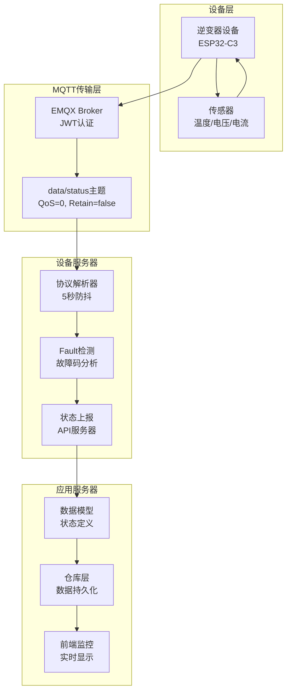
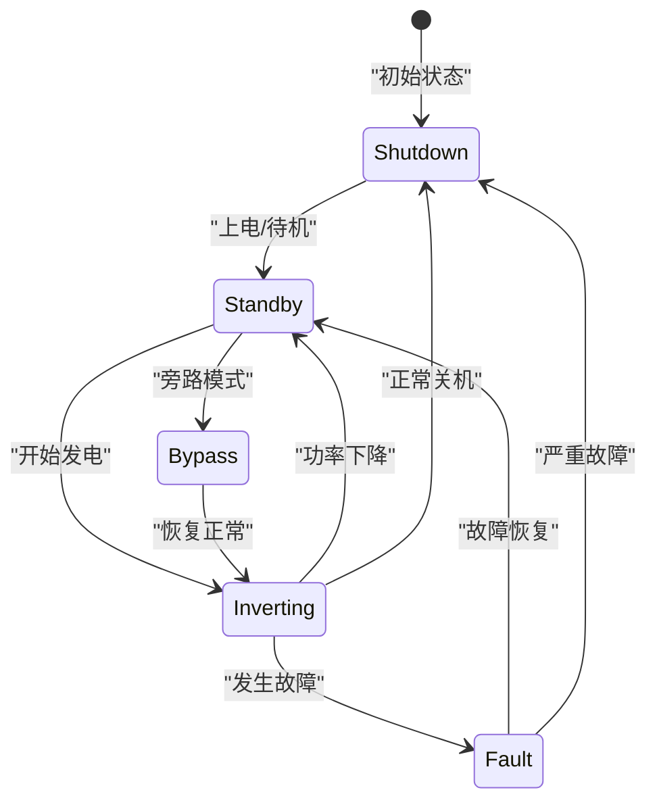
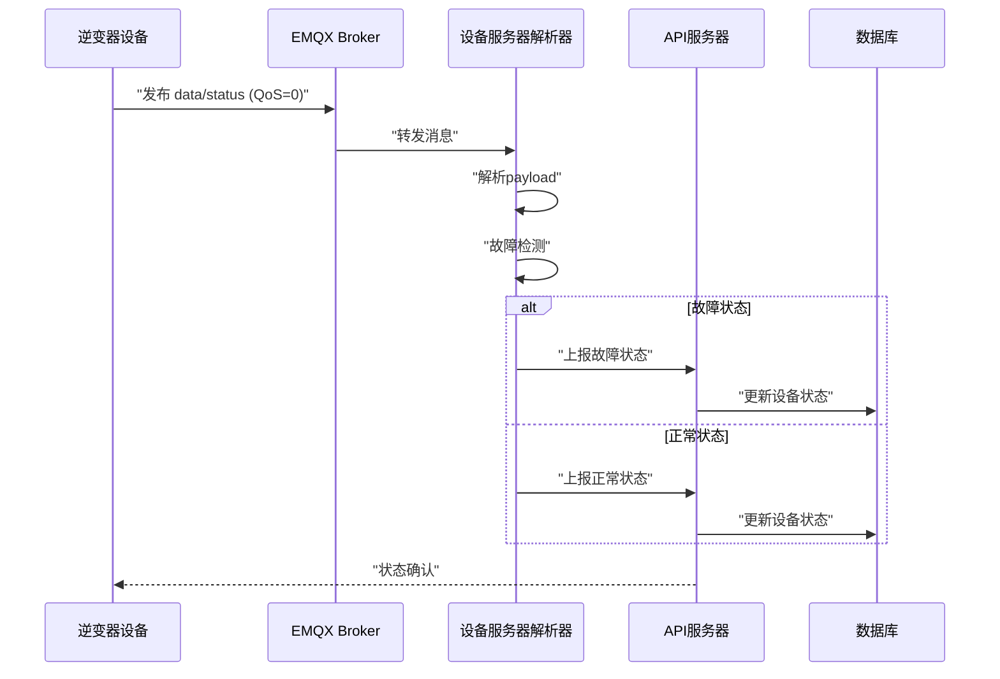
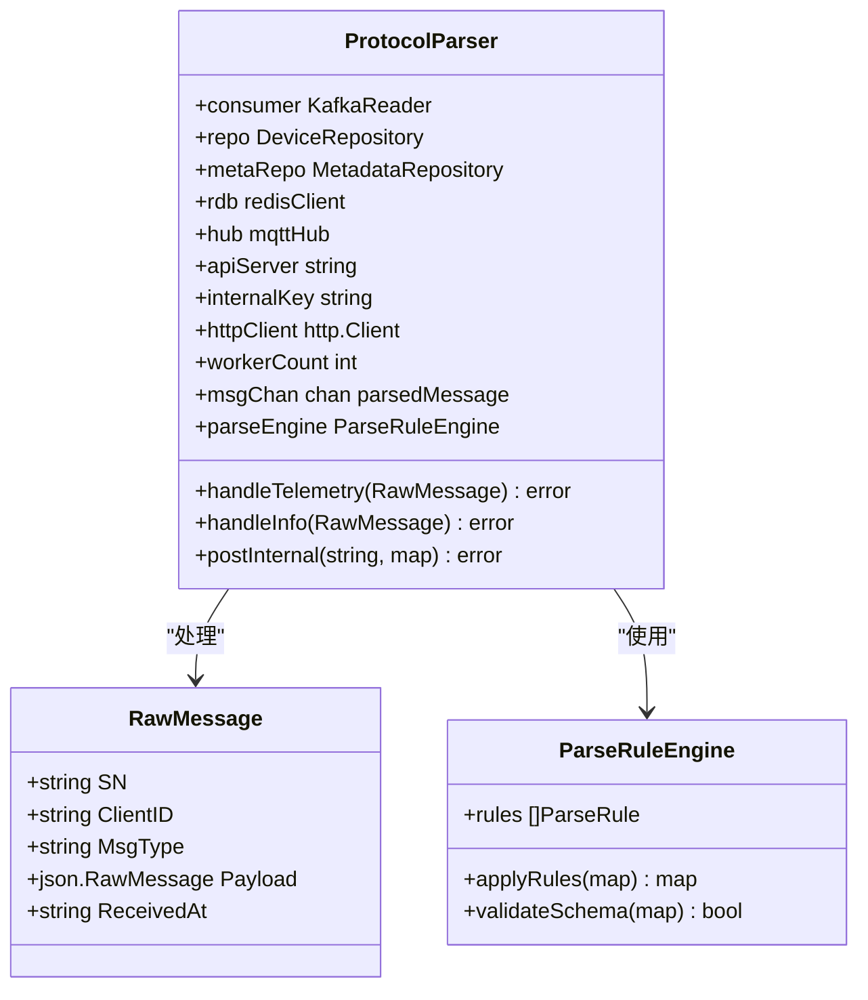
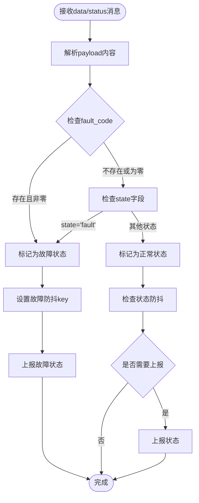
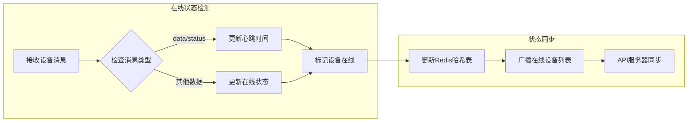
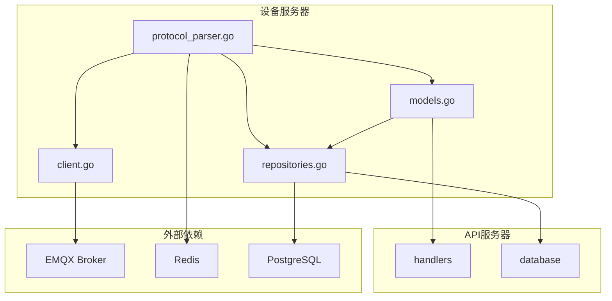
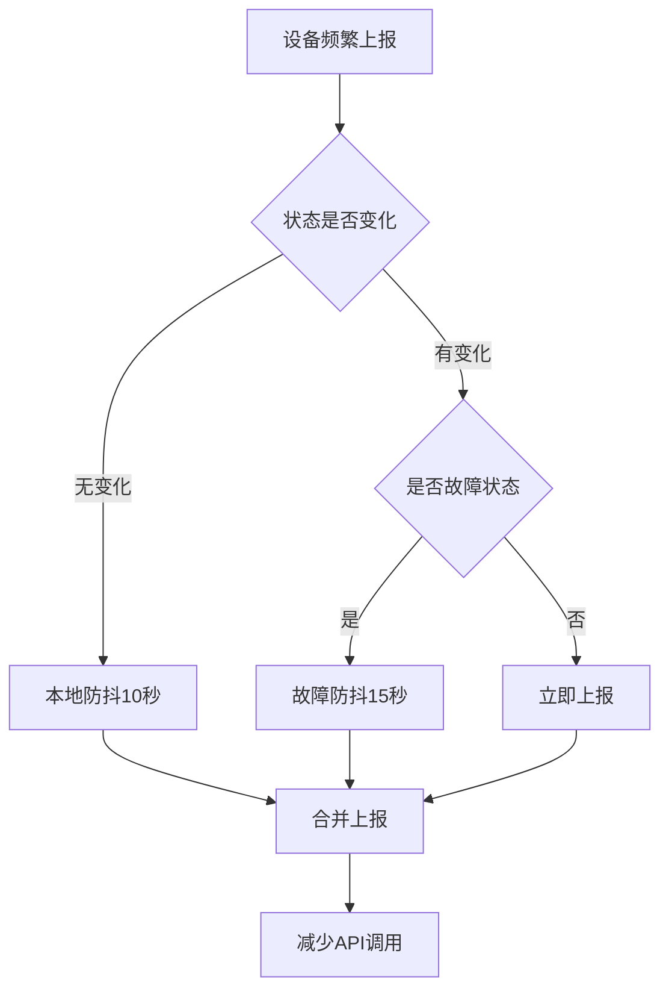
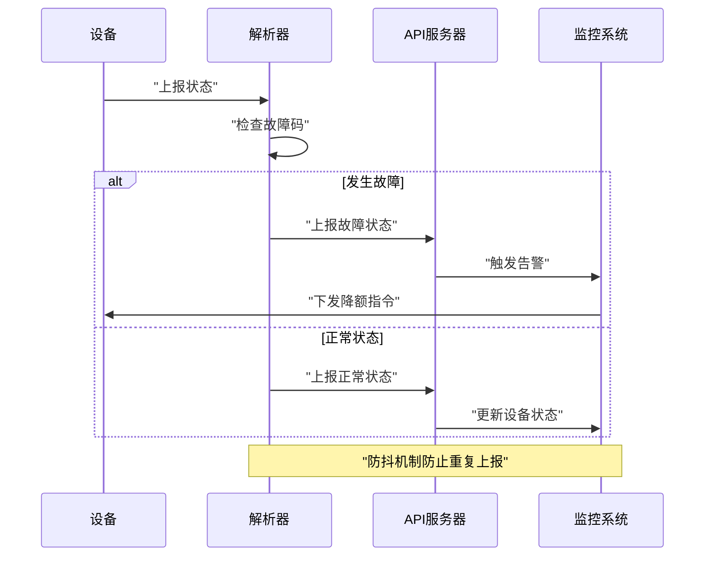

# data/status系统状态主题

<cite>
**本文档引用的文件**
- [protocol_parser.go](file://inv_device_server/internal/service/protocol_parser.go)
- [client.go](file://inv_device_server/internal/mqtt/client.go)
- [models.go](file://inv_api_server/internal/model/models.go)
- [repositories.go](file://inv_api_server/internal/repository/repositories.go)
- [README.md](file://README.md)
- [main.go](file://tools/stress_test/main.go)
</cite>

## 目录
1. [简介](#简介)
2. [项目结构](#项目结构)
3. [核心组件](#核心组件)
4. [架构概览](#架构概览)
5. [详细组件分析](#详细组件分析)
6. [依赖关系分析](#依赖关系分析)
7. [性能考虑](#性能考虑)
8. [故障诊断与处理](#故障诊断与处理)
9. [结论](#结论)
10. [附录](#附录)

## 简介

data/status系统状态主题是光伏逆变器物联网监控系统中的关键通信协议，负责逆变器系统状态的周期性上报和故障检测。该系统采用5秒上报频率，使用MQTT QoS级别0进行非保留消息传输，确保实时性和低延迟的数据传输。

系统状态主题采用统一的JSON payload结构，包含逆变器运行状态、故障码、告警码、温度监测、电压电流参数、效率指标和运行时长等关键运行参数。通过标准化的状态码定义和故障诊断逻辑，实现了完整的系统保护机制和异常处理流程。

## 项目结构

系统围绕data/status主题构建了完整的数据采集、处理和监控体系：



**图表来源**
- [README.md:208-251](file://README.md#L208-L251)
- [protocol_parser.go:1-60](file://inv_device_server/internal/service/protocol_parser.go#L1-L60)

**章节来源**
- [README.md:1-251](file://README.md#L1-L251)

## 核心组件

### 系统状态主题定义

data/status主题遵循以下规范：
- **上报频率**: 5秒固定间隔
- **QoS级别**: 0（最多一次传递）
- **保留策略**: 非保留消息（Retain=false）
- **主题格式**: `cs_inv/{sn}/data/status`

### payload结构定义

系统状态payload包含以下核心字段：

| 字段名称 | 数据类型 | 单位 | 描述 | 必填 |
|---------|---------|------|------|------|
| state | string | - | 运行状态字符串 | 是 |
| fault_code | int | - | 故障码 | 否 |
| alarm_code | int | - | 告警码 | 否 |
| temp_inv | float | ℃ | 逆变器内部温度 | 是 |
| temp_mos | float | ℃ | 散热器温度 | 是 |
| temp_ambient | float | ℃ | 环境温度 | 是 |
| dc_bus_voltage | float | V | 直流母线电压 | 是 |
| efficiency | float | % | 逆变效率 | 是 |
| runtime_hours | float | h | 累计运行时长 | 是 |
| fan_speed | float | % | 风扇转速 | 是 |

### 状态码定义

系统运行状态码定义：



**图表来源**
- [protocol_parser.go:527-609](file://inv_device_server/internal/service/protocol_parser.go#L527-L609)

**章节来源**
- [protocol_parser.go:527-609](file://inv_device_server/internal/service/protocol_parser.go#L527-L609)

## 架构概览

系统采用分布式架构，通过MQTT协议实现实时数据传输：



**图表来源**
- [protocol_parser.go:285-309](file://inv_device_server/internal/service/protocol_parser.go#L285-L309)
- [protocol_parser.go:447-484](file://inv_device_server/internal/service/protocol_parser.go#L447-L484)

## 详细组件分析

### 协议解析器组件

协议解析器负责处理data/status主题的消息：



**图表来源**
- [protocol_parser.go:29-61](file://inv_device_server/internal/service/protocol_parser.go#L29-L61)

### 故障检测机制

故障检测系统具有智能防抖功能：



**图表来源**
- [protocol_parser.go:527-609](file://inv_device_server/internal/service/protocol_parser.go#L527-L609)

**章节来源**
- [protocol_parser.go:527-609](file://inv_device_server/internal/service/protocol_parser.go#L527-L609)

### 在线状态管理

系统通过Redis实现设备在线状态跟踪：



**图表来源**
- [client.go:186-224](file://inv_device_server/internal/mqtt/client.go#L186-L224)

**章节来源**
- [client.go:186-224](file://inv_device_server/internal/mqtt/client.go#L186-L224)

## 依赖关系分析

系统各组件之间的依赖关系如下：



**图表来源**
- [protocol_parser.go:1-45](file://inv_device_server/internal/service/protocol_parser.go#L1-L45)
- [client.go:1-30](file://inv_device_server/internal/mqtt/client.go#L1-L30)

**章节来源**
- [protocol_parser.go:1-45](file://inv_device_server/internal/service/protocol_parser.go#L1-L45)
- [client.go:1-30](file://inv_device_server/internal/mqtt/client.go#L1-L30)

## 性能考虑

### 上报频率优化

系统采用5秒固定上报间隔，在保证实时性的同时平衡网络负载：

- **CPU使用率**: 低频上报减少设备CPU占用
- **网络带宽**: QoS=0避免消息堆积，降低网络压力
- **存储成本**: 非保留消息减少Broker存储开销

### 防抖机制

系统实现多层次防抖机制：



**图表来源**
- [protocol_parser.go:285-309](file://inv_device_server/internal/service/protocol_parser.go#L285-L309)

**章节来源**
- [protocol_parser.go:285-309](file://inv_device_server/internal/service/protocol_parser.go#L285-L309)

## 故障诊断与处理

### 故障码分类

系统根据故障严重程度分为不同级别：

| 故障级别 | 故障码范围 | 处理方式 | 系统响应 |
|---------|-----------|---------|---------|
| 严重故障 | 1001-1999 | 立即停机 | shutdown |
| 一般故障 | 2001-2999 | 降额运行 | standby |
| 轻微故障 | 3001-3999 | 继续运行 | inverting |
| 通信故障 | 4001-4999 | 重连尝试 | bypass |

### 异常处理流程



**图表来源**
- [protocol_parser.go:577-606](file://inv_device_server/internal/service/protocol_parser.go#L577-L606)

**章节来源**
- [protocol_parser.go:577-606](file://inv_device_server/internal/service/protocol_parser.go#L577-L606)

### 系统保护机制

系统具备多重保护机制：

1. **温度保护**: 当temp_inv超过设定阈值时自动降额
2. **电压保护**: dc_bus_voltage异常时立即停机
3. **效率保护**: efficiency异常时降低功率输出
4. **风扇保护**: fan_speed异常时触发报警

## 结论

data/status系统状态主题为光伏逆变器监控系统提供了可靠的实时状态传输机制。通过标准化的payload结构、智能的故障检测算法和高效的防抖机制，系统实现了高可靠性的设备状态监控。

该设计充分考虑了实际应用场景的需求，在保证数据实时性的同时有效控制了系统开销，为大规模设备接入提供了良好的技术基础。

## 附录

### JSON示例

标准系统状态payload示例：

```json
{
  "sn": "H1CNA00135000014",
  "type": "status",
  "payload": {
    "state": "inverting",
    "fault_code": 0,
    "alarm_code": 0,
    "temp_inv": 45.5,
    "temp_mos": 42.3,
    "temp_ambient": 38.7,
    "dc_bus_voltage": 780.2,
    "efficiency": 94.2,
    "runtime_hours": 1245.7,
    "fan_speed": 65.0
  }
}
```

### 状态码对照表

| 状态码 | 状态名称 | 描述 | 系统行为 |
|-------|---------|------|---------|
| inverting | 发电中 | 设备正常发电运行 | 继续运行，记录数据 |
| standby | 待机 | 设备准备就绪但未发电 | 等待条件满足 |
| fault | 故障 | 设备发生故障 | 停止发电，触发保护 |
| shutdown | 关机 | 设备正常关闭 | 停止运行，保存状态 |
| bypass | 旁路 | 设备旁路运行 | 降额运行或停止 |

### 性能基准测试

系统支持大规模设备并发测试：

- **设备数量**: 支持1000+设备同时在线
- **上报间隔**: 5秒固定间隔
- **网络负载**: 低频上报减少带宽占用
- **存储效率**: 非保留消息降低存储成本

**章节来源**
- [main.go:21-26](file://tools/stress_test/main.go#L21-L26)