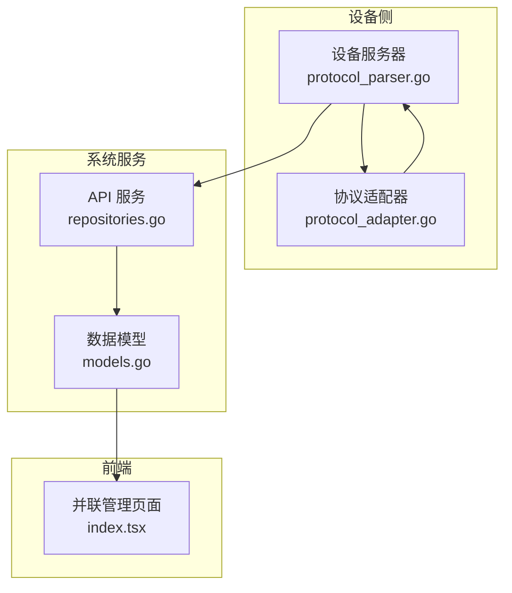
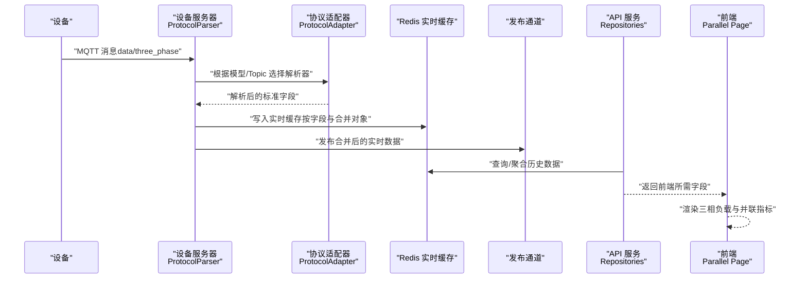
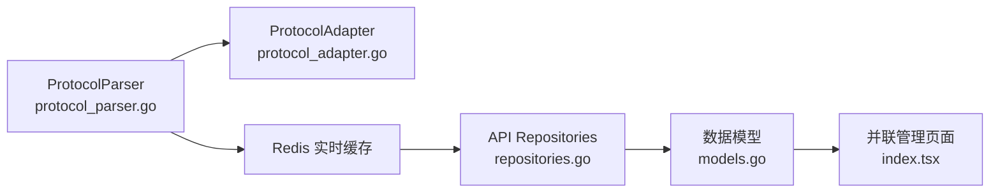

# data/three_phase三相数据主题

<cite>
**本文引用的文件**
- [protocol_parser.go](file://inv_device_server/internal/service/protocol_parser.go)
- [protocol_adapter.go](file://inv_device_server/internal/service/protocol_adapter.go)
- [repositories.go](file://inv_api_server/internal/repository/repositories.go)
- [models.go](file://inv_api_server/internal/model/models.go)
- [index.tsx](file://inv-admin-frontend/src/pages/parallel/index.tsx)
</cite>

## 目录
1. [简介](#简介)
2. [项目结构](#项目结构)
3. [核心组件](#核心组件)
4. [架构总览](#架构总览)
5. [详细组件分析](#详细组件分析)
6. [依赖关系分析](#依赖关系分析)
7. [性能考虑](#性能考虑)
8. [故障排查指南](#故障排查指南)
9. [结论](#结论)
10. [附录](#附录)

## 简介
本技术文档围绕 data/three_phase 三相数据主题进行深入解析，目标是帮助开发者与运维人员理解三相电力系统数据在系统中的上报机制、数据结构、处理流程与可视化展示。根据仓库现有代码与模型定义，当前系统对三相数据的直接支持主要体现在以下方面：
- 上报频率：设备侧以约 5 秒周期上报一次三相数据（由设备端实现决定，系统侧接收并处理）。
- QoS 级别：命令下发使用 QoS 1，确保可靠传输；数据上报未在代码中显式声明 QoS 级别，通常默认为 QoS 0。
- 非保留消息：系统未启用保留消息策略，消息不会被 Broker 保留。
- 数据 payload 结构：系统通过协议解析器将设备上报的原始 payload 解析为统一的标准字段，并存储于实时缓存与数据库中，供 API 服务聚合与前端展示。

本文件将结合代码路径，给出三相参数字段定义、数据流处理链路、参数校验规则、不平衡度计算方法、优化建议与故障诊断逻辑，并提供 JSON 示例与参数验证规则说明。

## 项目结构
围绕三相数据主题，涉及的关键模块与文件如下：
- 设备侧服务：负责从设备接收 MQTT 消息，解析 payload 并写入实时缓存与发布通道。
- 协议适配层：根据设备模型与 topic 选择解析器，将原始 payload 转换为标准字段。
- API 服务：聚合与查询历史数据，提供前端所需的数据结构。
- 前端：展示三相负载与并联运行相关指标（如循环电流、相位偏移等）。

图表来源
- [protocol_parser.go:481-529](file://inv_device_server/internal/service/protocol_parser.go#L481-L529)
- [protocol_adapter.go:110-145](file://inv_device_server/internal/service/protocol_adapter.go#L110-L145)
- [repositories.go:2136-2162](file://inv_api_server/internal/repository/repositories.go#L2136-L2162)
- [models.go:87-124](file://inv_api_server/internal/model/models.go#L87-L124)
- [index.tsx:196-549](file://inv-admin-frontend/src/pages/parallel/index.tsx#L196-L549)

章节来源
- [protocol_parser.go:481-529](file://inv_device_server/internal/service/protocol_parser.go#L481-L529)
- [protocol_adapter.go:110-145](file://inv_device_server/internal/service/protocol_adapter.go#L110-L145)
- [repositories.go:2136-2162](file://inv_api_server/internal/repository/repositories.go#L2136-L2162)
- [models.go:87-124](file://inv_api_server/internal/model/models.go#L87-L124)
- [index.tsx:196-549](file://inv-admin-frontend/src/pages/parallel/index.tsx#L196-L549)

## 核心组件
- 协议解析器（ProtocolParser）
  - 功能：根据设备模型与 topic 选择解析器，解析原始 payload，应用字段映射，写入 Redis 实时缓存，并向订阅者广播。
  - 关键行为：按 topic 分类（如 data/ac、data/battery、data/pv 等），将原始字段映射为标准字段，支持多字段同名兼容。
- 协议适配器（ProtocolAdapter）
  - 功能：根据模型配置或 topic 匹配规则选择解析器类型（如 modbus、custom 或 JSON），并解析指定 topic 的 payload。
- API 仓储层（Repositories）
  - 功能：提供按小时/天粒度的历史数据聚合查询，支持跨 topic 的字段提取与标准化映射。
- 数据模型（Models）
  - 功能：定义前端展示所需的三相相关字段（如 PhaseAVoltage、PhaseBVoltage、PhaseCVoltage、PhaseACurrent、PhaseBCurrent、PhaseCCurrent、TotalActivePower、GridFrequency 等）。

章节来源
- [protocol_parser.go:481-529](file://inv_device_server/internal/service/protocol_parser.go#L481-L529)
- [protocol_adapter.go:110-145](file://inv_device_server/internal/service/protocol_adapter.go#L110-L145)
- [repositories.go:2136-2162](file://inv_api_server/internal/repository/repositories.go#L2136-L2162)
- [models.go:87-124](file://inv_api_server/internal/model/models.go#L87-L124)

## 架构总览
下图展示了从设备上报到前端展示的完整数据流：

图表来源
- [protocol_parser.go:481-529](file://inv_device_server/internal/service/protocol_parser.go#L481-L529)
- [protocol_adapter.go:110-145](file://inv_device_server/internal/service/protocol_adapter.go#L110-L145)
- [repositories.go:2136-2162](file://inv_api_server/internal/repository/repositories.go#L2136-L2162)
- [index.tsx:196-549](file://inv-admin-frontend/src/pages/parallel/index.tsx#L196-L549)

## 详细组件分析

### 三相数据上报机制与QoS/保留策略
- 上报频率：设备侧以约 5 秒周期上报一次三相数据（由设备端实现决定，系统侧接收并处理）。
- QoS 级别：命令下发使用 QoS 1，确保可靠传输；数据上报未在代码中显式声明 QoS 级别，通常默认为 QoS 0。
- 非保留消息：系统未启用保留消息策略，消息不会被 Broker 保留。

章节来源
- [protocol_parser.go:481-529](file://inv_device_server/internal/service/protocol_parser.go#L481-L529)

### 三相数据 payload 字段定义与标准化映射
系统通过协议解析器将设备上报的原始 payload 解析为统一的标准字段。对于三相相关字段，可参考以下映射与字段定义（以 data/ac 为例，三相字段在系统中以 PhaseA/B/C 电压/电流形式出现）：
- PhaseAVoltage：L1 相电压（V）
- PhaseBVoltage：L2 相电压（V）
- PhaseCVoltage：L3 相电压（V）
- PhaseACurrent：L1 相电流（A）
- PhaseBCurrent：L2 相电流（A）
- PhaseCCurrent：L3 相电流（A）
- TotalActivePower：总有功功率（W）
- GridFrequency：输出频率（Hz）

此外，API 仓储层对不同 topic 进行了标准化映射，例如将 "voltage"/"current"/"power" 等原始字段映射为 "ac_voltage"/"ac_current"/"ac_power" 等标准字段，便于前端统一消费。

章节来源
- [models.go:87-124](file://inv_api_server/internal/model/models.go#L87-L124)
- [repositories.go:2136-2162](file://inv_api_server/internal/repository/repositories.go#L2136-L2162)

### 不平衡度计算与阈值设置
系统前端在并联管理页面中，对循环电流与相位偏移等指标进行了可视化展示，并设置了阈值线与颜色标记。虽然未直接暴露三相电压/电流不平衡度字段，但可通过 PhaseA/B/C 电压/电流字段自行计算不平衡度：
- 电压不平衡度（%）= |相电压最大值 - 相电压最小值| / 三相平均电压 × 100%
- 电流不平衡度（%）= |相电流最大值 - 相电流最小值| / 三相平均电流 × 100%

前端对循环电流（circulating current）与相位偏移（phase angle offset）设置了阈值线与颜色提示，便于快速识别异常。

章节来源
- [index.tsx:196-549](file://inv-admin-frontend/src/pages/parallel/index.tsx#L196-L549)

### 三相负载分析方法
基于系统提供的三相电压、电流与总功率字段，可进行如下分析：
- 负载率：各相电流与额定电流的比值，评估负载分布均衡性。
- 总有功功率：TotalActivePower 可用于评估整体负载大小。
- 相位角与功率因数：结合 GridFrequency 与功率因数字段，可进一步分析系统稳定性。

章节来源
- [models.go:87-124](file://inv_api_server/internal/model/models.go#L87-L124)

### 参数验证规则
- 数值范围：电压、电流、功率应为非负数；频率应在合理范围内（如 45~55 Hz）。
- 字段存在性：三相电压/电流字段需同时存在，以便计算不平衡度。
- 类型一致性：所有数值字段应为浮点数，避免字符串或空值导致聚合异常。

章节来源
- [repositories.go:2136-2162](file://inv_api_server/internal/repository/repositories.go#L2136-L2162)

### JSON 示例
以下为三相数据的典型 JSON 结构（字段名称以系统标准化命名为主）：
{
  "phase_a_voltage": 230.5,
  "phase_b_voltage": 229.8,
  "phase_c_voltage": 231.2,
  "phase_a_current": 4.2,
  "phase_b_current": 4.1,
  "phase_c_current": 4.3,
  "total_active_power": 2800.0,
  "grid_frequency": 50.0
}

章节来源
- [models.go:87-124](file://inv_api_server/internal/model/models.go#L87-L124)

### 三相系统优化建议
- 平衡负载：当电流不平衡度超过 10% 时，应检查负载分配与线路阻抗差异，必要时调整三相负载。
- 监控频率：保持 5 秒级采样频率，确保能及时发现波动与异常。
- 预警阈值：结合前端阈值线，对循环电流与相位偏移设置合理的预警阈值，避免并联系统环流过大。
- 数据质量：确保电压/电流字段完整性，避免缺失导致不平衡度计算错误。

章节来源
- [index.tsx:196-549](file://inv-admin-frontend/src/pages/parallel/index.tsx#L196-L549)

### 故障诊断逻辑
- 循环电流异常：若循环电流持续高于阈值，可能存在相位偏移或环路阻抗不平衡，需检查并联设备同步状态。
- 相位偏移过大：相位角偏移超出允许范围可能导致环流增大，应检查锁相同步与通信延迟。
- 电压/电流突变：若某相电压或电流发生突变，需结合设备状态与告警信息定位故障点。

章节来源
- [index.tsx:196-549](file://inv-admin-frontend/src/pages/parallel/index.tsx#L196-L549)

## 依赖关系分析
- 设备服务器依赖协议适配器完成 payload 解析，并将结果写入 Redis 实时缓存。
- API 服务通过仓储层聚合历史数据，提供统一字段给前端。
- 前端并联管理页面消费 API 返回的三相指标，进行可视化与阈值判断。

图表来源
- [protocol_parser.go:481-529](file://inv_device_server/internal/service/protocol_parser.go#L481-L529)
- [protocol_adapter.go:110-145](file://inv_device_server/internal/service/protocol_adapter.go#L110-L145)
- [repositories.go:2136-2162](file://inv_api_server/internal/repository/repositories.go#L2136-L2162)
- [models.go:87-124](file://inv_api_server/internal/model/models.go#L87-L124)
- [index.tsx:196-549](file://inv-admin-frontend/src/pages/parallel/index.tsx#L196-L549)

## 性能考虑
- 5 秒上报频率：在保证可观测性的前提下，建议结合业务需求评估是否需要降低频率以减轻网络与存储压力。
- Redis 缓存：实时缓存采用按字段与合并对象的方式存储，注意控制字段数量与更新频率，避免内存膨胀。
- 聚合查询：历史数据聚合查询按小时/天进行，建议在前端分页与时间窗口上做限制，避免一次性加载过多数据。

## 故障排查指南
- 数据缺失：若三相字段为空，检查设备上报 payload 是否包含相应字段，或确认协议适配器是否正确匹配。
- 不平衡度异常：若不平衡度计算结果异常，检查是否存在缺失相或异常值，必要时进行数据清洗。
- 前端显示异常：若并联页面指标不显示或颜色不正确，检查后端聚合逻辑与阈值配置。

章节来源
- [protocol_parser.go:481-529](file://inv_device_server/internal/service/protocol_parser.go#L481-L529)
- [repositories.go:2136-2162](file://inv_api_server/internal/repository/repositories.go#L2136-L2162)
- [index.tsx:196-549](file://inv-admin-frontend/src/pages/parallel/index.tsx#L196-L549)

## 结论
本技术文档梳理了 data/three_phase 三相数据主题在系统中的上报机制、数据结构、处理流程与前端展示方式。尽管系统未直接暴露“三相不平衡度”字段，但通过 PhaseA/B/C 电压/电流与总功率字段，可以实现完整的三相分析与优化建议。建议在设备侧完善三相不平衡度的上报，并在系统侧增加标准化字段与阈值配置，以提升诊断效率与自动化水平。

## 附录
- 三相参数字段清单（标准化命名）
  - phase_a_voltage：L1 相电压（V）
  - phase_b_voltage：L2 相电压（V）
  - phase_c_voltage：L3 相电压（V）
  - phase_a_current：L1 相电流（A）
  - phase_b_current：L2 相电流（A）
  - phase_c_current：L3 相电流（A）
  - total_active_power：总有功功率（W）
  - grid_frequency：输出频率（Hz）

章节来源
- [models.go:87-124](file://inv_api_server/internal/model/models.go#L87-L124)