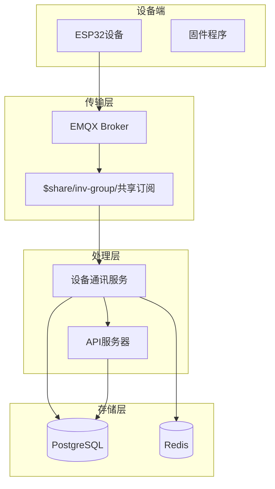
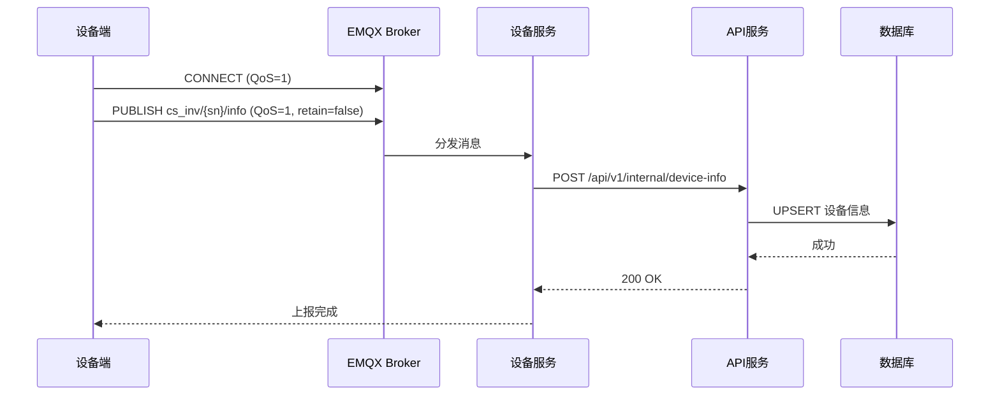
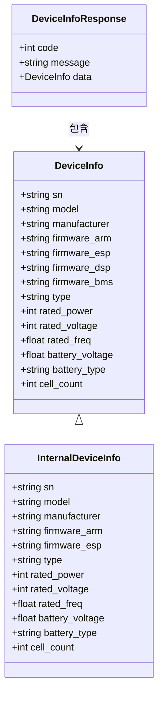
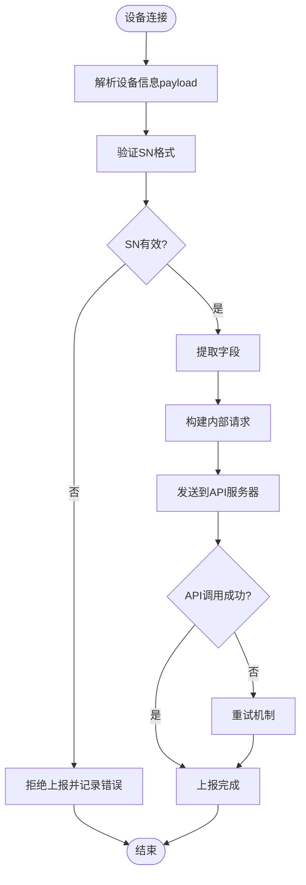
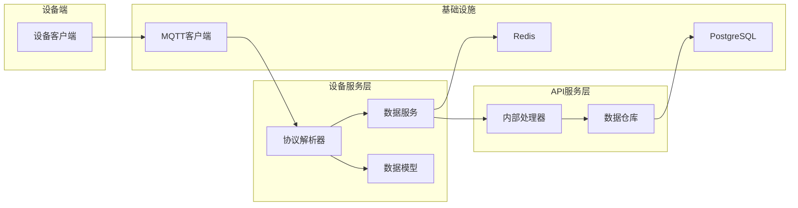
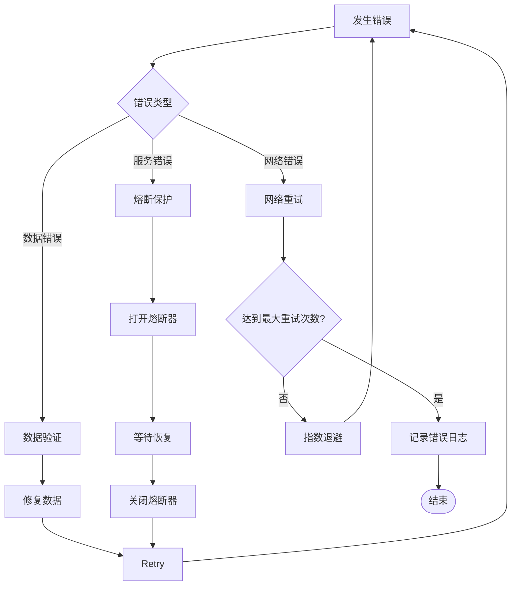

# info设备信息主题

<cite>
**本文档引用的文件**
- [README.md](file://README.md)
- [device.go](file://inv_device_server/internal/model/device.go)
- [protocol_parser.go](file://inv_device_server/internal/service/protocol_parser.go)
- [data_service.go](file://inv_device_server/internal/service/data_service.go)
- [internal_handler.go](file://inv_api_server/internal/handler/internal_handler.go)
- [repositories.go](file://inv_api_server/internal/repository/repositories.go)
- [client.go](file://inv_device_server/internal/mqtt/client.go)
- [sn.go](file://inv_api_server/pkg/sn/sn.go)
</cite>

## 目录
1. [简介](#简介)
2. [项目结构](#项目结构)
3. [核心组件](#核心组件)
4. [架构概览](#架构概览)
5. [详细组件分析](#详细组件分析)
6. [依赖关系分析](#依赖关系分析)
7. [性能考虑](#性能考虑)
8. [故障排除指南](#故障排除指南)
9. [结论](#结论)

## 简介

本文档详细介绍了设备信息上报机制，特别是cs_inv/{sn}/info主题的实现。该系统采用MQTT协议进行设备信息的实时上报，支持连接时一次性上报、QoS级别1、非保留消息的配置。设备信息payload包含了详细的硬件规格和固件版本信息，为设备管理和监控提供了完整的基础数据。

## 项目结构

系统采用分布式架构，主要包含以下关键组件：

**图表来源**
- [README.md:206-250](file://README.md#L206-L250)

**章节来源**
- [README.md:1-367](file://README.md#L1-L367)

## 核心组件

### 设备信息数据模型

设备信息主题(cs_inv/{sn}/info)使用统一的数据结构，包含以下核心字段：

| 字段名 | 类型 | 必填 | 描述 | 示例值 |
|--------|------|------|------|--------|
| sn | string | 是 | 设备序列号 | "H1CNA00135000014" |
| model | string | 是 | 设备型号 | "CS-I10-6k2" |
| manufacturer | string | 是 | 制造商代码 | "H1" |
| firmware_arm | string | 否 | ARM固件版本 | "1.2.3" |
| firmware_esp | string | 否 | ESP固件版本 | "2.1.0" |
| firmware_dsp | string | 否 | DSP固件版本 | "1.0.1" |
| firmware_bms | string | 否 | BMS固件版本 | "3.2.1" |
| type | string | 否 | 设备类型 | "inverter" |
| rated_power | integer | 否 | 额定功率(W) | 6000 |
| rated_voltage | integer | 否 | 额定电压(V) | 48 |
| rated_freq | float | 否 | 额定频率(Hz) | 50.0 |
| battery_voltage | float | 否 | 电池电压(V) | 54.0 |
| battery_type | string | 否 | 电池类型 | "lithium" |
| cell_count | integer | 否 | 电池节数 | 12 |

### 设备信息上报机制

设备信息采用以下上报策略：

1. **连接时一次性上报**：设备首次建立MQTT连接时发送完整设备信息
2. **QoS级别1**：确保消息可靠传输但不重复
3. **非保留消息**：避免Broker存储历史信息，保持实时性

**章节来源**
- [device.go:8-22](file://inv_device_server/internal/model/device.go#L8-L22)

## 架构概览

设备信息上报的整体流程如下：

**图表来源**
- [protocol_parser.go:334-334](file://inv_device_server/internal/service/protocol_parser.go#L334-L334)
- [data_service.go:253-274](file://inv_device_server/internal/service/data_service.go#L253-L274)

## 详细组件分析

### 设备信息数据模型类图

**图表来源**
- [device.go:8-22](file://inv_device_server/internal/model/device.go#L8-L22)
- [internal_handler.go:29-37](file://inv_api_server/internal/handler/internal_handler.go#L29-L37)

### 设备信息上报处理流程

**图表来源**
- [protocol_parser.go:492-529](file://inv_device_server/internal/service/protocol_parser.go#L492-L529)
- [data_service.go:244-274](file://inv_device_server/internal/service/data_service.go#L244-L274)

### 设备信息变更触发条件

设备信息变更的触发条件包括：

1. **首次连接时**：设备首次建立MQTT连接时上报完整信息
2. **固件版本变更**：ARM或ESP固件版本发生变化时
3. **硬件配置变更**：额定功率、电压等硬件参数变化
4. **设备重启**：设备重启后重新上报完整信息

### 数据完整性保证措施

系统采用多重机制确保数据完整性：

1. **SN序列号验证**：16位标准格式，包含制造商、国家、客户等级、生产年月、序列号和校验位
2. **字段类型验证**：严格的数据类型检查和范围验证
3. **必填字段检查**：核心字段的强制验证
4. **重复数据处理**：通过UPSER策略避免重复数据
5. **错误重试机制**：网络异常时的自动重试

**章节来源**
- [sn.go:184-263](file://inv_api_server/pkg/sn/sn.go#L184-L263)

## 依赖关系分析

### 组件间依赖关系

**图表来源**
- [client.go:1-330](file://inv_device_server/internal/mqtt/client.go#L1-L330)
- [protocol_parser.go:1-529](file://inv_device_server/internal/service/protocol_parser.go#L1-L529)

### 关键依赖关系

1. **MQTT客户端依赖**：设备服务依赖MQTT客户端进行消息收发
2. **协议解析依赖**：协议解析器依赖元数据仓库进行字段映射
3. **API调用依赖**：数据服务依赖HTTP客户端调用API服务器
4. **存储依赖**：API处理器依赖数据库进行数据持久化

**章节来源**
- [client.go:146-330](file://inv_device_server/internal/mqtt/client.go#L146-L330)
- [protocol_parser.go:490-529](file://inv_device_server/internal/service/protocol_parser.go#L490-L529)

## 性能考虑

### QoS级别选择

系统采用QoS级别1的原因：
- **可靠性保证**：确保消息至少被送达一次
- **性能平衡**：相比QoS2减少握手开销
- **无重复处理**：通过UPSER策略避免重复数据

### 缓存策略

1. **Redis缓存**：设备在线状态和临时数据缓存
2. **批量处理**：高并发场景下的消息批处理
3. **连接池管理**：优化MQTT连接资源使用

### 错误处理机制

## 故障排除指南

### 常见问题及解决方案

1. **设备信息不显示**
   - 检查MQTT连接状态
   - 验证SN格式是否正确
   - 确认API服务器正常运行

2. **固件版本信息缺失**
   - 确认设备固件支持版本上报
   - 检查网络连接稳定性
   - 验证API接口权限

3. **数据重复问题**
   - 检查UPSER策略执行情况
   - 验证设备SN唯一性
   - 确认数据库索引配置

### 调试建议

1. **启用详细日志**：增加设备服务和API服务的日志级别
2. **监控指标**：关注MQTT连接数、消息处理速率
3. **数据库查询**：定期检查设备信息表的完整性

**章节来源**
- [internal_handler.go:292-292](file://inv_api_server/internal/handler/internal_handler.go#L292-L292)
- [repositories.go:2007-2009](file://inv_api_server/internal/repository/repositories.go#L2007-L2009)

## 结论

设备信息上报机制通过cs_inv/{sn}/info主题实现了完整的设备信息管理。系统采用MQTT协议的QoS级别1确保消息可靠传输，结合SN序列号验证和字段类型检查保证了数据质量。通过分布式架构设计，系统能够支持大规模设备的实时监控和管理需求。

该机制为后续的设备管理、OTA升级、故障诊断等功能奠定了坚实的数据基础，是整个光伏逆变器监控系统的重要组成部分。