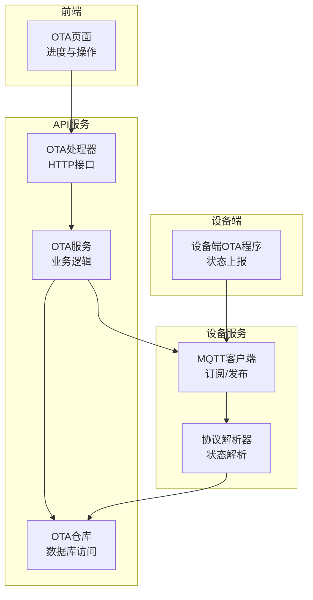
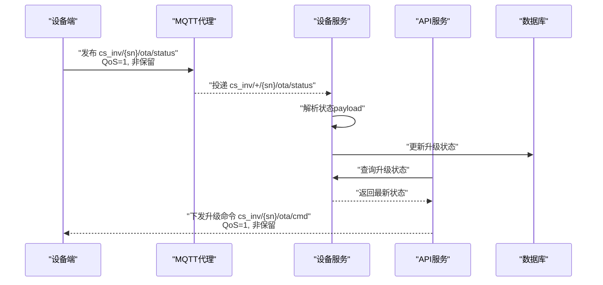
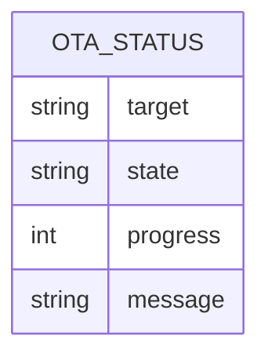
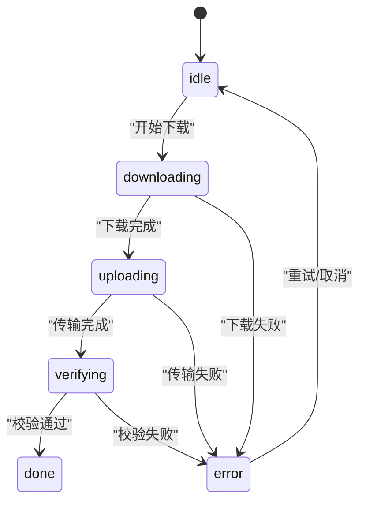
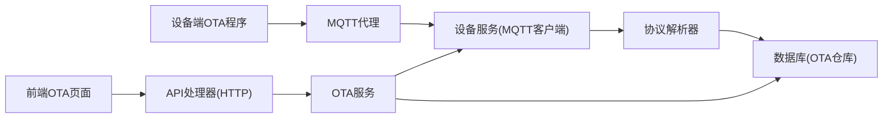

# ota/status OTA升级状态主题

<cite>
**本文档引用的文件**
- [README.md](file://README.md)
- [设备端OTA程序开发指南.md](file://docs/设备端OTA程序开发指南.md)
- [inv_api_server/internal/service/ota_service.go](file://inv_api_server/internal/service/ota_service.go)
- [inv_api_server/internal/handler/ota_handler.go](file://inv_api_server/internal/handler/ota_handler.go)
- [inv_api_server/internal/repository/ota_repository.go](file://inv_api_server/internal/repository/ota_repository.go)
- [inv_device_server/internal/mqtt/client.go](file://inv_device_server/internal/mqtt/client.go)
- [inv_device_server/internal/service/protocol_parser.go](file://inv_device_server/internal/service/protocol_parser.go)
- [inv-admin-frontend/src/pages/ota/index.tsx](file://inv-admin-frontend/src/pages/ota/index.tsx)
</cite>

## 目录
1. [简介](#简介)
2. [项目结构](#项目结构)
3. [核心组件](#核心组件)
4. [架构总览](#架构总览)
5. [详细组件分析](#详细组件分析)
6. [依赖关系分析](#依赖关系分析)
7. [性能考虑](#性能考虑)
8. [故障排查指南](#故障排查指南)
9. [结论](#结论)
10. [附录](#附录)

## 简介
本文件围绕 OTA 升级状态主题（cs_inv/{sn}/ota/status）进行技术文档整理，覆盖以下内容：
- OTA 升级状态上报机制与按需上报策略
- QoS 级别与非保留消息配置
- OTA 状态 payload 结构与字段定义
- OTA 升级状态机转换图、升级流程与异常处理
- 升级进度监控、失败诊断与回滚策略
- 安全验证与完整性检查方法
- 完整 JSON 示例与状态转换规则

## 项目结构
OTA 升级状态主题涉及前后端与设备端的协同：
- API 层：负责固件管理、升级任务下发、状态更新与历史查询
- 设备服务层：负责 MQTT 订阅与转发、状态解析与持久化
- 设备端：负责 OTA 命令解析、升级执行与状态上报
- 前端：负责升级任务展示、进度可视化与操作入口

**图表来源**
- [inv_api_server/internal/handler/ota_handler.go:188-214](file://inv_api_server/internal/handler/ota_handler.go#L188-L214)
- [inv_api_server/internal/service/ota_service.go:118-181](file://inv_api_server/internal/service/ota_service.go#L118-L181)
- [inv_api_server/internal/repository/ota_repository.go:138-154](file://inv_api_server/internal/repository/ota_repository.go#L138-L154)
- [inv_device_server/internal/mqtt/client.go:157-177](file://inv_device_server/internal/mqtt/client.go#L157-L177)
- [设备端OTA程序开发指南.md:132-144](file://docs/设备端OTA程序开发指南.md#L132-L144)

**章节来源**
- [README.md:253-300](file://README.md#L253-L300)
- [inv_api_server/internal/handler/ota_handler.go:188-214](file://inv_api_server/internal/handler/ota_handler.go#L188-L214)
- [inv_api_server/internal/service/ota_service.go:118-181](file://inv_api_server/internal/service/ota_service.go#L118-L181)
- [inv_api_server/internal/repository/ota_repository.go:138-154](file://inv_api_server/internal/repository/ota_repository.go#L138-L154)
- [inv_device_server/internal/mqtt/client.go:157-177](file://inv_device_server/internal/mqtt/client.go#L157-L177)
- [设备端OTA程序开发指南.md:132-144](file://docs/设备端OTA程序开发指南.md#L132-L144)

## 核心组件
- OTA 处理器（HTTP 接口）：提供固件上传、升级任务下发、状态查询与历史查询等接口
- OTA 服务（业务逻辑）：封装升级任务的并发控制、命令下发、状态更新与重试逻辑
- OTA 仓库（数据库访问）：维护固件元数据、设备升级记录与状态变更
- MQTT 客户端（设备服务）：订阅 cs_inv/+/ota/status 等主题，接收设备状态上报
- 协议解析器（设备服务）：解析状态 payload，写入实时缓存并广播
- 设备端 OTA 程序：解析升级命令、执行升级并上报状态

**章节来源**
- [inv_api_server/internal/handler/ota_handler.go:188-214](file://inv_api_server/internal/handler/ota_handler.go#L188-L214)
- [inv_api_server/internal/service/ota_service.go:118-181](file://inv_api_server/internal/service/ota_service.go#L118-L181)
- [inv_api_server/internal/repository/ota_repository.go:138-154](file://inv_api_server/internal/repository/ota_repository.go#L138-L154)
- [inv_device_server/internal/mqtt/client.go:157-177](file://inv_device_server/internal/mqtt/client.go#L157-L177)
- [设备端OTA程序开发指南.md:132-144](file://docs/设备端OTA程序开发指南.md#L132-L144)

## 架构总览
OTA 升级状态上报采用“设备上行、服务下行”的双向通道：
- 设备端通过 cs_inv/{sn}/ota/status 主线上报升级状态
- 服务端通过 cs_inv/{sn}/ota/cmd 主题下发升级命令
- 设备端状态上报遵循 QoS=1、非保留消息，确保可靠传递与资源占用平衡

**图表来源**
- [inv_device_server/internal/mqtt/client.go:157-177](file://inv_device_server/internal/mqtt/client.go#L157-L177)
- [inv_device_server/internal/mqtt/client.go:270-300](file://inv_device_server/internal/mqtt/client.go#L270-L300)
- [inv_api_server/internal/service/ota_service.go:183-234](file://inv_api_server/internal/service/ota_service.go#L183-L234)
- [inv_api_server/internal/repository/ota_repository.go:138-154](file://inv_api_server/internal/repository/ota_repository.go#L138-L154)

**章节来源**
- [README.md:253-300](file://README.md#L253-L300)
- [inv_device_server/internal/mqtt/client.go:157-177](file://inv_device_server/internal/mqtt/client.go#L157-L177)
- [inv_api_server/internal/service/ota_service.go:183-234](file://inv_api_server/internal/service/ota_service.go#L183-L234)
- [inv_api_server/internal/repository/ota_repository.go:138-154](file://inv_api_server/internal/repository/ota_repository.go#L138-L154)

## 详细组件分析

### OTA 状态主题与上报机制
- 主题格式：cs_inv/{sn}/ota/status
- QoS 级别：1（确保至少一次到达）
- 消息类型：非保留（避免代理长期占用资源）
- 上报频率：按需上报，设备在状态变化或进度更新时主动上报

**章节来源**
- [README.md:281-287](file://README.md#L281-L287)
- [inv_device_server/internal/mqtt/client.go:157-177](file://inv_device_server/internal/mqtt/client.go#L157-L177)
- [设备端OTA程序开发指南.md:132-144](file://docs/设备端OTA程序开发指南.md#L132-L144)

### OTA 状态 payload 结构
设备端上报的 OTA 状态 payload 包含以下关键字段：
- target：升级目标芯片，取值为 esp 或 arm
- state：升级状态，取值为 idle、downloading、uploading、verifying、done、error
- progress：升级进度百分比（0-100）
- message：状态消息（字符串）

**图表来源**
- [设备端OTA程序开发指南.md:132-144](file://docs/设备端OTA程序开发指南.md#L132-L144)

**章节来源**
- [设备端OTA程序开发指南.md:132-144](file://docs/设备端OTA程序开发指南.md#L132-L144)

### OTA 升级状态机与流程
设备端 OTA 状态机包含如下状态转换：
- idle → downloading（开始下载固件）
- downloading → uploading（下载完成，开始向目标芯片传输）
- uploading → verifying（传输完成，等待校验）
- verifying → done（校验通过，升级完成）
- 任一阶段 → error（发生异常，终止升级）

**图表来源**
- [设备端OTA程序开发指南.md:513-521](file://docs/设备端OTA程序开发指南.md#L513-L521)
- [设备端OTA程序开发指南.md:232-281](file://docs/设备端OTA程序开发指南.md#L232-L281)

**章节来源**
- [设备端OTA程序开发指南.md:513-521](file://docs/设备端OTA程序开发指南.md#L513-L521)
- [设备端OTA程序开发指南.md:232-281](file://docs/设备端OTA程序开发指南.md#L232-L281)

### 升级命令下发与执行
- 命令主题：cs_inv/{sn}/ota/cmd
- 命令体字段：command、target、url、version、file_md5、file_sha256、file_size、upgrade_id
- 下发方式：QoS=1 的非保留消息，由 API 服务通过设备服务转发

**章节来源**
- [README.md:288-300](file://README.md#L288-L300)
- [inv_api_server/internal/service/ota_service.go:183-234](file://inv_api_server/internal/service/ota_service.go#L183-L234)
- [inv_device_server/internal/mqtt/client.go:270-300](file://inv_device_server/internal/mqtt/client.go#L270-L300)

### 状态上报解析与持久化
- 设备服务订阅 cs_inv/+/ota/status，解析 payload 并更新数据库
- 数据库存储字段：status、progress、error_message、started_at、completed_at 等
- 前端通过 API 查询最新状态并展示进度条

**章节来源**
- [inv_device_server/internal/mqtt/client.go:209-222](file://inv_device_server/internal/mqtt/client.go#L209-L222)
- [inv_api_server/internal/repository/ota_repository.go:138-154](file://inv_api_server/internal/repository/ota_repository.go#L138-L154)
- [inv-admin-frontend/src/pages/ota/index.tsx:674-705](file://inv-admin-frontend/src/pages/ota/index.tsx#L674-L705)

### 异常处理与重试策略
- 失败重试：根据固件 ID 与设备 SN 列表批量重置为 pending，并重新下发命令
- 取消升级：将状态置为 cancelled 并记录完成时间
- 状态幂等：数据库层通过 UPSERT 保证状态更新的幂等性

**章节来源**
- [inv_api_server/internal/service/ota_service.go:246-272](file://inv_api_server/internal/service/ota_service.go#L246-L272)
- [inv_api_server/internal/repository/ota_repository.go:260-283](file://inv_api_server/internal/repository/ota_repository.go#L260-L283)
- [inv_api_server/internal/repository/ota_repository.go:81-108](file://inv_api_server/internal/repository/ota_repository.go#L81-L108)

### 安全验证与完整性检查
- 文件完整性：设备端在升级完成后计算 MD5/SHA256 并与下发的摘要对比
- 传输安全：ESP32 通过 HTTPS 下载固件，超时与错误处理完善
- 命令签名：设备端解析命令时严格校验字段存在性与格式

**章节来源**
- [设备端OTA程序开发指南.md:166-203](file://docs/设备端OTA程序开发指南.md#L166-L203)
- [设备端OTA程序开发指南.md:616-658](file://docs/设备端OTA程序开发指南.md#L616-L658)

### 升级进度监控与可视化
- 前端仪表盘按固件维度聚合统计 total_devices、success_count、failed_count、pending_count
- 进度条基于 done/total 计算百分比，支持重试与取消操作

**章节来源**
- [inv-admin-frontend/src/pages/ota/index.tsx:674-705](file://inv-admin-frontend/src/pages/ota/index.tsx#L674-L705)
- [inv_api_server/internal/repository/ota_repository.go:156-194](file://inv_api_server/internal/repository/ota_repository.go#L156-L194)

### 回滚策略
- 当前代码未提供 OTA 回滚接口；若需回滚，建议通过下发更低版本固件或在设备端实现引导扇区切换逻辑

**章节来源**
- [inv_api_server/internal/service/ota_service.go:118-181](file://inv_api_server/internal/service/ota_service.go#L118-L181)
- [inv_api_server/internal/repository/ota_repository.go:156-194](file://inv_api_server/internal/repository/ota_repository.go#L156-L194)

## 依赖关系分析
OTA 升级状态主题的依赖关系如下：

**图表来源**
- [inv_device_server/internal/mqtt/client.go:157-177](file://inv_device_server/internal/mqtt/client.go#L157-L177)
- [inv_device_server/internal/service/protocol_parser.go:481-529](file://inv_device_server/internal/service/protocol_parser.go#L481-L529)
- [inv_api_server/internal/handler/ota_handler.go:188-214](file://inv_api_server/internal/handler/ota_handler.go#L188-L214)
- [inv_api_server/internal/service/ota_service.go:118-181](file://inv_api_server/internal/service/ota_service.go#L118-L181)
- [inv_api_server/internal/repository/ota_repository.go:138-154](file://inv_api_server/internal/repository/ota_repository.go#L138-L154)

**章节来源**
- [inv_device_server/internal/mqtt/client.go:157-177](file://inv_device_server/internal/mqtt/client.go#L157-L177)
- [inv_device_server/internal/service/protocol_parser.go:481-529](file://inv_device_server/internal/service/protocol_parser.go#L481-L529)
- [inv_api_server/internal/handler/ota_handler.go:188-214](file://inv_api_server/internal/handler/ota_handler.go#L188-L214)
- [inv_api_server/internal/service/ota_service.go:118-181](file://inv_api_server/internal/service/ota_service.go#L118-L181)
- [inv_api_server/internal/repository/ota_repository.go:138-154](file://inv_api_server/internal/repository/ota_repository.go#L138-L154)

## 性能考虑
- 并发控制：API 服务对设备升级任务采用信号量限制并发，避免资源争用
- 缓存与广播：协议解析器将状态写入 Redis 实时缓存并广播，降低数据库压力
- QoS 与消息大小：QoS=1 已满足可靠性需求，payload 控制在合理范围以减少网络开销

**章节来源**
- [inv_api_server/internal/service/ota_service.go:118-181](file://inv_api_server/internal/service/ota_service.go#L118-L181)
- [inv_device_server/internal/service/protocol_parser.go:784-833](file://inv_device_server/internal/service/protocol_parser.go#L784-L833)

## 故障排查指南
- 状态未更新：检查设备是否正确订阅 cs_inv/+/ota/status，确认 QoS=1 且非保留消息
- 命令未下发：确认 API 服务已创建升级任务并调用设备服务发送命令
- 校验失败：核对 file_md5 与 file_sha256 是否与下发一致，检查网络与存储
- 进度停滞：查看设备日志与网络状态，确认是否存在超时或中断

**章节来源**
- [inv_device_server/internal/mqtt/client.go:157-177](file://inv_device_server/internal/mqtt/client.go#L157-L177)
- [inv_api_server/internal/service/ota_service.go:183-234](file://inv_api_server/internal/service/ota_service.go#L183-L234)
- [设备端OTA程序开发指南.md:616-658](file://docs/设备端OTA程序开发指南.md#L616-L658)

## 结论
OTA 升级状态主题通过明确的主题规范、QoS 配置与状态机设计，实现了可靠的设备侧升级反馈与管理。结合完整性校验与可视化监控，能够有效支撑大规模设备的远程升级与运维。

## 附录

### OTA 状态 payload 字段定义
- target：升级目标芯片（esp 或 arm）
- state：升级状态（idle、downloading、uploading、verifying、done、error）
- progress：升级进度（0-100）
- message：状态消息（字符串）

**章节来源**
- [设备端OTA程序开发指南.md:132-144](file://docs/设备端OTA程序开发指南.md#L132-L144)

### 状态转换规则
- idle → downloading：开始下载固件
- downloading → uploading：下载完成，开始传输
- uploading → verifying：传输完成，等待校验
- verifying → done：校验通过，升级完成
- 任一阶段 → error：发生异常，终止升级

**章节来源**
- [设备端OTA程序开发指南.md:513-521](file://docs/设备端OTA程序开发指南.md#L513-L521)
- [设备端OTA程序开发指南.md:232-281](file://docs/设备端OTA程序开发指南.md#L232-L281)

### JSON 示例
- 状态上报示例（字段与含义见上表）
- 升级命令下发示例（字段与含义见上表）

**章节来源**
- [README.md:288-300](file://README.md#L288-L300)
- [设备端OTA程序开发指南.md:132-144](file://docs/设备端OTA程序开发指南.md#L132-L144)