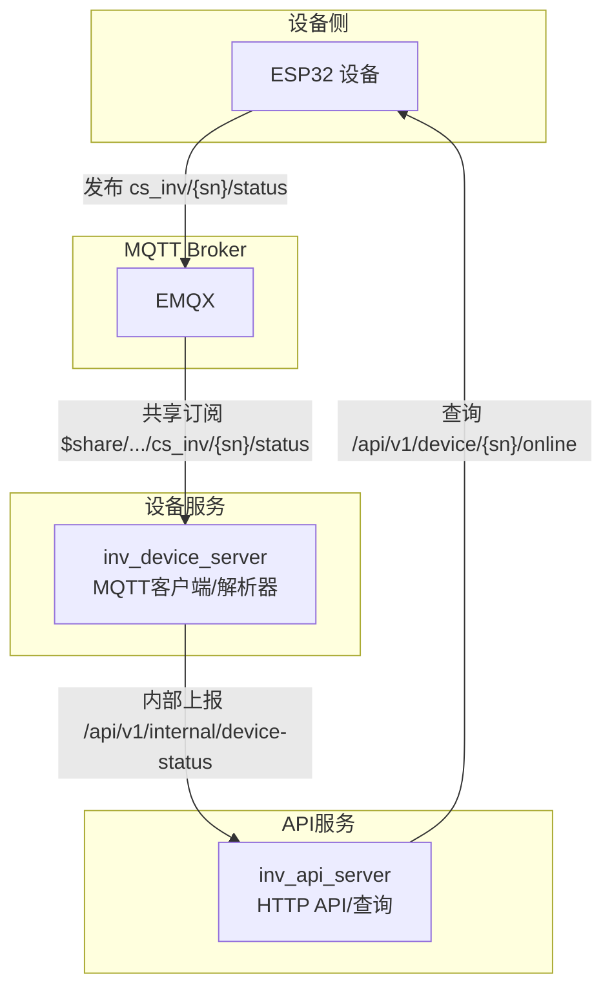
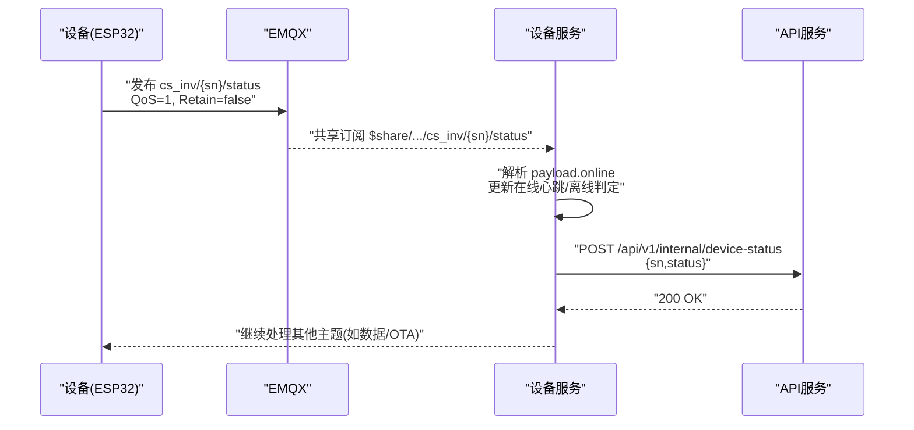
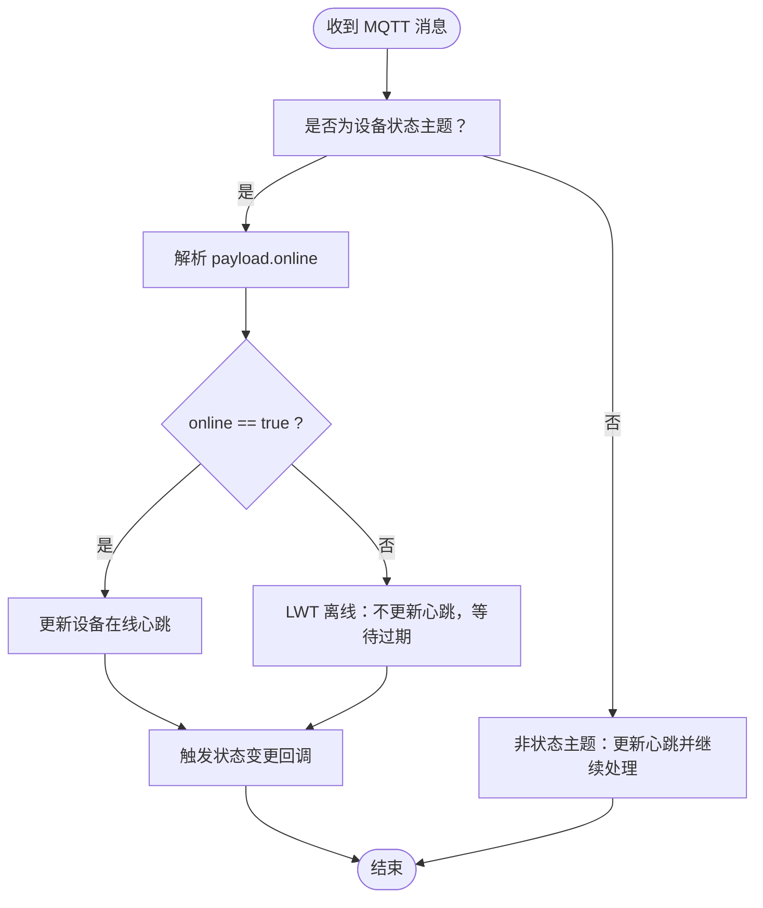
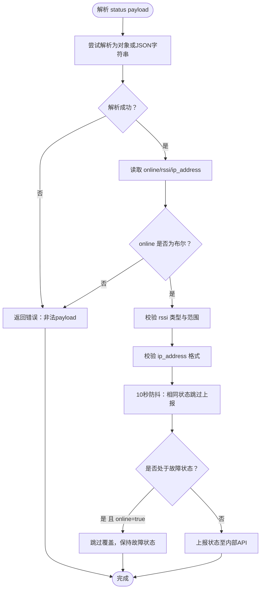
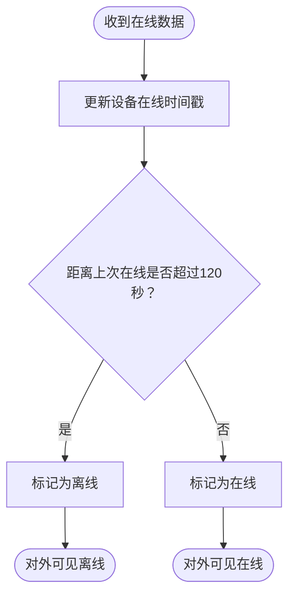
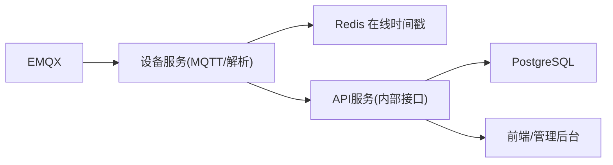

# status在线状态主题

<cite>
**本文引用的文件**
- [inv_device_server/internal/mqtt/client.go](file://inv_device_server/internal/mqtt/client.go)
- [inv_device_server/internal/service/protocol_parser.go](file://inv_device_server/internal/service/protocol_parser.go)
- [inv_device_server/internal/model/device.go](file://inv_device_server/internal/model/device.go)
- [inv_api_server/internal/model/models.go](file://inv_api_server/internal/model/models.go)
- [inv_api_server/internal/repository/repositories.go](file://inv_api_server/internal/repository/repositories.go)
- [README.md](file://README.md)
</cite>

## 目录
1. [简介](#简介)
2. [项目结构](#项目结构)
3. [核心组件](#核心组件)
4. [架构总览](#架构总览)
5. [详细组件分析](#详细组件分析)
6. [依赖关系分析](#依赖关系分析)
7. [性能考量](#性能考量)
8. [故障排查指南](#故障排查指南)
9. [结论](#结论)
10. [附录](#附录)

## 简介
本技术文档围绕status在线状态主题进行深入解析，覆盖设备在线状态上报机制、QoS与保留策略、payload结构与字段约束、LWT（遗嘱）离线检测、在线判断逻辑、心跳与连接监控等关键内容。文档同时给出实际JSON示例与字段验证规则，帮助开发者与运维人员快速理解并正确实现设备在线状态管理。

## 项目结构
本项目采用“设备直连EMQX -> 设备服务解析 -> API服务存储/查询”的分层架构。其中，设备通过MQTT向EMQX发布状态主题，设备服务负责解析、去抖与内部状态同步；API服务负责对外提供查询与统计能力。

**图表来源**
- [README.md:206-224](file://README.md#L206-L224)
- [inv_device_server/internal/mqtt/client.go:389-400](file://inv_device_server/internal/mqtt/client.go#L389-L400)

**章节来源**
- [README.md:33-366](file://README.md#L33-L366)

## 核心组件
- MQTT客户端与状态主题匹配
  - 设备服务使用共享订阅接收设备状态主题，并区分LWT离线与设备主动上报在线。
  - 在线超时阈值为120秒，超过则视为离线。
- 协议解析器与状态上报
  - 解析设备status payload，提取online布尔值；对重复状态进行10秒防抖；故障状态下不覆盖为在线。
- API模型与状态字段
  - API模型中包含设备在线状态字段与IP地址字段，用于对外展示与统计。

**章节来源**
- [inv_device_server/internal/mqtt/client.go:70](file://inv_device_server/internal/mqtt/client.go#L70)
- [inv_device_server/internal/mqtt/client.go:188-202](file://inv_device_server/internal/mqtt/client.go#L188-L202)
- [inv_device_server/internal/service/protocol_parser.go:267-309](file://inv_device_server/internal/service/protocol_parser.go#L267-L309)
- [inv_api_server/internal/model/models.go:69-124](file://inv_api_server/internal/model/models.go#L69-L124)

## 架构总览
设备在线状态上报的关键路径如下：
- 设备以QoS 1、保留消息false的方式发布状态主题；
- 设备服务解析状态payload，更新在线心跳或触发离线判定；
- 设备服务内部上报状态至API服务，API服务更新设备状态并持久化；
- 外部可通过HTTP接口查询设备在线状态。

**图表来源**
- [inv_device_server/internal/mqtt/client.go:188-202](file://inv_device_server/internal/mqtt/client.go#L188-L202)
- [inv_device_server/internal/service/protocol_parser.go:267-309](file://inv_device_server/internal/service/protocol_parser.go#L267-L309)

## 详细组件分析

### 在线状态主题与LWT机制
- 主题匹配
  - 设备状态主题：cs_inv/{sn}/status（含共享订阅前缀$share/.../cs_inv/{sn}/status）。
  - 设备服务通过专用函数识别该主题，区分LWT离线与主动在线上报。
- LWT离线检测
  - 当设备异常断开且Broker发布LWT消息时，payload中online为false；此时不更新心跳，等待Redis时间戳自然过期。
  - 在线超时阈值为120秒，超过则认为离线。
- QoS与保留策略
  - 设备上报状态使用QoS 1，确保至少一次送达；保留消息设置为false，避免历史遗留状态干扰当前在线判断。

**图表来源**
- [inv_device_server/internal/mqtt/client.go:188-202](file://inv_device_server/internal/mqtt/client.go#L188-L202)
- [inv_device_server/internal/mqtt/client.go:70](file://inv_device_server/internal/mqtt/client.go#L70)

**章节来源**
- [inv_device_server/internal/mqtt/client.go:389-400](file://inv_device_server/internal/mqtt/client.go#L389-L400)
- [inv_device_server/internal/mqtt/client.go:188-202](file://inv_device_server/internal/mqtt/client.go#L188-L202)
- [inv_device_server/internal/mqtt/client.go:70](file://inv_device_server/internal/mqtt/client.go#L70)

### 在线状态payload结构与字段验证
- payload必须为JSON对象或可被解包的JSON字符串；若为字符串，需能再次解析为对象。
- 字段要求
  - online: 布尔类型，true表示在线，false表示离线。
  - rssi: 可选，整数类型，单位dBm，典型取值范围为[-100, -30]（数值越接近0越强）。
  - ip_address: 可选，字符串类型，IPv4/IPv6地址格式。
- 防抖与覆盖规则
  - 10秒内相同状态不重复上报，避免抖动。
  - 若设备处于故障状态（status=2），不覆盖为在线（status=1）。

**图表来源**
- [inv_device_server/internal/service/protocol_parser.go:247-265](file://inv_device_server/internal/service/protocol_parser.go#L247-L265)
- [inv_device_server/internal/service/protocol_parser.go:267-309](file://inv_device_server/internal/service/protocol_parser.go#L267-L309)

**章节来源**
- [inv_device_server/internal/service/protocol_parser.go:247-265](file://inv_device_server/internal/service/protocol_parser.go#L247-L265)
- [inv_device_server/internal/service/protocol_parser.go:267-309](file://inv_device_server/internal/service/protocol_parser.go#L267-L309)

### 在线状态判断逻辑与心跳检测
- 心跳更新
  - 主动上报online=true时，设备服务更新Redis中的在线时间戳。
- 超时判定
  - 在线超时阈值为120秒；若当前时间与最后在线时间差大于阈值，则视为离线。
- 连接状态监控
  - 设备服务记录MQTT统计信息（接收数量、最后数据时间等），便于监控连接健康度。

**图表来源**
- [inv_device_server/internal/mqtt/client.go:79-104](file://inv_device_server/internal/mqtt/client.go#L79-L104)

**章节来源**
- [inv_device_server/internal/mqtt/client.go:79-104](file://inv_device_server/internal/mqtt/client.go#L79-L104)

### 网络连接状态监控方法
- MQTT连接监控
  - 设备服务捕获连接错误与服务器断开事件，记录原因码或原因字符串，便于定位网络问题。
- Redis在线键管理
  - 使用哈希表维护设备在线时间戳；通过超时阈值判断在线状态。
- API侧离线批量修复
  - 定期扫描长时间无心跳的设备，将其状态更新为离线，保证数据一致性。

**章节来源**
- [inv_device_server/internal/mqtt/client.go:226-235](file://inv_device_server/internal/mqtt/client.go#L226-L235)
- [inv_device_server/internal/mqtt/client.go:79-104](file://inv_device_server/internal/mqtt/client.go#L79-L104)
- [inv_api_server/internal/repository/repositories.go:1682-1694](file://inv_api_server/internal/repository/repositories.go#L1682-L1694)

### 实际JSON示例与字段验证规则
- 在线示例
  - {
    "online": true,
    "rssi": -65,
    "ip_address": "192.168.1.100"
  }
- 离线示例
  - {
    "online": false
  }
- 字段验证规则
  - online: 必填，布尔类型。
  - rssi: 可选，整数类型，建议范围[-100, -30]。
  - ip_address: 可选，字符串，符合IPv4/IPv6格式。

**章节来源**
- [inv_device_server/internal/service/protocol_parser.go:247-265](file://inv_device_server/internal/service/protocol_parser.go#L247-L265)
- [inv_device_server/internal/service/protocol_parser.go:267-309](file://inv_device_server/internal/service/protocol_parser.go#L267-L309)

## 依赖关系分析
- 设备服务依赖Redis维护在线状态，依赖EMQX共享订阅接收状态主题。
- 设备服务通过内部HTTP接口向API服务上报状态，API服务负责持久化与对外查询。
- API服务模型包含在线状态与IP地址字段，供前端与管理后台展示。

**图表来源**
- [README.md:206-224](file://README.md#L206-L224)
- [inv_device_server/internal/mqtt/client.go:79-104](file://inv_device_server/internal/mqtt/client.go#L79-L104)

**章节来源**
- [README.md:206-224](file://README.md#L206-L224)
- [inv_api_server/internal/model/models.go:69-124](file://inv_api_server/internal/model/models.go#L69-L124)

## 性能考量
- 防抖与去抖策略
  - 10秒内相同状态不重复上报，降低网络与后端压力。
- 在线超时阈值
  - 120秒超时兼顾实时性与稳定性，避免瞬时网络波动导致误判。
- 批量离线修复
  - API侧定期扫描离线设备，减少脏数据影响。

## 故障排查指南
- 常见问题
  - payload格式错误：确保为JSON对象或可被解包的JSON字符串。
  - online字段缺失或类型错误：必须为布尔类型。
  - 状态抖动频繁：检查设备上报间隔与防抖逻辑是否生效。
  - LWT未触发或误判：检查设备异常断开场景与Broker配置。
- 排查步骤
  - 查看设备服务日志中的MQTT错误与断开事件。
  - 检查Redis中设备在线时间戳是否更新。
  - 对比API侧设备状态与预期是否一致，必要时触发批量离线修复。

**章节来源**
- [inv_device_server/internal/mqtt/client.go:226-235](file://inv_device_server/internal/mqtt/client.go#L226-L235)
- [inv_api_server/internal/repository/repositories.go:1682-1694](file://inv_api_server/internal/repository/repositories.go#L1682-L1694)

## 结论
通过QoS 1与保留消息false的合理配置、严格的payload结构与字段验证、以及基于Redis的心跳与超时判定机制，系统实现了稳定可靠的设备在线状态管理。LWT离线检测与120秒超时阈值有效平衡了实时性与鲁棒性；10秒防抖进一步降低了抖动带来的噪声。配合API侧的状态同步与批量修复，整体方案具备良好的可运维性与扩展性。

## 附录
- 主题命名规范
  - 设备状态主题：cs_inv/{sn}/status（共享订阅前缀为$share/.../cs_inv/{sn}/status）。
- 字段参考
  - online: 布尔，true在线/false离线。
  - rssi: 整数，dBm。
  - ip_address: 字符串，IPv4/IPv6。