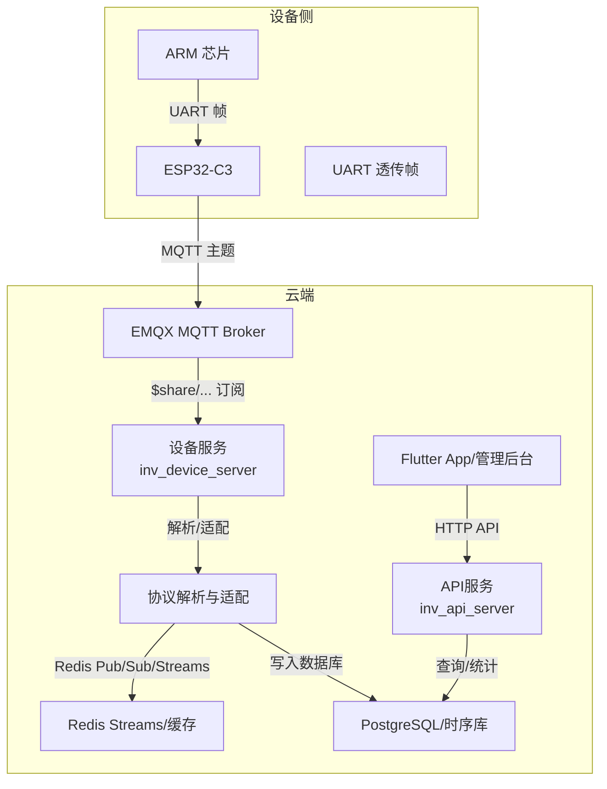
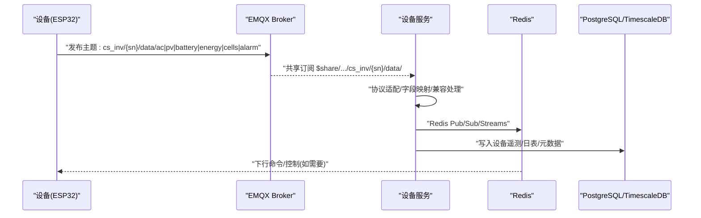
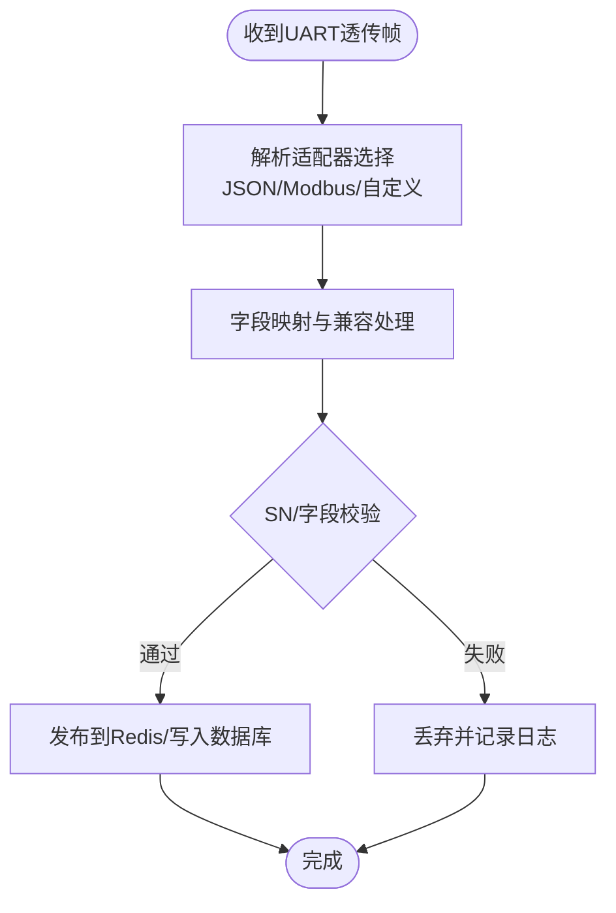
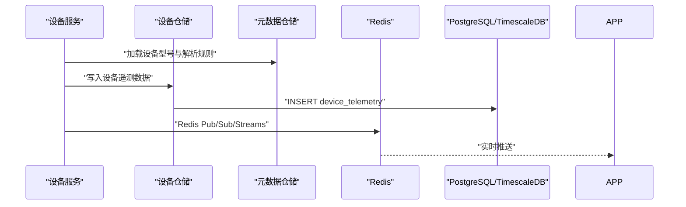
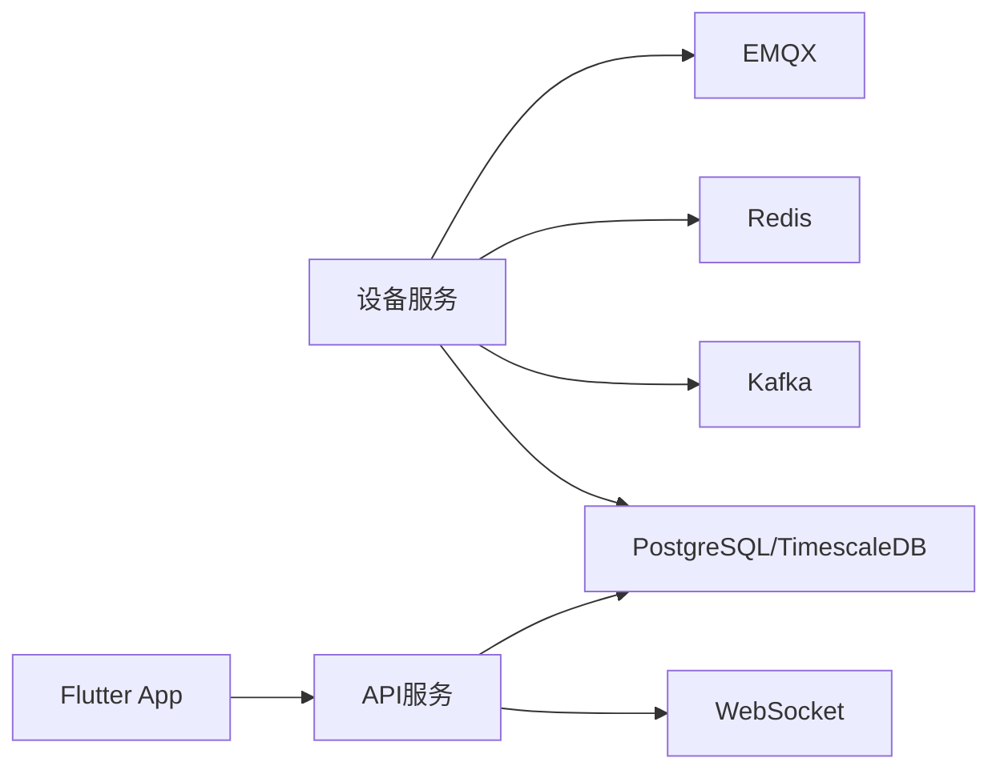

# 上行数据格式

<cite>
**本文引用的文件**
- [README.md](file://README.md)
- [MQTT接口文档.md](file://docs/MQTT接口文档.md)
- [ARM_ESP32_UART_Protocol.md](file://docs/ARM_ESP32_UART_Protocol.md)
- [inv_device_server/internal/service/protocol_adapter.go](file://inv_device_server/internal/service/protocol_adapter.go)
- [inv_device_server/internal/service/protocol_parser.go](file://inv_device_server/internal/service/protocol_parser.go)
- [inv_device_server/internal/model/device.go](file://inv_device_server/internal/model/device.go)
- [inv_api_server/internal/model/models.go](file://inv_api_server/internal/model/models.go)
- [inv_api_server/internal/repository/repositories.go](file://inv_api_server/internal/repository/repositories.go)
- [inv_api_server/internal/handler/internal_handler.go](file://inv_api_server/internal/handler/internal_handler.go)
- [inv_device_server/internal/mqtt/client.go](file://inv_device_server/internal/mqtt/client.go)
- [tools/stress_test/main.go](file://tools/stress_test/main.go)
</cite>

## 目录
1. [简介](#简介)
2. [项目结构](#项目结构)
3. [核心组件](#核心组件)
4. [架构总览](#架构总览)
5. [详细组件分析](#详细组件分析)
6. [依赖关系分析](#依赖关系分析)
7. [性能考虑](#性能考虑)
8. [故障排查指南](#故障排查指南)
9. [结论](#结论)
10. [附录](#附录)

## 简介
本文件面向设备侧与云端对接工程师，系统性说明设备向云端上报的各类数据主题格式与转换流程，覆盖以下主题：
- 在线状态（status）
- 设备信息（info）
- 交流输出（ac）
- 电池（battery）
- 光伏（pv）
- 系统状态（system）
- 能量统计（energy）
- 电芯（cells）
- 并机（parallel）
- 三相（three_phase）
- 控制（control）
- 告警（alarm）

同时明确各主题的JSON结构、字段定义、数据类型、取值范围、上报频率（5秒、30秒、60秒）、时间戳处理机制，并给出数据验证规则、异常处理与数据完整性保障措施；最后说明从ARM到ESP32的UART透传帧格式以及ESP32到云端的MQTT发布格式转换过程。

## 项目结构
该系统采用“设备直连MQTT + 设备服务解析 + API服务存储/查询”的分层架构。设备侧通过ESP32-C3以MQTT直连Broker，设备服务负责解析与转发，API服务负责历史/统计查询与管理后台交互。

**图示来源**
- [README.md:7-30](file://README.md#L7-L30)
- [README.md:206-225](file://README.md#L206-L225)

**章节来源**
- [README.md:7-30](file://README.md#L7-L30)
- [README.md:206-225](file://README.md#L206-L225)

## 核心组件
- 设备服务（inv_device_server）
  - 负责EMQX共享订阅、设备数据解析（AC/Battery/PV/Status/Energy/Cells/Alarm等）、兼容字段映射、Redis发布与消息缓冲、OTA命令/状态转发。
- API服务（inv_api_server）
  - 提供REST API、历史/统计查询、告警管理、WebSocket推送、OTA状态回传。
- 文档与协议
  - MQTT主题与数据格式、ARM-ESP32 UART协议、系统参数规范等文档。

**章节来源**
- [README.md:344-354](file://README.md#L344-L354)
- [docs/MQTT接口文档.md](file://docs/MQTT接口文档.md)
- [docs/ARM_ESP32_UART_Protocol.md](file://docs/ARM_ESP32_UART_Protocol.md)

## 架构总览
设备通过ESP32-C3以MQTT直连EMQX，设备服务订阅共享主题进行解析与转发，最终写入数据库并提供HTTP查询能力。

**图示来源**
- [README.md:208-214](file://README.md#L208-L214)
- [README.md:344-354](file://README.md#L344-L354)

## 详细组件分析

### 数据主题与字段定义
以下主题均来自设备侧MQTT发布或内部处理后的统一格式，字段命名与类型以仓库模型为准。

- 主题：data/status（在线状态）
  - 字段
    - sn: 字符串，设备SN
    - online: 布尔，是否在线
    - last_seen: 时间戳（秒或毫秒，见“时间戳处理”）
  - 类型与取值
    - sn: 字符串，长度与校验规则见SN校验章节
    - online: true/false
    - last_seen: 整数或浮点数，表示Unix时间
  - 上报频率：5秒（心跳）
  - 示例路径：[inv_device_server/internal/model/device.go:118-126](file://inv_device_server/internal/model/device.go#L118-L126)

- 主题：data/info（设备信息）
  - 字段
    - sn: 字符串
    - model: 字符串，型号
    - manufacturer: 字符串，制造商
    - firmware_arm/esp/dsp/bms: 字符串，版本号
    - rated_power/rated_voltage/rated_freq: 数值，额定参数
    - battery_voltage/type: 数值/字符串，电池参数
    - cell_count: 整数，电芯数量
  - 类型与取值
    - 数值字段为浮点或整数
    - 字符串字段为ASCII/可打印字符
  - 上报频率：设备初始化/变更时
  - 示例路径：[inv_api_server/internal/model/models.go:43-66](file://inv_api_server/internal/model/models.go#L43-L66)

- 主题：data/ac（交流输出）
  - 字段
    - voltage: 数值，相电压/V
    - current: 数值，电流/A
    - power: 数值，总有功功率/W
    - frequency: 数值，频率/Hz
    - three_phase: 可选数组，三相数据（见“三相数据”）
  - 类型与取值
    - 数值字段为正数或零
    - three_phase为长度为3的数组，元素为对象，含相电压/电流/功率等
  - 上报频率：5秒/30秒/60秒（根据设备能力）
  - 示例路径：[inv_device_server/internal/model/device.go:81-93](file://inv_device_server/internal/model/device.go#L81-L93)

- 主题：data/battery（电池）
  - 字段
    - voltage/current: 数值，总电压/V，总电流/A
    - soc: 数值，荷电状态/%
    - charge/discharge: 数值，充放电安时
    - temps/voltages: 数组，温度/单体电压列表
  - 类型与取值
    - soc为0-100的百分比
    - voltages/temps长度等于cell_count
  - 上报频率：5秒/30秒/60秒
  - 示例路径：[inv_device_server/internal/model/device.go:95-105](file://inv_device_server/internal/model/device.go#L95-L105)

- 主题：data/pv（光伏）
  - 字段
    - pv_power/pv_power_total: 数值，瞬时/总功率
    - daily_pv/total_pv: 数值，日/累计发电量
    - voltages/currents: 数值数组，组串电压/电流
  - 类型与取值
    - 数值字段为非负
    - voltages/ currents长度等于组串数
  - 上报频率：5秒/30秒/60秒
  - 示例路径：[inv_device_server/internal/model/device.go:81-93](file://inv_device_server/internal/model/device.go#L81-L93)

- 主题：data/system（系统状态）
  - 字段
    - state: 字符串，运行状态枚举
    - fault_code: 整数，故障码
    - temp_inv: 数值，逆变器温度
    - esp32_timestamp: 整数，ESP32本地时间戳（秒）
  - 类型与取值
    - state为预定义状态字符串
    - fault_code为非负整数
    - temp_inv为摄氏度数值
    - esp32_timestamp为Unix秒
  - 上报频率：5秒/30秒/60秒
  - 示例路径：[inv_api_server/internal/model/models.go:68-128](file://inv_api_server/internal/model/models.go#L68-L128)

- 主题：data/energy（能量统计）
  - 字段
    - daily_pv/daily_charge/daily_discharge/daily_load: 数值，日度统计
    - total_pv/total_charge/total_discharge/total_load: 数值，累计统计
    - runtime_hours: 数值，运行小时
  - 类型与取值
    - 数值字段为非负
  - 上报频率：30秒/60秒
  - 示例路径：[inv_device_server/internal/model/device.go:81-93](file://inv_device_server/internal/model/device.go#L81-L93)

- 主题：data/cells（电芯详情）
  - 字段
    - cell_count: 整数，电芯总数
    - voltages: 数值数组，单体电压
    - temps: 数值数组，温度
    - charge_ah_total/discharge_ah_total: 数值，累计充放电安时
  - 类型与取值
    - voltages/temps长度为cell_count
  - 上报频率：30秒/60秒
  - 示例路径：[inv_device_server/internal/model/device.go:95-105](file://inv_device_server/internal/model/device.go#L95-L105)

- 主题：data/parallel（并机信息）
  - 字段
    - load_percent: 数值，负载率%
    - phase_angle_offset: 数值，相位角偏移
    - circulating_current: 数值，环流
    - sync_status: 字符串，同步状态
  - 类型与取值
    - load_percent为0-100
    - phase_angle_offset为小数
    - circulating_current为绝对值
  - 上报频率：30秒/60秒
  - 示例路径：[inv_device_server/internal/model/device.go:50-54](file://inv_device_server/internal/model/device.go#L50-L54)

- 主题：data/three_phase（三相数据）
  - 字段
    - phasors: 数组，每相对象含电压/电流/功率
    - frequency: 数值，频率
  - 类型与取值
    - phasors长度为3
  - 上报频率：5秒/30秒/60秒
  - 示例路径：[inv_device_server/internal/model/device.go:81-93](file://inv_device_server/internal/model/device.go#L81-L93)

- 主题：data/control（控制状态）
  - 字段
    - task_id: 字符串，任务ID
    - cmd: 字符串，命令标识
    - success: 布尔，是否成功
    - message: 字符串，结果描述
    - timestamp: 整数，Unix秒
  - 类型与取值
    - 成功/失败与描述由设备侧上报
  - 上报频率：命令完成后即时
  - 示例路径：[inv_device_server/internal/model/device.go:128-142](file://inv_device_server/internal/model/device.go#L128-L142)

- 主题：data/alarm（告警事件）
  - 字段
    - code: 整数，告警码
    - level: 字符串，级别
    - message: 字符串，告警描述
    - count: 整数，次数
    - timestamp: 整数，Unix秒
  - 类型与取值
    - code为非负整数
    - level为预定义级别
  - 上报频率：发生/变化时
  - 示例路径：[inv_device_server/internal/model/device.go:107-126](file://inv_device_server/internal/model/device.go#L107-L126)

**章节来源**
- [inv_device_server/internal/model/device.go:81-142](file://inv_device_server/internal/model/device.go#L81-L142)
- [inv_api_server/internal/model/models.go:43-128](file://inv_api_server/internal/model/models.go#L43-L128)

### 数据上报频率与时间戳处理
- 上报频率
  - 5秒：实时性强的指标（ac、pv、battery、system）
  - 30秒：中等实时性（energy、cells、parallel、three_phase）
  - 60秒：周期性统计（energy、cells、parallel、three_phase）
- 时间戳处理
  - 设备侧可携带local_timestamp或esp32_timestamp（秒）
  - API侧会将设备时间戳映射到UTC时间并写入data_time字段
  - 历史查询按data_time进行聚合与时序分析

**章节来源**
- [inv_api_server/internal/model/models.go:68-128](file://inv_api_server/internal/model/models.go#L68-L128)

### 数据验证规则与完整性保障
- SN校验
  - 设备SN为16位编码，包含厂商、国家、客户等级、年月、序列号与CRC16校验位
  - 所有入库入口均强制校验，无效SN拒绝写入
- 字段白名单
  - 非遥测字段（如sn、model、firmware_*、type、rated_*、battery_*、cell_count、timestamp、topic、device_sn、created_at/updated_at/time、数组字段、OTA进度/MD5等）不进入遥测表
- 兼容映射
  - 对旧字段别名（如batt/battery、ac/ac_data、energy/energy_data、pv/pv_data）进行兼容处理
- 异常处理
  - 解析失败的日志记录与丢弃
  - Redis Streams用于消息缓冲与死信队列，保障高并发下的可靠性

**章节来源**
- [README.md:226-245](file://README.md#L226-L245)
- [inv_api_server/internal/repository/repositories.go:2006-2020](file://inv_api_server/internal/repository/repositories.go#L2006-L2020)
- [inv_api_server/internal/repository/repositories.go:1200-1239](file://inv_api_server/internal/repository/repositories.go#L1200-L1239)

### ARM到ESP32的UART透传格式与ESP32到云端MQTT发布格式转换
- UART透传帧
  - ARM与ESP32之间通过UART透传，帧内容为二进制或JSON封装的设备遥测数据
  - 透传帧格式详见ARM_ESP32_UART_Protocol文档
- MQTT发布格式转换
  - 设备服务根据设备型号与协议配置选择解析适配器（JSON/Modbus/自定义）
  - 将透传得到的原始数据映射为统一的data/*主题JSON结构
  - 写入Redis Streams/缓存并落库，同时通过Redis Pub/Sub推送给前端

**图示来源**
- [docs/ARM_ESP32_UART_Protocol.md](file://docs/ARM_ESP32_UART_Protocol.md)
- [inv_device_server/internal/service/protocol_adapter.go:15-145](file://inv_device_server/internal/service/protocol_adapter.go#L15-L145)
- [inv_device_server/internal/service/protocol_parser.go:24-61](file://inv_device_server/internal/service/protocol_parser.go#L24-L61)

**章节来源**
- [docs/ARM_ESP32_UART_Protocol.md](file://docs/ARM_ESP32_UART_Protocol.md)
- [inv_device_server/internal/service/protocol_adapter.go:15-145](file://inv_device_server/internal/service/protocol_adapter.go#L15-L145)
- [inv_device_server/internal/service/protocol_parser.go:24-61](file://inv_device_server/internal/service/protocol_parser.go#L24-L61)

### API/服务组件调用流程（示例：实时数据写入）

**图示来源**
- [inv_device_server/internal/service/protocol_parser.go:55-61](file://inv_device_server/internal/service/protocol_parser.go#L55-L61)
- [inv_api_server/internal/handler/internal_handler.go:334-419](file://inv_api_server/internal/handler/internal_handler.go#L334-L419)

**章节来源**
- [inv_device_server/internal/service/protocol_parser.go:55-61](file://inv_device_server/internal/service/protocol_parser.go#L55-L61)
- [inv_api_server/internal/handler/internal_handler.go:334-419](file://inv_api_server/internal/handler/internal_handler.go#L334-L419)

## 依赖关系分析
- 设备服务依赖
  - MQTT客户端库（paho）与EMQX共享订阅
  - Redis（Pub/Sub/Streams）
  - Kafka（消息缓冲）
  - PostgreSQL/TimescaleDB（时序与元数据）
- API服务依赖
  - Gin框架与JWT鉴权
  - 数据库查询与统计聚合
  - WebSocket（管理后台推送）

**图示来源**
- [README.md:112-133](file://README.md#L112-L133)

**章节来源**
- [README.md:112-133](file://README.md#L112-L133)

## 性能考虑
- 实时性
  - 5秒上报用于高频指标，建议设备侧按固定间隔采样，避免抖动
- 存储与查询
  - 使用TimescaleDB进行时序优化，合理分区与压缩策略
  - 历史查询通过索引与视图加速
- 可靠性
  - Redis Streams消费组+ACK+死信队列，保障消息不丢失
  - 设备服务多实例共享订阅，自动负载均衡

[本节为通用指导，无需具体文件引用]

## 故障排查指南
- 常见问题
  - 设备未上线：检查SN校验、MQTT鉴权（JWT）、共享订阅主题匹配
  - 数据缺失：确认字段是否被标记为非遥测字段（skipRawFields）
  - 告警未显示：确认alarm主题与level/code映射
- 定位手段
  - 查看设备服务日志与指标（/metrics）
  - 检查Redis Streams消费进度与死信队列
  - 使用压测工具模拟上报，验证解析与入库

**章节来源**
- [inv_api_server/internal/repository/repositories.go:2006-2020](file://inv_api_server/internal/repository/repositories.go#L2006-L2020)
- [tools/stress_test/main.go:21-97](file://tools/stress_test/main.go#L21-L97)

## 结论
本文系统梳理了设备上行数据的主题、结构、频率与转换流程，明确了SN校验、字段白名单、兼容映射与可靠性保障机制。建议在设备侧严格遵循字段定义与上报频率，在云端通过统一适配器与缓存/时序库实现高效、稳定的实时监控与历史查询。

[本节为总结，无需具体文件引用]

## 附录
- 主题与字段对应关系
  - data/status → 在线状态
  - data/info → 设备信息
  - data/ac → 交流输出
  - data/battery → 电池
  - data/pv → 光伏
  - data/system → 系统状态
  - data/energy → 能量统计
  - data/cells → 电芯详情
  - data/parallel → 并机信息
  - data/three_phase → 三相数据
  - data/control → 控制状态
  - data/alarm → 告警事件

**章节来源**
- [inv_device_server/internal/model/device.go:81-142](file://inv_device_server/internal/model/device.go#L81-L142)
- [inv_api_server/internal/model/models.go:43-128](file://inv_api_server/internal/model/models.go#L43-L128)