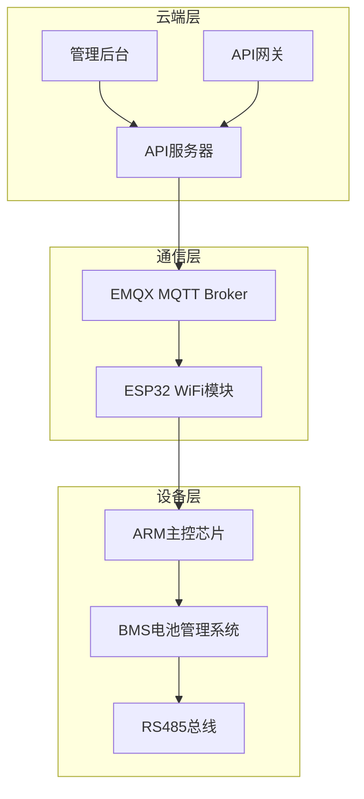
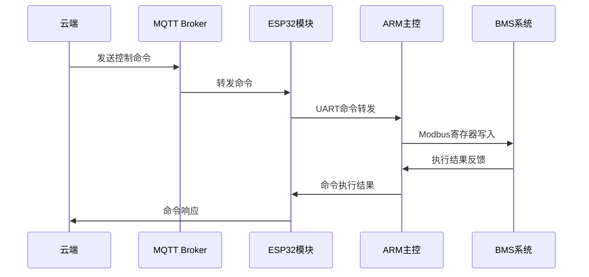
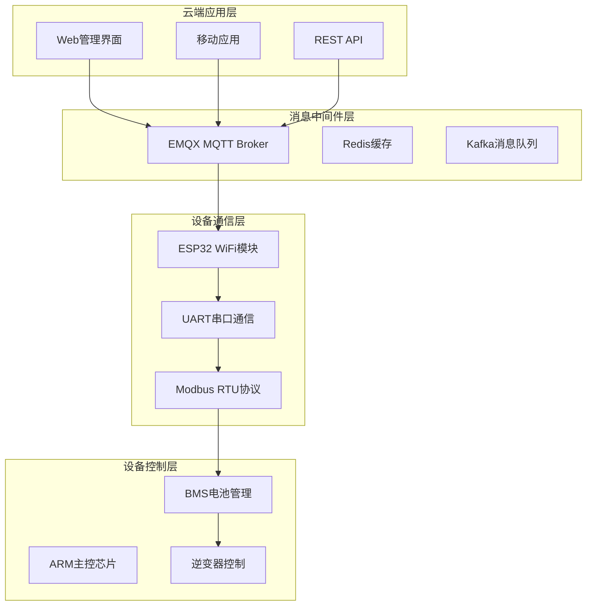
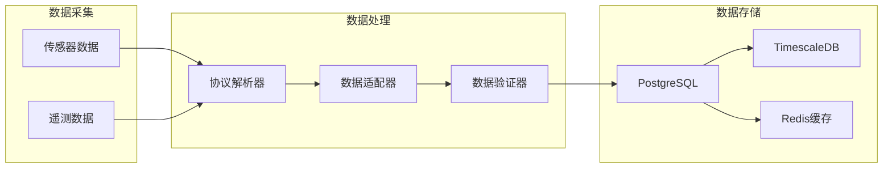
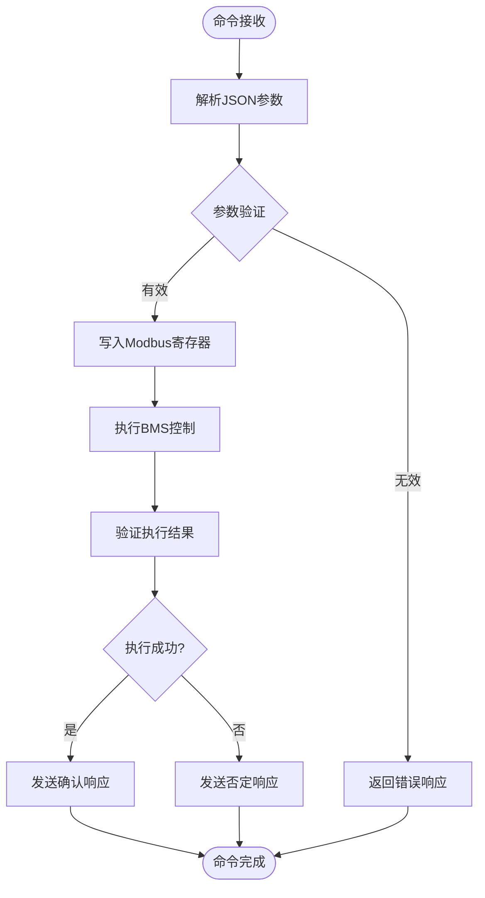
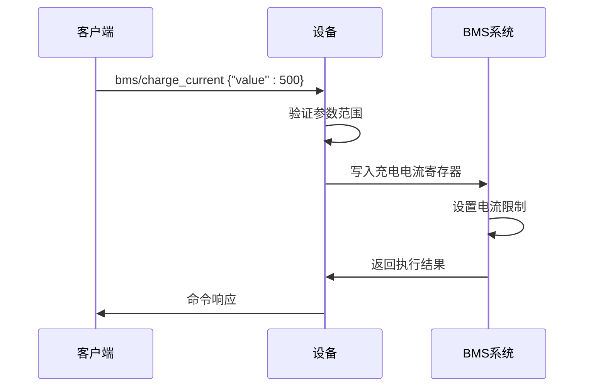
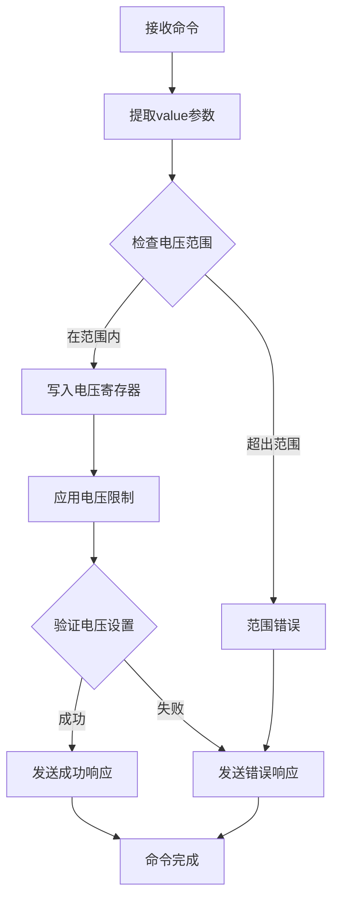
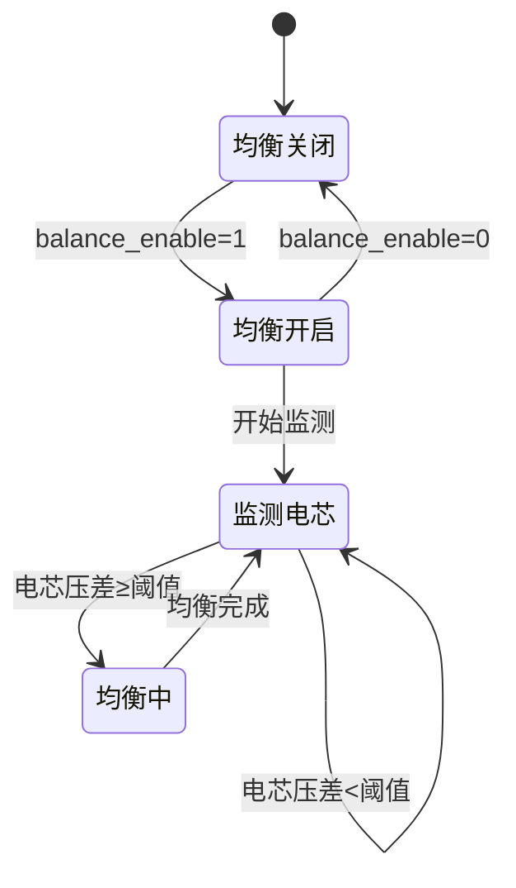
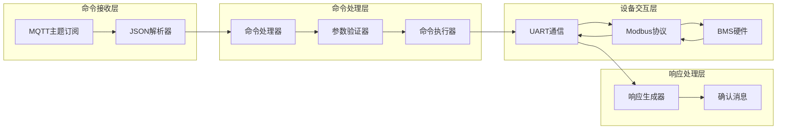
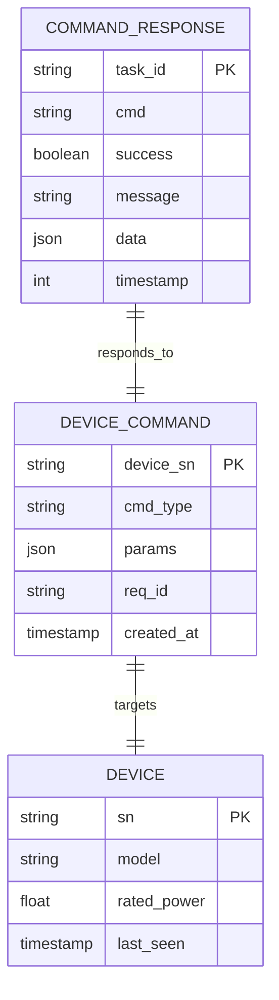

# BMS电池管理系统命令

<cite>
**本文档引用的文件**
- [MQTT接口文档.md](file://docs/MQTT接口文档.md)
- [ARM_ESP32_UART_Protocol.md](file://docs/ARM_ESP32_UART_Protocol.md)
- [系统参数规范_48V离网逆变器.md](file://docs/系统参数规范_48V离网逆变器.md)
- [README.md](file://README.md)
- [protocol_parser.go](file://inv_device_server/internal/service/protocol_parser.go)
- [device.go](file://inv_device_server/internal/model/device.go)
</cite>

## 目录
1. [简介](#简介)
2. [项目结构](#项目结构)
3. [核心组件](#核心组件)
4. [架构概览](#架构概览)
5. [详细组件分析](#详细组件分析)
6. [依赖关系分析](#依赖关系分析)
7. [性能考虑](#性能考虑)
8. [故障排除指南](#故障排除指南)
9. [结论](#结论)

## 简介

本文档详细介绍了BMS电池管理系统在CS-I10-6k2光伏逆变器系统中的控制命令。该系统采用云端-设备直连的MQTT架构，通过ESP32 WiFi模块实现云端与逆变器主控ARM芯片之间的双向通信。

系统支持完整的BMS控制功能，包括充放电使能控制、电流限制设置、电压截止设置以及电池均衡控制等核心功能。所有命令都遵循统一的JSON格式规范，具有明确的参数定义、取值范围和单位换算关系。

## 项目结构

该BMS控制系统基于以下核心组件构建：

**图表来源**
- [README.md:10-30](file://README.md#L10-L30)
- [README.md:209-215](file://README.md#L209-L215)

**章节来源**
- [README.md:1-367](file://README.md#L1-L367)

## 核心组件

### BMS控制命令体系

系统提供完整的BMS控制命令集，涵盖以下主要功能类别：

#### 充放电控制命令
- `bms/charge_enable`: 充放电使能控制
- `bms/charge_current`: 最大充电电流设置
- `bms/discharge_current`: 最大放电电流设置

#### 电压控制命令
- `bms/charge_volt`: 充电截止电压设置
- `bms/discharge_volt`: 放电截止电压设置

#### 均衡控制命令
- `bms/balance_enable`: 电池均衡使能
- `bms/balance_threshold`: 均衡启动压差设置

### 命令执行机制

所有BMS命令都遵循统一的执行流程：

**图表来源**
- [ARM_ESP32_UART_Protocol.md:623-629](file://docs/ARM_ESP32_UART_Protocol.md#L623-L629)

**章节来源**
- [ARM_ESP32_UART_Protocol.md:601-612](file://docs/ARM_ESP32_UART_Protocol.md#L601-L612)

## 架构概览

### 通信架构

系统采用三层通信架构：

**图表来源**
- [README.md:7-29](file://README.md#L7-L29)

### 数据流处理

**图表来源**
- [README.md:209-223](file://README.md#L209-L223)

**章节来源**
- [README.md:195-206](file://README.md#L195-L206)

## 详细组件分析

### BMS充放电使能控制命令

#### 命令格式
- **命令主题**: `bms/charge_enable`
- **JSON格式**: `{"value": 1}`
- **参数定义**:
  - `value`: 控制开关值
    - 0: 禁止充放电
    - 1: 允许充放电

#### 执行机制

**图表来源**
- [ARM_ESP32_UART_Protocol.md:605](file://docs/ARM_ESP32_UART_Protocol.md#L605)

#### 参数规格
- **取值范围**: 0/1 (二进制开关)
- **单位**: 无
- **默认值**: 0 (关闭)
- **安全限制**: 无特殊限制

**章节来源**
- [MQTT接口文档.md:556](file://docs/MQTT接口文档.md#L556)
- [ARM_ESP32_UART_Protocol.md:605](file://docs/ARM_ESP32_UART_Protocol.md#L605)

### BMS最大充放电电流设置命令

#### 命令格式
- **命令主题**: `bms/charge_current` 或 `bms/discharge_current`
- **JSON格式**: `{"value": 500}`
- **参数定义**:
  - `value`: 电流设置值
    - 单位: 0.1A
    - 实际电流 = value × 0.1A

#### 执行机制

**图表来源**
- [ARM_ESP32_UART_Protocol.md:606](file://docs/ARM_ESP32_UART_Protocol.md#L606)

#### 参数规格
- **取值范围**: 0-65535 (根据设备能力)
- **单位**: 0.1A
- **换算关系**: 实际电流(A) = value × 0.1
- **典型范围**: 0-6553.5A

**章节来源**
- [MQTT接口文档.md:557](file://docs/MQTT接口文档.md#L557)
- [ARM_ESP32_UART_Protocol.md:606](file://docs/ARM_ESP32_UART_Protocol.md#L606)

### BMS充电放电截止电压设置命令

#### 命令格式
- **命令主题**: `bms/charge_volt` 或 `bms/discharge_volt`
- **JSON格式**: `{"value": 584}`
- **参数定义**:
  - `value`: 电压设置值
    - 单位: 0.1V
    - 实际电压 = value × 0.1V

#### 执行机制

**图表来源**
- [ARM_ESP32_UART_Protocol.md:608](file://docs/ARM_ESP32_UART_Protocol.md#L608)

#### 参数规格
- **取值范围**: 0-65535
- **单位**: 0.1V
- **换算关系**: 实际电压(V) = value × 0.1
- **典型范围**: 40.0V-6553.5V

**章节来源**
- [MQTT接口文档.md:558](file://docs/MQTT接口文档.md#L558)
- [ARM_ESP32_UART_Protocol.md:608](file://docs/ARM_ESP32_UART_Protocol.md#L608)

### BMS电池均衡控制命令

#### 命令格式
- **命令主题**: `bms/balance_enable` 或 `bms/balance_threshold`
- **JSON格式**: `{"value": 1}` 或 `{"value": 50}`
- **参数定义**:
  - `bms/balance_enable`: 均衡使能开关
    - 0: 禁用均衡
    - 1: 启用均衡
  - `bms/balance_threshold`: 均衡启动压差
    - 单位: mV
    - 实际压差 = value × 1mV

#### 执行机制

**图表来源**
- [ARM_ESP32_UART_Protocol.md:610](file://docs/ARM_ESP32_UART_Protocol.md#L610)

#### 参数规格
- **均衡使能**: 0/1 (二进制开关)
- **均衡阈值**: 0-65535mV
- **单位**: 1mV
- **换算关系**: 实际压差(V) = value × 0.001

**章节来源**
- [MQTT接口文档.md:561](file://docs/MQTT接口文档.md#L561)
- [ARM_ESP32_UART_Protocol.md:610](file://docs/ARM_ESP32_UART_Protocol.md#L610)

## 依赖关系分析

### 命令处理流程

**图表来源**
- [protocol_parser.go:743-775](file://inv_device_server/internal/service/protocol_parser.go#L743-L775)

### 数据模型关系

**图表来源**
- [device.go:145-150](file://inv_device_server/internal/model/device.go#L145-L150)
- [device.go:129-142](file://inv_device_server/internal/model/device.go#L129-L142)

**章节来源**
- [protocol_parser.go:743-775](file://inv_device_server/internal/service/protocol_parser.go#L743-L775)

## 性能考虑

### 命令执行性能

系统在BMS命令处理方面采用了多项性能优化策略：

1. **异步处理**: 命令处理采用异步模式，避免阻塞主线程
2. **批量处理**: 支持多个命令的批量执行和响应
3. **缓存机制**: 常用参数和状态信息缓存在Redis中
4. **连接池**: MQTT连接采用连接池管理，提高并发处理能力

### 数据传输优化

- **压缩传输**: 大数据包采用压缩算法减少传输时间
- **增量更新**: 只传输变化的数据，减少不必要的网络流量
- **优先级队列**: 不同类型的命令具有不同的处理优先级

## 故障排除指南

### 常见问题及解决方案

#### 命令执行失败

**问题症状**:
- 命令发送后无响应
- 设备状态未发生变化
- 返回错误码

**排查步骤**:
1. 检查MQTT连接状态
2. 验证命令格式是否正确
3. 确认设备在线状态
4. 查看设备日志信息

#### 参数范围错误

**问题症状**:
- 命令返回参数范围错误
- 设备拒绝执行命令

**解决方法**:
1. 检查参数取值范围
2. 验证单位换算关系
3. 确认设备支持的能力范围

#### 通信超时

**问题症状**:
- 命令发送超时
- 无法建立MQTT连接

**解决方法**:
1. 检查网络连接稳定性
2. 验证EMQX Broker配置
3. 确认防火墙设置

**章节来源**
- [protocol_parser.go:743-775](file://inv_device_server/internal/service/protocol_parser.go#L743-L775)

## 结论

BMS电池管理系统控制命令提供了完整的电池管理功能，包括充放电控制、电流电压限制以及电池均衡等核心功能。系统采用标准化的JSON格式和严格的参数验证机制，确保了命令的安全性和可靠性。

通过合理的架构设计和性能优化，系统能够稳定地处理大量的BMS控制命令，为用户提供可靠的电池管理解决方案。建议在实际使用中遵循最佳实践，合理设置参数范围，定期监控设备状态，以确保系统的长期稳定运行。