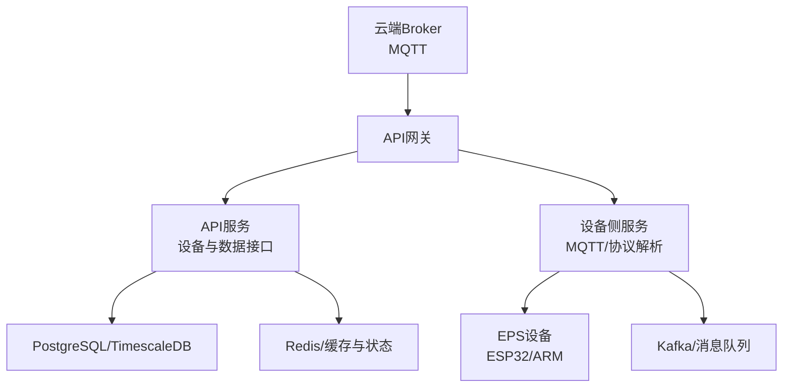
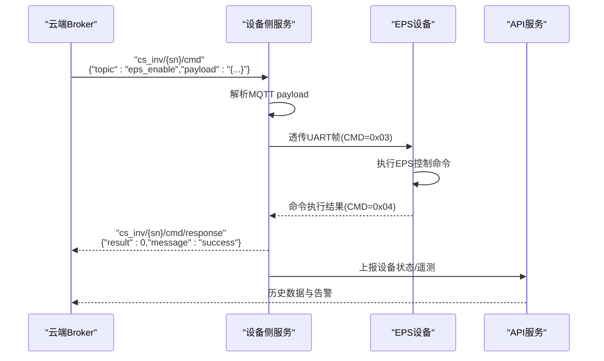
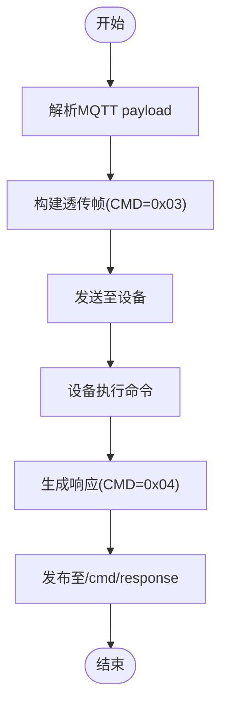
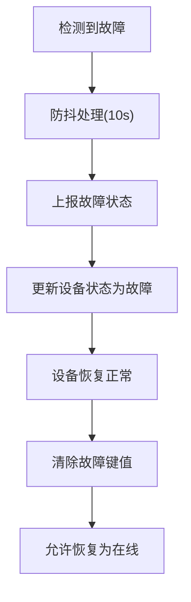
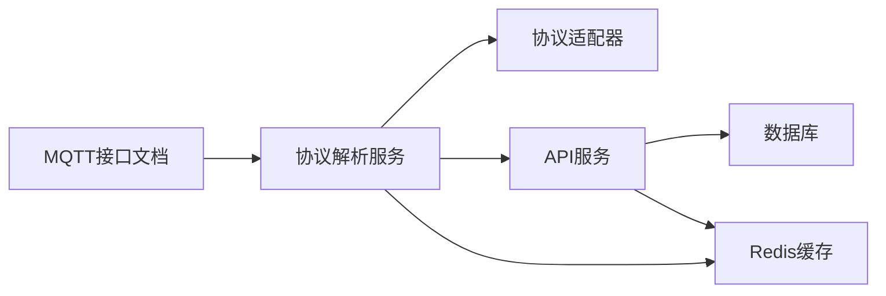

# EPS应急电源控制命令

<cite>
**本文引用的文件**
- [MQTT接口文档.md](file://docs/MQTT接口文档.md)
- [protocol_adapter.go](file://inv_device_server/internal/service/protocol_adapter.go)
- [protocol_parser.go](file://inv_device_server/internal/service/protocol_parser.go)
- [models.go](file://inv_api_server/internal/model/models.go)
- [repositories.go](file://inv_api_server/internal/repository/repositories.go)
- [device_handler.go](file://inv_api_server/internal/handler/device_handler.go)
- [internal_handler.go](file://inv_api_server/internal/handler/internal_handler.go)
- [station_handler.go](file://inv_api_server/internal/handler/station_handler.go)
- [alert_consumer.go](file://inv_device_server/internal/service/alert_consumer.go)
- [data_service.go](file://inv_device_server/internal/service/data_service.go)
- [ARM_ESP32_UART_Protocol.md](file://docs/ARM_ESP32_UART_Protocol.md)
</cite>

## 目录
1. [引言](#引言)
2. [项目结构](#项目结构)
3. [核心组件](#核心组件)
4. [架构总览](#架构总览)
5. [详细组件分析](#详细组件分析)
6. [依赖分析](#依赖分析)
7. [性能考虑](#性能考虑)
8. [故障排查指南](#故障排查指南)
9. [结论](#结论)
10. [附录](#附录)

## 引言
本技术文档面向系统集成商与运维工程师，围绕云端对EPS（应急电源）的控制命令进行深入解析，覆盖EPS启停控制、最大输出功率限制与输出电压设定等关键命令。文档将明确命令的JSON格式、参数定义、取值范围与单位换算关系；阐述EPS工作模式与切换机制；给出参数配置建议与负载匹配方案；并总结安全保护与故障处理策略，最后提供使用示例与运行管理方法。

## 项目结构
本项目采用多服务分层架构：设备侧服务负责MQTT接入与协议解析；API服务负责设备状态与数据的持久化与对外接口；前端提供可视化与控制界面。EPS控制命令通过MQTT下发，经设备侧服务透传至设备端，再由设备执行并回传结果。

图示来源
- [protocol_adapter.go:1-190](file://inv_device_server/internal/service/protocol_adapter.go#L1-L190)
- [protocol_parser.go:103-609](file://inv_device_server/internal/service/protocol_parser.go#L103-L609)

章节来源
- [protocol_adapter.go:1-190](file://inv_device_server/internal/service/protocol_adapter.go#L1-L190)
- [protocol_parser.go:103-609](file://inv_device_server/internal/service/protocol_parser.go#L103-L609)

## 核心组件
- EPS控制命令定义：位于MQTT接口文档中的“EPS 应急电源控制”小节，明确了eps_enable、eps_power_limit、eps_voltage_set三个命令及其payload格式。
- 设备侧协议适配与解析：设备侧服务负责将MQTT payload解析为内部结构，并透传到设备端。
- API服务与状态管理：API服务负责设备状态维护、告警上报与历史数据存储。
- 前端控制界面：提供命令模板选择与执行确认流程。

章节来源
- [MQTT接口文档.md:572-578](file://docs/MQTT接口文档.md#L572-L578)
- [protocol_adapter.go:25-33](file://inv_device_server/internal/service/protocol_adapter.go#L25-L33)
- [protocol_parser.go:698-741](file://inv_device_server/internal/service/protocol_parser.go#L698-L741)

## 架构总览
EPS控制命令从云端下发到设备端的完整链路如下：

图示来源
- [MQTT接口文档.md:509-611](file://docs/MQTT接口文档.md#L509-L611)
- [ARM_ESP32_UART_Protocol.md:630-654](file://docs/ARM_ESP32_UART_Protocol.md#L630-L654)

章节来源
- [MQTT接口文档.md:509-611](file://docs/MQTT接口文档.md#L509-L611)
- [ARM_ESP32_UART_Protocol.md:630-654](file://docs/ARM_ESP32_UART_Protocol.md#L630-L654)

## 详细组件分析

### EPS控制命令定义与参数说明
- eps_enable
  - 命令用途：启用/禁用EPS功能
  - JSON格式：{"value": 0|1}
  - 参数定义：value为整数，0表示禁用，1表示启用
  - 取值范围与单位：0或1
  - 单位换算：无小数，直接布尔语义映射
- eps_power_limit
  - 命令用途：设置EPS最大输出有功功率
  - JSON格式：{"value": n}
  - 参数定义：value为整数，单位为瓦特(W)
  - 取值范围：依据设备额定功率与实际配置确定，建议不超过设备额定功率
  - 单位换算：1 W = 1 W（无需换算）
- eps_voltage_set
  - 命令用途：设置EPS输出电压设定值
  - JSON格式：{"value": n}
  - 参数定义：value为整数，单位为伏特(V)
  - 取值范围：依据设备额定输出电压与允许偏差确定
  - 单位换算：1 V = 1 V（无需换算）

章节来源
- [MQTT接口文档.md:572-578](file://docs/MQTT接口文档.md#L572-L578)

### 命令下发与执行流程
- 命令下发：云端通过主题cs_inv/{sn}/cmd下发命令，payload包含topic与payload字段
- 设备侧解析：设备侧服务解析MQTT payload，构造透传帧
- 设备执行：ESP32将命令透传给ARM，ARM执行后返回执行结果
- 结果回传：设备侧服务将结果转发至cs_inv/{sn}/cmd/response

图示来源
- [MQTT接口文档.md:509-611](file://docs/MQTT接口文档.md#L509-L611)
- [protocol_adapter.go:25-33](file://inv_device_server/internal/service/protocol_adapter.go#L25-L33)

章节来源
- [MQTT接口文档.md:509-611](file://docs/MQTT接口文档.md#L509-L611)
- [protocol_adapter.go:25-33](file://inv_device_server/internal/service/protocol_adapter.go#L25-L33)

### EPS工作模式与切换机制
- EPS模式：通过eps_enable实现启用/禁用控制，通常与系统其他运行模式（如并网、离网、备电优先等）协同
- 功率限制：eps_power_limit用于限制EPS的最大输出功率，避免过载
- 电压设定：eps_voltage_set用于设定EPS输出电压，需与负载设备额定电压匹配
- 切换策略：建议在负载侧具备过载保护的前提下进行切换；切换前后应监测输出电压与电流，确保稳定

章节来源
- [MQTT接口文档.md:572-578](file://docs/MQTT接口文档.md#L572-L578)

### 参数配置建议与负载匹配方案
- 额定功率匹配：eps_power_limit不应超过EPS设备额定功率，建议留有10%-15%余量
- 电压匹配：eps_voltage_set应与负载设备额定输入电压一致，偏差控制在±2%以内
- 功率因数与谐波：结合系统功率因数与THD要求，合理设置相关参数
- 负载特性：阻性负载优先，感性/容性负载需评估启动冲击与功率因数影响

章节来源
- [MQTT接口文档.md:572-578](file://docs/MQTT接口文档.md#L572-L578)

### 安全保护措施与故障处理策略
- 故障上报：设备侧服务对故障状态进行防抖与去重处理，避免频繁上报
- 状态维护：API服务根据告警级别更新设备状态，严重故障时将设备标记为故障
- 恢复判定：当设备恢复正常且无未处理严重告警时，允许从故障状态恢复为在线
- 命令确认：前端提供命令执行确认流程，降低误操作风险

图示来源
- [protocol_parser.go:577-606](file://inv_device_server/internal/service/protocol_parser.go#L577-L606)
- [internal_handler.go:117-126](file://inv_api_server/internal/handler/internal_handler.go#L117-L126)
- [internal_handler.go:183-188](file://inv_api_server/internal/handler/internal_handler.go#L183-L188)

章节来源
- [protocol_parser.go:577-606](file://inv_device_server/internal/service/protocol_parser.go#L577-L606)
- [internal_handler.go:117-126](file://inv_api_server/internal/handler/internal_handler.go#L117-L126)
- [internal_handler.go:183-188](file://inv_api_server/internal/handler/internal_handler.go#L183-L188)

### 使用示例与运行管理方法
- 示例1：启用EPS
  - 主题：cs_inv/{sn}/cmd
  - Payload：{"topic":"eps_enable","payload":"{\"value\":1}"}
- 示例2：设置EPS最大输出功率为3000W
  - 主题：cs_inv/{sn}/cmd
  - Payload：{"topic":"eps_power_limit","payload":"{\"value\":3000}"}
- 示例3：设置EPS输出电压为220V
  - 主题：cs_inv/{sn}/cmd
  - Payload：{"topic":"eps_voltage_set","payload":"{\"value\":220}"}
- 运行管理：
  - 通过前端控制面板选择命令模板并确认执行
  - 实时关注/cmd/response主题以获取执行结果
  - 结合历史数据与告警记录进行运行状态评估

章节来源
- [MQTT接口文档.md:572-578](file://docs/MQTT接口文档.md#L572-L578)
- [ARM_ESP32_UART_Protocol.md:630-654](file://docs/ARM_ESP32_UART_Protocol.md#L630-L654)

## 依赖分析
- 命令解析依赖：设备侧服务依赖协议适配器将MQTT payload解析为内部结构
- 数据流转依赖：设备侧服务将遥测与告警数据上报至API服务，API服务持久化至数据库
- 状态一致性依赖：设备侧服务通过Redis缓存与API服务共同维护设备状态，避免被普通遥测覆盖

图示来源
- [protocol_adapter.go:110-145](file://inv_device_server/internal/service/protocol_adapter.go#L110-L145)
- [protocol_parser.go:103-135](file://inv_device_server/internal/service/protocol_parser.go#L103-L135)

章节来源
- [protocol_adapter.go:110-145](file://inv_device_server/internal/service/protocol_adapter.go#L110-L145)
- [protocol_parser.go:103-135](file://inv_device_server/internal/service/protocol_parser.go#L103-L135)

## 性能考虑
- 命令处理吞吐：设备侧服务对消息处理失败进行最多3次重试，避免瞬时错误导致丢失
- 数据聚合：API服务按分钟/小时/天粒度聚合遥测数据，降低存储压力
- 缓存与状态：通过Redis缓存设备状态，减少数据库写入压力

章节来源
- [protocol_parser.go:103-135](file://inv_device_server/internal/service/protocol_parser.go#L103-L135)
- [repositories.go:680-740](file://inv_api_server/internal/repository/repositories.go#L680-L740)

## 故障排查指南
- 命令未生效
  - 检查命令主题与payload格式是否符合EPS控制命令定义
  - 查看/cmd/response主题确认执行结果
- 设备离线
  - 检查status主题的retain消息是否为online=true
  - 关注LWT消息，确认是否存在异常断开
- 告警频繁
  - 查看设备告警码与级别，结合故障恢复策略进行处理
  - 确认设备状态是否被普通遥测覆盖

章节来源
- [protocol_parser.go:577-606](file://inv_device_server/internal/service/protocol_parser.go#L577-L606)
- [alert_consumer.go:150-185](file://inv_device_server/internal/service/alert_consumer.go#L150-L185)
- [data_service.go:194](file://inv_device_server/internal/service/data_service.go#L194)

## 结论
本文系统梳理了EPS应急电源控制命令的定义、下发与执行流程，明确了参数含义与取值范围，并结合项目架构与状态管理策略给出了配置建议、安全保护与故障处理方法。建议在实际工程中遵循“先确认、后执行”的原则，配合历史数据与告警记录进行闭环管理，确保EPS系统的安全、稳定与高效运行。

## 附录
- 相关主题与字段
  - EPS控制命令主题：cs_inv/{sn}/cmd
  - 命令执行结果主题：cs_inv/{sn}/cmd/response
  - 设备状态主题：cs_inv/{sn}/status（retain）
- 命令模板参考
  - eps_enable：{"value":0|1}
  - eps_power_limit：{"value":n(W)}
  - eps_voltage_set：{"value":n(V)}

章节来源
- [MQTT接口文档.md:509-611](file://docs/MQTT接口文档.md#L509-L611)
- [MQTT接口文档.md:572-578](file://docs/MQTT接口文档.md#L572-L578)