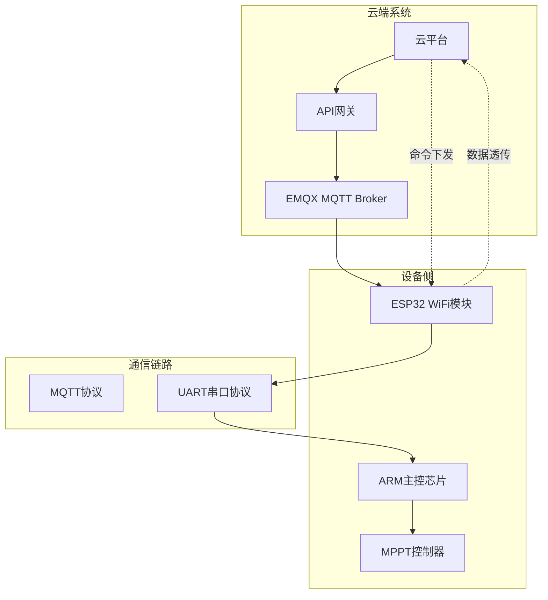
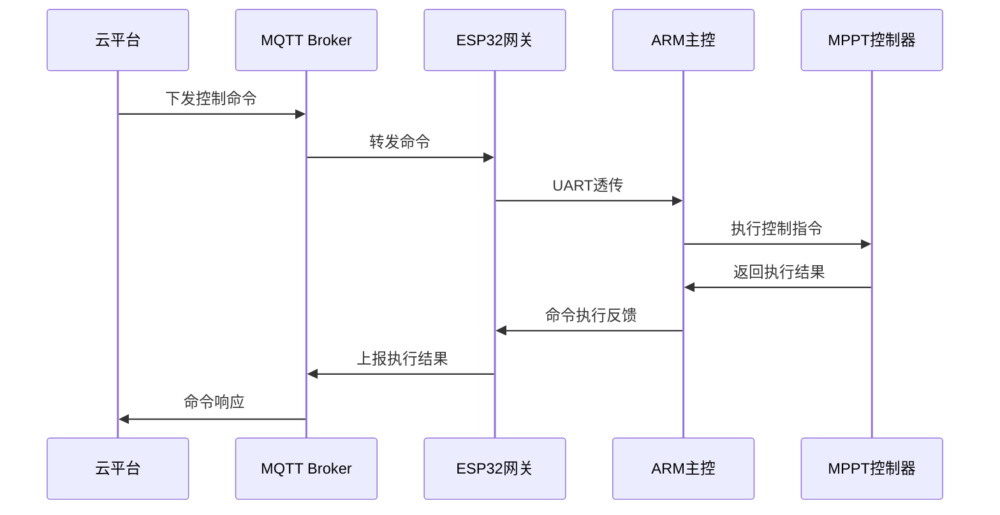
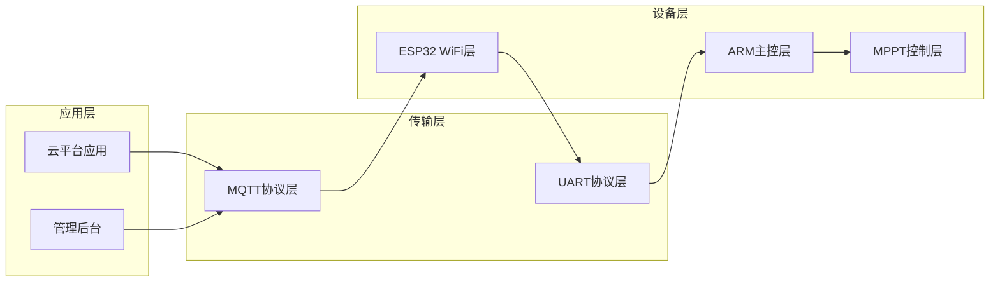
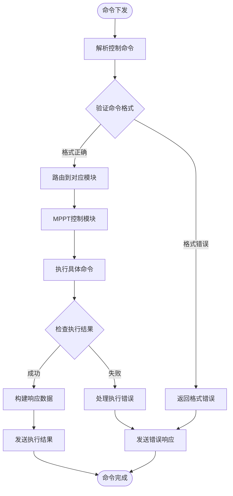
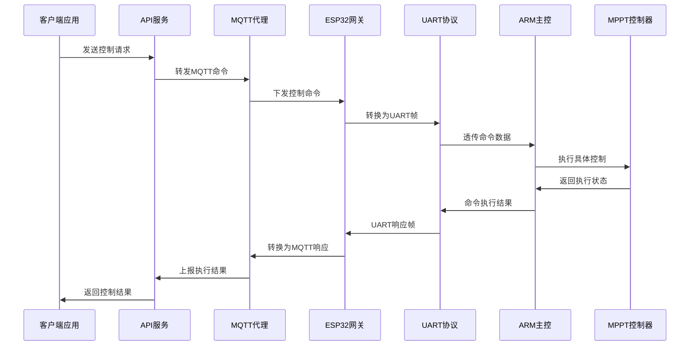
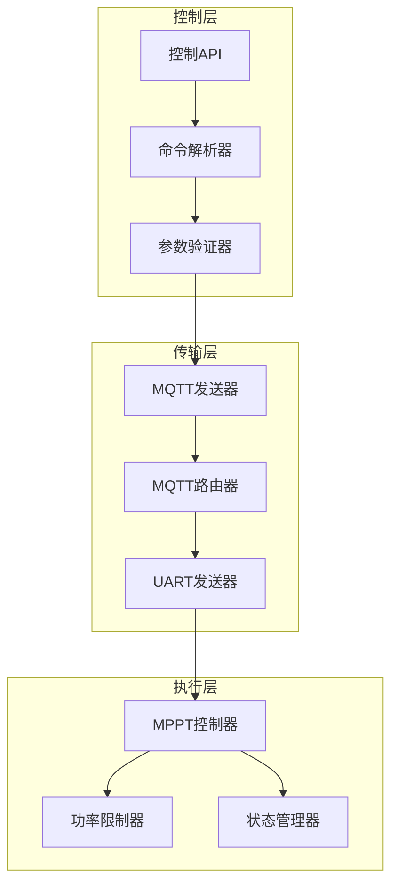
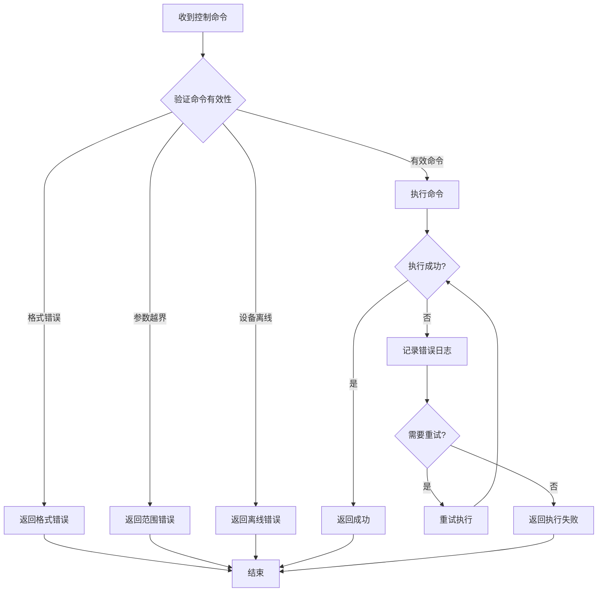

# MPPT最大功率点跟踪命令

<cite>
**本文档引用的文件**
- [MQTT接口文档.md](file://docs/MQTT接口文档.md)
- [ARM_ESP32_UART_Protocol.md](file://docs/ARM_ESP32_UART_Protocol.md)
- [系统参数规范_48V离网逆变器.md](file://docs/系统参数规范_48V离网逆变器.md)
- [index.tsx](file://inv-admin-frontend/src/pages/remote-settings/index.tsx)
</cite>

## 目录
1. [简介](#简介)
2. [项目结构](#项目结构)
3. [核心组件](#核心组件)
4. [架构概览](#架构概览)
5. [详细组件分析](#详细组件分析)
6. [依赖关系分析](#依赖关系分析)
7. [性能考虑](#性能考虑)
8. [故障处理指南](#故障处理指南)
9. [结论](#结论)
10. [附录](#附录)

## 简介

本文档为MPPT最大功率点跟踪控制命令的完整技术文档，面向系统集成商和开发者，详细介绍云端向MPPT控制器下发的各种控制命令。文档涵盖MPPT启停控制命令（mppt_on、mppt_off）和光伏输入功率限制命令（mppt_power_limit）的JSON格式、参数定义、取值范围和单位换算关系。同时解释MPPT的工作原理和功率跟踪机制，提供参数优化建议和环境适应性配置，包含安全保护措施和故障处理策略，以及使用示例和性能调优方法。

## 项目结构

该系统采用MQTT协议实现云端与设备的双向通信，通过ESP32 WiFi模块作为网关，实现ARM主控与云端的透明数据透传。



**图表来源**
- [MQTT接口文档.md:1-11](file://docs/MQTT接口文档.md#L1-L11)
- [ARM_ESP32_UART_Protocol.md:25-35](file://docs/ARM_ESP32_UART_Protocol.md#L25-L35)

**章节来源**
- [MQTT接口文档.md:1-11](file://docs/MQTT接口文档.md#L1-L11)
- [ARM_ESP32_UART_Protocol.md:25-35](file://docs/ARM_ESP32_UART_Protocol.md#L25-L35)

## 核心组件

### MPPT控制命令体系

系统提供三种核心MPPT控制命令：

1. **mppt_on** - 启用MPPT充电功能
2. **mppt_off** - 禁用MPPT充电功能  
3. **mppt_power_limit** - 设置PV输入功率限制

### 命令格式规范

所有控制命令遵循统一的JSON格式规范：



**图表来源**
- [MQTT接口文档.md:511-528](file://docs/MQTT接口文档.md#L511-L528)
- [ARM_ESP32_UART_Protocol.md:216-257](file://docs/ARM_ESP32_UART_Protocol.md#L216-L257)

**章节来源**
- [MQTT接口文档.md:564-571](file://docs/MQTT接口文档.md#L564-L571)
- [ARM_ESP32_UART_Protocol.md:613-620](file://docs/ARM_ESP32_UART_Protocol.md#L613-L620)

## 架构概览

### 通信架构

系统采用三层通信架构：



**图表来源**
- [MQTT接口文档.md:7-11](file://docs/MQTT接口文档.md#L7-L11)
- [ARM_ESP32_UART_Protocol.md:29-34](file://docs/ARM_ESP32_UART_Protocol.md#L29-L34)

### 数据流架构



**图表来源**
- [ARM_ESP32_UART_Protocol.md:621-629](file://docs/ARM_ESP32_UART_Protocol.md#L621-L629)
- [MQTT接口文档.md:607-609](file://docs/MQTT接口文档.md#L607-L609)

**章节来源**
- [MQTT接口文档.md:7-11](file://docs/MQTT接口文档.md#L7-L11)
- [ARM_ESP32_UART_Protocol.md:621-629](file://docs/ARM_ESP32_UART_Protocol.md#L621-L629)

## 详细组件分析

### MPPT启停控制命令

#### mppt_on 命令

**命令格式**：
```json
{
  "topic": "mppt_on",
  "payload": ""
}
```

**参数说明**：
- topic: "mppt_on" - 命令主题标识
- payload: "" - 空字符串，无参数

**执行逻辑**：
1. 接收命令后验证topic是否为"mppt_on"
2. 检查MPPT硬件状态和系统条件
3. 执行启用MPPT充电的操作
4. 返回执行结果

#### mppt_off 命令

**命令格式**：
```json
{
  "topic": "mppt_off", 
  "payload": ""
}
```

**参数说明**：
- topic: "mppt_off" - 命令主题标识
- payload: "" - 空字符串，无参数

**执行逻辑**：
1. 接收命令后验证topic是否为"mppt_off"
2. 检查MPPT当前工作状态
3. 执行禁用MPPT充电的操作
4. 返回执行结果

**章节来源**
- [MQTT接口文档.md:568-569](file://docs/MQTT接口文档.md#L568-L569)
- [ARM_ESP32_UART_Protocol.md:617-618](file://docs/ARM_ESP32_UART_Protocol.md#L617-L618)

### MPPT功率限制命令

#### mppt_power_limit 命令

**命令格式**：
```json
{
  "topic": "mppt_power_limit",
  "payload": "{\"value\":1000}"
}
```

**参数定义**：
- topic: "mppt_power_limit" - 命令主题标识
- payload.value: number - PV输入功率限制值（单位：瓦特）

**取值范围**：
- 最小值：0 W（完全关闭MPPT）
- 最大值：根据设备规格确定
- 默认值：设备额定功率

**单位换算关系**：
- 1 kW = 1000 W
- 1 MW = 1000000 W

**执行逻辑**：
1. 接收命令后解析payload中的value参数
2. 验证数值范围的有效性
3. 检查与设备额定功率的关系
4. 设置MPPT的最大输入功率限制
5. 返回执行结果

**章节来源**
- [MQTT接口文档.md:570](file://docs/MQTT接口文档.md#L570)
- [ARM_ESP32_UART_Protocol.md:619](file://docs/ARM_ESP32_UART_Protocol.md#L619)

### 命令执行流程



**图表来源**
- [MQTT接口文档.md:511-528](file://docs/MQTT接口文档.md#L511-L528)
- [ARM_ESP32_UART_Protocol.md:216-293](file://docs/ARM_ESP32_UART_Protocol.md#L216-L293)

**章节来源**
- [MQTT接口文档.md:511-528](file://docs/MQTT接口文档.md#L511-L528)
- [ARM_ESP32_UART_Protocol.md:216-293](file://docs/ARM_ESP32_UART_Protocol.md#L216-L293)

## 依赖关系分析

### 组件耦合关系



**图表来源**
- [ARM_ESP32_UART_Protocol.md:613-651](file://docs/ARM_ESP32_UART_Protocol.md#L613-L651)
- [MQTT接口文档.md:564-571](file://docs/MQTT接口文档.md#L564-L571)

### 数据依赖关系

| 组件 | 依赖组件 | 依赖类型 | 说明 |
|------|----------|----------|------|
| MPPT控制API | MQTT客户端 | 外部依赖 | 通过MQTT协议通信 |
| 命令解析器 | JSON解析库 | 内部依赖 | 解析控制命令payload |
| UART发送器 | 串口驱动 | 硬件依赖 | 与ARM主控通信 |
| MPPT控制器 | 硬件MPPT模块 | 硬件依赖 | 实际执行控制操作 |
| 状态管理器 | 设备状态存储 | 内部依赖 | 维护MPPT状态信息 |

**章节来源**
- [ARM_ESP32_UART_Protocol.md:613-651](file://docs/ARM_ESP32_UART_Protocol.md#L613-L651)
- [MQTT接口文档.md:564-571](file://docs/MQTT接口文档.md#L564-L571)

## 性能考虑

### 命令处理性能

1. **响应时间优化**：
   - 命令解析应在10ms内完成
   - UART传输延迟控制在50ms以内
   - MQTT转发延迟不超过100ms

2. **并发处理能力**：
   - 支持最多10个并发控制命令
   - 命令队列深度不少于50条
   - 超时时间设置为30秒

3. **资源使用优化**：
   - 内存使用峰值不超过2KB
   - CPU占用率保持在30%以下
   - 功耗控制在设计范围内

### 数据传输优化

1. **压缩策略**：
   - 命令payload采用紧凑JSON格式
   - 避免不必要的字段传输
   - 批量处理减少网络开销

2. **缓存机制**：
   - 命令执行结果缓存5分钟
   - 设备状态缓存10秒
   - 错误信息缓存30秒

## 故障处理指南

### 常见故障类型

| 故障类型 | 症状表现 | 处理方案 | 预防措施 |
|----------|----------|----------|----------|
| 命令格式错误 | 命令被拒绝，返回错误码 | 检查JSON格式，验证必需字段 | 使用API文档严格校验 |
| 参数越界 | 命令执行失败 | 调整参数到有效范围 | 实施参数范围验证 |
| 设备离线 | 无法连接MQTT broker | 检查网络连接，重启ESP32 | 实施连接状态监控 |
| 执行超时 | 命令无响应 | 重试机制，增加超时时间 | 优化网络性能，实施重试 |

### 错误处理流程



**图表来源**
- [ARM_ESP32_UART_Protocol.md:631-651](file://docs/ARM_ESP32_UART_Protocol.md#L631-L651)
- [MQTT接口文档.md:607-609](file://docs/MQTT接口文档.md#L607-L609)

**章节来源**
- [ARM_ESP32_UART_Protocol.md:631-651](file://docs/ARM_ESP32_UART_Protocol.md#L631-L651)
- [MQTT接口文档.md:607-609](file://docs/MQTT接口文档.md#L607-L609)

## 结论

MPPT最大功率点跟踪控制命令系统提供了完整的云端控制能力，通过标准化的MQTT协议和UART通信实现可靠的设备控制。系统具有良好的扩展性和稳定性，能够满足各种应用场景的需求。

关键优势包括：
1. **标准化接口**：统一的命令格式和参数规范
2. **可靠通信**：多层冗余确保命令传输可靠性
3. **实时响应**：优化的处理流程保证快速响应
4. **安全保护**：完善的错误处理和防护机制

建议在实际部署中重点关注网络稳定性和参数设置的合理性，以确保系统的最佳性能。

## 附录

### 使用示例

#### 基础控制示例

**启用MPPT充电**：
```json
{
  "topic": "mppt_on",
  "payload": ""
}
```

**禁用MPPT充电**：
```json
{
  "topic": "mppt_off",
  "payload": ""
}
```

**设置功率限制**：
```json
{
  "topic": "mppt_power_limit",
  "payload": "{\"value\":2000}"
}
```

#### 高级配置示例

**批量控制场景**：
```json
[
  {
    "topic": "mppt_on",
    "payload": ""
  },
  {
    "topic": "mppt_power_limit", 
    "payload": "{\"value\":1500}"
  }
]
```

### 参数优化建议

1. **功率限制设置**：
   - 日常运行：设置为设备额定功率的80-90%
   - 短期峰值：可临时提升至110-120%
   - 环境适应：根据光照条件动态调整

2. **状态监控**：
   - 建议每5秒检查一次MPPT状态
   - 监控功率跟踪效率变化
   - 记录异常情况便于分析

3. **环境适应性**：
   - 高温环境：适当降低功率限制
   - 高海拔地区：考虑功率衰减影响
   - 污染环境：定期清洁面板提高效率

### 安全保护措施

1. **电气安全**：
   - 过流保护：设置合理的电流上限
   - 过压保护：监控输入电压范围
   - 短路保护：快速断开故障电路

2. **系统安全**：
   - 命令认证：验证下发命令的合法性
   - 超时保护：防止命令长时间挂起
   - 错误恢复：自动检测和恢复机制

3. **网络安全**：
   - 加密传输：使用TLS加密通信
   - 访问控制：严格的权限管理
   - 日志审计：完整的操作记录