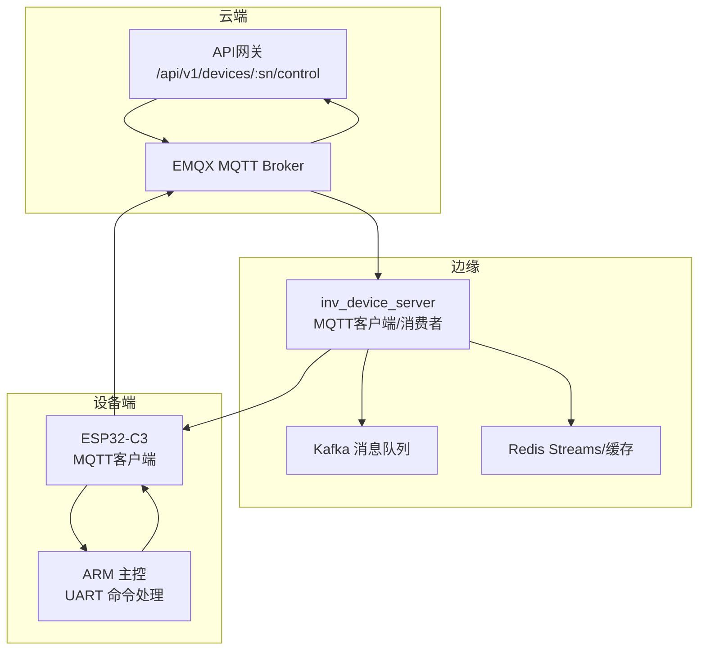
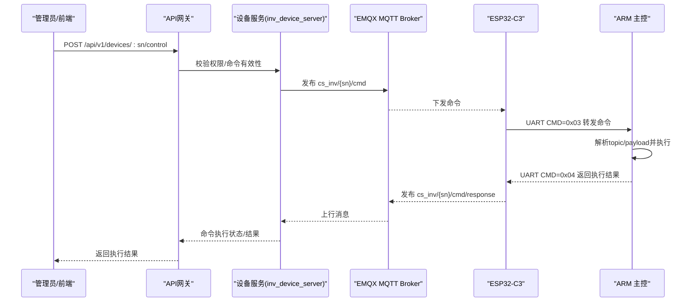
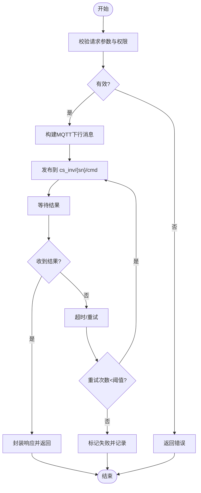
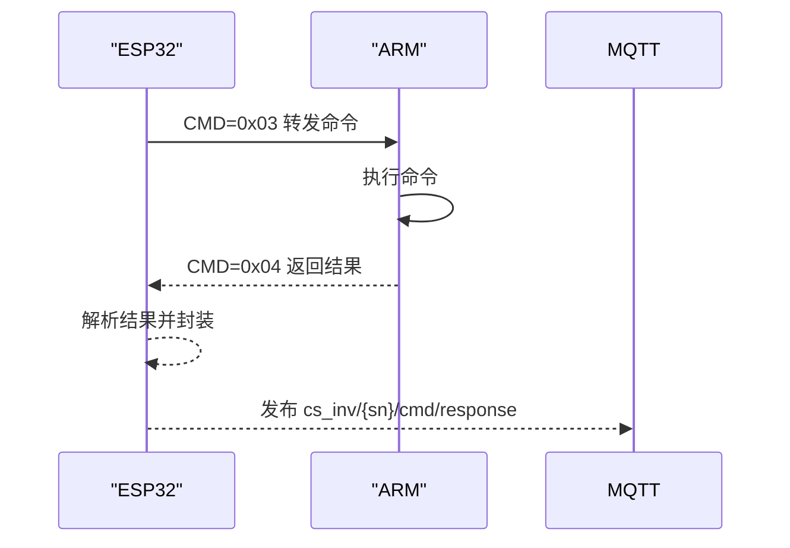
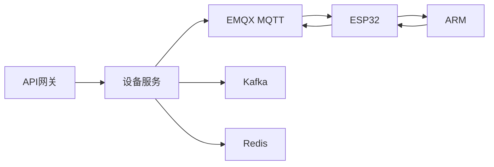

# 下行命令格式

<cite>
**本文引用的文件**
- [MQTT接口文档.md](file://docs/MQTT接口文档.md)
- [ARM_ESP32_UART_Protocol.md](file://docs/ARM_ESP32_UART_Protocol.md)
- [device.go](file://inv_device_server/internal/model/device.go)
- [client.go](file://inv_device_server/internal/mqtt/client.go)
- [protocol_parser.go](file://inv_device_server/internal/service/protocol_parser.go)
- [protocol_adapter.go](file://inv_device_server/internal/service/protocol_adapter.go)
- [device_handler.go](file://inv_api_server/internal/handler/device_handler.go)
- [routes.go](file://api-gateway/internal/routes/routes.go)
- [README.md](file://README.md)
</cite>

## 目录
1. [简介](#简介)
2. [项目结构](#项目结构)
3. [核心组件](#核心组件)
4. [架构总览](#架构总览)
5. [详细组件分析](#详细组件分析)
6. [依赖关系分析](#依赖关系分析)
7. [性能考虑](#性能考虑)
8. [故障排查指南](#故障排查指南)
9. [结论](#结论)
10. [附录](#附录)

## 简介
本文件面向系统集成商与开发者，系统性阐述“云端向下发命令”的完整技术方案，覆盖逆变器控制、BMS电池管理、MPPT最大功率点跟踪、EPS应急电源以及发电机控制等命令族。文档明确命令的MQTT主题、JSON格式、参数定义与取值范围，给出从云端MQTT发布到ESP32透传再到ARM执行与结果反馈的完整流程，并提供命令确认机制、错误处理策略、优先级、超时与重试建议，以及命令格式扩展与自定义命令开发指南。

## 项目结构
该系统采用“云端-边缘-设备”三层架构：
- 云端：API网关与设备控制接口，负责鉴权、命令校验与下发
- 边缘：设备服务（inv_device_server）负责MQTT订阅、协议解析与转发
- 设备：ESP32-C3作为MQTT网关，ARM作为逆变器主控，负责执行命令与回传结果

**图表来源**
- [README.md: 5-29:5-29](file://README.md#L5-L29)
- [routes.go: 174](file://api-gateway/internal/routes/routes.go#L174)

**章节来源**
- [README.md: 5-29:5-29](file://README.md#L5-L29)
- [routes.go: 174](file://api-gateway/internal/routes/routes.go#L174)

## 核心组件
- 命令模型与响应
  - 设备命令结构包含设备序列号、命令类型、参数与请求ID
  - 命令响应包含任务ID、命令、成功标志、消息与可选数据
- MQTT主题与协议
  - 云端通过cs_inv/{sn}/cmd下发命令，ESP32透传至ARM
  - ARM执行后通过UART回传结果，ESP32再转发到cs_inv/{sn}/cmd/response
- 控制命令族
  - 逆变器控制：ac_on、ac_off、set_power_limit、set_reactive、set_pf、set_charge_limit、set_discharge_limit、set_soc_low、set_soc_high、force_charge、force_discharge、grid_charge_enable、eco_mode、restart、pv_shutdown、query
  - BMS控制：bms/charge_enable、bms/charge_current、bms/discharge_current、bms/charge_volt、bms/discharge_volt、bms/balance_enable、bms/balance_threshold
  - MPPT控制：mppt_on、mppt_off、mppt_power_limit
  - EPS控制：eps_enable、eps_power_limit、eps_voltage_set
  - 发电机控制：gen_enable、gen_power_limit

**章节来源**
- [device.go: 144-150:144-150](file://inv_device_server/internal/model/device.go#L144-L150)
- [device.go: 128-142:128-142](file://inv_device_server/internal/model/device.go#L128-L142)
- [MQTT接口文档.md: 509-611:509-611](file://docs/MQTT接口文档.md#L509-L611)

## 架构总览
云端控制命令的端到端流程如下：

**图表来源**
- [device_handler.go: 372-402:372-402](file://inv_api_server/internal/handler/device_handler.go#L372-L402)
- [client.go: 20-45:20-45](file://inv_device_server/internal/mqtt/client.go#L20-L45)
- [protocol_parser.go: 93-135:93-135](file://inv_device_server/internal/service/protocol_parser.go#L93-L135)
- [ARM_ESP32_UART_Protocol.md: 216-294:216-294](file://docs/ARM_ESP32_UART_Protocol.md#L216-L294)

## 详细组件分析

### 命令下发与执行流程
- 云端接口
  - API网关提供设备控制接口，调用设备服务进行权限校验与命令下发
- 边缘处理
  - 设备服务订阅MQTT主题，解析消息并转发到Kafka/Redis
  - MQTT客户端负责下行命令发布与上行结果订阅
- 设备侧
  - ESP32透传命令到ARM，ARM执行后通过UART回传结果
  - ESP32再将结果转发到云端响应主题

**图表来源**
- [device_handler.go: 372-402:372-402](file://inv_api_server/internal/handler/device_handler.go#L372-L402)
- [protocol_parser.go: 101-135:101-135](file://inv_device_server/internal/service/protocol_parser.go#L101-L135)

**章节来源**
- [device_handler.go: 372-402:372-402](file://inv_api_server/internal/handler/device_handler.go#L372-L402)
- [client.go: 20-45:20-45](file://inv_device_server/internal/mqtt/client.go#L20-L45)
- [protocol_parser.go: 93-135:93-135](file://inv_device_server/internal/service/protocol_parser.go#L93-L135)

### 命令格式与参数定义

#### 逆变器控制命令
- ac_on
  - 说明：开启交流输出（需先使能远程控制）
  - 参数：无
- ac_off
  - 说明：关闭交流输出
  - 参数：无
- set_power_limit(value)
  - 说明：设置有功功率上限（单位：瓦）
  - 参数：value（整数，取值范围依据设备额定功率）
- set_reactive(value)
  - 说明：设置无功功率目标值（单位：乏）
  - 参数：value（整数）
- set_pf(value)
  - 说明：设置目标功率因数（范围：-100~100，对应-1.00~1.00）
  - 参数：value（整数）
- set_charge_limit(value)
  - 说明：设置最大充电功率（单位：瓦）
  - 参数：value（整数）
- set_discharge_limit(value)
  - 说明：设置最大放电功率（单位：瓦）
  - 参数：value（整数）
- set_soc_low(value)
  - 说明：设置放电截止SOC（单位：0.1%，例如200表示20%）
  - 参数：value（整数）
- set_soc_high(value)
  - 说明：设置充电截止SOC（单位：0.1%，例如950表示95%）
  - 参数：value（整数）
- force_charge(value)
  - 说明：强制充电使能（0=关闭，1=开启）
  - 参数：value（整数，0或1）
- force_discharge(value)
  - 说明：强制放电使能（0=关闭，1=开启）
  - 参数：value（整数，0或1）
- grid_charge_enable(value)
  - 说明：电网充电使能（0=关闭，1=开启）
  - 参数：value（整数，0或1）
- eco_mode(value)
  - 说明：工作模式（0=自发自用，1=备电优先，2=分时电价，3=离网）
  - 参数：value（整数，0~3）
- restart
  - 说明：故障复位
  - 参数：无
- pv_shutdown(value)
  - 说明：组串关断（按位掩码：Bit0=PV1，Bit1=PV2）
  - 参数：value（整数，位组合）
- query
  - 说明：立即上报全量数据
  - 参数：无

**章节来源**
- [MQTT接口文档.md: 529-551:529-551](file://docs/MQTT接口文档.md#L529-L551)

#### BMS电池管理系统命令
- bms/charge_enable(value)
  - 说明：充放电使能（0=禁止，1=允许）
  - 参数：value（整数，0或1）
- bms/charge_current(value)
  - 说明：最大充电电流（单位：0.1安培，例如500表示50A）
  - 参数：value（整数）
- bms/discharge_current(value)
  - 说明：最大放电电流（单位：0.1安培，例如1000表示100A）
  - 参数：value（整数）
- bms/charge_volt(value)
  - 说明：充电截止电压（单位：0.1伏，例如584表示58.4V）
  - 参数：value（整数）
- bms/discharge_volt(value)
  - 说明：放电截止电压（单位：0.1伏，例如430表示43.0V）
  - 参数：value（整数）
- bms/balance_enable(value)
  - 说明：均衡使能（0=禁止，1=允许）
  - 参数：value（整数，0或1）
- bms/balance_threshold(value)
  - 说明：均衡启动压差（单位：毫伏）
  - 参数：value（整数）

**章节来源**
- [MQTT接口文档.md: 552-563:552-563](file://docs/MQTT接口文档.md#L552-L563)

#### MPPT最大功率点跟踪命令
- mppt_on
  - 说明：启用MPPT充电
  - 参数：无
- mppt_off
  - 说明：禁用MPPT充电
  - 参数：无
- mppt_power_limit(value)
  - 说明：PV输入功率限制（单位：瓦）
  - 参数：value（整数）

**章节来源**
- [MQTT接口文档.md: 564-571:564-571](file://docs/MQTT接口文档.md#L564-L571)

#### EPS应急电源命令
- eps_enable(value)
  - 说明：启用EPS（0=禁用，1=启用）
  - 参数：value（整数，0或1）
- eps_power_limit(value)
  - 说明：EPS最大输出功率（单位：瓦）
  - 参数：value（整数）
- eps_voltage_set(value)
  - 说明：EPS输出电压设定（单位：伏）
  - 参数：value（整数）

**章节来源**
- [MQTT接口文档.md: 572-580:572-580](file://docs/MQTT接口文档.md#L572-L580)

#### 发电机控制命令
- gen_enable(value)
  - 说明：启用发电机（0=禁用，1=启用）
  - 参数：value（整数，0或1）
- gen_power_limit(value)
  - 说明：发电机最大输出功率（单位：瓦）
  - 参数：value（整数）

**章节来源**
- [MQTT接口文档.md: 581-586:581-586](file://docs/MQTT接口文档.md#L581-L586)

### 命令执行确认机制与错误处理
- 确认机制
  - 命令下发后，ESP32通过UART CMD=0x03将命令转发给ARM
  - ARM执行完成后通过UART CMD=0x04回传执行结果
  - ESP32将结果发布到cs_inv/{sn}/cmd/response，云端通过MQTT订阅该主题获取结果
- 错误处理
  - UART层：ACK/NACK响应（0xFE/0xFF），部分命令需要等待确认
  - MQTT层：设备服务对消息处理失败进行重试，超过最大重试次数后丢弃并记录错误
  - 命令校验：API层对命令类型与参数进行校验，非法请求直接拒绝

**图表来源**
- [ARM_ESP32_UART_Protocol.md: 216-294:216-294](file://docs/ARM_ESP32_UART_Protocol.md#L216-L294)

**章节来源**
- [ARM_ESP32_UART_Protocol.md: 135-150:135-150](file://docs/ARM_ESP32_UART_Protocol.md#L135-L150)
- [protocol_parser.go: 101-135:101-135](file://inv_device_server/internal/service/protocol_parser.go#L101-L135)

### 命令优先级、超时与重试
- 优先级
  - 紧急类命令（如重启、故障复位）建议使用更高优先级通道或减少中间环节
  - 常规控制命令按顺序处理，避免并发冲突
- 超时
  - 设备心跳：ESP32每60秒发送心跳，ARM超时30秒未收到心跳视为异常
  - 命令超时：云端可根据业务设置超时阈值，超时后标记失败并提示重试
- 重试
  - 边缘服务对消息处理失败进行最多3次重试
  - 命令下发失败可由前端触发重试，建议指数退避策略

**章节来源**
- [ARM_ESP32_UART_Protocol.md: 398-418:398-418](file://docs/ARM_ESP32_UART_Protocol.md#L398-L418)
- [protocol_parser.go: 101-135:101-135](file://inv_device_server/internal/service/protocol_parser.go#L101-L135)

### 命令格式扩展与自定义命令开发指南
- 扩展步骤
  - 在设备模型中新增控制字段，定义字段键、名称、类型、单位、是否控制、解析规则
  - 在API层增加命令校验与下发逻辑
  - 在设备服务中完善MQTT主题映射与解析适配器
  - 在ARM侧实现UART命令解析与执行
- 开发要点
  - 参数命名与取值范围需与设备硬件能力匹配
  - 命令参数建议采用统一的JSON结构，便于前端模板化展示
  - 新增命令需同步完善错误码与告警映射

**章节来源**
- [protocol_adapter.go: 110-145:110-145](file://inv_device_server/internal/service/protocol_adapter.go#L110-L145)
- [protocol_parser.go: 170-185:170-185](file://inv_device_server/internal/service/protocol_parser.go#L170-L185)

## 依赖关系分析
- 组件耦合
  - API网关与设备服务通过MQTT解耦，消息经Kafka/Redis缓冲，具备弹性与可观测性
  - 设备服务与MQTT客户端/消费者强耦合，负责命令下发与结果回传
  - ARM与ESP32通过UART协议耦合，采用固定命令码与校验机制保证可靠性
- 外部依赖
  - EMQX Broker提供MQTT服务与JWT鉴权
  - Kafka/Redis提供消息缓冲与状态存储
  - PostgreSQL存储设备元数据与历史数据

**图表来源**
- [README.md: 5-29:5-29](file://README.md#L5-L29)
- [client.go: 20-45:20-45](file://inv_device_server/internal/mqtt/client.go#L20-L45)

**章节来源**
- [README.md: 5-29:5-29](file://README.md#L5-L29)
- [client.go: 20-45:20-45](file://inv_device_server/internal/mqtt/client.go#L20-L45)

## 性能考虑
- 命令吞吐
  - 边缘服务采用多工作线程与消息通道，提升并发处理能力
  - MQTT QoS 1保障消息可靠传递，避免重复执行
- 延迟优化
  - 命令下发与结果回传尽量在同一主题内闭环，减少跨服务调用
  - 对高频命令可考虑批量合并与去抖策略
- 资源占用
  - UART帧长度限制与转义机制需平衡命令体积与传输效率

## 故障排查指南
- 常见问题
  - 命令未生效：检查ARM是否收到CMD=0x03，确认UART校验与转义正确
  - 结果未回传：检查ESP32是否收到CMD=0x04并转发到cs_inv/{sn}/cmd/response
  - 设备离线：查看status主题的retain消息，确认LWT是否触发
  - 重试失败：查看边缘服务日志中的最大重试次数与错误原因
- 排查步骤
  - 云端：确认API接口返回与MQTT主题发布
  - 边缘：检查Kafka/Redis状态与设备服务日志
  - 设备：检查ESP32与ARM的UART通信与心跳

**章节来源**
- [protocol_parser.go: 101-135:101-135](file://inv_device_server/internal/service/protocol_parser.go#L101-L135)
- [ARM_ESP32_UART_Protocol.md: 398-418:398-418](file://docs/ARM_ESP32_UART_Protocol.md#L398-L418)

## 结论
本文档提供了从云端到设备端的完整下行命令技术方案，明确了命令格式、执行流程、确认机制与错误处理策略，并给出了扩展与优化建议。遵循本文档可确保命令的稳定下发与可靠执行，满足逆变器、BMS、MPPT、EPS与发电机等多类设备的控制需求。

## 附录
- 相关文档
  - [MQTT接口文档.md](file://docs/MQTT接口文档.md)
  - [ARM_ESP32_UART_Protocol.md](file://docs/ARM_ESP32_UART_Protocol.md)
- 接口定义
  - 云端控制接口：/api/v1/devices/:sn/control
  - 命令主题：cs_inv/{sn}/cmd
  - 结果主题：cs_inv/{sn}/cmd/response

**章节来源**
- [routes.go: 174](file://api-gateway/internal/routes/routes.go#L174)
- [MQTT接口文档.md: 509-611:509-611](file://docs/MQTT接口文档.md#L509-L611)