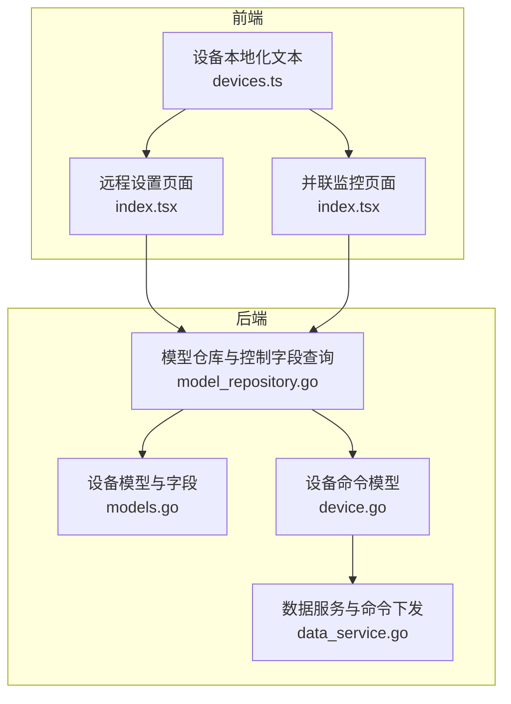
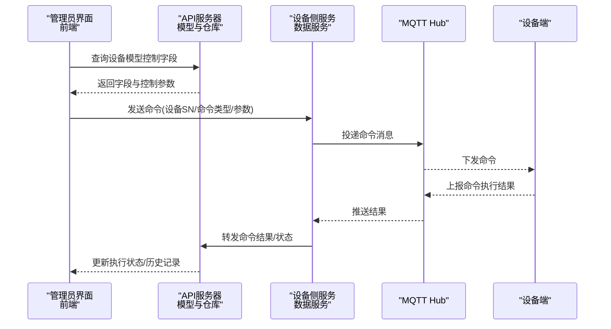
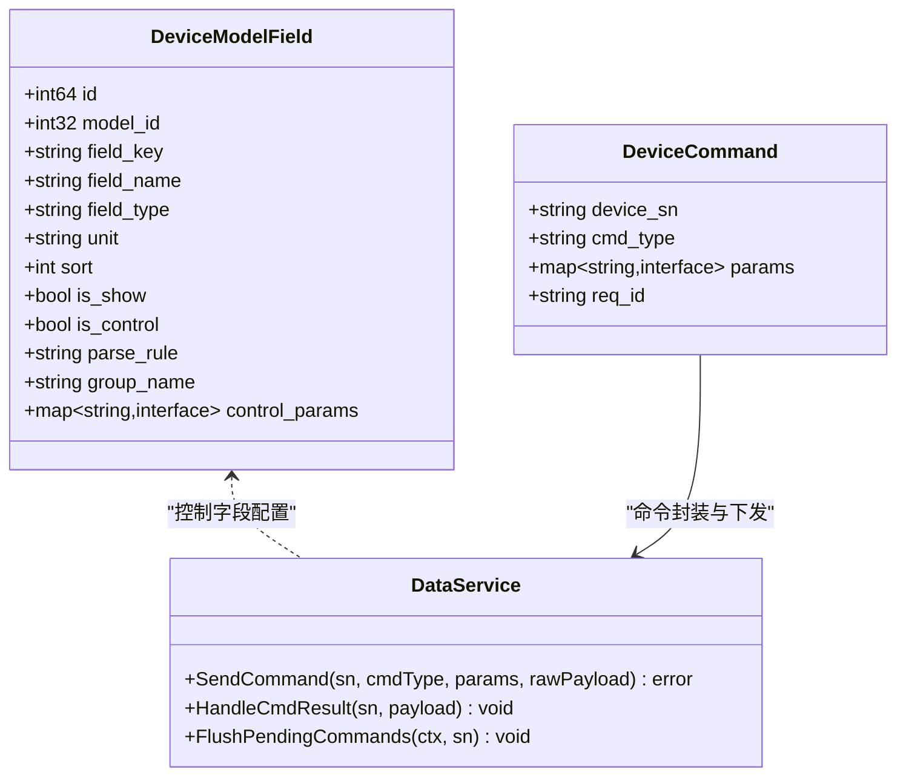
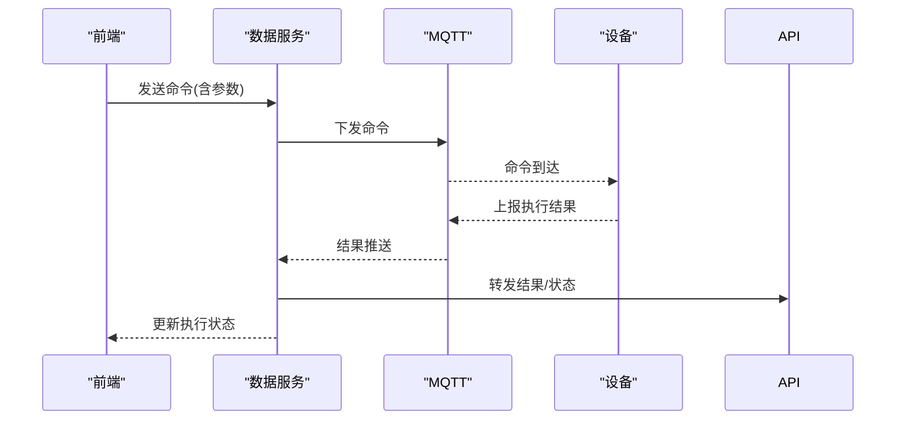
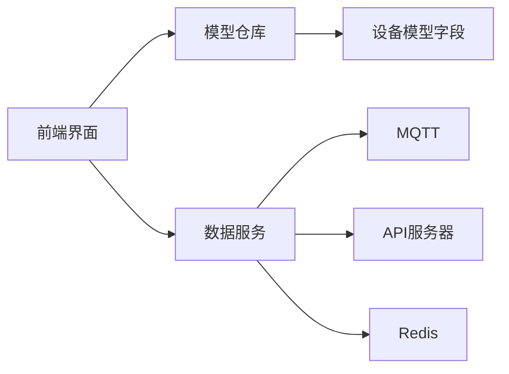

# 发电机控制命令

<cite>
**本文引用的文件**
- [models.go](file://inv_api_server/internal/model/models.go)
- [model_repository.go](file://inv_api_server/internal/repository/model_repository.go)
- [device.go](file://inv_device_server/internal/model/device.go)
- [data_service.go](file://inv_device_server/internal/service/data_service.go)
- [devices.ts](file://inv_admin_frontend/src/locales/devices.ts)
- [index.tsx](file://inv_admin_frontend/src/pages/remote-settings/index.tsx)
- [index.tsx](file://inv_admin_frontend/src/pages/parallel/index.tsx)
</cite>

## 目录
1. [引言](#引言)
2. [项目结构](#项目结构)
3. [核心组件](#核心组件)
4. [架构总览](#架构总览)
5. [详细组件分析](#详细组件分析)
6. [依赖分析](#依赖分析)
7. [性能考虑](#性能考虑)
8. [故障排查指南](#故障排查指南)
9. [结论](#结论)
10. [附录](#附录)

## 引言
本技术文档面向系统集成商与开发者，系统性阐述“云端向发电机（逆变器）系统下发控制命令”的完整流程与规范。重点覆盖两类核心命令：
- 发电机启停控制命令：用于开启/关闭发电单元
- 最大输出功率限制命令：用于设置有功功率上限

文档将从命令的JSON结构、参数定义、取值范围与单位换算、工作原理与功率调节机制、安全保护与故障处理策略、以及系统集成与运行优化等方面进行深入解析，并提供可操作的配置建议与使用示例。

## 项目结构
围绕“发电机控制命令”的实现，涉及以下模块：
- 后端模型与仓库层：定义设备模型字段、控制参数与协议解析规则
- 设备侧服务层：负责命令下发、结果回传与状态同步
- 前端本地化与页面：展示控制命令模板、参数范围提示与执行反馈
- 并联与远程设置页面：体现功率、频率、无功等控制参数的实际应用

**图表来源**
- [models.go:237-250](file://inv_api_server/internal/model/models.go#L237-L250)
- [model_repository.go:117-143](file://inv_api_server/internal/repository/model_repository.go#L117-L143)
- [device.go:144-150](file://inv_device_server/internal/model/device.go#L144-L150)
- [data_service.go:66-75](file://inv_device_server/internal/service/data_service.go#L66-L75)

**章节来源**
- [models.go:237-250](file://inv_api_server/internal/model/models.go#L237-L250)
- [model_repository.go:117-143](file://inv_api_server/internal/repository/model_repository.go#L117-L143)
- [device.go:144-150](file://inv_device_server/internal/model/device.go#L144-L150)
- [data_service.go:66-75](file://inv_device_server/internal/service/data_service.go#L66-L75)

## 核心组件
- 设备模型与字段
  - 控制字段通过设备模型字段表进行配置，支持单位、分组、是否显示、是否控制、解析规则与控制参数等元数据
  - 控制参数用于在前端生成命令模板时提供参数范围、默认值与单位提示
- 设备命令模型
  - 定义下发命令的数据结构：设备序列号、命令类型、参数对象与请求标识
- 数据服务
  - 负责将命令投递至MQTT通道，同时处理命令执行结果回传与设备状态同步
- 前端本地化与页面
  - 提供“模型控制命令”、“设备控制”等界面，展示命令模板与参数范围提示，支持确认执行与历史记录查看

**章节来源**
- [models.go:237-250](file://inv_api_server/internal/model/models.go#L237-L250)
- [model_repository.go:117-143](file://inv_api_server/internal/repository/model_repository.go#L117-L143)
- [device.go:144-150](file://inv_device_server/internal/model/device.go#L144-L150)
- [data_service.go:66-75](file://inv_device_server/internal/service/data_service.go#L66-L75)
- [devices.ts:209-241](file://inv_admin_frontend/src/locales/devices.ts#L209-L241)

## 架构总览
下图展示了从云端到设备侧的命令下发与反馈路径，以及与设备模型配置的耦合关系：

**图表来源**
- [model_repository.go:221-247](file://inv_api_server/internal/repository/model_repository.go#L221-L247)
- [data_service.go:66-75](file://inv_device_server/internal/service/data_service.go#L66-L75)
- [data_service.go:77-125](file://inv_device_server/internal/service/data_service.go#L77-L125)

## 详细组件分析

### 命令模型与字段配置
- 字段级控制能力
  - 通过设备模型字段表的“是否控制”标记，决定该字段是否作为控制命令模板的一部分
  - 控制参数以JSON形式存储，前端据此渲染输入控件、范围与单位
- 关键字段与含义
  - 有功功率设定：用于限制最大输出功率
  - 功率因数/无功功率设定：用于调节无功支撑与电压控制
  - 频率上下限与过频减载：用于电网保护与负载管理
  - 并联系统环流阈值与负载均衡偏差：用于多机并联稳定运行

**图表来源**
- [models.go:237-250](file://inv_api_server/internal/model/models.go#L237-L250)
- [device.go:144-150](file://inv_device_server/internal/model/device.go#L144-L150)
- [data_service.go:66-75](file://inv_device_server/internal/service/data_service.go#L66-L75)

**章节来源**
- [models.go:237-250](file://inv_api_server/internal/model/models.go#L237-L250)
- [model_repository.go:117-143](file://inv_api_server/internal/repository/model_repository.go#L117-L143)
- [device.go:144-150](file://inv_device_server/internal/model/device.go#L144-L150)
- [data_service.go:66-75](file://inv_device_server/internal/service/data_service.go#L66-L75)

### 发电机启停控制命令（gen_enable）
- 命令用途
  - 控制发电单元的启停状态，常用于计划性停机、紧急停机或维护模式
- JSON结构
  - 字段：设备序列号、命令类型、参数对象、请求标识
  - 参数对象包含启停目标状态（如启用/禁用）
- 参数定义与取值范围
  - 目标状态：布尔值（true/false），或枚举值（启用/禁用）
  - 建议在前端以开关控件呈现，配合确认对话框
- 单位与换算
  - 本命令不涉及物理量单位
- 安全要点
  - 停机前应确保负载侧已断开或转入备用电源
  - 启动前需检查绝缘电阻、相序与频率是否正常
- 使用示例（步骤）
  - 在“设备控制”页面选择命令模板
  - 确认设备SN与目标状态
  - 点击“发送”，等待执行结果回传
  - 查看“命令历史”确认成功/失败

**章节来源**
- [devices.ts:209-241](file://inv_admin_frontend/src/locales/devices.ts#L209-L241)
- [device.go:144-150](file://inv_device_server/internal/model/device.go#L144-L150)

### 最大输出功率限制命令（gen_power_limit）
- 命令用途
  - 对有功功率输出进行上限约束，用于削峰填谷、电网调峰或设备保护
- JSON结构
  - 字段：设备序列号、命令类型、参数对象、请求标识
  - 参数对象包含功率上限值与单位
- 参数定义与取值范围
  - 功率上限：数值型，单位通常为瓦（W）或千瓦（kW）
  - 取值范围：应不大于设备额定功率；建议在前端提供“范围提示”
- 单位与换算
  - 若设备额定功率以kW表示，命令参数可直接使用kW或转换为W
- 与系统其他控制的关系
  - 与功率因数/无功功率控制协同，避免过载与电压波动
  - 与频率上下限联动，防止过频/欠频导致的功率限制
- 使用示例（步骤）
  - 在“远程设置”页面选择“有功功率百分比”或“绝对功率”
  - 输入目标功率值，校验范围提示
  - 点击“发送”，观察设备侧实时功率与负载率变化
  - 在“并联监控”页面关注环流与负载均衡

**章节来源**
- [index.tsx:265-288](file://inv_admin_frontend/src/pages/remote-settings/index.tsx#L265-L288)
- [index.tsx:503-549](file://inv_admin_frontend/src/pages/parallel/index.tsx#L503-L549)
- [models.go:118-124](file://inv_api_server/internal/model/models.go#L118-L124)

### 命令下发与执行流程
- 前端模板与参数校验
  - 通过设备模型控制字段获取参数范围与单位
  - 前端进行最小/最大值与单位一致性校验
- 命令投递
  - 数据服务将命令封装为设备命令对象并投递至MQTT通道
- 结果回传与状态同步
  - 设备侧执行完成后，通过命令结果主题回传
  - 数据服务将结果转发至API服务器，更新命令日志与通知

**图表来源**
- [data_service.go:66-75](file://inv_device_server/internal/service/data_service.go#L66-L75)
- [data_service.go:77-125](file://inv_device_server/internal/service/data_service.go#L77-L125)

**章节来源**
- [data_service.go:66-75](file://inv_device_server/internal/service/data_service.go#L66-L75)
- [data_service.go:77-125](file://inv_device_server/internal/service/data_service.go#L77-L125)

### 发电机工作原理与功率调节机制
- 有功功率调节
  - 通过限制最大输出功率实现削峰或按调度曲线运行
  - 与负载侧功率平衡密切相关，需结合实时负载监测
- 无功功率与功率因数
  - 通过恒功率因数、恒无功或“电压/无功”特性曲线实现无功支撑
  - 与频率控制联动，避免过频/欠频导致的功率限制
- 并联系统
  - 多台机组通过主从控制与环流抑制实现稳定运行
  - 关注环流阈值与负载均衡偏差，防止环流过大引发过热

**章节来源**
- [index.tsx:265-288](file://inv_admin_frontend/src/pages/remote-settings/index.tsx#L265-L288)
- [index.tsx:503-549](file://inv_admin_frontend/src/pages/parallel/index.tsx#L503-L549)

## 依赖分析
- 组件耦合
  - 前端通过模型仓库查询控制字段，形成“配置驱动”的命令模板
  - 数据服务依赖MQTT通道与API服务器内部接口，完成命令投递与结果回传
- 外部依赖
  - MQTT消息总线用于命令与结果的异步传输
  - Redis用于在线状态与积压命令队列管理

**图表来源**
- [model_repository.go:117-143](file://inv_api_server/internal/repository/model_repository.go#L117-L143)
- [data_service.go:66-75](file://inv_device_server/internal/service/data_service.go#L66-L75)

**章节来源**
- [model_repository.go:117-143](file://inv_api_server/internal/repository/model_repository.go#L117-L143)
- [data_service.go:66-75](file://inv_device_server/internal/service/data_service.go#L66-L75)

## 性能考虑
- 命令下发吞吐
  - 批量设备控制时，建议采用队列与限速策略，避免瞬时拥塞
- 结果回传处理
  - 对高频命令结果采用去重与合并策略，降低后端压力
- 缓存与离线队列
  - 利用Redis缓存设备在线状态与积压命令，设备上线后顺序下发

[本节为通用指导，无需特定文件引用]

## 故障排查指南
- 命令未生效
  - 检查设备在线状态与MQTT连接
  - 确认命令参数范围与单位一致
  - 查看命令历史与设备告警
- 执行超时
  - 检查网络延迟与API服务器内部密钥配置
  - 观察设备侧是否长时间无响应
- 并联系统异常
  - 关注环流阈值与负载均衡偏差
  - 核对频率上下限与过频减载设置

**章节来源**
- [data_service.go:127-168](file://inv_device_server/internal/service/data_service.go#L127-L168)
- [index.tsx:503-549](file://inv_admin_frontend/src/pages/parallel/index.tsx#L503-L549)

## 结论
本文档基于现有代码库梳理了“发电机控制命令”的模型、下发与执行链路，并结合前端页面与设备模型配置，给出了启停与功率限制两类命令的结构化描述、参数范围与单位换算、工作原理与安全要点。建议在实际部署中：
- 明确设备模型字段与控制参数，确保前端模板与设备侧一致
- 严格参数校验与范围提示，避免误设导致设备保护动作
- 结合并联系统与电网特性，制定合理的频率与无功控制策略
- 建立完善的命令历史与告警追踪机制，提升运维效率

[本节为总结，无需特定文件引用]

## 附录

### 命令参数参考表（示例）
- gen_enable
  - 参数：enable（布尔/枚举）
  - 取值范围：true/false 或 启用/禁用
  - 单位：无
- gen_power_limit
  - 参数：active_power_setting（数值）
  - 取值范围：0 到 设备额定功率
  - 单位：W 或 kW（根据设备模型配置）

**章节来源**
- [models.go:118-124](file://inv_api_server/internal/model/models.go#L118-L124)
- [index.tsx:265-288](file://inv_admin_frontend/src/pages/remote-settings/index.tsx#L265-L288)