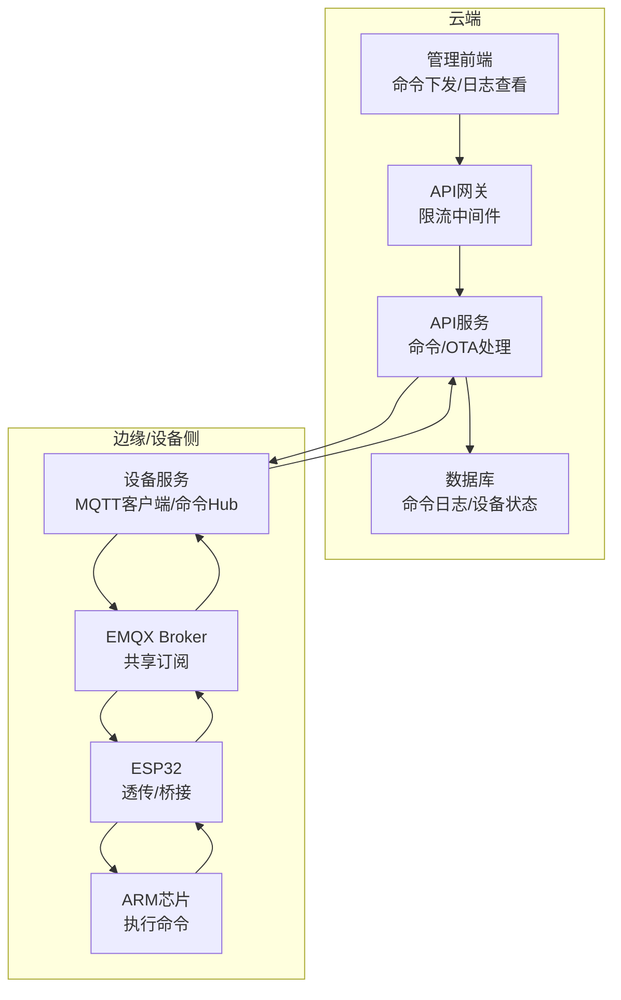
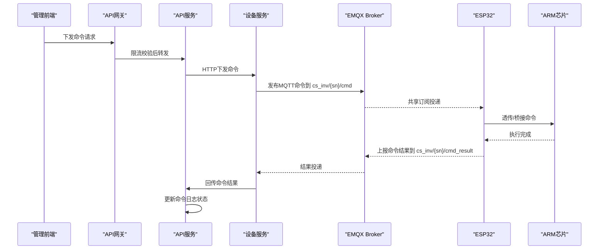
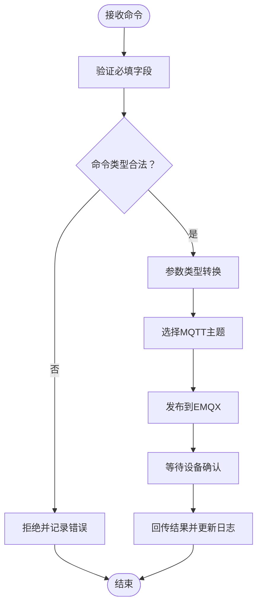
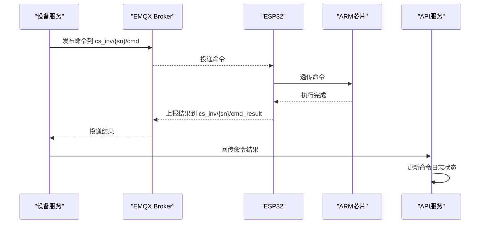
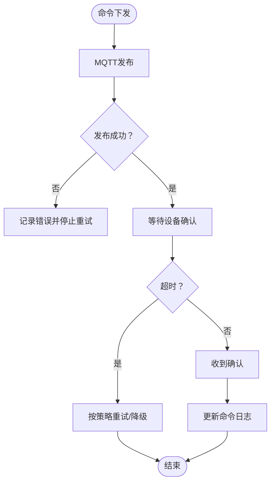
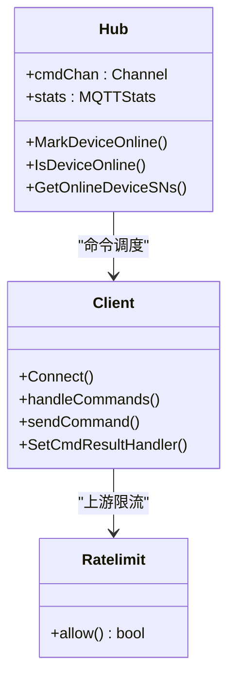
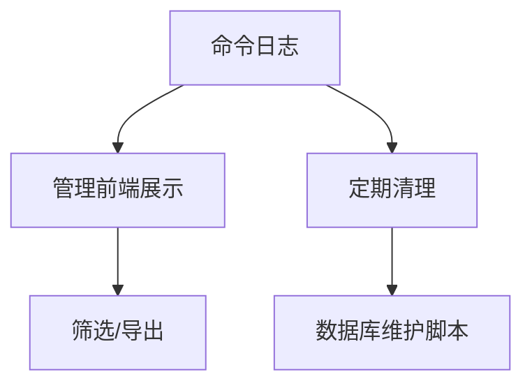
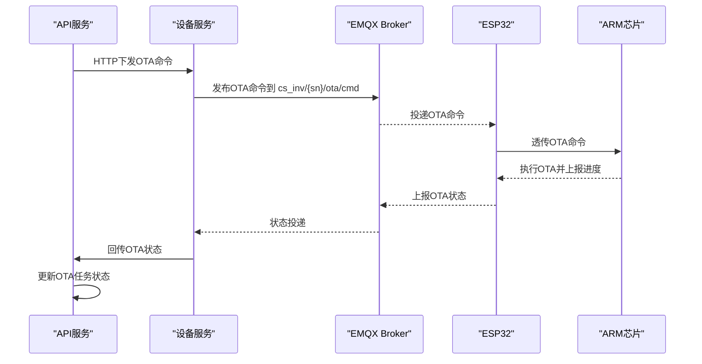
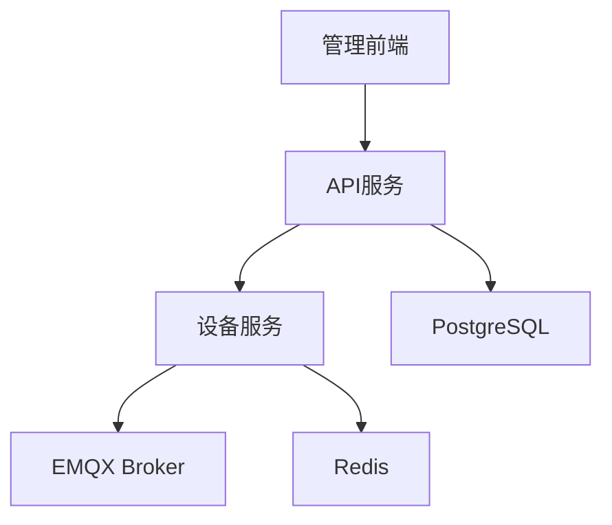

# 命令执行流程

<cite>
**本文引用的文件**
- [inv_device_server/internal/mqtt/client.go](file://inv_device_server/internal/mqtt/client.go)
- [inv_device_server/internal/model/device.go](file://inv_device_server/internal/model/device.go)
- [inv_device_server/internal/service/protocol_parser.go](file://inv_device_server/internal/service/protocol_parser.go)
- [inv_api_server/internal/service/ota_service.go](file://inv_api_server/internal/service/ota_service.go)
- [inv_api_server/internal/repository/repositories.go](file://inv_api_server/internal/repository/repositories.go)
- [inv-admin-frontend/src/pages/remote-settings/index.tsx](file://inv-admin-frontend/src/pages/remote-settings/index.tsx)
- [inv-admin-frontend/src/pages/operation-logs/index.tsx](file://inv-admin-frontend/src/pages/operation-logs/index.tsx)
- [deploy/scripts/db_maintenance.sh](file://deploy/scripts/db_maintenance.sh)
- [api-gateway/internal/middleware/ratelimit.go](file://api-gateway/internal/middleware/ratelimit.go)
- [README.md](file://README.md)
</cite>

## 目录
1. [简介](#简介)
2. [项目结构](#项目结构)
3. [核心组件](#核心组件)
4. [架构总览](#架构总览)
5. [详细组件分析](#详细组件分析)
6. [依赖关系分析](#依赖关系分析)
7. [性能考虑](#性能考虑)
8. [故障排查指南](#故障排查指南)
9. [结论](#结论)
10. [附录](#附录)

## 简介
本文面向系统集成商与开发者，全面阐述“云端命令从下发到执行”的完整技术流程：云端通过MQTT发布命令→ESP32接收并透传→ARM芯片执行命令→执行结果反馈。文档覆盖命令格式规范、参数验证规则与数据类型转换、确认机制、超时与重试策略、状态监控与诊断、命令优先级与并发控制、以及调试工具与性能优化建议。

## 项目结构
系统采用“云侧API网关/REST → 设备侧MQTT”双通道协同架构，核心模块包括：
- 云端API服务：负责命令编排、OTA推送、命令日志与审计
- 设备侧设备服务：负责MQTT连接、命令下发、结果回传与解析
- 前端管理端：提供命令下发界面、执行状态与日志查看
- 运维脚本：数据库维护、服务监控与限流中间件

**图示来源**
- [README.md:206-250](file://README.md#L206-L250)
- [api-gateway/internal/middleware/ratelimit.go:1-93](file://api-gateway/internal/middleware/ratelimit.go#L1-L93)
- [inv_device_server/internal/mqtt/client.go:146-257](file://inv_device_server/internal/mqtt/client.go#L146-L257)

**章节来源**
- [README.md:33-109](file://README.md#L33-L109)
- [README.md:206-250](file://README.md#L206-L250)

## 核心组件
- MQTT客户端与Hub：负责建立EMQX连接、订阅共享主题、将待发命令入队、按SN路由至对应主题并发送
- 命令模型：统一的命令结构体，包含设备SN、命令类型、参数与请求ID
- 命令响应模型：统一的响应结构体，包含任务ID、命令、成功标志、消息、数据与时间戳
- 协议解析器：负责解析设备上报的命令响应，并回传至内部接口
- OTA服务：负责构造OTA命令并通过HTTP下发至设备服务
- 命令日志仓储：负责插入/更新命令状态与结果，支持前端查询展示

**章节来源**
- [inv_device_server/internal/mqtt/client.go:20-144](file://inv_device_server/internal/mqtt/client.go#L20-L144)
- [inv_device_server/internal/model/device.go:128-150](file://inv_device_server/internal/model/device.go#L128-L150)
- [inv_device_server/internal/service/protocol_parser.go:741-775](file://inv_device_server/internal/service/protocol_parser.go#L741-L775)
- [inv_api_server/internal/service/ota_service.go:183-231](file://inv_api_server/internal/service/ota_service.go#L183-L231)
- [inv_api_server/internal/repository/repositories.go:1739-1766](file://inv_api_server/internal/repository/repositories.go#L1739-L1766)

## 架构总览
云端命令执行链路分为两条路径：
- 通用命令路径：API服务接收命令→设备服务MQTT下发→设备执行→结果回传→API服务更新日志
- OTA命令路径：API服务构造OTA命令→通过HTTP下发→设备服务MQTT下发→设备执行→OTA状态回传→API服务更新任务

**图示来源**
- [inv_device_server/internal/mqtt/client.go:270-331](file://inv_device_server/internal/mqtt/client.go#L270-L331)
- [inv_device_server/internal/service/protocol_parser.go:741-775](file://inv_device_server/internal/service/protocol_parser.go#L741-L775)
- [inv_api_server/internal/service/ota_service.go:183-231](file://inv_api_server/internal/service/ota_service.go#L183-L231)

## 详细组件分析

### 命令格式规范与参数验证
- 命令结构
  - 设备SN：用于路由与唯一标识
  - 命令类型：如“start”、“reset”、“set_params”等
  - 参数：以键值对形式传递，支持嵌套对象或数值
  - 请求ID：用于关联下发与回传
- 参数验证规则
  - 必填字段：设备SN、命令类型
  - 命令类型白名单：仅允许已知命令类型
  - 参数类型转换：字符串/数值/布尔需按目标设备期望进行转换
  - OTA命令：包含目标芯片、下载地址、版本、文件校验信息
- 命令主题选择
  - OTA命令：专用主题 cs_inv/{sn}/ota/cmd
  - 其他命令：通用主题 cs_inv/{sn}/cmd

**图示来源**
- [inv_device_server/internal/mqtt/client.go:270-331](file://inv_device_server/internal/mqtt/client.go#L270-L331)
- [inv_device_server/internal/model/device.go:144-150](file://inv_device_server/internal/model/device.go#L144-L150)

**章节来源**
- [inv_device_server/internal/model/device.go:128-150](file://inv_device_server/internal/model/device.go#L128-L150)
- [inv_device_server/internal/mqtt/client.go:270-331](file://inv_device_server/internal/mqtt/client.go#L270-L331)

### 命令下发与确认机制
- 下发流程
  - 设备服务Hub接收命令，入队并异步发送
  - MQTT客户端根据命令类型选择主题并发布
  - 发布计数与在线设备统计纳入监控指标
- 确认机制
  - 设备在执行完成后，通过 cs_inv/{sn}/cmd_result 主题上报结果
  - 协议解析器解析响应，兼容新旧字段映射
  - 通过内部接口回传结果，API服务更新命令日志状态

**图示来源**
- [inv_device_server/internal/mqtt/client.go:270-331](file://inv_device_server/internal/mqtt/client.go#L270-L331)
- [inv_device_server/internal/service/protocol_parser.go:741-775](file://inv_device_server/internal/service/protocol_parser.go#L741-L775)

**章节来源**
- [inv_device_server/internal/mqtt/client.go:259-268](file://inv_device_server/internal/mqtt/client.go#L259-L268)
- [inv_device_server/internal/service/protocol_parser.go:741-775](file://inv_device_server/internal/service/protocol_parser.go#L741-L775)

### 超时处理与重试策略
- MQTT发布重试
  - 发布失败时记录错误并终止本次发送，避免无限循环
- 设备离线检测
  - 通过Redis在线状态表判断设备是否在线，超时阈值为固定秒数
- 解析器重试
  - Kafka/Redis Streams消费失败时，最多重试固定次数后丢弃并提交偏移
- 命令日志清理
  - 定期清理命令日志，避免历史堆积影响查询性能

**图示来源**
- [inv_device_server/internal/mqtt/client.go:270-331](file://inv_device_server/internal/mqtt/client.go#L270-L331)
- [inv_device_server/internal/service/protocol_parser.go:103-135](file://inv_device_server/internal/service/protocol_parser.go#L103-L135)
- [deploy/scripts/db_maintenance.sh:30-31](file://deploy/scripts/db_maintenance.sh#L30-L31)

**章节来源**
- [inv_device_server/internal/service/protocol_parser.go:103-135](file://inv_device_server/internal/service/protocol_parser.go#L103-L135)
- [deploy/scripts/db_maintenance.sh:30-31](file://deploy/scripts/db_maintenance.sh#L30-L31)

### 命令优先级管理与并发控制
- 命令优先级
  - 通过命令类型区分紧急程度（如OTA升级、设备复位等）
  - OTA命令使用专用主题，避免与普通命令争抢带宽
- 并发控制
  - Hub内部命令通道容量较大，避免阻塞主流程
  - MQTT客户端异步发送，减少主线程阻塞
  - API网关内置令牌桶限流中间件，防止突发流量冲击后端

**图示来源**
- [inv_device_server/internal/mqtt/client.go:47-144](file://inv_device_server/internal/mqtt/client.go#L47-L144)
- [api-gateway/internal/middleware/ratelimit.go:12-62](file://api-gateway/internal/middleware/ratelimit.go#L12-L62)

**章节来源**
- [inv_device_server/internal/mqtt/client.go:72-144](file://inv_device_server/internal/mqtt/client.go#L72-L144)
- [api-gateway/internal/middleware/ratelimit.go:12-62](file://api-gateway/internal/middleware/ratelimit.go#L12-L62)

### 执行状态监控与错误诊断
- 前端状态映射
  - 等待、排队、已发送、设备确认、成功、失败、超时
- 命令日志查询
  - 支持按设备SN、时间段、状态筛选，导出CSV便于审计
- 运维脚本
  - 定期清理命令日志，保持数据库健康
  - 服务监控脚本可自动重启异常服务并告警

**图示来源**
- [inv-admin-frontend/src/pages/operation-logs/index.tsx:112-136](file://inv-admin-frontend/src/pages/operation-logs/index.tsx#L112-L136)
- [inv-admin-frontend/src/pages/operation-logs/index.tsx:400-440](file://inv-admin-frontend/src/pages/operation-logs/index.tsx#L400-L440)
- [deploy/scripts/db_maintenance.sh:30-31](file://deploy/scripts/db_maintenance.sh#L30-L31)

**章节来源**
- [inv-admin-frontend/src/pages/operation-logs/index.tsx:112-136](file://inv-admin-frontend/src/pages/operation-logs/index.tsx#L112-L136)
- [inv-admin-frontend/src/pages/operation-logs/index.tsx:400-440](file://inv-admin-frontend/src/pages/operation-logs/index.tsx#L400-L440)
- [deploy/scripts/db_maintenance.sh:30-31](file://deploy/scripts/db_maintenance.sh#L30-L31)

### OTA命令执行流程
- 命令构造
  - 包含目标芯片、下载地址、版本、文件校验信息与任务ID
- 下发方式
  - 通过HTTP请求直接下发至设备服务，再由MQTT发布
- 状态回传
  - 设备上报OTA状态，API服务更新任务状态

**图示来源**
- [inv_api_server/internal/service/ota_service.go:183-231](file://inv_api_server/internal/service/ota_service.go#L183-L231)
- [inv_device_server/internal/mqtt/client.go:270-331](file://inv_device_server/internal/mqtt/client.go#L270-L331)

**章节来源**
- [inv_api_server/internal/service/ota_service.go:183-231](file://inv_api_server/internal/service/ota_service.go#L183-L231)

## 依赖关系分析
- 组件耦合
  - 设备服务与EMQX强耦合，依赖共享订阅实现高可用
  - API服务与设备服务通过HTTP交互，降低耦合度
- 外部依赖
  - Redis用于在线状态与缓存
  - PostgreSQL存储命令日志与设备状态
  - EMQX提供消息路由与持久化能力

**图示来源**
- [README.md:206-250](file://README.md#L206-L250)
- [inv_device_server/internal/mqtt/client.go:146-257](file://inv_device_server/internal/mqtt/client.go#L146-L257)

**章节来源**
- [README.md:206-250](file://README.md#L206-L250)

## 性能考虑
- 命令通道容量与背压
  - Hub内部通道容量较大，避免阻塞；可根据设备规模调整
- MQTT QoS与主题分区
  - 使用QoS 1保证可靠投递；OTA与普通命令分离主题，避免相互影响
- 限流与削峰
  - API网关限流中间件可有效抑制突发流量
- 数据库维护
  - 定期清理命令日志，避免历史数据膨胀影响查询性能

[本节为通用指导，无需具体文件引用]

## 故障排查指南
- 命令未送达
  - 检查设备是否在线（Redis在线表）、EMQX连接状态、主题是否正确
- 命令未确认
  - 检查设备是否正常执行、结果主题是否可达、解析器是否正常工作
- 日志缺失
  - 检查命令日志插入/更新逻辑、数据库清理策略
- 服务异常
  - 使用运维脚本检查服务状态与端口，必要时重启服务

**章节来源**
- [inv_device_server/internal/mqtt/client.go:89-104](file://inv_device_server/internal/mqtt/client.go#L89-L104)
- [inv_device_server/internal/service/protocol_parser.go:103-135](file://inv_device_server/internal/service/protocol_parser.go#L103-L135)
- [deploy/scripts/db_maintenance.sh:30-31](file://deploy/scripts/db_maintenance.sh#L30-L31)

## 结论
本文系统梳理了从云端到设备端的命令执行全链路，明确了命令格式、参数验证、确认机制、超时与重试、状态监控与诊断、优先级与并发控制，并提供了调试工具与性能优化建议。建议在生产环境中结合限流、日志清理与监控告警，确保命令执行的可靠性与可观测性。

[本节为总结性内容，无需具体文件引用]

## 附录
- 命令状态映射参考
  - 等待、排队、已发送、设备确认、成功、失败、超时
- 前端操作要点
  - 通过管理前端下发命令，查看命令历史与导出日志
- 运维建议
  - 定期运行数据库维护脚本，保持系统健康

**章节来源**
- [inv-admin-frontend/src/pages/operation-logs/index.tsx:112-136](file://inv-admin-frontend/src/pages/operation-logs/index.tsx#L112-L136)
- [inv-admin-frontend/src/pages/remote-settings/index.tsx:61-106](file://inv-admin-frontend/src/pages/remote-settings/index.tsx#L61-L106)
- [deploy/scripts/db_maintenance.sh:30-31](file://deploy/scripts/db_maintenance.sh#L30-L31)