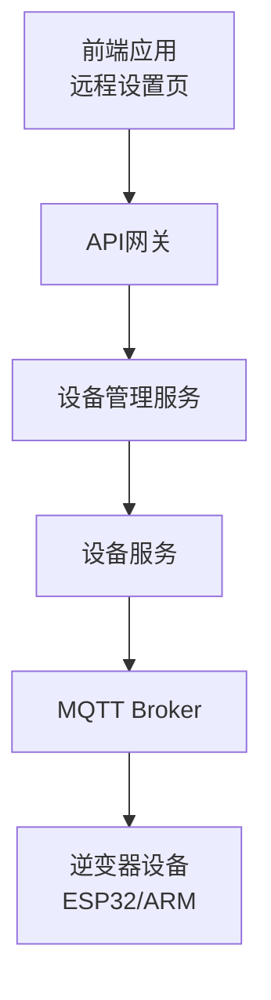
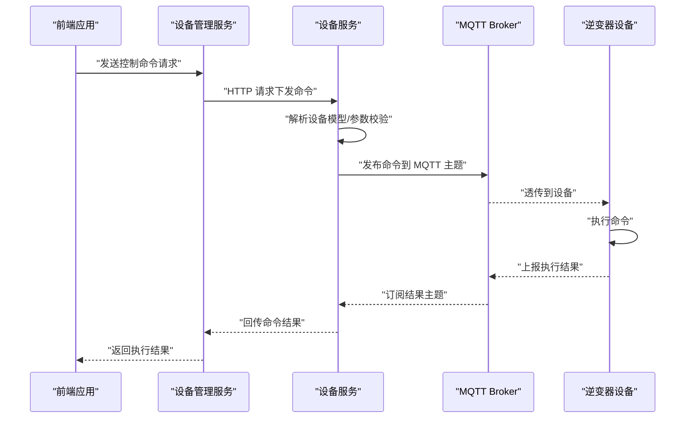
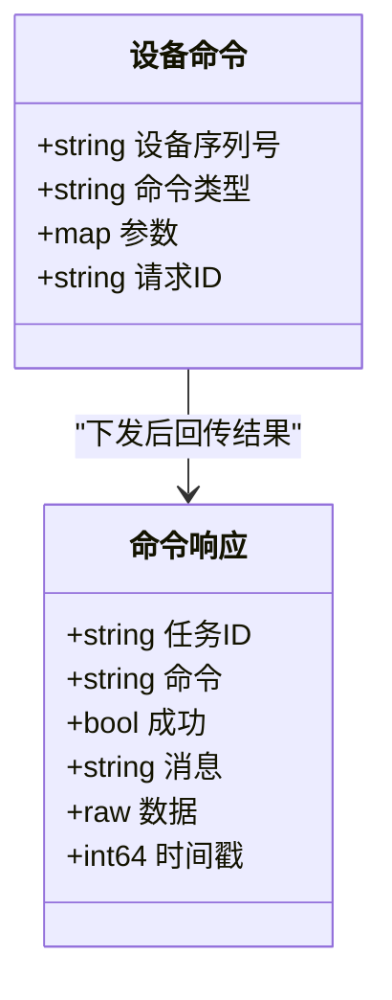

# 逆变器控制命令

<cite>
**本文引用的文件**
- [inv_device_server/internal/service/protocol_parser.go](file://inv_device_server/internal/service/protocol_parser.go)
- [inv_device_server/internal/service/protocol_adapter.go](file://inv_device_server/internal/service/protocol_adapter.go)
- [inv_device_server/internal/model/device.go](file://inv_device_server/internal/model/device.go)
- [inv_api_server/internal/repository/model_repository.go](file://inv_api_server/internal/repository/model_repository.go)
- [inv_api_server/internal/model/models.go](file://inv_api_server/internal/model/models.go)
- [inv_api_server/internal/service/ota_service.go](file://inv_api_server/internal/service/ota_service.go)
- [inv-admin-frontend/src/pages/remote-settings/index.tsx](file://inv-admin-frontend/src/pages/remote-settings/index.tsx)
- [inv-admin-frontend/src/pages/remote-settings/index.tsx](file://inv-admin-frontend/src/pages/remote-settings/index.tsx)
- [inv-admin-frontend/src/locales/devices.ts](file://inv-admin-frontend/src/locales/devices.ts)
- [docs/MQTT接口文档.md](file://docs/MQTT接口文档.md)
- [deploy/monitor.sh](file://deploy/monitor.sh)
</cite>

## 目录
1. [引言](#引言)
2. [项目结构](#项目结构)
3. [核心组件](#核心组件)
4. [架构总览](#架构总览)
5. [详细组件分析](#详细组件分析)
6. [依赖分析](#依赖分析)
7. [性能考虑](#性能考虑)
8. [故障排查指南](#故障排查指南)
9. [结论](#结论)
10. [附录](#附录)

## 引言
本文件面向系统集成商与开发者，系统性梳理从云端到逆变器的控制命令体系，覆盖命令类型、JSON格式、参数定义、取值范围、单位换算、执行流程、参数校验与错误处理、优先级与超时重试机制，并提供使用示例与最佳实践。文档基于仓库中实际实现与前端界面参数定义进行整理，确保可落地与可验证。

## 项目结构
该系统采用分层架构：
- 云端侧：API 网关与设备管理服务负责命令下发与状态管理
- 边缘侧：设备服务负责协议解析、消息转发与内部调度
- 设备侧：ESP32/ARM 端接收并执行命令
- 前端：远程设置页面提供命令模板与参数输入

图表来源
- [inv_device_server/internal/service/protocol_parser.go:1-61](file://inv_device_server/internal/service/protocol_parser.go#L1-L61)
- [inv_api_server/internal/service/ota_service.go:185-231](file://inv_api_server/internal/service/ota_service.go#L185-L231)
- [docs/MQTT接口文档.md](file://docs/MQTT接口文档.md)

章节来源
- [inv_device_server/internal/service/protocol_parser.go:1-61](file://inv_device_server/internal/service/protocol_parser.go#L1-L61)
- [inv_api_server/internal/service/ota_service.go:185-231](file://inv_api_server/internal/service/ota_service.go#L185-L231)
- [docs/MQTT接口文档.md](file://docs/MQTT接口文档.md)

## 核心组件
- 协议解析器：负责从 Kafka 消息解码为统一结构，解析设备模型与控制参数，构建命令下发请求
- 协议适配器：支持 JSON 与 Modbus 等多种协议的载荷解析
- 设备模型与字段：通过数据库模型定义字段类型、单位、是否控制项与控制参数
- 命令模型：统一的命令结构体，包含设备序列号、命令类型与参数
- 命令响应：统一的命令下发结果结构，包含成功/失败、消息与数据

章节来源
- [inv_device_server/internal/service/protocol_parser.go:24-61](file://inv_device_server/internal/service/protocol_parser.go#L24-L61)
- [inv_device_server/internal/service/protocol_adapter.go:1-49](file://inv_device_server/internal/service/protocol_adapter.go#L1-L49)
- [inv_device_server/internal/model/device.go:128-150](file://inv_device_server/internal/model/device.go#L128-L150)
- [inv_api_server/internal/repository/model_repository.go:117-143](file://inv_api_server/internal/repository/model_repository.go#L117-L143)
- [inv_api_server/internal/model/models.go:237-250](file://inv_api_server/internal/model/models.go#L237-L250)

## 架构总览
云端命令下发到逆变器的端到端流程如下：

图表来源
- [inv_api_server/internal/service/ota_service.go:185-231](file://inv_api_server/internal/service/ota_service.go#L185-L231)
- [inv_device_server/internal/service/protocol_parser.go:103-135](file://inv_device_server/internal/service/protocol_parser.go#L103-L135)
- [docs/MQTT接口文档.md](file://docs/MQTT接口文档.md)

## 详细组件分析

### 命令模型与数据结构
- 设备命令结构：包含设备序列号、命令类型与参数对象
- 命令响应结构：包含任务标识、命令、成功标志、消息与数据，以及时间戳等

图表来源
- [inv_device_server/internal/model/device.go:128-150](file://inv_device_server/internal/model/device.go#L128-L150)

章节来源
- [inv_device_server/internal/model/device.go:128-150](file://inv_device_server/internal/model/device.go#L128-L150)

### 协议解析与适配
- JSON 适配器：直接将载荷反序列化为键值对，便于后续解析与转发
- Modbus 适配器：根据设备模型字段映射规则解析 Modbus 寄存器值
- 解析引擎：结合设备模型字段与解析规则，生成标准参数集

章节来源
- [inv_device_server/internal/service/protocol_adapter.go:1-49](file://inv_device_server/internal/service/protocol_adapter.go#L1-L49)
- [inv_device_server/internal/service/protocol_parser.go:29-61](file://inv_device_server/internal/service/protocol_parser.go#L29-L61)

### 设备模型与控制参数
- 字段定义：字段键、名称、类型、单位、排序、是否显示、是否控制、解析规则、分组与控制参数
- 控制参数：前端远程设置页展示的参数集合，如功率百分比、频率上下限、功率因数、无功功率模式等

章节来源
- [inv_api_server/internal/model/models.go:237-250](file://inv_api_server/internal/model/models.go#L237-L250)
- [inv_api_server/internal/repository/model_repository.go:117-143](file://inv_api_server/internal/repository/model_repository.go#L117-L143)
- [inv-admin-frontend/src/pages/remote-settings/index.tsx:265-367](file://inv-admin-frontend/src/pages/remote-settings/index.tsx#L265-L367)

### 命令执行流程与优先级
- 执行流程：前端提交 → API 校验 → 设备服务解析与转发 → MQTT 透传 → 设备执行 → 结果回传
- 优先级：系统未显式定义命令优先级；建议在设备端依据业务语义实现（如紧急断电优先于功率限制）
- 超时与重试：设备服务对消息处理失败具备最大重试次数与去重机制；云端可结合设备状态轮询或订阅结果主题实现超时检测

章节来源
- [inv_device_server/internal/service/protocol_parser.go:103-135](file://inv_device_server/internal/service/protocol_parser.go#L103-L135)

### 参数校验与错误处理
- 参数校验：前端表单控件限定取值范围与步长，设备服务解析阶段进行类型与必填校验
- 错误处理：解析失败记录日志并丢弃消息；设备服务内部重试达到上限后提交并清理计数；云端返回错误码与错误信息

章节来源
- [inv_device_server/internal/service/protocol_parser.go:103-135](file://inv_device_server/internal/service/protocol_parser.go#L103-L135)
- [inv-admin-frontend/src/pages/remote-settings/index.tsx:265-367](file://inv-admin-frontend/src/pages/remote-settings/index.tsx#L265-L367)

### 命令类型与参数定义

以下为基于前端参数与设备模型字段的常见控制命令分类与参数说明。注意：具体命令键名以设备模型字段中的 field_key 为准，不同设备型号可能差异较大。

- 交流输出控制
  - ac_on / ac_off
  - 参数：无
  - 取值：布尔值
  - 单位：无
  - 说明：开启/关闭交流输出

- 功率限制设置
  - set_power_limit
  - 参数：active_power_pct（百分比）
  - 取值：0–100
  - 单位：%
  - 说明：设定有功功率限制百分比

- 充放电限制设置
  - set_charge_limit / set_discharge_limit
  - 参数：charge_power_pct / discharge_power_pct（百分比）
  - 取值：0–100
  - 单位：%
  - 说明：设定充电/放电功率限制百分比

- 功率因数与无功功率
  - set_pf / set_reactive
  - 参数：
    - pf_setting（功率因数，-1~1）
    - reactive_power_mode（无功功率模式，枚举）
  - 取值：pf_setting -1~1；模式枚举见前端选项
  - 单位：无
  - 说明：设定功率因数或无功功率控制模式

- SOC 保护设置
  - set_soc_low / set_soc_high
  - 参数：gridtied_cutoff_soc / offgrid_cutoff_soc（百分比）
  - 取值：0–100
  - 单位：%
  - 说明：设定并网/离网截止 SOC 百分比

- 强制充放电
  - force_charge / force_discharge
  - 参数：forced_charge_power_pct / forced_discharge_power_pct（百分比）
  - 取值：0–100
  - 单位：%
  - 说明：强制开启充电/放电及其功率百分比

- 电网充电使能
  - grid_charge_enable
  - 参数：ac_charge_enable（布尔），ac_charge_power_pct（百分比）
  - 取值：布尔；0–100
  - 单位：%
  - 说明：允许/禁止交流充电及设定交流充电功率百分比

- 工作模式切换
  - eco_mode
  - 参数：无
  - 取值：布尔或模式枚举（视设备模型而定）
  - 单位：无
  - 说明：切换至经济/节能模式

- 设备重启
  - restart
  - 参数：无
  - 取值：无
  - 单位：无
  - 说明：重启设备

章节来源
- [inv-admin-frontend/src/pages/remote-settings/index.tsx:265-367](file://inv-admin-frontend/src/pages/remote-settings/index.tsx#L265-L367)
- [inv-admin-frontend/src/pages/remote-settings/index.tsx:108-134](file://inv-admin-frontend/src/pages/remote-settings/index.tsx#L108-L134)
- [inv_api_server/internal/model/models.go:237-250](file://inv_api_server/internal/model/models.go#L237-L250)

### 命令下发与结果反馈
- 下发方式：设备服务通过 HTTP 向设备服务器发起命令请求，负载为统一的设备命令结构
- 结果反馈：设备执行完成后通过 MQTT 上报命令结果，设备服务订阅并回传至云端

章节来源
- [inv_api_server/internal/service/ota_service.go:185-231](file://inv_api_server/internal/service/ota_service.go#L185-L231)
- [inv_device_server/internal/model/device.go:128-150](file://inv_device_server/internal/model/device.go#L128-L150)

## 依赖分析
- 设备模型依赖：前端参数来源于设备模型字段定义，字段控制参数决定参数范围与单位
- 协议适配依赖：JSON/Modbus 适配器依赖设备模型字段映射规则
- 命令流转依赖：设备服务依赖 MQTT 进行命令透传与结果回传

图表来源
- [inv_api_server/internal/repository/model_repository.go:117-143](file://inv_api_server/internal/repository/model_repository.go#L117-L143)
- [inv_device_server/internal/service/protocol_adapter.go:1-49](file://inv_device_server/internal/service/protocol_adapter.go#L1-L49)
- [inv_device_server/internal/service/protocol_parser.go:29-61](file://inv_device_server/internal/service/protocol_parser.go#L29-L61)

章节来源
- [inv_api_server/internal/repository/model_repository.go:117-143](file://inv_api_server/internal/repository/model_repository.go#L117-L143)
- [inv_device_server/internal/service/protocol_adapter.go:1-49](file://inv_device_server/internal/service/protocol_adapter.go#L1-L49)
- [inv_device_server/internal/service/protocol_parser.go:29-61](file://inv_device_server/internal/service/protocol_parser.go#L29-L61)

## 性能考虑
- 消息处理重试：设备服务对失败消息进行最多三次重试并去重，降低瞬时异常影响
- 缓存刷新：定期刷新设备模型缓存，避免频繁访问数据库
- 健康监控：部署脚本提供服务健康检查与自动重启能力，保障链路稳定性

章节来源
- [inv_device_server/internal/service/protocol_parser.go:103-135](file://inv_device_server/internal/service/protocol_parser.go#L103-L135)
- [deploy/monitor.sh:1-53](file://deploy/monitor.sh#L1-L53)

## 故障排查指南
- 命令未生效
  - 检查设备在线状态与 MQTT 订阅情况
  - 查看设备服务日志中的解析与转发记录
  - 确认设备模型字段是否正确配置控制参数
- 命令执行失败
  - 核对参数范围与单位是否符合设备模型要求
  - 关注设备服务的最大重试次数与错误日志
- 结果未回传
  - 确认设备端是否正确上报命令结果主题
  - 检查设备服务订阅与回传逻辑

章节来源
- [inv_device_server/internal/service/protocol_parser.go:103-135](file://inv_device_server/internal/service/protocol_parser.go#L103-L135)
- [inv-admin-frontend/src/locales/devices.ts:209-241](file://inv-admin-frontend/src/locales/devices.ts#L209-L241)

## 结论
本文件基于仓库现有实现，给出了逆变器控制命令的完整技术规范与执行路径。建议在实际集成中：
- 严格遵循设备模型字段定义与参数范围
- 在设备端实现明确的命令优先级与超时策略
- 使用 MQTT 结果主题进行可靠的结果回传与状态同步
- 结合前端远程设置页进行参数可视化与校验

## 附录

### 命令参数校验规则与错误处理策略
- 参数范围校验：前端滑块/输入框限制最小值、最大值与步长；设备服务进行类型与必填校验
- 错误处理：解析失败记录警告并丢弃；设备服务内部重试达到上限后提交并清理计数；云端返回错误码与错误信息

章节来源
- [inv_device_server/internal/service/protocol_parser.go:103-135](file://inv_device_server/internal/service/protocol_parser.go#L103-L135)
- [inv-admin-frontend/src/pages/remote-settings/index.tsx:265-367](file://inv-admin-frontend/src/pages/remote-settings/index.tsx#L265-L367)

### 命令优先级、超时与重试机制
- 优先级：未在系统中显式定义，建议在设备端按业务语义实现
- 超时：设备服务未内置命令超时；可通过订阅结果主题与状态轮询实现超时检测
- 重试：设备服务对消息处理失败进行最多三次重试并去重

章节来源
- [inv_device_server/internal/service/protocol_parser.go:103-135](file://inv_device_server/internal/service/protocol_parser.go#L103-L135)

### 使用示例与最佳实践
- 使用示例
  - 交流输出控制：在远程设置页选择 ac_on 或 ac_off 并确认执行
  - 功率限制：设置 active_power_pct 百分比后下发
  - 无功功率：选择 reactive_power_mode 并设置 pf_setting
  - SOC 保护：设置 gridtied_cutoff_soc 与 offgrid_cutoff_soc
  - 强制充放电：启用 forced_discharge 并设置功率百分比
  - 电网充电：启用 ac_charge_enable 并设置 ac_charge_power_pct
  - 经济模式：下发 eco_mode 命令
  - 设备重启：下发 restart 命令
- 最佳实践
  - 严格遵守参数范围与单位
  - 对高风险命令（如 restart、强制充放电）增加二次确认
  - 结合结果主题与状态轮询实现闭环验证
  - 对频繁下发的命令进行去抖与合并

章节来源
- [inv-admin-frontend/src/pages/remote-settings/index.tsx:265-367](file://inv-admin-frontend/src/pages/remote-settings/index.tsx#L265-L367)
- [inv-admin-frontend/src/pages/remote-settings/index.tsx:108-134](file://inv-admin-frontend/src/pages/remote-settings/index.tsx#L108-L134)
- [inv-admin-frontend/src/locales/devices.ts:209-241](file://inv-admin-frontend/src/locales/devices.ts#L209-L241)